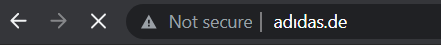

# Introduction


Hash Values (TRIVIAL): SHA1, MD5, SHA256 or other similar hashes that identify a suspicious or malicious file. It is trivial for the adversary to change the value of the hash bypassing the defensive capability: For example, polymorphic or metamorphic techniques.

IP Addresses (EASY): IP addresses are used as an identifier and can be easily hidden by using an anonymous proxy service (like Tor) or they can be changed at high frequency such as leveraging fast flux.

Domain Names (SIMPLE): Domain names (e.g., “internetbadguys.com”) and/or or sub domain (e.g., “exploitkit.internetbadguys.com”). These domains are registered and hosted and can be part of the adversary’s attack infrastructure. The attackers can simply bypass these controls using techniques such as DGAs (Domain Generated Algorithms).

Network Artifacts (ANNOYING): This refers to the ability to determine suspicious or malicious activity from legitimate activity. It goes beyond a user device and includes all Internet of Things (IoT) devices. Examples may include patterns based on network activity (C2 information), Uniform Resource Identifier (URI) patterns, certificates of use, and so on.

Host Artifacts (ANNOYING): This may include an artifact in the registry, a scheduled task, or files dropped within the file system that indicates the presence of malicious activity.

Tools (CHALLENGING): This would typically be software that the adversary brings with them to perform a variety of activities such as creating backdoors for a C2 channel, network sniffers, and password crackers.

Tactics, Techniques and Procedures – TTPs (TOUGH): The tactic provides the description of the behavior, the technique provides more details of the behavior from the perspective of the tactic, and the procedure would provide deep details around the technique itself. Example: The Tactic is “Discovery” and technique being used is “Network Service Scanning.”

# Hash Values (Trivial)

As per Microsoft, the hash value is a numeric value of a fixed length that uniquely identifies data. A hash value is the result of a hashing algorithm. The following are some of the most common hashing algorithms: 

    MD5 (Message Digest, defined by RFC 1321) - was designed by Ron Rivest in 1992 and is a widely used cryptographic hash function with a 128-bit hash value. MD5 hashes are NOT considered cryptographically secure. In 2011, the IETF published RFC 6151, "Updated Security Considerations for the MD5 Message-Digest and the HMAC-MD5 Algorithms," which mentioned a number of attacks against MD5 hashes, including the hash collision.

    SHA-1 (Secure Hash Algorithm 1, defined by RFC 3174) - was invented by United States National Security Agency in 1995. When data is fed to SHA-1 Hashing Algorithm, SHA-1 takes an input and produces a 160-bit hash value string as a 40 digit hexadecimal number. NIST deprecated the use of SHA-1 in 2011 and banned its use for digital signatures at the end of 2013 based on it being susceptible to brute-force attacks. Instead, NIST recommends migrating from SHA-1 to stronger hash algorithms in the SHA-2 and SHA-3 families.

    The SHA-2 (Secure Hash Algorithm 2) - SHA-2 Hashing Algorithm was designed by The National Institute of Standards and Technology (NIST) and the National Security Agency (NSA) in 2001 to replace SHA-1. SHA-2 has many variants, and arguably the most common is SHA-256. The SHA-256 algorithm returns a hash value of 256-bits as a 64 digit hexadecimal number.

A hash is not considered to be cryptographically secure if two files have the same hash value or digest.

Security professionals usually use the hash values to gain insight into a specific malware sample, a malicious or a suspicious file, and as a way to uniquely identify and reference the malicious artifact.

You've probably read ransomware reports in the past, where security researchers would provide the hashes related to the malicious or suspicious files used at the end of the report. You can check out The DFIR Report and FireEye Threat Research Blogs if you’re interested in seeing an example.

Various online tools can be used to do hash lookups like VirusTotal and Metadefender Cloud - OPSWAT.


As you might have noticed, it is really easy to spot a malicious file if we have the hash in our arsenal.  However, as an attacker, modifying a file by even a single bit is trivial, which would produce a different hash value. With so many variations and instances of known malware or ransomware, threat hunting using file hashes as the IOC (Indicators of Compromise) can become difficult.

Let’s take a look at an example of how you can change the hash value of a file by simply appending a string to the end of a file using echo: 

File Hash (Before Modification)
```
PS C:\Users\THM\Downloads> Get-FileHash .\OpenVPN_2.5.1_I601_amd64.msi -Algorithm MD5
Algorithm Hash                             Path                                                 
_________ ____                             ____                                                 
MD5       D1A008E3A606F24590A02B853E955CF7 C:\Users\THM\Downloads\OpenVPN_2.5.1_I601_amd64.msi
```
File Hash (After Modification) 
```
PS C:\Users\THM\Downloads> echo "AppendTheHash" >> .\OpenVPN_2.5.1_I601_amd64.msi
PS C:\Users\THM\Downloads> Get-FileHash .\OpenVPN_2.5.1_I601_amd64.msi -Algorithm MD5
Algorithm Hash                             Path                                                 
_________ ____                             ____                                                 
MD5       9D52B46F5DE41B73418F8E0DACEC5E9F C:\Users\THM\Downloads\OpenVPN_2.5.1_I601_amd64.msi
```

# IP Address (Easy)

An IP address is used to identify any device connected to a network. These devices range from desktops, to servers and even CCTV cameras! We rely on IP addresses to send and receive the information over the network. But we are not going to get into the structure and functionality of the IP address. As a part of the Pyramid of Pain, we’ll evaluate how IP addresses are used as an indicator.

From a defense standpoint, knowledge of the IP addresses an adversary uses can be valuable. A common defense tactic is to block, drop, or deny inbound requests from IP addresses on your parameter or external firewall. This tactic is often not bulletproof as it’s trivial for an experienced adversary to recover simply by using a new public IP address.

Malicious IP connections

### NOTE! Do not attempt to interact with the IP addresses shown above.

One of the ways an adversary can make it challenging to successfully carry out IP blocking is by using Fast Flux.

According to Akamai, Fast Flux is a DNS technique used by botnets to hide phishing, web proxying, malware delivery, and malware communication activities behind compromised hosts acting as proxies. The purpose of using the Fast Flux network is to make the communication between malware and its command and control server (C&C) challenging to be discovered by security professionals. 

So, the primary concept of a Fast Flux network is having multiple IP addresses associated with a domain name, which is constantly changing. Palo Alto created a great fictional scenario to explain Fast Flux: ["Fast Flux 101: How Cybercriminals Improve the Resilience of Their Infrastructure to Evade Detection and Law Enforcement Takedowns"](https://unit42.paloaltonetworks.com/fast-flux-101/)

[Example of anyrun report pdf](task3-anyrun.pdf)

# Domain Names (Simple)

Domain Names can be thought as simply mapping an IP address to a string of text. A domain name can contain a domain and a top-level domain (evilcorp.com) or a sub-domain followed by a domain and top-level domain (tryhackme.evilcorp.com). 

Domain Names can be a little more of a pain for the attacker to change as they would most likely need to purchase the domain, register it and modify DNS records. Unfortunately for defenders, many DNS providers have loose standards and provide APIs to make it even easier for the attacker to change the domain.

Malicious Sodinokibi C2 (Command and Control Infrastructure) domains:




Can you spot anything malicious in the above screenshot? Now, compare it to the legitimate website view below:


This is one of the examples of a Punycode attack used by the attackers to redirect users to a malicious domain that seems legitimate at first glance.

What is Punycode? As per Wandera, "Punycode is a way of converting words that cannot be written in ASCII, into a Unicode ASCII encoding."

What you saw in the URL above is ```adıdas.de``` which has the Punycode of ```xn--addas-o4a.de```

Internet Explorer, Google Chrome, Microsoft Edge, and Apple Safari are now pretty good at translating the obfuscated characters into the full Punycode domain name.

To detect malicious domains, proxy logs or web server logs can be used.

Attackers usually hide the malicious domains under URL shorteners. A URL Shortener is a tool that creates a short and unique URL that will redirect to the specific website specified during the initial step of setting up the URL Shortener link. The attackers normally use the following URL-shortening services to generate malicious links: 

    bit.ly
    goo.gl
    ow.ly
    s.id
    smarturl.it
    tiny.pl
    tinyurl.com
    x.co

You can see the actual website the shortened link is redirecting you to by appending "+" to it (see the examples below). Type the shortened URL in the address bar of the web browser and add the above characters to see the redirect URL. 

NOTE: The examples of the shortened links below are non-existent.


Viewing Connections in Any.run:

Because Any.run is a sandboxing service that executes the sample, we can review any connections such as HTTP requests, DNS requests or processes communicating with an IP address. To do so, we can look at the "networking" tab located just below the snapshot of the machine.

Please note: you should be extremely cautious about visiting any of the IP addresses or HTTP requests made in a report. After all, these are behaviours from the malware sample - so they're probably doing something dangerous!

HTTP Requests:

This tab shows the recorded HTTP requests since the detonation of the sample. This can be useful to see what resources are being retrieved from a webserver, such as a dropper or a callback.


Connections:

This tab shows any communications made since the detonation of the sample. This can be useful to see if a process communicates with another host. For example, this could be C2 traffic, uploading/downloading files over FTP, etc.


DNS Requests:

This tab shows the DNS requests made since the detonation of the sample. Malware often makes DNS requests to check for internet connectivity (I.e. if It can't reach the internet/call home, then it's probably being sandboxed or is useless). 


[Check this report on any.run](https://app.any.run/tasks/a66178de-7596-4a05-945d-704dbf6b3b90)

# Host Artifacts (Annoying)

On this level, the attacker will feel a little more annoyed and frustrated if you can detect the attack. The attacker would need to circle back at this detection level and change his attack tools and methodologies. This is very time-consuming for the attacker, and probably, he will need to spend more resources on his adversary tools.

Host artifacts are the traces or observables that attackers leave on the system, such as registry values, suspicious process execution, attack patterns or IOCs (Indicators of Compromise), files dropped by malicious applications, or anything exclusive to the current threat.

Suspicious process execution from Word: 


Suspicious events followed by opening a malicious application: 


The files modified/dropped by the malicious actor:


[Task report from any.run pdf](task5-report.pdf)


# Network Artifacts (Annoying)

A network artifact can be a user-agent string, C2 information, or URI patterns followed by the HTTP POST requests.An attacker might use a User-Agent string that hasn’t been observed in your environment before or seems out of the ordinary. The User-Agent is defined by RFC2616 as the request-header field that contains the information about the user agent originating the request.

Network artifacts can be detected in Wireshark PCAPs (file that contains the packet data of a network) by using a network protocol analyzer such as TShark or exploring IDS (Intrusion Detection System) logging from a source such as Snort.

HTTP POST requests containing suspicious strings:


Let's use TShark to filter out the User-Agent strings by using the following command:
```
tshark --Y http.request -T fields -e http.host -e http.user_agent -r analysis_file.pcap
```

These are the most common User-Agent strings found for the Emotet Downloader Trojan

If you can detect the custom User-Agent strings that the attacker is using, you might be able to block them, creating more obstacles and making their attempt to compromise the network more annoying.

In this example the browser uses the User-Agent string shown in the screenshot above is Internet Explorer

https://user-agents.net/string/mozilla-4-0-compatible-msie-7-0-windows-nt-6-1-trident-7-0-slcc2-net-clr-2-0-50727-net-clr-3-5-30729-net-clr-3-0-30729-media-center-pc-6-0-net4-0c-net4-0e-tablet-pc-2-0-mozilla-4-0-compatible-msie-7-0-windows-nt-6-1-99790119bd400a023a3a94bd86a8d6a3ba940dde

# Tools (Challenging)

At this stage, we have levelled up our detection capabilities against the artifacts. The attacker would most likely give up trying to break into your network or go back and try to create a new tool that serves the same purpose. It will be a game over for the attackers as they would need to invest some money into building a new tool (if they are capable of doing so), find the tool that has the same potential, or even gets some training to learn how to be proficient in a certain tool. 

Attackers would use the utilities to create malicious macro documents (maldocs) for spearphishing attempts, a backdoor that can be used to establish C2 (Command and Control Infrastructure), any custom .EXE, and .DLL files, payloads, or password crackers.

A Trojan dropped the suspicious "Stealer.exe" in the Temp folder:


The execution of the suspicious binary:


Antivirus signatures, detection rules, and YARA rules can be great weapons for you to use against attackers at this stage.

MalwareBazaar and Malshare are good resources to provide you with access to the samples, malicious feeds, and YARA results - these all can be very helpful when it comes to threat hunting and incident response. 

For detection rules, SOC Prime Threat Detection Marketplace is a great platform, where security professionals share their detection rules for different kinds of threats including the latest CVE's that are being exploited in the wild by adversaries. 

Fuzzy hashing is also a strong weapon against the attacker's tools. Fuzzy hashing helps you to perform similarity analysis - match two files with minor differences based on the fuzzy hash values. One of the examples of fuzzy hashing is the usage of SSDeep; on the SSDeep official website, you can also find the complete explanation for fuzzy hashing. 

Fuzzy hashing a.k.a. Context Triggered Piecewise Hashing (CTPH)

Example of SSDeep from VirusTotal:


# TTPs (Tough)

TTPs stands for Tactics, Techniques & Procedures. This includes the whole MITRE ATT&CK Matrix, which means all the steps taken by an adversary to achieve his goal, starting from phishing attempts to persistence and data exfiltration. 

If you can detect and respond to the TTPs quickly, you leave the adversaries almost no chance to fight back. For, example if you could detect a Pass-the-Hash attack using Windows Event Log Monitoring and remediate it, you would be able to find the compromised host very quickly and stop the lateral movement inside your network. At this point, the attacker would have two options:

   1. Go back, do more research and training, reconfigure their custom tools
   2. Give up and find another target

https://attack.mitre.org/

MITRE ATT&CK® is a globally-accessible knowledge base of adversary tactics and techniques based on real-world observations. The ATT&CK knowledge base is used as a foundation for the development of specific threat models and methodologies in the private sector, in government, and in the cybersecurity product and service community.

