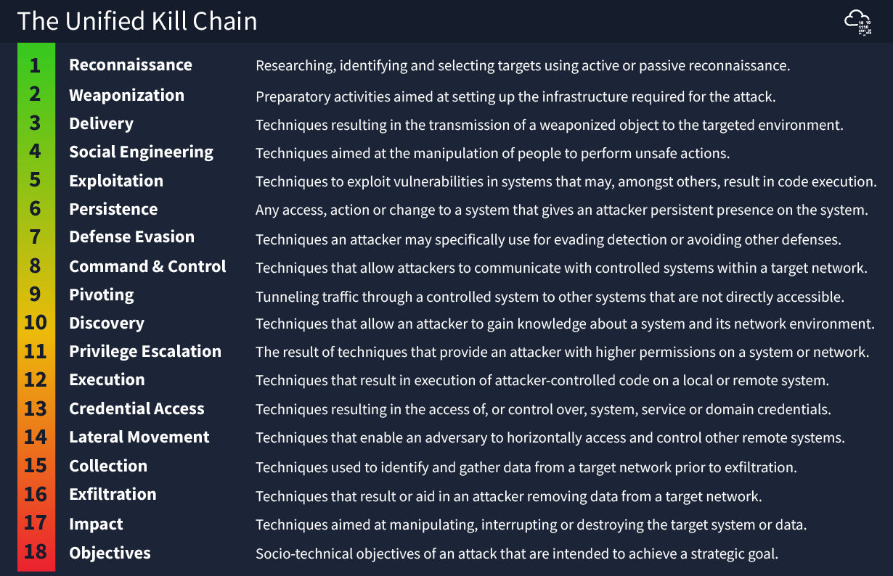
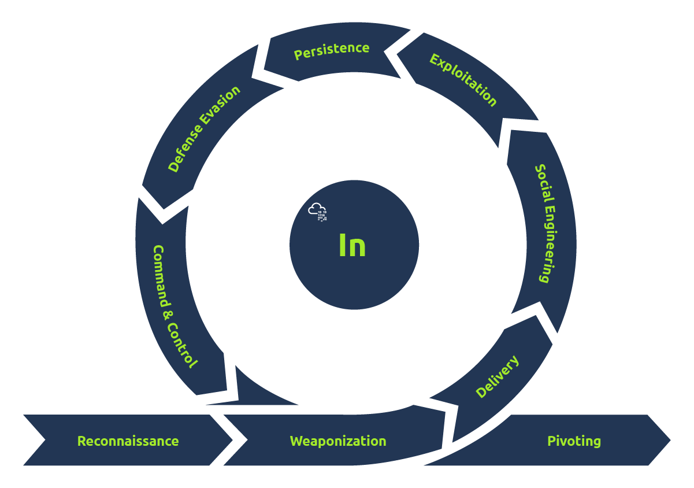
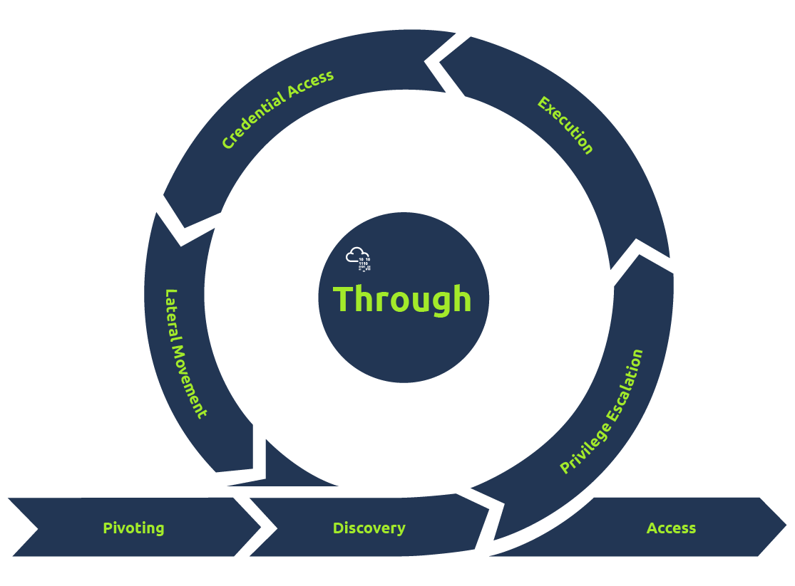
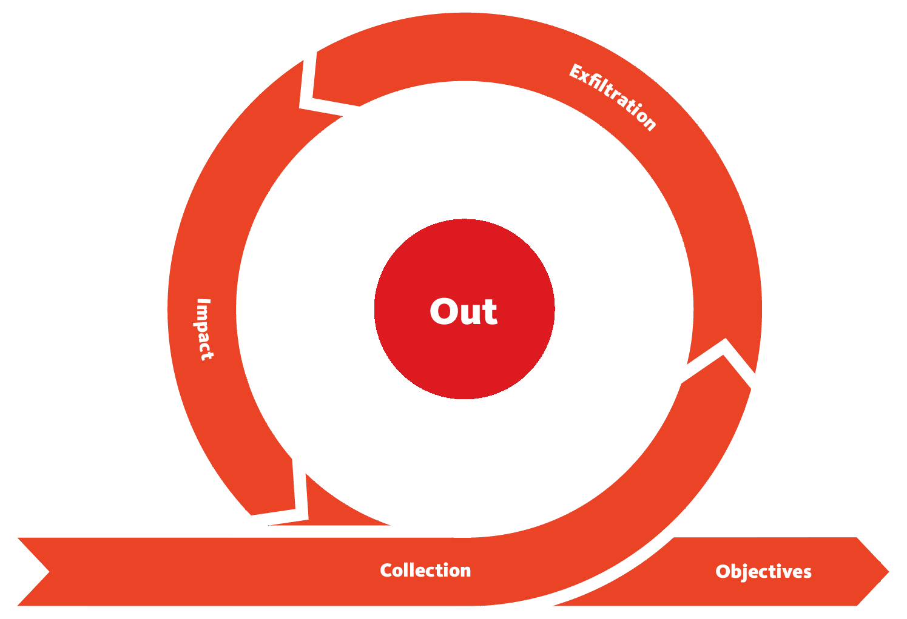

# What is a "Kill Chain"

Originating from the military, a “Kill Chain” is a term used to explain the various stages of an attack. In the realm of cybersecurity, a “Kill Chain” is used to describe the methodology/path attackers such as hackers or APTs use to approach and intrude a target.

For example, an attacker scanning, exploiting a web vulnerability, and escalating privileges will be a “Kill Chain”. We will come to explain these stages in much further detail later in this room.

The objective is to understand an attacker's “Kill Chain” so that defensive measures can be put in place to either pre-emptively protect a system or disrupt an attacker's attempt.

# What is "Threat Modelling"

Threat modelling, in a cybersecurity context, is a series of steps to ultimately improve the security of a system. Threat modelling is about identifying risk and essentially boils down to:

    Identifying what systems and applications need to be secured and what function they serve in the environment. For example, is the system critical to normal operations, and is a system holding sensitive information like payment info or addresses?

    Assessing what vulnerabilities and weaknesses these systems and applications may have and how they could be potentially exploited

    Creating a plan of action to secure these systems and applications from the vulnerabilities highlighted

    Putting in policies to prevent these vulnerabilities from occurring again where possible (for example, implementing a software development life cycle (SDLC) for an application or training employees on phishing awareness).

Threat modelling is an important procedure in reducing the risk within a system or application, as it creates a high-level overview of an organisation's IT assets (an asset in IT is a piece of software or hardware) and the procedures to resolve vulnerabilities.

The UKC can encourage threat modelling as the UKC framework helps identify potential attack surfaces and how these systems may be exploited.

STRIDE, DREAD and CVSS (to name a few) are all frameworks specifically used in threat modelling. If you are interested to learn more, check out the “Principles of Security” room on TryHackMe.

# Introducing the Unified Kill Chain

To continue from the previous task, Paul Pols' Unified Kill Chain, published in 2017, aims to complement (not compete with) other cybersecurity kill chain frameworks, such as Lockheed Martin’s and MITRE’s ATT&CK.

The UKC states that there are 18 phases to an attack: Everything from reconnaissance to data exfiltration and understanding an attacker's motive. These phases have been grouped together in this room into a few areas of focus for brevity, which will be detailed in the remaining tasks.

Some large benefits of the UKC over traditional cybersecurity kill chain frameworks include the fact that it is modern and extremely detailed (reminder: it has 18 phases officially, whereas other frameworks may have a small handful)

<table class="table table-bordered"><tbody><tr><td><b>Benefits of the Unified Kill Chain (UKC) Framework</b></td><td><b>How do Other Frameworks Compare?</b></td></tr><tr><td>Modern (released in 2017, updated in 2022). </td><td>Some frameworks, such as MITRE’s were released in 2013, when the cybersecurity landscape was very different. </td></tr><tr><td>The UKC is extremely detailed (18 phases). </td><td>Other frameworks often have a small handful of phases. </td></tr><tr><td>The UKC covers an entire attack - from reconnaissance, exploitation, post-exploitation and includes identifying an attacker's motivation. </td><td>Other frameworks cover a limited amount of phases. </td></tr><tr><td>The UKC highlights a much more realistic attack scenario. Various stages will often re-occur. For example, after exploiting a machine, an attacker will begin reconnaissance to pivot another system. </td><td>Other frameworks do not account for the fact that an attacker will go back and forth between the various phases during an attack. </td></tr></tbody></table>

# Phase: In (Initial Foothold)

The main focus of this series of phases is for an attacker to gain access to a system or networked environment.

An attacker will employ numerous tactics to investigate the system for potential vulnerabilities that can be exploited to gain a foothold in the system. For example, a common tactic is the use of reconnaissance against a system to discover potential attack vectors (such as applications and services).

This series of phases also accommodates for an attacker creating a form of persistence (such as files or a process that allows the attacker to connect to the machine at any time). Finally, the UKC accounts for the fact that attackers will often use a combination of the tactics listed above.

We will explore the different phases of this section of the UKC in the headings below:

## Reconnaissance (MITRE Tactic TA0043)

This phase of the UKC describes techniques that an adversary employs to gather information relating to their target. This can be achieved through means of passive and active reconnaissance. The information gathered during this phase is used all throughout the later stages of the UKC (such as the initial foothold).

Information gathered from this phase can include:

    Discovering what systems and services are running on the target, this is beneficial information in the weaponisation and exploitation phases of this section. 
    Finding contact lists or lists of employees that can be impersonated or used in either a social engineering or phishing attack.
    Looking for potential credentials that may be of use in later stages,  such as pivoting or initial access.
    Understanding the network topology and other networked systems can be used to pivot too. 

## Weaponization (MITRE Tactic TA0001)

This phase of the UKC describes the adversary setting up the necessary infrastructure to perform the attack. For example, this could be setting up a command and control server, or a system capable of catching reverse shells and delivering payloads to the system.

## Social Engineering (MITRE Tactic TA0001)

This phase of the UKC describes techniques that an adversary can employ to manipulate employees to perform actions that will aid in the adversaries attack. For example, a social engineering attack could include:

    Getting a user to open a malicious attachment.
    Impersonating a web page and having the user enter their credentials.
    Calling or visiting the target and impersonating a user (for example, requesting a password reset) or being able to gain access to areas of a site that the attacker would not previously be capable of (for example, impersonating a utility engineer).

## Exploitation (MITRE Tactic TA0002)

This phase of the UKC describes how an attacker takes advantage of weaknesses or vulnerabilities present in a system. The UKC defines "Exploitation" as abuse of vulnerabilities to perform code execution. For example:

    Uploading and executing a reverse shell to a web application.
    Interfering with an automated script on the system to execute code.
    Abusing a web application vulnerability to execute code on the system it is running on.

## Persistence (MITRE Tactic TA0003)

This phase of the UKC is rather short and simple. Specifically, this phase of the UKC describes the techniques an adversary uses to maintain access to a system they have gained an initial foothold on. For example:

    Creating a service on the target system that will allow the attacker to regain access.
    Adding the target system to a Command & Control server where commands can be executed remotely at any time.
    Leaving other forms of backdoors that execute when a certain action occurs on the system (i.e. a reverse shell will execute when a system administrator logs in).

## Defence Evasion (MITRE Tactic TA0005)

The "Defence Evasion" section of the UKC is one of the more valuable phases of the UKC. This phase specifically is used to understand the techniques an adversary uses to evade defensive measures put in place in the system or network. For example, this could be:

    Web application firewalls.
    Network firewalls.
    Anti-virus systems on the target machine.
    Intrusion detection systems.

This phase is valuable when analysing an attack as it helps form a response and better yet - gives the defensive team information on how they can improve their defence systems in the future.

## Command & Control (MITRE Tactic TA0011)

The "Command & Control" phase of the UKC combines the efforts an adversary made during the "Weaponization" stage of the UKC to establish communications between the adversary and target system.

An adversary can establish command and control of a target system to achieve its action on objectives. For example, the adversary can:

    Execute commands.
    Steal data, credentials and other information.
    Use the controlled server to pivot to other systems on the network.

## Pivoting (MITRE Tactic TA0008)

"Pivoting" is the technique an adversary uses to reach other systems within a network that are not otherwise accessible (for example, they are not exposed to the internet). There are often many systems in a network that are not directly reachable and often contain valuable data or have weaker security.

For example, an adversary can gain access to a web server that is publically accessible to attack other systems that are within the same network (but are not accessible via the internet).

# Phase: Through (Network Propagation)

This phase follows a successful foothold being established on the target network. An attacker would seek to gain additional access and privileges to systems and data to fulfil their goals. The attacker would set up a base on one of the systems to act as their pivot point and use it to gather information about the internal network.

## Pivoting (MITRE Tactic TA0008)

Once the attacker has access to the system, they would use it as their staging site and a tunnel between their command operations and the victim’s network. The system would also be used as the distribution point for all malware and backdoors at later stages.

## Discovery (MITRE Tactic TA0007)

The adversary would uncover information about the system and the network it is connected to. Within this stage, the knowledge base would be built from the active user accounts, the permissions granted, applications and software in use, web browser activity, files, directories and network shares, and system configurations.
Privilege Escalation (MITRE Tactic TA0004)

Following their knowledge-gathering, the adversary would try to gain more prominent permissions within the pivot system. They would leverage the information on the accounts present with vulnerabilities and misconfigurations found to elevate their access to one of the following superior levels:

    SYSTEM/ ROOT.
    Local Administrator.
    A user account with Admin-like access.
    A user account with specific access or functions.

## Execution (MITRE Tactic TA0002)

This is where they deploy their malicious code using the pivot system as their host. Remote trojans, C2 scripts, malicious links and scheduled tasks are deployed and created to facilitate a recurring presence on the system and uphold their persistence.

## Credential Access (MITRE Tactic TA0006)

Working hand in hand with the Privilege Escalation stage, the adversary would attempt to steal account names and passwords through various methods, including keylogging and credential dumping. This makes them harder to detect during their attack as they would be using legitimate credentials.

## Lateral Movement (MITRE Tactic TA0008)

With the credentials and elevated privileges, the adversary would seek to move through the network and jump onto other targeted systems to achieve their primary objective. The stealthier the technique used, the better.

# Phase: Out (Action on Objectives)

This phase wraps up the journey of an adversary’s attack on an environment, where they have critical asset access and can fulfil their attack goals. These goals are usually geared toward compromising the confidentiality, integrity and availability (CIA) triad.

The tactics to be deployed by an attacker would include:
## Collection MITRE Tactic (TA0009)

After all the hunting for access and assets, the adversary will be seeking to gather all the valuable data of interest. This, in turn, compromises the confidentiality of the data and would lead to the next attack stage – Exfiltration. The main target sources include drives, browsers, audio, video and email.

## Exfiltration (MITRE Tactic TA0010)

To elevate their compromise, the adversary would seek to steal data, which would be packaged using encryption measures and compression to avoid any detection. The C2 channel and tunnel deployed in the earlier phases will come in handy during this process.

## Impact (MITRE Tactic TA0040)

If the adversary seeks to compromise the integrity and availability of the data assets, they would manipulate, interrupt or destroy these assets. The goal would be to disrupt business and operational processes and may involve removing account access, disk wipes, and data encryption such as ransomware, defacement and denial of service (DoS) attacks.

## Objectives

With all the power and access to the systems and network, the adversary would seek to achieve their strategic goal for the attack.

For example, if the attack was financially motivated, they may seek to encrypt files and systems with ransomware and ask for payment to release the data. In other instances, the attacker may seek to damage the reputation of the business, and they would release private and confidential information to the public.

