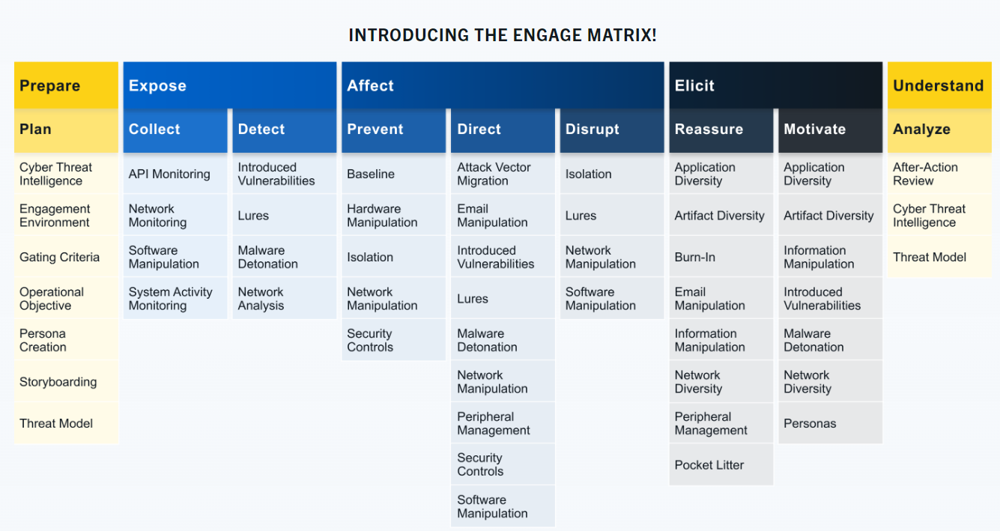

# Introduction to MITRE

For those that are new to the cybersecurity field, you probably never heard of MITRE. Those of us that have been around might only associate MITRE with CVEs (Common Vulnerabilities and Exposures) list, which is one resource you'll probably check when searching for an exploit for a given vulnerability. But MITRE researches in many areas, outside of cybersecurity, for the 'safety, stability, and well-being of our nation.'  These areas include artificial intelligence, health informatics, space security, to name a few.

From Mitre.org: "At MITRE, we solve problems for a safer world. Through our federally funded R&D centers and public-private partnerships, we work across government to tackle challenges to the safety, stability, and well-being of our nation."

In this room, we will focus on other projects/research that the US-based non-profit MITRE Corporation has created for the cybersecurity community, specifically:

    ATT&CK® (Adversarial Tactics, Techniques, and Common Knowledge) Framework
    CAR (Cyber Analytics Repository) Knowledge Base
    ENGAGE (sorry, not a fancy acronym)
    D3FEND (Detection, Denial, and Disruption Framework Empowering Network Defense)
    AEP (ATT&CK Emulation Plans)

# Basic Terminology

Before diving in, let's briefly discuss a few terms that you will often hear when dealing with the framework, threat intelligence, etc.

APT is an acronym for Advanced Persistent Threat. This can be considered a team/group (threat group), or even country (nation-state group), that engages in long-term attacks against organizations and/or countries. The term 'advanced' can be misleading as it will tend to cause us to believe that each APT group all have some super-weapon, e.i. a zero-day exploit, that they use. That is not the case. As we will see a bit later, the techniques these APT groups use are quite common and can be detected with the right implementations in place. You can view FireEye's current list of APT groups here.  

TTP is an acronym for Tactics, Techniques, and Procedures, but what does each of these terms mean?

    The Tactic is the adversary's goal or objective.
    The Technique is how the adversary achieves the goal or objective.
    The Procedure is how the technique is executed.

# ATT&CK® Framework

What is the ATT&CK® framework? According to the website, "MITRE ATT&CK® is a globally-accessible knowledge base of adversary tactics and techniques based on real-world observations." In 2013, MITRE began to address the need to record and document common TTPs (Tactics, Techniques, and Procedures) that APT (Advanced Persistent Threat) groups used against enterprise Windows networks. This started with an internal project known as FMX (Fort Meade Experiment). Within this project, selected security professionals were tasked to emulated adversarial TTPs against a network, and data was collected from the attacks on this network. The gathered data helped construct the beginning pieces of what we know today as the ATT&CK® framework.

The ATT&CK® framework has grown and expanded throughout the years. One notable expansion was that the framework focused solely on the Windows platform but has expanded to cover other platforms, such as macOS and Linux. The framework is heavily contributed to by many sources, such as security researchers and threat intelligence reports. Note this is not only a tool for blue teamers. The tool is also useful for red teamers.

If you haven't done so, navigate to the ATT&CK® website.

Direct your attention to the bottom of the page to view the ATT&CK® Matrix for Enterprise. Across the top of the matrix, there are 14 categories. Each category contains the techniques an adversary could use to perform the tactic. The categories cover the seven-stage Cyber Attack Lifecycle (credit Lockheed Martin for the Cyber Kill Chain).

# CAR Knowledge Base

Cyber Analytics Repository

The official definition of CAR is "The MITRE Cyber Analytics Repository (CAR) is a knowledge base of analytics developed by MITRE based on the MITRE ATT&CK® adversary model. CAR defines a data model that is leveraged in its pseudocode representations but also includes implementations directly targeted at specific tools (e.g., Splunk, EQL) in its analytics. With respect to coverage, CAR is focused on providing a set of validated and well-explained analytics, in particular with regards to their operating theory and rationale."

Instead of further attempting to explain what CAR is, let's dive in. With our newly acquired knowledge from the previous section, we should feel comfortable and understand the information that CAR is providing to us.

Let's begin our journey by reviewing CAR-2020-09-001: Scheduled Task - File Access. https://car.mitre.org/analytics/CAR-2020-09-001/

# MITRE Engage

Per the website, "MITRE Engage is a framework for planning and discussing adversary engagement operations that empowers you to engage your adversaries and achieve your cybersecurity goals."

MITRE Engage is considered an Adversary Engagement Approach. This is accomplished by the implementation of Cyber Denial and Cyber Deception. 

With Cyber Denial we prevent the adversary's ability to conduct their operations and with Cyber Deception we intentionally plant artifacts to mislead the adversary. 

The Engage website provides a [starter kit](https://engage.mitre.org/starter-kit/) to get you 'started' with the Adversary Engagement Approach. The starter kit is a collection of whitepapers and PDFs explaining various checklists, methodologies, and processes to get you started. 

As with MITRE ATT&CK, Engage has its own matrix. Below is a visual of the Engage Matrix.

Let's quickly explain each of these categories based on the information on the Engage website.

    Prepare the set of operational actions that will lead to your desired outcome (input)
    
    Expose adversaries when they trigger your deployed deception activities 
    
    Affect adversaries by performing actions that will have a negative impact on their operations
    
    Elicit information by observing the adversary and learn more about their modus operandi (TTPs)
    
    Understand the outcomes of the operational actions (output) 

Refer to the [Engage Handbook](EngageHandbook-v1.0.pdf) to learn more. 

You can interact with the [Engage Matrix Explorer](https://engage.mitre.org/matrix). We can filter by information from MITRE ATT&CK. 

# MITRE D3FEND

What is this MITRE resource? Per the D3FEND website, this resource is "A knowledge graph of cybersecurity countermeasures."

D3FEND is still in beta and is funded by the Cybersecurity Directorate of the NSA. 

D3FEND stands for Detection, Denial, and Disruption Framework Empowering Network Defense. 

At the time of this writing, there are 718 artifacts in the D3FEND matrix. 

 you're provided with information on what is the technique (definition), how the technique works (how it works), things to think about when implementing the technique (considerations), and how to utilize the technique (example).

Note, as with other MITRE resources, you can filter based on the ATT&CK matrix. 

# ATT&CK® Emulation Plans

If these tools provided to us by MITRE are not enough, under MITRE ENGENUITY, we have CTID, the Adversary Emulation Library, and ATT&CK® Emulation Plans.

CTID

MITRE formed an organization named The Center of Threat-Informed Defense (CTID). This organization consists of various companies and vendors from around the globe. Their objective is to conduct research on cyber threats and their TTPs and share this research to improve cyber defense for all. 

Some of the companies and vendors who are participants of CTID:

    AttackIQ (founder)
    Verizon
    Microsoft (founder)
    Red Canary (founder)
    Splunk

Per the website, "Together with Participant organizations, we cultivate solutions for a safer world and advance threat-informed defense with open-source software, methodologies, and frameworks. By expanding upon the MITRE ATT&CK knowledge base, our work expands the global understanding of cyber adversaries and their tradecraft with the public release of data sets critical to better understanding adversarial behavior and their movements."

Adversary Emulation Library & ATT&CK® Emulations Plans

The Adversary Emulation Library is a public library making adversary emulation plans a free resource for blue/red teamers. The library and the emulations are a contribution from CTID. There are several[ ATT&CK® Emulation Plans](https://github.com/center-for-threat-informed-defense/adversary_emulation_library) currently available: APT3, APT29, and FIN6. The emulation plans are a step-by-step guide on how to mimic the specific threat group. If any of the C-Suite were to ask, "how would we fare if APT29 hits us?" This can easily be answered by referring to the results of the execution of the emulation plan.

https://attack.mitre.org/resources/adversary-emulation-plans/

https://github.com/center-for-threat-informed-defense/adversary_emulation_library/tree/master/apt29

https://github.com/center-for-threat-informed-defense/adversary_emulation_library/tree/master/fin6

[APT3 pdf](APT3_Adversary_Emulation_Plan.pdf)

# ATT&CK® and Threat Intelligence

Threat Intelligence (TI) or Cyber Threat Intelligence (CTI) is the information, or TTPs, attributed to the adversary. By using threat intelligence, as defenders, we can make better decisions regarding the defensive strategy. Large corporations might have an in-house team whose primary objective is to gather threat intelligence for other teams within the organization, aside from using threat intel already readily available. Some of this threat intel can be open source or through a subscription with a vendor, such as CrowdStrike. In contrast, many defenders wear multiple hats (roles) within some organizations, and they need to take time from their other tasks to focus on threat intelligence. To cater to the latter, we'll work on a scenario of using ATT&CK® for threat intelligence. The goal of threat intelligence is to make the information actionable. 

Scenario: You are a security analyst who works in the aviation sector. Your organization is moving their infrastructure to the cloud. Your goal is to use the ATT&CK® Matrix to gather threat intelligence on APT groups who might target this particular sector and use techniques targeting your areas of concern. You are checking to see if there are any gaps in coverage. After selecting a group, look over the selected group's information and their tactics, techniques, etc. 

Q1 What is a group that targets your sector who has been in operation since at least 2013?

For this question, we can go back to the MITRE ATT&CK page (https://attack.mitre.org/). From here, we will hover the “CTI” drop down at the top right and select “Groups”. Now, we can simply ctrl + f for “Aviation”.

A1 APT33

Q2 As your organization is migrating to the cloud, is there anything attributed to this APT group that you should focus on? If so, what is it?

A2 Cloud Accounts

Q3 What tool is associated with the technique from the previous question?

A3 Ruler

Q4 Referring to the technique from question 2, what mitigation method suggests using SMS messages as an alternative for its implementation?

A4 Multi-factor Authentication 

Q5 What platforms does the technique from question #2 affect?

A5 IaaS, Identity Provider, Office Suite, SaaS 

A lot of Ctrl+F for keywords will help find the answers

# Conclusion

In this room, we explored tools/resources that MITRE has provided to the security community. The room's goal was to expose you to these resources and give you a foundational knowledge of their uses. Many vendors of security products and security teams across the globe consider these contributions from MITRE invaluable in the day-to-day efforts to thwart evil. The more information we have as defenders, the better we are equipped to fight back. Some of you might be looking to transition to become a SOC analyst, detection engineer, cyber threat analyst, etc. these tools/resources are a must to know.

As mentioned before, though, this is not only for defenders. As red teamers, these tools/resources are useful as well. Your objective is to mimic the adversary and attempt to bypass all the controls in place within the environment. With these resources, as the red teamer, you can effectively mimic a true adversary and communicate your findings in a common language that both sides can understand. In a nutshell, this is known as purple teaming.  

