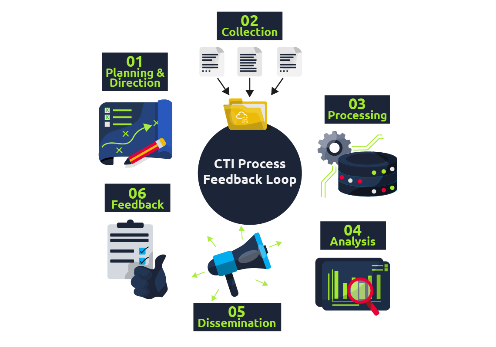
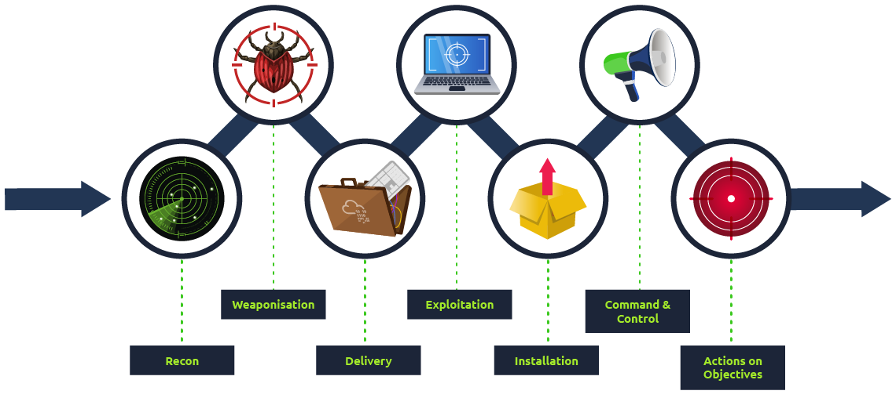

# Introduction

## Introduction
This room will introduce you to cyber threat intelligence (CTI) and various frameworks used to share intelligence. As security analysts, CTI is vital for investigating and reporting against adversary attacks with organisational stakeholders and external communities.

## Learning Objectives

    The basics of CTI and its various classifications.
    The lifecycle followed to deploy and use intelligence during threat investigations.
    Frameworks and standards used in distributing intelligence.

## Cyber Threat Intelligence Module

This is the first room in a new Cyber Threat Intelligence module. The module will also contain:

    Threat Intelligence Tools
    YARA
    OpenCTI
    MISP

# Cyber Threat Intelligence

Cyber Threat Intelligence (CTI) can be defined as evidence-based knowledge about adversaries, including their indicators, tactics, motivations, and actionable advice against them. These can be utilised to protect critical assets and inform cyber security teams and management business decisions.

It would be typical to use the terms “data”, “information”, and “intelligence” interchangeably. However, let us distinguish between them to understand better how CTI comes into play.An image depicting data from the web, servers and firewalls being collected through a funnel and being sorted.

<b>Data</b>: Discrete indicators associated with an adversary, such as IP addresses, URLs or hashes.

<b>Information</b>: A combination of multiple data points that answer questions such as “How many times have employees accessed tryhackme.com within the month?”

<b>Intelligence</b>: The correlation of data and information to extract patterns of actions based on contextual analysis.

The primary goal of CTI is to understand the relationship between your operational environment and your adversary and how to defend your environment against any attacks. You would seek this goal by developing your cyber threat context by trying to answer the following questions:

    Who’s attacking you?
    What are their motivations?
    What are their capabilities?
    What artefacts and indicators of compromise (IOCs) should you look out for?

With these questions, threat intelligence would be gathered from different <b>sources</b> under the following categories:

    Internal:
        Corporate security events such as vulnerability assessments and incident response reports.
        Cyber awareness training reports.
        System logs and events.
    Community:
        Open web forums.
        Dark web communities for cybercriminals.
    External
        Threat intel feeds (Commercial & Open-source)
        Online marketplaces.
        Public sources include government data, publications, social media, financial and industrial assessments.

Threat Intelligence Classifications

Threat Intel is geared towards understanding the relationship between your operational environment and your adversary. With this in mind, we can break down threat intel into the following classifications: 

    Strategic Intel: High-level intel that looks into the organisation’s threat landscape and maps out the risk areas based on trends, patterns and emerging threats that may impact business decisions.

    Technical Intel: Looks into evidence and artefacts of attack used by an adversary. Incident Response teams can use this intel to create a baseline attack surface to analyse and develop defence mechanisms.

    Tactical Intel: Assesses adversaries’ tactics, techniques, and procedures (TTPs). This intel can strengthen security controls and address vulnerabilities through real-time investigations.

    Operational Intel: Looks into an adversary’s specific motives and intent to perform an attack. Security teams may use this intel to understand the critical assets available in the organisation (people, processes and technologies) that may be targeted.

# CTI Lifecycle

Threat intel is obtained from a data-churning process that transforms raw data into contextualised and action-oriented insights geared towards triaging security incidents. The transformational process follows a six-phase cycle:

## Direction
Every threat intel program requires to have objectives and goals defined, involving identifying the following parameters:

    Information assets and business processes that require defending.
    Potential impact to be experienced on losing the assets or through process interruptions.
    Sources of data and intel to be used towards protection.
    Tools and resources that are required to defend the assets.

This phase also allows security analysts to pose questions related to investigating incidents.

## Collection
Once objectives have been defined, security analysts will gather the required data to address them. Analysts will do this by using commercial, private and open-source resources available. Due to the volume of data analysts usually face, it is recommended to automate this phase to provide time for triaging incidents.

## Processing
Raw logs, vulnerability information, malware and network traffic usually come in different formats and may be disconnected when used to investigate an incident. This phase ensures that the data is extracted, sorted, organised, correlated with appropriate tags and presented visually in a usable and understandable format to the analysts. SIEMs are valuable tools for achieving this and allow quick parsing of data.

## Analysis
Once the information aggregation is complete, security analysts must derive insights. Decisions to be made may involve:

    Investigating a potential threat through uncovering indicators and attack patterns.
    Defining an action plan to avert an attack and defend the infrastructure.
    Strengthening security controls or justifying investment for additional resources.

## Dissemination
Different organisational stakeholders will consume the intelligence in varying languages and formats. For example, C-suite members will require a concise report covering trends in adversary activities, financial implications and strategic recommendations. At the same time, analysts will more likely inform the technical team about the threat IOCs, adversary TTPs and tactical action plans.

## Feedback
The final phase covers the most crucial part, as analysts rely on the responses provided by stakeholders to improve the threat intelligence process and implementation of security controls. Feedback should be regular interaction between teams to keep the lifecycle working.

# CTI Standards & Frameworks

Standards and frameworks provide structures to rationalise the distribution and use of threat intel across industries. They also allow for common terminology, which helps in collaboration and communication. Here, we briefly look at some essential standards and frameworks commonly used.

## MITRE ATT&CK
The ATT&CK framework is a knowledge base of adversary behaviour, focusing on the indicators and tactics. Security analysts can use the information to be thorough while investigating and tracking adversarial behaviour.

## TAXII

The Trusted Automated eXchange of Indicator Information (TAXII) defines protocols for securely exchanging threat intel to have near real-time detection, prevention and mitigation of threats. The protocol supports two sharing models:

    - Collection: Threat intel is collected and hosted by a producer upon request by users using a request-response model.
    - Channel: Threat intel is pushed to users from a central server through a publish-subscribe model.

https://oasis-open.github.io/cti-documentation/taxii/intro

## STIX

Structured Threat Information Expression (STIX) is a language developed for the "specification, capture, characterisation and communication of standardised cyber threat information". It provides defined relationships between sets of threat info such as observables, indicators, adversary TTPs, attack campaigns, and more.

https://oasis-open.github.io/cti-documentation/stix/intro

## Cyber Kill Chain

Developed by Lockheed Martin, the Cyber Kill Chain breaks down adversary actions into steps. This breakdown helps analysts and defenders identify which stage-specific activities occurred when investigating an attack. The phases defined are shown in the image below.

<table>
<thead><tr><th>Technique</th><th>Purpose</th><th>Examples</th></tr></thead><tbody><tr><td style="text-align:left">Reconnaissance</td><td style="text-align:left">Obtain information about the victim and the tactics used for the attack.</td><td style="text-align:left">Harvesting emails, OSINT, and social media, network scans</td></tr><tr><td style="text-align:left">Weaponisation</td><td style="text-align:left">Malware is engineered based on the needs and intentions of the attack.</td><td style="text-align:left">Exploit with a backdoor, malicious office document</td></tr><tr><td style="text-align:left">Delivery</td><td style="text-align:left">Covers how the malware would be delivered to the victim's system.</td><td style="text-align:left">Email, weblinks, USB</td></tr><tr><td style="text-align:left">Exploitation</td><td style="text-align:left">Breach the victim's system vulnerabilities to execute code and create scheduled jobs to establish persistence. </td><td style="text-align:left">EternalBlue, Zero-Logon, etc.</td></tr><tr><td style="text-align:left">Installation</td><td style="text-align:left">Install malware and other tools to gain access to the victim's system.</td><td style="text-align:left">Password dumping, backdoors, remote access trojans</td></tr><tr><td style="text-align:left">Command &amp; Control</td><td style="text-align:left">Remotely control the compromised system, deliver additional malware, move across valuable assets and elevate privileges.</td><td style="text-align:left">Empire, Cobalt Strike, etc.</td></tr><tr><td style="text-align:left">Actions on Objectives</td><td style="text-align:left">Fulfil the intended goals for the attack: financial gain, corporate espionage, and data exfiltration.</td><td style="text-align:left">Data encryption, ransomware, public defacement</td></tr></tbody>
</table>

Over time, the kill chain has been expanded using other frameworks such as ATT&CK and formulated a new Unified Kill Chain.

## The Diamond Model

The diamond model looks at intrusion analysis and tracking attack groups over time. It focuses on four key areas, each representing a different point on the diamond. These are:

    - Adversary: The focus here is on the threat actor behind an attack and allows analysts to identify the motive behind the attack.
    - Victim: The opposite end of adversary looks at an individual, group or organisation affected by an attack.
    - Infrastructure: The adversaries' tools, systems, and software to conduct their attack are the main focus. Additionally, the victim's systems would be crucial to providing information about the compromise.
    - Capabilities: The focus here is on the adversary's approach to reaching its goal. This looks at the means of exploitation and the TTPs implemented across the attack timeline

An example of the diamond model in play would involve an adversary targeting a victim using phishing attacks to obtain sensitive information and compromise their system. As a threat intelligence analyst, the model allows you to pivot along its properties to produce a complete picture of an attack and correlate indicators.
