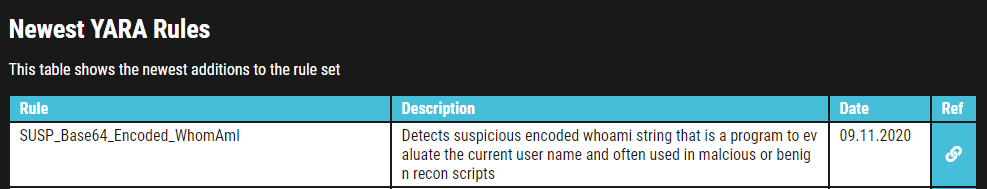

# Introduction
This room will expect you to understand basic Linux familiarity, such as installing software and commands for general navigation of the system. Moreso, this room isn't designed to test your knowledge or for point-scoring. It is here to encourage you to follow along and experiment with what you have learned here.

As always, I hope you take a few things away from this room, namely, the wonder that Yara (Yet Another Ridiculous Acronym) is and its importance in infosec today. Yara was developed by Victor M. Alvarez (@plusvic) and @VirusTotal. Check the GitHub repo here.
https://github.com/virustotal/yara

Yara's documentation
https://yara.readthedocs.io/en/latest/

# What is Yara?

## All about Yara 
"The pattern matching swiss knife for malware researchers (and everyone else)" (Virustotal., 2020)

With such a fitting quote, Yara can identify information based on both binary and textual patterns, such as hexadecimal and strings contained within a file.

Rules are used to label these patterns. For example, Yara rules are frequently written to determine if a file is malicious or not, based upon the features - or patterns - it presents. Strings are a fundamental component of programming languages. Applications use strings to store data such as text.

For example, the code snippet below prints "Hello World" in Python. The text "Hello World" would be stored as a string.
```
print("Hello World!")
```
We could write a Yara rule to search for "hello world" in every program on our operating system if we would like. 

## Why does Malware use Strings?
Malware, just like our "Hello World" application, uses strings to store textual data. Here are a few examples of the data that various malware types store within strings:
```
Type	    Data	                            Description
Ransomware	12t9YDPgwueZ9NyMgw519p7AA8isjr6SMw  Bitcoin Wallet for ransom payments
Botnet		12.34.56.7                      	The IP address of the Command and Control (C&C) server
```
# Introduction to Yara Rules

Your First Yara Rule

The proprietary language that Yara uses for rules is fairly trivial to pick up, but hard to master. This is because your rule is only as effective as your understanding of the patterns you want to search for.

Using a Yara rule is simple. Every yara command requires two arguments to be valid, these are:
1) The rule file we create
2) Name of file, directory, or process ID to use the rule for.

Every rule must have a name and condition. For example, if we wanted to use "myrule.yar" on directory "some directory", we would use the following command:
yara myrule.yar somedirectory

Note that .yar is the standard file extension for all Yara rules. We'll make one of the most basic rules you can make below.
1. Make a file named "somefile" via touch somefile
2. Create a new file and name it "myfirstrule.yar" like below:
```
cmnatic@thm:~$ touch somefile

cmnatic@thm touch myfirstrule.yar
```
3. Open the "myfirstrule.yar" using a text editor such as nano and input the snippet below and save the file:
```
rule examplerule {
        condition: true
}
```
The name of the rule in this snippet is examplerule, where we have one condition - in this case, the condition is condition.

As previously discussed, every rule requires both a name and a condition to be valid. This rule has satisfied those two requirements.

Simply, the rule we have made checks to see if the file/directory/PID that we specify exists via condition: true. If the file does exist, we are given the output of examplerule

Let's give this a try on the file "somefile" that we made in step one:
yara myfirstrule.yar somefile

If "somefile" exists, Yara will say examplerule because the pattern has been met - as we can see below:
```
cmnatic@thm:~$ yara myfirstrule.yar somefile 
examplerule somefile
```
If the file does not exist, Yara will output an error such as that below:
```    
cmnatic@thm:~$ yara myfirstrule.yar sometextfile
error scanning sometextfile: could not open file
```
# Expanding on Yara Rules
Yara has a few conditions, which I encourage you to read the documentation at your own leisure. However, I'll detail a few below and explain their purpose.
```
Desc
Meta
Strings
Conditions
Weight
```       
- Meta

This section of a Yara rule is reserved for descriptive information by the author of the rule. For example, you can use `desc`, short for description, to summarise what your rule checks for. Anything within this section does not influence the rule itself. Similar to commenting code, it is useful to summarise your rule.
- Strings

Remember our discussion about strings in Task 2? Well, here we go. You can use strings to search for specific text or hexadecimal in files or programs. For example, say we wanted to search a directory for all files containing "Hello World!", we would create a rule such as below:
```
rule helloworld_checker{
	strings:
		$hello_world = "Hello World!"
}
```
We define the keyword `strings` where the string that we want to search, i.e., "Hello World!" is stored within the variable `$hello_world`

Of course, we need a condition here to make the rule valid. In this example, to make this string the `condition`, we need to use the variable's name. In this case, $hello_world:
```
rule helloworld_checker{
	strings:
		$hello_world = "Hello World!"

	condition:
		$hello_world
}
```

Essentially, if any file has the string "Hello World!" then the rule will match. However, this is literally saying that it will only match if "Hello World!" is found and will not match if "hello world" or "HELLO WORLD."

To solve this, the condition `any of them` allows multiple strings to be searched for, like below:
```
rule helloworld_checker{
	strings:
		$hello_world = "Hello World!"
		$hello_world_lowercase = "hello world"
		$hello_world_uppercase = "HELLO WORLD"

	condition:
		any of them
}
```
Now, any file with the strings of:
1. Hello World!
2. hello world
3. HELLO WORLD

Will now trigger the rule.

## Conditions

We have already used the `true` and `any of them` condition. Much like regular programming, you can use operators such as:

    <= (less than or equal to)
    >= (more than or equal to)
    != (not equal to)

For example, the rule below would do the following:
```
rule helloworld_checker{
	strings:
		$hello_world = "Hello World!"

	condition:
        #hello_world <= 10
}
```
The rule will now:

1. Look for the "Hello World!" string
2. Only say the rule matches if there are less than or equal to ten occurrences of the "Hello World!" string

## Combining keywords

Moreover, you can use keywords such as:

    and
    not
    or

To combine multiple conditions. Say if you wanted to check if a file has a string and is of a certain size in this example, the sample file we are checking is less than <10 kb and has "Hello World!" you can use a rule like below:
```
rule helloworld_checker{
	strings:
		$hello_world = "Hello World!" 
        
        condition:
	        $hello_world and filesize < 10KB 
}
```
## Anatomy of a Yara Rule


# Yara Modules

Integrating With Other Libraries
Frameworks such as the Cuckoo Sandbox or Python's PE Module allow you to improve the technicality of your Yara rules ten-fold.


Cuckoo
Cuckoo Sandbox is an automated malware analysis environment. This module allows you to generate Yara rules based upon the behaviours discovered from Cuckoo Sandbox. As this environment executes malware, you can create rules on specific behaviours such as runtime strings and the like.


Python PE
Python's PE module allows you to create Yara rules from the various sections and elements of the Windows Portable Executable (PE) structure.

Explaining this structure is out of scope as it is covered in my [malware introductory room](https://tryhackme.com/room/malmalintroductory). However, this structure is the standard formatting of all executables and DLL files on windows. Including the programming libraries that are used. 

Examining a PE file's contents is an essential technique in malware analysis; this is because behaviours such as cryptography or worming can be largely identified without reverse engineering or execution of the sample.

# Other tools and Yara

## Yara Tools

Knowing how to create custom Yara rules is useful, but luckily you don't have to create many rules from scratch to begin using Yara to search for evil. There are plenty of GitHub resources and open-source tools (along with commercial products) that can be utilized to leverage Yara in hunt operations and/or incident response engagements. 
https://github.com/InQuest/awesome-yara

## LOKI (What, not who, is Loki?)

LOKI is a free open-source IOC (Indicator of Compromise) scanner created/written by Florian Roth.

Based on the GitHub page, detection is based on 4 methods:

    File Name IOC Check
    Yara Rule Check (we are here)
    Hash Check
    C2 Back Connect Check

There are additional checks that LOKI can be used for. For a full rundown, please reference the GitHub readme. https://github.com/Neo23x0/Loki/blob/master/README.md

LOKI can be used on both Windows and Linux systems and can be downloaded here. https://github.com/Neo23x0/Loki/releases

```
cmnatic@thm:~/Loki$ python3 loki.py -h
usage: loki.py [-h] [-p path] [-s kilobyte] [-l log-file] [-r remote-loghost]
               [-t remote-syslog-port] [-a alert-level] [-w warning-level]
               [-n notice-level] [--allhds] [--alldrives] [--printall]
               [--allreasons] [--noprocscan] [--nofilescan] [--vulnchecks]
               [--nolevcheck] [--scriptanalysis] [--rootkit] [--noindicator]
               [--dontwait] [--intense] [--csv] [--onlyrelevant] [--nolog]
               [--update] [--debug] [--maxworkingset MAXWORKINGSET]
               [--syslogtcp] [--logfolder log-folder] [--nopesieve]
               [--pesieveshellc] [--python PYTHON] [--nolisten]
               [--excludeprocess EXCLUDEPROCESS] [--force]

Loki - Simple IOC Scanner

optional arguments:
  -h, --help            show this help message and exit
```
## THOR (superhero named programs for a superhero blue teamer)

THOR Lite is Florian's newest multi-platform IOC AND YARA scanner. There are precompiled versions for Windows, Linux, and macOS. A nice feature with THOR Lite is its scan throttling to limit exhausting CPU resources. For more information and/or to download the binary, start [here](https://www.nextron-systems.com/thor-lite/). You need to subscribe to their mailing list to obtain a copy of the binary. Note that THOR is geared towards corporate customers. THOR Lite is the free version.

```
           
cmnatic@thm:~$ ./thor-lite-linux-64 -h
Thor Lite
APT Scanner
Version 10.7.3 (2022-07-27 07:33:47)
cc) Nextron Systems GmbH
Lite Version

> Scan Options
  -t, --template string      Process default scan parameters from this YAML file
  -p, --path strings         Scan a specific file path. Define multiple paths by specifying this option multiple times. Append ':NOWALK' to the path for non-recursive scanning (default: only the system drive) (default [])
      --allhds               (Windows Only) Scan all local hard drives (default: only the system drive)
      --max_file_size uint   Max. file size to check (larger files are ignored). Increasing this limit will also increase memory usage of THOR. (default 30MB)

> Scan Modes
      --quick     Activate a number of flags to speed up the scan at cost of some detection.
                  This is equivalent to: --noeventlog --nofirewall --noprofiles --nowebdirscan --nologscan --noevtx --nohotfixes --nomft --lookback 3 --lookback-modules filescan
```
## FENRIR (naming convention still mythical themed)

This is the 3rd tool created by Neo23x0 (Florian Roth). You guessed it; the previous 2 are named above. The updated version was created to address the issue from its predecessors, where requirements must be met for them to function. Fenrir is a bash script; it will run on any system capable of running bash (nowadays even Windows). 
https://github.com/Neo23x0/Fenrir

```
cmnatic@thm-yara:~/tools$ ./fenrir.sh
##############################################################
    ____             _
   / __/__ ___  ____(_)___
  / _// -_) _ \/ __/ / __/
 /_/  \__/_//_/_/ /_/_/
 v0.9.0-log4shell

 Simple Bash IOC Checker
 Florian Roth, Dec 2021
##############################################################
```
## YAYA (Yet Another Yara Automaton)

YAYA was created by the EFF (Electronic Frontier Foundation) and released in September 2020. Based on their website, "YAYA is a new open-source tool to help researchers manage multiple YARA rule repositories. YAYA starts by importing a set of high-quality YARA rules and then lets researchers add their own rules, disable specific rulesets, and run scans of files."

Note: Currently, YAYA will only run on Linux systems. 
https://www.eff.org/deeplinks/2020/09/introducing-yaya-new-threat-hunting-tool-eff-threat-lab

```       
cmnatic@thm-yara:~/tools$ yaya
YAYA - Yet Another Yara Automaton
Usage:
yaya [-h]  
    -h print this help screen
Commands:
   update - update rulesets
   edit - ban or remove rulesets
   add - add a custom ruleset, located at 
   scan - perform a yara scan on the directory at 
```
# Using LOKI and its Yara rule set

## Using LOKI
As a security analyst, you may need to research various threat intelligence reports, blog postings, etc. and gather information on the latest tactics and techniques used in the wild, past or present. Typically in these readings, IOCs (hashes, IP addresses, domain names, etc.) will be shared so rules can be created to detect these threats in your environment, along with Yara rules. On the flip side, you might find yourself in a situation where you've encountered something unknown, that your security stack of tools can't/didn't detect. Using tools such as Loki, you will need to add your own rules based on your threat intelligence gathers or findings from an incident response engagement (forensics). 

As mentioned before, Loki already has a set of Yara rules that we can benefit from and start scanning for evil on the endpoint straightaway.

Run `python loki.py -h` to see what options are available. 
```
cmnatic@thm-yara:~/tools/Loki$ python loki.py -h
usage: loki.py [-h] [-p path] [-s kilobyte] [-l log-file] [-r remote-loghost]
               [-t remote-syslog-port] [-a alert-level] [-w warning-level]
               [-n notice-level] [--printall] [--allreasons] [--noprocscan]
               [--nofilescan] [--nolevcheck] [--scriptanalysis] [--rootkit]
               [--noindicator] [--reginfs] [--dontwait] [--intense] [--csv]
               [--onlyrelevant] [--nolog] [--update] [--debug]
               [--maxworkingset MAXWORKINGSET] [--syslogtcp]
               [--logfolder log-folder] [--nopesieve] [--pesieveshellc]
               [--nolisten] [--excludeprocess EXCLUDEPROCESS]
Loki - Simple IOC Scanner

optional arguments:
  -h, --help            show this help message and exit
  -p path               Path to scan
  -s kilobyte           Maximum file size to check in KB (default 5000 KB)
  -l log-file           Log file
  -r remote-loghost     Remote syslog system
  -t remote-syslog-port
                        Remote syslog port
  -a alert-level        Alert score
  -w warning-level      Warning score
  -n notice-level       Notice score
  --printall            Print all files that are scanned
  --allreasons          Print all reasons that caused the score
  --noprocscan          Skip the process scan
  --nofilescan          Skip the file scan
  --nolevcheck          Skip the Levenshtein distance check
  --scriptanalysis      Activate script analysis (beta)
  --rootkit             Skip the rootkit check
  --noindicator         Do not show a progress indicator
  --reginfs             Do check for Regin virtual file system
  --dontwait            Do not wait on exit
  --intense             Intense scan mode (also scan unknown file types and
                        all extensions)
  --csv                 Write CSV log format to STDOUT (machine processing)
  --onlyrelevant        Only print warnings or alerts
  --nolog               Don't write a local log file
  --update              Update the signatures from the "signature-base" sub
                        repository
  --debug               Debug output
  --maxworkingset MAXWORKINGSET
                        Maximum working set size of processes to scan (in MB,
                        default 100 MB)
  --syslogtcp           Use TCP instead of UDP for syslog logging
  --logfolder log-folder
                        Folder to use for logging when log file is not
                        specified
  --nopesieve           Do not perform pe-sieve scans
  --pesieveshellc       Perform pe-sieve shellcode scan
  --nolisten            Dot not show listening connections
  --excludeprocess EXCLUDEPROCESS
                        Specify an executable name to exclude from scans, can
                        be used multiple times              
```


If you are running Loki on your own system, the first command you should run is `--update`. 
This will add the signature-base directory, which Loki uses to scan for known evil. This command was already executed within the attached VM

```        
cmnatic@thm-yara:~/tools/Loki/signature-base$ ls
iocs  misc  yara
```
Navigate to the yara directory. Feel free to inspect the different Yara files used by Loki to get an idea of what these rules will hunt for.

To run Loki, you can use the following command (note that I am calling Loki from within the file 1 directory)

```          
cmnatic@thm-yara:~/suspicious-files/file1$ python ../../tools/Loki/loki.py -p .
```
             
```
cmnatic@thm-yara:~/suspicious-files/file1$ python ../../tools/Loki/loki.py -p .
                                                                               
      __   ____  __ ______                            
     / /  / __ \/ //_/  _/                            
    / /__/ /_/ / ,< _/ /                              
   /____/\____/_/|_/___/                              
      ________  _____  ____                           
     /  _/ __ \/ ___/ / __/______ ____  ___  ___ ____ 
    _/ // /_/ / /__  _\ \/ __/ _ `/ _ \/ _ \/ -_) __/ 
   /___/\____/\___/ /___/\__/\_,_/_//_/_//_/\__/_/    

   Copyright by Florian Roth, Released under the GNU General Public License
   Version 0.32.1
  
   DISCLAIMER - USE AT YOUR OWN RISK
   Please report false positives via https://github.com/Neo23x0/Loki/issues
  
                                                                               

[NOTICE] Starting Loki Scan VERSION: 0.32.1 SYSTEM: thm-yara TIME: 20250116T09:35:23Z PLATFORM
:     PROC: x86_64 ARCH: 64bit 
[NOTICE] Registered plugin PluginWMI
[NOTICE] Loaded plugin /home/cmnatic/tools/Loki/plugins/loki-plugin-wmi.py
[NOTICE] PE-Sieve successfully initialized BINARY: /home/cmnatic/tools/Loki/tools/pe-sieve64.e
xe SOURCE: https://github.com/hasherezade/pe-sieve
[INFO] File Name Characteristics initialized with 2841 regex patterns
[INFO] C2 server indicators initialized with 1541 elements
[INFO] Malicious MD5 Hashes initialized with 19034 hashes
[INFO] Malicious SHA1 Hashes initialized with 7159 hashes
[INFO] Malicious SHA256 Hashes initialized with 22841 hashes
[INFO] False Positive Hashes initialized with 30 hashes
[INFO] Processing YARA rules folder /home/cmnatic/tools/Loki/signature-base/yara
[INFO] Initializing all YARA rules at once (composed string of all rule files)
[INFO] Initialized 653 Yara rules
[INFO] Reading private rules from binary ...
[NOTICE] Program should be run as 'root' to ensure all access rights to process memory and fil
e objects.
[NOTICE] Running plugin PluginWMI
[NOTICE] Finished running plugin PluginWMI
[INFO] Scanning . ...  
[WARNING] 
FILE: ./ind3x.php SCORE: 70 TYPE: PHP SIZE: 80992 
FIRST_BYTES: 3c3f7068700a2f2a0a09623337346b20322e320a / <?php/*b374k 2.2 
MD5: 1606bdac2cb613bf0b8a22690364fbc5 
SHA1: 9383ed4ee7df17193f7a034c3190ecabc9000f9f 
SHA256: 5479f8cd1375364770df36e5a18262480a8f9d311e8eedb2c2390ecb233852ad CREATED: Mon Nov  9 1
5:15:32 2020 MODI
[NOTICE] Program should be run as 'root' to ensure all access rights to process memory and fil
e objects.
[NOTICE] Running plugin PluginWMI
[NOTICE] Finished running plugin PluginWMI
[INFO] Scanning . ...  
[WARNING] 
FILE: ./ind3x.php SCORE: 70 TYPE: PHP SIZE: 80992 
FIRST_BYTES: 3c3f7068700a2f2a0a09623337346b20322e320a / <?php/*b374k 2.2 
MD5: 1606bdac2cb613bf0b8a22690364fbc5 
SHA1: 9383ed4ee7df17193f7a034c3190ecabc9000f9f 
SHA256: 5479f8cd1375364770df36e5a18262480a8f9d311e8eedb2c2390ecb233852ad CREATED: Mon Nov  9 1
5:15:32 2020 MODIFIED: Mon Nov  9 13:06:56 2020 ACCESSED: Thu Jan 16 09:35:28 2025 
REASON_1: Yara Rule MATCH: webshell_metaslsoft SUBSCORE: 70 
DESCRIPTION: Web Shell - file metaslsoft.php REF: - 
MATCHES: Str1: $buff .= "<tr><td><a href=\\"?d=".$pwd."\\">[ $folder ]</a></td><td>LINK</t
[NOTICE] Results: 0 alerts, 1 warnings, 7 notices
[RESULT] Suspicious objects detected!
[RESULT] Loki recommends a deeper analysis of the suspicious objects.
[INFO] Please report false positives via https://github.com/Neo23x0/signature-base
[NOTICE] Finished LOKI Scan SYSTEM: thm-yara TIME: 20250116T09:35:28Z
 
Press Enter to exit ...
cmnatic@thm-yara:~/suspicious-files/file1$ 
```

# Creating Yara rules with yarGen

From the previous section, we realized that we have a file that Loki didn't flag on. At this point, we are unable to run Loki on other web servers because if file 2 exists in any of the webs servers, it will go undetected.

We need to create a Yara rule to detect this specific web shell in our environment. Typically this is what is done in the case of an incident, which is an event that affects/impacts the organization in a negative fashion.

We can manually open the file and attempt to sift through lines upon lines of code to find possible strings that can be used in our newly created Yara rule.

Let's check how many lines this particular file has. You can run the following: `strings <file name> | wc -l`
```        
cmnatic@thm-yara:~/suspicious-files/file2$ strings 1ndex.php | wc -l
3580
```
If you try to go through each string, line by line manually, you should quickly realize that this can be a daunting task. 
Luckily, we can use yarGen (yes, another tool created by Florian Roth) to aid us with this task.
What is yarGen? yarGen is a generator for YARA rules.

From the README - "The main principle is the creation of yara rules from strings found in malware files while removing all strings that also appear in goodware files. Therefore yarGen includes a big goodware strings and opcode database as ZIP archives that have to be extracted before the first use."

Navigate to the yarGen directory, which is within tools.
If you are running yarGen on your own system, you need to update it first by running the following command: `python3 yarGen.py --update`

This will update the good-opcodes and good-strings DB's from the online repository.
This update will take a few minutes. 
```
cmnatic@thm-yara:~/tools/yarGen$ python3 yarGen.py --update
------------------------------------------------------------------------
                   _____
    __ _____ _____/ ___/__ ___
   / // / _ `/ __/ (_ / -_) _ \
   \_, /\_,_/_/  \___/\__/_//_/
  /___/  Yara Rule Generator
         Florian Roth, July 2020, Version 0.23.3

  Note: Rules have to be post-processed
  See this post for details: https://medium.com/@cyb3rops/121d29322282
------------------------------------------------------------------------
Downloading good-opcodes-part1.db from https://www.bsk-consulting.de/yargen/good-opcodes-part1.db ...
```
To use yarGen to generate a Yara rule for file 2, you can run the following command: 
```
python3 yarGen.py -m /home/cmnatic/suspicious-files/file2 --excludegood -o /home/cmnatic/suspicious-files/file2.yar 
```
A brief explanation of the parameters above:

    -m is the path to the files you want to generate rules for
    --excludegood force to exclude all goodware strings (these are strings found in legitimate software and can increase false positives)
    -o location & name you want to output the Yara rule

Generally, you would examine the Yara rule and remove any strings that you feel might generate false positives. For this exercise, we will leave the generated Yara rule as is and test to see if Yara will flag file 2 or no. 

```
cmnatic@thm-yara:~/suspicious-files$ yara file2.yar file2/1ndex.php
```

Now we copy the yara rule to the signature base to run loki later
```
cp suspicious-files/file2.yar tools/Loki/signature-base/yara/
```
```
cmnatic@thm-yara:~/suspicious-files/file2$ python ../../tools/Loki/loki.py -p .
                                                                               
      __   ____  __ ______                            
     / /  / __ \/ //_/  _/                            
    / /__/ /_/ / ,< _/ /                              
   /____/\____/_/|_/___/                              
      ________  _____  ____                           
     /  _/ __ \/ ___/ / __/______ ____  ___  ___ ____ 
    _/ // /_/ / /__  _\ \/ __/ _ `/ _ \/ _ \/ -_) __/ 
   /___/\____/\___/ /___/\__/\_,_/_//_/_//_/\__/_/    

   Copyright by Florian Roth, Released under the GNU General Public License
   Version 0.32.1
  
   DISCLAIMER - USE AT YOUR OWN RISK
   Please report false positives via https://github.com/Neo23x0/Loki/issues
  
                                                                               

[NOTICE] Starting Loki Scan VERSION: 0.32.1 SYSTEM: thm-yara TIME: 20250116T10:49:05Z PLATFORM
:     PROC: x86_64 ARCH: 64bit 
[NOTICE] Registered plugin PluginWMI
[NOTICE] Loaded plugin /home/cmnatic/tools/Loki/plugins/loki-plugin-wmi.py
[NOTICE] PE-Sieve successfully initialized BINARY: /home/cmnatic/tools/Loki/tools/pe-sieve64.e
xe SOURCE: https://github.com/hasherezade/pe-sieve
[INFO] File Name Characteristics initialized with 2841 regex patterns
[INFO] C2 server indicators initialized with 1541 elements
[INFO] Malicious MD5 Hashes initialized with 19034 hashes
[INFO] Malicious SHA1 Hashes initialized with 7159 hashes
[INFO] Malicious SHA256 Hashes initialized with 22841 hashes
[INFO] False Positive Hashes initialized with 30 hashes
[INFO] Processing YARA rules folder /home/cmnatic/tools/Loki/signature-base/yara
[INFO] Initializing all YARA rules at once (composed string of all rule files)
[INFO] Initialized 654 Yara rules
[INFO] Reading private rules from binary ...
[NOTICE] Program should be run as 'root' to ensure all access rights to process memory and fil
e objects.
[NOTICE] Running plugin PluginWMI
[NOTICE] Finished running plugin PluginWMI
[INFO] Scanning . ... 
[WARNING] 
FILE: ./1ndex.php SCORE: 70 TYPE: PHP SIZE: 223978 
FIRST_BYTES: 3c3f7068700a2f2a0a09623337346b207368656c / <?php/*b374k shel 
MD5: c6a7ebafdbe239d65248e2b69b670157 
SHA1: 3926ab64dcf04e87024011cf39902beac32711da 
SHA256: 53fe44b4753874f079a936325d1fdc9b1691956a29c3aaf8643cdbd49f5984bf CREATED: Mon Nov  9 1
5:16:03 2020 MODIFIED: Mon Nov  9 13:09:18 2020 ACCESSED: Thu Jan 16 10:12:42 2025 
REASON_1: Yara Rule MATCH: _home_cmnatic_suspicious_files_file2_1ndex SUBSCORE: 70 
DESCRIPTION: file2 - file 1ndex.php REF: https://github.com/Neo23x0/yarGen 
MATCHES: Str1: var Zepto=function(){function G(a){return a==null?String(a):z[A.call(a)]||"obje
ct"}function H(a){return G(a)=="function"}fun Str2: $c ... (truncated)
[WARNING] 
FILE: ./loki_thm-yara_2025-01-16_10-12-39.log SCORE: 70 TYPE: UNKNOWN SIZE: 2657 
FIRST_BYTES: 32303235303131365431303a31323a33395a2074 / 20250116T10:12:39Z t 
MD5: e4608d81899447c70e499ebb1194e086 
SHA1: ac5a3883ed4b3ec0f5abc9190ba2f85fd39d94cb 
SHA256: 01019ec8eedc71a489ba5fb0aed283db8ee0dd19d1166310a40cac1ce847f1eb CREATED: Thu Jan 16 1
0:12:42 2025 MODIFIED: Thu Jan 16 10:12:42 2025 ACCESSED: Thu Jan 16 10:34:34 2025 
REASON_1: Yara Rule MATCH: loki_thm_yara_2025_01_16_10_12_39 SUBSCORE: 70 
DESCRIPTION: file2 - file loki_thm-yara_2025-01-16_10-12-39.log REF: https://github.com/Neo23x
0/yarGen 
MATCHES: Str1: 20250116T10:12:39Z thm-yara LOKI: Notice: MODULE: PESieve MESSAGE: PE-Sieve suc
cessfully initialized BINARY: /home/cmnatic/tools Str2 ... (truncated)
[NOTICE] Results: 0 alerts, 2 warnings, 7 notices
[RESULT] Suspicious objects detected!
[RESULT] Loki recommends a deeper analysis of the suspicious objects.
[INFO] Please report false positives via https://github.com/Neo23x0/signature-base
[NOTICE] Finished LOKI Scan SYSTEM: thm-yara TIME: 20250116T10:49:09Z
 
Press Enter to exit ...
```

Note: Another tool created to assist with this is called [yarAnalyzer](https://github.com/Neo23x0/yarAnalyzer/) (you guessed it - created by Florian Roth). We will not examine that tool in this room, but you should read up on it, especially if you decide to start creating your own Yara rules. 

Further Reading on creating Yara rules and using yarGen:

https://www.bsk-consulting.de/2015/02/16/write-simple-sound-yara-rules/

https://www.bsk-consulting.de/2015/10/17/how-to-write-simple-but-sound-yara-rules-part-2/

https://www.bsk-consulting.de/2016/04/15/how-to-write-simple-but-sound-yara-rules-part-3/


# Valhalla

Valhalla is an online Yara feed created and hosted by Nextron-Systems (erm, Florian Roth). By now, you should be aware of the ridiculous amount of time and energy Florian has dedicated to creating these tools for the community. Maybe we should have just called this the Florian Roth room. (lol)

Per the website, "Valhalla boosts your detection capabilities with the power of thousands of hand-crafted high-quality YARA rules."


From the image above, we should denote that we can conduct searches based on a keyword, tag, ATT&CK technique, sha256, or rule name. 

Taking a look at the data provided to us, let's examine the rule in the screenshot below:

We are provided with the name of the rule, a brief description, a reference link for more information about the rule, along with the rule date. 

Picking up from our scenario, at this point, you know that the 2 files are related. Even though Loki classified the files are suspicious, you know in your gut that they are malicious. Hence the reason you created a Yara rule using yarGen to detect it on other web servers. But let's further pretend that you are not code-savvy (FYI - not all security professionals know how to code/script or read it). You need to conduct further research regarding these files to receive approval to eradicate these files from the network. 

Time to use Valhalla for some threat intelligence gathering...
1. Enter the SHA256 hash of file 1 into Valhalla. Is this file attributed to an APT group? (Yay/Nay)

    Yay

        type: YARA
        rule: Webshell_b374k_Jan18_1
        description: Detects hacktool / webshell found in disclosed hack tool set of Chinese APT group
        date: 2018-01-10
        reference: Internal Research - disclosed toolset web mirror

2. Do the same for file 2. What is the name of the first Yara rule to detect file 2?
Webshell_b374k_rule1

        type: YARA
        rule: Webshell_b374k_rule1
        description: Detects b374k webshell
        date: 2015-10-16
        reference: https://github.com/b374k/b374k
3. Examine the information for file 2 from Virus Total (VT). The Yara Signature Match is from what scanner?
Hint - this info is in the community tab.

        THOR APT Scanner
    
4. Enter the SHA256 hash of file 2 into Virus Total. Did every AV detect this as malicious? (Yay/Nay)

    Nay

5. Besides .PHP, what other extension is recorded for this file?
Hint - Look under the "details" tab in Virustotal to find out the extensions for this submission. 
    exe

6. What JavaScript library is used by file 2? Hint - Go to the Github page and search inside the index.php file
    
    Zepto

    https://github.com/b374k/b374k was the link on reference in the answer for question 2
    there you can see zepto.js under requirements

7. Is this Yara rule in the default Yara file Loki uses to detect these type of hack tools? (Yay/Nay)
Hint - Examine thor-webshell.yar and search for the rule name

    Nay
    ```
     ls /home/cmnatic/tools/Loki/signature-base/yara/ | grep “Webshell_b374k_rule1
    ```


