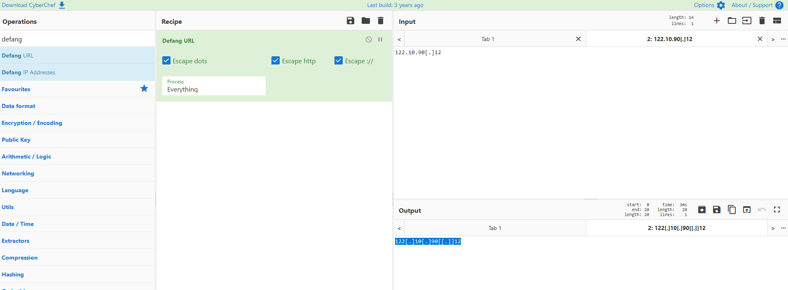

# Challenge Scenario

## Disclaimer

Please note: The artefacts used in this scenario were retrieved from a real-world cyber-attack. Hence, it is advised that interaction with the artefacts be done only inside the attached VM, as it is an isolated environment. 

## Hello Busy Weekend. . .

It's a Friday evening at PandaProbe Intelligence when a notification appears on your CTI platform. While most are already looking forward to the weekend, you realise you must pull overtime because SwiftSpend Finance has opened a new ticket, raising concerns about potential malware threats. The finance company, known for its meticulous security measures, stumbled upon something suspicious and wanted immediate expert analysis.

As the only remaining CTI Analyst on shift at PandaProbe Intelligence, you quickly took charge of the situation, realising the gravity of a potential breach at a financial institution. The ticket contained multiple file attachments, presumed to be malware samples.

With a deep breath, a focused mind, and the longing desire to go home, you began the process of:

    Downloading the malware samples provided in the ticket, ensuring they were contained in a secure environment.
    
    Running the samples through preliminary automated malware analysis tools to get a quick overview.
    
    Deep diving into a manual analysis, understanding the malware's behaviour, and identifying its communication patterns.
    
    Correlating findings with global threat intelligence databases to identify known signatures or behaviours.
    
    Compiling a comprehensive report with mitigation and recovery steps, ensuring SwiftSpend Finance could swiftly address potential threats.

 Connecting to the machine

Start the virtual machine in split-screen view by clicking the green Start Machine button on the upper right section of this task. If the VM is not visible, use the blue Show Split View button at the top-right of the page. Additionally, you can open the DocIntel platform using the credentials below.

Username 	ericatracy

Password 	Intel321!

IP 	        MACHINE_IP 

 Note: While the web browser (i.e., Chromium) will immediately start after boot up, it may show a tab that has a "502 Bad Gateway" error message displayed. This is because the DocIntel platform takes about 5 more minutes to finish starting up after the VM has completely booted up. After 5 minutes, you can refresh the page in order to view the login page. We appreciate your patience. The ticket details can be found by logging in to the DocIntel platform. OSINT, a web browser, and a text editor outside the VM will also help. 

## Scenario email
```
 Urgent: Malicious Malware Artefacts Detected
by SwiftSpend Finance - Registered 2023-12-07T23:10:51.5503900

Dear PandaProbe Intel team,

I hope this message finds you well. My name is Oliver Bennett from the Cybersecurity Division at SwiftSpend Finance. During our recent security sweep, we have identified a set of malicious files which, based on our preliminary analysis, seem to be associated with .

Details

Date Detected: Friday, December 8, 2023

Infected Systems: Over 9000 systems

Nature of Malware: Unknown / Suspected RAT

We believe the intent of this malware is to gain a foothold to ultimately exfiltrate sensitive financial data and possibly deploy ransomware.

Immediate Actions Taken

- Isolated the infected systems from the network.

- Initiated a comprehensive scan across all systems.

- Collected and stored malware samples securely for further analysis.

- We are currently collaborating with external cybersecurity agencies and our security solutions providers to get a deeper understanding of this malware. However, we wanted to raise this with you immediately given the potential risk associated with APTs.

We strongly need your team's assistance with conducting a thorough review of the malware sample. The password to the attached archive is: Panda321!

Moving forward, we are going to conduct a User Awareness Training to inform all staff members to be extra cautious, especially when dealing with email attachments and links.

Attached are the indicators of compromise (IoCs) for your perusal. I am also available for a call or meeting to discuss our findings in detail and strategise our response.

Your prompt attention to this matter is highly appreciated. Let's work together to ensure the safety and integrity of our systems and data.

Warm regards,

Oliver Bennett

Cybersecurity Division

SwiftSpend Finance

Phone: +123 456 7890

Email: oliver.bennett@swiftspend.finance
```

1. Who shared the malware samples?

    Oliver Bennett

2. What is the SHA1 hash of the file "pRsm.dll" inside samples.zip?

    9d1ecbbe8637fed0d89fca1af35ea821277ad2e8
    ```
    ericatracy@ip-10-10-124-22 samples $ sha1sum pRsm.dll
    9d1ecbbe8637fed0d89fca1af35ea821277ad2e8  pRsm.dll
    ```

3. Which malware framework utilizes these DLLs as add-on modules? Hint - Search for an article or report related to the artefacts.

    MgBot

    I went on virustotal and found this link 
    
    https://www.welivesecurity.com/2023/04/26/evasive-panda-apt-group-malware-updates-popular-chinese-software/
    

4. Which MITRE ATT&CK Technique is linked to using pRsm.dll in this malware framework?

    T1123
    

5. What is the CyberChef defanged URL of the malicious download location first seen on 2020-11-02?

    hxxp[://]update[.]browser[.]qq[.]com/qmbs/QQ/QQUrlMgr_QQ88_4296[.]exe
    
    

6. What is the CyberChef defanged IP address of the C&C server first detected on 2020-09-14 using these modules?

    122[.]10[.]90[.]12
    
    


7. What is the SHA1 hash of the spyagent family spyware hosted on the same IP targeting Android devices on November 16, 2022? Hint - Tools like VirusTotal or app.any.run can help with this.

    1c1fe906e822012f6235fcc53f601d006d15d7be
    
    


