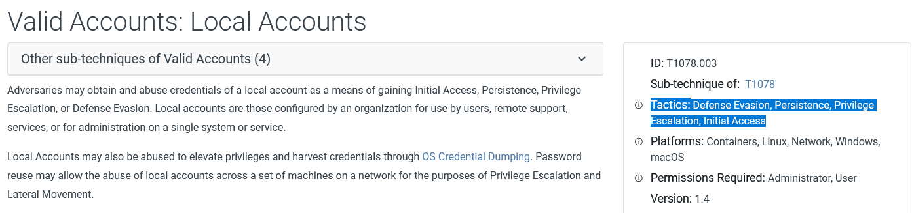

# Who's the threat?

A multinational technology company has been the target of several cyber attacks in the past few months. The attackers have been successful in stealing sensitive intellectual property and causing disruptions to the company's operations. A threat advisory report about similar attacks has been shared, and as a CTI analyst, your task is to identify the Tactics, Techniques, and Procedures (TTPs) being used by the Threat group and gather as much information as possible about their identity and motive. For this task, you will utilise the OpenCTI platform as well as the MITRE ATT&CK navigator, linked to the details below. 

## Assigned Tools

Start the virtual machine by clicking on the green "Start Machine" button on the upper right section of this task. Give it about 7 minutes to fully load and use the credentials below to access the platforms via the AttackBox or VPN to conduct your investigations.
 
Username 	info@tryhack.io   
Password 	TryHackMe1234   
OpenCTI IP	http://MACHINE_IP:8080   
ATT&CK Navigator IP	http://MACHINE_IP:4200

# APT X report
[APT X pdf](APT%20X_USBFerry.pdf)

Report Citation: Please note that the citation may contain spoilers about the contents of the challenge.

"Chen, Joey. (2020, May 12).Tropic Trooper's USBferry Targets Air-Gapped Networks. TrendMicro. https://www.trendmicro.com/en_us/research/20/e/tropic-troopers-back-usbferry-attack-targets-air-gapped-environments.html"

1. What kind of phishing campaign does APT X use as part of their TTPs?

    spear-phishing emails  
    

2. What is the name of the malware used by APT X?

    USBferry

3. What is the malware's STIX ID?

    malware--5d0ea014-1ce9-5d5c-bcc7-f625a07907d0
    

4. With the use of a USB, what technique did APT X use for initial access?

    Replication through removable media  
    

5. What is the identity of APT X? 

    Tropic Trooper

6. On OpenCTI, how many Attack Pattern techniques are associated with the APT?

    39
    

7. What is the name of the tool linked to the APT?

    BITSAdmin
    

8. Load up the Navigator. What is the sub-technique used by the APT under Valid Accounts?

    Local accounts  
    

9. Under what Tactics does the technique above fall? Hint - Order follows an attack kill chain.

     Defense Evasion, Persistence, Privilege Escalation, Initial Access
     

10. What technique is the group known for using under the tactic Collection?

    Automated Collection  
    
