# Introduction

NetworkMiner is an open-source traffic sniffer, pcap handler and protocol analyser. Developed and still maintained by Netresec.

The official description;

"NetworkMiner is an open source Network Forensic Analysis Tool (NFAT) for Windows (but also works in Linux / Mac OS X / FreeBSD). NetworkMiner can be used as a passive network sniffer/packet capturing tool to detect operating systems, sessions, hostnames, open ports etc. without putting any traffic on the network. NetworkMiner can also parse PCAP files for off-line analysis and to regenerate/reassemble transmitted files and certificates from PCAP files.

NetworkMiner makes it easy to perform advanced Network Traffic Analysis (NTA) by providing extracted artefacts in an intuitive user interface. The way data is presented not only makes the analysis simpler, it also saves valuable time for the analyst or forensic investigator.

NetworkMiner has, since the first release in 2007, become a popular tool among incident response teams as well as law enforcement. NetworkMiner is today used by companies and organizations all over the world."

https://www.netresec.com/?page=NetworkMiner

# Introduction to Network Forensics

Network Forensics is a specific subdomain of the Forensics domain, and it focuses on network traffic investigation. Network Forensics discipline covers the work done to access information transmitted by listening and investigating live and recorded traffic, gathering evidence/artefacts and understanding potential problems. 

Briefly, it is the action of recording packets of network traffic and creating investigatable sources and establishing a root–cause analysis of an event. The ultimate goal is to provide sufficient information to detect malicious activities, security breaches, policy/regulation compliance, system health and user behaviour.

The investigation process identifies communicated hosts in terms of time, frequency, protocol, application and data.

The investigation tries to answer the 5W;

    Who (Source IP and port)
    What (Data/payload)
    Where (Destination IP and port)
    When (Time and data)
    Why (How/What happened)

Note that the network evidence capture and investigation process should be systematic. Having enough data and the right timeline capture for a successful network forensics investigation is crucial.

## Network Forensics Use Cases

The most common network forensics use cases are explained below;

    Network discovery: Discovering the network to overview connected devices, rogue hosts and network load. 

    Packets reassembling: Reassembling the packets to investigate the traffic flow. This use case is helpful in unencrypted traffic flows.

    Data leakage detection: Reviewing packet transfer rates for each host and destination address helps detect possible data leakage. 

    Anomaly and malicious activity detection: Reviewing overall network load by focusing on used ports, source and destination addresses, and data helps detect possible malicious activities along with vulnerabilities. This use case covers the correlation of indicators and hypotheses as well.

    Policy/Regulation compliance control: Reviewing overall network behaviour helps detect policy/regulation compliance.

## Advantages of Network Forensics 

General advantages of network forensics are explained below;

    Availability of network-based evidence in the wild: Capturing network traffic is collecting evidence, so it is easier than other types of evidence collections such as logs and IOCs.

    Ease of data/evidence collection without creating noise: Capturing and working with network traffic is easier than investigating unfiltered events by EDRs, EPPs and log systems. Usually, sniffing doesn't create much noise, logs and alerts. The other thing is that network traffic is not destructible like logs and alerts generated by security systems.  

    It is hard to destroy the network evidence, as it is the transferred data: Since the evidence is the traffic itself, it is impossible to do anything without creating network noise. Still, it is possible to hide the artefacts by encrypting, tunnelling and manipulating the packets. So, the second fact is the challenge of this advantage. 

    Availability of log sources: Logs provide valuable information which helps to correlate the chain of events and support the investigation hypothesis. The majority of the EDRs, EPPs and network devices create logs by default. Having log files is easy if the attacker/threat/malware didn't erase/destroy them.

    It is possible to gather evidence for memory and non-residential malicious activities: The malware/threat might reside in the memory to avoid detection. However, the series of commands and connections live in the network. So it is possible to detect non-residential threats with network forensics tools and tactics.

## Challenges of Network Forensics

General challenges of the network forensics are explained below;

    Deciding what to do: One of the most difficult challenges of network forensics is "Deciding what to do". There are several purposes of carving networks; SOC, IH/IR and Threat Hunting. Observing, trapping, catching, or stopping an anomalous activity is also possible. 

    Sufficient data/evidence collection on the network: One of the advantages of network forensics is "Ease of collecting evidence". However, the breadth of this concept poses a challenge. There are multiple points to consider in data/evidence collection.

    Short data capture: One of the challenges in data/evidence collection. Capturing all network activity is not applicable and operable. So, it is hard always to have the packet captures that covers pre, during and post-event. 

    The unavailability of full-packet capture on suspicious events: Continuously capturing, storing and processing full-packets costs time and resources. The inability to have full-packet captures for a long time creates time gaps between captures, resulting in missing a significant part of an event of interest. Sometimes NetFlow captures are used instead of full-packet captures to reduce the weight of having full-packet captures and increase the capture time. Note that full-packet captures provide full packet details and give the opportunity of event reconstruction, while NetFlow provides high-level summary but not data/payload details.

    Encrypted traffic: Encrypted data is another challenge of network forensics. In most cases, discovering the contents of the encrypted data is not possible. However, the encrypted data still can provide valuable information for the hypothesis like source and destination address and used services.

    GDPR and Privacy concerns in traffic recording: Capturing the traffic is the same as "recording everything on the wire"; therefore, this act should comply with GDPR and business-specific regulations (e.g. HIPAA, PCI DSS and FISMA ).

    Nonstandard port usage: One of the popular approaches in network forensics investigations is grabbing the low-hanging fruits in the first investigation step. Looking for commonly used patterns (like known ports and services used in enumeration and exploitation) is known as grabbing the low-hanging fruits. However, sometimes attackers/threats use nonstandard ports and services to avoid detection and bypass security mechanisms. Therefore sometimes, this ends up as a challenge of network forensics.

    Time zone issues: Using a common time zone is important for big-scale event investigation. Especially when working with multiple resources over different time zones, usage of different time zones create difficulties in event correlation.

    Lack of logs: Network forensics is not limited to investigating the network traffic data. Network devices and event logs are crucial in event correlation and investigation hypotheses. This fact is known by the attackers/threats as well; therefore these logs are often erased by them, in order to make the investigation more difficult.

## Sources of Network Forensics Evidence

Capturing proper network traffic requires knowledge and tools. Usually, there is a single chance of gathering the live traffic as evidence. There are multiple evidence resources to gather network forensics data.

    TAPS
    InLine Devices
    SPAN Ports
    Hubs
    Switches
    Routers
    DHCP Servers
    Name Servers
    Authentication Servers
    Firewalls
    Web Proxies
    Central Log Servers
    Logs (IDS/IPS, Application, OS, Device)

## Primary Purposes of Network Forensics 

There are two primary purposes in Network Forensics investigations.

    Security Operations (SOC): Daily security monitoring activities on system performance and health, user behaviour, and security issues.

    Incident Handling/Response and Threat Hunting: During/Post-incident investigation activities on understanding the reason for the incident, detecting malicious and suspicious activity, and investigating the data flow content.

## Investigated Data Types in Network Forensics

There are three main data types investigated in Network Forensics

    Live Traffic
    Traffic Captures (full packet captures and network flows)
    Log Files

NetworkMiner is capable of processing and handling packet pictures and live traffic. Therefore, we will focus on live and captured traffic in this room. Both of these data sources are valuable for forensics investigations. 

Traffic investigation actions fall under network forensics's "Traffic Analysis" subdomain. However, the main purpose of the NetworkMiner is to investigate the overall flow/condition of the limited amount of traffic, not for a long in-depth live traffic investigation. Therefore we will focus on how to use NetworkMiner for this purpose.

# What is NetworkMiner?

NetworkMiner in a Nutshell

<table class="table table-bordered"><tbody><tr><td><b>Capability</b></td><td><b>Description</b></td></tr><tr><td>
Traffic sniffing
</td><td style="text-align:left">It can intercept the traffic, sniff it, and collect and log packets that pass through the network.</td></tr><tr><td style="text-align:center">Parsing PCAP files </td><td style="text-align:left">It can parse pcap files and show the content of the packets in detail.</td></tr><tr><td style="text-align:center">Protocol analysis </td><td style="text-align:left">It can identify the used protocols from the parsed pcap file.</td></tr><tr><td style="text-align:center">OS fingerprinting </td><td style="text-align:left">
It can identify the used OS by reading the pcap file. This feature strongly relies on<a target="_blank" href="https://github.com/xnih/satori/" class="editor-rtfLink">&nbsp;Satori&nbsp;</a>and&nbsp;<a target="_blank" href="https://lcamtuf.coredump.cx/p0f3/" class="editor-rtfLink">p0f</a>. 
</td></tr><tr><td style="text-align:center">&nbsp;File Extraction </td><td style="text-align:left">It can extract images, HTML files and emails from the parsed pcap file. </td></tr><tr><td style="text-align:center">Credential grabbing </td><td style="text-align:left">It can extract credentials from the parsed pcap file. </td></tr><tr><td style="text-align:center">Clear text keyword parsing </td><td style="text-align:left">It can extract cleartext keywords and strings from the parsed pcap file. </td></tr></tbody></table>

## Operating Modes

There are two main operating modes;

    Sniffer Mode: Although it has a sniffing feature, it is not intended to use as a sniffer. The sniffier feature is available only on Windows. However, the rest of the features are available in Windows and Linux OS. Based on experience, the sniffing feature is not as reliable as other features. Therefore we suggest not using this tool as a primary sniffer. Even the official description of the tool mentions that this tool is a "Network Forensics Analysis Tool", but it can be used as a "sniffer". In other words, it is a Network Forensic Analysis Tool with but has a sniffer feature, but it is not a dedicated sniffer like Wireshark and tcpdump. 

    Packet Parsing/Processing: NetworkMiner can parse traffic captures to have a quick overview and information on the investigated capture. This operation mode is mainly suggested to grab the "low hanging fruit" before diving into a deeper investigation.

## Pros and Cons

As mentioned in the previous task, NetworkMiner is mainly used to gain an overview of the network. Before starting to investigate traffic data, let's look at the pros and cons of the NetworkMiner.

Pros

    OS fingerprinting
    Easy file extraction
    Credential grabbing
    Clear text keyword parsing
    Overall overview

Cons

    Not useful in active sniffing
    Not useful for large pcap investigation
    Limited filtering
    Not built for manual traffic investigation

## Differences Between Wireshark and NetworkMiner

NetworkMiner and Wireshark have similar base features, but they separate in use purpose. Although main functions are identical, some of the features are much stronger for specific use cases.

The best practice is to record the traffic for offline analysis, quickly overview the pcap with NetworkMiner and go deep with Wireshark for further investigation.

<table class="table table-bordered"><tbody><tr><td><b>Feature</b></td><td><b>NetworkMiner</b></td><td><b>Wireshark</b></td></tr><tr><td>Purpose</td><td>Quick overview, traffic mapping, and data extraction </td><td>In-Depth analysis </td></tr><tr><td>GUI</td><td>✅ </td><td>✅ </td></tr><tr><td>Sniffing</td><td>✅ </td><td>✅ </td></tr><tr><td>Handling PCAPS</td><td>✅ </td><td>✅ </td></tr><tr><td>OS Fingerprinting</td><td>✅ </td><td>❌ </td></tr><tr><td>Parameter/Keyword Discovery</td><td>✅ </td><td>Manual</td></tr><tr><td>Credential Discovery</td><td>✅ </td><td>✅ </td></tr><tr><td>File Extraction</td><td>✅ </td><td>✅ </td></tr><tr><td>Filtering Options</td><td>Limited </td><td>✅ </td></tr><tr><td>Packet Decoding</td><td>Limited </td><td>✅ </td></tr><tr><td>Protocol Analysis</td><td>❌ </td><td>✅ </td></tr><tr><td>Payload Analysis</td><td>❌ </td><td>✅ </td></tr><tr><td>Statistical Analysis</td><td>❌ </td><td>✅ </td></tr><tr><td>Cross-Platform Support</td><td>✅ </td><td>✅ </td></tr><tr><td>Host Categorisation</td><td>✅ </td><td>❌ </td></tr><tr><td>Ease of Management&nbsp;</td><td>✅ </td><td>✅ </td></tr></tbody></table>

# Tool Overview 1

## Landing Page

This is the landing page of the NetworkMiner. Once you open the application, this screen loads up.

## File Menu

The file menu helps you load a Pcap file or receive Pcap over IP. You can also drag and drop pcap files as well. 

NetworkMiner also can receive Pcaps over IP. This room suggests using NetworkMiner as an initial investigation tool for low hanging fruit grabbing and traffic overview. Therefore, we will skip receiving Pcaps over IP in this room. You can read on receiving Pcap over IP from here and here. 
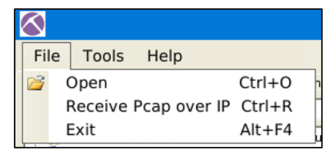

## Tools Menu

The tools menu helps you clear the dashboard and remove the captured data. 
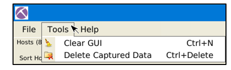

## Help Menu

The help menu provides information on updates and the current version.
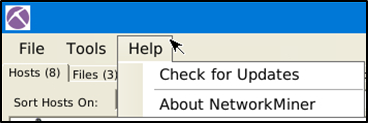

## Case Panel

The case panel shows the list of the investigated pcap files. You can reload/refresh, view metadata details and remove loaded files from this panel.

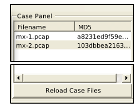

Viewing metadata of loaded files;

## Hosts

The "hosts" menu shows the identified hosts in the pcap file. This section provides information on;

    IP address
    MAC address
    OS type
    Open ports
    Sent/Received packets
    Incoming/Outgoing sessions
    Host details

OS fingerprinting uses the Satori GitHub repo and p0f, and the MAC address database uses the mac-ages GitHub repo.

You can sort the identified hosts by using the sort menu. You can change the colour of the hosts as well. Some of the features (OSINT lookup) are available only in premium mode. The right-click menu also helps you to copy the selected value.
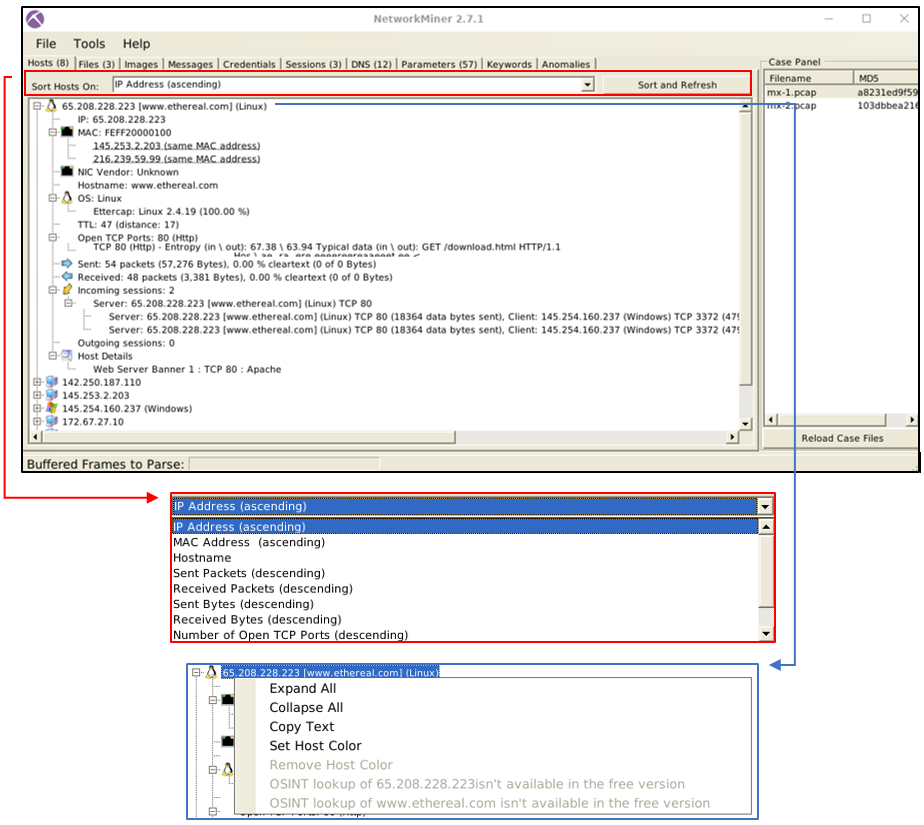

## Sessions

The session menu shows detected sessions in the pcap file. This section provides information on;

    Frame number
    Client and server address
    Source and destination port
    Protocol
    Start time

You can search for keywords inside frames with the help of the filtering bar. It is possible to filter specific columns of the session menu as well. This menu accepts four types of inputs;

    "ExactPhrase"
    "AllWords"
    "AnyWord"
    "RegExe"

## DNS

The DNS menu shows DNS queries with details. This section provides information on;

    Frame number
    Timestamp
    Client and server
    Source and destination port 
    IP TTL
    DNS time
    Transaction ID and type
    DNS query and answer
    Alexa Top 1M

Some of the features (Alexa Top 1M) are available only in premium mode. The search bar is available here as well.

## Credentials

The credentials menu shows extracted credentials and password hashes from investigated pcaps. You can use Hashcat (GitHub) and John the Ripper (GitHub) to decrypt extracted credentials. NetworkMiner can extract credentials including;

    Kerberos hashes
    NTLM hashes
    RDP cookies
    HTTP cookies
    HTTP requests
    IMAP
    FTP
    SMTP
    MS SQL

The right-click menu is helpful in this part as well. You can easily copy the username and password values.
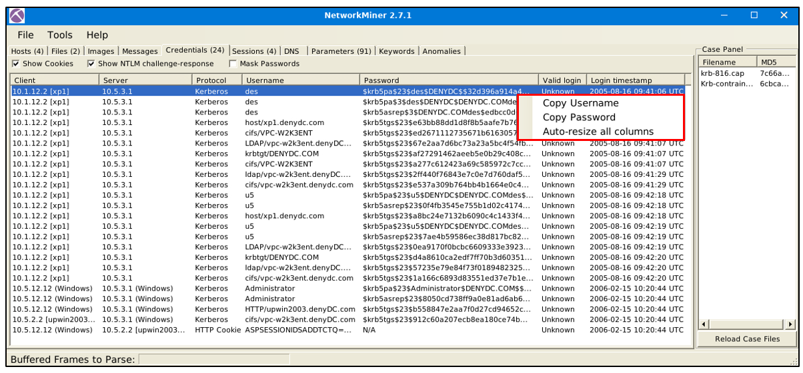

# Tool Overview 2

## Files

The file menu shows extracted files from investigated pcaps. This section provides information on;

    Frame number
    Filename
    Extension
    Size
    Source and destination address
    Source and destination port
    Protocol
    Timestamp
    Reconstructed path
    Details

Some features (OSINT hash lookup and sample submission) are available only in premium mode. The search bar is available here as well. The right-click menu is helpful in this part as well. You can easily open files and folders and view the file details in-depth.
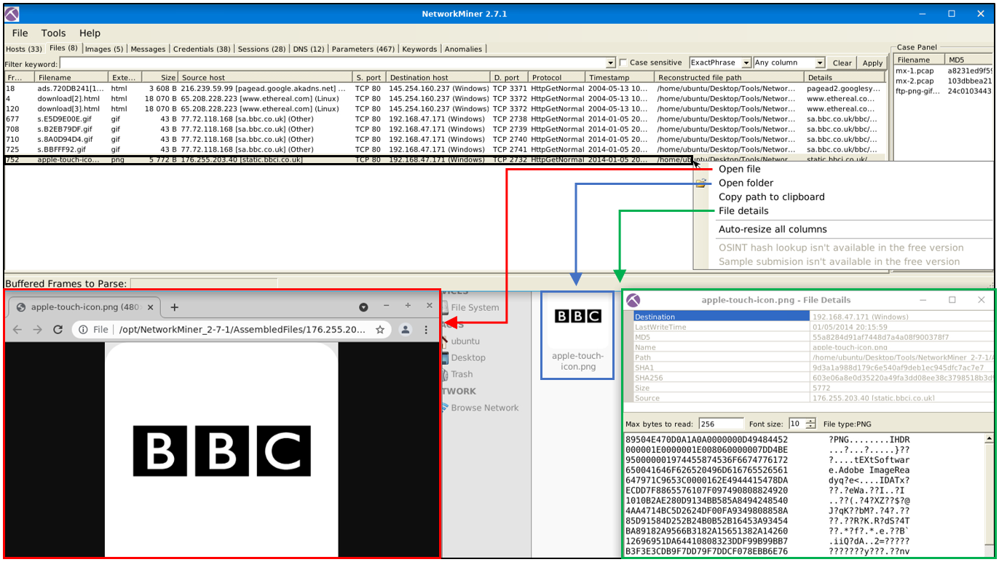

## Images

The file menu shows extracted images from investigated pcaps. The right-click menu is helpful in this part as well. You can open files and zoom in & out easily.
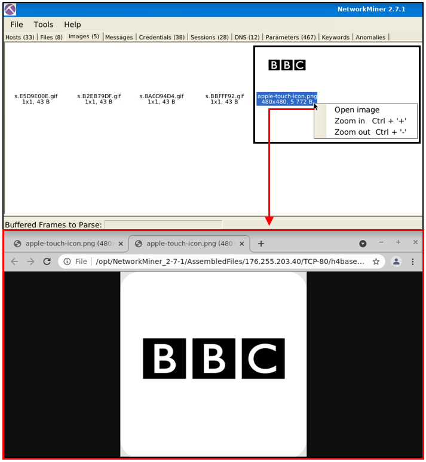

Once you hover over the image, it shows the file's detailed information (source & destination address and file path).

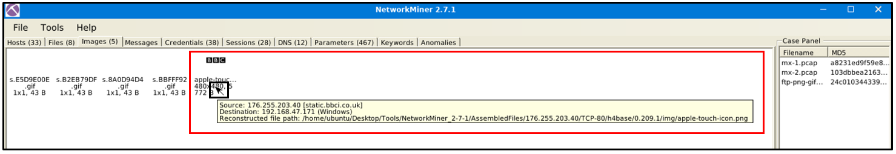

## Parameters

The file menu shows extracted parameters from investigated pcaps. This section provides information on;

    Parameter name
    Parameter value
    Frame number
    Source and destination host
    Source and destination port
    Timestamp
    Details

The right-click menu is helpful in this part as well. You can copy the parameters and values easily.
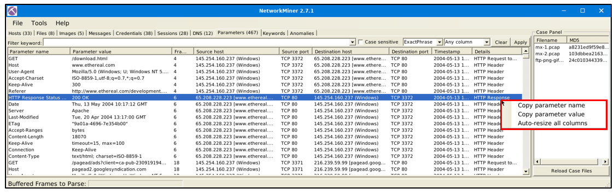

## Keywords

The file menu shows extracted keywords from investigated pcaps. This section provides information on;

    Frame number
    Timestamp
    Keyword
    Context
    Source and destination host
    source and destination port

How to filter keywords;

    Add keywords
    Reload case files!

Note: You can filter multiple keywords in this section; however, you must reload the case files after updating the search keywords. Keyword search investigates all possible data in the processed pcaps.
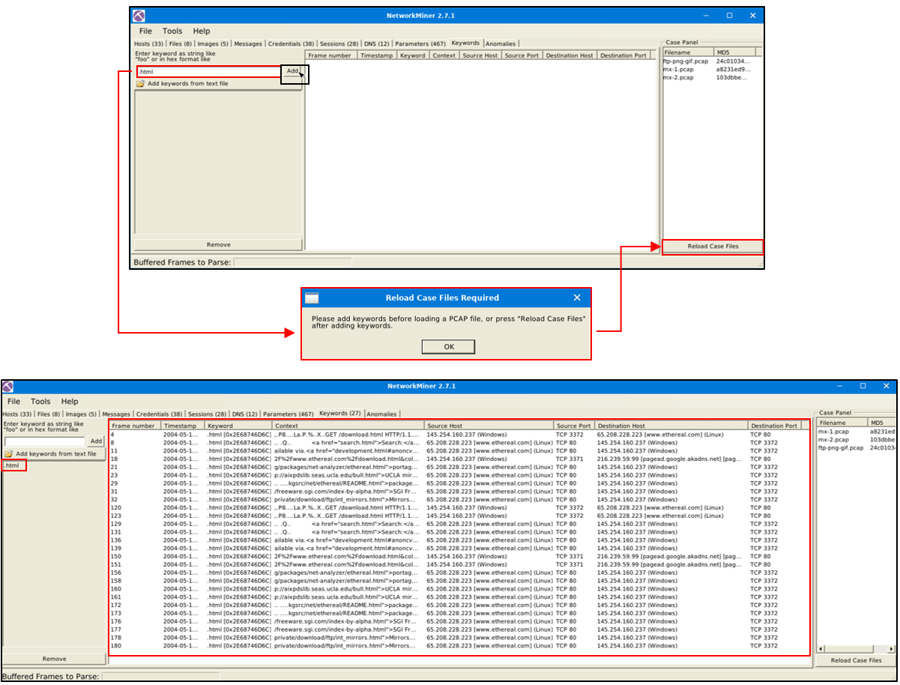

## Messages

The messages menu shows extracted emails, chats and messages from investigated pcaps. This section provides information on;

    Frame number
    Source and destination host 
    Protocol
    Sender (From)
    Receiver (To)
    Timestamp
    Size

Once you filter the traffic and get a hit, you will discover additional details like attachments and attributes on the selected message. Note that the search bar is available here as well. The right-click menu is available here. You can use the built-in viewer to investigate overall information and the "open file" option to explore attachments.
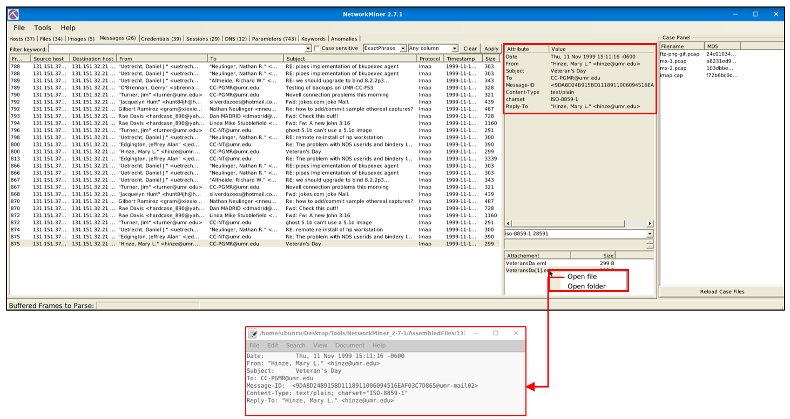

## Anomalies

The anomalies menu shows detected anomalies in the processed pcap. Note that NetworkMiner isn't designated as an IDS. However, developers added some detections for EternalBlue exploit and spoofing attempts.
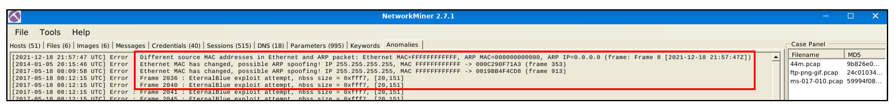

# Version Differences

As always, it wouldn't be surprising to see a feature improvement as the version goes up. Unsurprisingly version upgrades provide stability, security fixes and features. Here the feature part is quite tricky. Feature upgrades can represent implementing new features and updating the existing feature (optimisation, alteration or operation mode modification).

Since there are some significant differences between the versions, the given VM has both of the major versions (v1.6 and v2.7).

Of course, as the program version increases, it is expected to increase feature increase and scope. Here are the significant differences between versions 1.6 and 2.7. Here are the differences;

## Mac Address Processing

NetworkMiner versions after version 2 can process MAC address specific correlation as shown in the picture below. This option will help you identify if there is a MAC Address conflict. This feature is not available before version 2.
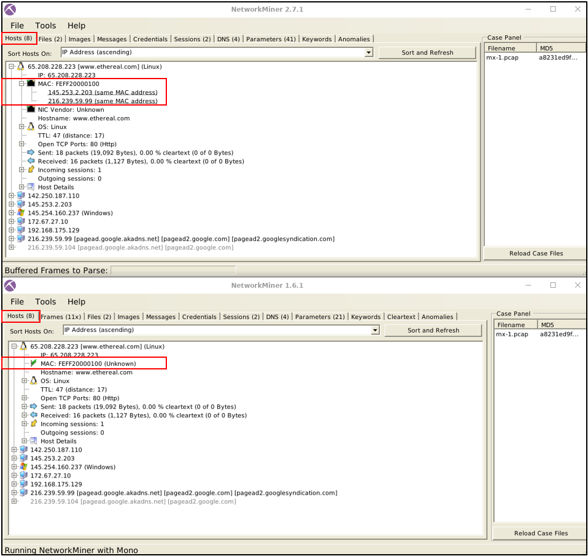

## Sent/Received Packet Processing

NetwrokMiner versions up to version 1.6. can handle packets in much detail. These options will help you investigate the sent/received
packets in a more detailed format. This feature is not available after version 1.6.
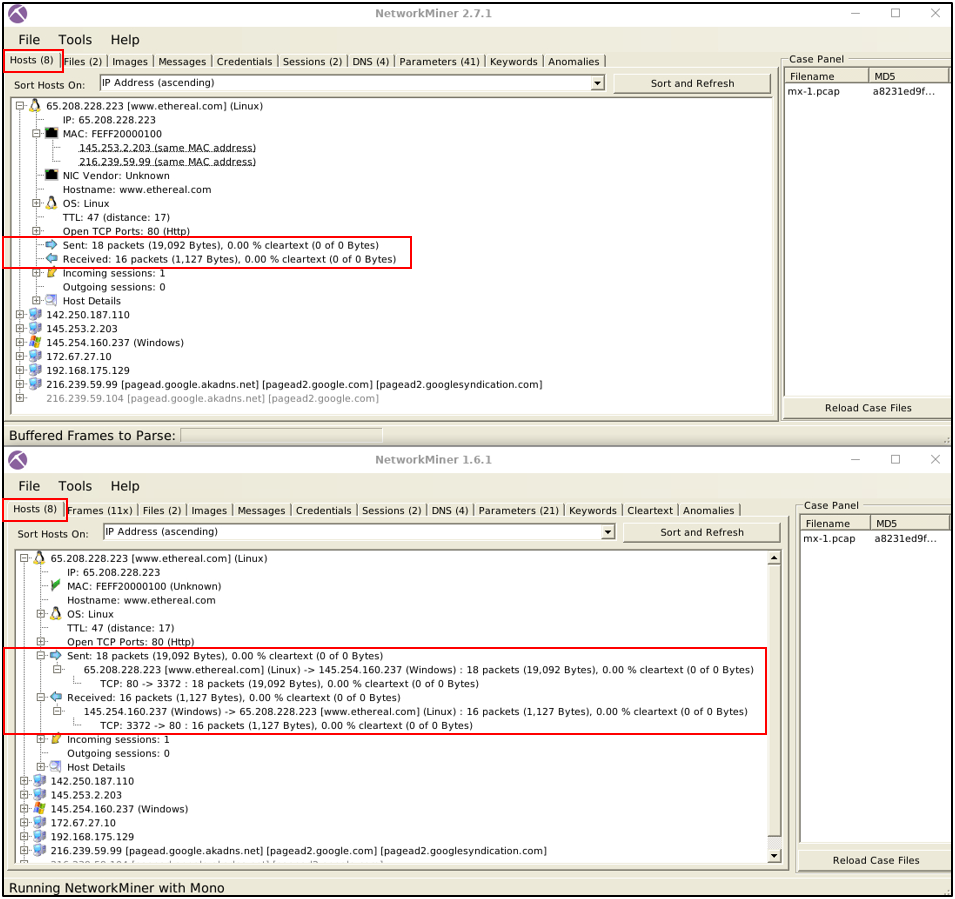

## Frame Processing

NetworkMiner versions up to version 1.6. can handle frames. This option provides the number of frames and essential details about the frames. This feature is not available after version 1.6.
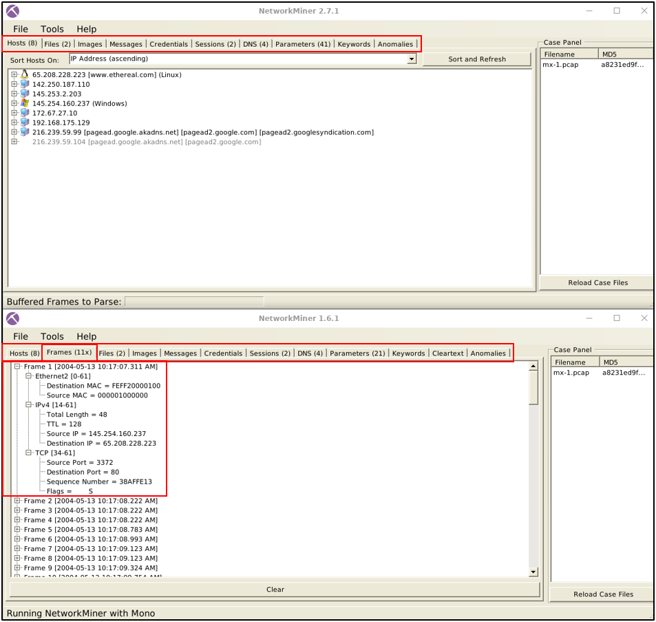

## Parameter Processing

NetworkMiner versions after version 2 can handle parameters in a much more extensive form. Therefore version 1.6.xx catches fewer parameters than version 2.
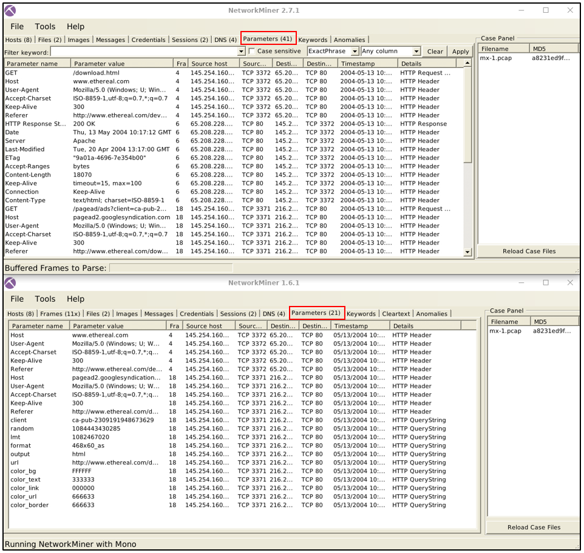

## Cleartext Processing

NetworkMiner versions up to version 1.6. can handle cleartext data. This option provides all extracted cleartext data in a single tab; it is beneficial to investigate cleartext data about the traffic data. However, it is impossible to match the cleartext data and packets. This feature is not available after version 1.6.

