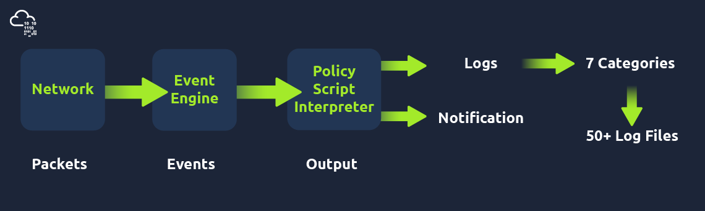
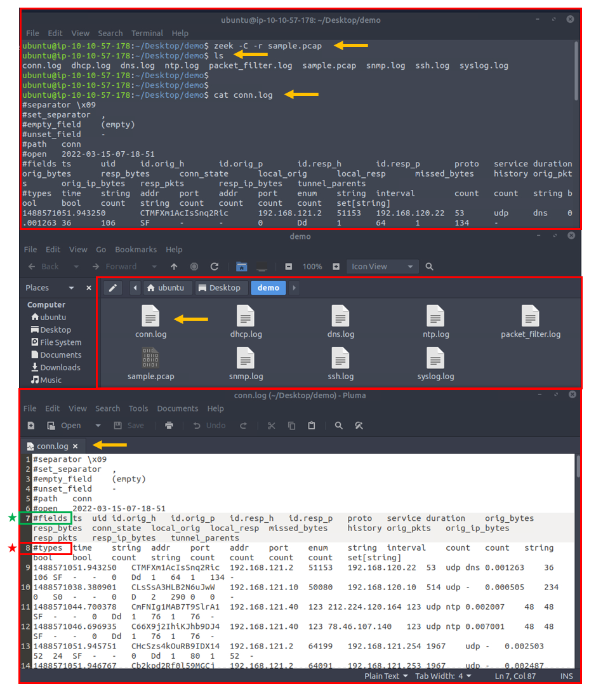

# Introduction

Zeek (formerly Bro) is an open-source and commercial network monitoring tool (traffic analyser).


The official description; "Zeek (formerly Bro) is the world's leading platform for network security monitoring. Flexible, open-source, and powered by defenders." "Zeek is a passive, open-source network traffic analyser. Many operators use Zeek as a network security monitor (NSM) to support suspicious or malicious activity investigations. Zeek also supports a wide range of traffic analysis tasks beyond the security domain, including performance measurement and troubleshooting."


The room aims to provide a general network monitoring overview and work with Zeek to investigate captured traffic.

# Network Security Monitoring and Zeek

## Introduction to Network Monitoring Approaches

Network monitoring is a set of management actions to watch/continuously overview and optionally save the network traffic for further investigation. This action aims to detect and reduce network problems, improve performance, and in some cases, increase overall productivity. It is a main part of the daily IT/SOC operations and differs from Network Security Monitoring (NSM) in its purpose.

### Network Monitoring

Network monitoring is highly focused on IT assets like uptime (availability), device health and connection quality (performance), and network traffic balance and management (configuration). Monitoring and visualising the network traffic, troubleshooting, and root cause analysis are also part of the Network Monitoring process. This model is helpful for network administrators and usually doesn't cover identifying non-asset in-depth vulnerabilities and significant security concerns like internal threats and zero-day vulnerabilities. Usually, Network Monitoring is not within the SOC scope. It is linked to the enterprise IT/Network management team.

### Network Security Monitoring

Network Security Monitoring is focused on network anomalies like rogue hosts, encrypted traffic, suspicious service and port usage, and malicious/suspicious traffic patterns in an intrusion/anomaly detection and response approach. Monitoring and visualising the network traffic and investigating suspicious events is a core part of Network Security Monitoring. This model is helpful for security analysts/incident responders, security engineers and threat hunters and covers identifying threats, vulnerabilities and security issues with a set of rules, signatures and patterns. Network Security Monitoring is part of the SOC, and the actions are separated between tier 1-2-3 analyst levels.

## What is ZEEK?

Zeek (formerly Bro) is an open-source and commercial passive Network Monitoring tool (traffic analysis framework) developed by Lawrence Berkeley Labs. Today, Zeek is supported by several developers, and Corelight provides an Enterprise-ready fork of Zeek. Therefore this tool is called both open source and commercial. The differences between the open-source version and the commercial version are detailed here https://corelight.com/products/compare-to-open-source-zeek?hsLang=en.


Zeek differs from known monitoring and IDS/IPS tools by providing a wide range of detailed logs ready to investigate both for forensics and data analysis actions. Currently, Zeek provides 50+ logs in 7 categories.

### Zeek vs Snort

While both are called IDS/NIDS, it is good to know the cons and pros of each tool and use them in a specific manner. While there are some overlapping functionalities, they have different purposes for usage.

<table class="table table-bordered"><tbody><tr><td><b>Tool</b></td><td><b><span data-testid="glossary-term" class="glossary-term">Zeek</span></b></td><td><b>Snort</b></td></tr><tr><td><b>Capabilities</b></td><td><span data-testid="glossary-term" class="glossary-term">NSM</span> and <span data-testid="glossary-term" class="glossary-term">IDS</span> framework. It is heavily focused on network analysis. It is more focused on specific threats to trigger alerts. The detection mechanism is focused on events.</td><td>An <span data-testid="glossary-term" class="glossary-term">IDS</span>/<span data-testid="glossary-term" class="glossary-term">IPS</span> system. It is heavily focused on signatures to detect vulnerabilities. The detection mechanism is focused on signature patterns and packets.</td></tr><tr><td><b>Cons</b></td><td><p>Hard to use.</p><p>The analysis is done out of the <span data-testid="glossary-term" class="glossary-term">Zeek</span>, manually or by automation.&nbsp;</p></td><td>Hard to detect complex threats.</td></tr><tr><td><b>Pros</b></td><td><p>It provides in-depth traffic visibility.</p><p>Useful for threat hunting.</p><p>Ability to detect complex threats.</p><p>It has a scripting language and supports event correlation.&nbsp;</p><p>Easy to read logs.</p></td><td><p>Easy to write rules.</p><p>Cisco supported rules.</p><p>Community support.</p></td></tr><tr><td><b>Common Use Case</b></td><td>Network monitoring.<br>In-depth traffic investigation. <br>Intrusion detecting in chained events.&nbsp;</td><td>Intrusion detection and prevention. <br>Stop known attacks/threats.</td></tr></tbody></table>

### Zeek Architecture

Zeek has two primary layers; "Event Engine" and "Policy Script Interpreter". The Event Engine layer is where the packets are processed; it is called the event core and is responsible for describing the event without focusing on event details. It is where the packages are divided into parts such as source and destination addresses, protocol identification, session analysis and file extraction. The Policy Script Interpreter layer is where the semantic analysis is conducted. It is responsible for describing the event correlations by using Zeek scripts.


### Zeek Frameworks

Zeek has several frameworks to provide extended functionality in the scripting layer. These frameworks enhance Zeek's flexibility and compatibility with other network components. Each framework focuses on the specific use case and easily runs with Zeek installation. For instance, we will be using the "Logging Framework" for all cases. Having ide on each framework's functionality can help users quickly identify an event of interest. 

Available Frameworks

<table class="table table-bordered"><tbody><tr><td>Logging</td><td>Notice</td><td>Input</td><td>Configuration</td><td>Intelligence</td></tr><tr><td>Cluster</td><td>Broker Communication</td><td>Supervisor</td><td>GeoLocation</td><td>File Analysis</td></tr><tr><td>Signature</td><td>Summary</td><td>NetControl</td><td>Packet Analysis</td><td>TLS Decryption</td></tr></tbody></table>

https://docs.zeek.org/en/master/frameworks/index.html

### Zeek Outputs

As mentioned before, Zeek provides 50+ log files under seven different categories, which are helpful in various areas such as traffic monitoring, intrusion detection, threat hunting and web analytics. This section is not intended to discuss the logs in-depth. The logs are covered in TASK 3.


Once you run Zeek, it will automatically start investigating the traffic or the given pcap file and generate logs automatically. Once you process a pcap with Zeek, it will create the logs in the working directory. If you run the Zeek as a service, your logs will be located in the default log path. The default log path is: `/opt/zeek/logs/ `

### Working with Zeek

There are two operation options for Zeek. The first one is running it as a service, and the second option is running the Zeek against a pcap. Before starting working with Zeek, let's check the version of the Zeek instance with the following command: `zeek -v`

Now we are sure that we have Zeek installed. Let's start the Zeek as a service! To do this, we need to use the "ZeekControl" module, as shown below. The "ZeekControl" module requires superuser permissions to use. You can elevate the session privileges and switch to the superuser account to examine the generated log files with the following command: sudo su


Here we can manage the Zeek service and view the status of the service. Primary management of the Zeek service is done with three commands; "status", "start", and "stop".
```        
root@ubuntu$ zeekctl
Welcome to ZeekControl 2.X.0
[ZeekControl] > status
Name         Type       Host          Status    Pid    Started
zeek         standalone localhost     stopped
[ZeekControl] > start
starting zeek ...
[ZeekControl] > status
Name         Type       Host          Status    Pid    Started
zeek         standalone localhost     running   2541   13 Mar 18:25:08
[ZeekControl] > stop
stopping zeek ...
[ZeekControl] > status
Name         Type       Host          Status    Pid    Started
zeek         standalone localhost     stopped
```
        
You can also use the "ZeekControl" mode with the following commands as well;

    zeekctl status
    zeekctl start 
    zeekctl stop 

The only way to listen to the live network traffic is using Zeek as a service. Apart from using the Zeek as a network monitoring tool, we can also use it as a packet investigator. To do so, we need to process the pcap files with Zeek, as shown below. Once you process a pcap file, Zeek automatically creates log files according to the traffic.


In pcap processing mode, logs are saved in the working directory. You can view the generated logs using the `ls -l` command. 
```
root@ubuntu$ zeek -C -r sample.pcap 

root@ubuntu$ ls -l
-rw-r--r-- 1 ubuntu ubuntu  11366 Mar 13 20:45 conn.log
-rw-r--r-- 1 ubuntu ubuntu    763 Mar 13 20:45 dhcp.log
-rw-r--r-- 1 ubuntu ubuntu   2918 Mar 13 20:45 dns.log
-rw-r--r-- 1 ubuntu ubuntu    254 Mar 13 20:45 packet_filter.log 
```
         
Main Zeek command line parameters are explained below;
<table class="table table-bordered"><tbody><tr><td><b>Parameter</b></td><td><b>Description</b></td></tr><tr><td><b>-r</b></td><td>&nbsp;Reading option, read/process a <span data-testid="glossary-term" class="glossary-term">pcap</span> file.</td></tr><tr><td><b>-C</b></td><td>&nbsp;Ignoring checksum errors.</td></tr><tr><td><b>-v</b></td><td>&nbsp;Version information.</td></tr><tr><td><b>zeekctl</b></td><td>ZeekControl module.</td></tr></tbody></table>

Investigating the generated logs will require command-line tools (cat, cut, grep sort, and uniq) and additional tools (zeek-cut). We will cover them in the following tasks.

# Zeek Logs

Zeek generates log files according to the traffic data. You will have logs for every connection in the wire, including the application level protocols and fields. Zeek is capable of identifying 50+ logs and categorising them into seven categories. Zeek logs are well structured and tab-separated ASCII files, so reading and processing them is easy but requires effort. You should be familiar with networking and protocols to correlate the logs in an investigation, know where to focus, and find a specific piece of evidence.


Each log output consists of multiple fields, and each field holds a different part of the traffic data. Correlation is done through a unique value called "UID". The "UID" represents the unique identifier assigned to each session.

Zeek logs in a nutshell;
<table class="table table-bordered"><tbody><tr><td><span style="font-weight:bolder">Category</span><br></td><td><span style="font-weight:bolder">Description</span><br></td><td><b>Log Files</b></td></tr><tr><td><span style="font-weight:bolder">Network</span><br></td><td>Network protocol logs.<br></td><td style="text-align:justify"><i>conn.log, dce_rpc.log, <span data-testid="glossary-term" class="glossary-term">dhcp</span>.log, dnp3.log, <span data-testid="glossary-term" class="glossary-term">dns</span>.log, <span data-testid="glossary-term" class="glossary-term">ftp</span>.log, <span data-testid="glossary-term" class="glossary-term">http</span>.log, <span data-testid="glossary-term" class="glossary-term">irc</span>.log, <span data-testid="glossary-term" class="glossary-term">kerberos</span>.log, modbus.log, modbus_register_change.log, mysql.log, <span data-testid="glossary-term" class="glossary-term">ntlm</span>.log, <span data-testid="glossary-term" class="glossary-term">ntp</span>.log, radius.log, <span data-testid="glossary-term" class="glossary-term">rdp</span>.log, rfb.log, sip.log, smb_cmd.log, smb_files.log, smb_mapping.log, <span data-testid="glossary-term" class="glossary-term">smtp</span>.log, snmp.log, socks.log, <span data-testid="glossary-term" class="glossary-term">ssh</span>.log, ssl.log, syslog.log, tunnel.log.</i><br></td></tr><tr><td><span style="font-weight:bolder">Files</span><br></td><td>File analysis result logs.<br></td><td style="text-align:left"><i>files.log, ocsp.log, <span data-testid="glossary-term" class="glossary-term">pe</span>.log, x509.log.</i><br></td></tr><tr><td><span style="font-weight:bolder">NetControl</span><br></td><td>Network control and flow logs.<br></td><td style="text-align:left"><i>netcontrol.log, netcontrol_drop.log, netcontrol_shunt.log, netcontrol_catch_release.log, openflow.log.</i><br></td></tr><tr><td><span style="font-weight:bolder">Detection</span><br></td><td>Detection and possible indicator logs.<br></td><td style="text-align:justify"><i>intel.log, notice.log, notice_alarm.log, signatures.log, traceroute.log.</i><br></td></tr><tr><td><span style="font-weight:bolder">Network Observations</span><br></td><td>Network flow logs.<br></td><td style="text-align:left"><i>known_certs.log, known_hosts.log, known_modbus.log, known_services.log, software.log.</i><br></td></tr><tr><td><span style="font-weight:bolder">Miscellaneous</span><br></td><td>Additional logs cover external alerts, inputs and failures.<br></td><td style="text-align:left"><i>barnyard2.log, dpd.log, unified2.log, unknown_protocols.log, weird.log, weird_stats.log.</i><br></td></tr><tr><td><span style="font-weight:bolder"><span data-testid="glossary-term" class="glossary-term">Zeek</span> Diagnostic</span><br></td><td><span data-testid="glossary-term" class="glossary-term">Zeek</span> diagnostic logs cover system messages, actions and some statistics.<br></td><td style="text-align:left"><i>broker.log, capture_loss.log, cluster.log, config.log, loaded_scripts.log, packet_filter.log, print.log, prof.log, reporter.log, stats.log, stderr.log, stdout.log.</i><br></td></tr></tbody></table>

Please refer to Zeek's official documentation and [Corelight log cheat sheet](zeek-corelight-cheatsheet-poster.pdf) for more information. Although there are multiple log files, some log files are updated daily, and some are updated in each session. Some of the most commonly used logs are explained in the given table.

<table class="table table-bordered"><tbody><tr><td><b>Update Frequency</b></td><td><b>Log Name<br></b></td><td><b>Description</b><br></td></tr><tr><td><b>Daily</b></td><td><i>known_hosts.log</i></td><td style="text-align:left">&nbsp;List of hosts that completed <span data-testid="glossary-term" class="glossary-term">TCP</span> handshakes.</td></tr><tr><td><b>Daily</b></td><td><i>known_services.log</i></td><td style="text-align:left">&nbsp;List of services used by hosts.</td></tr><tr><td><b>Daily</b></td><td><i>known_certs.log</i></td><td style="text-align:left">&nbsp;List of SSL certificates.</td></tr><tr><td><b>Daily</b></td><td><i>software.log</i></td><td style="text-align:left">&nbsp;List of software used on the network.</td></tr><tr><td><b>Per Session</b></td><td><i>notice.log</i></td><td style="text-align:left">&nbsp;Anomalies detected by <span data-testid="glossary-term" class="glossary-term">Zeek</span>.</td></tr><tr><td><b>Per Session</b><br></td><td><i>intel.log</i></td><td style="text-align:left">&nbsp;Traffic contains malicious patterns/indicators.</td></tr><tr><td><span style="font-weight:bolder">Per Session</span><br></td><td><i>signatures.log</i></td><td style="text-align:left">&nbsp;List of triggered signatures.</td></tr></tbody></table>

This is too much protocol and log information! Yes, it is true; a difficulty of working with Zeek is having the required network knowledge and investigation mindset.
#
### Brief log usage primer table;
<table class="table table-bordered"><tbody><tr><td><b>Overall Info</b></td><td><b>Protocol Based</b></td><td><b>Detection</b></td><td><b>Observation</b></td></tr><tr><td><i>conn.log</i></td><td><i><span data-testid="glossary-term" class="glossary-term">http</span>.log</i></td><td><i>notice.log</i></td><td><i>known_host.log</i></td></tr><tr><td><i>files.log</i></td><td><i><span data-testid="glossary-term" class="glossary-term">dns</span>.log</i></td><td><i>signatures.log</i></td><td><i>known_services.log</i></td></tr><tr><td><i>intel.log</i></td><td><i><span data-testid="glossary-term" class="glossary-term">ftp</span>.log</i></td><td><i><span data-testid="glossary-term" class="glossary-term">pe</span>.log</i></td><td><i>software.log</i></td></tr><tr><td><i>loaded_scripts.log</i></td><td><i><span data-testid="glossary-term" class="glossary-term">ssh</span>.log</i></td><td><i>traceroute.log</i></td><td><i>weird.log</i></td></tr></tbody></table>

You can categorise the logs before starting an investigation. Thus, finding the evidence/anomaly you are looking for will be easier. The given table is a brief example of using multiple log files. You can create your working model or customise the given one. Make sure you read each log description and understand the purpose to know what to expect from the corresponding log file. Note that these are not the only ones to focus on. Investigated logs are highly associated with the investigation case type and hypothesis, so do not just rely only on the logs given in the example table!

The table shows us how to use multiple logs to identify anomalies and run an investigation by correlating across the available logs.


    - Overall Info: The aim is to review the overall connections, shared files, loaded scripts and indicators at once. This is the first step of the investigation.

    - Protocol Based: Once you review the overall traffic and find suspicious indicators or want to conduct a more in-depth investigation, you focus on a specific protocol.

    - Detection: Use the prebuild or custom scripts and signature outcomes to support your findings by having additional indicators or linked actions. 
    
    - Observation: The summary of the hosts, services, software, and unexpected activity statistics will help you discover possible missing points and conclude the investigation.
#

Remember, we mention the pros and cons of the Zeek logs at the beginning of this task. Now let's demonstrate the log viewing and identify the differences between them.

<b>Recall 1</b>: Zeek logs are well structured and tab-separated ASCII files, so reading and processing them is easy but requires effort.

<b>Recall 2</b>: Investigating the generated logs will require command-line tools (cat, cut, grep sort, and uniq) and additional tools (zeek-cut). 

### Opening a Zeek log with a text editor and built-in commands;


The above image shows that reading the logs with tools is not enough to spot an anomaly quickly. Logs provide a vast amount of data to investigate and correlate. You will need to have technical knowledge and event correlation ability to carry out an investigation. It is possible to use external visualisation and correlation tools such as ELK and Splunk. We will focus on using and processing the logs with a hands-on approach in this room. 

In addition to Linux command-line tools, one auxiliary program called `zeek-cut` reduces the effort of extracting specific columns from log files. Each log file provides "field names" in the beginning. This information will help you while using `zeek-cut`. Make sure that you use the "fields" and not the "types".

<table class="table table-bordered"><tbody><tr><td><b>Tool/Auxilary Name</b></td><td><b>Purpose</b></td></tr><tr><td><b><span data-testid="glossary-term" class="glossary-term">Zeek</span>-cut</b></td><td>Cut specific columns from <span data-testid="glossary-term" class="glossary-term">zeek</span> logs.</td></tr></tbody></table>

Let's see the "zeek-cut" in action. Let's extract the uid, protocol, source and destination hosts, and source and destination ports from the conn.log. We will first read the logs with the cat command and then extract the event of interest fields with zeek-cut auxiliary to compare the difference.

```
root@ubuntu$ cat conn.log 
...
#fields	ts	uid	id.orig_h	id.orig_p	id.resp_h	id.resp_p	proto	service	duration	orig_bytes	resp_bytes	conn_state	local_orig	local_resp	missed_bytes	history	orig_pkts	orig_ip_bytes	resp_pkts	resp_ip_bytes	tunnel_parents
#types	time	string	addr	port	addr	port	enum	string	interval	count	count	string	bool	bool	count	string	count	count	count	count	set[string]
1488571051.943250	CTMFXm1AcIsSnq2Ric	192.168.121.2	51153	192.168.120.22	53	udp	dns	0.001263	36	106	SF	-	-0	Dd	1	64	1	134	-
1488571038.380901	CLsSsA3HLB2N6uJwW	192.168.121.10	50080	192.168.120.10	514	udp	-	0.000505	234	0	S0	-	-0	D	2	290	0	0	-

root@ubuntu$ cat conn.log | zeek-cut uid proto id.orig_h id.orig_p id.resp_h id.resp_p 
CTMFXm1AcIsSnq2Ric	udp	192.168.121.2	51153	192.168.120.22	53
CLsSsA3HLB2N6uJwW	udp	192.168.121.10	50080	192.168.120.10	514
```

As shown in the above output, the "zeek-cut" auxiliary provides massive help to extract specific fields with minimal effort. Now take time to read log formats, practice the log reading/extracting operations and answer the questions.

Q1 - Investigate the sample.pcap file. Investigate the dhcp.log file. What is the available hostname?

A1 - Microknoppix

```
ubuntu@ip-10-10-83-189:~/Desktop/Exercise-Files/TASK-3$ zeek -C -r sample.pcap 
ubuntu@ip-10-10-83-189:~/Desktop/Exercise-Files/TASK-3$ cat dhcp.log 
#separator \x09
#set_separator	,
#empty_field	(empty)
#unset_field	-
#path	dhcp
#open	2025-02-11-02-16-24
#fields	ts	uids	client_addr	server_addr	mac	host_name	client_fqdn	domain	requested_addr	assigned_addr	lease_time	client_message	server_message	msg_types	duration
#types	time	set[string]	addr	addr	string	string	string	string	addr	addr	interval	string	string	vector[string]	interval
1488571152.666896	CzKQsy19lvVYKUa4jc,C8pvpG3GeFUPfsdOt3	-	-	00:21:70:e9:bb:47	Microknoppix	-	-	192.168.20.11	-	--	-	REQUEST,NAK	0.009251
1488571152.699148	Cr27VD1GElTt2sN15g,C8pvpG3GeFUPfsdOt3	192.168.30.11	192.168.30.1	00:21:70:e9:bb:47	Microknoppix	-	webernetz.net	192.168.30.11	192.168.30.11	86400.000000	-	-	DISCOVER,OFFER,REQUEST,ACK	0.022753
#close	2025-02-11-02-16-24
```
```
ubuntu@ip-10-10-83-189:~/Desktop/Exercise-Files/TASK-3$ cat dhcp.log | zeek-cut host_name
Microknoppix
Microknoppix
```
Q2 - Investigate the dns.log file. What is the number of unique DNS queries?

A2 - 2 

```
ubuntu@ip-10-10-83-189:~/Desktop/Exercise-Files/TASK-3$ cat dns.log 
#separator \x09
#set_separator	,
#empty_field	(empty)
#unset_field	-
#path	dns
#open	2025-02-11-02-16-24
#fields	ts	uid	id.orig_h	id.orig_p	id.resp_h	id.resp_p	proto	trans_id	rtt	query	qclass	qclass_name	qtype	qtype_name	rcode	rcode_name	AA	TC	RD	RA	Z	answers	TTLs	rejected
#types	time	string	addr	port	addr	port	enum	count	intervalstring	count	string	count	string	count	string	bool	bool	bool	bool	count	vector[string]	vector[interval]	bool
1488571051.943250	CakcVyvg9OqfivTKb	192.168.121.2	51153	192.168.120.22	53	udp	46282	0.001263	blog.webernetz.net	1	C_INTERNET	1	A	0	NOERROR	F	F	T	T	05.35.226.136	18180.000000	F
1488571111.943319	CoQOtD2yERiDehmgzh	192.168.121.2	55916	192.168.120.22	53	udp	12856	-	blog.webernetz.net	1	C_INTERNET	1	A	-	-	F	F	T	F	0	--	F
1488571114.941785	CoQOtD2yERiDehmgzh	192.168.121.2	55916	192.168.120.22	53	udp	12856	-	blog.webernetz.net	1	C_INTERNET	1	A	-	-	F	F	T	F	0	--	F
1488571117.941752	CoQOtD2yERiDehmgzh	192.168.121.2	55916	192.168.120.22	53	udp	12856	-	blog.webernetz.net	1	C_INTERNET	1	A	-	-	F	F	T	F	0	--	F
1488571120.941715	CoQOtD2yERiDehmgzh	192.168.121.2	55916	192.168.120.22	53	udp	12856	-	blog.webernetz.net	1	C_INTERNET	1	A	-	-	F	F	T	F	0	--	F
1488571171.944137	Cn7xSN1IBHRiRXe0B9	192.168.121.2	64768	192.168.120.22	53	udp	49578	-	blog.webernetz.net	1	C_INTERNET	1	A	-	-	F	F	T	F	0	--	F
1488571174.942481	Cn7xSN1IBHRiRXe0B9	192.168.121.2	64768	192.168.120.22	53	udp	49578	-	blog.webernetz.net	1	C_INTERNET	1	A	-	-	F	F	T	F	0	--	F
1488571177.942580	Cn7xSN1IBHRiRXe0B9	192.168.121.2	64768	192.168.120.22	53	udp	49578	-	blog.webernetz.net	1	C_INTERNET	1	A	-	-	F	F	T	F	0	--	F
1488571180.942543	Cn7xSN1IBHRiRXe0B9	192.168.121.2	64768	192.168.120.22	53	udp	49578	-	blog.webernetz.net	1	C_INTERNET	1	A	-	-	F	F	T	F	0	--	F
1488571231.945206	CmtK2X2Dax7cFJxi5b	192.168.121.2	58304	192.168.120.22	53	udp	25350	-	blog.webernetz.net	1	C_INTERNET	1	A	-	-	F	F	T	F	0	--	F
1488571234.943173	CmtK2X2Dax7cFJxi5b	192.168.121.2	58304	192.168.120.22	53	udp	25350	-	blog.webernetz.net	1	C_INTERNET	1	A	-	-	F	F	T	F	0	--	F
1488571237.943159	CmtK2X2Dax7cFJxi5b	192.168.121.2	58304	192.168.120.22	53	udp	25350	-	blog.webernetz.net	1	C_INTERNET	1	A	-	-	F	F	T	F	0	--	F
1488571240.944104	CmtK2X2Dax7cFJxi5b	192.168.121.2	58304	192.168.120.22	53	udp	25350	-	blog.webernetz.net	1	C_INTERNET	1	A	-	-	F	F	T	F	0	--	F
1488571291.946026	CtpjALlqgoHXswEMf	192.168.121.2	56469	192.168.120.22	53	udp	10917	0.001252	blog.webernetz.net	1	C_INTERNET	1	A	0	NOERROR	F	F	T	T	05.35.226.136	17940.000000	F
1488571351.947847	CHYk4q1AfvzMLPZS91	192.168.121.2	62383	192.168.120.22	53	udp	58775	0.001001	blog.webernetz.net	1	C_INTERNET	1	A	0	NOERROR	F	F	T	T	05.35.226.136	17880.000000	F
1488571353.387074	CdnATC37tUKnWrXx9l	2003:51:6012:121::2	64387	2003:51:6012:120::a08:53	53	udp	28238	0.001122	ip.webernetz.net1	C_INTERNET	28	AAAA	0	NOERROR	F	F	T	T0	2003:51:6012:110::19	62409.000000	F
#close	2025-02-11-02-16-24


ubuntu@ip-10-10-83-189:~/Desktop/Exercise-Files/TASK-3$ cat dns.log | zeek-cut query
blog.webernetz.net
blog.webernetz.net
blog.webernetz.net
blog.webernetz.net
blog.webernetz.net
blog.webernetz.net
blog.webernetz.net
blog.webernetz.net
blog.webernetz.net
blog.webernetz.net
blog.webernetz.net
blog.webernetz.net
blog.webernetz.net
blog.webernetz.net
blog.webernetz.net
ip.webernetz.net
```

Q3 - Investigate the conn.log file. What is the longest connection duration?

A3 - 332.319364

```
ubuntu@ip-10-10-83-189:~/Desktop/Exercise-Files/TASK-3$ cat conn.log 
#separator \x09
#set_separator	,
#empty_field	(empty)
#unset_field	-
#path	conn
#open	2025-02-11-02-16-24
#fields	ts	uid	id.orig_h	id.orig_p	id.resp_h	id.resp_p	proto	service	duration	orig_bytes	resp_bytes	conn_state	local_orig	local_resp	missed_bytes	history	orig_pkts	orig_ip_bytes	resp_pkts	resp_ip_bytes	tunnel_parents
#types	time	string	addr	port	addr	port	enum	string	intervalcount	count	string	bool	bool	count	string	count	count	count	count	set[string]
1488571051.943250	CakcVyvg9OqfivTKb	192.168.121.2	51153	192.168.120.22	53	udp	dns	0.001263	36	106	SF	-	-0	Dd	1	64	1	134	-
1488571038.380901	COLRrT23LwiuKc0mwi	192.168.121.10	50080	192.168.120.10	514	udp	-	0.000505	234	0	S0	-	-0	D	2	290	0	0	-
1488571044.700378	CvUUIbWG1SVSGE2Ca	192.168.121.40	123	212.224.120.164	123	udp	ntp	0.002007	48	48	SF	-	-0	Dd	1	76	1	76	-
1488571046.696935	C6wOn01ztzAChC69m7	192.168.121.40	123	78.46.107.140	123	udp	ntp	0.007001	48	48	SF	-	-0	Dd	1	76	1	76	-
1488571051.945751	C0uivr4CaekHSqpYtd	192.168.121.2	64199	192.168.121.254	1967	udp	-	0.002503	52	24	SF	-	-0	Dd	1	80	1	52	-
1488571051.946767	CCOb5DfGYg6Aln3s1	192.168.121.2	64091	192.168.121.253	1967	udp	-	0.002487	52	24	SF	-	-0	Dd	1	80	1	52	-
1488571051.952752	C7iRzw4mY0qsY2YGu	192.168.121.2	64091	192.168.121.253	65534	udp	-	0.182281	320	320	SF	-	-0	Dd	10	600	10	600	-

...

1488571032.130926	CgYkgz2XZF3KNTprW4	192.168.121.254	1985	224.0.0.102	1985	udp	-	332.319364	8856	0	S0	-	-0	D	123	12300	0	0	-
1488571037.971338	C8qcQw2XWKoJLHFpwh	fe80::214:69ff:fe9e:1141	521	ff02::9	521	udp	-	319.846921	2304	0	S0	--	0	D	36	4032	0	0	-
1488571051.941752	CLQMsz1keaFPjxT8Cd	192.168.121.2	13	192.168.120.1	14	icmp	-	300.183120	720	360	OTH	-	-0	-	60	2400	30	1200	-
1488571051.941000	Crrsda3SnWYzyNZjO7	2003:51:6012:121::2	128	2a01:488:42:1000:50ed:8588:8a:c570	129	icmp	-	300.012100	168	168	OTH	-	-	0	-	6	456	6	456	-
1488571297.893206	C9ZDhW3KKLLsC7obgb	fe80::214:69ff:fe9e:1141	135	2003:51:6012:121::2	136	icmp	-	36.978736	48	32	OTH	-	-	0	-	2	144	2	128	-
1488571285.619545	C0ukbZ1ISKYkOorae2	fe80::21a:6cff:fea1:2b99	521	ff02::9	521	udp	-	76.127078	600	0	S0	--	0	D	10	1080	0	0	-
1488571044.621117	CljvhS1W5D9fVIq3q2	192.168.20.1	520	224.0.0.9	520	udp	-	305.791751	1008	0	S0	-	-0	D	12	1344	0	0	-
1488571285.709057	CFhKBi2ZQNhYrl5TM2	192.168.121.253	520	224.0.0.9	520	udp	-	59.206449	96	0	S0	-	-0	D	4	208	0	0	-
#close	2025-02-11-02-16-24


ubuntu@ip-10-10-83-189:~/Desktop/Exercise-Files/TASK-3$ cat conn.log | zeek-cut duration
0.001263
0.000505
0.002007
...

31.242600
309.515828
325.924370
331.791038
307.422751
332.319364
319.846921
300.183120
300.012100
36.978736
76.127078
305.791751
59.206449

```

# CLI Kung-Fu Recall: Processing Zeek Logs

Graphical User Interfaces (GUI) are handy and good for accomplishing tasks and processing information quickly. There are multiple advantages of GUIs, especially when processing the information visually. However, when processing massive amounts of data, GUIs are not stable and as effective as the CLI (Command Line Interface) tools.

The critical point is: What if there is no "function/button/feature" for what you want to find/view/extract?

Having the power to manipulate the data at the command line is a crucial skill for analysts. Not only in this room but each time you deal with packets, you will need to use command-line tools, Berkeley Packet Filters (BPF) and regular expressions to find/view/extract the data you are looking for. This task provides quick cheat-sheet like information to help you write CLI queries for your event of interest.

<table class="table table-bordered"><tbody><tr><td><span style="font-weight:bolder">Category</span><br></td><td><span style="font-weight:bolder">Command Purpose and Usage&nbsp;</span><br></td><td><span style="font-weight:bolder">Category</span><br></td><td><span style="font-weight:bolder">Command Purpose and Usage&nbsp;</span><br></td></tr><tr><td><span style="font-weight:bolder">Basics</span><br></td><td><p style="text-align:left"><span style="font-size:1rem">View the command history:<br></span><code>ubuntu@ubuntu$ history</code><span style="font-size:1rem"></span><br></p><p style="text-align:left">Execute the 10th command in history:<br><code style="font-size:14px">ubuntu@ubuntu$ !10</code></p><p style="text-align:left"><span style="font-size:1rem">Execute the previous command:<br></span><code style="font-size:14px">ubuntu@ubuntu$&nbsp;!!</code></p></td><td><span style="font-weight:700">Read&nbsp;</span><b>File</b></td><td><p style="text-align:left;line-height:1"><br></p><p style="text-align:left">Read sample.txt file:<br><code style="font-size:14px">ubuntu@ubuntu$ cat sample.txt</code><b><br></b></p><p style="text-align:left">Read the first 10 lines of the file:<br><code style="font-size:14px">ubuntu@ubuntu$ head sample.txt</code><span style="color:rgb(186, 200, 212);font-family:Consolas, Monaco, &quot;Andale Mono&quot;, &quot;Ubuntu Mono&quot;, monospace;white-space:pre-wrap;background-color:rgb(30, 60, 97)"></span><br></p><p style="text-align:left">Read the last 10 lines of the file:<br><code style="font-size:14px">ubuntu@ubuntu$ tail sample.txt</code></p></td></tr><tr><td><p><span style="font-weight:bolder">Find<br></span><span style="font-weight:bolder;font-size:1rem">&amp;<br></span><span style="font-weight:bolder;font-size:1rem">Filter</span></p></td><td><p style="text-align:left;line-height:1.2"><br></p><p style="text-align:left">Cut the 1st field:<br><code style="font-size:14px">ubuntu@ubuntu$ cat test.txt | cut -f 1</code><br></p><p style="text-align:left">Cut the 1st column:<br><code style="font-size:14px">ubuntu@ubuntu$ cat test.txt | cut -c1</code><span style="font-weight:bolder"><br></span></p><p style="text-align:left">Filter specific keywords:<br><code style="font-size:14px">ubuntu@ubuntu$ cat test.txt | grep 'keywords'</code><br></p><p style="text-align:left">Sort outputs alphabetically:<br><code style="font-size:14px">ubuntu@ubuntu$ cat test.txt | sort</code><span style="font-size:1rem"></span></p><p style="text-align:left">Sort outputs numerically:<br><code style="font-size:14px">ubuntu@ubuntu$ cat test.txt | sort -n</code><span style="font-size:1rem"></span></p><p style="text-align:left">Eliminate duplicate lines:<br><code style="font-size:14px">ubuntu@ubuntu$ cat test.txt | uniq</code><br></p><p style="text-align:left">Count line numbers:<br><code style="font-size:14px">ubuntu@ubuntu$ cat test.txt | wc -l</code><br></p><p style="text-align:left">Show line numbers<span><br></span><code>ubuntu@ubuntu$ cat test.txt | nl</code></p></td><td><span style="font-weight:bolder">Advanced</span><br></td><td><p style="text-align:left"><span style="font-size:1rem"><br></span></p><p style="text-align:left"><span style="font-size:1rem">Print line 11:<br></span><code style="font-size:14px">ubuntu@ubuntu$ cat test.txt | sed -n '11p'</code><span style="font-size:1rem"><br></span></p><p style="text-align:left"><span style="font-size:1rem">Print lines between 10-15:<br></span><code style="font-size:14px">ubuntu@ubuntu$ cat test.txt | sed -n '10,15p'</code><span style="font-size:1rem"></span></p><p style="text-align:left">Print lines below 11:<br><code style="font-size:14px">ubuntu@ubuntu$ cat test.txt | awk 'NR &lt; 11 {print $0}'</code><br></p><p style="text-align:left">Print line 11:<br><code style="font-size:14px">ubuntu@ubuntu$ cat test.txt | awk 'NR == 11 {print $0}'</code></p></td></tr></tbody></table>

<table class="table table-bordered"><tbody><tr><td><b>Special</b></td><td><div style="text-align:justify"><span style="text-align:left;font-size:1rem">Filter specific fields of <span data-testid="glossary-term" class="glossary-term">Zeek</span> logs:</span></div><div style="text-align:justify"><code>ubuntu@ubuntu$ cat signatures.log | zeek-cut uid src_addr dst_addr</code><span style="text-align:left"></span></div></td></tr></tbody></table>

<table class="table table-bordered"><tbody><tr><td><b>Use Case</b></td><td><b>Description</b></td></tr><tr><td><p><code>sort | uniq</code></p></td><td style="text-align:left">Remove duplicate values.<br></td></tr><tr><td><p><code>sort | uniq -c&nbsp;</code></p></td><td style="text-align:left">Remove duplicates and count the number of occurrences for each value.<br></td></tr><tr><td><p><code>sort -nr</code></p></td><td style="text-align:left">Sort values numerically and recursively.</td></tr><tr><td><p><code>rev</code></p></td><td style="text-align:left">Reverse string characters.</td></tr><tr><td><p><code>cut -f 1</code></p></td><td style="text-align:left">Cut field 1.</td></tr><tr><td><p><code>cut -d '.' -f 1-2</code></p></td><td style="text-align:left">Split the string on every dot and print keep the first two fields.</td></tr><tr><td><p><code>grep -v 'test'</code></p></td><td style="text-align:left">Display lines that&nbsp; don't match the "test" string.</td></tr><tr><td><p><code>grep -v -e 'test1' -e 'test2'</code></p></td><td style="text-align:left">Display lines that don't match one or both "test1" and "test2" strings.</td></tr><tr><td><p><code>file&nbsp;</code></p></td><td style="text-align:left">View file information.</td></tr><tr><td><p><code>grep -rin Testvalue1 * | column -t | less -S</code></p></td><td style="text-align:left">Search the "Testvalue1" string everywhere, organise column spaces and view the output with less.</td></tr></tbody></table>

# Zeek Signatures

Zeek supports signatures to have rules and event correlations to find noteworthy activities on the network. Zeek signatures use low-level pattern matching and cover conditions similar to Snort rules. Unlike Snort rules, Zeek rules are not the primary event detection point. Zeek has a scripting language and can chain multiple events to find an event of interest. We focus on the signatures in this task, and then we will focus on Zeek scripting in the following tasks.

Zeek signatures are composed of three logical paths; signature id, conditions and action. The signature breakdown is shown in the table below;

<table class="table table-bordered"><tbody><tr><td><b>Signature id</b></td><td style="text-align:justify"><b>&nbsp;Unique</b> signature name.</td></tr><tr><td><b>Conditions</b></td><td><div style="text-align:justify"><b style="font-size:1rem">Header:&nbsp;</b><span style="text-align:center;background:transparent;font-size:1rem;margin-top:0pt;margin-bottom:0pt">Filtering the packet headers for specific source and destination addresses, protocol and port numbers.</span></div><b><div style="text-align:justify"><b style="font-size:1rem">Content: </b><span style="font-size:1rem;font-weight:400">Filtering the packet payload for specific value/pattern.</span></div></b></td></tr><tr><td><b>Action</b></td><td><p style="text-align:justify;background:transparent;margin-top:0pt;margin-bottom:0pt"><strong>Default action:&nbsp;</strong><span style="background:transparent;margin-top:0pt;margin-bottom:0pt">Create the "signatures.log" file in case of a signature match.</span></p><p style="text-align:justify;background:transparent;margin-top:0pt;margin-bottom:0pt"><strong>Additional action:&nbsp;</strong><span style="background:transparent;margin-top:0pt;margin-bottom:0pt">Trigger a <span data-testid="glossary-term" class="glossary-term">Zeek</span> script.</span></p></td></tr></tbody></table>

Now let's dig more into the Zeek signatures. The below table provides the most common conditions and filters for the Zeek signatures.

<table class="table table-bordered" style="width:1075.56px"><tbody><tr><td><span style="font-weight:bolder">Condition Field</span></td><td><span style="font-weight:bolder">Available Filters</span></td></tr><tr><td><span style="font-weight:bolder">Header</span></td><td><div style="text-align:justify"><span style="font-weight:bolder;font-size:1rem">src-ip:&nbsp;</span><span style="font-size:1rem">Source IP.</span></div><span style="font-weight:bolder"><div style="text-align:justify"><span style="font-weight:bolder;font-size:1rem">dst-ip:&nbsp;</span><span style="font-size:1rem;font-weight:400">Destination IP.</span></div></span><span style="font-weight:bolder"><div style="text-align:justify"><span style="font-weight:bolder;font-size:1rem">src-port:&nbsp;</span><span style="font-size:1rem;font-weight:400">Source port.</span></div></span><span style="font-weight:bolder"><div style="text-align:justify"><span style="font-weight:bolder;font-size:1rem">dst-port:&nbsp;</span><span style="font-size:1rem;font-weight:400">Destination port.</span></div></span><span style="font-weight:bolder"><div style="text-align:justify"><span style="font-weight:bolder;font-size:1rem">ip-proto:</span><span style="font-size:1rem;font-weight:400">&nbsp;Target protocol. Supported protocols; <span data-testid="glossary-term" class="glossary-term">TCP</span>, <span data-testid="glossary-term" class="glossary-term">UDP</span>, ICMP, ICMP6, IP, IP6</span></div></span></td></tr><tr><td><span style="font-weight:bolder">Content</span></td><td style="text-align:justify"><b>payload:</b>&nbsp;Packet payload.<br><b><span data-testid="glossary-term" class="glossary-term">http</span>-request: </b>Decoded&nbsp;<span data-testid="glossary-term" class="glossary-term">HTTP</span> requests.<br><b><span data-testid="glossary-term" class="glossary-term">http</span>-request-header:</b> Client-side <span data-testid="glossary-term" class="glossary-term">HTTP</span> headers.<br><b><span data-testid="glossary-term" class="glossary-term">http</span>-request-body:</b> Client-side <span data-testid="glossary-term" class="glossary-term">HTTP</span> request bodys.<br><b><span data-testid="glossary-term" class="glossary-term">http</span>-reply-header:</b> Server-side <span data-testid="glossary-term" class="glossary-term">HTTP</span> headers.<br><b><span data-testid="glossary-term" class="glossary-term">http</span>-reply-body:</b> Server-side <span data-testid="glossary-term" class="glossary-term">HTTP</span> request bodys.<br><b><span data-testid="glossary-term" class="glossary-term">ftp</span>:</b> Command line input of <span data-testid="glossary-term" class="glossary-term">FTP</span> sessions.<br></td></tr><tr><td><b>Context</b></td><td style="text-align:justify"><b>same-ip:</b> Filtering the source and destination addresses for duplication.<br></td></tr><tr><td><span style="font-weight:bolder">Action</span></td><td style="text-align:justify"><b>event: </b>Signature match message.<br></td></tr><tr><td><b>Comparison<br>Operators</b></td><td style="text-align:justify"><b>==</b>, <b>!=</b>, <b>&lt;</b>, <b>&lt;=</b>, <b>&gt;</b>, <b>&gt;=</b></td></tr><tr><td><b>NOTE!</b></td><td style="text-align:justify">&nbsp;Filters accept string, numeric and regex values.</td></tr></tbody></table>

### Run Zeek with signature file

`ubuntu@ubuntu$ zeek -C -r sample.pcap -s sample.sig`
```
Zeek signatures use the ".sig" extension.

-C: Ignore checksum errors.
-r: Read pcap file.
-s: Use signature file. 
```
### Example | Cleartext Submission of Password

Sample Signature
```
signature http-password {
     ip-proto == tcp
     dst-port == 80
     payload /.*password.*/
     event "Cleartext Password Found!"
}

# signature: Signature name.
# ip-proto: Filtering TCP connection.
# dst-port: Filtering destination port 80.
# payload: Filtering the "password" phrase.
# event: Signature match message.
```

Remember, Zeek signatures support regex. Regex ".*" matches any character zero or more times. The rule will match when a "password" phrase is detected in the packet payload. Once the match occurs, Zeek will generate an alert and create additional log files (signatures.log and notice.log).

### Signature Usage and Log Analysis

```
ubuntu@ubuntu$ zeek -C -r http.pcap -s http-password.sig 
ubuntu@ubuntu$ ls
clear-logs.sh  conn.log  files.log  http-password.sig  http.log  http.pcap  notice.log  packet_filter.log  signatures.log

ubuntu@ubuntu$ cat notice.log  | zeek-cut id.orig_h id.resp_h msg 
10.10.57.178	44.228.249.3	10.10.57.178: Cleartext Password Found!
10.10.57.178	44.228.249.3	10.10.57.178: Cleartext Password Found!

ubuntu@ubuntu$ cat signatures.log | zeek-cut src_addr dest_addr sig_id event_msg 
10.10.57.178		http-password	10.10.57.178: Cleartext Password Found!
10.10.57.178		http-password	10.10.57.178: Cleartext Password Found!
```

As shown in the above terminal output, the signatures.log and notice.log provide basic details and the signature message. Both of the logs also have the application banner field. So it is possible to know where the signature match occurs. Let's look at the application banner!

### Log Analysis

```
ubuntu@ubuntu$ cat signatures.log | zeek-cut sub_msg
POST /userinfo.php HTTP/1.1\x0d\x0aHost: testphp.vulnweb.com\x0d\x0aUser-Agent: Mozilla/5.0 (X11; Ubuntu; Linux x86_64; rv:98.0) Gecko/20100101 Firefox/...

ubuntu@ubuntu$ cat notice.log  | zeek-cut sub
POST /userinfo.php HTTP/1.1\x0d\x0aHost: testphp.vulnweb.com\x0d\x0aUser-Agent: Mozilla/5.0 (X11; Ubuntu; Linux x86_64; rv:98.0) Gecko/20100101 Firefox/...
```

We will demonstrate only one log file output to avoid duplication after this point. You can practice discovering the event of interest by analysing notice.log and signatures.log.

### Example | FTP Brute-force

Let's create another rule to filter FTP traffic. This time, we will use the FTP content filter to investigate command-line inputs of the FTP traffic. The aim is to detect FTP "admin" login attempts. This basic signature will help us identify the admin login attempts and have an idea of possible admin account abuse or compromise events.

Samole Signature
```
signature ftp-admin {
     ip-proto == tcp
     ftp /.*USER.*dmin.*/
     event "FTP Admin Login Attempt!"
}
```

Let's run the Zeek with the signature and investigate the signatures.log and notice.log.

```
ubuntu@ubuntu$ zeek -C -r ftp.pcap -s ftp-admin.sig
ubuntu@ubuntu$ cat signatures.log | zeek-cut src_addr dst_addr event_msg sub_msg | sort -r| uniq
10.234.125.254	10.121.70.151	10.234.125.254: FTP Admin Login Attempt!	USER administrator
10.234.125.254	10.121.70.151	10.234.125.254: FTP Admin Login Attempt!	USER admin 
```
Our rule shows us that there are multiple logging attempts with account names containing the "admin" phrase. The output gives us great information to notice if there is a brute-force attempt for an admin account.


This signature can be considered a case signature. While it is accurate and works fine, we need global signatures to detect the "known threats/anomalies". We will need those case-based signatures for significant and sophistical anomalies like zero-days and insider attacks in the real-life environment. Having individual rules for each case will create dozens of logs and alerts and cause missing the real anomaly. The critical point is logging logically, not logging everything.


We can improve our signature by not limiting the focus only to an admin account. In that case, we need to know how the FTP protocol works and the default response codes. If you don't know these details, please refer to RFC documentation. 


Let's optimise our rule and make it detect all possible FTP brute-force attempts.

This signature will create logs for each event containing "FTP 530 response", which allows us to track the login failure events regardless of username. 

Sample Signature
```
signature ftp-brute {
     ip-proto == tcp
     payload /.*530.*Login.*incorrect.*/
     event "FTP Brute-force Attempt"
}
```

Zeek signature files can consist of multiple signatures. Therefore we can have one file for each protocol/situation/threat type. Let's demonstrate this feature in our global rule.

Sample Signature
```
signature ftp-username {
    ip-proto == tcp
    ftp /.*USER.*/
    event "FTP Username Input Found!"
}

signature ftp-brute {
    ip-proto == tcp
     payload /.*530.*Login.*incorrect.*/
    event "FTP Brute-force Attempt!"
}
```
Let's merge both of the signatures in a single file. We will have two different signatures, and they will generate alerts according to match status. The result will show us how we benefit from this action. Again, we will need the "CLI Kung-Fu" skills to extract the event of interest.


This rule should show us two types of alerts and help us to correlate the events by having "FTP Username Input" and "FTP Brute-force Attempt" event messages. Let's investigate the logs. We're grepping the logs in range 1001-1004 to demonstrate that the first rule matches two different accounts (admin and administrator). 
```
ubuntu@ubuntu$ zeek -C -r ftp.pcap -s ftp-admin.sig
ubuntu@ubuntu$ cat notice.log | zeek-cut uid id.orig_h id.resp_h msg sub | sort -r| nl | uniq | sed -n '1001,1004p'
  1001	CeMYiaHA6AkfhSnd	10.234.125.254	10.121.70.151	10.234.125.254: FTP Username Input Found!	USER admin
  1002	CeMYiaHA6AkfhSnd	10.234.125.254	10.121.70.151	10.121.70.151: FTP Brute-force Attempt!	530 Login incorrect.
  1003	CeDTDZ2erDNF5w7dyf	10.234.125.254	10.121.70.151	10.234.125.254: FTP Username Input Found!	USER administrator
  1004	CeDTDZ2erDNF5w7dyf	10.234.125.254	10.121.70.151	10.121.70.151: FTP Brute-force Attempt!	530 Login incorrect.
```
### Snort Rules in Zeek?


While Zeek was known as Bro, it supported Snort rules with a script called snort2bro, which converted Snort rules to Bro signatures. However, after the rebranding, workflows between the two platforms have changed. The official Zeek document mentions that the script is no longer supported and is not a part of the Zeek distribution.

# Q&A

Q1 Investigate the http.pcap file. Create the  HTTP signature shown in the task and investigate the pcap. What is the source IP of the first event?

A1 10.10.57.178

Q2 What is the source port of the second event?

A2 38712

Investigate the conn.log.

Q3 What is the total number of the sent and received packets from source port 38706?
A3 20

Create the global rule shown in the task and investigate the ftp.pcap file.

Q4 Investigate the notice.log. What is the number of unique events?

A4 1413

Q5 What is the number of ftp-brute signature matches?

A51410

### Answers breakdown

http-password.sig
```
signature http-password {
    ip-proto == tcp
    dst-port == 80
    payload /.*password.*/
    event "Cleartext password found!"
}
```
```
ubuntu@ip-10-10-169-195:~/Desktop/Exercise-Files/TASK-5/http$ zeek -C -r http.pcap -s http-password.sig 

ubuntu@ip-10-10-169-195:~/Desktop/Exercise-Files/TASK-5/http$ ls
clear-logs.sh  files.log          http.log   notice.log         signatures.log
conn.log       http-password.sig  http.pcap  packet_filter.log

ubuntu@ip-10-10-169-195:~/Desktop/Exercise-Files/TASK-5/http$ cat notice.log | zeek-cut id.orig_h msg
10.10.57.178	10.10.57.178: Cleartext password found!
10.10.57.178	10.10.57.178: Cleartext password found!

ubuntu@ip-10-10-169-195:~/Desktop/Exercise-Files/TASK-5/http$ cat notice.log | zeek-cut id.orig_h id.orig_p
10.10.57.178	38706
10.10.57.178	38712

ubuntu@ip-10-10-169-195:~/Desktop/Exercise-Files/TASK-5/http$ cat conn.log | zeek-cut orig_pkts resp_pkts id.orig_p 
4	2	38704
11	9	38706
4	2	38708
4	2	38710
6	5	38712
```

ftp-bruteforce.sig
```
signature ftp-username {
    ip-proto == tcp
    ftp /.*USER.*/
    event "FTP Username Input Found!"
}

signature ftp-brute {
    ip-proto == tcp
    payload /.*530.*Login.*incorrect.*/
    event "FTP Brute-force Attempt!"
}
```
```
ubuntu@ip-10-10-169-195:~/Desktop/Exercise-Files/TASK-5/ftp$ zeek -C -r ftp.pcap -s ftp-bruteforce.sig 

ubuntu@ip-10-10-169-195:~/Desktop/Exercise-Files/TASK-5/ftp$ cat notice.log | zeek-cut uid | sort -r| uniq | wc -l
1413

ubuntu@ip-10-10-169-195:~/Desktop/Exercise-Files/TASK-5/ftp$ cat notice.log | zeek-cut sub | grep 530 | wc -l
1410

```

# Zeek Scripts | Fundamentals

Zeek has its own event-driven scripting language, which is as powerful as high-level languages and allows us to investigate and correlate the detected events. Since it is as capable as high-level programming languages, you will need to spend time on Zeek scripting language in order to become proficient. In this room, we will cover the basics of Zeek scripting to help you understand, modify and create basic scripts. Note that scripts can be used to apply a policy and in this case, they are called policy scripts.

<table class="table table-bordered"><tbody><tr><td style="text-align:left"><span data-testid="glossary-term" class="glossary-term">Zeek</span> has base scripts installed by default,&nbsp;<span style="font-size:1rem">and these are not intended to be modified.</span><br></td><td style="text-align:left"><span>These scripts are located in<br>&nbsp;</span><span style="font-weight:bolder">/opt/<span data-testid="glossary-term" class="glossary-term">zeek</span>/share/<span data-testid="glossary-term" class="glossary-term">zeek</span>/base"</span><span>.</span><br></td></tr><tr><td style="text-align:left"><p style="text-align:left;margin-top:0pt;margin-bottom:0pt;background:transparent;line-height:1.5"><span style="background:transparent;margin-top:0pt;margin-bottom:0pt">User-generated or modified scripts should be located in a specific path.&nbsp;</span></p></td><td style="text-align:left">These scripts are located in<br><b>"/opt/<span data-testid="glossary-term" class="glossary-term">zeek</span>/share/<span data-testid="glossary-term" class="glossary-term">zeek</span>/site"<span>.</span></b><br></td></tr><tr><td style="text-align:left"><p style="text-align:left;margin-top:0pt;margin-bottom:0pt;background:transparent;line-height:1.5"><span style="background:transparent;margin-top:0pt;margin-bottom:0pt">Policy scripts are located in a specific path.&nbsp;</span></p></td><td style="text-align:left"><span>These scripts are located in<br>&nbsp;</span><b>"/opt/<span data-testid="glossary-term" class="glossary-term">zeek</span>/share/<span data-testid="glossary-term" class="glossary-term">zeek</span>/policy"</b><span style="font-weight:bolder"><span>.</span></span><br></td></tr><tr><td style="text-align:left"><p style="background:transparent;margin-top:0pt;margin-bottom:0pt;list-style-type:disc"><span style="background:transparent;margin-top:0pt;margin-bottom:0pt">Like Snort, to automatically load/use a script in live sniffing mode, you must identify the script in the <span data-testid="glossary-term" class="glossary-term">Zeek</span> configuration file. You can also use a script for a single run, just like the signatures.&nbsp;</span></p></td><td style="text-align:left"><span style="background:transparent;margin-top:0pt;margin-bottom:0pt">The configuration file is located in<br>&nbsp;</span><span style="font-weight:bolder">"/opt/<span data-testid="glossary-term" class="glossary-term">zeek</span>/share/<span data-testid="glossary-term" class="glossary-term">zeek</span>/site/local.<span data-testid="glossary-term" class="glossary-term">zeek</span>"</span><span style="background:transparent;margin-top:0pt;margin-bottom:0pt">.</span><br></td></tr></tbody></table>

    Zeek scripts use the ".zeek" extension.
    
    Do not modify anything under the "zeek/base" directory. User-generated and modified scripts should be in the "zeek/site" directory.
    
    You can call scripts in live monitoring mode by loading them with the command load @/script/path or load @script-name in local.zeek file. 
    
    Zeek is event-oriented, not packet-oriented! We need to use/write scripts to handle the event of interest.

### Example: running Zeek with signature

`ubuntu@ubuntu$ zeek -C -r sample.pcap -s sample.sig`

## GUI vs Scripts

Have you ever thought about automating tasks in Wireshark, tshark or tcpdump? Zeek provides that chance to us with its scripting power. Let's say we need to extract all available DHCP hostnames from a pcap file. In that case, we have several options like using tcpdump, Wireshark, tshark or Zeek. 

Let's see Wireshark on the stage first. You can have the same information with Wireshark. However, while this information can be extracted using Wireshark is not easy to transfer the data to another tool for processing. Tcpdump and tshark are command-line tools, and it is easy to extract and transfer the data to another tool for processing and correlating.

### Example: extracting hostnames with tcpdump and tshark
```
ubuntu@ubuntu$ sudo tcpdump -ntr smallFlows.pcap port 67 or port 68 -e -vv | grep 'Hostname Option' | awk -F: '{print $2}' | sort -nr | uniq | nl
     1	 "vinlap01"
     2	 "student01-PC"
ubuntu@ubuntu$ tshark -V -r smallFlows.pcap -Y "udp.port==67 or udp.port==68" -T fields -e dhcp.option.hostname | nl | awk NF
     1	student01-PC
     2	vinlap01
```

Now let's see Zeek scripts in action. First, let's look at the components of the Zeek script. Here the first, second and fourth lines are the predefined syntaxes of the scripting language. The only part we created is the third line which tells Zeek to extract DHCP hostnames. Now compare this automation ease with the rest of the methods. Obviously, this four-line script is easier to create and use. While tcpdump and tshark can provide similar results, transferring uncontrolled data through multiple pipelines is not much preferred.
```
event dhcp_message (c: connection, is_orig: bool, msg: DHCP::Msg, options: DHCP::Options)
{
print options$host_name;
}
```
```
ubuntu@ubuntu$ zeek -C -r smallFlows.pcap dhcp-hostname.zeek 
student01-PC
vinlap01
```

The provided outputs show that our script works fine and can extract the requested information. This should show why Zeek is helpful in data extraction and correlation. Note that Zeek scripting is a programming language itself, and we are not covering the fundamentals of Zeek scripting. In this room, we will cover the logic of Zeek scripting and how to use Zeek scripts. You can learn and practice the Zeek scripting language by using Zeek's official training platform for free.
https://try.bro.org/

There are multiple options to trigger conditions in Zeek. Zeek can use "Built-In Function" (Bif) and protocols to extract information from traffic data. You can find supported protocols and Bif either by looking in your setup or visiting the Zeek repo.
<table class="table table-bordered"><tbody><tr><td><b><span style="font-size:18px">Customized script locations</span></b></td></tr><tr><td><div style="text-align:left"><span style="font-size:1rem">/opt/<span data-testid="glossary-term" class="glossary-term">zeek</span>/share/<span data-testid="glossary-term" class="glossary-term">zeek</span>/base/bif</span></div><div style="text-align:left"><span style="font-size:1rem">/opt/<span data-testid="glossary-term" class="glossary-term">zeek</span>/share/<span data-testid="glossary-term" class="glossary-term">zeek</span>/base/bif/plugins</span></div><div style="text-align:left"><span style="font-size:1rem">/opt/<span data-testid="glossary-term" class="glossary-term">zeek</span>/share/<span data-testid="glossary-term" class="glossary-term">zeek</span>/base/protocols</span></div></td></tr></tbody></table>

# Q&A

Q1 Investigate the smallFlows.pcap file. Investigate the dhcp.log file. What is the domain value of the "vinlap01" host?

A1 astaro_vineyard
```
zeek -C -r smallFlows.pcap
cat dhcp.log
cat dhcp.log | zeek-cut domain
```

Q2 Investigate the bigFlows.pcap file. Investigate the dhcp.log file. What is the number of identified unique hostnames?

A2 17

```
ubuntu@ip-10-10-16-147:~/Desktop/Exercise-Files/TASK-6/bigflow$ zeek -C -r bigFlows.pcap

ubuntu@ip-10-10-16-147:~/Desktop/Exercise-Files/TASK-6/bigflow$ cat dhcp.log | zeek-cut host_name | sort -nr | uniq        
m30-sqdesk
JLT108
JDT95
JDT91
JDT80
JDT168
JDT153
JDT134
JDT131
JDT123
JDT120
JDT115
JDT107
JDT100
JDT096
JDT094
JDT081
-
```
Q3 Investigate the dhcp.log file. What is the identified domain value?

A3 jaalam.net

```
ubuntu@ip-10-10-16-147:~/Desktop/Exercise-Files/TASK-6/bigflow$ cat dhcp.log | zeek-cut domain | sort -nr | uniq
jaalam.net
-
```

# Zeek Scripts | Scripts and Signatures

## Scripts 101 | Write Basic Scripts
Scripts contain operators, types, attributes, declarations and statements, and directives. Let's look at a simple example event called "zeek_init" and "zeek_done". These events work once the Zeek process starts and stops. Note that these events don't have parameters, and some events will require parameters.

Script sample 101.zeek
```
event zeek_init()
    {
     print ("Started Zeek!");
    }
event zeek_done()
    {
    print ("Stopped Zeek!");
    }

# zeek_init: Do actions once Zeek starts its process.
# zeek_done: Do activities once Zeek finishes its process.
# print: Prompt a message on the terminal.
```

Run Zeek with the script

```
ubuntu@ubuntu$ zeek -C -r sample.pcap 101.zeek 
Started Zeek!
Stopped Zeek!
```

The above output shows how the script works and provides messages on the terminal. Zeek will create logs in the working directory separately from the scripts tasks.

Let's print the packet data to the terminal and see the raw data. In this script, we are requesting details of a connection and extracting them without any filtering or sorting of the data. To accomplish this, we are using the "new_connection" event. This event is automatically generated for each new connection. This script provides bulk information on the terminal. We need to get familiar with Zeek's data structure to reduce the amount of information and focus on the event of interest. To do so, we need to investigate the bulk data.

Sample script 102.zeek
```
event new_connection(c: connection)
{
	print c;
}
```
Run Zeek with the script
```
ubuntu@ubuntu$ zeek -C -r sample.pcap 102.zeek 
[id=[orig_h=192.168.121.40, orig_p=123/udp, resp_h=212.227.54.68, resp_p=123/udp], orig=[size=48, state=1, num_pkts=0, num_bytes_ip=0, flow_label=0, l2_addr=00:16:47:df:e7:c1], resp=[size=0, state=0, num_pkts=0, num_bytes_ip=0, flow_label=0, l2_addr=00:00:0c:9f:f0:79], start_time=1488571365.706238, duration=0 secs, service={}, history=D, uid=CajwDY2vSUtLkztAc, tunnel=, vlan=121, inner_vlan=, dpd=, dpd_state=, removal_hooks=, conn=, extract_orig=F, extract_resp=F, thresholds=, dce_rpc=, dce_rpc_state=, dce_rpc_backing=, dhcp=, dnp3=, dns=, dns_state=, ftp=, ftp_data_reuse=F, ssl=, http=, http_state=, irc=, krb=, modbus=, mysql=, ntlm=, ntp=, radius=, rdp=, rfb=, sip=, sip_state=, snmp=, smb_state=, smtp=, smtp_state=, socks=, ssh=, syslog=]
```

The above terminal provides bulk data for each connection. This style is not the best usage, and in real life, we will need to filter the information for specific purposes. If you look closely at the output, you can see an ID and field value for each part.

To filter the event of interest, we will use the primary tag (in this case, it is c --comes from "c: connection"--), id value (id=), and field name. You should notice that the fields are the same as the fields in the log files.

Sample Script 103.zeek
```
event new_connection(c: connection)
{
	print ("###########################################################");
	print ("");
	print ("New Connection Found!");
	print ("");
	print fmt ("Source Host: %s # %s --->", c$id$orig_h, c$id$orig_p);
	print fmt ("Destination Host: resp: %s # %s <---", c$id$resp_h, c$id$resp_p);
	print ("");
}

# %s: Identifies string output for the source.
# c$id: Source reference field for the identifier.
```

Now you have a general idea of running a script and following the provided output on the console. Let's look closer to another script that extracts specific information from packets. The script above creates logs and prompts each source and destination address for each connection. 

Let's see this script in action.
```
ubuntu@ubuntu$ zeek -C -r sample.pcap 103.zeek 
###########################################################
New Connection Found! Source Host: 192.168.121.2 # 58304/udp ---> 
Destination Host: resp: 192.168.120.22 # 53/udp <--- 
###########################################################
```
The above output shows that we successfully extract specific information from the events. Remember that this script extracts the event of interest (in this example, a new connection), and we still have logs in the working directory. We can always modify and optimise the scripts at any time.

## Scripts 201 | Use Scripts and Signatures Together
Up to here, we covered the basics of Zeek scripts. Now it is time to use scripts collaboratively with other scripts and signatures to get one step closer to event correlation. Zeek scripts can refer to signatures and other Zeek scripts as well. This flexibility provides a massive advantage in event correlation.

Let's demonstrate this concept with an example. We will create a script that detects if our previously created "ftp-admin" rule has a hit. 

Sample Script 201.zeek
```
event signature_match (state: signature_state, msg: string, data: string)
{
if (state$sig_id == "ftp-admin")
    {
    print ("Signature hit! --> #FTP-Admin ");
    }
}
```
This basic script quickly checks if there is a signature hit and provides terminal output to notify us. We are using the "signature_match" event to accomplish this. You can read more about events here https://docs.zeek.org/en/master/scripts/base/bif/event.bif.zeek.html.

Note that we are looking only for "ftp-admin" signature hits. The signature is shown below. 

Sample Script ftp-admin.sig
```
signature ftp-admin {
    ip-proto == tcp
    ftp /.*USER.*admin.*/
    event "FTP Username Input Found!"
}
```
```
ubuntu@ubuntu$ zeek -C -r ftp.pcap -s ftp-admin.sig 201.zeek 
Signature hit! --> #FTP-Admin Signature hit! --> #FTP-Admin
Signature hit! --> #FTP-Admin Signature hit! --> #FTP-Admin
```

The above output shows that we successfully combined the signature and script. Zeek processed the signature and logs then the script controlled the outputs and provided a terminal output for each rule hit.

## Scripts 202 | Load Local Scripts

### Load all local scripts

We mentioned that Zeek has base scripts located in "/opt/zeek/share/zeek/base". You can load all local scripts identified in your "local.zeek" file. Note that base scripts cover multiple framework functionalities. You can load all base scripts by easily running the `local` command.

```
ubuntu@ubuntu$ zeek -C -r ftp.pcap local 
ubuntu@ubuntu$ ls
101.zeek  103.zeek          clear-logs.sh  ftp.pcap            packet_filter.log  stats.log
102.zeek  capture_loss.log  conn.log       loaded_scripts.log  sample.pcap        weird.log 
```

The above output demonstrates how to run all base scripts using the "local" command. Look at the above terminal output; Zeek provided additional log files this time. Loaded scripts generated loaded_scripts.log, capture_loss.log, notice.log, stats.log files. Note that, in our instance, 465 scripts loaded and used by using the "local" command. However, Zeek doesn't provide log files for the scripts doesn't have hits or results.

### Load Specific Scripts

Another way to load scripts is by identifying the script path. In that case, you have the opportunity of loading a specific script or framework. Let's go back to FTP brute-forcing case. We created a script that detects multiple admin login failures in previous steps. Zeek has an FTP brute-force detection script as well. Now let's use the default script and identify the differences. 

```
ubuntu@ubuntu$ zeek -C -r ftp.pcap /opt/zeek/share/zeek/policy/protocols/ftp/detect-bruteforcing.zeek 

ubuntu@ubuntu$ cat notice.log | zeek-cut ts note msg 
1024380732.223481	FTP::Bruteforcing	10.234.125.254 had 20 failed logins on 1 FTP server in 0m1s
```

The above output shows how to load a specific script. This script provides much more information than the one we created. It provides one single line output and a connection summary for the suspicious incident. You can find and read more on the prebuilt scripts and frameworks by visiting Zeek's online book here https://docs.zeek.org/en/master/frameworks/index.html

## Q&A

Q1 Go to folder TASK-7/101.
Investigate the sample.pcap file with 103.zeek script. Investigate the terminal output. What is the number of the detected new connections?

A1 87 
```
ubuntu@ip-10-10-237-193:~/Desktop/Exercise-Files/TASK-7/101$ zeek -C -r sample.pcap 103.zeek

ubuntu@ip-10-10-237-193:~/Desktop/Exercise-Files/TASK-7/101$ cat conn.log | head
#separator \x09
#set_separator	,
#empty_field	(empty)
#unset_field	-
#path	conn
#open	2025-02-20-02-22-52
#fields	ts	uid	id.orig_h	id.orig_p	id.resp_h	id.resp_p	proto	service	duration	orig_bytes	resp_bytes	conn_state	local_orig	local_resp	missed_bytes	history	orig_pkts	orig_ip_bytes	resp_pkts	resp_ip_bytes	tunnel_parents
#types	time	string	addr	port	addr	port	enum	string	intervalcount	count	string	bool	bool	count	string	count	count	count	count	set[string]
1488571051.943250	CYNnYz2tWjNXcqYbE3	192.168.121.2	51153	192.168.120.22	53	udp	dns	0.001263	36	106	SF	-	-0	Dd	1	64	1	134	-
1488571038.380901	C1esRd37tIRczn14Oh	192.168.121.10	50080	192.168.120.10	514	udp	-	0.000505	234	0	S0	-	-0	D	2	290	0	0	-

ubuntu@ip-10-10-237-193:~/Desktop/Exercise-Files/TASK-7/101$ cat conn.log | zeek-cut uid | wc -l
87
```

Q2 Go to folder TASK-7/201.
Investigate the ftp.pcap file with ftp-admin.sig signature and  201.zeek script. Investigate the signatures.log file. What is the number of signature hits?

A2 1401

```
ubuntu@ip-10-10-237-193:~/Desktop/Exercise-Files/TASK-7/201$ zeek -C -r ftp.pcap -s ftp-admin.sig 201.zeek

ubuntu@ip-10-10-237-193:~/Desktop/Exercise-Files/TASK-7/201$ cat signatures.log | head
#separator \x09
#set_separator	,
#empty_field	(empty)
#unset_field	-
#path	signatures
#open	2025-02-20-02-30-52
#fields	ts	uid	src_addr	src_port	dst_addr	dst_portnote	sig_id	event_msg	sub_msg	sig_count	host_count
#types	time	string	addr	port	addr	port	enum	string	string	string	count	count
1024380731.210890	COxU7KItptNOuiu	10.234.125.254	2228	10.121.70.151	21	Signatures::Sensitive_Signature	ftp-admin	10.234.125.254: FTP Username Input Found!	USER admin	-	-
1024380731.267148	CBVVWn45pChhbr4yu6	10.234.125.254	2225	10.121.70.151	21	Signatures::Sensitive_Signature	ftp-admin	10.234.125.254: FTP Username Input Found!	USER admin	-	-

ubuntu@ip-10-10-237-193:~/Desktop/Exercise-Files/TASK-7/201$ cat signatures.log | zeek-cut uid | wc -l
1401

```

Q3 Investigate the signatures.log file. What is the total number of "administrator" username detections?

A3 731
```
ubuntu@ip-10-10-237-193:~/Desktop/Exercise-Files/TASK-7/201$ cat signatures.log | grep "administrator" | wc -l
731
```

Q4 Investigate the ftp.pcap file with all local scripts, and investigate the loaded_scripts.log file. What is the total number of loaded scripts?

A4 498
```
ubuntu@ip-10-10-237-193:~/Desktop/Exercise-Files/TASK-7/201$ zeek -C -r ftp.pcap local

ubuntu@ip-10-10-237-193:~/Desktop/Exercise-Files/TASK-7/201$ cat loaded_scripts.log | head
#separator \x09
#set_separator	,
#empty_field	(empty)
#unset_field	-
#path	loaded_scripts
#open	2025-02-20-02-39-09
#fields	name
#types	string
/opt/zeek/share/zeek/base/init-bare.zeek
  /opt/zeek/share/zeek/base/bif/const.bif.zeek

ubuntu@ip-10-10-237-193:~/Desktop/Exercise-Files/TASK-7/201$ cat loaded_scripts.log | zeek-cut name | wc -l
498
```

Q5 Go to folder TASK-7/202.
Investigate the ftp-brute.pcap file with "/opt/zeek/share/zeek/policy/protocols/ftp/detect-bruteforcing.zeek" script. Investigate the notice.log file. What is the total number of brute-force detections?

A5 2

```
ubuntu@ip-10-10-237-193:~/Desktop/Exercise-Files/TASK-7/202$ zeek -C -r ftp-brute.pcap /opt/zeek/share/zeek/policy/protocols/ftp/detect-bruteforcing.zeek

ubuntu@ip-10-10-237-193:~/Desktop/Exercise-Files/TASK-7/202$ cat notice.log | head
#separator \x09
#set_separator	,
#empty_field	(empty)
#unset_field	-
#path	notice
#open	2025-02-20-02-45-34
#fields	ts	uid	id.orig_h	id.orig_p	id.resp_h	id.resp_p	fuid	file_mime_type	file_desc	proto	note	msg	sub	src	dst	p	n	peer_descr	actions	email_dest	suppress_for	remote_location.country_code	remote_location.region	remote_location.city	remote_location.latitude	remote_location.longitude
#types	time	string	addr	port	addr	port	string	string	string	enum	enum	string	string	addr	addr	port	count	string	set[enum]	set[string]	interval	string	string	string	double	double
1024380732.223481	-	-	-	-	-	-	-	--	FTP::Bruteforcing	10.234.125.254 had 20 failed logins on 1 FTP server in 0m1s	-	10.234.125.254	-	-	-	-	Notice::ACTION_LOG	(empty)	3600.000000	-	-	-	-	-
1389721084.522861	-	-	-	-	-	-	-	--	FTP::Bruteforcing	192.168.56.1 had 20 failed logins on 1 FTP server in 0m37s	-	192.168.56.1	-	-	-	-	Notice::ACTION_LOG	(empty)	3600.000000

ubuntu@ip-10-10-237-193:~/Desktop/Exercise-Files/TASK-7/202$ cat notice.log | zeek-cut uid | wc -l
2
```

# Zeek Scripts | Frameworks

## Scripts 203 | Load Frameworks

Zeek has 15+ frameworks that help analysts to discover the different events of interest. In this task, we will cover the common frameworks and functions. You can find and read more on the prebuilt scripts and frameworks by visiting Zeek's online book here https://docs.zeek.org/en/master/frameworks/index.html.

### File Framework | Hashes

Not all framework functionalities are intended to be used in CLI mode. The majority of them are used in scripting. You can easily see the usage of frameworks in scripts by calling a specific framework as `load @ $PATH/base/frameworks/framework-name`. Now, let's use a prebuilt function of the file framework and have MD5, SHA1 and SHA256 hashes of the detected files. We will call the "File Analysis" framework's "hash-all-files" script to accomplish this. Before loading the scripts, let's look at how it works.

View file framework
```
ubuntu@ubuntu$ cat hash-demo.zeek 
# Enable MD5, SHA1 and SHA256 hashing for all files.
@load /opt/zeek/share/zeek/policy/frameworks/files/hash-all-files.zeek
```
The above output shows how frameworks are loaded. In earlier tasks, we mentioned that Zeek highly relies on scripts, and the frameworks depend on scripts. Let's have a closer look at the file hash framework and see the script behind it.

View file framework
```
ubuntu@ubuntu$ cat /opt/zeek/share/zeek/policy/frameworks/files/hash-all-files.zeek 
# Enable MD5, SHA1 and SHA256 hashing for all files.

@load base/files/hash
event file_new(f: fa_file)
	{
	Files::add_analyzer(f, Files::ANALYZER_MD5);
	Files::add_analyzer(f, Files::ANALYZER_SHA1);
	Files::add_analyzer(f, Files::ANALYZER_SHA256);
	}
```

Now let's execute the script and investigate the log file.

Grab file hashes
```
ubuntu@ubuntu$ zeek -C -r case1.pcap hash-demo.zeek
ubuntu@ubuntu$ zeek -C -r case1.pcap /opt/zeek/share/zeek/policy/frameworks/files/hash-all-files.zeek 

ubuntu@ubuntu$ cat files.log | zeek-cut md5 sha1 sha256
cd5a4d3fdd5bffc16bf959ef75cf37bc	33bf88d5b82df3723d5863c7d23445e345828904	6137f8db2192e638e13610f75e73b9247c05f4706f0afd1fdb132d86de6b4012
b5243ec1df7d1d5304189e7db2744128	a66bd2557016377dfb95a87c21180e52b23d2e4e	f808229aa516ba134889f81cd699b8d246d46d796b55e13bee87435889a054fb
cc28e40b46237ab6d5282199ef78c464	0d5c820002cf93384016bd4a2628dcc5101211f4	749e161661290e8a2d190b1a66469744127bc25bf46e5d0c6f2e835f4b92db18
```

Look at the above terminal outputs. Both of the scripts provided the same result. Here the preference is up to the user. Both of the usage formats are true. Prebuilt frameworks are commonly used in scriptings with the "@load" method. Specific scripts are used as practical scripts for particular use cases.

### File Framework | Extract Files

The file framework can extract the files transferred. Let's see this feature in action!

Extract files
```
ubuntu@ubuntu$ zeek -C -r case1.pcap /opt/zeek/share/zeek/policy/frameworks/files/extract-all-files.zeek

ubuntu@ubuntu$ ls
101.zeek  102.zeek  103.zeek  case1.pcap  clear-logs.sh  conn.log  dhcp.log  dns.log  extract_files  files.log  ftp.pcap  http.log  packet_filter.log  pe.log
```

We successfully extracted files from the pcap. A new folder called "extract_files" is automatically created, and all detected files are located in it. First, we will list the contents of the folder, and then we will use the `file` command to determine the file type of the extracted files

Investigate files
```
ubuntu@ubuntu$ ls extract_files | nl
     1	extract-1561667874.743959-HTTP-Fpgan59p6uvNzLFja
     2	extract-1561667889.703239-HTTP-FB5o2Hcauv7vpQ8y3
     3	extract-1561667899.060086-HTTP-FOghls3WpIjKpvXaEl

ubuntu@ubuntu$ cd extract_files

ubuntu@ubuntu$ file *| nl
     1	extract-1561667874.743959-HTTP-Fpgan59p6uvNzLFja:  ASCII text, with no line terminators
     2	extract-1561667889.703239-HTTP-FB5o2Hcauv7vpQ8y3:  Composite Document File V2 Document, Little Endian, Os: Windows, Version 6.3, Code page: 1252, Template: Normal.dotm, Last Saved By: Administrator, Revision Number: 2, Name of Creating Application: Microsoft Office Word, Create Time/Date: Thu Jun 27 18:24:00 2019, Last Saved Time/Date: Thu Jun 27 18:24:00 2019, Number of Pages: 1, Number of Words: 0, Number of Characters: 1, Security: 0
     3	extract-1561667899.060086-HTTP-FOghls3WpIjKpvXaEl: PE32 executable (GUI) Intel 80386, for MS Windows
```

Zeek extracted three files. The "file" command shows us one .txt file, one .doc/.docx file and one .exe file. Zeek renames extracted files. The name format consists of four values that come from conn.log and files.log files; default "extract" keyword, timestamp value (ts), protocol (source), and connection id (conn_uids). Let's look at the files.log to understand possible anomalies better and verify the findings. Look at the below output; files.log provides the same results with additional details. Let's focus on the .exe and correlate this finding by searching its connection id (conn_uids).

The given terminal output shows us that there are three files extracted from the traffic capture. Let's look at the file.log and correlate the findings with the rest of the log files. 

```
ubuntu@ubuntu$ cat files.log | zeek-cut fuid conn_uids tx_hosts rx_hosts mime_type extracted | nl
     1	Fpgan59p6uvNzLFja	CaeNgL1QzYGxxZPwpk	23.63.254.163	10.6.27.102	text/plain	extract-1561667874.743959-HTTP-Fpgan59p6uvNzLFja
     2	FB5o2Hcauv7vpQ8y3	CCwdoX1SU0fF3BGBCe	107.180.50.162	10.6.27.102	application/msword	extract-1561667889.703239-HTTP-FB5o2Hcauv7vpQ8y3
     3	FOghls3WpIjKpvXaEl	CZruIO2cqspVhLuAO9	107.180.50.162	10.6.27.102	application/x-dosexec	extract-1561667899.060086-HTTP-FOghls3WpIjKpvXaEl

ubuntu@ubuntu$ grep -rin CZruIO2cqspVhLuAO9 * | column -t | nl | less -S
#NOTE: The full output is not shown here!. Redo the same actions in the attached VM!
     1	conn.log:43:1561667898.852600   CZruIO2cqspVhLuAO9  10.6.27.102     49162        107.180.50.162      80    tcp  http        
     2	files.log:11:1561667899.060086  FOghls3WpIjKpvXaEl  107.180.50.162  10.6.27.102  CZruIO2cqspVhLuAO9  HTTP  0    EXTRACT,PE  
     3	http.log:11:1561667898.911759   CZruIO2cqspVhLuAO9  10.6.27.102     49162        107.180.50.162      80    1    GET         
```

The "grep" tool helps us investigate the particular value across all available logs. The above terminal output shows us that the connection id linked with .exe appears in conn.log, files.log, and http.log files. Given example demonstrates how to filter some fields and correlate the findings with the rest of the logs. We've listed the source and destination addresses, file and connection id numbers, MIME types, and file names. Up to now, provided outputs and findings show us that record number three is a .exe file, and other log files provide additional information. 

### Notice Framework | Intelligence

The intelligence framework can work with data feeds to process and correlate events and identify anomalies. The intelligence framework requires a feed to match and create alerts from the network traffic. Let's demonstrate a single user-generated threat intel file and let Zeek use it as the primary intelligence source. 

Intelligence source location: `/opt/zeek/intel/zeek_intel.txt`

There are two critical points you should never forget. First, the source file has to be tab-delimited. Second, you can manually update the source and adding extra lines doesn't require any re-deployment. However, if you delete a line from the file, you will need to re-deploy the Zeek instance. 

Let's add the suspicious URL gathered from the case1.pcap file as a source intel and see this feature in action! Before executing the script, let's look at the intelligence file and the script contents.

```
ubuntu@ubuntu$ cat /opt/zeek/intel/zeek_intel.txt 
#fields	indicator	indicator_type	meta.source	meta.desc
smart-fax.com	Intel::DOMAIN	zeek-intel-test	Zeek-Intelligence-Framework-Test

ubuntu@ubuntu$ cat intelligence-demo.zeek 
# Load intelligence framework!
@load policy/frameworks/intel/seen
@load policy/frameworks/intel/do_notice
redef Intel::read_files += { "/opt/zeek/intel/zeek_intel.txt" }; 
```
The above output shows the contents of the intel file and script contents. There is one intelligence input, and it is focused on a domain name, so when this domain name appears in the network traffic, Zeek will create the "intel.log" file and provide the available details.

```
ubuntu@ubuntu$ zeek -C -r case1.pcap intelligence-demo.zeek 

ubuntu@ubuntu$ cat intel.log | zeek-cut uid id.orig_h id.resp_h seen.indicator matched
CZ1jLe2nHENdGQX377	10.6.27.102	10.6.27.1	smart-fax.com	Intel::DOMAIN	
C044Ot1OxBt8qCk7f2	10.6.27.102	107.180.50.162	smart-fax.com	Intel::DOMAIN 
```

The above output shows that Zeek detected the listed domain and created the intel.log file. This is one of the easiest ways of using the intelligence framework. You can read more on the intelligence framework here

https://docs.zeek.org/en/current/scripts/base/frameworks/intel/main.zeek.html#type-Intel::Type

## Q&a

Q1 Investigate the case1.pcap file with intelligence-demo.zeek script. Investigate the intel.log file. Look at the second finding, where was the intel info found? 

A1 IN_HOST_HEADER

```
ubuntu@ip-10-10-23-177:~/Desktop/Exercise-Files/TASK-8$ zeek -C -r case1.pcap intelligence-demo.zeek 

ubuntu@ip-10-10-23-177:~/Desktop/Exercise-Files/TASK-8$ cat intel.log | head 
#separator \x09
#set_separator	,
#empty_field	(empty)
#unset_field	-
#path	intel
#open	2025-02-25-03-09-28
#fields	ts	uid	id.orig_h	id.orig_p	id.resp_h	id.resp_p	seen.indicator	seen.indicator_type	seen.where	seen.node	matched	sources	fuid	file_mime_type	file_desc
#types	time	string	addr	port	addr	port	string	enum	enum	string	set[enum]	set[string]	string	string	string
1561667898.779213	CLyBbL1h2AXTiMC9ki	10.6.27.102	53770	10.6.27.1	53	smart-fax.com	Intel::DOMAIN	DNS::IN_REQUEST	zeek	Intel::DOMAIN	TASK-8-Demo	-	-	-
1561667898.911759	Cv4xfqVZ25orFlitf	10.6.27.102	49162	107.180.50.162	80	smart-fax.com	Intel::DOMAIN	HTTP::IN_HOST_HEADER	zeek	Intel::DOMAIN	TASK-8-Demo	-	-	-

ubuntu@ip-10-10-23-177:~/Desktop/Exercise-Files/TASK-8$ cat intel.log | zeek-cut seen.where
DNS::IN_REQUEST
HTTP::IN_HOST_HEADER

```

Q2 Investigate the http.log file. What is the name of the downloaded .exe file?

A2 knr.exe

```
ubuntu@ip-10-10-23-177:~/Desktop/Exercise-Files/TASK-8$ cat http.log | head     
#separator \x09
#set_separator	,
#empty_field	(empty)
#unset_field	-
#path	http
#open	2025-02-25-03-09-27
#fields	ts	uid	id.orig_h	id.orig_p	id.resp_h	id.resp_p	trans_depth	method	host	uri	referrer	version	user_agent	origin	request_body_len	response_body_len	status_code	status_msg	info_code	info_msg	tags	username	passwordproxied	orig_fuids	orig_filenames	orig_mime_types	resp_fuids	resp_filenames	resp_mime_types
#types	time	string	addr	port	addr	port	count	string	string	string	string	string	string	string	count	count	count	string	count	string	set[enum]	string	string	set[string]	vector[string]	vector[string]	vector[string]	vector[string]	vector[string]	vector[string]
1561667874.713411	CLXprb1oqPCRZQKJM2	10.6.27.102	49157	23.63.254.163	80	1	GET	www.msftncsi.com	/ncsi.txt	-	1.1	Microsoft NCSI	-	0	14	200	OK	-	-	(empty)	-	-	-	-	-	-	Fpgan59p6uvNzLFja	-text/plain
1561667889.643717	CbNfxM1n5iLDr6bRL3	10.6.27.102	49159	107.180.50.162	80	1	GET	smart-fax.com	/Documents/Invoice&MSO-Request.doc	-	1.1	Mozilla/5.0 (Windows NT 6.1; WOW64; Trident/7.0; rv:11.0) like Gecko	-	0	323072	200	OK	-	-	(empty)--	-	-	-	-	FB5o2Hcauv7vpQ8y3	-	application/msword

ubuntu@ip-10-10-23-177:~/Desktop/Exercise-Files/TASK-8$ cat http.log | zeek-cut uri | grep exe
/knr.exe

```

Q3 Investigate the case1.pcap file with hash-demo.zeek script. Investigate the files.log file. What is the MD5 hash of the downloaded .exe file?

A3 cc28e40b46237ab6d5282199ef78c464

```
ubuntu@ip-10-10-23-177:~/Desktop/Exercise-Files/TASK-8$ cat files.log | zeek-cut md5 mime_type
cd5a4d3fdd5bffc16bf959ef75cf37bc	text/plain
b5243ec1df7d1d5304189e7db2744128	application/msword
cc28e40b46237ab6d5282199ef78c464	application/x-dosexec

```

Q4 Investigate the case1.pcap file with file-extract-demo.zeek script. Investigate the "extract_files" folder. Review the contents of the text file. What is written in the file?

A4 Microsoft NCSI

```
ubuntu@ip-10-10-23-177:~/Desktop/Exercise-Files/TASK-8$ zeek -C -r case1.pcap file-extract-demo.zeek 
ubuntu@ip-10-10-23-177:~/Desktop/Exercise-Files/TASK-8$ cd extract_files/
ubuntu@ip-10-10-23-177:~/Desktop/Exercise-Files/TASK-8/extract_files$ ls
extract-1561667874.743959-HTTP-Fpgan59p6uvNzLFja
extract-1561667889.703239-HTTP-FB5o2Hcauv7vpQ8y3
extract-1561667899.060086-HTTP-FOghls3WpIjKpvXaEl
ubuntu@ip-10-10-23-177:~/Desktop/Exercise-Files/TASK-8/extract_files$ cat extract-1561667874.743959-HTTP-Fpgan59p6uvNzLFja
Microsoft NCSI
```


# Zeek Scripts | Packages

## Scripts 204 | Package Manager

Zeek Package Manager helps users install third-party scripts and plugins to extend Zeek functionalities with ease. The package manager is installed with Zeek and available with the zkg command. Users can install, load, remove, update and create packages with the "zkg" tool. You can read more on and view available packages here:
https://packages.zeek.org/

https://github.com/zeek/packages 

Please note that you need root privileges to use the "zkg" tool.

Basic usage of zkg
<table class="table table-bordered"><tbody><tr><td><b>Command</b></td><td><b>Description</b></td></tr><tr><td style="text-align:left"><p><code>zkg install package_path</code></p></td><td style="text-align:left">Install a package. Example (zkg install <span data-testid="glossary-term" class="glossary-term">zeek</span>/j-gras/<span data-testid="glossary-term" class="glossary-term">zeek</span>-af_packet-plugin).</td></tr><tr><td style="text-align:left"><p><code>zkg install git_url</code></p></td><td style="text-align:left">Install package. Example (zkg install https://github.com/corelight/ztest).</td></tr><tr><td style="text-align:left"><p><code>zkg list</code></p></td><td style="text-align:left">List installed package.</td></tr><tr><td style="text-align:left"><p><code>zkg remove</code></p></td><td style="text-align:left">Remove installed package.</td></tr><tr><td style="text-align:left"><p><code>zkg refresh</code></p></td><td style="text-align:left">Check version updates for installed packages.</td></tr><tr><td style="text-align:left"><p><code>zkg upgrade</code></p></td><td style="text-align:left">Update installed packages.</td></tr></tbody></table>

There are multiple ways of using packages. The first approach is using them as frameworks and calling specific package path/directory per usage. The second and most common approach is calling packages from a script with the "@load" method. The third and final approach to using packages is calling their package names; note that this method works only for packages installed with the "zkg" install method. 

### Packages | Cleartext Submission of Password

Let's install a package first and then demonstrate the usage in different approaches.
```
ubuntu@ubuntu$ zkg install zeek/cybera/zeek-sniffpass
The following packages will be INSTALLED:
  zeek/cybera/zeek-sniffpass (master)
Proceed? [Y/n] Y
Installing "zeek/cybera/zeek-sniffpass"
Installed "zeek/cybera/zeek-sniffpass" (master)
Loaded "zeek/cybera/zeek-sniffpass"

ubuntu@ubuntu$ zkg list
zeek/cybera/zeek-sniffpass (installed: master) - Sniffpass will alert on cleartext passwords discovered in HTTP POST requests
```
The above output shows how to install and list the installed packages. Now we successfully installed a package. As the description mentions on the above terminal, this package creates alerts for cleartext passwords found in HTTP traffic. Let's use this package in three different ways!

```
### Calling with script
ubuntu@ubuntu$ zeek -Cr http.pcap sniff-demo.zeek 

### View script contents
ubuntu@ubuntu$ cat sniff-demo.zeek 
@load /opt/zeek/share/zeek/site/zeek-sniffpass

### Calling from path
ubuntu@ubuntu$ zeek -Cr http.pcap /opt/zeek/share/zeek/site/zeek-sniffpass

### Calling with package name
ubuntu@ubuntu$ zeek -Cr http.pcap zeek-sniffpass 
```
The above output demonstrates how to execute/load packages against a pcap. You can use the best one for your case. The "zeek-sniffpass" package provides additional information in the notice.log file. Now let's review the logs and discover the obtained data using the specific package.

```
ubuntu@ubuntu$ cat notice.log | zeek-cut id.orig_h id.resp_h proto note msg
10.10.57.178	44.228.249.3	tcp	SNIFFPASS::HTTP_POST_Password_Seen	Password found for user BroZeek
10.10.57.178	44.228.249.3	tcp	SNIFFPASS::HTTP_POST_Password_Seen	Password found for user ZeekBro
```
The above output shows that the package found cleartext password submissions, provided notice, and grabbed the usernames. Remember, in TASK-5 we created a signature to do the same action. Now we can do the same activity without using a signature file. This is a simple demonstration of the benefit and flexibility of the Zeek scripts.

### Packages | Geolocation Data

Let's use another helpful package called "geoip-conn". This package provides geolocation information for the IP addresses in the conn.log file. It depends on "GeoLite2-City.mmdb" database created by MaxMind. This package provides location information for only matched IP addresses from the internal database.
```
ubuntu@ubuntu$ zeek -Cr case1.pcap geoip-conn

ubuntu@ubuntu$ cat conn.log | zeek-cut uid id.orig_h id.resp_h geo.orig.country_code geo.orig.region geo.orig.city geo.orig.latitude geo.orig.longitude geo.resp.country_code geo.resp.region geo.resp.city                                                  
Cbk46G2zXi2i73FOU6	10.6.27.102	23.63.254.163	-	-	-	-	-	US	CA	Los Angeles
```
Up to now, we've covered what the Zeek packages are and how to use them. There are much more packages and scripts available for Zeek in the wild. You can try ready or third party packages and scripts or learn Zeek scripting language and create new ones.

## Q&A 

Q1 Investigate the http.pcap file with the zeek-sniffpass module. Investigate the notice.log file. Which username has more module hits?

A1 BroZeek

```
ubuntu@ip-10-10-173-43:~/Desktop/Exercise-Files/TASK-9/cleartext-pass$ zeek -Cr http.pcap zeek-sniffpass
ubuntu@ip-10-10-173-43:~/Desktop/Exercise-Files/TASK-9/cleartext-pass$ cat notice.log | zeek-cut id.orig_h id.resp_h proto note msg
10.10.57.178	44.228.249.3	tcp	SNIFFPASS::HTTP_POST_Password_Seen	Password found for user BroZeek
10.10.57.178	44.228.249.3	tcp	SNIFFPASS::HTTP_POST_Password_Seen	Password found for user BroZeek
10.10.57.178	44.228.249.3	tcp	SNIFFPASS::HTTP_POST_Password_Seen	Password found for user BroZeek
10.10.57.178	44.228.249.3	tcp	SNIFFPASS::HTTP_POST_Password_Seen	Password found for user ZeekBro
10.10.57.178	44.228.249.3	tcp	SNIFFPASS::HTTP_POST_Password_Seen	Password found for user ZeekBro
```

Q2 Investigate the case2.pcap file with geoip-conn module. Investigate the conn.log file. What is the name of the identified City?

A2 Chicago

```
ubuntu@ip-10-10-173-43:~/Desktop/Exercise-Files/TASK-9/geoip-conn$ zeek -Cr case2.pcap geoip-conn
ubuntu@ip-10-10-173-43:~/Desktop/Exercise-Files/TASK-9/geoip-conn$  cat conn.log | zeek-cut uid id.orig_h id.resp_h geo.orig.country_code geo.orig.region geo.orig.city geo.orig.latitude geo.orig.longitude geo.resp.country_code geo.resp.region geo.resp.city
C25udc1atQT7V4Cb2d	10.6.29.101	23.77.86.54	-	-	-	--	US	IL	Chicago
CqvZtl15yNYUEp7yPl	10.6.29.101	23.77.86.54	-	-	-	--	US	IL	Chicago
CH9yDG34yRnfv2wwZf	10.6.29.101	173.0.82.206	-	-	-	--	US	-	-
Cs8KIA8sFhgDf87kk	10.6.29.101	173.0.82.211	-	-	-	--	US	-	-
C31MIw234tvCBlrwz3	10.6.29.101	10.6.29.1	-	-	-	--	-	-	-
CioYEE4iJnfegv4iib	10.6.29.101	10.6.29.1	-	-	-	--	-	-	-
CcrF98f2bMWhR4rrb	10.6.29.101	10.6.29.1	-	-	-	--	-	-	-
CAYLjOEpQ8KuErexe	10.6.29.101	10.6.29.1	-	-	-	--	-	-	-
CsoHPOqiBmkJGMruh	10.6.29.101	10.6.29.1	-	-	-	--	-	-	-
CBiN3Q1bcE8aIfECch	10.6.29.101	10.6.29.1	-	-	-	--	-	-	-
C8DGn92glm38lHG7Yb	10.6.29.101	10.6.29.1	-	-	-	--	-	-	-
CqboXl19CSdxbOZKI3	10.6.29.101	23.77.86.54	-	-	-	--	US	IL	Chicago
CtpaE54Ngn8tLNmxf5	10.6.29.101	116.203.71.114	-	-	-	--	DE	-	-
Cqlxk11RuaMefAs5Il	10.6.29.101	116.203.71.114	-	-	-	--	DE	-	-
C7296F1CxPWNe4AGvh	10.6.29.101	23.77.86.54	-	-	-	--	US	IL	Chicago
CRtoVl2yvcyCKL50Nj	10.6.29.101	116.203.71.114	-	-	-	--	DE	-	-
CpBIjx2EmUgz5ws8H4	10.6.29.101	23.77.86.54	-	-	-	--	US	IL	Chicago
CidcoWzlWHxshInN8	10.6.29.101	23.2.46.147	-	-	-	--	US	-	-
CdV1952WtaBqkVgded	10.6.29.101	116.203.71.114	-	-	-	--	DE	-	-
C1GDZ41CWlMlx2phsl	10.6.29.101	23.77.86.54	-	-	-	--	US	IL	Chicago
CiUcQC3JtQCYBhHl5a	10.6.29.101	116.203.71.114	-	-	-	--	DE	-	-
C11d9U2Oibxw539uti	10.6.29.101	116.203.71.114	-	-	-	--	DE	-	-
CgrTVc28DIxjlFx9Jc	10.6.29.101	173.0.82.206	-	-	-	--	US	-	-
C0sS0w1Sx3vSze9UQb	10.6.29.101	116.203.71.114	-	-	-	--	DE	-	-
CXOpaF2dZhtWNfx2gi	10.6.29.101	23.2.46.147	-	-	-	--	US	-	-
CF2SW44lenuvMAuzwa	10.6.29.101	23.77.86.54	-	-	-	--	US	IL	Chicago
CWGIn9NlHa0tRYbq8	10.6.29.101	23.77.86.54	-	-	-	--	US	IL	Chicago
CM9a2g3AtdWU7qvtM3	10.6.29.101	173.0.82.211	-	-	-	--	US	-	-
CeOtpp42wgSlPA9lc4	10.6.29.101	23.77.86.54	-	-	-	--	US	IL	Chicago
CcYW683BIVyC6jWzwk	10.6.29.101	23.77.86.54	-	-	-	--	US	IL	Chicago
CaBigD2Z1dDQFPPLCi	10.6.29.101	23.77.86.54	-	-	-	--	US	IL	Chicago
Cpb7KSrCs5s8l7bNi	10.6.29.101	23.77.86.54	-	-	-	--	US	IL	Chicago

```

Q3 Which IP address is associated with the identified City?

A3 23.77.86.54

Q4 Investigate the case2.pcap file with sumstats-counttable.zeek script. How many types of status codes are there in the given traffic capture?

A4 4

```
ubuntu@ip-10-10-173-43:~/Desktop/Exercise-Files/TASK-9/geoip-conn$ zeek -Cr case2.pcap sumstats-counttable.zeek 
Host: 116.203.71.114
status code: 200, count: 26
status code: 302, count: 4
status code: 301, count: 4
status code: 404, count: 6
Host: 23.77.86.54
status code: 301, count: 4

```

