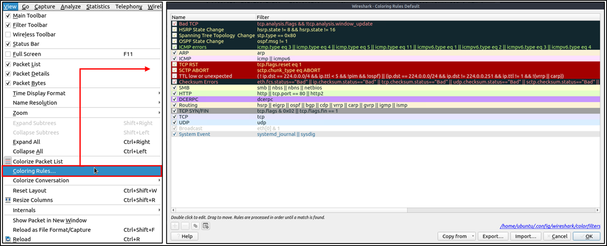
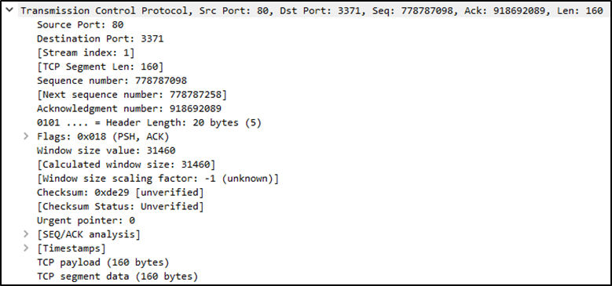
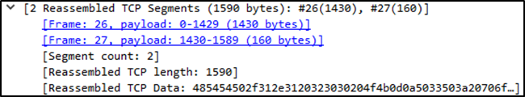
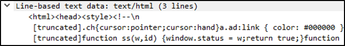
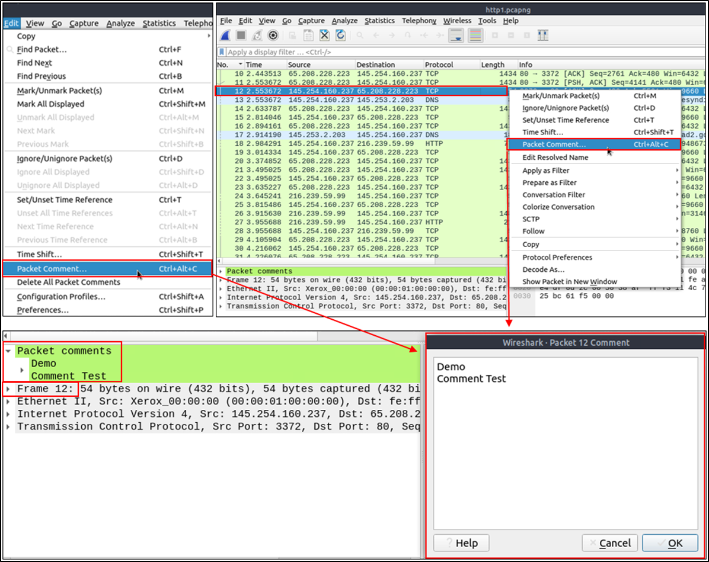
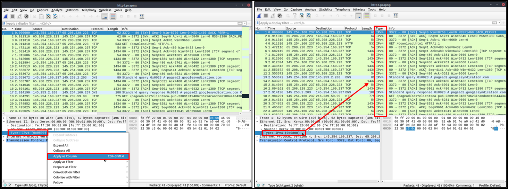

# Introduction

Wireshark is an open-source, cross-platform network packet analyser tool capable of sniffing and investigating live traffic and inspecting packet captures (PCAP). It is commonly used as one of the best packet analysis tools. In this room, we will look at the basics of Wireshark and use it to perform fundamental packet analysis.

There are two capture files given in the VM. You can use the “http1.pcapng” file to simulate the actions shown in the screenshots. Please note that you need to use the “Exercise.pcapng” file to answer the questions.

# Tool Overview

### Use Cases

Wireshark is one of the most potent traffic analyser tools available in the wild. There are multiple purposes for its use:

-    Detecting and troubleshooting network problems, such as network load failure points and congestion.
-    Detecting security anomalies, such as rogue hosts, abnormal port usage, and suspicious traffic.
-    Investigating and learning protocol details, such as response codes and payload data. 

Note: Wireshark is not an Intrusion Detection System (IDS). It only allows analysts to discover and investigate the packets in depth. It also doesn't modify packets; it reads them. Hence, detecting any anomaly or network problem highly relies on the analyst's knowledge and investigation skills.

### GUI and Data

Wireshark GUI opens with a single all-in-one page, which helps users investigate the traffic in multiple ways. At first glance, five sections stand out.

<table class="table table-bordered"><tbody><tr><td style="text-align:center"><b>Toolbar</b></td><td style="text-align:left"><span style="text-align:justify">The main toolbar contains multiple menus and shortcuts for packet sniffing and processing, including filtering, sorting, summarising, exporting and merging.&nbsp;</span><br></td></tr><tr><td style="text-align:center"><b>Display Filter Bar</b></td><td style="text-align:left">The main query and filtering section.</td></tr><tr><td style="text-align:center"><b>Recent Files</b></td><td style="text-align:left">List of the recently investigated files. You can recall listed files with a double-click.&nbsp;</td></tr><tr><td style="text-align:center"><b>Capture Filter and Interfaces</b></td><td style="text-align:left">Capture filters and available sniffing points (network interfaces).&nbsp; The network interface is the connection point between a computer and a network. The software connection (e.g., lo, eth0 and ens33) enables networking hardware.</td></tr><tr><td style="text-align:center"><b>Status Bar</b></td><td style="text-align:left">Tool status, profile and numeric packet information.</td></tr></tbody></table>


### Loading PCAP Files

The above picture shows Wireshark's empty interface. The only available information is the recently processed  "http1.cap" file. Let's load that file and see Wireshark's detailed packet presentation. Note that you can also use the "File" menu, dragging and dropping the file, or double-clicking on the file to load a pcap.


Now, we can see the processed filename, detailed number of packets and packet details. Packet details are shown in three different panes, which allow us to discover them in different formats. 

<table class="table table-bordered"><tbody><tr><td style="text-align:center"><span style="font-weight:bolder;text-align:left;background:transparent;margin-top:0pt;margin-bottom:0pt">Packet List Pane</span><br></td><td style="text-align:left"><span>Summary of each packet (source and destination addresses, protocol, and packet info). You can click on the list to choose a packet for further investigation. Once you select a packet, the details will appear in the other panels.</span><br></td></tr><tr><td style="text-align:center"><span style="font-weight:bolder;background:transparent;margin-top:0pt;margin-bottom:0pt">Packet Details Pane</span><br></td><td style="text-align:left"><span>Detailed protocol breakdown of the selected packet.</span><br></td></tr><tr><td style="text-align:center"><span style="font-weight:bolder;background:transparent;margin-top:0pt;margin-bottom:0pt">Packet Bytes Pane</span><br></td><td style="text-align:left"><span>Hex and decoded ASCII representation of the selected packet. It highlights the packet field depending on the clicked section in the details pane.&nbsp;</span><br></td></tr></tbody></table>

### Colouring Packets

Along with quick packet information, Wireshark also colour packets in order of different conditions and the protocol to spot anomalies and protocols in captures quickly (this explains why almost everything is green in the given screenshots). This glance at packet information can help track down exactly what you're looking for during analysis. You can create custom colour rules to spot events of interest by using display filters, and we will cover them in the next room. Now let's focus on the defaults and understand how to view and use the represented data details.


Wireshark has two types of packet colouring methods: temporary rules that are only available during a program session and permanent rules that are saved under the preference file (profile) and available for the next program session. You can use the "right-click menu" or "View --> Coloring Rules" menu to create permanent colouring rules. The "Colourise Packet List" menu activates/deactivates the colouring rules. Temporary packet colouring is done with the "right-click menu" or "View --> Conversation Filter" menu, which is covered in TASK-5.

The default permanent colouring is shown below.



### Traffic Sniffing

You can use the blue "shark button" to start network sniffing (capturing traffic), the red button will stop the sniffing, and the green button will restart the sniffing process. The status bar will also provide the used sniffing interface and the number of collected packets.


### Merge PCAP Files

Wireshark can combine two pcap files into one single file. You can use the "File --> Merge" menu path to merge a pcap with the processed one. When you choose the second file, Wireshark will show the total number of packets in the selected file. Once you click "open", it will merge the existing pcap file with the chosen one and create a new pcap file. Note that you need to save the "merged" pcap file before working on it.


### View File Details

Knowing the file details is helpful. Especially when working with multiple pcap files, sometimes you will need to know and recall the file details (File hash, capture time, capture file comments, interface and statistics) to identify the file, classify and prioritise it. You can view the details by following "Statistics --> Capture File Properties" or by clicking the "pcap icon located on the left bottom" of the window.


## Q & A

Use the "Exercise.pcapng" file to answer the questions.

Q1 Read the "capture file comments". What is the flag?

A1 TryHackMe_Wireshark_Demo

Q2 What is the total number of packets?

A2 58620

Q3 What is the SHA256 hash value of the capture file?

A3 f446de335565fb0b0ee5e5a3266703c778b2f3dfad7efeaeccb2da5641a6d6eb


# Packet Dissection

Packet dissection is also known as protocol dissection, which investigates packet details by decoding available protocols and fields. Wireshark supports a long list of protocols for dissection, and you can also write your dissection scripts. You can find more details on dissection here:  
https://github.com/boundary/wireshark/blob/master/doc/README.dissector

Note: This section covers how Wireshark uses OSI layers to break down packets and how to use these layers for analysis. It is expected that you already have background knowledge of the OSI model and how it works. 

### Packet Details

You can click on a packet in the packet list pane to open its details (double-click will open details in a new window). Packets consist of 5 to 7 layers based on the OSI model. We will go over all of them in an HTTP packet from a sample capture. The picture below shows viewing packet number 27.


Each time you click a detail, it will highlight the corresponding part in the packet bytes pane.


Let's have a closer view of the details pane.


We can see seven distinct layers to the packet: frame/packet, source [MAC], source [IP], protocol, protocol errors, application protocol, and application data. Below we will go over the layers in more detail.

- The Frame (Layer 1): This will show you what frame/packet you are looking at and details specific to the Physical layer of the OSI model.


- Source [MAC] (Layer 2): This will show you the source and destination MAC Addresses; from the Data Link layer of the OSI model


- Source [IP] (Layer 3): This will show you the source and destination IPv4 Addresses; from the Network layer of the OSI model.


- Protocol (Layer 4): This will show you details of the protocol used (UDP/TCP) and source and destination ports; from the Transport layer of the OSI model.



- Protocol Errors: This continuation of the 4th layer shows specific segments from TCP that needed to be reassembled.



- Application Protocol (Layer 5): This will show details specific to the protocol used, such as HTTP, FTP,  and SMB. From the Application layer of the OSI model.


- Application Data: This extension of the 5th layer can show the application-specific data.



## Q & A

Use the "Exercise.pcapng" file to answer the questions.

Q1 View packet number 38. Which markup language is used under the HTTP protocol?

A1 eXtensible Markup Language

Q2 What is the arrival date of the packet? (Answer format: Month/Day/Year)

A2 05/13/2004

Q3 What is the TTL value?

A3 47

Q4 What is the TCP payload size?

A4 424

Q5 What is the e-tag value?

A5 9a01a-4696-7e354b00

# Packet Navigation

### Packet Numbers

Wireshark calculates the number of investigated packets and assigns a unique number for each packet. This helps the analysis process for big captures and makes it easy to go back to a specific point of an event. 


### Go to Packet

Packet numbers do not only help to count the total number of packets or make it easier to find/investigate specific packets. This feature not only navigates between packets up and down; it also provides in-frame packet tracking and finds the next packet in the particular part of the conversation. You can use the "Go" menu and toolbar to view specific packets.


### Find Packets

Apart from packet number, Wireshark can find packets by packet content. You can use the "Edit --> Find Packet" menu to make a search inside the packets for a particular event of interest. This helps analysts and administrators to find specific intrusion patterns or failure traces.

There are two crucial points in finding packets. The first is knowing the input type. This functionality accepts four types of inputs (Display filter, Hex, String and Regex). String and regex searches are the most commonly used search types. Searches are case insensitive, but you can set the case sensitivity in your search by clicking the radio button.

The second point is choosing the search field. You can conduct searches in the three panes (packet list, packet details, and packet bytes), and it is important to know the available information in each pane to find the event of interest. For example, if you try to find the information available in the packet details pane and conduct the search in the packet list pane, Wireshark won't find it even if it exists.


### Mark Packets

Marking packets is another helpful functionality for analysts. You can find/point to a specific packet for further investigation by marking it. It helps analysts point to an event of interest or export particular packets from the capture. You can use the "Edit" or the "right-click" menu to mark/unmark packets.

Marked packets will be shown in black regardless of the original colour representing the connection type. Note that marked packet information is renewed every file session, so marked packets will be lost after closing the capture file. 


### Packet Comments

Similar to packet marking, commenting is another helpful feature for analysts. You can add comments for particular packets that will help the further investigation or remind and point out important/suspicious points for other layer analysts. Unlike packet marking, the comments can stay within the capture file until the operator removes them.



### Export Packets

Capture files can contain thousands of packets in a single file. As mentioned earlier, Wireshark is not an IDS, so sometimes, it is necessary to separate specific packages from the file and dig deeper to resolve an incident. This functionality helps analysts share the only suspicious packages (decided scope). Thus redundant information is not included in the analysis process. You can use the "File" menu to export packets.


### Export Objects (Files)

Wireshark can extract files transferred through the wire. For a security analyst, it is vital to discover shared files and save them for further investigation. Exporting objects are available only for selected protocol's streams (DICOM, HTTP, IMF, SMB and TFTP).


### Time Display Format

Wireshark lists the packets as they are captured, so investigating the default flow is not always the best option. By default, Wireshark shows the time in "Seconds Since Beginning of Capture", the common usage is using the UTC Time Display Format for a better view. You can use the "View --> Time Display Format" menu to change the time display format.


### Expert Info

Wireshark also detects specific states of protocols to help analysts easily spot possible anomalies and problems. Note that these are only suggestions, and there is always a chance of having false positives/negatives. Expert info can provide a group of categories in three different severities. Details are shown in the table below.

<table class="table table-bordered"><tbody><tr><td><b>Severity</b></td><td><b>Colour</b></td><td><b>Info</b></td></tr><tr><td style="text-align:center"><b>Chat</b></td><td style="color:white;background-color:blue"><b>Blue</b></td><td style="text-align:left">Information on usual workflow.<br></td></tr><tr><td style="text-align:center"><b>Note</b></td><td style="background-color:cyan"><b>Cyan</b></td><td style="text-align:left">Notable events like application error codes.</td></tr><tr><td style="text-align:center"><b>Warn</b></td><td style="background-color:yellow"><b>Yellow</b></td><td style="text-align:left">Warnings like unusual error codes or problem statements.<br></td></tr><tr><td style="text-align:center"><b>Error</b></td><td style="background-color:red"><b>Red</b></td><td style="text-align:left">Problems like malformed packets.</td></tr></tbody></table>

Frequently encountered information groups are listed in the table below. You can refer to Wireshark's official documentation for more information on the expert information entries.

<table class="table table-bordered"><tbody><tr><td><b>Group</b></td><td><b>Info</b></td><td><b>Group</b></td><td><b>Info</b></td></tr><tr><td><b>Checksum</b></td><td>Checksum errors.</td><td><b>Deprecated</b></td><td>Deprecated protocol usage.</td></tr><tr><td><b>Comment</b></td><td>Packet comment detection.</td><td><b>Malformed</b></td><td>Malformed packet detection.</td></tr></tbody></table>


# Q & A

Use the "Exercise.pcapng" file to answer the questions.

Q1 Search the "r4w" string in packet details. What is the name of artist 1?

A1 r4w8173

Q2 Go to packet 12 and read the comments. What is the answer?

A2 911cd574a42865a956ccde2d04495ebf

packet 12 comment: 
```
This_is_Not_a_Flag_This_is_Not_a_Flag_This_is_Not_a_Flag_This_is_Not_a_Flag_This_is_Not_a_Flag_This_is_Not_a_Flag


Go to packet number 39765
Look at the "packet details pane". Right-click on the JPEG section and "Export packet bytes". This is an alternative way of extracting data from a capture file. What is the MD5 hash value of extracted image?
```
packetbytes is the name of the image
```
ubuntu@ip-10-10-183-223:~/Desktop$ md5sum packetbytes 
911cd574a42865a956ccde2d04495ebf  packetbytes
```

Q3 There is a ".txt" file inside the capture file. Find the file and read it; what is the alien's name?

A3 packetmaster

Edit->Find Packet : .txt

File->Export object : note.txt
```
ubuntu@ip-10-10-183-223:~/Desktop$ cat note.txt 
.     .       .  .   . .   .   . .    +  .:..+.. ... :..:.. . ... :..:.. . ... :..:.. . ... :..:.. . ... :..:..
  .     .  :     .    .. :. .___---------___.::.. ... :..:.. . ... :..:.. . ... :..:.. . ... :..:.. . ... :..:..
       .  .   .    .  :.:. _".^ .^ ^.  '.. :"-_.:.::... :..:.. . ... :..:.. . ... :..:.. . ... :..:.. . ... :..:..
    .  :       .  .  .:../:            . .^  :.:\.::... :..:.. . ... :..:.. . ... :..:.. . ... :..:.. . ... :..:..
        .   . :: +. :.:/: .   .    .        . . .:\::... :..:.. . ... :..:.. . ... :..:.. . ... :..:.. . ... :..:..
 .  :    .     . _ :::/:               .  ^ .  . .:\::... :..:.. . ... :..:.. . ... :..:.. . ... :..:.. . ... :..:..
  .. . .   . - : :.:./.                        .  .:\::... :..:.. . ... :..:.. . ... :..:.. . ... :..:.. . ... :..:..
  .      .     . :..|:                    .  .  ^. .:|:: ... :..:.. . ... :..:.. . ... :..:.. . ... :..:.. . ... :..:..
    .       . : : ..||        .                . . !:|::... :..:.... . ... :..:.. . ... :..:.. . ... :..:.. . ... :..:..
  .     . . . ::. ::\(                           . :)/:: ... :..:.. . ... :..:.. . ... :..:.. . ... :..:.. . ... :..:..
 .   .     : . : .:.|. ######              .#######::|::... :..:.. . ... :..:.. . ... :..:.. . ... :..:.. . ... :..:..
  :.. .  :-  : .:  ::|.#######           ..########:|::... :..:.. . ... :..:.. . ... :..:.. . ... :..:.. . ... :..:..
 .  .  .  ..  .  .. :\ ########          :######## :/:: ... :..:.. . ... :..:.. . ... :..:.. . ... :..:.. . ... :..:..
  .        .+ :: : -.:\ ########       . ########.:/::... :..:.. . ... :..:.. . ... :..:.. . ... :..:.. . ... :..:..
    .  .+   . . . . :.:\. #######       #######..:/::     .+ :: : -. . ... :..:.. . ... :..:.. . ... :..:..
      :: . . . . ::.:..:.\           .   .   ..:/::  .+ :: : -.... :..:.. . ... :..:.. . ... :..:.. . ... :..:..
   .   .   .  .. :  -::::.\.       | |     . .:/:: -.   . . . .... :..:.. . ... :..:.. . ... :..:.. . ... :..:..
      .  :  .  .  .-:.":.::.\             ..:/:: -.   . . . .... :..:.. . ... :..:.. . ... :..:.. . ... :..:.. . ... :..:..
 .      -.   . . . .: .:::.:.\.           .:/:.   . . .   .  .  . ... :..:.. . ... :..:.. . ... :..:.. . ... :..:..
.   .   .  :      : ....::_:..:\   ___.  :/::  . . .   .  .  . ... :..:.. . ... :..:.. . ... :..:.. . ... :..:..
   .   .  .   .:. .. .  .: :.:.:\       :/::.   . . .   .  .  . ... :..:.. . ... :..:.. . ... :..:.. . ... :..:..
     +   .   .   : . ::. :.:. .:.|\  .:/|::.   . . .   .  .  . ... :..:.. . ... :..:.. . ... :..:.. . ... :..:..
     .         +   .  .  ...:: ..|  --.:|::.  . . .   .  .  . ... :..:.. . ... :..:.. . ... :..:.. . ... :..:..
.      . . .   .  .  . ... :..:.."(  ..)":: .   . . .   .  .  . ... :..:.. . ... :..:.. . ... :..:.. . ... :..:..
 .   .       .      :  .   .: ::/  .  .::\::. . . + : . ... :..:.. . ... :..:.. . ... :..:.. . ... :..:.. . ... :..:..
██████╗  █████╗  ██████╗██╗  ██╗███████╗████████╗███╗   ███╗ █████╗ ███████╗████████╗███████╗██████╗  ::.+ : . ... :..:..
██╔══██╗██╔══██╗██╔════╝██║ ██╔╝██╔════╝╚══██╔══╝████╗ ████║██╔══██╗██╔════╝╚══██╔══╝██╔════╝██╔══██╗ ..: + . . ... :..:..
██████╔╝███████║██║     █████╔╝ █████╗     ██║   ██╔████╔██║███████║███████╗   ██║   █████╗  ██████╔╝..:...+.. . ... :..:..
██╔═══╝ ██╔══██║██║     ██╔═██╗ ██╔══╝     ██║   ██║╚██╔╝██║██╔══██║╚════██║   ██║   ██╔══╝  ██╔══██╗.:+.+...: . ... :..:..
██║     ██║  ██║╚██████╗██║  ██╗███████╗   ██║   ██║ ╚═╝ ██║██║  ██║███████║   ██║   ███████╗██║  ██║...::+.+.. .. : .. : 
╚═╝     ╚═╝  ╚═╝ ╚═════╝╚═╝  ╚═╝╚══════╝   ╚═╝   ╚═╝     ╚═╝╚═╝  ╚═╝╚══════╝   ╚═╝   ╚══════╝╚═╝  ╚═╝.+...+.+. . ... :..:..
 . ... :..:.. . ... :..:.. . ... :..:.. . ... :..:.. . ... :..:.. . ... :..:.. . ... :..:.. . ... :..:.. . ... :..:..
 . ... :..:.. . ... :..:.. . ... :..:.. . ... :..:.. . ... :..:.. . ... :..:.. . ... :..:.. . ... :..:.. . ... :..:..
 . ... :..:.. . ... :..:.. . ... :..:.. . ... :..:.. . ... :..:.. . ... :..:.. . ... :..:.. . ... :..:.. . ... :..:..
  . ... :..:.. . ... :..:.. . ... :..:.. . ... :..:.. . ... :..:.. . ... :..:.. . ... :..:.. . ... :..:.. . ... :..:..
   . ... :..:.. . ... :..:.. . ... :..:.. . ... :..:.. . ... :..:.. . ... :..:.. . ... :..:.. . ... :..:.. . ... :..:..
    . ... :..:.. . ... :..:.. . ... :..:.. . ... :..:.. . ... :..:.. . ... :..:.. . ... :..:.. . ... :..:.. . ... :..:..
     . ... :..:.. . ... :..:.. . ... :..:.. . ... :..:.. . ... :..:.. . ... :..:.. . ... :..:.. . ... :..:.. . ... :..:..

```

Q4 Look at the expert info section. What is the number of warnings?

A4 1636


# Packet Filtering

Wireshark has a powerful filter engine that helps analysts to narrow down the traffic and focus on the event of interest. Wireshark has two types of filtering approaches: capture and display filters. Capture filters are used for "capturing" only the packets valid for the used filter. Display filters are used for "viewing" the packets valid for the used filter. We will discuss these filters' differences and advanced usage in the next room. Now let's focus on basic usage of the display filters, which will help analysts in the first place.

Filters are specific queries designed for protocols available in Wireshark's official protocol reference. While the filters are only the option to investigate the event of interest, there are two different ways to filter traffic and remove the noise from the capture file. The first one uses queries, and the second uses the right-click menu. Wireshark provides a powerful GUI, and there is a golden rule for analysts who don't want to write queries for basic tasks: "If you can click on it, you can filter and copy it".

### Apply as Filter

This is the most basic way of filtering traffic. While investigating a capture file, you can click on the field you want to filter and use the "right-click menu" or "Analyse --> Apply as Filter" menu to filter the specific value. Once you apply the filter, Wireshark will generate the required filter query, apply it, show the packets according to your choice, and hide the unselected packets from the packet list pane. Note that the number of total and displayed packets are always shown on the status bar.


### Conversation filter 

When you use the "Apply as a Filter" option, you will filter only a single entity of the packet. This option is a good way of investigating a particular value in packets. However, suppose you want to investigate a specific packet number and all linked packets by focusing on IP addresses and port numbers. In that case, the "Conversation Filter" option helps you view only the related packets and hide the rest of the packets easily. You can use the"right-click menu" or "Analyse --> Conversation Filter" menu to filter conversations.


### Colourise Conversation

This option is similar to the "Conversation Filter" with one difference. It highlights the linked packets without applying a display filter and decreasing the number of viewed packets. This option works with the "Colouring Rules" option ad changes the packet colours without considering the previously applied colour rule. You can use the "right-click menu" or "View --> Colourise Conversation" menu to colourise a linked packet in a single click. Note that you can use the "View --> Colourise Conversation --> Reset Colourisation" menu to undo this operation.


### Prepare as Filter 

Similar to "Apply as Filter", this option helps analysts create display filters using the "right-click" menu. However, unlike the previous one, this model doesn't apply the filters after the choice. It adds the required query to the pane and waits for the execution command (enter) or another chosen filtering option by using the ".. and/or.." from the "right-click menu".


### Apply as Column

By default, the packet list pane provides basic information about each packet. You can use the "right-click menu" or "Analyse --> Apply as Column" menu to add columns to the packet list pane. Once you click on a value and apply it as a column, it will be visible on the packet list pane. This function helps analysts examine the appearance of a specific value/field across the available packets in the capture file. You can enable/disable the columns shown in the packet list pane by clicking on the top of the packet list pane.



### Follow Stream

Wireshark displays everything in packet portion size. However, it is possible to reconstruct the streams and view the raw traffic as it is presented at the application level. Following the protocol, streams help analysts recreate the application-level data and understand the event of interest. It is also possible to view the unencrypted protocol data like usernames, passwords and other transferred data.

You can use the"right-click menu" or  "Analyse --> Follow TCP/UDP/HTTP Stream" menu to follow traffic streams. Streams are shown in a separate dialogue box; packets originating from the server are highlighted with blue, and those originating from the client are highlighted with red.


Once you follow a stream, Wireshark automatically creates and applies the required filter to view the specific stream. Remember, once a filter is applied, the number of the viewed packets will change. You will need to use the "X button" located on the right upper side of the display filter bar to remove the display filter and view all available packets in the capture file. 

# Q & A

Q1 Go to packet number 4. Right-click on the "Hypertext Transfer Protocol" and apply it as a filter. Now, look at the filter pane. What is the filter query?

A1 http

Q2 What is the number of displayed packets?

A2 1089

Q3 Go to packet number 33790 and follow the stream. What is the total number of artists?

A3 3

Q4 What is the name of the second artist?

A4 Blad3

