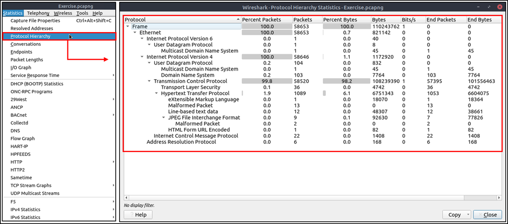

# Wireshark: Packet Operations

# Statistics | Summary

## Statistics

This menu provides multiple statistics options ready to investigate to help users see the big picture in terms of the scope of the traffic, available protocols, endpoints and conversations, and some protocol-specific details like DHCP, DNS and HTTP/2. For a security analyst, it is crucial to know how to utilise the statical information. This section provides a quick summary of the processed pcap, which will help analysts create a hypothesis for an investigation. You can use the "Statistics" menu to view all available options. Now start the given VM, open the Wireshark, load the "Exercise.pcapng" file and go through the walkthrough.

## Resolved Addresses

This option helps analysts identify IP addresses and DNS names available in the capture file by providing the list of the resolved addresses and their hostnames. Note that the hostname information is taken from DNS answers in the capture file. Analysts can quickly identify the accessed resources by using this menu. Thus they can spot accessed resources and evaluate them according to the event of interest. You can use the "Statistics --> Resolved Addresses" menu to view all resolved addresses by Wireshark.


## Protocol Hierarchy

This option breaks down all available protocols from the capture file and helps analysts view the protocols in a tree view based on packet counters and percentages. Thus analysts can view the overall usage of the ports and services and focus on the event of interest. The golden rule mentioned in the previous room is valid in this section; you can right-click and filter the event of interest. You can use the "Statistics --> Protocol Hierarchy" menu to view this info.



## Conversations

Conversation represents traffic between two specific endpoints. This option provides the list of the conversations in five base formats; ethernet, IPv4, IPv6, TCP and UDP. Thus analysts can identify all conversations and contact endpoints for the event of interest. You can use the "Statistic --> Conversations" menu to view this info.


## Endpoints

The endpoints option is similar to the conversations option. The only difference is that this option provides unique information for a single information field (Ethernet, IPv4, IPv6, TCP and UDP ). Thus analysts can identify the unique endpoints in the capture file and use it for the event of interest. You can use the "Statistics --> Endpoints" menu to view this info.

Wireshark also supports resolving MAC addresses to human-readable format using the manufacturer name assigned by IEEE. Note that this conversion is done through the first three bytes of the MAC address and only works for the known manufacturers. When you review the ethernet endpoints, you can activate this option with the "Name resolution" button in the lower-left corner of the endpoints window.


Name resolution is not limited only to MAC addresses. Wireshark provides IP and port name resolution options as well. However, these options are not enabled by default. If you want to use these functionalities, you need to activate them through the "Edit --> Preferences --> Name Resolution" menu. Once you enable IP and port name resolution, you will see the resolved IP address and port names in the packet list pane and also will be able to view resolved names in the "Conversations" and "Endpoints" menus as well.


Endpoint menu view with name resolution:


Besides name resolution, Wireshark also provides an IP geolocation mapping that helps analysts identify the map's source and destination addresses. But this feature is not activated by default and needs supplementary data like the GeoIP database. Currently, Wireshark supports MaxMind databases, and the latest versions of the Wireshark come configured MaxMind DB resolver. However, you still need MaxMind DB files and provide the database path to Wireshark by using the "Edit --> Preferences --> Name Resolution --> MaxMind database directories" menu. Once you download and indicate the path, Wireshark will automatically provide GeoIP information under the IP protocol details for the matched IP addresses.


Endpoints and GeoIP view.


## Q & A 

Q1 Investigate the resolved addresses. What is the IP address of the hostname starts with "bbc"?

A1 199.232.24.81


Q2 What is the number of IPv4 conversations? 

A2 435


Q3 How many bytes (k) were transferred from the "Micro-St" MAC address?

A3 7474


Q4 What is the number of IP addresses linked with "Kansas City"?

A4 4


Q5 Which IP address is linked with "Blicnet" AS Organisation?

A5 188.246.82.7


# Statistics | Protocol Details

## IPv4 and IPv6

Up to here, almost all options provided information that contained both versions of the IP addresses. The statistics menu has two options for narrowing the statistics on packets containing a specific IP version. Thus, analysts can identify and list all events linked to specific IP versions in a single window and use it for the event of interest. You can use the "Statistics --> IPvX Statistics" menu to view this info.


## DNS

This option breaks down all DNS packets from the capture file and helps analysts view the findings in a tree view based on packet counters and percentages of the DNS protocol. Thus analysts can view the DNS service's overall usage, including rcode, opcode, class, query type, service and query stats and use it for the event of interest. You can use the "Statistics --> DNS" menu to view this info.


## HTTP

This option breaks down all HTTP packets from the capture file and helps analysts view the findings in a tree view based on packet counters and percentages of the HTTP protocol. Thus analysts can view the HTTP service's overall usage, including request and response codes and the original requests. You can use the "Statistics --> HTTP" menu to view this info.


## Q & A 

Q1 What is the most used IPv4 destination address?

A1 10.100.1.33


Q2 What is the max service request-response time of the DNS packets?

A2 0.467897


Q3 What is the number of HTTP Requests accomplished by "rad[.]msn[.]com?

A3 39

Statistics -> HTTP -> Requests


# Packet Filtering | Principles

## Packet Filtering

In the previous room (Wireshark | The Basics), we covered packet filtering and how to filter packets without using queries. In this room, we will use queries to filter packets. As mentioned earlier, there are two types of filters in Wireshark. While both use similar syntax, they are used for different purposes. Let's remember the difference between these two categories.

- Capture Filters: This type of filter is used to save only a specific part of the traffic. It is set before capturing traffic and not changeable during the capture. 

- Display Filters: This type of filter is used to investigate packets by reducing the number of visible packets, and it is changeable during the capture. 

Note: You cannot use the display filter expressions for capturing traffic and vice versa.

The typical use case is capturing everything and filtering the packets according to the event of interest. Only experienced professionals use capture filters and sniff traffic. This is why Wireshark supports more protocol types in display filters. Please ensure you thoroughly learn how to use capture filters before using them in a live environment. Remember, you cannot capture the event of interest if your capture filter is not matching the specific traffic pattern you are looking for.

## Capture Filter Syntax

These filters use byte offsets hex values and masks with boolean operators, and it is not easy to understand/predict the filter's purpose at first glance. The base syntax is explained below:

- Scope: host, net, port and portrange.
- Direction: src, dst, src or dst, src and dst,
- Protocol: ether, wlan, ip, ip6, arp, rarp, tcp and udp.
- Sample filter to capture port 80 traffic: `tcp port 80`

You can read more on capture filter syntax from:

https://www.wireshark.org/docs/man-pages/pcap-filter.html

https://gitlab.com/wireshark/wireshark/-/wikis/CaptureFilters#useful-filters

A quick reference is available under the "Capture --> Capture Filters" menu.


## Display Filter Syntax

This is Wireshark's most powerful feature. It supports 3000 protocols and allows conducting packet-level searches under the protocol breakdown. The official "Display Filter Reference" provides all supported protocols breakdown for filtering.
https://www.wireshark.org/docs/dfref/

    Sample filter to capture port 80 traffic: tcp.port == 80

Wireshark has a built-in option (Display Filter Expression) that stores all supported protocol structures to help analysts create display filters. We will cover the "Display Filter Expression" menu later. Now let's understand the fundamentals of the display filter operations. A quick reference is available under the "Analyse --> Display Filters" menu.


## Comparison Operators

You can create display filters by using different comparison operators to find the event of interest. The primary operators are shown in the table below.

<table class="table table-bordered"><tbody><tr><td><b>English</b></td><td><b>C-Like</b></td><td><b>Description</b></td><td><b>Example</b></td></tr><tr><td>eq</td><td>==</td><td>Equal</td><td><p><code>ip.src == 10.10.10.100</code></p></td></tr><tr><td>ne</td><td>!=</td><td>Not equal</td><td><p><code>ip.src != 10.10.10.100</code></p></td></tr><tr><td>gt</td><td>&gt;</td><td>Greater than</td><td><p><code>ip.ttl &gt; 250</code></p></td></tr><tr><td>lt</td><td>&lt;</td><td>Less Than</td><td><p><code>ip.ttl &lt; 10</code><br></p></td></tr><tr><td>ge</td><td>&gt;=</td><td>Greater than or equal to</td><td><p><code>ip.ttl &gt;= 0xFA</code></p></td></tr><tr><td>le</td><td>&lt;=</td><td>Less than or equal to</td><td><p><code>ip.ttl &lt;= 0xA</code></p></td></tr></tbody></table>

Note: Wireshark supports decimal and hexadecimal values in filtering. You can use any format you want according to the search you will conduct.

## Logical Expressions

Wireshark supports boolean syntax. You can create display filters by using logical operators as well.

<table class="table table-bordered"><tbody><tr><td><b>English&nbsp;&nbsp;</b></td><td><b>C-Like</b></td><td><b>Description&nbsp;&nbsp;</b></td><td><b>Example</b></td></tr><tr><td>and</td><td>&amp;&amp;</td><td>Logical AND</td><td><p><code>(ip.src == 10.10.10.100) AND (ip.src == 10.10.10.111)</code></p></td></tr><tr><td>or</td><td>||</td><td>Logical OR</td><td><p><code>(ip.src == 10.10.10.100) OR (ip.src == 10.10.10.111)</code></p></td></tr><tr><td>not</td><td>!</td><td>Logical NOT</td><td><p><code>!(ip.src == 10.10.10.222)</code></p><p style="text-align:left"><b>Note:</b>&nbsp;Usage of <code>!=value</code>&nbsp;is deprecated; using it could provide inconsistent results. Using the <code>!(value)</code><b></b>&nbsp;style is suggested for more consistent results.</p></td></tr></tbody></table>

## Packet Filter Toolbar

The filter toolbar is where you create and apply your display filters. It is a smart toolbar that helps you create valid display filters with ease. Before starting to filter packets, here are a few tips:

- Packet filters are defined in lowercase.
- Packet filters have an autocomplete feature to break down protocol details, and each detail is represented by a "dot".
- Packet filters have a three-colour representation explained below.
```
- Green 	Valid filter
- Red	    Invalid filter
- Yellow	Warning filter. This filter works, but it is unreliable, and it is suggested to change it with a valid filter.
```


Filter toolbar features are shown below.


# Packet Filtering | Protocol Filters

## Protocol Filters

As mentioned in the previous task, Wireshark supports 3000 protocols and allows packet-level investigation by filtering the protocol fields. This task shows the creation and usage of filters against different protocol fields. 

## IP Filters

IP filters help analysts filter the traffic according to the IP level information from the packets (Network layer of the OSI model). This is one of the most commonly used filters in Wireshark. These filters filter network-level information like IP addresses, version, time to live, type of service, flags, and checksum values.

The common filters are shown in the given table.

<table class="table table-bordered" style="width:1075px"><tbody><tr><td><span style="font-weight:bolder">Filter</span></td><td><span style="font-weight:bolder">Description</span></td></tr><tr><td><p><code style="font-size:14px">ip</code></p></td><td style="text-align:left">Show all IP packets.</td></tr><tr><td><p><code style="font-size:14px">ip.addr == 10.10.10.111</code></p></td><td style="text-align:left">Show all packets containing IP address 10.10.10.111.</td></tr><tr><td><p><code style="font-size:14px">ip.addr == 10.10.10.0/24</code></p></td><td style="text-align:left">Show all packets containing IP addresses from 10.10.10.0/24 subnet.</td></tr><tr><td><p><code style="font-size:14px">ip.src == 10.10.10.111</code></p></td><td style="text-align:left">Show all packets originated from 10.10.10.111</td></tr><tr><td><p><code style="font-size:14px">ip.dst == 10.10.10.111</code></p></td><td style="text-align:left">Show all packets sent to 10.10.10.111</td></tr><tr><td>ip.addr<span style="font-weight:bolder">&nbsp;vs&nbsp;</span>ip.src/ip.dst</td><td style="text-align:left"><span style="font-weight:bolder">Note:&nbsp;</span>The ip.addr filters the traffic without considering the packet direction. The ip.src/ip.dst filters the packet depending on the packet direction.</td></tr></tbody></table>


## TCP and UDP Filters

TCP filters help analysts filter the traffic according to protocol-level information from the packets (Transport layer of the OSI model). These filters filter transport protocol level information like source and destination ports, sequence number, acknowledgement number, windows size, timestamps, flags, length and protocol errors.


<table class="table table-bordered" style="width:1075px"><tbody><tr><td><span style="font-weight:700">Filter</span><br></td><td><span style="font-weight:700">Description</span><br></td><td><span style="font-weight:bolder">Filter</span></td><td><span style="font-weight:bolder">Expression</span></td></tr><tr><td><p><code style="font-size:14px">tcp.port == 80</code></p></td><td style="text-align:left">Show all <span data-testid="glossary-term" class="glossary-term">TCP</span> packets with port 80&nbsp;</td><td><p><code style="font-size:14px">udp.port == 53</code><br></p></td><td style="text-align:left">Show all <span data-testid="glossary-term" class="glossary-term">UDP</span> packets with port 53</td></tr><tr><td><p><code style="font-size:14px">tcp.srcport == 1234</code></p></td><td style="text-align:left">Show all <span data-testid="glossary-term" class="glossary-term">TCP</span> packets originating from port 1234</td><td><p><code style="font-size:14px">udp.srcport == 1234</code><br></p></td><td style="text-align:left">Show all <span data-testid="glossary-term" class="glossary-term">UDP</span> packets originating from port 1234</td></tr><tr><td><p><code style="font-size:14px">tcp.dstport == 80</code></p></td><td style="text-align:left">Show all <span data-testid="glossary-term" class="glossary-term">TCP</span> packets sent to port 80</td><td><p><code style="font-size:14px">udp.dstport == 5353</code><br></p></td><td style="text-align:left">Show all <span data-testid="glossary-term" class="glossary-term">UDP</span> packets sent to port 5353</td></tr></tbody></table>


## Application Level Protocol Filters | HTTP and DNS

Application-level protocol filters help analysts filter the traffic according to application protocol level information from the packets (Application layer of the OSI model ). These filters filter application-specific information, like payload and linked data, depending on the protocol type.

<table class="table table-bordered" style="width:1075px"><tbody><tr><td><span style="font-weight:bolder">Filter</span></td><td><span style="font-weight:bolder">Description</span></td><td><span style="font-weight:bolder">Filter</span></td><td><span style="font-weight:bolder">Description</span></td></tr><tr><td><p><code style="font-size:14px">http</code></p></td><td>Show all <span data-testid="glossary-term" class="glossary-term">HTTP</span> packets</td><td><p><code style="font-size:14px">dns</code></p></td><td>Show all <span data-testid="glossary-term" class="glossary-term">DNS</span> packets</td></tr><tr><td><p><code style="font-size:14px">http.response.code == 200</code></p></td><td>Show all packets with <span data-testid="glossary-term" class="glossary-term">HTTP</span> response code "200"</td><td><p><code style="font-size:14px">dns.flags.response == 0</code><br></p></td><td>Show all <span data-testid="glossary-term" class="glossary-term">DNS</span> requests</td></tr><tr><td><p><code style="font-size:14px">http.request.method == "GET"</code></p></td><td>Show all <span data-testid="glossary-term" class="glossary-term">HTTP</span> GET requests</td><td><p><code style="font-size:14px">dns.flags.response == 1</code><br></p></td><td>Show all <span data-testid="glossary-term" class="glossary-term">DNS</span> responses</td></tr><tr><td><p><code style="font-size:14px">http.request.method == "POST"</code><br></p></td><td>Show all <span data-testid="glossary-term" class="glossary-term">HTTP</span> POST requests</td><td><p><code style="font-size:14px">dns.qry.type == 1</code><br></p></td><td>Show all <span data-testid="glossary-term" class="glossary-term">DNS</span> "A" records</td></tr></tbody></table>

    

## Display Filter Expressions

As mentioned earlier, Wireshark has a built-in option (Display Filter Expression) that stores all supported protocol structures to help analysts create display filters. When an analyst can't recall the required filter for a specific protocol or is unsure about the assignable values for a filter, the Display Filter Expressions menu provides an easy-to-use display filter builder guide. It is available under the "Analyse --> Display Filter Expression" menu.


It is impossible to memorise all details of the display filters for each protocol. Each protocol can have different fields and can accept various types of values. The Display Filter Expressions menu shows all protocol fields, accepted value types (integer or string) and predefined values (if any). Note that it will take time and require practice to master creating filters and learning the protocol filter fields.


## Q & A

Q1 What is the number of IP packets?

A1 81420


Q2 What is the number of packets with a "TTL value less than 10"?

A2 66


Q3 What is the number of packets which uses "TCP port 4444"?

A3 632


Q4 What is the number of "HTTP GET" requests sent to port "80"?

A4 527


Q5 What is the number of "type A DNS Queries"?

A5 51


# Advanced Filtering

So far, you have learned the basics of packet filtering operations. Now it is time to focus on specific packet details for the event of interest. Besides the operators and expressions covered in the previous room, Wireshark has advanced operators and functions. These advanced filtering options help the analyst conduct an in-depth analysis of an event of interest.

## Filter: "contains"

<table class="table table-bordered"><tbody><tr><td style="text-align:center"><span style="font-weight:bolder">Filter</span><br></td><td style="text-align:left"><span style="text-align:center"><b>contains</b></span><br></td></tr><tr><td style="text-align:center"><b>Type</b></td><td style="text-align:left"><span style="text-align:center">Comparison Operator</span><br></td></tr><tr><td style="text-align:center"><b>Description</b></td><td style="text-align:left">Search a value inside packets. It is case-sensitive and provides similar functionality to the "Find" option by focusing on a specific field.<br></td></tr><tr><td style="text-align:center"><b>Example</b></td><td style="text-align:left">Find all "<span data-testid="glossary-term" class="glossary-term">Apache</span>" servers.<br></td></tr><tr><td style="text-align:center"><b>Workflow</b></td><td style="text-align:left">List all <span data-testid="glossary-term" class="glossary-term">HTTP</span> packets where packets' "server" field contains the "<span data-testid="glossary-term" class="glossary-term">Apache</span>" keyword.<br></td></tr><tr><td style="text-align:center"><b>Usage</b></td><td><p style="text-align:left"><code>http.server contains "Apache"</code><br></p></td></tr></tbody></table>


## Filter: "matches"

<table class="table table-bordered" style="width:1075.56px"><tbody><tr><td><span style="font-weight:bolder">Filter</span><br></td><td style="text-align:left"><span style="text-align:center"><b>matches</b></span><br></td></tr><tr><td><span style="font-weight:bolder">Type</span></td><td style="text-align:left"><span style="text-align:center">Comparison Operator</span><br></td></tr><tr><td><span style="font-weight:bolder">Description</span></td><td style="text-align:left">Search a pattern of a regular expression. It is case insensitive, and complex queries have a margin of error.<br></td></tr><tr><td><b>Example</b></td><td style="text-align:left">Find all .php and .html pages.<br></td></tr><tr><td><span style="font-weight:bolder">Workflow</span></td><td style="text-align:left">List all&nbsp;<a class="piGtAY8A glossary-term"><span data-testid="glossary-term" class="glossary-term">HTTP</span></a>&nbsp;packets where packets' "host" fields match keywords ".php" or ".html".<br></td></tr><tr><td><b>Usage</b></td><td style="text-align:left"><p><code>http.host matches "\.(php||html)"</code><br></p></td></tr></tbody></table>


## Filter: "in"

<table class="table table-bordered" style="width:1075.56px"><tbody><tr><td><span style="font-weight:bolder">Filter</span><br></td><td style="text-align:left"><span style="text-align:center"><b>in</b></span><br></td></tr><tr><td><span style="font-weight:bolder">Type</span></td><td style="text-align:left"><span style="text-align:center">&nbsp;Set Membership</span><br></td></tr><tr><td><span style="font-weight:bolder">Description</span></td><td style="text-align:left">Search a value or field inside of a specific scope/range.<br></td></tr><tr><td><span style="font-weight:bolder">Example</span></td><td style="text-align:left">Find all packets that use ports 80, 443 or 8080.<br></td></tr><tr><td><span style="font-weight:bolder">Workflow</span></td><td style="text-align:left">List all TCP packets where packets' "port" fields have values 80, 443 or 8080.<br></td></tr><tr><td><span style="font-weight:bolder">Usage</span></td><td style="text-align:left"><p><code>tcp.port in {80 443 8080}</code><br></p></td></tr></tbody></table>


## Filter: "upper"

<table class="table table-bordered" style="width:1075.56px"><tbody><tr><td><span style="font-weight:bolder">Filter</span><br></td><td style="text-align:left"><span style="text-align:center"><b>upper</b></span><br></td></tr><tr><td><span style="font-weight:bolder">Type</span></td><td style="text-align:left"><span style="text-align:center">Function</span><br></td></tr><tr><td><span style="font-weight:bolder">Description</span></td><td style="text-align:left">Convert a string value to uppercase.<br></td></tr><tr><td><span style="font-weight:bolder">Example</span></td><td style="text-align:left">Find all "APACHE" servers.<br></td></tr><tr><td><span style="font-weight:bolder">Workflow</span></td><td style="text-align:left">Convert all&nbsp;<a class="Y3FkDOGg glossary-term">HTTP</a>&nbsp;packets' "server" fields to uppercase and list packets that contain the "APACHE" keyword.<br></td></tr><tr><td><span style="font-weight:bolder">Usage</span></td><td style="text-align:left"><p><code>upper(http.server) contains "APACHE"</code><br></p></td></tr></tbody></table>


## Filter: "lower"

<table class="table table-bordered" style="width:1075.56px"><tbody><tr><td><span style="font-weight:bolder">Filter</span><br></td><td style="text-align:left"><span style="text-align:center"><b>lower</b></span><br></td></tr><tr><td><span style="font-weight:bolder">Type</span></td><td style="text-align:left"><span style="text-align:center">Function</span><br></td></tr><tr><td><span style="font-weight:bolder">Description</span></td><td style="text-align:left">Convert a string value to lowercase.<br></td></tr><tr><td><span style="font-weight:bolder">Example</span></td><td style="text-align:left">Find all "<span data-testid="glossary-term" class="glossary-term">apache</span>" servers.<br></td></tr><tr><td><span style="font-weight:bolder">Workflow</span></td><td style="text-align:left">Convert all&nbsp;<a class="Q3BlQNOG glossary-term"><span data-testid="glossary-term" class="glossary-term">HTTP</span></a>&nbsp;packets' "server" fields info to lowercase and list packets that contain the "<span data-testid="glossary-term" class="glossary-term">apache</span>" keyword.<br></td></tr><tr><td><b>Usage</b></td><td style="text-align:left"><p><code>lower(http.server) contains "apache"</code><br></p></td></tr></tbody></table>


## Filter: "string"

<table class="table table-bordered" style="width:1075.56px"><tbody><tr><td><span style="font-weight:bolder">Filter</span><br></td><td style="text-align:left"><span style="text-align:center"><b>string</b></span><br></td></tr><tr><td><span style="font-weight:bolder">Type</span></td><td style="text-align:left"><span style="text-align:center">Function</span><br></td></tr><tr><td><span style="font-weight:bolder">Description</span></td><td style="text-align:left">Convert a non-string value to a string.<br></td></tr><tr><td><span style="font-weight:bolder">Example</span></td><td style="text-align:left">Find all frames with odd numbers.<br></td></tr><tr><td><span style="font-weight:bolder">Workflow</span></td><td style="text-align:left">Convert all "frame number" fields to string values, and list frames end with odd values.<br></td></tr><tr><td><span style="font-weight:bolder">Usage</span></td><td style="text-align:left"><p><code>string(frame.number) matches "[13579]$"</code><br></p></td></tr></tbody></table>


## Bookmarks and Filtering Buttons

We've covered different types of filtering options, operators and functions. It is time to create filters and save them as bookmarks and buttons for later usage. As mentioned in the previous task, the filter toolbar has a filter bookmark section to save user-created filters, which helps analysts re-use favourite/complex filters with a couple of clicks. Similar to bookmarks, you can create filter buttons ready to apply with a single click. 

Creating and using bookmarks.


Creating and using display filter buttons.


## Profiles

Wireshark is a multifunctional tool that helps analysts to accomplish in-depth packet analysis. As we covered during the room, multiple preferences need to be configured to analyse a specific event of interest. It is cumbersome to re-change the configuration for each investigation case, which requires a different set of colouring rules and filtering buttons. This is where Wireshark profiles come into play. You can create multiple profiles for different investigation cases and use them accordingly. You can use the "Edit --> Configuration Profiles" menu or the "lower right bottom of the status bar --> Profile" section to create, modify and change the profile configuration.


## Q & A 

Q1 Find all Microsoft IIS servers. What is the number of packets that did not originate from "port 80"?

A1 21


Q2 Find all Microsoft IIS servers. What is the number of packets that have "version 7.5"?

A2 71


Q3 What is the total number of packets that use ports 3333, 4444 or 9999?

A3 2235


Q4 What is the number of packets with "even TTL numbers"?

A4 77289


Q5 Change the profile to "Checksum Control". What is the number of "Bad TCP Checksum" packets?

A5 34185


Q6 Use the existing filtering button to filter the traffic. What is the number of displayed packets?

A6 261


