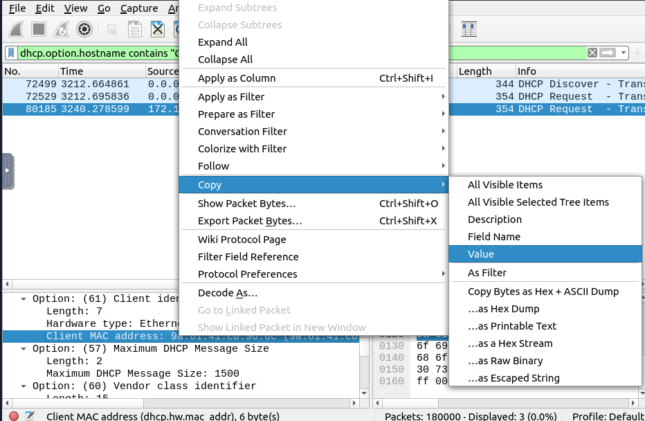
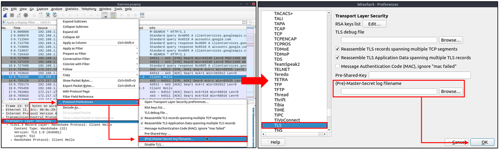

# Wireshark: Traffic Analysis

# nmap Scans

Nmap is an industry-standard tool for mapping networks, identifying live hosts and discovering the services. As it is one of the most used network scanner tools, a security analyst should identify the network patterns created with it. This section will cover identifying the most common Nmap scan types.

    TCP connect scans
    SYN scans
    UDP scans

It is essential to know how Nmap scans work to spot scan activity on the network. However, it is impossible to understand the scan details without using the correct filters. Below are the base filters to probe Nmap scan behaviour on the network. 

TCP flags in a nutshell.

<table class="table table-bordered"><tbody><tr><td><b>Notes</b></td><td><b>Wireshark Filters</b></td></tr><tr><td>Global search.</td><td><ul><li style="text-align:left"><code>tcp</code></li></ul><ul><li style="text-align:left"><code>udp</code></li></ul></td></tr><tr><td><ul><li style="text-align:left">Only SYN flag.</li><li style="text-align:left">SYN flag is set. The rest of the bits are not important.</li></ul></td><td><ul><li style="text-align:left"><code>tcp.flags == 2</code></li></ul><ul><li style="text-align:left"><code>tcp.flags.syn == 1</code></li></ul></td></tr><tr><td><ul><li style="text-align:left">Only ACK flag.</li><li style="text-align:left">ACK flag is set. The rest of the bits are not important. </li></ul></td><td><ul><li style="text-align:left"><code>tcp.flags == 16</code></li></ul><ul><li style="text-align:left"><code>tcp.flags.ack == 1</code></li></ul></td></tr><tr><td><ul><li style="text-align:left">Only SYN, ACK flags.</li><li style="text-align:left">SYN and ACK are set. The rest of the bits are not important.</li></ul></td><td><ul><li style="text-align:left"><code>tcp.flags == 18</code></li></ul><ul><li style="text-align:left"><code>(tcp.flags.syn == 1) and (tcp.flags.ack == 1)</code></li></ul></td></tr><tr><td><ul><li style="text-align:left">Only RST flag.</li><li style="text-align:left">RST flag is set. The rest of the bits are not important. </li></ul></td><td>
 
<ul><li style="text-align:left"><code>tcp.flags == 4</code></li></ul><ul><li style="text-align:left"><code>tcp.flags.reset == 1</code></li></ul></td></tr><tr><td><ul><li style="text-align:left">Only RST, ACK flags.</li><li style="text-align:left">RST and ACK are set. The rest of the bits are not important. </li></ul></td><td><ul><li style="text-align:left"><code>tcp.flags == 20</code></li></ul><ul><li style="text-align:left"><code>(tcp.flags.reset == 1) and (tcp.flags.ack == 1)</code></li></ul></td></tr><tr><td><ul><li style="text-align:left">Only FIN flag</li><li style="text-align:left">FIN flag is set. The rest of the bits are not important.</li></ul></td><td><ul><li style="text-align:left"><code style="font-size:14px">tcp.flags == 1</code></li></ul><ul><li style="text-align:left"><code style="font-size:14px">tcp.flags.fin == 1</code></li></ul></td></tr></tbody></table>

## TCP Connect Scans

TCP Connect Scan in a nutshell:

- Relies on the three-way handshake (needs to finish the handshake process).
-   Usually conducted with nmap -sT command.
-   Used by non-privileged users (only option for a non-root user).
-   Usually has a windows size larger than 1024 bytes as the request expects some data due to the nature of the protocol.

<table class="table table-bordered"><tbody><tr><td><b>Open TCP Port</b></td><td><b>Open TCP Port </b></td><td><b>Closed TCP Port</b> </td></tr><tr><td><ul><li style="text-align:left">SYN --&gt;</li><li style="text-align:left">&lt;-- SYN, ACK</li><li style="text-align:left">ACK --&gt; </li></ul></td><td><ul><li style="text-align:left">SYN --&gt;</li><li style="text-align:left">&lt;-- SYN, ACK</li><li style="text-align:left">ACK --&gt;</li><li style="text-align:left">RST, ACK --&gt; </li></ul></td><td><ul><li style="text-align:left">SYN --&gt;</li><li style="text-align:left">&lt;-- RST, ACK </li></ul></td></tr></tbody></table>

The images below show the three-way handshake process of the open and close TCP ports. Images and pcap samples are split to make the investigation easier and understand each case's details.

Open TCP port (Connect):

Closed TCP port (Connect):

The above images provide the patterns in isolated traffic. However, it is not always easy to spot the given patterns in big capture files. Therefore analysts need to use a generic filter to view the initial anomaly patterns, and then it will be easier to focus on a specific traffic point. The given filter shows the TCP Connect scan patterns in a capture file.

`tcp.flags.syn==1 and tcp.flags.ack==0 and tcp.window_size > 1024`

## SYN Scans

TCP SYN Scan in a nutshell:

-   Doesn't rely on the three-way handshake (no need to finish the handshake process).
-   Usually conducted with nmap -sS command.
-   Used by privileged users.
-   Usually have a size less than or equal to 1024 bytes as the request is not finished and it doesn't expect to receive data.

<table class="table table-bordered"><tbody><tr><td><b>Open TCP Port</b></td><td><b>Close TCP Port</b></td></tr><tr><td><ul><li style="text-align:left">SYN --&gt;</li><li style="text-align:left">&lt;-- SYN,ACK</li><li style="text-align:left">RST--&gt;</li></ul></td><td><ul><li style="text-align:left">SYN --&gt;</li><li style="text-align:left">&lt;-- RST,ACK</li></ul></td></tr></tbody></table>

Open TCP port (SYN):

Closed TCP port (SYN):

The given filter shows the TCP SYN scan patterns in a capture file.

`tcp.flags.syn==1 and tcp.flags.ack==0 and tcp.window_size <= 1024`

## UDP Scans

UDP Scan in a nutshell:

-   Doesn't require a handshake process
-   No prompt for open ports
-   ICMP error message for close ports
-   Usually conducted with nmap -sU command.

<table class="table table-bordered"><tbody><tr><td>Open UDP Port </td><td>Closed UDP Port </td></tr><tr><td><ul><li style="text-align:left">UDP packet --&gt;</li></ul></td><td><ul><li style="text-align:left">UDP packet --&gt;</li><li style="text-align:left">ICMP Type 3, Code 3 message. (Destination unreachable, port unreachable)</li></ul></td></tr></tbody></table>

Closed (port no 69) and open (port no 68) UDP ports:

The above image shows that the closed port returns an ICMP error packet. No further information is provided about the error at first glance, so how can an analyst decide where this error message belongs? The ICMP error message uses the original request as encapsulated data to show the source/reason of the packet. Once you expand the ICMP section in the packet details pane, you will see the encapsulated data and the original request, as shown in the below image.

The given filter shows the UDP scan patterns in a capture file.

`icmp.type==3 and icmp.code==3`

## Q & A 

Use the "Desktop/exercise-pcaps/nmap/Exercise.pcapng" file.
Q1 What is the total number of the "TCP Connect" scans?

A1 1000

Apply filter: `tcp.flags.syn==1 and tcp.flags.ack==0 and tcp.window_size > 1024`

Q2 Which scan type is used to scan the TCP port 80?

A2 TCP connect

Q3 How many "UDP close port" messages are there?

A3 1083

Apply filter: `icmp.type==3 and icmp.code==3`

Q4 Which UDP port in the 55-70 port range is open?

A4 68

# ARP Poisoning & Man In The Middle!

## ARP Poisoning/Spoofing (A.K.A. Man In The Middle Attack)

ARP protocol, or Address Resolution Protocol (ARP), is the technology responsible for allowing devices to identify themselves on a network. Address Resolution Protocol Poisoning (also known as ARP Spoofing or Man In The Middle (MITM) attack) is a type of attack that involves network jamming/manipulating by sending malicious ARP packets to the default gateway. The ultimate aim is to manipulate the "IP to MAC address table" and sniff the traffic of the target host.

There are a variety of tools available to conduct ARP attacks. However, the mindset of the attack is static, so it is easy to detect such an attack by knowing the ARP protocol workflow and Wireshark skills.    

ARP analysis in a nutshell:

-   Works on the local network
-   Enables the communication between MAC addresses
-   Not a secure protocol
-   Not a routable protocol
-   It doesn't have an authentication function
-   Common patterns are request & response, announcement and gratuitous packets.

Before investigating the traffic, let's review some legitimate and suspicious ARP packets. The legitimate requests are similar to the shown picture: a broadcast request that asks if any of the available hosts use an IP address and a reply from the host that uses the particular IP address.

<table class="table table-bordered"><tbody><tr><td><b>Notes</b></td><td><b>Wireshark filter</b></td></tr><tr><td>Global search</td><td><ul><li style="text-align:left"><code>arp</code></li></ul></td></tr><tr><td>
"ARP"&nbsp;options for grabbing the low-hanging fruits:

<ul style="text-align:left"><li>Opcode 1: ARP requests.</li><li>Opcode 2: ARP responses.</li><li><b>Hunt:</b> Arp scanning</li><li><b>Hunt:</b> Possible ARP poisoning detection</li><li><b>Hunt:</b> Possible ARP flooding from detection:</li></ul></td><td><ul><li style="text-align:left"><code>arp.opcode == 1</code></li></ul><ul><li style="text-align:left"><code>arp.opcode == 2</code></li></ul><ul><li style="text-align:left"><code>arp.dst.hw_mac==00:00:00:00:00:00</code></li></ul><ul><li style="text-align:left"><code>arp.duplicate-address-detected or arp.duplicate-address-frame</code></li></ul><ul><li style="text-align:left"><code>((arp) &amp;&amp; (arp.opcode == 1)) &amp;&amp; (arp.src.hw_mac == target-mac-address)</code> </li></ul></td></tr></tbody></table>

A suspicious situation means having two different ARP responses (conflict) for a particular IP address. In that case, Wireshark's expert info tab warns the analyst. However, it only shows the second occurrence of the duplicate value to highlight the conflict. Therefore, identifying the malicious packet from the legitimate one is the analyst's challenge. A possible IP spoofing case is shown in the picture below.

Here, knowing the network architecture and inspecting the traffic for a specific time frame can help detect the anomaly. As an analyst, you should take notes of your findings before going further. This will help you be organised and make it easier to correlate the further findings. Look at the given picture; there is a conflict; the MAC address that ends with "b4" crafted an ARP request with the "192.168.1.25" IP address, then claimed to have the "192.168.1.1" IP address.

<table class="table table-bordered"><tbody><tr><td><b>Notes</b></td><td>Detection Notes </td><td><b>Findings</b></td></tr><tr><td>Possible IP address match. </td><td style="text-align:left">1 IP address announced from a MAC address. </td><td><ul><li style="text-align:left">MAC: 00:0c:29:e2:18:b4</li><li style="text-align:left">IP: 192.168.1.25</li></ul></td></tr><tr><td>Possible ARP spoofing attempt. </td><td>
2 MAC addresses claimed the same IP address (192.168.1.1). The " 192.168.1.1" IP address is a possible gateway address. 
</td><td><ul><li style="text-align:left">MAC1: 50:78:b3:f3:cd:f4</li><li style="text-align:left">MAC 2: 00:0c:29:e2:18:b4</li></ul></td></tr><tr><td>Possible ARP flooding attempt. </td><td style="text-align:left">The MAC address that ends with "b4" claims to have a different/new IP address. </td><td><ul><li style="text-align:left">MAC: 00:0c:29:e2:18:b4</li><li style="text-align:left">IP: 192.168.1.1</li></ul></td></tr></tbody></table>

Let's keep inspecting the traffic to spot any other anomalies. Note that the case is split into multiple capture files to make the investigation easier.

At this point, it is evident that there is an anomaly. A security analyst cannot ignore a flood of ARP requests. This could be malicious activity, scan or network problems. There is a new anomaly; the MAC address that ends with "b4" crafted multiple ARP requests with the "192.168.1.25" IP address. Let's focus on the source of this anomaly and extend the taken notes. 

<table class="table table-bordered"><tbody><tr><td>Notes</td><td>Detection Notes</td><td>Findings</td></tr><tr><td style="text-align:center">Possible IP address match. </td><td style="text-align:left">1 IP address announced from a MAC address. </td><td>

<ul><li style="text-align:left">MAC: 00:0c:29:e2:18:b4</li><li style="text-align:left">IP: 192.168.1.25</li></ul>

</td></tr><tr><td style="text-align:center">Possible ARP spoofing attempt. </td><td>

2 MAC addresses claimed the same IP address (192.168.1.1).

The " 192.168.1.1" IP address is a possible gateway address.

</td><td><ul><li style="text-align:left">MAC1: 50:78:b3:f3:cd:f4</li><li style="text-align:left">MAC 2: 00:0c:29:e2:18:b4</li></ul></td></tr><tr><td style="text-align:center">Possible ARP spoofing attempt. </td><td style="text-align:left">The MAC address that ends with "b4" claims to have a different/new IP address. </td><td><ul><li style="text-align:left">MAC:&nbsp;00:0c:29:e2:18:b4</li><li style="text-align:left">IP:&nbsp;192.168.1.1</li></ul></td></tr><tr><td style="text-align:center">Possible ARP flooding attempt. </td><td style="text-align:left">The MAC address that ends with "b4" crafted multiple ARP requests against a range of IP addresses.</td><td><ul><li style="text-align:left">MAC: 00:0c:29:e2:18:b4</li><li style="text-align:left">IP: 192.168.1.xxx</li></ul></td></tr></tbody></table>

Up to this point, it is evident that the MAC address that ends with "b4" owns the "192.168.1.25" IP address and crafted suspicious ARP requests against a range of IP addresses. It also claimed to have the possible gateway address as well. Let's focus on other protocols and spot the reflection of this anomaly in the following sections of the time frame. 

There is HTTP traffic, and everything looks normal at the IP level, so there is no linked information with our previous findings. Let's add the MAC addresses as columns in the packet list pane to reveal the communication behind the IP addresses.

One more anomaly! The MAC address that ends with "b4" is the destination of all HTTP packets! It is evident that there is a MITM attack, and the attacker is the host with the MAC address that ends with "b4". All traffic linked to "192.168.1.12" IP addresses is forwarded to the malicious host. Let's summarise the findings before concluding the investigation.  

<table class="table table-bordered"><tbody><tr><td>Detection Notes</td><td>Findings</td></tr><tr><td>IP to MAC matches.</td><td style="text-align:left">3&nbsp; IP to MAC address matches.&nbsp;</td><td>

<ul><li style="text-align:left">MAC: 00:0c:29:e2:18:b4 =&nbsp;IP: 192.168.1.25</li><li style="text-align:left">MAC: 50:78:b3:f3:cd:f4 = IP: 192.1681.1</li><li style="text-align:left">MAC:&nbsp;00:0c:29:98:c7:a8 = IP: 192.168.1.12</li></ul>

</td></tr><tr><td>Attacker</td><td style="text-align:left">The attacker created noise with ARP packets. </td><td style="text-align:left"><ul><li>MAC: 00:0c:29:e2:18:b4 = IP: 192.168.1.25 </li></ul></td></tr><tr><td>Router/gateway </td><td style="text-align:left">Gateway address. </td><td><ul><li style="text-align:left">MAC: 50:78:b3:f3:cd:f4 = IP: 192.1681.1 </li></ul></td></tr><tr><td>Victim </td><td style="text-align:left">The attacker sniffed all traffic of the victim.</td><td><ul><li style="text-align:left">MAC: 50:78:b3:f3:cd:f4 = IP: 192.1681.12 </li></ul></td></tr></tbody></table>

Detecting these bits and pieces of information in a big capture file is challenging. However, in real-life cases, you will not have "tailored data" ready for investigation. Therefore you need to have the analyst mindset, knowledge and tool skills to filter and detect the anomalies. 

Note: In traffic analysis, there are always alternative solutions available. The solution type and the approach depend on the analyst's knowledge and skill level and the available data sources. 

Use the "Desktop/exercise-pcaps/arp/Exercise.pcapng" file.
Q1 What is the number of ARP requests crafted by the attacker?

A1 284

Q2 What is the number of HTTP packets received by the attacker?

A2 90

Q3 What is the number of sniffed username&password entries?

A3 6

Q4 What is the password of the "Client986"?

A4 clientnothere!

I manually checked the POST entries, and found the key pair of `uname` and `pass`

afterwards I tried this

which gave me the answer for Q3

Q5 What is the comment provided by the "Client354"?

A5 Nice work!

# Identifying Hosts: DHCP, NetBIOS and Kerberos

## Identifying Hosts

When investigating a compromise or malware infection activity, a security analyst should know how to identify the hosts on the network apart from IP to MAC address match. One of the best methods is identifying the hosts and users on the network to decide the investigation's starting point and list the hosts and users associated with the malicious traffic/activity.

Usually, enterprise networks use a predefined pattern to name users and hosts. While this makes knowing and following the inventory easier, it has good and bad sides. The good side is that it will be easy to identify a user or host by looking at the name. The bad side is that it will be easy to clone that pattern and live in the enterprise network for adversaries. There are multiple solutions to avoid these kinds of activities, but for a security analyst, it is still essential to have host and user identification skills.

Protocols that can be used in Host and User identification:

-   Dynamic Host Configuration Protocol (DHCP) traffic
-   NetBIOS (NBNS) traffic 
-   Kerberos traffic

## DHCP Analysis

DHCP protocol, or Dynamic Host Configuration Protocol (DHCP), is the technology responsible for managing automatic IP address and required communication parameters assignment.

DHCP investigation in a nutshell:

<table class="table table-bordered"><tbody><tr><td><b>Notes</b></td><td><b>Wireshark Filter</b></td></tr><tr><td style="text-align:center">Global search.</td><td><ul><li style="text-align:left"><code>dhcp</code> or <code>bootp</code></li></ul></td></tr><tr><td style="text-align:left">Filtering the proper DHCP packet options is vital to finding an event of interest.&nbsp;  <ul><li style="text-align:left"><b>"DHCP Request"</b> packets contain the hostname information</li><li style="text-align:left"><b>"DHCP ACK"</b> packets represent the accepted requests</li><li style="text-align:left"><b>"DHCP NAK"</b> packets represent denied requests</li></ul>
Due to the nature of the protocol, only "Option 53" ( request type) has predefined static values. You should filter the packet type first, and then you can filter the rest of the options by "applying as column" or use the advanced filters like "contains" and "matches". 
</td><td>

<ul><li style="text-align:left">Request: <code>dhcp.option.dhcp == 3</code></li></ul><ul><li style="text-align:left">ACK: <code>dhcp.option.dhcp == 5</code></li></ul><ul><li style="text-align:left">NAK: <code>dhcp.option.dhcp == 6</code></li></ul>

</td></tr><tr><td style="text-align:left">
<b>"DHCP Request"</b> options for grabbing the low-hanging fruits:
<ul><li><b>Option 12:</b> Hostname.</li><li><b>Option 50:</b> Requested IP address.</li><li><b>Option 51:</b> Requested IP lease time.</li><li><b>Option 61: </b>Client's MAC address.</li></ul></td><td style="text-align:left"><ul><li><code>dhcp.option.hostname contains "keyword"</code></li></ul></td></tr><tr><td>
<b>"DHCP ACK"</b> options for grabbing the low-hanging fruits:
<ul style="text-align:left"><li><b>Option 15:</b> Domain name.</li><li><b>Option 51:</b> Assigned IP lease time.</li></ul></td><td style="text-align:left"><ul><li><code>dhcp.option.domain_name contains "keyword"</code></li></ul></td></tr><tr><td>
<b>"DHCP NAK"</b> options for grabbing the low-hanging fruits:
<ul style="text-align:left"><li><b>Option 56:</b> Message (rejection details/reason).</li></ul></td><td style="text-align:left">
As the message could be unique according to the case/situation, It is suggested to read the message instead of filtering it. Thus, the analyst could create a more reliable hypothesis/result by understanding the event circumstances.
</td></tr></tbody></table>

## NetBIOS (NBNS) Analysis

NetBIOS or Network Basic Input/Output System is the technology responsible for allowing applications on different hosts to communicate with each other. 

NBNS investigation in a nutshell:

<table class="table table-bordered"><tbody><tr><td><b>Notes</b></td><td><b>Wireshark Filter</b></td></tr><tr><td>Global search.</td><td><ul><li style="text-align:left"><code>nbns</code></li></ul></td></tr><tr><td>
"NBNS"&nbsp;options for grabbing the low-hanging fruits:
<ul style="text-align:left"><li><b>Queries:</b> Query details.</li><li>Query details could contain <b>"name, Time to live (TTL) and IP address details"</b></li></ul></td><td><ul><li style="text-align:left"><code>nbns.name contains "keyword"</code></li></ul></td></tr></tbody></table>

## Kerberos Analysis

Kerberos is the default authentication service for Microsoft Windows domains. It is responsible for authenticating service requests between two or more computers over the untrusted network. The ultimate aim is to prove identity securely.

Kerberos investigation in a nutshell:

<table class="table table-bordered" style="font-size:1rem"><tbody><tr><td><b>Notes</b></td><td><b>Wireshark Filter</b></td></tr><tr><td>Global search.</td><td><ul><li style="text-align:left"><code>kerberos</code></li></ul></td></tr><tr><td>
User account search:
<ul style="text-align:left"><li><b>CNameString: </b>The username.</li></ul>
<strong>Note:</strong>&nbsp;Some packets could provide hostname information in this field. To avoid this confusion, filter the<b> "$"</b> value. The values end with <b>"$"</b> are hostnames, and the ones without it are user names. 
</td><td><ul><li style="text-align:left"><code>kerberos.CNameString contains "keyword"</code>&nbsp;</li><li style="text-align:left"><code>kerberos.CNameString and !(kerberos.CNameString contains "$" )</code></li></ul></td></tr><tr><td>
"Kerberos"&nbsp;options for grabbing the low-hanging fruits:
<ul style="text-align:left"><li><b>pvno:</b> Protocol version.</li><li><b>realm:</b> Domain name for the generated ticket. </li><li><b>sname:</b> Service and domain name for the generated ticket.</li><li><b>addresses:</b> Client IP address and NetBIOS name. </li></ul>
<b style="font-size:1rem;text-align:center">Note:</b> the "addresses" information is only available in request packets.
</td><td><ul><li style="text-align:left"><code>kerberos.pvno == 5</code></li></ul><ul><li style="text-align:left"><code>kerberos.realm contains ".org"</code>&nbsp;</li></ul><ul><li style="text-align:left"><code>kerberos.SNameString == "krbtg"</code></li></ul></td></tr></tbody></table>

## Q & A

### Use the "Desktop/exercise-pcaps/dhcp-netbios-kerberos/dhcp-netbios.pcap" file.

Q1 What is the MAC address of the host "Galaxy A30"?

A1 9a:81:41:cb:96:6c

No exact match for Galaxy A30 so I used `contains`

Q2 How many NetBIOS registration requests does the "LIVALJM" workstation have?
Hint `nbns.flags.opcode==5`

A2 16

Prepare as filter

Q3 Which host requested the IP address "172.16.13.85"?

A3 Galaxy-A12

### Use the "Desktop/exercise-pcaps/dhcp-netbios-kerberos/kerberos.pcap" file.

Q4 What is the IP address of the user "u5"? (Enter the address in defanged format.)

A4 10[.]1[.]12[.]2

Q5 What is the hostname of the available host in the Kerberos packets?

A5 xp1$

# Tunneling Traffic: DNS and ICMP

Traffic tunnelling is (also known as "port forwarding") transferring the data/resources in a secure method to network segments and zones. It can be used for "internet to private networks" and "private networks to internet" flow/direction. There is an encapsulation process to hide the data, so the transferred data appear natural for the case, but it contains private data packets and transfers them to the final destination securely.

Tunnelling provides anonymity and traffic security. Therefore it is highly used by enterprise networks. However, as it gives a significant level of data encryption, attackers use tunnelling to bypass security perimeters using the standard and trusted protocols used in everyday traffic like ICMP and DNS. Therefore, for a security analyst, it is crucial to have the ability to spot ICMP and DNS anomalies.

## ICMP Analysis 

Internet Control Message Protocol (ICMP) is designed for diagnosing and reporting network communication issues. It is highly used in error reporting and testing. As it is a trusted network layer protocol, sometimes it is used for denial of service (DoS) attacks; also, adversaries use it in data exfiltration and C2 tunnelling activities.

###  ICMP analysis in a nutshell:

Usually, ICMP tunnelling attacks are anomalies appearing/starting after a malware execution or vulnerability exploitation. As the ICMP packets can transfer an additional data payload, adversaries use this section to exfiltrate data and establish a C2 connection. It could be a TCP, HTTP or SSH data. As the ICMP protocols provide a great opportunity to carry extra data, it also has disadvantages. Most enterprise networks block custom packets or require administrator privileges to create custom ICMP packets.

A large volume of ICMP traffic or anomalous packet sizes are indicators of ICMP tunnelling. Still, the adversaries could create custom packets that match the regular ICMP packet size (64 bytes), so it is still cumbersome to detect these tunnelling activities. However, a security analyst should know the normal and the abnormal to spot the possible anomaly and escalate it for further analysis.

<table class="table table-bordered"><tbody><tr><td><b>Notes</b></td><td><b>Wireshark filters</b></td></tr><tr><td>Global search</td><td><ul><li style="text-align:left"><code>icmp</code></li></ul></td></tr><tr><td>
"ICMP"&nbsp;options for grabbing the low-hanging fruits:
<ul style="text-align:left"><li>Packet length.</li><li>ICMP destination addresses. </li><li>Encapsulated protocol signs in ICMP payload.</li></ul></td><td><ul><li style="text-align:left"><code>data.len &gt; 64 and icmp</code></li></ul></td></tr></tbody></table>

## DNS Analysis 

Domain Name System (DNS) is designed to translate/convert IP domain addresses to IP addresses. It is also known as a phonebook of the internet. As it is the essential part of web services, it is commonly used and trusted, and therefore often ignored. Due to that, adversaries use it in data exfiltration and C2 activities.

### DNS analysis in a nutshell:

Similar to ICMP tunnels, DNS attacks are anomalies appearing/starting after a malware execution or vulnerability exploitation. Adversary creates (or already has) a domain address and configures it as a C2 channel. The malware or the commands executed after exploitation sends DNS queries to the C2 server. However, these queries are longer than default DNS queries and crafted for subdomain addresses. Unfortunately, these subdomain addresses are not actual addresses; they are encoded commands as shown below:

"encoded-commands.maliciousdomain.com"

When this query is routed to the C2 server, the server sends the actual malicious commands to the host. As the DNS queries are a natural part of the networking activity, these packets have the chance of not being detected by network perimeters. A security analyst should know how to investigate the DNS packet lengths and target addresses to spot these anomalies. 

<table class="table table-bordered"><tbody><tr><td><b>Notes</b></td><td><b>Wireshark Filter</b></td></tr><tr><td>Global search</td><td><ul><li style="text-align:left"><code>dns</code></li></ul></td></tr><tr><td>
"DNS"&nbsp;options for grabbing the low-hanging fruits:
<ul style="text-align:left"><li>Query length.</li><li>Anomalous and non-regular names in DNS addresses.</li><li>Long DNS addresses with encoded subdomain addresses.</li><li>Known patterns like dnscat and dns2tcp.</li><li>Statistical analysis like the anomalous volume of DNS requests for a particular target.</li></ul>
<b>!mdns: </b>Disable local link device queries.
</td><td><ul><li style="text-align:left"><code>dns contains "dnscat"</code></li></ul><ul><li style="text-align:left"><code>dns.qry.name.len &gt; 15 and !mdns</code></li></ul></td></tr></tbody></table>

## Q & A

Q1 Use the "Desktop/exercise-pcaps/dns-icmp/icmp-tunnel.pcap" file.
Investigate the anomalous packets. Which protocol is used in ICMP tunnelling?

Hint 1) Remember, Wireshark is not an IDS/IPS tool. A security analyst should know how to filter the packets and investigate the results manually. 2) Filtering anomalous packets and investigating the packet details (including payload data) could help.

A1 ssh

search for commonly used tunneling protocols in ICMP ie TCP HTTP SSH, in this case it was SSH

Q2 Use the "Desktop/exercise-pcaps/dns-icmp/dns.pcap" file.
Investigate the anomalous packets. What is the suspicious main domain address that receives anomalous DNS queries? (Enter the address in defanged format.)

Hint After filtering the packets, focus on the payload data in the packet bytes section. You might need to use the tool in full-screen mode/full-screen the VM.

A2 dataexfil[.]com

 

I did need full screen mode to spot the suspicious domain

# Cleartext Protocol Analysis: FTP

Investigating cleartext protocol traces sounds easy, but when the time comes to investigate a big network trace for incident analysis and response, the game changes. Proper analysis is more than following the stream and reading the cleartext data. For a security analyst, it is important to create statistics and key results from the investigation process. As mentioned earlier at the beginning of the Wireshark room series, the analyst should have the required network knowledge and tool skills to accomplish this. Let's simulate a cleartext protocol investigation with Wireshark!

## FTP Analysis 

File Transfer Protocol (FTP) is designed to transfer files with ease, so it focuses on simplicity rather than security. As a result of this, using this protocol in unsecured environments could create security issues like:

-   MITM attacks
-   Credential stealing and unauthorised access
-   Phishing
-   Malware planting
-   Data exfiltration

### FTP analysis in a nutshell:

<table class="table table-bordered"><tbody><tr><td><b>Notes</b></td><td><b>Wireshark Filter</b></td></tr><tr><td>Global search</td><td><ul><li style="text-align:left"><code>ftp</code></li></ul></td></tr><tr><td style="text-align:left">
<b>"FTP"</b> options for grabbing the low-hanging fruits:
<ul><li><b>x1x series:</b> Information request responses.</li><li><b>x2x series: </b>Connection messages.</li><li><b>x3x series:</b> Authentication messages.</li></ul>
<b>Note:</b> "200" means command successful.
</td><td><b>---</b></td></tr><tr><td style="text-align:left">
"x1x"&nbsp;series options for grabbing the low-hanging fruits:
<ul><li><b>211: </b>System status.</li><li><b>212:</b> Directory status.</li><li><b>213:</b> File status</li></ul></td><td><ul><li style="text-align:left"><code>ftp.response.code == 211</code>&nbsp;</li></ul></td></tr><tr><td style="text-align:left">
"x2x"&nbsp;series options for grabbing the low-hanging fruits:
<ul><li><b>220:</b> Service ready.</li><li><b>227:</b> Entering passive mode.</li><li><b>228:</b> Long passive mode.</li><li><b>229:</b> Extended passive mode.</li></ul></td><td><ul><li style="text-align:left"><code>ftp.response.code == 227</code></li></ul></td></tr><tr><td style="text-align:left">
"x3x"&nbsp;series options for grabbing the low-hanging fruits:
<ul><li><b>230:</b> User login.</li><li><b>231:</b> User logout.</li><li><b>331:</b> Valid username.</li><li><b>430:</b> Invalid username or password</li><li><b>530:</b> No login, invalid password.</li></ul></td><td><ul><li style="text-align:left"><code>ftp.response.code == 230</code></li></ul></td></tr><tr><td style="text-align:left">
"FTP"&nbsp;commands for grabbing the low-hanging fruits:
<ul><li><b>USER:</b> Username.</li><li><b>PASS: </b>Password.</li><li><b>CWD:</b> Current work directory.</li><li><b>LIST:</b> List.</li></ul></td><td><ul><li style="text-align:left"><code>ftp.request.command == "USER"</code></li></ul><ul><li style="text-align:left"><code>ftp.request.command == "PASS"</code></li></ul><ul><li style="text-align:left"><code>ftp.request.arg == "password"</code></li></ul></td></tr><tr><td style="text-align:left">
Advanced usages examples for grabbing low-hanging fruits:
<ul><li><b>Bruteforce signal:</b> List failed login attempts.</li><li><b>Bruteforce signal:</b> List target username.</li><li><b>Password spray signal:</b> List targets for a static password. </li></ul></td><td><ul><li style="text-align:left"><code>ftp.response.code == 530</code></li></ul><ul><li style="text-align:left"><code>(ftp.response.code == 530) and (ftp.response.arg contains "username")</code></li></ul><ul><li style="text-align:left"><code>(ftp.request.command == "PASS" ) and (ftp.request.arg == "password")</code></li></ul></td></tr></tbody></table>

## Q & A

Use the "Desktop/exercise-pcaps/ftp/ftp.pcap" file.

Q1 How many incorrect login attempts are there?

A1 737

Q2 What is the size of the file accessed by the "ftp" account?

A2 39424

Q3 The adversary uploaded a document to the FTP server. What is the filename?

A3 resume.doc

Q4 The adversary tried to assign special flags to change the executing permissions of the uploaded file. What is the command used by the adversary?

A4 CHMOD 777

# Cleartext Protocol Analysis: HTTP

HTTP Analysis 
Hypertext Transfer Protocol (HTTP) is a cleartext-based, request-response and client-server protocol. It is the standard type of network activity to request/serve web pages, and by default, it is not blocked by any network perimeter. As a result of being unencrypted and the backbone of web traffic, HTTP is one of the must-to-know protocols in traffic analysis. Following attacks could be detected with the help of HTTP analysis:

-   Phishing pages
-   Web attacks
-   Data exfiltration
-   Command and control traffic (C2)

### HTTP analysis in a nutshell:

<table class="table table-bordered"><tbody><tr><td><b>Notes</b></td><td><b>Wireshark Filter</b></td></tr><tr><td>
Global search

<b>Note:</b>&nbsp;HTTP2 is a revision of the HTTP protocol for better performance and security. It supports binary data transfer and request&amp;response multiplexing.
</td><td><ul><li style="text-align:left"><code>http</code></li></ul><ul><li style="text-align:left"><code>http2</code></li></ul></td></tr><tr><td>
"HTTP<b>&nbsp;Request Methods"</b> for grabbing the low-hanging fruits:
<ul><li style="text-align:left">GET</li><li style="text-align:left">POST</li><li style="text-align:left">Request: Listing all requests</li></ul>
 
</td><td><ul><li style="text-align:left"><code>http.request.method == "GET"</code></li></ul><ul><li style="text-align:left"><code>http.request.method == "POST"</code></li></ul><ul><li style="text-align:left"><code>http.request</code></li></ul></td></tr><tr><td>
"HTTP&nbsp;Response Status Codes"&nbsp;for grabbing the low-hanging fruits:
<ul><li style="text-align:left"><b>200 OK:</b> Request successful.</li><li style="text-align:left"><b>301 Moved Permanently: </b>Resource is moved to a new URL/path (permanently).</li><li style="text-align:left"><b>302 Moved Temporarily:</b> Resource is moved to a new URL/path (temporarily).</li><li style="text-align:left"><b>400 Bad Request:</b> Server didn't understand the request.</li><li style="text-align:left"><b>401 Unauthorised: </b>URL needs authorisation (login, etc.).</li><li style="text-align:left"><b>403 Forbidden:</b> No access to the requested URL.&nbsp;</li><li style="text-align:left"><b>404 Not Found:</b> Server can't find the requested URL.</li><li style="text-align:left"><b>405 Method Not Allowed: </b>Used method is not suitable or blocked.</li><li style="text-align:left"><b>408 Request Timeout:</b>&nbsp; Request look longer than server wait time.</li><li style="text-align:left"><b>500 Internal Server Error: </b>Request not completed, unexpected error.</li><li style="text-align:left"><b>503 Service Unavailable:</b> Request not completed server or service is down.</li></ul></td><td><ul><li style="text-align:left"><code>http.response.code == 200</code></li></ul><ul><li style="text-align:left"><code>http.response.code == 401</code></li></ul><ul><li style="text-align:left"><code>http.response.code == 403</code></li></ul><ul><li style="text-align:left"><code>http.response.code == 404</code></li></ul><ul><li style="text-align:left"><code>http.response.code == 405</code></li></ul><ul><li style="text-align:left"><code>http.response.code == 503</code></li></ul></td></tr><tr><td>
"HTTP&nbsp;Parameters"&nbsp;for grabbing the low-hanging fruits:
<ul><li style="text-align:left"><b>User agent:</b> Browser and operating system identification to a web server application.</li><li style="text-align:left"><b style="font-size:1rem">Request URI:</b> Points the requested resource from the server. </li><li style="text-align:left"><b>Full *URI: </b>Complete URI information.</li></ul>
<b>*URI: </b>Uniform Resource Identifier.
</td><td><ul><li style="text-align:left"><code>http.user_agent contains "nmap"</code></li></ul><ul><li style="text-align:left"><code>http.request.uri contains "admin"</code></li></ul><ul><li style="text-align:left"><code>http.request.full_uri contains "admin"</code></li></ul></td></tr><tr><td>
"HTTP&nbsp;Parameters"&nbsp;for grabbing the low-hanging fruits:
<ul><li style="text-align:left"><b>Server: </b>Server service name. </li><li style="text-align:left"><b>Host:</b> Hostname of the server</li><li style="text-align:left"><b>Connection:</b> Connection status. </li><li style="text-align:left"><b>Line-based text data:</b> Cleartext data provided by the server.</li><li style="text-align:left"><b>HTML Form URL Encoded:</b> Web form information.</li></ul></td><td><ul><li style="text-align:left"><code>http.server contains "apache"</code></li></ul><ul><li style="text-align:left"><code>http.host contains "keyword"</code></li></ul><ul><li style="text-align:left"><code>http.host == "keyword"</code></li></ul><ul><li style="text-align:left"><code>http.connection == "Keep-Alive"</code></li></ul><ul><li style="text-align:left"><code>data-text-lines contains "keyword"</code></li></ul></td></tr></tbody></table>

## User Agent Analysis 
As the adversaries use sophisticated technics to accomplish attacks, they try to leave traces similar to natural traffic through the known and trusted protocols. For a security analyst, it is important to spot the anomaly signs on the bits and pieces of the packets. The "user-agent" field is one of the great resources for spotting anomalies in HTTP traffic. In some cases, adversaries successfully modify the user-agent data, which could look super natural. A security analyst cannot rely only on the user-agent field to spot an anomaly. Never whitelist a user agent, even if it looks natural. User agent-based anomaly/threat detection/hunting is an additional data source to check and is useful when there is an obvious anomaly. If you are unsure about a value, you can conduct a web search to validate your findings with the default and normal user-agent info (example site: https://explore.whatismybrowser.com/useragents/explore/).

### User Agent analysis in a nutshell:

<table class="table table-bordered"><tbody><tr><td><b>Notes</b></td><td><b>Wireshark Filter</b></td></tr><tr><td>Global search.</td><td><ul><li style="text-align:left"><code>http.user_agent</code></li></ul></td></tr><tr><td>
Research outcomes&nbsp;for grabbing the low-hanging fruits:
<ul><li style="text-align:left">Different user agent information from the same host in a short time notice.</li><li style="text-align:left">Non-standard and custom user agent info.</li><li style="text-align:left">Subtle spelling differences. <b>("Mozilla" is not the same as&nbsp; "Mozlilla" or "Mozlila")</b></li><li style="text-align:left">Audit tools info like Nmap, Nikto, Wfuzz and sqlmap in the user agent field.</li><li style="text-align:left">Payload data in the user agent field.</li></ul></td><td><ul><li style="text-align:left"><code>(http.user_agent contains "sqlmap") or (http.user_agent contains "Nmap") or (http.user_agent contains "Wfuzz") or (http.user_agent contains "Nikto")</code></li></ul></td></tr></tbody></table>

## Log4j Analysis 
A proper investigation starts with prior research on threats and anomalies going to be hunted. Let's review the knowns on the "Log4j" attack before launching Wireshark.

### Log4j vulnerability analysis in a nutshell:
<table class="table table-bordered"><tbody><tr><td><b>Notes</b></td><td><b>Wireshark Filters</b></td></tr><tr><td>

<b>Research outcomes&nbsp;</b>for grabbing the low-hanging fruits:
<ul style="text-align:center"><li style="text-align:left">The attack starts with a "POST" request</li><li style="text-align:left">There are known cleartext patterns: "<b>jndi:ldap</b>" and "<b>Exploit.class</b>".</li></ul>
</td><td><ul><li style="text-align:left"><code style="font-size:14px">http.request.method == "POST"</code></li></ul><ul><li style="text-align:left"><code style="font-size:14px">(ip contains "jndi") or ( ip contains "Exploit")</code></li></ul><ul><li style="text-align:left"><code>(frame contains "jndi") or ( frame contains "Exploit")</code></li></ul><ul><li style="text-align:left"><code>(http.user_agent contains "$") or (http.user_agent contains "==") </code></li></ul></td></tr></tbody></table>

## Q & A

Use the "Desktop/exercise-pcaps/http/user-agent.cap" file.

Q1 Investigate the user agents. What is the number of anomalous  "user-agent" types?

A1 6

Create a new column

And inspect the user agents

Q2 What is the packet number with a subtle spelling difference in the user agent field?

A2 52

See in image above

Use the "Desktop/exercise-pcaps/http/http.pcapng" file.

Q3 Locate the "Log4j" attack starting phase. What is the packet number?

A3 444

or

the attack starts with a POST request

Q4 Locate the "Log4j" attack starting phase and decode the base64 command. What is the IP address contacted by the adversary? (Enter the address in defanged format and exclude "{}".)

A4 62[.]210[.]130[.]250

#  Encrypted Protocol Analysis: Decrypting HTTPS

Decrypting HTTPS Traffic

When investigating web traffic, analysts often run across encrypted traffic. This is caused by using the Hypertext Transfer Protocol Secure (HTTPS) protocol for enhanced security against spoofing, sniffing and intercepting attacks. HTTPS uses TLS protocol to encrypt communications, so it is impossible to decrypt the traffic and view the transferred data without having the encryption/decryption key pairs. As this protocol provides a good level of security for transmitting sensitive data, attackers and malicious websites also use HTTPS. Therefore, a security analyst should know how to use key files to decrypt encrypted traffic and investigate the traffic activity.

The packets will appear in different colours as the HTTP traffic is encrypted. Also, protocol and info details (actual URL address and data returned from the server) will not be fully visible. The first image below shows the HTTP packets encrypted with the TLS protocol. The second and third images demonstrate filtering HTTP packets without using a key log file.

### Additional information for HTTPS :

<table class="table table-bordered"><tbody><tr><td>Notes</td><td>Wireshark Filter</td></tr><tr><td>
"HTTPS&nbsp;Parameters"&nbsp;for grabbing the low-hanging fruits:
<ul><li style="text-align:left"><b style="font-size:1rem">Request: </b>Listing all requests </li><li style="text-align:left"><b>TLS:</b> Global TLS search</li><li style="text-align:left">TLS Client Request</li><li style="text-align:left">TLS Server response</li><li style="text-align:left">Local Simple Service Discovery Protocol (SSDP)</li></ul>
<b>Note:</b>&nbsp;SSDP is a network protocol that provides advertisement and discovery of network services.
</td><td><ul><li style="text-align:left"><code style="font-size:14px">http.request</code></li></ul><ul><li style="text-align:left"><code style="font-size:14px">tls</code></li></ul><ul><li style="text-align:left"><code style="font-size:14px">tls.handshake.type == 1</code></li></ul><ul><li style="text-align:left"><code style="font-size:14px">tls.handshake.type == 2</code></li></ul><ul><li style="text-align:left"><code style="font-size:14px">ssdp</code></li></ul></td></tr></tbody></table>

Similar to the TCP three-way handshake process, the TLS protocol has its handshake process. The first two steps contain "Client Hello" and "Server Hello" messages. The given filters show the initial hello packets in a capture file. These filters are helpful to spot which IP addresses are involved in the TLS handshake.

-   Client Hello: (http.request or tls.handshake.type == 1) and !(ssdp) 
-   Server Hello: (http.request or tls.handshake.type == 2) and !(ssdp)  

An encryption key log file is a text file that contains unique key pairs to decrypt the encrypted traffic session. These key pairs are automatically created (per session) when a connection is established with an SSL/TLS-enabled webpage. As these processes are all accomplished in the browser, you need to configure your system and use a suitable browser (Chrome and Firefox support this) to save these values as a key log file. To do this, you will need to set up an environment variable and create the SSLKEYLOGFILE, and the browser will dump the keys to this file as you browse the web. SSL/TLS key pairs are created per session at the connection time, so it is important to dump the keys during the traffic capture. Otherwise, it is not possible to create/generate a suitable key log file to decrypt captured traffic. 

You can use the "right-click" menu or "Edit --> Preferences --> Protocols --> TLS" menu to add/remove key log files.

### Adding key log files with the "right-click" menu:

### Adding key log files with the "Edit --> Preferences --> Protocols --> TLS" menu:

### Viewing the traffic with/without the key log files:

The above image shows that the traffic details are visible after using the key log file. Note that the packet details and bytes pane provides the data in different formats for investigation. Decompressed header info and HTTP2 packet details are available after decrypting the traffic. Depending on the packet details, you can also have the following data formats:

-   Frame
-   Decrypted TLS
-   Decompressed Header
-   Reassembled TCP
-   Reassembled SSL

## Q & A

Use the "Desktop/exercise-pcaps/https/Exercise.pcap" file.

Q1 What is the frame number of the "Client Hello" message sent to "accounts.google.com"?

A1 16

Filter for Client Hello: `(http.request or tls.handshake.type == 1) and !(ssdp) `
Inspect a packet, you will find the `server_name` key pair value with a server address, prepare that as filter with "accounts.google.com" as the value, and you get:

Q2 Decrypt the traffic with the "KeysLogFile.txt" file. What is the number of HTTP2 packets?

A2 115

Q3 Go to Frame 322. What is the authority header of the HTTP2 packet? (Enter the address in defanged format.)

A3 safebrowsing[.]googleapis[.]com

Go to the frame and inspect it:

Q4 Investigate the decrypted packets and find the flag! What is the flag?

A4 FLAG{THM-PACKETMASTER}

Inspect the frames: 

save as flag.txt and open it:

# Bonus: Hunt Cleartext Credentials!

Up to here, we discussed how to inspect the packets for specific conditions and spot anomalies. As mentioned in the first room, Wireshark is not an IDS, but it provides suggestions for some cases under the expert info. However, sometimes anomalies replicate the legitimate traffic, so the detection becomes harder. For example, in a cleartext credential hunting case, it is not easy to spot the multiple credential inputs and decide if there is a brute-force attack or if it is a standard user who mistyped their credentials.

As everything is presented at the packet level, it is hard to spot the multiple username/password entries at first glance. The detection time will decrease when an analyst can view the credential entries as a list. Wireshark has such a feature to help analysts who want to hunt cleartext credential entries.

Some Wireshark dissectors (FTP, HTTP, IMAP, pop and SMTP) are programmed to extract cleartext passwords from the capture file. You can view detected credentials using the "Tools --> Credentials" menu. This feature works only after specific versions of Wireshark (v3.1 and later). Since the feature works only with particular protocols, it is suggested to have manual checks and not entirely rely on this feature to decide if there is a cleartext credential in the traffic.

Once you use the feature, it will open a new window and provide detected credentials. It will show the packet number, protocol, username and additional information. This window is clickable; clicking on the packet number will select the packet containing the password, and clicking on the username will select the packet containing the username info. The additional part prompts the packet number that contains the username.

## Q & A 

Use the "Desktop/exercise-pcaps/bonus/Bonus-exercise.pcap" file.

Q1 What is the packet number of the credentials using "HTTP Basic Auth"?

A1 237

Tools -> Credentials:

Q2 What is the packet number where "empty password" was submitted?

A2 170

if you click on the packet number you can see the "PASS value" pair in 170 the value is empty

here is an example with a value:

# Bonus: Actionable Results!

You have investigated the traffic, detected anomalies and created notes for further investigation. What is next? Not every case investigation is carried out by a crowd team. As a security analyst, there will be some cases you need to spot the anomaly, identify the source and take action. Wireshark is not all about packet details; it can help you to create firewall rules ready to implement with a couple of clicks. You can create firewall rules by using the "Tools --> Firewall ACL Rules" menu. Once you use this feature, it will open a new window and provide a combination of rules (IP, port and MAC address-based) for different purposes. Note that these rules are generated for implementation on an outside firewall interface.

Currently, Wireshark can create rules for:

-   Netfilter (iptables)
-   Cisco IOS (standard/extended)
-   IP Filter (ipfilter)
-   IPFirewall (ipfw)
-   Packet filter (pf)
-   Windows Firewall (netsh new/old format)

## Q & A

Use the "Desktop/exercise-pcaps/bonus/Bonus-exercise.pcap" file.

Q1 Select packet number 99. Create a rule for "IPFirewall (ipfw)". What is the rule for "denying source IPv4 address"?

A1 `add deny ip from 10.121.70.151 to any in`

Select packet 99 then Tools -> Firewall ACL Rules -> Select Create rules for IPFirewall(ipfw)

Q2 Select packet number 231. Create "IPFirewall" rules. What is the rule for "allowing destination MAC address"?

A2 add allow MAC 00:d0:59:aa:af:80 any in

modify this to allow:

