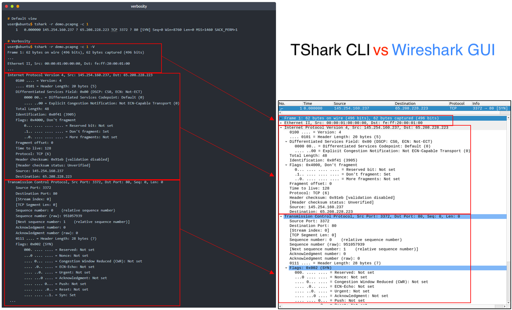

# Introduction

TShark is an open-source command-line network traffic analyser. It is created by the Wireshark developers and has most of the features of Wireshark. It is commonly used as a command-line version of Wireshark. However, it can also be used like tcpdump. Therefore it is preferred for comprehensive packet assessments.

Learning Objectives

-   Filtering the traffic with TShark
-   Implementing Wireshark filters in TShark
-   Expanding and automating packet filtering with TShark


# Command-Line Packet Analysis Hints | TShark and Supplemental CLI Tools

## Command-Line Packet Analysis Hints

TShark is a text-based tool, and it is suitable for data carving, in-depth packet analysis, and automation with scripts. This strength and flexibility come out of the nature of the CLI tools, as the produced/processed data can be pipelined to additional tools. The most common tools used in packet analysis are listed below.

<table class="table table-bordered"><tbody><tr><td><b>Tool/Utility</b></td><td><b>Purpose and Benefit</b></td></tr><tr><td><b>capinfos</b></td><td style="text-align:left"><span style="text-align:justify">A program that provides details of a specified capture file. It is suggested to view the summary of the capture file before starting an investigation.</span><br></td></tr><tr><td><b>grep</b></td><td style="text-align:left">Helps search plain-text data.</td></tr><tr><td><b>cut</b></td><td style="text-align:left">Helps cut parts of lines from a specified data source.</td></tr><tr><td><b>uniq</b></td><td style="text-align:left">Filters repeated lines/values.</td></tr><tr><td><b>nl</b></td><td style="text-align:left">Views the number of shown lines.&nbsp;</td></tr><tr><td><b>sed</b></td><td style="text-align:left">A stream editor.</td></tr><tr><td><b>awk&nbsp;</b></td><td style="text-align:left">Scripting language that helps pattern search and processing.<br></td></tr></tbody></table>

Note: Sample usage of these tools is covered in the Zeek room. 


Open the terminal and follow the given instructions. You can follow along with the interactive materials by switching to the following directory.

    cd Desktop/exercise-files/

```
user@ubuntu$ capinfos demo.pcapng 
File name:           demo.pcapng
File type:           Wireshark/tcpdump/... - pcap
File encapsulation:  Ethernet
File timestamp precision:  microseconds (6)
Packet size limit:   file hdr: 65535 bytes
Number of packets:   4...
File size:           25 kB
Data size:           25 kB
Capture duration:    30.393704 seconds
First packet time:   2004-05-13 10:17:07.311224
Last packet time:    2004-05-13 10:17:37.704928
Data byte rate:      825 bytes/s
Data bit rate:       6604 bits/s
Average packet size: 583.51 bytes
Average packet rate: 1 packets/s
SHA256:              25a72bdf10339...
RIPEMD160:           6ef5f0c165a1d...
SHA1:                3aac91181c3b7...
Strict time order:   True
Number of interfaces in file: 1
Interface #0 info:
                     Encapsulation = Ethernet (1 - ether)
                     Capture length = 65535
                     Time precision = microseconds (6)
                     Time ticks per second = 1000000
                     Number of stat entries = 0
                     Number of packets = 4...
```

# Q & A

Find the task files on the Desktop in the "exercise-files" folder.
- View the details of the demo.pcapng file with "capinfos".
- What is the "RIPEMD160" value?

A1 6ef5f0c165a1db4a3cad3116b0c5bcc0cf6b9ab7

```
ubuntu@ip-10-10-8-47:~/Desktop/exercise-files$ capinfos demo.pcapng 
File name:           demo.pcapng
File type:           Wireshark/tcpdump/... - pcap
File encapsulation:  Ethernet
File timestamp precision:  microseconds (6)
Packet size limit:   file hdr: 65535 bytes
Number of packets:   43
File size:           25 kB
Data size:           25 kB
Capture duration:    30.393704 seconds
First packet time:   2004-05-13 10:17:07.311224
Last packet time:    2004-05-13 10:17:37.704928
Data byte rate:      825 bytes/s
Data bit rate:       6604 bits/s
Average packet size: 583.51 bytes
Average packet rate: 1 packets/s
SHA256:              25a72bdf10339f2c29916920c8b9501d294923108de8f29b19aba7cc001ab60d
RIPEMD160:           6ef5f0c165a1db4a3cad3116b0c5bcc0cf6b9ab7
SHA1:                3aac91181c3b7eb34fb7d2b6dd6783f4827fcf07
Strict time order:   True
Number of interfaces in file: 1
Interface #0 info:
                     Encapsulation = Ethernet (1 - ether)
                     Capture length = 65535
                     Time precision = microseconds (6)
                     Time ticks per second = 1000000
                     Number of stat entries = 0
                     Number of packets = 43
```

# TShark Fundamentals I | Main Parameters I

## Command-Line Interface and Parameters

TShark is a text-based (command-line) tool. Therefore, conducting an in-depth and consecutive analysis of the obtained results is easy. Multiple built-in options are ready to use to help analysts conduct such investigations. However, learning the parameters is essential; you will need the built-in options and associated parameters to keep control of the output and not be flooded with the detailed output of TShark. The most common parameters are explained in the given table below. Note that TShark requires superuser privileges to sniff live traffic and list all available interfaces. 

<table class="table table-bordered"><tbody><tr><td><b>Parameter</b></td><td><b>Purpose</b></td></tr><tr><td>-h</td><td style="text-align:left"><ul><li>Display the help page with the most common features.</li><li><code>tshark -h</code></li></ul></td></tr><tr><td>-v</td><td style="text-align:left"><ul><li>Show version info.</li><li><code>tshark -v</code></li></ul></td></tr><tr><td>-D</td><td style="text-align:left"><ul><li>List available sniffing interfaces.</li><li><code>tshark -D</code></li></ul></td></tr><tr><td>-i</td><td style="text-align:left"><ul><li>Choose an interface to capture live traffic.</li><li><code>tshark -i 1</code></li><li><code>tshark -i ens55</code></li></ul></td></tr><tr><td><b>No Parameter</b></td><td style="text-align:left"><ul><li>Sniff the traffic like tcpdump.</li><li><code>tshark</code></li></ul></td></tr></tbody></table>


 Let's view the version info of the TShark instance in the given VM. Open the terminal and follow the given instructions.
```
           
user@ubuntu$ tshark -v                           
TShark (Wireshark) 3 (Git v3. packaged as 3.)

Copyright 1998-2020 Gerald Combs and contributors. License GPLv2+: GNU GPL version 2 or later.
This is free software; see the source for copying conditions.
..
```

## Sniffing

Sniffing is one of the essential functionalities of TShark. A computer node can have multiple network interfaces that allow the host to communicate and sniff the traffic through the network. Specific interfaces might be associated with particular tasks/jobs. Therefore, the ability to choose a sniffing interface helps users decide and set the proper interface for sniffing.

Let's view the available interfaces in the given VM. 
```
user@ubuntu$ sudo tshark -D
1. ens5
2. lo (Loopback)
3. any
4. bluetooth-monitor
5. nflog

```

Sniffing can be done with and without selecting a specific interface. When a particular interface is selected, TShark uses that interface to sniff the traffic. TShark will use the first available interface when no interface is selected, usually listed as 1 in the terminal. Having no interface argument is an alias for -i 1. You can also set different sniffing interfaces by using the parameter -i. TShark always echoes the used interface name at the beginning of the sniffing.

```
           
# Sniffing with the default interface.
user@ubuntu$ tshark                           
Capturing on 'ens5'
    1   0.000000 aaa.aaa.aaa.aaa ? bbb.bbb.bbb.bbb TCP 3372 ? 80 [SYN] Seq=0 Win=8760 Len=0 MSS=1460 SACK_PERM=1 
    2   0.911310 aaa.aaa.aaa.aaa ? bbb.bbb.bbb.bbb TCP 80 ? 3372 [SYN, ACK] Seq=0 Ack=1 Win=5840 Len=0 MSS=1380 SACK_PERM=1 
    3   0.911310 aaa.aaa.aaa.aaa ? bbb.bbb.bbb.bbb TCP 3372 ? 80 [ACK] Seq=1 Ack=1 Win=9660 Len=0 
...
100 packets captured

# Choosing an interface
user@ubuntu$ tshark -i 2
Capturing on 'Loopback: lo'
...
```

## Q & A

Q1 What is the installed TShark version in the given VM?

A1 3.2.3

```
ubuntu@ip-10-10-106-163:~$ tshark -v
TShark (Wireshark) 3.2.3 (Git v3.2.3 packaged as 3.2.3-1)
...
```

Q2 List the available interfaces with TShark.
What is the number of available interfaces in the given VM?

A2 12

```
ubuntu@ip-10-10-106-163:~$ tshark -D
1. ens5
2. lo (Loopback)
3. any
4. bluetooth-monitor
5. nflog
6. nfqueue
7. ciscodump (Cisco remote capture)
8. dpauxmon (DisplayPort AUX channel monitor capture)
9. randpkt (Random packet generator)
10. sdjournal (systemd Journal Export)
11. sshdump (SSH remote capture)
12. udpdump (UDP Listener remote capture)

```

# TShark Fundamentals I | Main Parameters II

## Command-Line Interface and Parameters II

Let's continue discovering main parameters of TShark. 

<table class="table table-bordered"><tbody><tr><td><b>Parameter</b></td><td><b>Purpose</b></td></tr><tr><td>-r</td><td style="text-align:left"><ul><li>Read/input function. Read a capture file.</li><li><code>tshark -r demo.pcapng</code></li></ul></td></tr><tr><td>-c</td><td style="text-align:left"><ul><li>Packet count. Stop after capturing a specified number of packets.</li><li>E.g. stop after capturing/filtering/reading 10 packets.</li><li><code style="font-size:14px">tshark -c 10</code></li></ul></td></tr><tr><td>-w</td><td style="text-align:left"><ul><li>Write/output function. Write the sniffed traffic to a file.</li><li><code>tshark -w sample-capture.pcap</code></li></ul></td></tr><tr><td>-V</td><td style="text-align:left"><ul><li>Verbose.</li><li>Provide detailed information <b>for each packet</b>. This option will provide details similar to Wireshark's "Packet Details Pane".</li><li><code>tshark -V</code></li></ul></td></tr><tr><td>-q</td><td style="text-align:left"><ul><li>Silent mode.</li><li>Suspress the packet outputs on the terminal.</li><li><code>tshark -q</code></li></ul></td></tr><tr><td>-x</td><td style="text-align:left"><ul><li>Display packet bytes.</li><li>Show packet details in hex and ASCII dump for each packet.</li><li><code>tshark -x</code></li></ul></td></tr></tbody></table>

## Read Capture Files

TShark can also process PCAP files. You can use the `-r` parameter to process the file and investigate the packets. You can limit the number of shown packets using the `-c` parameter.

```       
user@ubuntu$ tshark -r demo.pcapng
    1   0.000000 145.254.160.237 ? 65.208.228.223 TCP 3372 ? 80 [SYN] Seq=0 Win=8760 Len=0 MSS=1460 SACK_PERM=1 
    2   0.911310 65.208.228.223 ? 145.254.160.237 TCP 80 ? 3372 [SYN, ACK] Seq=0 Ack=1 Win=5840 Len=0 MSS=1380 SACK_PERM=1 
    3   0.911310 145.254.160.237 ? 65.208.228.223 TCP 3372 ? 80 [ACK] Seq=1 Ack=1 Win=9660 Len=0 

..

# Read by count, show only the first 2 packets.
user@ubuntu$ tshark -r demo.pcapng -c 2
    1   0.000000 145.254.160.237 ? 65.208.228.223 TCP 3372 ? 80 [SYN] Seq=0 Win=8760 Len=0 MSS=1460 SACK_PERM=1 
    2   0.911310 65.208.228.223 ? 145.254.160.237 TCP 80 ? 3372 [SYN, ACK] Seq=0 Ack=1 Win=5840 Len=0 MSS=1380 SACK_PERM=1 

```       

## Write Data

TShark can also write the sniffed or filtered packets to a file. You can save the sniffed traffic to a file using the `-w` parameter. This option helps analysts to separate specific packets from the file/traffic and save them for further analysis. It also allows analysts to share only suspicious packets/scope with higher-level investigators.

```
           
# Read the first packet of the demo.pcapng, create write-demo.pcap and save the first packet there.
user@ubuntu$ tshark -r demo.pcapng -c 1 -w write-demo.pcap

# List the contents of the current folder.
user@ubuntu$ ls
demo.pcapng  write-demo.pcap

# Read the write-demo.pcap and show the packet bytes/details.
user@ubuntu$ tshark -r write-demo.pcap 
    1   0.000000 145.254.160.237 ? 65.208.228.223 TCP 3372 ? 80 [SYN] Seq=0 Win=8760 Len=0 MSS=1460 SACK_PERM=1 
```

## Show Packet Bytes

TShark can show packet details in hex and ASCII format. You can view the dump of the packets by using the -x parameter. Once you use this parameter, all packets will be shown in hex and ASCII format. Therefore, it might be hard to spot anomalies at a glance, so using this option after reducing the number of packets will be much more efficient

```
           
# Read the packets from write-demo.pcap
user@ubuntu$ tshark -r write-demo.pcap 
    1   0.000000 145.254.160.237 ? 65.208.228.223 TCP 3372 ? 80 [SYN] Seq=0 Win=8760 Len=0 MSS=1460 SACK_PERM=1 

# Read the packets from write-demo.pcap and show the packet bytes/details.
user@ubuntu$ tshark -r write-demo.pcap -x
0000  fe ff 20 00 01 00 00 00 01 00 00 00 08 00 45 00   .. ...........E.
0010  00 30 0f 41 40 00 80 06 91 eb 91 fe a0 ed 41 d0   .0.A@.........A.
0020  e4 df 0d 2c 00 50 38 af fe 13 00 00 00 00 70 02   ...,.P8.......p.
0030  22 38 c3 0c 00 00 02 04 05 b4 01 01 04 02         "8............
```
## Verbosity

Default TShark packet processing and sniffing operations provide a single line of information and exclude verbosity. The default approach makes it easy to follow the number of processed/sniffed packets; however, TShark can also provide verbosity for each packet when instructed. Verbosity is provided similarly to Wireshark's "Packet Details Pane". As verbosity offers a long list of packet details, it is suggested to use that option for specific packets instead of a series of packets.  

```
           
# Default view
user@ubuntu$ tshark -r demo.pcapng -c 1
    1   0.000000 145.254.160.237 ? 65.208.228.223 TCP 3372 ? 80 [SYN] Seq=0 Win=8760 Len=0 MSS=1460 SACK_PERM=1 

# Verbosity
user@ubuntu$ tshark -r demo.pcapng -c 1 -V
Frame 1: 62 bytes on wire (496 bits), 62 bytes captured (496 bits)
...
Ethernet II, Src: 00:00:01:00:00:00, Dst: fe:ff:20:00:01:00
...
Internet Protocol Version 4, Src: 145.254.160.237, Dst: 65.208.228.223
    0100 .... = Version: 4
    .... 0101 = Header Length: 20 bytes (5)
    Total Length: 48
    Identification: 0x0f41 (3905)
    Flags: 0x4000, Don't fragment
    Fragment offset: 0
    Time to live: 128
    Protocol: TCP (6)
    Source: 145.254.160.237
    Destination: 65.208.228.223
Transmission Control Protocol, Src Port: 3372, Dst Port: 80, Seq: 0, Len: 0
 ...
```

Verbosity provides full packet details and makes it difficult to investigate (long and complex terminal output for each packet). However, it is still helpful for in-depth packet analysis and scripting, making TShark stand out. Remember, the best utilisation time of verbosity is after filtering the packets. You can compare the above output with the below screenshot and see the scripting, carving, and correlation opportunities you have!



## Q & A

Q1  Read the "demo.pcapng" file with TShark.
    What are the assigned TCP flags in the 29th packet?
        
A1 PSH, ACK

```
ubuntu@ip-10-10-106-163:~/Desktop/exercise-files$ tshark -r demo.pcapng -c 29
    1   0.000000 145.254.160.237 ? 65.208.228.223 TCP 62 3372 ? 80 [SYN] Seq=0 Win=8760 Len=0 MSS=1460 SACK_PERM=1
    2   0.911310 65.208.228.223 ? 145.254.160.237 TCP 62 80 ? 3372 [SYN, ACK] Seq=0 Ack=1 Win=5840 Len=0 MSS=1380 SACK_PERM=1
    3   0.911310 145.254.160.237 ? 65.208.228.223 TCP 54 3372 ? 80 [ACK] Seq=1 Ack=1 Win=9660 Len=0
    4   0.911310 145.254.160.237 ? 65.208.228.223 HTTP 533 GET /download.html HTTP/1.1 
    5   1.472116 65.208.228.223 ? 145.254.160.237 TCP 54 80 ? 3372 [ACK] Seq=1 Ack=480 Win=6432 Len=0
    6   1.682419 65.208.228.223 ? 145.254.160.237 TCP 1434 HTTP/1.1 200 OK  [TCP segment of a reassembled PDU]
    7   1.812606 145.254.160.237 ? 65.208.228.223 TCP 54 3372 ? 80 [ACK] Seq=480 Ack=1381 Win=9660 Len=0
    8   1.812606 65.208.228.223 ? 145.254.160.237 TCP 1434 80 ? 3372 [ACK] Seq=1381 Ack=480 Win=6432 Len=1380 [TCP segment of a reassembled PDU]
    9   2.012894 145.254.160.237 ? 65.208.228.223 TCP 54 3372 ? 80 [ACK] Seq=480 Ack=2761 Win=9660 Len=0
   10   2.443513 65.208.228.223 ? 145.254.160.237 TCP 1434 80 ? 3372 [ACK] Seq=2761 Ack=480 Win=6432 Len=1380 [TCP segment of a reassembled PDU]
   11   2.553672 65.208.228.223 ? 145.254.160.237 TCP 1434 80 ? 3372 [PSH, ACK] Seq=4141 Ack=480 Win=6432 Len=1380 [TCP segment of a reassembled PDU]
   12   2.553672 145.254.160.237 ? 65.208.228.223 TCP 54 3372 ? 80 [ACK] Seq=480 Ack=5521 Win=9660 Len=0
   13   2.553672 145.254.160.237 ? 145.253.2.203 DNS 89 Standard query 0x0023 A pagead2.googlesyndication.com
   14   2.633787 65.208.228.223 ? 145.254.160.237 TCP 1434 80 ? 3372 [ACK] Seq=5521 Ack=480 Win=6432 Len=1380 [TCP segment of a reassembled PDU]
   15   2.814046 145.254.160.237 ? 65.208.228.223 TCP 54 3372 ? 80 [ACK] Seq=480 Ack=6901 Win=9660 Len=0
   16   2.894161 65.208.228.223 ? 145.254.160.237 TCP 1434 80 ? 3372 [ACK] Seq=6901 Ack=480 Win=6432 Len=1380 [TCP segment of a reassembled PDU]
   17   2.914190 145.253.2.203 ? 145.254.160.237 DNS 188 Standard query response 0x0023 A pagead2.googlesyndication.com CNAME pagead2.google.com CNAME pagead.google.akadns.net A 216.239.59.104 A 216.239.59.99
   18   2.984291 145.254.160.237 ? 216.239.59.99 HTTP 775 GET /pagead/ads?client=ca-pub-2309191948673629&random=1084443430285&lmt=1082467020&format=468x60_as&output=html&url=http%3A%2F%2Fwww.ethereal.com%2Fdownload.html&color_bg=FFFFFF&color_text=333333&color_link=000000&color_url=666633&color_border=666633 HTTP/1.1 
   19   3.014334 145.254.160.237 ? 65.208.228.223 TCP 54 3372 ? 80 [ACK] Seq=480 Ack=8281 Win=9660 Len=0
   20   3.374852 65.208.228.223 ? 145.254.160.237 TCP 1434 80 ? 3372 [ACK] Seq=8281 Ack=480 Win=6432 Len=1380 [TCP segment of a reassembled PDU]
   21   3.495025 65.208.228.223 ? 145.254.160.237 TCP 1434 80 ? 3372 [PSH, ACK] Seq=9661 Ack=480 Win=6432 Len=1380 [TCP segment of a reassembled PDU]
   22   3.495025 145.254.160.237 ? 65.208.228.223 TCP 54 3372 ? 80 [ACK] Seq=480 Ack=11041 Win=9660 Len=0
   23   3.635227 65.208.228.223 ? 145.254.160.237 TCP 1434 80 ? 3372 [ACK] Seq=11041 Ack=480 Win=6432 Len=1380 [TCP segment of a reassembled PDU]
   24   3.645241 216.239.59.99 ? 145.254.160.237 TCP 54 80 ? 3371 [ACK] Seq=1 Ack=722 Win=31460 Len=0
   25   3.815486 145.254.160.237 ? 65.208.228.223 TCP 54 3372 ? 80 [ACK] Seq=480 Ack=12421 Win=9660 Len=0
   26   3.915630 216.239.59.99 ? 145.254.160.237 TCP 1484 HTTP/1.1 200 OK  [TCP segment of a reassembled PDU]
   27   3.955688 216.239.59.99 ? 145.254.160.237 HTTP 214 HTTP/1.1 200 OK  (text/html)
   28   3.955688 145.254.160.237 ? 216.239.59.99 TCP 54 3371 ? 80 [ACK] Seq=722 Ack=1591 Win=8760 Len=0
   29   4.105904 65.208.228.223 ? 145.254.160.237 TCP 1434 80 ? 3372 [PSH, ACK] Seq=12421 Ack=480 Win=6432 Len=1380 [TCP segment of a reassembled PDU]
```

Q2 What is the "Ack" value of the 25th packet?

A2 12421

```
25   3.815486 145.254.160.237 ? 65.208.228.223 TCP 54 3372 ? 80 [ACK] Seq=480 Ack=12421 Win=9660 Len=0
```

Q3 What is the "Window size value" of the 9th packet?

A3 9660

```
9   2.012894 145.254.160.237 ? 65.208.228.223 TCP 54 3372 ? 80 [ACK] Seq=480 Ack=2761 Win=9660 Len=0
```

# TShark Fundamentals II | Capture Conditions

## Capture Condition Parameters

As a network sniffer and packet analyser, TShark can be configured to count packets and stop at a specific point or run in a loop structure. The most common parameters are explained below.

<table class="table table-bordered">
	<tbody>
	<tr>
		<td><b>Parameter</b></td>
		<td><b>Purpose</b></td>
	</tr>
	<tr><td><br></td><td><span style="font-size:1rem">Define capture conditions for a single run/loop.&nbsp;<span style="font-weight:bolder">STOP</span>&nbsp;after completing the condition. Also known as "Autostop".</span></td></tr><tr>
		<td>-a</td>
		<td>
			<div style="text-align:left"><b><br></b></div><ul>
				<li style="text-align:left"><span style="font-size:1rem"><b>Duration:</b>&nbsp;Sniff the traffic and stop after X seconds. Create a new file and write output to it.</span><br></li>
				<ul>
				<li style="text-align:left"><code>tshark -w test.pcap -a duration:1</code></li>
				</ul>
				<li style="text-align:left"><b>Filesize:</b>&nbsp;Define the maximum capture file size. Stop after reaching X file size (KB).</li>
				<ul>
				<li style="text-align:left"><code>tshark -w test.pcap -a filesize:10</code></li>
				</ul>
				<li style="text-align:left"><b>Files:</b>&nbsp;Define the maximum number of output files. Stop after X files.</li><ul><li style="text-align:left"><code>tshark -w test.pcap -a filesize:10 -a files:3</code></li></ul></ul><ul>
			</ul>
		</td>
	</tr><tr><td><br></td><td><span style="font-size:1rem"><span style="font-weight:bolder">Ring buffer control options.</span>&nbsp;Define capture conditions for multiple runs/loops.&nbsp;<span style="font-weight:bolder">(INFINITE LOOP)</span>.&nbsp;</span></td></tr><tr><td>-b</td><td><div style="text-align:left"><b><br></b></div><ul><li style="text-align:left"><span style="font-size:1rem"><b>Duration:</b>&nbsp;Sniff the traffic for X seconds, create a new file and write output to it.&nbsp;</span><br></li><ul><li style="text-align:left"><code style="font-size:14px">tshark -w test.pcap -b duration:1</code></li></ul><li style="text-align:left"><b>Filesize:&nbsp;</b>Define the maximum capture file size. Create a new file and write output to it after reaching filesize X (KB).</li><ul><li style="text-align:left"><code>tshark -w test.pcap -b filesize:10</code></li></ul><li style="text-align:left"><b>Files:</b>&nbsp;Define the maximum number of output files. Rewrite the first/oldest file after creating X files.</li><ul><li style="text-align:left"><code>tshark -w test.pcap -b filesize:10 -b files:3</code></li></ul></ul></td></tr>
</tbody>
</table>

Capture condition parameters only work in the "capturing/sniffing" mode. You will receive an error message if you try to read a pcap file and apply the capture condition parameters. The idea is to save the capture files in specific sizes for different purposes during live capturing. If you need to extract sorts of packets from a specific capture file, you will need to use the read&write options discussed in the previous task. 

Hint: TShark supports combining autostop (-a) parameters with ring buffer control parameters (-b). You can combine the parameters according to your needs. Use the infinite loop options carefully; remember, you must use at least one autostop parameter to stop the infinite loop. 

```
           
# Start sniffing the traffic and stop after 2 seconds, and save the dump into 5 files, each 5kb.

user@ubuntu$ tshark -w autostop-demo.pcap -a duration:2 -a filesize:5 -a files:5
Capturing on 'ens5'
13 

# List the contents of the current folder.
user@ubuntu$ ls
-rw------- 1 ubuntu ubuntu   autostop-demo_..1_2022.pcap
-rw------- 1 ubuntu ubuntu   autostop-demo_..2_2022.pcap
-rw------- 1 ubuntu ubuntu   autostop-demo_..3_2022.pcap
-rw------- 1 ubuntu ubuntu   autostop-demo_..4_2022.pcap
-rw------- 1 ubuntu ubuntu   autostop-demo_..5_2022.pcap
```

## Q & A

Q1 Which parameter can help analysts to create a continuous capture dump?

A1 -b

Q2 Can we combine autostop and ring buffer parameters with TShark? y/n

A2 y


# TShark Fundamentals III | Packet Filtering Options: Capture vs. Display Filters

Packet Filtering Parameters | Capture & Display Filters

There are two dimensions of packet filtering in TShark; live (capture) and post-capture (display) filtering. These two dimensions can be filtered with two different approaches; using a predefined syntax or Berkeley Packet Filters (BPF). TShark supports both, so you can use Wireshark filters and BPF to filter traffic. As mentioned earlier, TShark is a command-line version of Wireshark, so we will need to use different filters for capturing and filtering packets. A quick recap from the Wireshark: Packet Operations room:

- <b>Capture Filters</b>	<i>Live filtering options</i>. The purpose is to save only a specific part of the traffic. It is set before capturing traffic and is not changeable during live capture.

- <b>Display Filters</b>	<i>Post-capture filtering options</i>. The purpose is to investigate packets by reducing the number of visible packets, which is changeable during the investigation.

Capture filters are used to have a specific type of traffic in the capture file rather than having everything. Capture filters have limited filtering features, and the purpose is to implement a scope by range, protocol, and direction filtering. This might sound like bulk/raw filtering, but it still provides organised capture files with reasonable file size. The display filters investigate the capture files in-depth without modifying the packet.

<table class="table table-bordered"><tbody><tr><td><b>Parameter</b></td><td><b>Purpose</b></td></tr><tr><td>-f</td><td style="text-align:left">Capture filters. Same as <span data-testid="glossary-term" class="glossary-term">BPF</span> syntax and&nbsp;<span style="font-weight:bolder">Wireshark's capture filters.</span></td></tr><tr><td>-Y</td><td style="text-align:left">Display filters. Same as <b>Wireshark's display filters.</b></td></tr></tbody></table>


## Q & A
Q1 Which parameter is used to set "Capture Filters"?

A1 `-f`

Q2 Which parameter is used to set "Display Filters"?

A2 `-Y`


# TShark Fundamentals IV | Packet Filtering Options: Capture Filters

## Capture Filters

Wireshark's capture filter syntax is used here. The basic syntax for the Capture/BPF filter is shown below. You can read more on capture filter syntax here and here. Boolean operators can also be used in both types of filters. 

<table class="table table-bordered"><tbody><tr><td><b>Qualifier</b></td><td><b>Details and Available Options</b></td></tr><tr><td><b>Type</b></td><td><p style="text-align:left">Target match type. You can filter IP addresses, hostnames, IP ranges, and port numbers. Note that if you don't set a qualifier, the "host" qualifier will be used by default.</p><ul><li style="text-align:left">host | net | port | portrange</li><li style="text-align:left">Filtering a host</li><ul><li style="text-align:left"><code>tshark -f "host 10.10.10.10"</code></li></ul><li style="text-align:left">Filtering a network range&nbsp;</li><ul><li style="text-align:left"><code>tshark -f "net 10.10.10.0/24"</code></li></ul><li style="text-align:left">Filtering a Port</li><ul><li style="text-align:left"><code>tshark -f "port 80"</code></li></ul><li style="text-align:left">Filtering a port range</li><ul><li style="text-align:left"><code>tshark -f "portrange 80-100"</code></li></ul></ul></td></tr><tr><td><b>Direction</b></td><td><p style="text-align:left">Target direction/flow. Note that if you don't use the direction operator, it will be equal to "either" and cover both directions.</p><ul><li style="text-align:left">src | dst</li><li style="text-align:left">Filtering source address</li><ul><li style="text-align:left"><code>tshark -f "src host 10.10.10.10"</code></li></ul><li style="text-align:left">Filtering destination address</li><ul><li style="text-align:left"><code>tshark -f "dst host 10.10.10.10"</code></li></ul></ul></td></tr><tr><td><b>Protocol</b></td><td><p style="text-align:left">Target protocol.</p><ul><li style="text-align:left">arp | ether | icmp | ip | ip6 | tcp | udp</li><li style="text-align:left">Filtering TCP</li><ul><li style="text-align:left"><code>tshark -f "tcp"</code></li></ul><li style="text-align:left">Filtering MAC address</li><ul><li style="text-align:left"><code>tshark -f "ether host&nbsp;F8:DB:C5:A2:5D:81"</code></li></ul><li style="text-align:left">You can also filter protocols with IP Protocol numbers assigned by IANA.</li><li style="text-align:left">Filtering IP Protocols 1 (ICMP)</li><ul><li style="text-align:left"><code>tshark -f "ip proto 1"</code></li><li style="text-align:left"><a href="https://www.iana.org/assignments/protocol-numbers/protocol-numbers.xhtml" target="_blank"><b>Assigned Internet Protocol Numbers</b></a></li></ul></ul></td></tr></tbody></table>

We need to create traffic noise to test and simulate capture filters. We will use the "terminator" terminal instance to have a split-screen view in a single terminal. The "terminator" will help you craft and sniff packets using a single terminal interface. Now, run the terminator command and follow the instructions using the new terminal instance. 

-   First, run the given TShark command in Terminal-1 to start sniffing traffic.
-   Then, run the given cURL command in Terminal-2 to create network noise.
-   View sniffed packets results in Terminal-1.

### "Terminator" Terminal Emulator Application 
Terminal-1
```     
user@ubuntu$ tshark -f "host 10.10.10.10"
Capturing on 'ens5'
    1 0.000000000 YOUR-IP → 10.10.10.10  TCP 74 36150 → 80 [SYN] Seq=0 Win=62727 Len=0 MSS=8961 SACK_PERM=1 TSval=2045205701 TSecr=0 WS=128
    2 0.003452830  10.10.10.10 → YOUR-IP TCP 74 80 → 36150 [SYN, ACK] Seq=0 Ack=1 Win=62643 Len=0 MSS=8961 SACK_PERM=1 TSval=744450747 TSecr=2045205701 WS=64
    3 0.003487830 YOUR-IP → 10.10.10.10  TCP 66 36150 → 80 [ACK] Seq=1 Ack=1 Win=62848 Len=0 TSval=2045205704 TSecr=744450747
    4 0.003610800 YOUR-IP → 10.10.10.10  HTTP 141 GET / HTTP/1.1
```
Terminal-2
```            
user@ubuntu$ curl -v 10.10.10.10
*   Trying 10.10.10.10:80...
* TCP_NODELAY set
* Connected to 10.10.10.10 (10.10.10.10) port 80 (#0)
> GET / HTTP/1.1
> Host: 10.10.10.10
> User-Agent: curl/7.68.0
> Accept: */*
> 
* Mark bundle as not supporting multiuse
< HTTP/1.1 200 OK
< Accept-Ranges: bytes
< Content-Length: 1220
< Content-Type: text/html; charset=utf-8

```
Being comfortable with the command line and TShark filters requires time and practice. You can use the below table to practice TShark capture filters.

<table class="table table-bordered"><tbody><tr><td><b>Capture Filter Category</b></td><td><b>Details</b></td></tr><tr><td><b>Host Filtering</b></td><td><p style="text-align:justify"><u>Capturing</u>&nbsp;traffic to or from a specific host.</p><ul style="text-align:left"><li style="text-align:justify"><span style="font-weight:bolder">Traffic generation with cURL. This command sends a default <span data-testid="glossary-term" class="glossary-term">HTTP</span> query to a specified address.</span></li><ul><li style="text-align:justify"><code style="font-size:14px">curl tryhackme.com</code></li></ul><li style="text-align:justify"><span style="font-weight:bolder">TShark capture filter for a host</span></li><ul><li style="text-align:justify"><code style="font-size:14px">tshark -f "host tryhackme.com"</code></li></ul></ul></td></tr><tr><td><b>IP Filtering</b></td><td><p style="text-align:justify"><u>Capturing</u>&nbsp;traffic to or from a specific port. We will use the Netcat tool to create noise on specific ports.</p><ul style="text-align:left"><li style="text-align:justify"><span style="font-weight:bolder">Traffic generation with Netcat. Here Netcat is instructed to provide details (verbosity), and timeout is set to 5 seconds.</span></li><ul><li style="text-align:justify"><code style="font-size:14px">nc 10.10.10.10 4444 -vw 5</code></li></ul><li style="text-align:justify"><span style="font-weight:bolder">TShark capture filter for specific IP address</span></li><ul><li style="text-align:justify"><code style="font-size:14px">tshark -f "host 10.10.10.10"</code></li></ul></ul></td></tr><tr><td><b>Port Filtering</b></td><td><p style="text-align:justify"><u>Capturing</u>&nbsp;traffic to or from a specific port. We will use the Netcat tool to create noise on specific ports.</p><ul style="text-align:left"><li style="text-align:justify"><span style="font-weight:bolder">Traffic generation with Netcat. Here Netcat is instructed to provide details (verbosity), and timeout is set to 5 seconds.</span></li><ul><li style="text-align:justify"><code style="font-size:14px">nc 10.10.10.10 4444 -vw 5</code></li></ul><li style="text-align:justify"><span style="font-weight:bolder">TShark capture filter for port 4444</span></li><ul><li style="text-align:justify"><code style="font-size:14px">tshark -f "port 4444"</code></li></ul></ul></td></tr><tr><td><b>Protocol Filtering</b></td><td><p style="text-align:justify"><u>Capturing</u>&nbsp;traffic to or from a specific protocol. We will use the Netcat tool to create noise on specific ports.</p><ul style="text-align:left"><li style="text-align:justify"><span style="font-weight:bolder">Traffic generation with Netcat. Here Netcat is instructed to use UDP, provide details (verbosity), and timeout is set to 5 seconds.</span></li><ul><li style="text-align:justify"><code style="font-size:14px">nc -u 10.10.10.10 4444 -vw 5</code></li></ul><li style="text-align:justify"><span style="font-weight:bolder">TShark capture filter for</span></li><ul><li style="text-align:justify"><code style="font-size:14px">tshark -f "udp"</code></li></ul></ul></td></tr></tbody></table>

## Q & A

Run the commands from the above Terminator terminals on the target machine and answer the questions.

terminal 1
```
ubuntu@ip-10-10-106-163:~/Desktop/exercise-files$ tshark -f "host 10.10.10.10"
Capturing on 'ens5'
    1 0.000000000 02:44:aa:78:da:b9 → Broadcast    ARP 42 Who has 10.10.10.10? Tell 10.10.106.163
    2 0.000042831 MS-NLB-PhysServer-32_0d:3d:86:b5:2f → 02:44:aa:78:da:b9 ARP 42 10.10.10.10 is at 02:2d:3d:86:b5:2f
    3 0.000049091 10.10.106.163 → 10.10.10.10  TCP 74 40990 → 80 [SYN] Seq=0 Win=62727 Len=0 MSS=8961 SACK_PERM=1 TSval=3539367251 TSecr=0 WS=128
    4 0.000810174  10.10.10.10 → 10.10.106.163 TCP 74 80 → 40990 [SYN, ACK] Seq=0 Ack=1 Win=62643 Len=0 MSS=8961 SACK_PERM=1 TSval=1765961702 TSecr=3539367251 WS=64
    5 0.000828994 10.10.106.163 → 10.10.10.10  TCP 66 40990 → 80 [ACK] Seq=1 Ack=1 Win=62848 Len=0 TSval=3539367252 TSecr=1765961702
    6 0.000904755 10.10.106.163 → 10.10.10.10  HTTP 141 GET / HTTP/1.1 
    7 0.001066375  10.10.10.10 → 10.10.106.163 TCP 66 80 → 40990 [ACK] Seq=1 Ack=76 Win=62592 Len=0 TSval=1765961703 TSecr=3539367252
    8 0.001371727  10.10.10.10 → 10.10.106.163 TCP 252 HTTP/1.1 200 OK  [TCP segment of a reassembled PDU]
    9 0.001375797 10.10.106.163 → 10.10.10.10  TCP 66 40990 → 80 [ACK] Seq=76 Ack=187 Win=62720 Len=0 TSval=3539367253 TSecr=1765961703
   10 0.001467447  10.10.10.10 → 10.10.106.163 HTTP 1286 HTTP/1.1 200 OK  (text/html)
   11 0.001473957 10.10.106.163 → 10.10.10.10  TCP 66 40990 → 80 [ACK] Seq=76 Ack=1407 Win=61568 Len=0 TSval=3539367253 TSecr=1765961703
   12 0.001717078 10.10.106.163 → 10.10.10.10  TCP 66 40990 → 80 [FIN, ACK] Seq=76 Ack=1407 Win=61568 Len=0 TSval=3539367253 TSecr=1765961703
   13 0.001902899  10.10.10.10 → 10.10.106.163 TCP 66 80 → 40990 [FIN, ACK] Seq=1407 Ack=77 Win=62592 Len=0 TSval=1765961704 TSecr=3539367253
   14 0.001910969 10.10.106.163 → 10.10.10.10  TCP 66 40990 → 80 [ACK] Seq=77 Ack=1408 Win=61568 Len=0 TSval=3539367253 TSecr=1765961704

```
terminal 2
```
ubuntu@ip-10-10-106-163:~/Desktop/exercise-files$ curl -v 10.10.10.10
*   Trying 10.10.10.10:80...
* TCP_NODELAY set
* Connected to 10.10.10.10 (10.10.10.10) port 80 (#0)
> GET / HTTP/1.1
> Host: 10.10.10.10
> User-Agent: curl/7.68.0
> Accept: */*
> 
* Mark bundle as not supporting multiuse
< HTTP/1.1 200 OK
< Accept-Ranges: bytes
< Content-Length: 1220
< Content-Type: text/html; charset=utf-8
< Last-Modified: Sun, 12 Jul 2020 23:18:38 GMT
< Date: Tue, 01 Apr 2025 01:51:27 GMT
< 
<!DOCTYPE html>
<html>

<head>
    <meta charset="utf-8">
    <meta http-equiv="X-UA-Compatible" content="IE=edge">
    <title>Connected Successfully</title>
    <meta name="viewport" content="width=device-width, initial-scale=1">
    <link rel="stylesheet" type="text/css" media="screen" href="main.css">
    <!-- <script src="main.js"></script> -->
    <script>
        async function getData(url = '') {
            const response = await fetch(url, {
                cache: 'no-cache', // *default, no-cache, reload, force-cache, only-if-cached
                referrerPolicy: 'no-referrer', // no-referrer, *client
            });
            return await response.text();
        }
        async function onPageLoad() {
            const myIp = await getData("/whoami");
            console.log(myIp);
            document.getElementById("myIp").textContent = myIp;
        }
    </script>
</head>

<body onload="onPageLoad()">
    <div class="content">
        
        <h1>If you can see this page, you're connected to TryHackMe</h1>
        <code>flag{connection_verified}</code>
        <p>Your VPN/TryHackMe IP is: <code id="myIp"></code></p>
    </div>
</body>

</html>
* Connection #0 to host 10.10.10.10 left intact

```

Q1 What is the number of packets with SYN bytes?

A1 2

Q2 What is the number of packets sent to the IP address "10.10.10.10"?

A2 7

Q3 What is the number of packets with ACK bytes?

A3 8


# TShark Fundamentals V | Packet Filtering Options: Display Filters

Display Filters

Wireshark's display filter syntax is used here. You can use the official Display Filter Reference (https://www.wireshark.org/docs/dfref/) to find the protocol breakdown for filtering. Additionally, you can use Wireshark's build-in "Display Filter Expression" menu to break down protocols for filters. Note that Boolean operators can also be used in both types of filters. Common filtering options are shown in the given table below.

Note: Using single quotes for capture filters is recommended to avoid space and bash expansion problems. Once again, you can check the Wireshark: Packet Operations room (Task 4 & 5) if you want to review the principles of packet filtering.


<table class="table table-bordered"><tbody><tr><td><b>Display Filter Category</b></td><td><b>Details and Available Options</b></td></tr><tr><td><b>Protocol: IP</b></td><td><ul><li style="text-align:left"><span style="font-size:1rem"><u>Filtering</u> an IP without specifying a direction.</span><br></li><ul><li style="text-align:left"><code>tshark -Y 'ip.addr == 10.10.10.10'</code></li></ul><li style="text-align:left"><u>Filtering</u> a network range&nbsp;</li><ul><li style="text-align:left"><code>tshark -Y 'ip.addr == 10.10.10.0/24'</code></li></ul><li style="text-align:left"><u>Filtering</u> a source IP</li><ul><li style="text-align:left"><code>tshark -Y 'ip.src == 10.10.10.10'</code></li></ul><li style="text-align:left"><u>Filtering</u> a destination IP</li><ul><li style="text-align:left"><code>tshark -Y 'ip.dst == 10.10.10.10'</code></li></ul></ul></td></tr><tr><td><b>Protocol: TCP</b></td><td><ul><li style="text-align:left"><span style="font-size:1rem"><u>Filtering</u> TCP port</span><br></li><ul><li style="text-align:left"><code>tshark -Y 'tcp.port == 80'</code></li></ul><li style="text-align:left"><u>Filtering</u> source <span data-testid="glossary-term" class="glossary-term">TCP</span> port</li><ul><li style="text-align:left"><code>tshark -Y 'tcp.srcport == 80'</code></li></ul></ul></td></tr><tr><td><b>Protocol: HTTP</b></td><td><ul><li style="text-align:left"><span style="font-size:1rem"><u>Filtering</u> HTTP packets</span><br></li><ul><li style="text-align:left"><code style="font-size:14px">tshark -Y 'http'</code></li></ul><li style="text-align:left"><u>Filtering</u> <span data-testid="glossary-term" class="glossary-term">HTTP</span> packets with response code "200"</li><ul><li style="text-align:left"><code style="font-size:14px">tshark -Y "http.response.code == 200"</code></li></ul></ul></td></tr><tr><td><b>Protocol: DNS</b></td><td><ul><li style="text-align:left"><span style="font-size:1rem"><u>Filtering</u> DNS packets</span><br></li><ul><li style="text-align:left"><code style="font-size:14px">tshark -Y 'dns'</code></li></ul><li style="text-align:left"><u>Filtering</u> all <span data-testid="glossary-term" class="glossary-term">DNS</span> "A" packets</li><ul><li style="text-align:left"><code style="font-size:14px">tshark -Y 'dns.qry.type == 1'</code></li></ul></ul></td></tr></tbody></table>

We will use the "demo.pcapng" to test display filters. Let's see the filters in action!

```
user@ubuntu$ tshark -r demo.pcapng -Y 'ip.addr == 145.253.2.203'
13 2.55 145.254.160.237 ? 145.253.2.203 DNS Standard query 0x0023 A ..
17 2.91 145.253.2.203 ? 145.254.160.237 DNS Standard query response 0x0023 A ..
```
The above terminal demonstrates using the "IP filtering" option. TShark filters the packets and provides the output in our terminal. It is worth noting that TShark doesn't count the "total number of filtered packets"; it assigns numbers to packets according to the capture time, but only displays the packets that match our filter. 

Look at the above example. There are two matched packets, but the associated numbers don't start from zero or one; "13" and "17" are assigned to these filtered packets. Keeping track of these numbers and calculating the "total number of filtered packets" can be confusing if your filter retrieves more than a handful of packets. Another example is shown below.

```        
user@ubuntu$ tshark -r demo.pcapng -Y 'http'
  4   0.911 145.254.160.237 ? 65.208.228.223 HTTP GET /download.html HTTP/1.1  
 18   2.984 145.254.160.237 ? 216.239.59.99 HTTP GET /pagead/ads?client... 
 27   3.955 216.239.59.99 ? 145.254.160.237 HTTP HTTP/1.1 200 OK  (text/html) 
 38   4.846 65.208.228.223 ? 145.254.160.237 HTTP/XML HTTP/1.1 200 OK 
```

You can use the `nl` command to get a numbered list of your output. Therefore you can easily calculate the "total number of filtered packets" without being confused with "assigned packet numbers". The usage of the `nl` command is shown below.

```        
user@ubuntu$ tshark -r demo.pcapng -Y 'http' | nl
1    4  0.911 145.254.160.237 ? 65.208.228.223 HTTP GET /download.html HTTP/1.1  
2   18  2.984 145.254.160.237 ? 216.239.59.99 HTTP GET /pagead/ads?client... 
3   27   3.955 216.239.59.99 ? 145.254.160.237 HTTP HTTP/1.1 200 OK (text/html) 
4   38   4.846 65.208.228.223 ? 145.254.160.237 HTTP/XML HTTP/1.1 200 OK 
```
        
## Q & A

Use the "demo.pcapng" file to answer the questions.

Q1 What is the number of packets with a "65.208.228.223" IP address?

A1 34

```
ubuntu@ip-10-10-106-163:~/Desktop/exercise-files$ tshark -r demo.pcapng -Y "ip.addr == 65.208.228.223"| nl

     1	    1   0.000000 145.254.160.237 → 65.208.228.223 TCP 62 3372 → 80 [SYN] Seq=0 Win=8760 Len=0 MSS=1460 SACK_PERM=1
     2	    2   0.911310 65.208.228.223 → 145.254.160.237 TCP 62 80 → 3372 [SYN, ACK] Seq=0 Ack=1 Win=5840 Len=0 MSS=1380 SACK_PERM=1
     3	    3   0.911310 145.254.160.237 → 65.208.228.223 TCP 54 3372 → 80 [ACK] Seq=1 Ack=1 Win=9660 Len=0
     4	    4   0.911310 145.254.160.237 → 65.208.228.223 HTTP 533 GET /download.html HTTP/1.1 

    (...)

    31	   40  17.905747 65.208.228.223 → 145.254.160.237 TCP 54 80 → 3372 [FIN, ACK] Seq=18365 Ack=480 Win=6432 Len=0
    32	   41  17.905747 145.254.160.237 → 65.208.228.223 TCP 54 3372 → 80 [ACK] Seq=480 Ack=18366 Win=9236 Len=0
    33	   42  30.063228 145.254.160.237 → 65.208.228.223 TCP 54 3372 → 80 [FIN, ACK] Seq=480 Ack=18366 Win=9236 Len=0
    34	   43  30.393704 65.208.228.223 → 145.254.160.237 TCP 54 80 → 3372 [ACK] Seq=18366 Ack=481 Win=6432 Len=0

```

Q2 What is the number of packets with a "TCP port 3371"?

A2 7

```
ubuntu@ip-10-10-106-163:~/Desktop/exercise-files$ tshark -r demo.pcapng -Y "tcp.port == 3371"| nl

     1	   18   2.984291 145.254.160.237 → 216.239.59.99 HTTP 775 GET /pagead/ads?client=ca-pub-2309191948673629&random=1084443430285&lmt=1082467020&format=468x60_as&output=html&url=http%3A%2F%2Fwww.ethereal.com%2Fdownload.html&color_bg=FFFFFF&color_text=333333&color_link=000000&color_url=666633&color_border=666633 HTTP/1.1 
     2	   24   3.645241 216.239.59.99 → 145.254.160.237 TCP 54 80 → 3371 [ACK] Seq=1 Ack=722 Win=31460 Len=0
     3	   26   3.915630 216.239.59.99 → 145.254.160.237 TCP 1484 HTTP/1.1 200 OK  [TCP segment of a reassembled PDU]
     4	   27   3.955688 216.239.59.99 → 145.254.160.237 HTTP 214 HTTP/1.1 200 OK  (text/html)
     5	   28   3.955688 145.254.160.237 → 216.239.59.99 TCP 54 3371 → 80 [ACK] Seq=722 Ack=1591 Win=8760 Len=0
     6	   36   4.776868 216.239.59.99 → 145.254.160.237 TCP 1484 [TCP Spurious Retransmission] 80 → 3371 [PSH, ACK] Seq=1 Ack=722 Win=31460 Len=1430
     7	   37   4.776868 145.254.160.237 → 216.239.59.99 TCP 54 [TCP Dup ACK 28#1] 3371 → 80 [ACK] Seq=722 Ack=1591 Win=8760 Len=0
```

Q3 What is the number of packets with a "145.254.160.237" IP address as a source address?

A3 20

```
ubuntu@ip-10-10-106-163:~/Desktop/exercise-files$ tshark -r demo.pcapng -Y "ip.src == 145.254.160.237"| nl

     1	    1   0.000000 145.254.160.237 → 65.208.228.223 TCP 62 3372 → 80 [SYN] Seq=0 Win=8760 Len=0 MSS=1460 SACK_PERM=1
     2	    3   0.911310 145.254.160.237 → 65.208.228.223 TCP 54 3372 → 80 [ACK] Seq=1 Ack=1 Win=9660 Len=0
     3	    4   0.911310 145.254.160.237 → 65.208.228.223 HTTP 533 GET /download.html HTTP/1.1 
     4	    7   1.812606 145.254.160.237 → 65.208.228.223 TCP 54 3372 → 80 [ACK] Seq=480 Ack=1381 Win=9660 Len=0
     5	    9   2.012894 145.254.160.237 → 65.208.228.223 TCP 54 3372 → 80 [ACK] Seq=480 Ack=2761 Win=9660 Len=0
     6	   12   2.553672 145.254.160.237 → 65.208.228.223 TCP 54 3372 → 80 [ACK] Seq=480 Ack=5521 Win=9660 Len=0
     7	   13   2.553672 145.254.160.237 → 145.253.2.203 DNS 89 Standard query 0x0023 A pagead2.googlesyndication.com
     8	   15   2.814046 145.254.160.237 → 65.208.228.223 TCP 54 3372 → 80 [ACK] Seq=480 Ack=6901 Win=9660 Len=0
     9	   18   2.984291 145.254.160.237 → 216.239.59.99 HTTP 775 GET /pagead/ads?client=ca-pub-2309191948673629&random=1084443430285&lmt=1082467020&format=468x60_as&output=html&url=http%3A%2F%2Fwww.ethereal.com%2Fdownload.html&color_bg=FFFFFF&color_text=333333&color_link=000000&color_url=666633&color_border=666633 HTTP/1.1 
    10	   19   3.014334 145.254.160.237 → 65.208.228.223 TCP 54 3372 → 80 [ACK] Seq=480 Ack=8281 Win=9660 Len=0
    11	   22   3.495025 145.254.160.237 → 65.208.228.223 TCP 54 3372 → 80 [ACK] Seq=480 Ack=11041 Win=9660 Len=0
    12	   25   3.815486 145.254.160.237 → 65.208.228.223 TCP 54 3372 → 80 [ACK] Seq=480 Ack=12421 Win=9660 Len=0
    13	   28   3.955688 145.254.160.237 → 216.239.59.99 TCP 54 3371 → 80 [ACK] Seq=722 Ack=1591 Win=8760 Len=0
    14	   30   4.216062 145.254.160.237 → 65.208.228.223 TCP 54 3372 → 80 [ACK] Seq=480 Ack=13801 Win=9660 Len=0
    15	   33   4.356264 145.254.160.237 → 65.208.228.223 TCP 54 3372 → 80 [ACK] Seq=480 Ack=16561 Win=9660 Len=0
    16	   35   4.496465 145.254.160.237 → 65.208.228.223 TCP 54 3372 → 80 [ACK] Seq=480 Ack=17941 Win=9660 Len=0
    17	   37   4.776868 145.254.160.237 → 216.239.59.99 TCP 54 [TCP Dup ACK 28#1] 3371 → 80 [ACK] Seq=722 Ack=1591 Win=8760 Len=0
    18	   39   5.017214 145.254.160.237 → 65.208.228.223 TCP 54 3372 → 80 [ACK] Seq=480 Ack=18365 Win=9236 Len=0
    19	   41  17.905747 145.254.160.237 → 65.208.228.223 TCP 54 3372 → 80 [ACK] Seq=480 Ack=18366 Win=9236 Len=0
    20	   42  30.063228 145.254.160.237 → 65.208.228.223 TCP 54 3372 → 80 [FIN, ACK] Seq=480 Ack=18366 Win=9236 Len=0

```

Q4 Rerun the previous query and look at the output.
   What is the packet number of the "Duplicate" packet?
        
A4   37      

```
    17	   37   4.776868 145.254.160.237 → 216.239.59.99 TCP 54 [TCP Dup ACK 28#1] 3371 → 80 [ACK] Seq=722 Ack=1591 Win=8760 Len=0
```