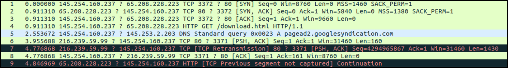

# Introduction

In this room, we will cover advanced features of TShark by focusing on translating Wireshark GUI features to the TShark CLI and investigate events of interest.

# Command-Line Wireshark Features I | Statistics I

At the beginning of this module, we mentioned that TShark is considered a command line version of Wireshark. In addition to sharing the same display filters, TShark can accomplish several features of Wireshark explained below.

Three important points when using Wireshark-like features:

-   These options are applied to all packets in scope unless a display filter is provided.
-   Most of the commands shown below are CLI versions of the Wireshark features discussed in Wireshark: Packet Operations (Task 2).
-   TShark explains the parameters used at the beginning of the output line.
    -   For example, you will use the `phs` option to view the protocol hierarchy. Once you use this command, the result will start with the "Packet Hierarchy Statistics" header.

<table class="table table-bordered"><tbody><tr><td><b>Parameter</b></td><td><b>Purpose</b></td></tr><tr><td>--color</td><td style="text-align:left"><ul><li>Wireshark-like colourised output.</li><li><code>tshark --color</code></li></ul></td></tr><tr><td>-z</td><td style="text-align:left"><ul><li>Statistics</li><li>There are multiple options available under this parameter. You can view the available filters under this parameter with:</li><ul><li><code>tshark -z help</code></li></ul><li>Sample usage.</li><ul><li><code>tshark -z filter</code></li></ul><li>Each time you filter the statistics, packets are shown first, then the statistics provided. You can suppress packets and focus on the statistics by using the <code>-q</code> parameter.</li></ul></td></tr></tbody></table>

## Colourised Output

TShark can provide colourised outputs to help analysts speed up the analysis and spot anomalies quickly. If you are more of a Wireshark person and feel the need for a Wireshark-style packet highlighting this option does that. The colour option is activated with the `--color` parameter, as shown below.

`user@ubuntu$ tshark -r colour.pcap --color`


## Statistics | Protocol Hierarchy

Protocol hierarchy helps analysts to see the protocols used, frame numbers, and size of packets in a tree view based on packet numbers. As it provides a summary of the capture, it can help analysts decide the focus point for an event of interest. Use the -z io,phs -q parameters to view the protocol hierarchy.

```
           
user@ubuntu$ tshark -r demo.pcapng -z io,phs -q
===================================================================
Protocol Hierarchy Statistics
Filter: 

  eth                                    frames:43 bytes:25091
    ip                                   frames:43 bytes:25091
      tcp                                frames:41 bytes:24814
        http                             frames:4 bytes:2000
          data-text-lines                frames:1 bytes:214
            tcp.segments                 frames:1 bytes:214
          xml                            frames:1 bytes:478
            tcp.segments                 frames:1 bytes:478
      udp                                frames:2 bytes:277
        dns                              frames:2 bytes:277
===================================================================
```        

After viewing the entire packet tree, you can focus on a specific protocol as shown below. Add the `udp` keyword to the filter to focus on the UDP protocol.      

``` 
user@ubuntu$ tshark -r demo.pcapng -z io,phs,udp -q
===================================================================
Protocol Hierarchy Statistics
Filter: udp

  eth                                    frames:2 bytes:277
    ip                                   frames:2 bytes:277
      udp                                frames:2 bytes:277
        dns                              frames:2 bytes:277
===================================================================
```

Statistics | Packet Lengths Tree

The packet lengths tree view helps analysts to overview the general distribution of packets by size in a tree view. It allows analysts to detect anomalously big and small packets at a glance! Use the `-z plen,tree -q` parameters to view the packet lengths tree.

```
user@ubuntu$ tshark -r demo.pcapng -z plen,tree -q

=========================================================================================================================
Packet Lengths:
Topic / Item       Count     Average       Min val       Max val     Rate (ms)     Percent     Burst rate    Burst start  
-------------------------------------------------------------------------------------------------------------------------
Packet Lengths     43        583.51        54            1484        0.0014        100         0.0400        2.554        
 0-19              0         -             -             -           0.0000        0.00        -             -            
 20-39             0         -             -             -           0.0000        0.00        -             -            
 40-79             22        54.73         54            62          0.0007        51.16       0.0200        0.911        
 80-159            1         89.00         89            89          0.0000        2.33        0.0100        2.554        
 160-319           2         201.00        188           214         0.0001        4.65        0.0100        2.914        
 320-639           2         505.50        478           533         0.0001        4.65        0.0100        0.911        
 640-1279          1         775.00        775           775         0.0000        2.33        0.0100        2.984        
 1280-2559         15        1440.67       1434          1484        0.0005        34.88       0.0200        2.554        
 2560-5119         0         -             -             -           0.0000        0.00        -             -            
 5120 and greater  0         -             -             -           0.0000        0.00        -             -        

```

## Statistics | Endpoints

The endpoint statistics view helps analysts to overview the unique endpoints. It also shows the number of packets associated with each endpoint. If you are familiar with Wireshark, you should know that endpoints can be viewed in multiple formats. Similar to Wireshark, TShark supports multiple source filtering options for endpoint identification. Use the `-z endpoints,ip -q` parameters to view IP endpoints. Note that you can choose other available protocols as well.

Filters for the most common viewing options are explained below.

<table class="table table-bordered"><tbody><tr><td><b>Filter</b></td><td><b>Purpose</b></td></tr><tr><td>eth</td><td><ul><li style="text-align:left">Ethernet addresses</li></ul></td></tr><tr><td>ip</td><td><ul><li style="text-align:left">IPv4 addresses</li></ul></td></tr><tr><td>ipv6</td><td style="text-align:left"><ul><li>IPv6 addresses</li></ul></td></tr><tr><td><span data-testid="glossary-term" class="glossary-term">tcp</span></td><td><ul><li style="text-align:left"><span data-testid="glossary-term" class="glossary-term">TCP</span> addresses</li><li style="text-align:left">Valid for both IPv4 and IPv6</li></ul></td></tr><tr><td><span data-testid="glossary-term" class="glossary-term">udp</span></td><td><ul><li style="text-align:left"><span data-testid="glossary-term" class="glossary-term">UDP</span> addresses</li><li style="text-align:left">Valid for both IPv4 and IPv6</li></ul></td></tr><tr><td>wlan</td><td><ul><li style="text-align:left">IEEE 802.11 addresses</li></ul></td></tr></tbody></table>

```           
user@ubuntu$ tshark -r demo.pcapng -z endpoints,ip -q
================================================================================
IPv4 Endpoints
Filter:
                       |  Packets  | |  Bytes  | | Tx Packets | | Tx Bytes | | Rx Packets | | Rx Bytes |
145.254.160.237               43         25091         20            2323          23           22768   
65.208.228.223                34         20695         18           19344          16            1351   
216.239.59.99                  7          4119          4            3236           3             883   
145.253.2.203                  2           277          1             188           1              89   
================================================================================
```

## Statistics | Conversations

The conversations view helps analysts to overview the traffic flow between two particular connection points. Similar to endpoint filtering, conversations can be viewed in multiple formats. This filter uses the same parameters as the "Endpoints" option. Use the `-z conv,ip -q` parameters to view IP conversations.

```
           
user@ubuntu$ tshark -r demo.pcapng -z conv,ip -q  
================================================================================
IPv4 Conversations
Filter:
                                           |       <-      | |       ->      | |     Total     |    Relative    |   Duration
                                           | Frames  Bytes | | Frames  Bytes | | Frames  Bytes |      Start     |             
65.208.228.223   <-> 145.254.160.237           16      1351      18     19344      34     20695     0.000000000        30.3937
145.254.160.237  <-> 216.239.59.99              4      3236       3       883       7      4119     2.984291000         1.7926
145.253.2.203    <-> 145.254.160.237            1        89       1       188       2       277     2.553672000         0.3605
================================================================================
```

## Statistics | Expert Info

The expert info view helps analysts to view the automatic comments provided by Wireshark. If you are unfamiliar with the "Wireshark Expert Info", visit task 4 in the Wireshark: The Basics room of the Wireshark module. Use the `-z expert -q` parameters to view the expert information.

```
user@ubuntu$ tshark -r demo.pcapng -z expert -q

Notes (3)
=============
   Frequency      Group           Protocol  Summary
           1   Sequence                TCP  This frame is a (suspected) spurious retransmission
           1   Sequence                TCP  This frame is a (suspected) retransmission
           1   Sequence                TCP  Duplicate ACK (#1)

Chats (8)
=============
   Frequency      Group           Protocol  Summary
           1   Sequence                TCP  Connection establish request (SYN): server port 80
           1   Sequence                TCP  Connection establish acknowledge (SYN+ACK): server port 80
           1   Sequence               HTTP  GET /download.html HTTP/1.1\r\n
           1   Sequence               HTTP  GET /pagead/ads?client=ca-pub-2309191948673629&random=1084443430285&lmt=1082467020
           2   Sequence               HTTP  HTTP/1.1 200 OK\r\n
           2   Sequence                TCP  Connection finish (FIN)
```

## Q & A

Q1 Use the "write-demo.pcap" to answer the questions.
    What is the byte value of the TCP protocol?

A1 62

```
ubuntu@ip-10-10-18-23:~/Desktop/exercise-files$ tshark -r write-demo.pcap -z io,phs,tcp -q

===================================================================
Protocol Hierarchy Statistics
Filter: tcp

eth                                      frames:1 bytes:62
  ip                                     frames:1 bytes:62
    tcp                                  frames:1 bytes:62
===================================================================
```

Q2 In which packet lengths row is our packet listed?

A2 40-79

```
ubuntu@ip-10-10-18-23:~/Desktop/exercise-files$ tshark -r write-demo.pcap -z plen,tree -q

==================================================================================================================================
Packet Lengths:
Topic / Item       Count         Average       Min val       Max val       Rate (ms)     Percent       Burst rate    Burst start  
----------------------------------------------------------------------------------------------------------------------------------
Packet Lengths     1             62.00         62            62                          100%          0.0100        0.000        
 0-19              0             -             -             -                           0.00%         -             -            
 20-39             0             -             -             -                           0.00%         -             -            
 40-79             1             62.00         62            62                          100.00%       0.0100        0.000        
 80-159            0             -             -             -                           0.00%         -             -            
 160-319           0             -             -             -                           0.00%         -             -            
 320-639           0             -             -             -                           0.00%         -             -            
 640-1279          0             -             -             -                           0.00%         -             -            
 1280-2559         0             -             -             -                           0.00%         -             -            
 2560-5119         0             -             -             -                           0.00%         -             -            
 5120 and greater  0             -             -             -                           0.00%         -             -            

----------------------------------------------------------------------------------------------------------------------------------
```

Q3 What is the summary of the expert info?

A3 Connection establish request (SYN): server port 80

```
ubuntu@ip-10-10-18-23:~/Desktop/exercise-files$ tshark -r write-demo.pcap -z expert -q

Chats (1)
=============
   Frequency      Group           Protocol  Summary
           1   Sequence                TCP  Connection establish request (SYN): server port 80

```

Q4  Use the "demo.pcapng" to answer the question.
    List the communications. What is the IP address that exists in all IPv4 conversations?
    Enter your answer in defanged format.

A4 145[.]254[.]160[.]237

```
ubuntu@ip-10-10-18-23:~/Desktop/exercise-files$ tshark -r demo.pcapng -z conv,ip -q
================================================================================
IPv4 Conversations
Filter:<No Filter>
                                               |       <-      | |       ->      | |     Total     |    Relative    |   Duration   |
                                               | Frames  Bytes | | Frames  Bytes | | Frames  Bytes |      Start     |              |
65.208.228.223       <-> 145.254.160.237           16      1351      18     19344      34     20695     0.000000000        30.3937
145.254.160.237      <-> 216.239.59.99              4      3236       3       883       7      4119     2.984291000         1.7926
145.253.2.203        <-> 145.254.160.237            1        89       1       188       2       277     2.553672000         0.3605
================================================================================
```


# Command-Line Wireshark Features II | Statistics II

There are plenty of filters designed for multiple protocols. The common filtering options for specific protocols are explained below. Note that most of the commands shown below are CLI versions of the Wireshark features discussed in Wireshark: Packet Operations (Task 3)


## Statistics | IPv4 and IPv6

This option provides statistics on IPv4 and IPv6 packets, as shown below. Having the protocol statistics helps analysts to overview packet distribution according to the protocol type. You can filter the available protocol types and view the details using the `-z ptype,tree -q` parameters.

```
           
user@ubuntu$ tshark -r demo.pcapng -z ptype,tree -q
==========================================================================================================================
IPv4 Statistics/IP Protocol Types:
Topic / Item       Count         Average       Min val       Max val Rate (ms)     Percent       Burst rate    Burst start  
--------------------------------------------------------------------------------------------------------------------------
IP Protocol Types  43                                                0.0014        100          0.0400        2.554        
 TCP               41                                                0.0013        95.35        0.0300        0.911        
 UDP               2                                                 0.0001        4.65         0.0100        2.554        
--------------------------------------------------------------------------------------------------------------------------
```

Having the summary of the hosts in a single view is useful as well. Especially when you are working with large captures, viewing all hosts with a single command can help you to detect an anomalous host at a glance. You can filter all IP addresses using the parameters given below.

-    IPv4: `-z ip_hosts,tree -q`
-    IPv6: `-z ipv6_hosts,tree -q`

```
user@ubuntu$ tshark -r demo.pcapng -z ip_hosts,tree -q
===========================================================================================================================
IPv4 Statistics/All Addresses:
Topic / Item      Count         Average       Min val       Max val  Rate (ms)     Percent       Burst rate    Burst start  
---------------------------------------------------------------------------------------------------------------------------
All Addresses     43                                                 0.0014        100          0.0400        2.554        
 145.254.160.237  43                                                 0.0014        100.00       0.0400        2.554        
 65.208.228.223   34                                                 0.0011        79.07        0.0300        0.911            
---------------------------------------------------------------------------------------------------------------------------
```

For complex cases and in-depth analysis, you will need to correlate the finding by focusing on the source and destination addresses. You can filter all source and destination addresses using the parameters given below.

-    IPv4: -z ip_srcdst,tree -q
-    IPv6: -z ipv6_srcdst,tree -q
        
```
           
user@ubuntu$ tshark -r demo.pcapng -z ip_srcdst,tree -q
==========================================================================================================================
IPv4 Statistics/Source and Destination Addresses:
Topic / Item                     Count         Average       Min val       Max val  Rate (ms)     Percent       Burst rate    Burst start  
--------------------------------------------------------------------------------------------------------------------------
Source IPv4 Addresses            43                                                 0.0014        100          0.0400              
 145.254.160.237                 20                                                 0.0007        46.51        0.0200               
 65.208.228.223                  18                                                 0.0006        41.86        0.0200
...                        
Destination IPv4 Addresses       43                                                 0.0014        100          0.0400             
 145.254.160.237                 23                                                 0.0008        53.49        0.0200             
 65.208.228.223                  16                                                 0.0005        37.21        0.0200
...                          
------------------------------------------------------------------------------------------------------------------------
```

n some cases, you will need to focus on the outgoing traffic to spot the used services and ports. You can filter all outgoing traffic by using the parameters given below.

-    IPv4: -z dests,tree -q
-    IPv6: -z ipv6_dests,tree -q

```
           
user@ubuntu$ tshark -r demo.pcapng -z dests,tree -q
=============================================================================================================================
IPv4 Statistics/Destinations and Ports:
Topic / Item            Count         Average       Min val       Max val       Rate (ms)     Percent       Burst rate    Burst start  
-----------------------------------------------------------------------------------------------------------------------------
Destinations and Ports  43                                                      0.0014        100          0.0400        2.554        
 145.254.160.237        23                                                      0.0008        53.49        0.0200        2.554        
  TCP                   22                                                      0.0007        95.65        0.0200        2.554        
   3372                 18                                                      0.0006        81.82        0.0200        2.554        
   3371                 4                                                       0.0001        18.18        0.0200        3.916        
  UDP                   1                                                       0.0000        4.35         0.0100        2.914        
   3009                 1                                                       0.0000        100.00       0.0100        2.914        
 65.208.228.223         16                                                      0.0005        37.21        0.0200        0.911        
 ...
-----------------------------------------------------------------------------------------------------------------------------
```

## Statistics | DNS

This option provides statistics on DNS packets by summarising the available info. You can filter the packets and view the details using the `-z dns,tree -q` parameters.  

```
           
user@ubuntu$ tshark -r demo.pcapng -z dns,tree -q
===========================================================================================================================
DNS:
Topic / Item                   Count         Average       Min val       Max val       Rate (ms)     Percent       Burst rate    Burst start  
---------------------------------------------------------------------------------------------------------------------------
Total Packets                  2                                             0.0055        100          0.0100        2.554        
 rcode                         2                                             0.0055        100.00       0.0100        2.554        
  No error                     2                                             0.0055        100.00       0.0100        2.554        
 opcodes                       2                                             0.0055        100.00       0.0100        2.554        
  Standard query               2                                             0.0055        100.00       0.0100        2.554                  
 ...
-------------------------------------------------------------------------------------------------------------------------
```

## Statistics | HTTP

This option provides statistics on HTTP packets by summarising the load distribution, requests, packets, and status info. You can filter the packets and view the details using the parameters given below.

-    Packet and status counter for HTTP: `-z http,tree -q`
-    Packet and status counter for HTTP2: `-z http2,tree -q`
-    Load distribution: `-z http_srv,tree -q`
-    Requests: `-z http_req,tree -q`
-    Requests and responses: `-z http_seq,tree -q`
                

```
           
user@ubuntu$ tshark -r demo.pcapng -z http,tree -q
=============================================================================================================================
HTTP/Packet Counter:
Topic / Item            Count         Average       Min val       Max val       Rate (ms)     Percent     Burst rate  Burst start  
----------------------------------------------------------------------------------------------------------------------------
Total HTTP Packets      4                                                       0.0010        100          0.0100     0.911        
 HTTP Response Packets  2                                                       0.0005        50.00        0.0100     3.956        
  2xx: Success          2                                                       0.0005        100.00       0.0100     3.956        
   200 OK               2                                                       0.0005        100.00       0.0100     3.956        
  ???: broken           0                                                       0.0000        0.00         -          -                     
  3xx: Redirection      0                                                       0.0000        0.00         -          -                    
 ...
-----------------------------------------------------------------------------------------------------------------------
```

## Q & A

Q1 Use the "demo.pcapng" to answer the questions.

Which IP address has 7 appearances?Enter your answer in defanged format.

A1  216[.]239[.]59[.]99

```
ubuntu@ip-10-10-50-70:~/Desktop/exercise-files$ tshark -r demo.pcapng -z ip_hosts,tree -q

=================================================================================================================================
IPv4 Statistics/All Addresses:
Topic / Item      Count         Average       Min val       Max val       Rate (ms)     Percent       Burst rate    Burst start  
---------------------------------------------------------------------------------------------------------------------------------
All Addresses     43                                                      0.0014        100%          0.0400        2.554        
 145.254.160.237  43                                                      0.0014        100.00%       0.0400        2.554        
 65.208.228.223   34                                                      0.0011        79.07%        0.0300        0.911        
 216.239.59.99    7                                                       0.0002        16.28%        0.0300        3.916        
 145.253.2.203    2                                                       0.0001        4.65%         0.0100        2.554        

---------------------------------------------------------------------------------------------------------------------------------
```

Q2 What is the "destination address percentage" of the previous IP address?

A2 6.98%

```
ubuntu@ip-10-10-50-70:~/Desktop/exercise-files$ tshark -r demo.pcapng -z dests,tree -q

=======================================================================================================================================
IPv4 Statistics/Destinations and Ports:
Topic / Item            Count         Average       Min val       Max val       Rate (ms)     Percent       Burst rate    Burst start  
---------------------------------------------------------------------------------------------------------------------------------------
Destinations and Ports  43                                                      0.0014        100%          0.0400        2.554        
 145.254.160.237        23                                                      0.0008        53.49%        0.0200        2.554        
  TCP                   22                                                      0.0007        95.65%        0.0200        2.554        
   3372                 18                                                      0.0006        81.82%        0.0200        2.554        
   3371                 4                                                       0.0001        18.18%        0.0200        3.916        
  UDP                   1                                                       0.0000        4.35%         0.0100        2.914        
   3009                 1                                                       0.0000        100.00%       0.0100        2.914        
 65.208.228.223         16                                                      0.0005        37.21%        0.0200        0.911        
  TCP                   16                                                      0.0005        100.00%       0.0200        0.911        
   80                   16                                                      0.0005        100.00%       0.0200        0.911        
 216.239.59.99          3                                                       0.0001        6.98%         0.0100        2.984        
  TCP                   3                                                       0.0001        100.00%       0.0100        2.984        
   80                   3                                                       0.0001        100.00%       0.0100        2.984        
 145.253.2.203          1                                                       0.0000        2.33%         0.0100        2.554        
  UDP                   1                                                       0.0000        100.00%       0.0100        2.554        
   53                   1                                                       0.0000        100.00%       0.0100        2.554        

---------------------------------------------------------------------------------------------------------------------------------------
```

Q3  Which IP address constitutes "2.33% of the destination addresses"?
Enter your answer in defanged format.

A3 145[.]253[.]2[.]203 

Q4 What is the average "Qname Len" value?
        
A4 29.00

```
ubuntu@ip-10-10-50-70:~/Desktop/exercise-files$ tshark -r demo.pcapng -z dns,tree -q

==============================================================================================================================================
DNS:
Topic / Item                   Count         Average       Min val       Max val       Rate (ms)     Percent       Burst rate    Burst start  
----------------------------------------------------------------------------------------------------------------------------------------------
Total Packets                  2                                                       0.0055        100%          0.0100        2.554        
 rcode                         2                                                       0.0055        100.00%       0.0100        2.554        
  No error                     2                                                       0.0055        100.00%       0.0100        2.554        
 opcodes                       2                                                       0.0055        100.00%       0.0100        2.554        
  Standard query               2                                                       0.0055        100.00%       0.0100        2.554        
 Query/Response                2                                                       0.0055        100.00%       0.0100        2.554        
  Response                     1                                                       0.0028        50.00%        0.0100        2.914        
  Query                        1                                                       0.0028        50.00%        0.0100        2.554        
 Query Type                    2                                                       0.0055        100.00%       0.0100        2.554        
  A (Host Address)             2                                                       0.0055        100.00%       0.0100        2.554        
 Class                         2                                                       0.0055        100.00%       0.0100        2.554        
  IN                           2                                                       0.0055        100.00%       0.0100        2.554        
Payload size                   2             96.50         47            146           0.0055        100%          0.0100        2.554        
Query Stats                    0                                                       0.0000        100%          -             -            
 Qname Len                     1             29.00         29            29            0.0028                      0.0100        2.554        
 Label Stats                   0                                                       0.0000                      -             -            
  3rd Level                    1                                                       0.0028                      0.0100        2.554        
  4th Level or more            0                                                       0.0000                      -             -            
  2nd Level                    0                                                       0.0000                      -             -            
  1st Level                    0                                                       0.0000                      -             -            
Response Stats                 0                                                       0.0000        100%          -             -            
 no. of questions              2             1.00          1             1             0.0055                      0.0200        2.914        
 no. of authorities            2             0.00          0             0             0.0055                      0.0200        2.914        
 no. of answers                2             4.00          4             4             0.0055                      0.0200        2.914        
 no. of additionals            2             0.00          0             0             0.0055                      0.0200        2.914        
Service Stats                  0                                                       0.0000        100%          -             -            
 request-response time (secs)  1             0.36          0.360518      0.360518      0.0028                      0.0100        2.914        
 no. of unsolicited responses  0                                                       0.0000                      -             -            
 no. of retransmissions        0                                                       0.0000                      -             -            

----------------------------------------------------------------------------------------------------------------------------------------------
```


# Command-Line Wireshark Features III | Streams, Objects and Credentials


There are plenty of filters designed for multiple purposes. The common filtering options for specific operations are explained below. Note that most of the commands shown below are CLI versions of the Wireshark features discussed in the Wireshark module

## Follow Stream

This option helps analysts to follow traffic streams similar to Wireshark. The query structure is explained in the table given below.

<table class="table table-bordered">
    <tbody>
        <tr>
            <td><b>Main Parameter</b></td>
            <td><b>Protocol</b></td>
            <td><b>View Mode</b></td>
            <td><b>Stream Number</b></td>
            <td><b>Additional Parameter</b></td>
        </tr>
        <tr>
            <td>-z follow</td>
            <td>
                <ul style="display:inline-block;padding-left:0;margin-bottom:0">
                    <li style="text-align:left"><span data-testid="glossary-term" class="glossary-term">TCP</span></li>
                    <li style="text-align:left"><span data-testid="glossary-term" class="glossary-term">UDP</span></li>
                    <li style="text-align:left"><span data-testid="glossary-term" class="glossary-term">HTTP</span></li>
                    <li style="text-align:left">HTTP2</li>
                </ul>
            </td>
            <td>
                <ul style="display:inline-block;padding-left:0;margin-bottom:0">
                    <li style="text-align:left">HEX</li>
                    <li style="text-align:left">ASCII</li>
                </ul>
            </td>
            <td>0 | 1 | 2 | 3 ...</td>
            <td>-q</td>
        </tr>
    </tbody>
</table>

Note: Streams start from "0". You can filter the packets and follow the streams by using the parameters given below.

-    TCP Streams: `-z follow,tcp,ascii,0 -q`
-    UDP Streams: `-z follow,udp,ascii,0 -q`
-    HTTP Streams: `-z follow,http,ascii,0 -q`

```
           
user@ubuntu$ tshark -r demo.pcapng -z follow,tcp,ascii,1 -q
===================================================================
Follow: tcp,ascii
Filter: tcp.stream eq 1
Node 0: 145.254.160.237:3371
Node 1: 216.239.59.99:80
GET /pagead/ads?client=ca-pub-2309191948673629&random=1084443430285&lmt=1082467020&format=468x60_as&outp...
Host: pagead2.googlesyndication.com
User-Agent: Mozilla/5.0 (Windows; U; Windows NT 5.1; en-US; rv:1.6) Gecko/20040113
...

HTTP/1.1 200 OK
P3P: policyref="http://www.googleadservices.com/pagead/p3p.xml", CP="NOI DEV PSA PSD IVA PVD OTP OUR OTR IND OTC"
Content-Type: text/html; charset=ISO-8859-1
Content-Encoding: gzip
Server: CAFE/1.0
Cache-control: private, x-gzip-ok=""
Content-length: 1272
Date: Thu, 13 May 2004 10:17:14 GMT

...mmU.x..o....E1...X.l.(.AL.f.....dX..KAh....Q....D...'.!...Bw..{.Y/T...<...GY9J....?;.ww...Ywf..... >6..Ye.X..H_@.X.YM.......#:.....D..~O..STrt..,4....H9W..!E.....&.X.=..P9..a...<...-.O.l.-m....h..p7.(O?.a..:..-knhie...
..g.A.x..;.M..6./...{..9....H.W.a.qz...O.....B..
===================================================================
```

## Export Objects

This option helps analysts to extract files from DICOM, HTTP, IMF, SMB and TFTP. The query structure is explained in the table given below.

<table class="table table-bordered">
    <tbody>
        <tr>
            <td><b>Main Parameter</b></td>
            <td><b>Protocol</b></td>
            <td><b>Target Folder</b></td>
            <td><b>Additional Parameter</b></td>
        </tr>
        <tr>
            <td>--export-objects</td>
            <td>
                <ul style="display:inline-block;padding-left:0;margin-bottom:0">
                    <li style="text-align:left">DICOM</li>
                    <li style="text-align:left"><span data-testid="glossary-term" class="glossary-term">HTTP</span></li>
                    <li style="text-align:left">IMF</li>
                    <li style="text-align:left"><span data-testid="glossary-term" class="glossary-term">SMB</span></li>
                    <li style="text-align:left">TFTP</li>
                </ul>
            </td>
            <td>Target folder to save the files.</td>
            <td>-q</td>
        </tr>
    </tbody>
</table>
        
You can filter the packets and follow the streams by using the parameters given below.

-  `--export-objects http,/home/ubuntu/Desktop/extracted-by-tshark -q`

```
           
# Extract the files from HTTP traffic.
user@ubuntu$ tshark -r demo.pcapng --export-objects http,/home/ubuntu/Desktop/extracted-by-tshark -q

# view the target folder content.
user@ubuntu$ ls -l /home/ubuntu/Desktop/extracted-by-tshark/
total 24
-rw-r--r-- 1 ubuntu ubuntu  'ads%3fclient=ca-pub-2309191948673629&random=1084443430285&lmt=1082467020&format=468x60_as&o
-rw-r--r-- 1 ubuntu ubuntu download.html
```

## Credentials

This option helps analysts to detect and collect cleartext credentials from FTP, HTTP, IMAP, POP and SMTP. You can filter the packets and find the cleartext credentials using the parameters below.

-    -z credentials -q 

```
           
user@ubuntu$ tshark -r credentials.pcap -z credentials -q
===================================================================
Packet     Protocol         Username         Info            
------     --------         --------         --------
72         FTP              admin            Username in packet: 37
80         FTP              admin            Username in packet: 47
83         FTP              admin            Username in packet: 54
118        FTP              admin            Username in packet: 93
123        FTP              admin            Username in packet: 97
167        FTP              administrator    Username in packet: 133
207        FTP              administrator    Username in packet: 170
220        FTP              administrator    Username in packet: 184
230        FTP              administrator    Username in packet: 193
....
===================================================================
```

## Q & A

Q1 Use the "demo.pcapng" to answer the questions.
   Follow the "UDP stream 0".
   What is the "Node 0" value?
   Enter your answer in defanged format.

A1 145[.]254[.]160[.]237:3009

```
ubuntu@ip-10-10-50-70:~/Desktop/exercise-files$ tshark -r demo.pcapng -z follow,udp,ascii,0 -q

===================================================================
Follow: udp,ascii
Filter: udp.stream eq 0
Node 0: 145.254.160.237:3009
Node 1: 145.253.2.203:53
47
.#...........pagead2.googlesyndication.com.....
	146
.#...........pagead2.googlesyndication.com..................pagead2.google.&.;.......z...pagead.google.akadns.net..X.......{....;h.X.......{....;c
===================================================================
```

Q2  Follow the "HTTP stream 1".
    What is the "Referer" value?
    Enter your answer in defanged format.

A2 hxxp[://]www[.]ethereal[.]com/download[.]html

```
ubuntu@ip-10-10-50-70:~/Desktop/exercise-files$ tshark -r demo.pcapng -z follow,http,ascii,1 -q

===================================================================
Follow: http,ascii
Filter: tcp.stream eq 1
Node 0: 145.254.160.237:3371
Node 1: 216.239.59.99:80
721
GET /pagead/ads?client=ca-pub-2309191948673629&random=1084443430285&lmt=1082467020&format=468x60_as&output=html&url=http%3A%2F%2Fwww.ethereal.com%2Fdownload.html&color_bg=FFFFFF&color_text=333333&color_link=000000&color_url=666633&color_border=666633 HTTP/1.1
Host: pagead2.googlesyndication.com
User-Agent: Mozilla/5.0 (Windows; U; Windows NT 5.1; en-US; rv:1.6) Gecko/20040113
Accept: text/xml,application/xml,application/xhtml+xml,text/html;q=0.9,text/plain;q=0.8,image/png,image/jpeg,image/gif;q=0.2,*/*;q=0.1
Accept-Language: en-us,en;q=0.5
Accept-Encoding: gzip,deflate
Accept-Charset: ISO-8859-1,utf-8;q=0.7,*;q=0.7
Keep-Alive: 300
Connection: keep-alive
Referer: http://www.ethereal.com/download.html


	318
HTTP/1.1 200 OK
P3P: policyref="http://www.googleadservices.com/pagead/p3p.xml", CP="NOI DEV PSA PSD IVA PVD OTP OUR OTR IND OTC"
Content-Type: text/html; charset=ISO-8859-1
Content-Encoding: gzip
Server: CAFE/1.0
Cache-control: private, x-gzip-ok=""
Content-length: 1272
Date: Thu, 13 May 2004 10:17:14 GMT


	3608
<html><head><style><!--
.ch{cursor:pointer;cursor:hand}a.ad:link { color: #000000 }a.ad:visited { color: #000000 }a.ad:hover { color: #000000 }a.ad:active { color: #000000 }a.search:link { color: #ffffff }a.search:visited { color: #ffffff }a.search:hover { color: #ffffff }a.search:active { color: #ffffff }a.attribution:link { color: #ffffff }a.attribution:visited { color: #ffffff }a.attribution:hover { color: #ffffff }a.attribution:active { color: #ffffff }  //--></style><script><!--
function ss(w,id) {window.status = w;return true;}function cs(){window.status='';}function ca(a){ top.location.href=document.getElementById(a).href;}function ga(o,e) {if (document.getElementById) {a=o.id.substring(1);p = "";r = "";g = e.target;if (g) {t = g.id;f = g.parentNode;if (f) {p = f.id;h = f.parentNode;if (h)r = h.id;}} else {h = e.srcElement;f = h.parentNode;if (f)p = f.id;t = h.id;}if (t==a || p==a || r==a)return true;top.location.href=document.getElementById(a).href}}//--></script></head><body bgColor="#ffffff" leftMargin="0" topMargin="0" marginwidth="0" marginheight="0"><table width="468" height="60" cellspacing="1" cellpadding="0" border="0" bgcolor="#666633"><tr><td><table width="466" height="58" cellspacing="0" cellpadding="1" border="0" bgcolor="#ffffff"><tr><td colspan="2" width="" height=""><table width="464" height="" cellspacing="0" cellpadding="2" border="0"><tr><td  id="taw0" class="ch" width="229" height="41" align="left" valign="top" onFocus="ss('go to www.servforce.com/','aw0')" onMouseOver="ss('go to www.servforce.com/','aw0')"  onMouseOut="cs()" onClick="ga(this,event)"><font style="font-size:11px; font-family:verdana,arial,sans-serif;"><a class="ad" id="aw0" target="_top" href="/pagead/adclick?sa=l&ai=AJdkfqs0oAFcks0ogAJe2QG8DQK-7B87m4zYAA34tB4TAGTf9BAA0GOQACEA5RAAA3d3duUGdoVmclFGbuM2btBAN2gDe2AzXhNHAAA&num=1&adurl=http://www.servforce.com/%3Frefer%3Dgoogle1&client=ca-pub-2309191948673629" onFocus="ss('go to www.servforce.com/','aw0')" onMouseOver="return ss('go to www.servforce.com/','aw0')"  onMouseOut="cs()"><b>ServForce</b></a></font><br><font style="font-size:10px; font-family:verdana,arial,sans-serif; color:#333333">Dedicated Servers - $75/mo &amp; up 1TB Xfer only $100 </font></td><td  id="taw1" class="ch" width="229" height="41" align="left" valign="top" onFocus="ss('go to Linux.ITtoolbox.com','aw1')" onMouseOver="ss('go to Linux.ITtoolbox.com','aw1')"  onMouseOut="cs()" onClick="ga(this,event)"><font style="font-size:11px; font-family:verdana,arial,sans-serif;"><a class="ad" id="aw1" target="_top" href="/pagead/adclick?sa=l&ai=AOKPbqs0oAFcks0ogAJe2QG8D5quyFMvgm3YAA34tB4jAGTf9BAA0GOQACIA5RAAA3d3duUGdoVmclFGbuM2btBAN2gDe2AzXhNHAAA&num=2&adurl=http://linux.ittoolbox.com/groups/groups.asp%3Fv%3DREDHAT-L&client=ca-pub-2309191948673629" onFocus="ss('go to Linux.ITtoolbox.com','aw1')" onMouseOver="return ss('go to Linux.ITtoolbox.com','aw1')"  onMouseOut="cs()"><b>Red Hat Discussion</b></a></font><br><font style="font-size:10px; font-family:verdana,arial,sans-serif; color:#333333">Free E-mail Based Support Red Hat Discussion Group </font></td></tr></table></td></tr><tr><td nowrap width="1%" height="11" bgcolor="#666633"></td><td nowrap width="99%" height="11" align="right" bgcolor="#666633"><a class="attribution" href="/pagead/userfeedback?url=http://www.ethereal.com/download.html&hl=en&adU=www.servforce.com/&adT=ServForce&adU=Linux.ITtoolbox.com&adT=Red+Hat+Discussion&done=1" target="_blank"><font style="font-size:10px; font-family:verdana,arial,sans-serif;">Ads by Google</font></a></td></tr></table></td></tr></table></body></html>
===================================================================
```

Q3  Use the "credentials.pcap" to answer the question.
    What is the total number of detected credentials?

A3 75

```
ubuntu@ip-10-10-50-70:~/Desktop/exercise-files$ tshark -r credentials.pcap -z credentials -q | nl
     1	===================================================================
     2	Packet     Protocol         Username         Info            
     3	------     --------         --------         --------
     4	72         FTP              admin            Username in packet: 37
     5	80         FTP              admin            Username in packet: 47
     6	83         FTP              admin            Username in packet: 54
     7	118        FTP              admin            Username in packet: 93
     8	123        FTP              admin            Username in packet: 97
     9	129        FTP              admin            Username in packet: 101
    10	136        FTP              admin            Username in packet: 106
    11	150        FTP              admin            Username in packet: 115
    12	156        FTP              admin            Username in packet: 120
    13	167        FTP              administrator    Username in packet: 133
    14	207        FTP              administrator    Username in packet: 170
    15	220        FTP              administrator    Username in packet: 184
    16	230        FTP              administrator    Username in packet: 193
    17	250        FTP              administrator    Username in packet: 222
    18	264        FTP              administrator    Username in packet: 235
    19	274        FTP              administrator    Username in packet: 243
    20	286        FTP              administrator    Username in packet: 254
    21	288        FTP              administrator    Username in packet: 258
    22	305        FTP              administrator    Username in packet: 276
    23	312        FTP              administrator    Username in packet: 279
    24	349        FTP              administrator    Username in packet: 314
    25	353        FTP              administrator    Username in packet: 317
    26	370        FTP              administrator    Username in packet: 337
    27	390        FTP              administrator    Username in packet: 362
    28	398        FTP              administrator    Username in packet: 375
    29	409        FTP              administrator    Username in packet: 379
    30	434        FTP              administrator    Username in packet: 400
    31	438        FTP              administrator    Username in packet: 407
    32	444        FTP              administrator    Username in packet: 414
    33	449        FTP              administrator    Username in packet: 422
    34	483        FTP              administrator    Username in packet: 447
    35	491        FTP              administrator    Username in packet: 466
    36	507        FTP              administrator    Username in packet: 476
    37	530        FTP              administrator    Username in packet: 495
    38	533        FTP              administrator    Username in packet: 499
    39	540        FTP              administrator    Username in packet: 512
    40	579        FTP              administrator    Username in packet: 547
    41	586        FTP              administrator    Username in packet: 555
    42	598        FTP              administrator    Username in packet: 566
    43	606        FTP              administrator    Username in packet: 573
    44	620        FTP              administrator    Username in packet: 595
    45	635        FTP              administrator    Username in packet: 604
    46	650        FTP              administrator    Username in packet: 616
    47	659        FTP              administrator    Username in packet: 622
    48	673        FTP              administrator    Username in packet: 639
    49	679        FTP              administrator    Username in packet: 646
    50	705        FTP              administrator    Username in packet: 676
    51	728        FTP              administrator    Username in packet: 693
    52	731        FTP              administrator    Username in packet: 702
    53	750        FTP              administrator    Username in packet: 718
    54	755        FTP              administrator    Username in packet: 726
    55	773        FTP              administrator    Username in packet: 745
    56	786        FTP              administrator    Username in packet: 752
    57	802        FTP              administrator    Username in packet: 770
    58	810        FTP              administrator    Username in packet: 776
    59	831        FTP              administrator    Username in packet: 798
    60	833        FTP              administrator    Username in packet: 804
    61	857        FTP              administrator    Username in packet: 826
    62	873        FTP              administrator    Username in packet: 841
    63	889        FTP              administrator    Username in packet: 859
    64	910        FTP              administrator    Username in packet: 875
    65	916        FTP              administrator    Username in packet: 882
    66	927        FTP              administrator    Username in packet: 894
    67	935        FTP              administrator    Username in packet: 908
    68	948        FTP              administrator    Username in packet: 920
    69	971        FTP              administrator    Username in packet: 938
    70	987        FTP              administrator    Username in packet: 953
    71	993        FTP              administrator    Username in packet: 960
    72	1010       FTP              administrator    Username in packet: 981
    73	1037       FTP              administrator    Username in packet: 1006
    74	1045       FTP              administrator    Username in packet: 1017
    75	1051       FTP              administrator    Username in packet: 1020
    76	1065       FTP              administrator    Username in packet: 1035
    77	1076       FTP              administrator    Username in packet: 1044
    78	1087       FTP              administrator    Username in packet: 1061
    79	===================================================================
```


# Advanced Filtering Options | Contains, Matches and Fields

Advanced Filtering Options | Contains, Matches and Extract Fields

Accomplishing in-depth packet analysis sometimes ends up with a special filtering requirement that cannot be covered with default filters. TShark supports Wireshark's "contains" and "matches" operators, which are the key to the advanced filtering options. You can visit the Wireshark: Packet Operations room (Task 6) if you are unfamiliar with these filters. 

A quick recap from the Wireshark: Packet Operations room:

<table class="table table-bordered">
    <tbody>
        <tr>
            <td><b>Filter</b></td>
            <td><b>Details</b></td>
        </tr>
        <tr>
            <td><b>Contains</b></td>
            <td>
                <ul style="margin-bottom:0">
                    <li style="text-align:left">Search a value inside packets.</li>
                    <li style="text-align:left">Case sensitive.</li>
                    <li style="text-align:left">Similar to Wireshark's "find" option.</li>
                </ul>
            </td>
        </tr>
        <tr>
            <td><b>Matches</b></td>
            <td>
                <ul style="margin-bottom:0">
                    <li style="text-align:left">Search a pattern inside packets.</li>
                    <li style="text-align:left">Supports regex.</li>
                    <li style="text-align:left">Case insensitive.</li>
                    <li style="text-align:left">Complex queries have a margin of error.</li>
                </ul>
            </td>
        </tr>
    </tbody>
</table>

<b>Note</b>: The "contains" and "matches" operators cannot be used with fields consisting of "integer" values.
Tip: Using HEX and regex values instead of ASCII always has a better chance of a match.

## Extract Fields

This option helps analysts to extract specific parts of data from the packets. In this way, analysts have the opportunity to collect and correlate various fields from the packets. It also helps analysts manage the query output on the terminal. The query structure is explained in the table given below.

<table class="table table-bordered">
    <tbody>
        <tr>
            <td><b>Main Filter</b></td>
            <td><b>Target Field</b></td>
            <td><b>Show Field Name</b></td>
        </tr>
        <tr>
            <td>-T fields</td>
            <td>-e &lt;field name&gt;</td>
            <td>-E header=y</td>
        </tr>
    </tbody>
</table>

<b>Note</b>: You need to use the -e parameter for each field you want to display.

You can filter any field by using the field names as shown below.

`-T fields -e ip.src -e ip.dst -E header=y`
```
           
user@ubuntu$ tshark -r demo.pcapng -T fields -e ip.src -e ip.dst -E header=y -c 5         
ip.src	ip.dst
145.254.160.237	65.208.228.223
65.208.228.223	145.254.160.237
145.254.160.237	65.208.228.223
145.254.160.237	65.208.228.223
65.208.228.223	145.254.160.237
```

## Filter: "contains"

<table class="table table-bordered">
    <tbody>
        <tr>
            <td><span style="font-weight:bolder">Filter</span><br></td>
            <td style="text-align:left"><span style="text-align:center"><span style="font-weight:bolder">contains</span></span><br></td>
        </tr>
        <tr>
            <td><span style="font-weight:bolder">Type</span></td>
            <td style="text-align:left"><span style="text-align:center">Comparison operator</span><br></td>
        </tr>
        <tr>
            <td><span style="font-weight:bolder">Description</span></td>
            <td style="text-align:left">Search a value inside packets. It is case-sensitive and provides similar functionality to the "Find" option by focusing on a specific field.<br></td>
        </tr>
        <tr>
            <td><span style="font-weight:bolder">Example</span></td>
            <td style="text-align:left">Find all "<span data-testid="glossary-term" class="glossary-term">Apache</span>" servers.<br></td>
        </tr>
        <tr>
            <td><span style="font-weight:bolder">Workflow</span></td>
            <td style="text-align:left">List all <span data-testid="glossary-term" class="glossary-term">HTTP</span> packets where the "server" field contains the "<span data-testid="glossary-term" class="glossary-term">Apache</span>" keyword.<br></td>
        </tr>
        <tr>
            <td><span style="font-weight:bolder">Usage</span></td>
            <td>
                <p style="text-align:left;margin-bottom:0"><code style="font-size:14px">http.server contains "Apache"</code><br></p>
            </td>
        </tr>
    </tbody>
</table>

```           
user@ubuntu$ tshark -r demo.pcapng -Y 'http.server contains "Apache"'                          
   38   4.846969 65.208.228.223 ? 145.254.160.237 HTTP/XML HTTP/1.1 200 OK 

user@ubuntu$ tshark -r demo.pcapng -Y 'http.server contains "Apache"' -T fields -e ip.src -e ip.dst -e http.server -E header=y
ip.src	ip.dst	http.server
65.208.228.223	145.254.160.237	Apache 
```

## Filter: "matches"

<table class="table table-bordered">
    <tbody>
        <tr>
            <td><span style="font-weight:bolder">Filter</span><br></td>
            <td style="text-align:left"><span style="text-align:center"><span style="font-weight:bolder">matches</span></span><br></td>
        </tr>
        <tr>
            <td><span style="font-weight:bolder">Type</span></td>
            <td style="text-align:left"><span style="text-align:center">Comparison operator</span><br></td>
        </tr>
        <tr>
            <td><span style="font-weight:bolder">Description</span></td>
            <td style="text-align:left">Search a pattern of a regular expression. It is case-insensitive, and complex queries have a margin of error.<br></td>
        </tr>
        <tr>
            <td><span style="font-weight:bolder">Example</span></td>
            <td style="text-align:left">Find all .<span data-testid="glossary-term" class="glossary-term">php</span> and .html pages.<br></td>
        </tr>
        <tr>
            <td><span style="font-weight:bolder">Workflow</span></td>
            <td style="text-align:left">List all&nbsp;<a class="piGtAY8A glossary-term"><span data-testid="glossary-term" class="glossary-term">HTTP</span></a>&nbsp;packets where the "request method" field matches the keywords "GET" or "POST".<br></td>
        </tr>
        <tr>
            <td><span style="font-weight:bolder">Usage</span></td>
            <td>
                <p style="text-align:left;margin-bottom:0"><code style="font-size:14px">http.request.method matches "(GET|POST)"</code><br></p>
            </td>
        </tr>
    </tbody>
</table>

```
           
user@ubuntu$ tshark -r demo.pcapng -Y 'http.request.method matches "(GET|POST)"'               
    4   0.911310 145.254.160.237 ? 65.208.228.223 HTTP GET /download.html HTTP/1.1 
   18   2.984291 145.254.160.237 ? 216.239.59.99 HTTP GET /pagead/ads?client=ca-pub-2309191948673629&random=1084443430285&

user@ubuntu$ tshark -r demo.pcapng -Y 'http.request.method matches "(GET|POST)"' -T fields -e ip.src -e ip.dst -e http.request.method -E header=y
ip.src	ip.dst	http.request.method
145.254.160.237	65.208.228.223	GET
145.254.160.237	216.239.59.99	GET 
```

## Q & A

Q1    Use the "demo.pcapng" to answer questions.
    What is the HTTP packet number that contains the keyword "CAFE"?

A1 27

```
ubuntu@ip-10-10-254-125:~/Desktop/exercise-files$ tshark -r demo.pcapng -Y 'http contains "CAFE"'
   27   3.955688 216.239.59.99 ? 145.254.160.237 HTTP 214 HTTP/1.1 200 OK  (text/html)
```


Q2    Filter the packets with "GET" and "POST" requests and extract the packet frame time.
    What is the first time value found?

A2 May 13, 2004 10:17:08.222534000 UTC

```
ubuntu@ip-10-10-254-125:~/Desktop/exercise-files$ tshark -r demo.pcapng -Y 'http.request.method matches "(GET|POST)"' -T fields -e frame.time
May 13, 2004 10:17:08.222534000 UTC
May 13, 2004 10:17:10.295515000 UTC
```
        


# Use Cases | Extract Information

## Use Cases

When investigating a case, a security analyst should know how to extract hostnames, DNS queries, and user agents to hunt low-hanging fruits after viewing the statistics and creating an investigation plan. The most common four use cases for every security analyst are demonstrated below. If you want to learn more about the mentioned protocols and benefits of the extracted info, please refer to the Wireshark Traffic Analysis room.


## Extract Hostnames
```
           
user@ubuntu$ tshark -r hostnames.pcapng -T fields -e dhcp.option.hostname     
92-rkd
92-rkd
T3400

T3400

60-alfb-sec2
60-alfb-sec2

aminott
...
```

The above example shows how to extract hostnames from DHCP packets with TShark. However, the output is hard to manage when multiple duplicate values exist. A skilled analyst should know how to use native Linux tools/utilities to manage and organise the command line output, as shown below.

```
           
user@ubuntu$ tshark -r hostnames.pcapng -T fields -e dhcp.option.hostname | awk NF | sort -r | uniq -c | sort -r
     26 202-ac
     18 92-rkd
     14 93-sts-sec
... 
```

Now the output is organised and ready to process/use. The logic of the query is explained below.

<table class="table table-bordered"><tbody><tr><td><b>Query</b></td><td><b>Purpose</b></td></tr><tr><td><p><code>tshark -r hostnames.pcapng -T fields -e dhcp.option.hostname&nbsp;</code><br></p></td><td style="text-align:left">Main query.<br>Extract the <span data-testid="glossary-term" class="glossary-term">DHCP</span> hostname value.</td></tr><tr><td><p><code>awk NF</code></p></td><td style="text-align:left">Remove empty lines.</td></tr><tr><td><p><code>sort -r</code></p></td><td style="text-align:left">Sort recursively before handling the values.</td></tr><tr><td><p><code>uniq -c</code></p></td><td style="text-align:left">Show unique values, but calculate and show the number of occurrences.</td></tr><tr><td><p><code>sort -r</code></p></td><td style="text-align:left">The final sort process. <br>Show the output/results from high occurrences to less.</td></tr></tbody></table>

## Extract DNS Queries

```
           
user@ubuntu$ tshark -r dns-queries.pcap -T fields -e dns.qry.name | awk NF | sort -r | uniq -c | sort -r
     96 connectivity-check.ubuntu.com.rhodes.edu
     94 connectivity-check.ubuntu.com
      8 3.57.20.10.in-addr.arpa
      4 e.9.d.b.c.9.d.7.1.b.0.f.a.2.0.2.0.0.0.0.0.0.0.0.0.0.0.0.0.8.e.f.ip6.arpa
      4 0.f.2.5.6.b.e.f.f.f.b.7.2.4.0.0.0.0.0.0.0.0.0.0.0.0.0.0.0.8.e.f.ip6.arpa
      2 _ipps._tcp.local,_ipp._tcp.local
      2 84.170.224.35.in-addr.arpa
      2 22.2.10.10.in-addr.arpa
```

## Extract User Agents

```
           
user@ubuntu$ tshark -r user-agents.pcap -T fields -e http.user_agent | awk NF | sort -r | uniq -c | sort -r
      6 Mozilla/5.0 (Windows; U; Windows NT 6.4; en-US) AppleWebKit/534.10 (KHTML, like Gecko) Chrome/8.0.552.237 Safari/534.10
      5 Mozilla/5.0 (X11; Ubuntu; Linux x86_64; rv:100.0) Gecko/20100101 Firefox/100.0
      5 Mozilla/5.0 (X11; Linux x86_64) AppleWebKit/537.36 (KHTML, like Gecko) Chrome/60.0.3112.32 Safari/537.36
      4 sqlmap/1.4#stable (http://sqlmap.org)
      3 Wfuzz/2.7
      3 Mozilla/5.0 (compatible; Nmap Scripting Engine; https://nmap.org/book/nse.html)
```


## Q & A

Q1     Use the "hostnames.pcapng" to answer the questions.
    What is the total number of unique hostnames?

A1 30

```
ubuntu@ip-10-10-254-125:~/Desktop/exercise-files$ tshark -r hostnames.pcapng -T fields -e dhcp.option.hostname | awk NF | sort -r | uniq -c | sort -r | nl
     1	     26 202-ac
     2	     18 92-rkd
     3	     14 93-sts-sec
     4	     12 prus-pc
     5	     10 90-tasd-sec
     6	     10 60-alfb-sec2
     7	      8 12-wew-sec
     8	      6 temp_open
     9	      6 off-admin-ass
    10	      6 aminott
    11	      6 60_old
    12	      6 210-CAG
    13	      4 T3400
    14	      4 3-att-sec
    15	      2 doc-admin
    16	      2 97-ktam-sec
    17	      2 94-krf-sec
    18	      2 9-aal
    19	      2 89-maj-sec
    20	      2 79-kw-sec
    21	      2 79-kw
    22	      2 77-kp-sec
    23	      2 58-bap-sec
    24	      2 55-asw-sec
    25	      2 51-amwf-sec1
    26	      2 209-SSW
    27	      2 205-kaps
    28	      2 11-amf-sec
    29	      1 mailroom2
    30	      1 90-tasd-new

```

Q2 What is the total appearance count of the "prus-pc" hostname?

A2 12

Q3     Use the "dns-queries.pcap" to answer the question.
    What is the total number of queries of the most common DNS query?

A3 472

```
ubuntu@ip-10-10-254-125:~/Desktop/exercise-files$ tshark -r dns-queries.pcap -T fields -e dns.qry.name | awk NF | sort -r | uniq -c | sort -r     
    472 db.rhodes.edu
     96 connectivity-check.ubuntu.com.rhodes.edu
     94 connectivity-check.ubuntu.com
      8 3.57.20.10.in-addr.arpa
      4 e.9.d.b.c.9.d.7.1.b.0.f.a.2.0.2.0.0.0.0.0.0.0.0.0.0.0.0.0.8.e.f.ip6.arpa
      4 6.7.f.8.5.4.e.f.f.f.0.d.4.d.8.8.0.0.0.0.0.0.0.0.0.0.0.0.0.8.e.f.ip6.arpa
      4 3.4.b.1.3.c.e.f.f.f.4.0.e.e.8.7.0.0.0.0.0.0.0.0.0.0.0.0.0.8.e.f.ip6.arpa
      4 1.1.a.2.6.2.e.f.f.f.1.9.9.f.8.6.0.0.0.0.0.0.0.0.0.0.0.0.0.8.e.f.ip6.arpa
      4 1.0.18.172.in-addr.arpa
      4 1.0.17.172.in-addr.arpa
      4 0.f.2.5.6.b.e.f.f.f.b.7.2.4.0.0.0.0.0.0.0.0.0.0.0.0.0.0.0.8.e.f.ip6.arpa
      2 _ipps._tcp.local,_ipp._tcp.local
      2 84.170.224.35.in-addr.arpa
      2 22.2.10.10.in-addr.arpa
      2 21.2.10.10.in-addr.arpa
```

Q4     Use the "user-agents.pcap" to answer questions.
    What is the total number of the detected "Wfuzz user agents"?

A4 12

```
ubuntu@ip-10-10-254-125:~/Desktop/exercise-files$ tshark -r user-agents.pcap  -Y 'http.user_agent contains "Wfuzz"' | awk NF | sort -r | uniq -c | sort -r | nl
     1	      1    21 1580150619.056157 172.16.172.132 → 172.16.172.129 HTTP 206 GET /dvwa/append.php HTTP/1.1 
     2	      1    20 1580150617.775059 172.16.172.132 → 172.16.172.129 HTTP 204 [TCP Previous segment not captured] GET /dvwa/2012.php HTTP/1.1 
     3	      1    19 1580150617.732438 172.16.172.132 → 172.16.172.129 HTTP 204 [TCP Previous segment not captured] GET /dvwa/2001.php HTTP/1.1 
     4	      1    18 1580150617.657600 172.16.172.132 → 172.16.172.129 HTTP 202 GET /dvwa/13.php HTTP/1.1 
     5	      1    17 1580150617.406954 172.16.172.132 → 172.16.172.129 HTTP 208 GET /dvwa/_vti_log.php HTTP/1.1 
     6	      1    16 1580150617.259832 172.16.172.132 → 172.16.172.129 HTTP 206 GET /dvwa/_stats.php HTTP/1.1 
     7	      1    15 1580150617.194598 172.16.172.132 → 172.16.172.129 HTTP 206 [TCP Previous segment not captured] GET /dvwa/_media.php HTTP/1.1 
     8	      1    14 1580150617.165807 172.16.172.132 → 172.16.172.129 HTTP 208 [TCP Previous segment not captured] GET /dvwa/_install.php HTTP/1.1 
     9	      1    13 1580150617.012486 172.16.172.132 → 172.16.172.129 HTTP 204 GET /dvwa/.svn.php HTTP/1.1 
    10	      1    12 1580150617.007490 172.16.172.132 → 172.16.172.129 HTTP 208 [TCP Previous segment not captured] GET /dvwa/.profile.php HTTP/1.1 
    11	      1    11 1580150616.999853 172.16.172.132 → 172.16.172.129 HTTP 209 [TCP Previous segment not captured] GET /dvwa/.listings.php HTTP/1.1 
    12	      1    10 1580150616.983409 172.16.172.132 → 172.16.172.129 HTTP 207 GET /dvwa/.bashrc.php HTTP/1.1 
```
or
```
ubuntu@ip-10-10-254-125:~/Desktop/exercise-files$ tshark -r user-agents.pcap  -Y 'http.user_agent contains "Wfuzz"' -T fields -e http.user_agent | awk NF | sort -r | uniq -c | sort -r     
      9 Wfuzz/2.4
      3 Wfuzz/2.7
```

Q5 What is the "HTTP hostname" of the nmap scans?
Enter your answer in defanged format.

A5  172[.]16[.]172[.]129

```
ubuntu@ip-10-10-254-125:~/Desktop/exercise-files$ tshark -r user-agents.pcap  -Y 'http.user_agent contains "Wfuzz"' -T fields -e http.user_agent -e http.host | awk NF | sort -r | uniq -c | sort -r
      9 Wfuzz/2.4	172.16.172.129
      3 Wfuzz/2.7	172.16.172.129
```
