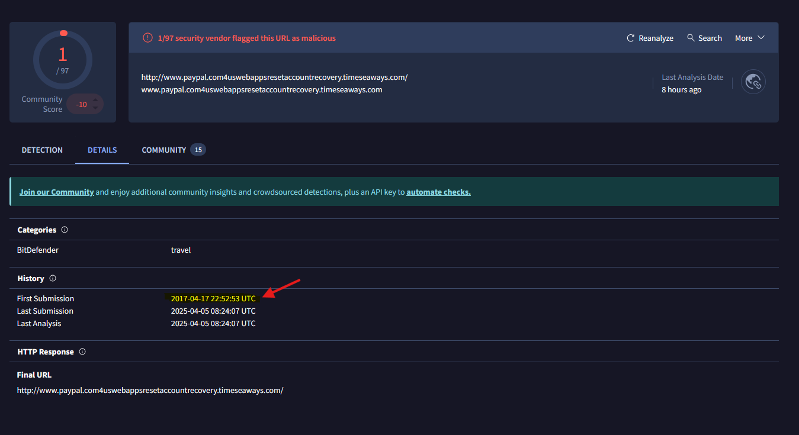

# Introduction

This room presents you with a challenge to investigate some traffic data as a part of the SOC team. Let's start working with TShark to analyse the captured traffic. We recommend completing the TShark: The Basics and TShark: CLI Wireshark Features rooms first, which will teach you how to use the tool in depth. 

Start the VM by pressing the green Start Machine button attached to this task. The machine will start in split view, so you don't need SSH or RDP. In case the machine does not appear, you can click the blue Show Split View button located at the top of this room.
NOTE: Exercise files contain real examples. DO NOT interact with them outside of the given VM. Direct interaction with samples and their contents (files, domains, and IP addresses) outside the given VM can pose security threats to your machine. 

# Case: Teamwork!

An alert has been triggered: "The threat research team discovered a suspicious domain that could be a potential threat to the organisation."

The case was assigned to you. Inspect the provided teamwork.pcap located in ~/Desktop/exercise-files and create artefacts for detection tooling.

Your tools: TShark, VirusTotal.

## Q & A 

Q1 Investigate the contacted domains.
Investigate the domains by using VirusTotal.
According to VirusTotal, there is a domain marked as malicious/suspicious.

What is the full URL of the malicious/suspicious domain address?

Enter your answer in defanged format.

A1 hxxp[://]www[.]paypal[.]com4uswebappsresetaccountrecovery[.]timeseaways[.]com

```
ubuntu@ip-10-10-69-18:~/Desktop/exercise-files$ tshark -r teamwork.pcap -T fields -e dns.qry.name | awk NF | sort -r | uniq -c | sort -r | nl
     1	     19 www.paypal.com4uswebappsresetaccountrecovery.timeseaways.com
     2	      6 toolbarqueries.google.com
     3	      4 wittyserver.hsd1.md.comcast.net
     4	      4 wittyserver
```

Q2 When was the URL of the malicious/suspicious domain address first submitted to VirusTotal?

A2 2017-04-17 22:52:53 UTC



Q3 Which known service was the domain trying to impersonate?

A3 Paypal

Q4 What is the IP address of the malicious domain?

Enter your answer in defanged format.

A4 184[.]154[.]127[.]226

```
ubuntu@ip-10-10-69-18:~/Desktop/exercise-files$ tshark -r teamwork.pcap -T fields -e ip.dst -e ip.src -Y 'http contains "paypal"' | awk NF | sort -r | uniq -c | sort -r | nl
     1	     21 184.154.127.226	192.168.1.100
     2	      1 216.58.217.100	192.168.1.100
     3	      1 192.168.1.100	184.154.127.226
```
or
```
buntu@ip-10-10-69-18:~/Desktop/exercise-files$ tshark -r teamwork.pcap -T fields -e http.host -e ip.dst -e ip.src | awk NF | sort -r | uniq -c | sort -r | nl
     1	    175 	184.154.127.226	192.168.1.100
     2	    173 	192.168.1.100	184.154.127.226
     3	     32 	104.87.132.38	192.168.1.100
     4	     27 	192.168.1.100	104.87.132.38
     5	     21 www.paypal.com4uswebappsresetaccountrecovery.timeseaways.com	184.154.127.226	192.168.1.100
     6	     19 	104.87.145.70	192.168.1.100
     7	     18 	216.58.217.100	192.168.1.100
     8	     18 	192.168.1.100	104.87.145.70
     9	     17 	75.75.75.75	192.168.1.100
    10	     17 	192.168.1.100	216.58.217.100
    11	     16 	192.168.1.100	75.75.75.75
    12	     12 	52.22.15.101	192.168.1.100
    13	     11 	66.235.147.240	192.168.1.100
    14	     11 	52.21.208.23	192.168.1.100
    15	     11 	192.168.1.100	52.22.15.101
    16	     11 	104.87.150.49	192.168.1.100
    17	     10 	52.84.125.48	192.168.1.100
    18	     10 	216.58.217.134	192.168.1.100
    19	     10 	192.168.1.100	216.58.217.134
    20	     10 	192.168.1.100	172.217.7.164
    21	     10 	192.168.1.100	104.87.133.16
    22	     10 	172.217.7.164	192.168.1.100
    23	     10 	104.87.133.16	192.168.1.100
    24	      9 	72.21.91.29	192.168.1.100
    25	      9 	23.54.187.27	192.168.1.100
    26	      9 	23.52.91.27	192.168.1.100
    27	      9 	192.168.1.100	52.21.208.23
    28	      9 	173.201.44.188	192.168.1.100
    29	      8 	192.168.1.100	72.21.91.29
    30	      8 	192.168.1.100	52.84.125.48
    31	      8 	192.168.1.100	23.54.187.27
    32	      8 	192.168.1.100	23.52.91.27
    33	      8 	192.168.1.100	173.201.44.188
    34	      6 	192.168.1.100	66.235.147.240
    35	      6 	192.168.1.100	104.87.150.49
    36	      5 	54.87.193.254	192.168.1.100
    37	      4 	52.1.131.18	192.168.1.100
    38	      4 	192.168.1.100	54.87.193.254
    39	      4 	192.168.1.100	52.1.131.18
    40	      2 	192.168.1.100	54.164.88.31
    41	      1 toolbarqueries.google.com	216.58.217.100	192.168.1.100
    42	      1 	54.164.88.31	192.168.1.100
``` 
or
```
ubuntu@ip-10-10-69-18:~/Desktop/exercise-files$ tshark -r teamwork.pcap -Y 'http.request' -T fields -e http.host -e ip.dst -e ip.src | awk NF | sort -r | uniq -c | sort -r | nl
     1	     21 www.paypal.com4uswebappsresetaccountrecovery.timeseaways.com	184.154.127.226	192.168.1.100
     2	      1 toolbarqueries.google.com	216.58.217.100	192.168.1.100
```

Q5 What is the email address that was used?

Enter your answer in defanged format. (format: aaa[at]bbb[.]ccc)

A5 johnny5alive[at]gmail[.]com

```
ubuntu@ip-10-10-69-18:~/Desktop/exercise-files$ tshark -r teamwork.pcap -Y 'ip.addr==184.154.127.226 && http.request.method=="POST"' -T fields -e text | nl
     1	Timestamps,POST /inc/visit.php HTTP/1.1\r\n,\r\n,Form item: "xBrowser" = "Mozilla FireFox v43",Form item: "xOperatingSystem" = "Linux",Form item: "xPlatForm" = "Desktop Platform"
     2	Timestamps,POST /inc/login.php HTTP/1.1\r\n,\r\n,Form item: "user" = "johnny5alive@gmail.com",Form item: "pass" = "johnny5alive",Form item: "xBrowser" = "Mozilla FireFox v43",Form item: "xOperatingSystem" = "Linux",Form item: "xPlatForm" = "Desktop Platform",Form item: "xTimeZone" = "Mon Apr 17 2017 22:00:35 GMT-0400 (EDT)",Form item: "xResoLution" = "Computer: 1920x1080; Browser inner: 1920x762; Browser outer: 1920x1027",Form item: "xLang" = "en-US"
```
