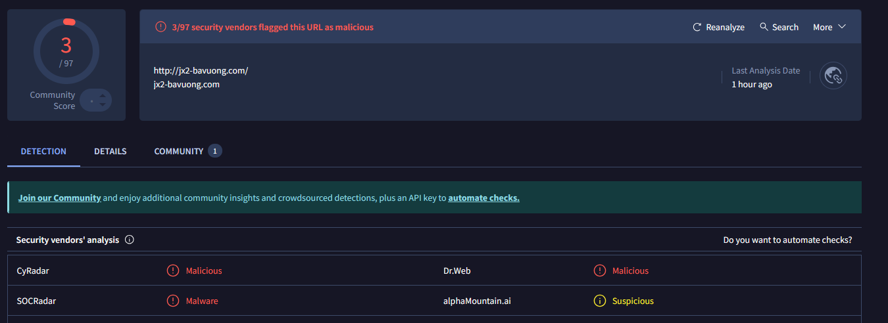
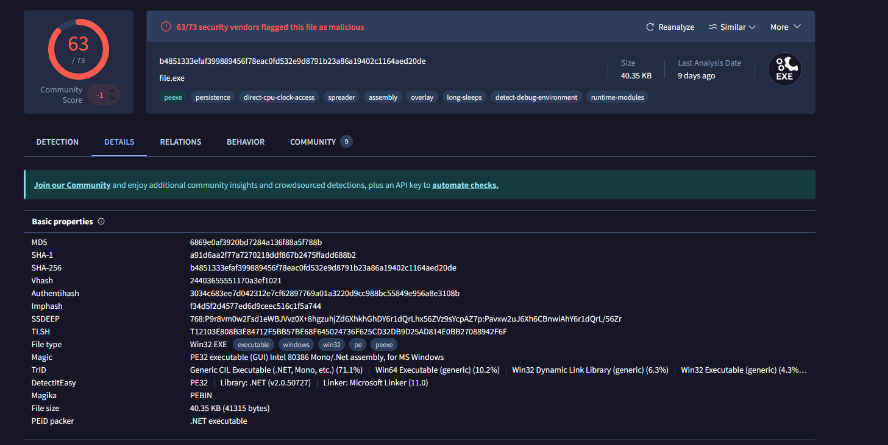
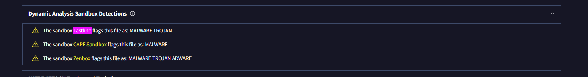

#  Introduction

This room presents you with a challenge to investigate some traffic data as a part of the SOC team. Let's start working with TShark to analyse the captured traffic. We recommend completing the TShark: The Basics and TShark: CLI Wireshark Features rooms first, which will teach you how to use the tool in depth. 

NOTE: Exercise files contain real examples. DO NOT interact with them outside of the given VM. Direct interaction with samples and their contents (files, domains, and IP addresses) outside the given VM can pose security threats to your machine. 

# Case: Directory Curiosity!

An alert has been triggered: "A user came across a poor file index, and their curiosity led to problems".

The case was assigned to you. Inspect the provided directory-curiosity.pcap located in ~/Desktop/exercise-files and retrieve the artefacts to confirm that this alert is a true positive.

Your tools: TShark, VirusTotal.

Investigate the DNS queries.
Investigate the domains by using VirusTotal.
According to VirusTotal, there is a domain marked as malicious/suspicious.

Q1 What is the name of the malicious/suspicious domain?

Enter your answer in a defanged format.

A1 jx2-bavuong[.]com

```
ubuntu@ip-10-10-55-191:~/Desktop/exercise-files$ tshark -r directory-curiosity.pcap -T fields -e dns.qry.name | awk NF | sort -r | uniq -c | sort -r | nl
     1	      8 isatap
     2	      4 www.bing.com
     3	      2 r20swj13mr.microsoft.com
     4	      2 ocsp.digicert.com
     5	      2 jx2-bavuong.com
     6	      2 iecvlist.microsoft.com
     7	      2 api.bing.com
```


Q2 What is the total number of HTTP requests sent to the malicious domain?

A2 14

```
ubuntu@ip-10-10-55-191:~/Desktop/exercise-files$ tshark -r directory-curiosity.pcap -Y 'http.request' -T fields -e http.host | awk NF | sort -r | uniq -c | sort -r | nl
     1	     14 jx2-bavuong.com
     2	      8 239.255.255.250:1900
     3	      3 ocsp.digicert.com
     4	      1 www.bing.com
```

Q3 What is the IP address associated with the malicious domain?

Enter your answer in a defanged format.

A3 141[.]164[.]41[.]174

```
ubuntu@ip-10-10-55-191:~/Desktop/exercise-files$ tshark -r directory-curiosity.pcap -Y 'http.request' -T fields -e http.host -e ip.dst | awk NF | sort -r | uniq -c | sort -r | nl
     1	     14 jx2-bavuong.com	141.164.41.174
     2	      8 239.255.255.250:1900	239.255.255.250
     3	      3 ocsp.digicert.com	93.184.220.29
     4	      1 www.bing.com	204.79.197.200
```

Q4 What is the server info of the suspicious domain?

A4 Apache/2.2.11 (Win32) DAV/2 mod_ssl/2.2.11 OpenSSL/0.9.8i PHP/5.2.9

```
ubuntu@ip-10-10-55-191:~/Desktop/exercise-files$ tshark -r directory-curiosity.pcap -Y 'ip.addr==141.164.41.174' -T fields -e http.host -e http.server | awk NF | sort -r | uniq -c | sort -r | nl
     1	     14 jx2-bavuong.com	
     2	     14 	Apache/2.2.11 (Win32) DAV/2 mod_ssl/2.2.11 OpenSSL/0.9.8i PHP/5.2.9

```
Q5 Follow the "first TCP stream" in "ASCII".
Investigate the output carefully.

What is the number of listed files?

A5 3

132.php
vlauto.exe
vlauto.php

```
ubuntu@ip-10-10-55-191:~/Desktop/exercise-files$ tshark -r directory-curiosity.pcap -z follow,tcp,ascii,0 -q                                                   

===================================================================
Follow: tcp,ascii
Filter: tcp.stream eq 0
Node 0: 192.168.100.116:49170
Node 1: 141.164.41.174:80
251
GET / HTTP/1.1
Accept: text/html, application/xhtml+xml, */*
Accept-Language: en-US
User-Agent: Mozilla/5.0 (Windows NT 6.1; Trident/7.0; rv:11.0) like Gecko
Accept-Encoding: gzip, deflate
Host: jx2-bavuong.com
DNT: 1
Connection: Keep-Alive


	1078
HTTP/1.1 200 OK
Date: Sun, 13 Dec 2020 00:51:46 GMT
Server: Apache/2.2.11 (Win32) DAV/2 mod_ssl/2.2.11 OpenSSL/0.9.8i PHP/5.2.9
Content-Length: 829
Keep-Alive: timeout=5, max=100
Connection: Keep-Alive
Content-Type: text/html;charset=UTF-8

<!DOCTYPE HTML PUBLIC "-//W3C//DTD HTML 3.2 Final//EN">
<html>
 <head>
  <title>Index of /</title>
 </head>
 <body>
<h1>Index of /</h1>
<pre> <a href="?C=N;O=D">Name</a>                    <a href="?C=M;O=A">Last modified</a>      <a href="?C=S;O=A">Size</a>  <a href="?C=D;O=A">Description</a><hr> <a href="123.php">123.php</a>                 12-Jul-2020 08:43    1   
 <a href="vlauto.exe">vlauto.exe</a>              06-May-2020 23:32   40K  
 <a href="vlauto.php">vlauto.php</a>              10-Jul-2020 23:25   93   
<hr></pre>
<address>Apache/2.2.11 (Win32) DAV/2 mod_ssl/2.2.11 OpenSSL/0.9.8i PHP/5.2.9 Server at jx2-bavuong.com Port 80</address>
</body></html>

313
GET /icons/blank.gif HTTP/1.1
Accept: image/png, image/svg+xml, image/*;q=0.8, */*;q=0.5
Referer: http://jx2-bavuong.com/
Accept-Language: en-US
User-Agent: Mozilla/5.0 (Windows NT 6.1; Trident/7.0; rv:11.0) like Gecko
Accept-Encoding: gzip, deflate
Host: jx2-bavuong.com
DNT: 1
Connection: Keep-Alive


	490
HTTP/1.1 200 OK
Date: Sun, 13 Dec 2020 00:51:46 GMT
Server: Apache/2.2.11 (Win32) DAV/2 mod_ssl/2.2.11 OpenSSL/0.9.8i PHP/5.2.9
Last-Modified: Sat, 20 Nov 2004 13:16:24 GMT
ETag: "20000000053c6-94-3e9506e1a3a00"
Accept-Ranges: bytes
Content-Length: 148
Keep-Alive: timeout=5, max=99
Connection: Keep-Alive
Content-Type: image/gif

GIF89a...................!.NThis art is in the public domain. Kevin Hughes, kevinh@eit.com, September 1995.!.......,............................I..;
===================================================================
```

Q6 What is the filename of the first file?

Enter your answer in a defanged format.

A6 123[.]php

Q7 Export all HTTP traffic objects.
What is the name of the downloaded executable file?

Enter your answer in a defanged format.

A7 vlauto[.]exe

```
ubuntu@ip-10-10-55-191:~/Desktop/exercise-files$ tshark -r directory-curiosity.pcap -Y 'http' -T fields -e text | grep exe
Timestamps,HTTP/1.1 200 OK\r\n,\r\n,<!DOCTYPE HTML PUBLIC "-//W3C//DTD HTML 3.2 Final//EN">\n,<html>\n, <head>\n,  <title>Index of /</title>\n, </head>\n, <body>\n,<h1>Index of /</h1>\n, [truncated]<pre> <a href="?C=N;O=D">Name</a>                    <a href="?C=M;O=A">Last modified</a>      <a href="?C=S;O=A">Size</a>  <a href="?C=D;O=A">Description</a><hr> <a href="vlauto.exe">vlauto.exe</a>              06-May-2020 23:32   40K  \n, <a href="vlauto.php">vlauto.php</a>              10-Jul-2020 23:25   93   \n,<hr></pre>\n,<address>Apache/2.2.11 (Win32) DAV/2 mod_ssl/2.2.11 OpenSSL/0.9.8i PHP/5.2.9 Server at jx2-bavuong.com Port 80</address>\n,</body></html>\n
Timestamps,GET /vlauto.exe HTTP/1.1\r\n,\r\n
Timestamps,GET /vlauto.exe HTTP/1.1\r\n,\r\n
```

Q8 What is the SHA256 value of the malicious file?

A8 b4851333efaf399889456f78eac0fd532e9d8791b23a86a19402c1164aed20de

```
ubuntu@ip-10-10-55-191:~/Desktop/exercise-files$ tshark -r directory-curiosity.pcap --export-objects http,. -q

ubuntu@ip-10-10-55-191:~/Desktop/exercise-files$ ls -l
total 344
-rw-r--r-- 1 ubuntu ubuntu    829 Apr  5 19:56  %2f
-rw-r--r-- 1 ubuntu ubuntu    471 Apr  5 19:56  MFEwTzBNMEswSTAJBgUrDgMCGgUABBSAUQYBMq2awn1Rh6Doh%2FsBYgFV7gQUA95QNVbRTLtm8KPiGxvDl7I90VUCEAJ0LqoXyo4hxxe7H%2Fz9DKA%3D
-rw-r--r-- 1 ubuntu ubuntu    471 Apr  5 19:56 'MFEwTzBNMEswSTAJBgUrDgMCGgUABBSAUQYBMq2awn1Rh6Doh%2FsBYgFV7gQUA95QNVbRTLtm8KPiGxvDl7I90VUCEAJ0LqoXyo4hxxe7H%2Fz9DKA%3D(1)'
-rw-r--r-- 1 ubuntu ubuntu    471 Apr  5 19:56 'MFEwTzBNMEswSTAJBgUrDgMCGgUABBSAUQYBMq2awn1Rh6Doh%2FsBYgFV7gQUA95QNVbRTLtm8KPiGxvDl7I90VUCEAJ0LqoXyo4hxxe7H%2Fz9DKA%3D(2)'
-rw-r--r-- 1 ubuntu ubuntu    471 Apr  5 19:56 'MFEwTzBNMEswSTAJBgUrDgMCGgUABBSAUQYBMq2awn1Rh6Doh%2FsBYgFV7gQUA95QNVbRTLtm8KPiGxvDl7I90VUCEAJ0LqoXyo4hxxe7H%2Fz9DKA%3D(3)'
-rw-r--r-- 1 ubuntu ubuntu    471 Apr  5 19:56 'MFEwTzBNMEswSTAJBgUrDgMCGgUABBSAUQYBMq2awn1Rh6Doh%2FsBYgFV7gQUA95QNVbRTLtm8KPiGxvDl7I90VUCEAJ0LqoXyo4hxxe7H%2Fz9DKA%3D(4)'
-rw-r--r-- 1 ubuntu ubuntu    246 Apr  5 19:56  binary.gif
-rw-r--r-- 1 ubuntu ubuntu    148 Apr  5 19:56  blank.gif
-rw-r--r-- 1 ubuntu ubuntu   1106 Apr  5 19:56  blog
-rw-r--r-- 1 ubuntu ubuntu   1106 Apr  5 19:56  botlogger.php
-rw-r--r-- 1 ubuntu ubuntu 186280 Feb 19  2024  directory-curiosity.pcap
-rw-r--r-- 1 ubuntu ubuntu   1106 Apr  5 19:56 'favicon(1).ico'
-rw-r--r-- 1 ubuntu ubuntu    237 Apr  5 19:56  favicon.ico
-rw-r--r-- 1 ubuntu ubuntu   1106 Apr  5 19:56  proxy
-rw-r--r-- 1 ubuntu ubuntu   1106 Apr  5 19:56  target
-rw-r--r-- 1 ubuntu ubuntu   1106 Apr  5 19:56  target.ip
-rw-r--r-- 1 ubuntu ubuntu   1106 Apr  5 19:56  target.method
-rw-r--r-- 1 ubuntu ubuntu   1106 Apr  5 19:56  target.port
-rw-r--r-- 1 ubuntu ubuntu    229 Apr  5 19:56  text.gif
-rw-r--r-- 1 ubuntu ubuntu  41315 Apr  5 19:56 'vlauto(1).exe'
-rw-r--r-- 1 ubuntu ubuntu  41315 Apr  5 19:56  vlauto.exe

ubuntu@ip-10-10-55-191:~/Desktop/exercise-files$ sha256sum vlauto.exe
b4851333efaf399889456f78eac0fd532e9d8791b23a86a19402c1164aed20de  vlauto.exe
```

Q9 Search the SHA256 value of the file on VirtusTotal.

What is the "PEiD packer" value?

A9 .NET executable



Q10 Search the SHA256 value of the file on VirtusTotal.

What does the "Lastline Sandbox" flag this as?

A10 MALWARE TROJAN


