# Introduction

In this room, we will explore the core processes within a Windows system. This room aims to help you know and understand what normal behaviour within a Windows operating system is. This foundational knowledge will help you identify malicious processes running on an endpoint. 

The Windows operating system is the most used in the world (whether people like it or not), and the majority of its users don't fully understand its interworkings. Users are simply content that it works, like anything complex, such as a car. It starts, and you can drive from point A to point B. Now regarding computers, if they can surf the web, read/answer emails, shop, listen to music, and watch movies, all is well. It took a long time for users to grasp the need for antivirus programs fully. Only when one of their essential everyday computer functions is disrupted is when antivirus matter. Antivirus was enough over 5-7 years ago (rough estimate).

Time changes everything. Malware and attacks have evolved, and antivirus is no longer enough. Antivirus has struggled to keep up, solely based on how it is designed to catch evil. 

Today antivirus is just one solution within the layered defensive approach. New security tools, such as EDR (Endpoint Detection and Response), have been created because antiviruses cannot catch every malicious binary and process running on the endpoint. 

But guess what? Even with these new tools, it is still not 100% effective. Attackers can still bypass the defences running on the endpoint. This is where we come in. Whether you're a Security Analyst, SOC Analyst, Detection Engineer, or Threat Hunter, if one of the tools alerts us of a suspicious binary or process, we must investigate and decide on a course of action. Knowing the expected behaviour of the systems we have to defend, a Windows system, in this case, we can infer if the binary or process is benign or evil. 

# Task Manager 

Task Manager is a built-in GUI-based Windows utility that allows users to see what is running on the Windows system. It also provides information on resource usage, such as how much each process utilizes CPU and memory. When a program is not responding, Task Manager is used to end (kill) the process. 

We'll give a brief overview if you're unfamiliar with Task Manager.

To open Task Manager, right-click the Taskbar. When the new window appears, select Task Manager (as shown below).

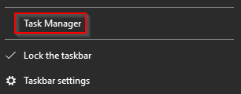

If you don't have any explicitly opened apps, you should see the same message as shown below.

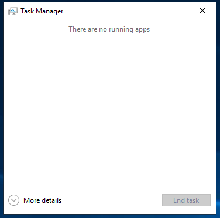

Weird. Not seeing much, eh? Within a Windows system, many processes are running. Click on More details. 

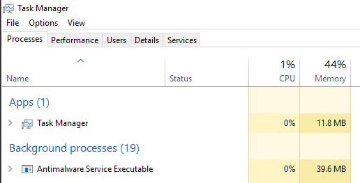

Ok, now we're getting somewhere. Notice the five tabs within Task Manager. By default, the current tab is Processes. 

Note: If you're running Task Manager on your Windows machine, you might see additional tabs. 

As shown above, you may notice the processes are categorized as follows: Apps and Background processes. Another category that is not visible in the above image is Windows processes. 

The columns are very minimal. The columns Name, Status, CPU, and Memory are the only ones visible. To view more columns, right-click on any column header to open more options. 

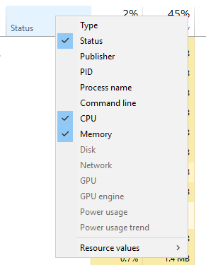

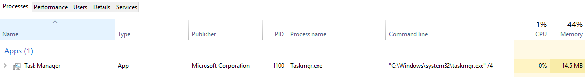

The view looks a little better. Let's briefly go over each column (excluding Name, of course): 

-    Type - Each process falls into 1 of 3 categories (Apps, Background process, or Windows process).
-    Publisher - Think of this column as the name of the author of the program/file.
-    PID - This is known as the process identifier number. Windows assigns a unique process identifier each time a program starts. If the same program has multiple running processes, each will have its unique process identifier (PID).
-    Process name - This is the file name of the process. In the above image, the file name for Task Manager is Taskmrg.exe. 
-   Command line - The full command used to launch the process. 
-    CPU - The amount of CPU (processing power) the process uses.
-    Memory - The amount of physical working memory utilized by the process. 

Task Manager is a utility you should be comfortable using, whether you're troubleshooting or performing analysis on the endpoint. 

Let's move to the Details tab. This view provides some core processes that will be discussed in this room. Sort the PID column so that the PIDs are in ascending order. 

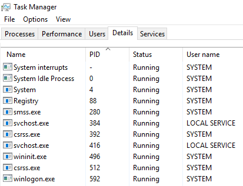

Add some additional columns to see more information about these processes. Good columns to add are Image path name and Command line. (Note on Windows 11 The task manager changes slightly, I can add the Command line column on the Processes view but not on Details, and Image path name is not an option)

These two columns can quickly alert an analyst of any outliers with a given process. In the below image, PID 384 is paired with a process named svchost.exe, a Windows process, but if the Image path name or Command line is not what it's expected to be, then we can perform a deeper analysis of this process. 

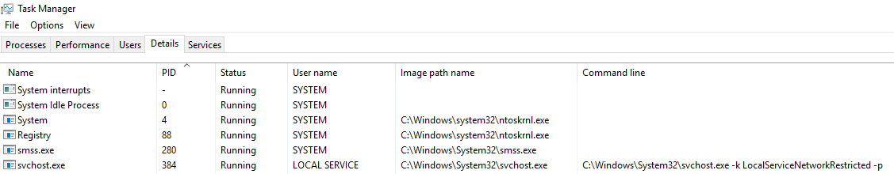

Of course, you can add as many columns as you wish, but adding the columns that would be pertinent to your current task is recommended. 

Task Manager is a powerful built-in Windows utility but lacks certain important information when analyzing processes, such as parent process information. It is another key column when identifying outliers. Back to svchost.exe, if the parent process for PID 384 is not services.exe, this will warrant further analysis. 

To further prove this point, where is services.exe? 

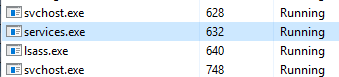

Based on the above image, the PID for services.exe is 632. But wait, one of the svchost.exe processes has a PID of 384. How did svchost.exe start before services.exe? Well, it didn't. Task Manager doesn't show a Parent-Child process view. That is where other utilities, such as Process Hacker and Process Explorer, come to the rescue.

### Process Hacker

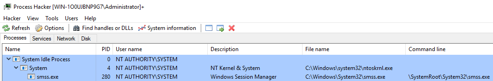

### Process Explorer

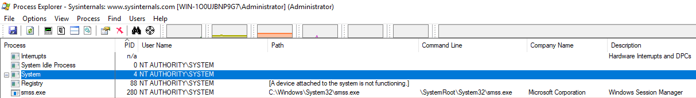

Moving forward, we'll use Process Hacker and Process Explorer instead of Task Manager to obtain information about each Windows process. 

As always, it's encouraged that you inspect and familiarize yourself with all information available within Task Manager. It's a built-in utility that is available in every Windows system. You might find yourself in a situation where you can't bring your tools to the fight and rely on the tools native to the system.

Aside from Task Manager, it would be best if you also familiarize yourself with the command-line equivalent of obtaining information about the running processes on a Windows system: `tasklist`, `Get-Process` or `ps` (PowerShell), and `wmic`.


# System 

The first Windows process on the list is System. It was mentioned in a previous section that a PID for any given process is assigned at random, but that is not the case for the System process. The PID for System is always 4. What does this process do exactly?

The official definition from Windows Internals 6th Edition:

"The System process (process ID 4) is the home for a special kind of thread that runs only in kernel mode a kernel-mode system thread. System threads have all the attributes and contexts of regular user-mode threads (such as a hardware context, priority, and so on) but are different in that they run only in kernel-mode executing code loaded in system space, whether that is in Ntoskrnl.exe or in any other loaded device driver. In addition, system threads don't have a user process address space and hence must allocate any dynamic storage from operating system memory heaps, such as a paged or nonpaged pool."

What is user mode? Kernel-mode? Visit the following link to understand each of these. https://docs.microsoft.com/en-us/windows-hardware/drivers/gettingstarted/user-mode-and-kernel-mode

Now, what is normal behaviour for this process? Let's use Process Explorer and view the properties of the System.

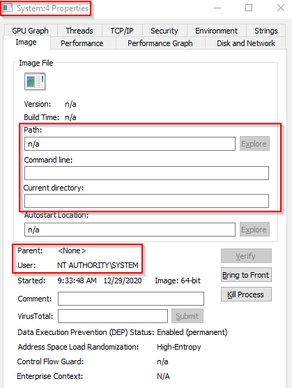

Image Path:  N/A
Parent Process:  None
Number of Instances:  One
User Account:  Local System
Start Time:  At boot time

The information is slightly different if we view the System properties using Process Hacker.


Image Path: C:\Windows\system32\ntoskrnl.exe (NT OS Kernel)
Parent Process: System Idle Process (0)

Technically this is correct. You may notice that Process Hacker confirms this is legit (Verified) Microsoft Windows. 

### What is unusual behaviour for this process?

-    A parent process (aside from System Idle Process (0))
-    Multiple instances of System. (Should only be one instance) 
-    A different PID. (Remember that the PID will always be PID 4)
-    Not running in Session 0

## Q & A

Q What PID should System always be?

A 4

# System > smss.exe

The next process is smss.exe (Session Manager Subsystem). This process, also known as the Windows Session Manager, is responsible for creating new sessions. It is the first user-mode process started by the kernel.

This process starts the kernel and user modes of the Windows subsystem (you can read more about the NT Architecture here https://en.wikipedia.org/wiki/Architecture_of_Windows_NT). This subsystem includes win32k.sys (kernel mode), winsrv.dll (user mode), and csrss.exe (user mode). 

Smss.exe starts csrss.exe (Windows subsystem) and wininit.exe in Session 0, an isolated Windows session for the operating system, and csrss.exe and winlogon.exe for Session 1, which is the user session. The first child instance creates child instances in new sessions, done by smss.exe copying itself into the new session and self-terminating. You can read more about this process here https://en.wikipedia.org/wiki/Session_Manager_Subsystem.

### Session 0 (csrss.exe & wininit.exe)

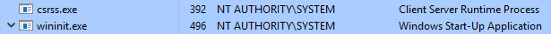

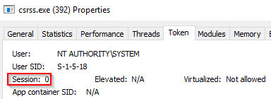

### Session 1 (csrss.exe & winlogon.exe)

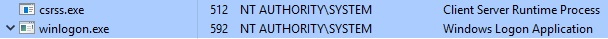

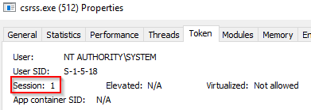

Any other subsystem listed in the `Required` value of `HKLM\System\CurrentControlSet\Control\Session Manager\Subsystems` is also launched.


SMSS is also responsible for creating environment variables, virtual memory paging files and starts winlogon.exe (the Windows Logon Manager).

### What is normal?

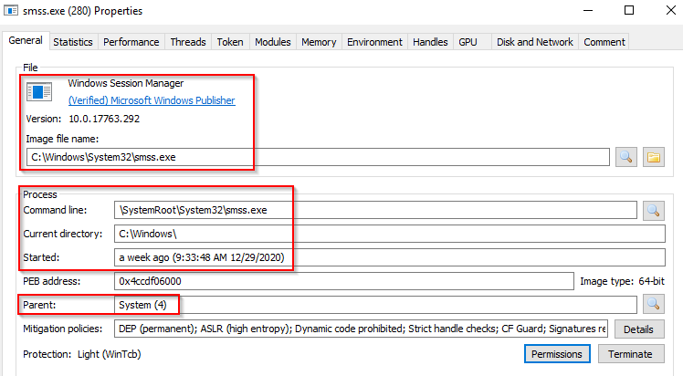

Image Path:  %SystemRoot%\System32\smss.exe
Parent Process:  System
Number of Instances:  One master instance and child instance per session. The child instance exits after creating the session.
User Account:  Local System
Start Time:  Within seconds of boot time for the master instance

### What is unusual?

-    A different parent process other than System (4)
-    The image path is different from C:\Windows\System32
-    More than one running process. (children self-terminate and exit after each new session)
-    The running User is not the SYSTEM user
-    Unexpected registry entries for Subsystem

## Q&A 

Q Aside from csrss.exe, what process does smss.exe spawn in Session 1?

A winlogon.exe


# csrss.exe

As mentioned in the previous section, csrss.exe (Client Server Runtime Process) is the user-mode side of the Windows subsystem. This process is always running and is critical to system operation. If this process is terminated by chance, it will result in system failure. This process is responsible for the Win32 console window and process thread creation and deletion. For each instance, csrsrv.dll, basesrv.dll, and winsrv.dll are loaded (along with others). 

This process is also responsible for making the Windows API available to other processes, mapping drive letters, and handling the Windows shutdown process. You can read more about this process here https://en.wikipedia.org/wiki/Client/Server_Runtime_Subsystem .

Note: Recall that csrss.exe and winlogon.exe are called from smss.exe at startup for Session 1. 

### What is normal?

Session 0 (PID 392)

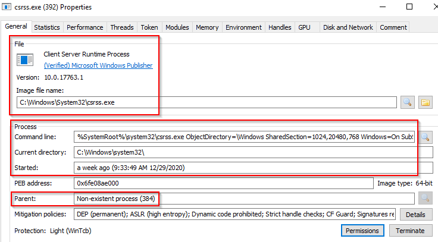

Session 1 (PID 512)

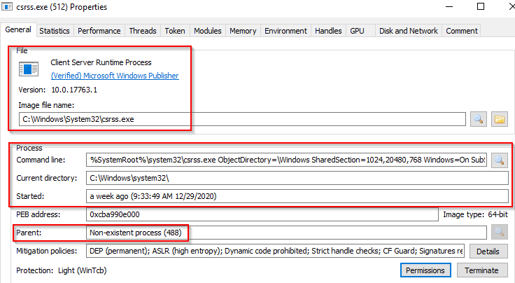

<b>Notice what is shown for the parent process for these two processes. Remember, these processes are spawned by smss.exe, which self-terminates itself.</b>  

Image Path:  %SystemRoot%\System32\csrss.exe
Parent Process:  Created by an instance of smss.exe
Number of Instances:  Two or more
User Account:  Local System
Start Time:  Within seconds of boot time for the first two instances (for Session 0 and 1). Start times for additional instances occur as new sessions are created, although only Sessions 0 and 1 are often created.

### What is unusual?

-    An actual parent process. (smss.exe calls this process and self-terminates)
-    Image file path other than C:\Windows\System32
-    Subtle misspellings to hide rogue processes masquerading as csrss.exe in plain sight
-    The user is not the SYSTEM user.


## Q & A

Q What was the process which had PID 384 and PID 488?

A smss.exe


# wininit.exe

The Windows Initialization Process, wininit.exe, is responsible for launching services.exe (Service Control Manager), lsass.exe (Local Security Authority), and lsaiso.exe within Session 0. It is another critical Windows process that runs in the background, along with its child processes. 

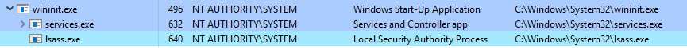

Note: lsaiso.exe is a process associated with Credential Guard and KeyGuard. You will only see this process if Credential Guard is enabled. 

### What is normal?

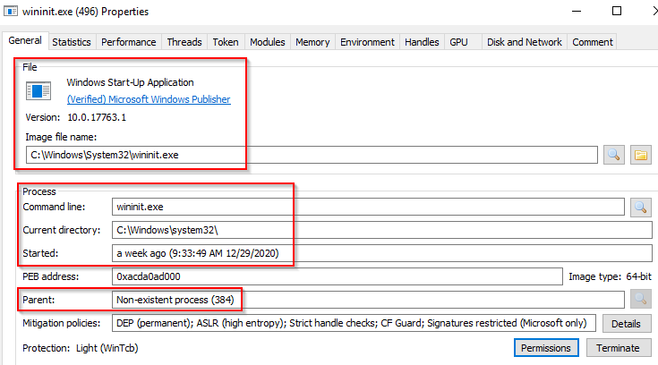

Image Path:  %SystemRoot%\System32\wininit.exe
Parent Process:  Created by an instance of smss.exe
Number of Instances:  One
User Account:  Local System
Start Time:  Within seconds of boot time

### What is unusual?

-    An actual parent process. (smss.exe calls this process and self-terminates)
-    Image file path other than C:\Windows\System32
-    Subtle misspellings to hide rogue processes in plain sight
-    Multiple running instances
-    Not running as SYSTEM

## Q & A 

Q Which process might you not see running if Credential Guard is not enabled?

A lsaiso.exe


# wininit.exe > services.exe


The next process is the Service Control Manager (SCM) or services.exe. Its primary responsibility is to handle system services: loading services, interacting with services and starting or ending services. It maintains a database that can be queried using a Windows built-in utility, `sc.exe`. 

```
C:\Users\Administrator> sc.exe
DESCRIPTION:
        SC is a command line program used for communicating with the
        Service Control Manager and services.
USAGE:
        sc <server> [command] [service name] <option1> <option2>...


        The option <server> has the form "\\ServerName"
        Further help on commands can be obtained by typing: "sc [command]"
        Commands:
          query-----------Queries the status for a service, or
                          enumerates the status for types of services.
          queryex---------Queries the extended status for a service, or
                          enumerates the status for types of services.
          start-----------Starts a service.
          pause-----------Sends a PAUSE control request to a service.
          interrogate-----Sends an INTERROGATE control request to a service.
          continue--------Sends a CONTINUE control request to a service.
          stop------------Sends a STOP request to a service.
          config----------Changes the configuration of a service (persistent).
          description-----Changes the description of a service.
          failure---------Changes the actions taken by a service upon failure.
          failureflag-----Changes the failure actions flag of a service.
          sidtype---------Changes the service SID type of a service.
          privs-----------Changes the required privileges of a service.
          managedaccount--Changes the service to mark the service account
                          password as managed by LSA.
          qc--------------Queries the configuration information for a service.
          qdescription----Queries the description for a service.
          qfailure--------Queries the actions taken by a service upon failure.
          qfailureflag----Queries the failure actions flag of a service.
          qsidtype--------Queries the service SID type of a service.
          qprivs----------Queries the required privileges of a service.
          qtriggerinfo----Queries the trigger parameters of a service.
          qpreferrednode--Queries the preferred NUMA node of a service.
          qmanagedaccount-Queries whether a services uses an account with a
                          password managed by LSA.
          qprotection-----Queries the process protection level of a service.
          quserservice----Queries for a local instance of a user service template.
          delete----------Deletes a service (from the registry).
          create----------Creates a service. (adds it to the registry).
          control---------Sends a control to a service.
          sdshow----------Displays a service's security descriptor.
          sdset-----------Sets a service's security descriptor.
          showsid---------Displays the service SID string corresponding to an arbitrary name.
          triggerinfo-----Configures the trigger parameters of a service.
          preferrednode---Sets the preferred NUMA node of a service.
          GetDisplayName--Gets the DisplayName for a service.
          GetKeyName------Gets the ServiceKeyName for a service.
          EnumDepend------Enumerates Service Dependencies.

        The following commands don't require a service name:
        sc <server> <command> <option>
          boot------------(ok | bad) Indicates whether the last boot should
                          be saved as the last-known-good boot configuration
          Lock------------Locks the Service Database
          QueryLock-------Queries the LockStatus for the SCManager Database
EXAMPLE:
        sc start MyService


QUERY and QUERYEX OPTIONS:
        If the query command is followed by a service name, the status
        for that service is returned.  Further options do not apply in
        this case.  If the query command is followed by nothing or one of
        the options listed below, the services are enumerated.
    type=    Type of services to enumerate (driver, service, userservice, all)
             (default = service)
    state=   State of services to enumerate (inactive, all)
             (default = active)
    bufsize= The size (in bytes) of the enumeration buffer
             (default = 4096)
    ri=      The resume index number at which to begin the enumeration
             (default = 0)
    group=   Service group to enumerate
             (default = all groups)

SYNTAX EXAMPLES
sc query                - Enumerates status for active services & drivers
sc query eventlog       - Displays status for the eventlog service
sc queryex eventlog     - Displays extended status for the eventlog service
sc query type= driver   - Enumerates only active drivers
sc query type= service  - Enumerates only Win32 services
sc query state= all     - Enumerates all services & drivers
sc query bufsize= 50    - Enumerates with a 50 byte buffer
sc query ri= 14         - Enumerates with resume index = 14
sc queryex group= ""    - Enumerates active services not in a group
sc query type= interact - Enumerates all interactive services
sc query type= driver group= NDIS     - Enumerates all NDIS drivers
```

Information regarding services is stored in the registry, `HKLM\System\CurrentControlSet\Services`. 

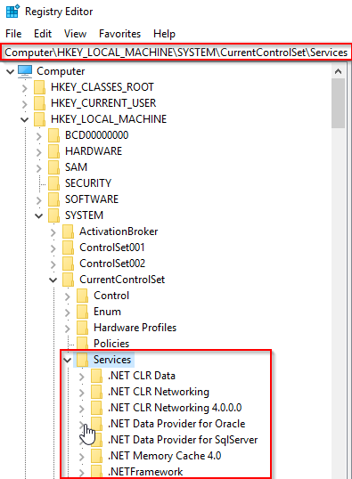

This process also loads device drivers marked as auto-start into memory. 

When a user logs into a machine successfully, this process is responsible for setting the value of the Last Known Good control set (Last Known Good Configuration), `HKLM\System\Select\LastKnownGood`, to that of the CurrentControlSet. 

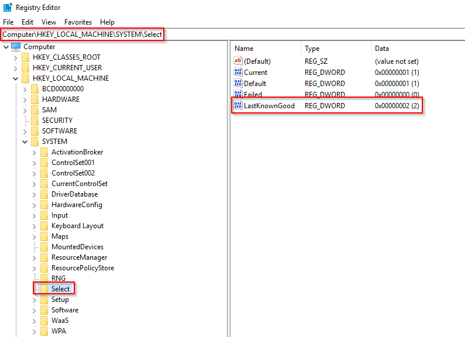

This process is the parent to several other key processes: svchost.exe, spoolsv.exe, msmpeng.exe, and dllhost.exe, to name a few. You can read more about this process here https://en.wikipedia.org/wiki/Service_Control_Manager.

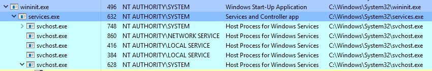

### What is normal?

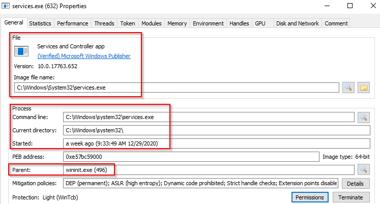

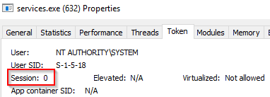

Image Path:  %SystemRoot%\System32\services.exe
Parent Process:  wininit.exe
Number of Instances:  One
User Account:  Local System
Start Time:  Within seconds of boot time

### What is unusual?

-    A parent process other than wininit.exe
-    Image file path other than C:\Windows\System32
-    Subtle misspellings to hide rogue processes in plain sight
-    Multiple running instances
-    Not running as SYSTEM

## Q & A 

Q How many instances of services.exe should be running on a Windows system?

A 1


# wininit.exe > services.exe > svchost.exe

The Service Host (Host Process for Windows Services), or svchost.exe, is responsible for hosting and managing Windows services.


The services running in this process are implemented as DLLs. The DLL to implement is stored in the registry for the service under the Parameters subkey in ServiceDLL. The full path is `HKLM\SYSTEM\CurrentControlSet\Services\SERVICE NAME\Parameters`.

The example below is the ServiceDLL value for the Dcomlaunch service.

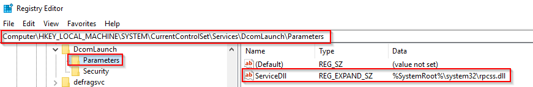

To view this information from within Process Hacker, right-click the svchost.exe process. In this case, it will be PID 748.

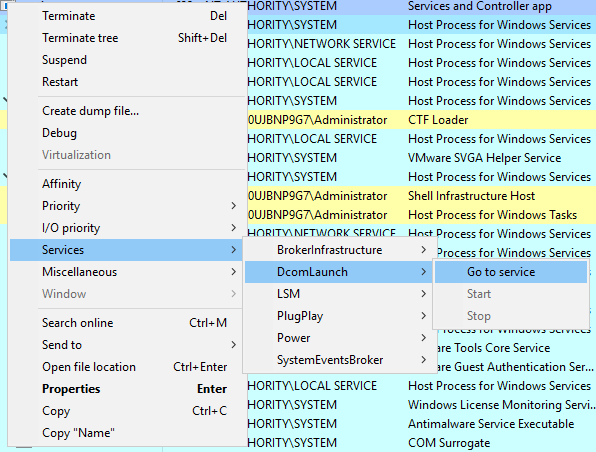

Right-click the service and select Properties. Look at Service DLL

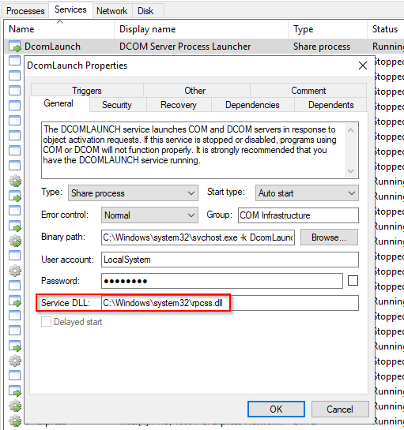

From the above screenshot, the Binary Path is listed.

Also, notice how it is structured. There is a key identifier in the binary path, and that identifier is `-k` . This is how a legitimate svchost.exe process is called. 

The `-k` parameter is for grouping similar services to share the same process. This concept was based on the OS design and implemented to reduce resource consumption. Starting from Windows 10 Version 1703, services grouped into host processes changed. On machines running more than 3.5 GB of memory, each service will run its own process. You can read more about this process here https://en.wikipedia.org/wiki/Svchost.exe.

Back to the key identifier (-k) from the binary path, in the above screen, the -k value is Dcomlaunch. Other services are running with the same binary path in the virtual machine attached to this room.


Each will have a different value for ServiceDLL. Let's take LSM as an example and inspect the value for ServiceDLL.

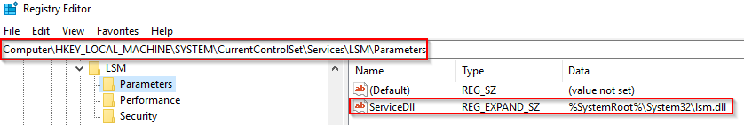


Since svchost.exe will always have multiple running processes on any Windows system, this process has been a target for malicious use. Adversaries create malware to masquerade as this process and try to hide amongst the legitimate svchost.exe processes. They can name the malware svchost.exe or misspell it slightly, such as scvhost.exe. By doing so, the intention is to go under the radar. Another tactic is to install/call a malicious service (DLL).  

Extra reading - Hexacorn Blog https://www.hexacorn.com/blog/2015/12/18/the-typographical-and-homomorphic-abuse-of-svchost-exe-and-other-popular-file-names/

### What is normal?

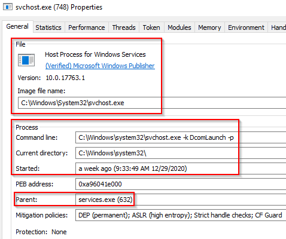

Image Path: %SystemRoot%\System32\svchost.exe
Parent Process: services.exe
Number of Instances: Many
User Account: Varies (SYSTEM, Network Service, Local Service) depending on the svchost.exe instance. In Windows 10, some instances run as the logged-in user.
Start Time: Typically within seconds of boot time. Other instances of svchost.exe can be started after boot.

### What is unusual?

-    A parent process other than services.exe
-    Image file path other than C:\Windows\System32
-    Subtle misspellings to hide rogue processes in plain sight
-    The absence of the -k parameter


## Q & A

Q What single letter parameter should always be visible in the Command line or Binary path?

A k


# lsass.exe

Per Wikipedia, "Local Security Authority Subsystem Service (LSASS) is a process in Microsoft Windows operating systems that is responsible for enforcing the security policy on the system. It verifies users logging on to a Windows computer or server, handles password changes, and creates access tokens. It also writes to the Windows Security Log."

It creates security tokens for SAM (Security Account Manager), AD (Active Directory), and NETLOGON. It uses authentication packages specified in `HKLM\System\CurrentControlSet\Control\Lsa`.

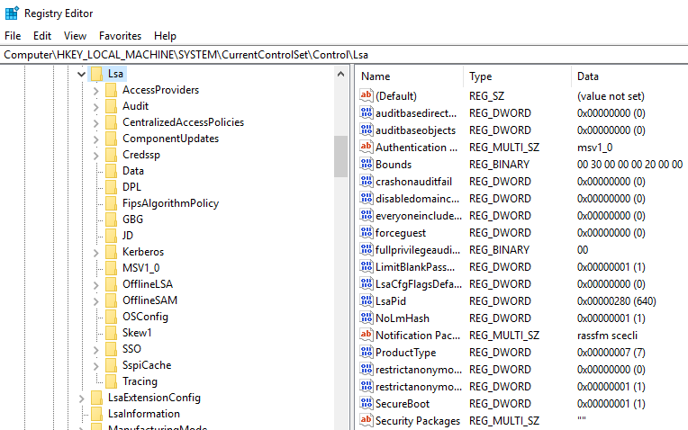

Lsass.exe is another process adversaries target. Common tools such as mimikatz are used to dump credentials, or adversaries mimic this process to hide in plain sight. Again, they do this by either naming their malware by this process name or simply misspelling the malware slightly. 

Extra reading:  How LSASS is maliciously used and additional features that Microsoft has put into place to prevent these attacks. https://yungchou.wordpress.com/2016/03/14/an-introduction-of-windows-10-credential-guard/

### What is normal?

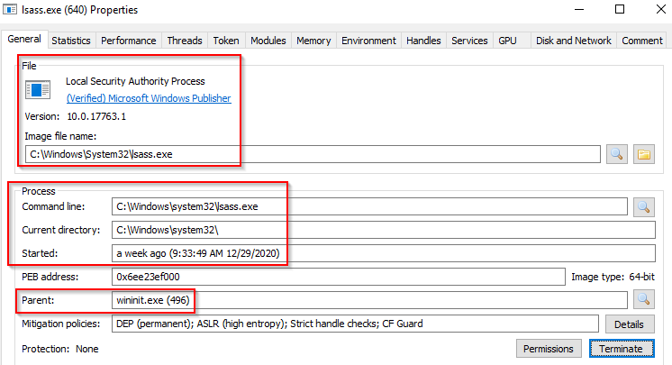

Image Path:  %SystemRoot%\System32\lsass.exe
Parent Process:  wininit.exe
Number of Instances:  One
User Account:  Local System
Start Time:  Within seconds of boot time

### What is unusual?

-    A parent process other than wininit.exe
-    Image file path other than C:\Windows\System32
-    Subtle misspellings to hide rogue processes in plain sight
-    Multiple running instances
-    Not running as SYSTEM


## Q & A

Q What is the parent process for LSASS?

A wininit.exe


# winlogon.exe

The Windows Logon, winlogon.exe, is responsible for handling the Secure Attention Sequence (SAS). It is the ALT+CTRL+DELETE key combination users press to enter their username & password. 

This process is also responsible for loading the user profile. It loads the user's NTUSER.DAT into HKCU, and userinit.exe loads the user's shell. Read more about this process here https://docs.microsoft.com/en-us/previous-versions/windows/it-pro/windows-2000-server/cc939862(v=technet.10)?redirectedfrom=MSDN .

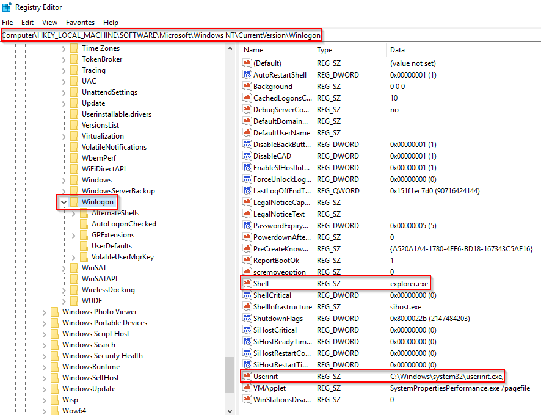

It is also responsible for locking the screen and running the user's screensaver, among other functions. You can read more about this process here https://en.wikipedia.org/wiki/Winlogon.

Remember from earlier sections, smss.exe launches this process along with a copy of csrss.exe within Session 1. 

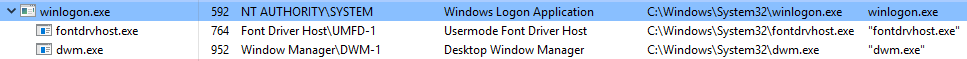

### What is normal?

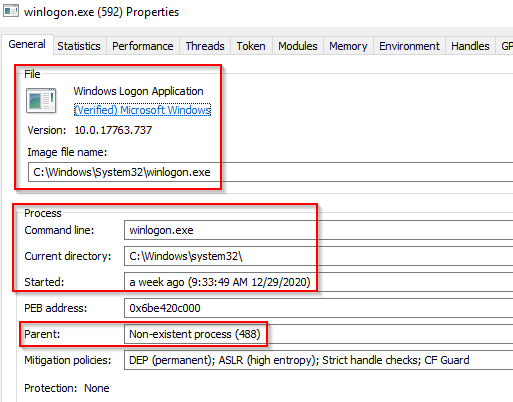

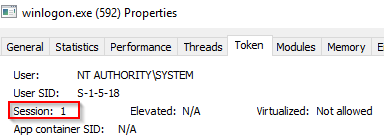

Image Path:  %SystemRoot%\System32\winlogon.exe
Parent Process:  Created by an instance of smss.exe that exits, so analysis tools usually do not provide the parent process name.
Number of Instances:  One or more
User Account:  Local System
Start Time:  Within seconds of boot time for the first instance (for Session 1). Additional instances occur as new sessions are created, typically through Remote Desktop or Fast User Switching logons.

### What is unusual?

-    An actual parent process. (smss.exe calls this process and self-terminates)
-    Image file path other than C:\Windows\System32
-    Subtle misspellings to hide rogue processes in plain sight
-    Not running as SYSTEM
-    Shell value in the registry other than explorer.exe


## Q & A

Q What is the non-existent parent process for winlogon.exe?

A smss.exe


# explorer.exe

The last process we'll look at is Windows Explorer, explorer.exe. This process gives the user access to their folders and files. It also provides functionality for other features, such as the Start Menu and Taskbar.

As mentioned previously, the Winlogon process runs userinit.exe, which launches the value in `HKLM\Software\Microsoft\Windows NT\CurrentVersion\Winlogon\Shell`. Userinit.exe exits after spawning explorer.exe. Because of this, the parent process is non-existent. 

There will be many child processes for explorer.exe.

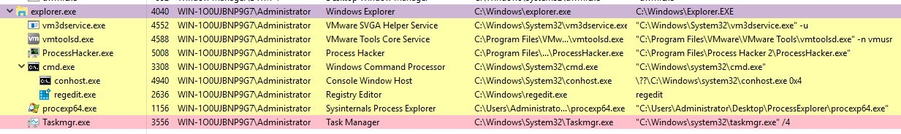

### What is normal?

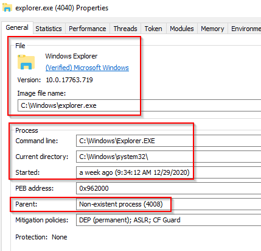

Image Path:  %SystemRoot%\explorer.exe
Parent Process:  Created by userinit.exe and exits
Number of Instances:  One or more per interactively logged-in user
User Account:  Logged-in user(s)
Start Time:  First instance when the first interactive user logon session begins

### What is unusual?

-    An actual parent process. (userinit.exe calls this process and exits)
-    Image file path other than C:\Windows
-    Running as an unknown user
-    Subtle misspellings to hide rogue processes in plain sight
-    Outbound TCP/IP connections

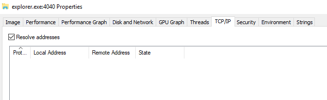

Note: The above image is the explorer.exe properties view from Process Explorer.


## Q & A

Q What is the non-existent process for explorer.exe?

A userinit.exe


# Conclusion

Understanding how the Windows operating system functions as a defender is vital. The Windows processes discussed in this room are core processes, and understanding how they usually operate can aid a defender in identifying unusual activity on the endpoint. 

With the introduction of Windows 10, new processes have been added to the list of core processes to know and understand normal behaviour.

Earlier it was mentioned that if Credential Guard is enabled on the endpoint, an additional process will be running, which will be a child process to wininit.exe, and that process is lsaiso.exe. This process works with lsass.exe to enhance password protection on the endpoint. 

Other processes with Windows 10 are RuntimeBroker.exe and taskhostw.exe (formerly taskhost.exe and taskhostex.exe). Please research these processes and any other processes you might be curious about to understand their purpose and their normal functionality. 

The information for this room is derived from multiple sources.

-    https://0xcybery.github.io/blog/Core-Processes-In-Windows-System
-    https://www.sans.org/posters/hunt-evil/
-    https://docs.microsoft.com/en-us/sysinternals/resources/windows-internals

Other links are provided throughout the room. Reading them at your own leisure to further your foundation and understanding of the core Windows processes is encouraged.

