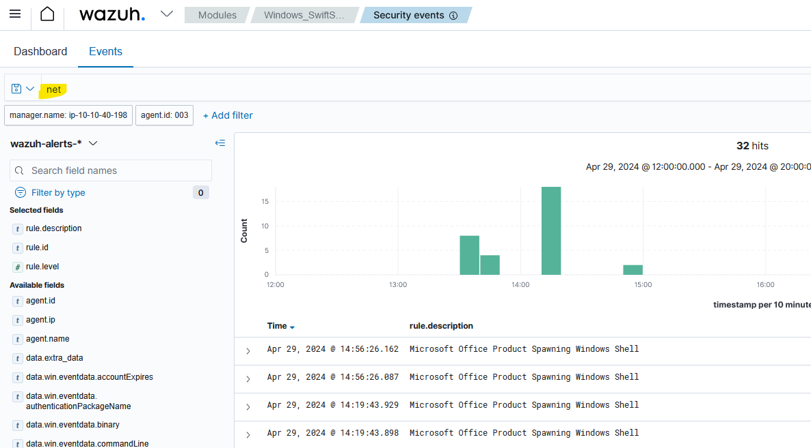

# Navigate Through the Endpoint Logs

## Scenario

Swiftspend Finance, the coolest fintech company in town, is on a mission to level up its cyber security game to keep those digital adversaries at bay and ensure their customers stay safe and sound.

Led by the tech-savvy Senior Security Engineer John Sterling, Swiftspend's latest project is about beefing up their endpoint monitoring using Wazuh and Sysmon. They've been running some tests to see how well their cyber guardians can sniff out trouble. And guess what? You're the cyber sleuth they've called in to crack the code!

The tests were run on Apr 29, 2024, between 12:00:00 and 20:00:00. As you dive into the logs, you'll look for any suspicious process shenanigans or weird network connections, you name it! Your mission? Unravel the mysteries within the logs and dish out some epic insights to fine-tune Swiftspend's defences.

## Machine Access

Click the Start Machine button attached to this task to start the VM. Give the machine about 5 minutes to fully set up the environment. Access the Wazuh Dashboard using your browser at https://LAB_WEB_URL.p.thmlabs.com and use the credentials listed below:

Username 	admin
Password	Mond*yM0nit0r7

Once logged in, navigate to the Security events module and use the saved query `Monday_Monitor` to access the logs.

## Q & A 

Q1 Initial access was established using a downloaded file. What is the file name saved on the host?

A1 SwiftSpend_Financial_Expenses.xlsm

Set the right time 


Search for `localhost`, the first entry shown has script to download a file:


Q2 What is the full command run to create a scheduled task?

A2 
```
\"cmd.exe\" /c \"reg add HKCU\\SOFTWARE\\ATOMIC-T1053.005 /v test /t REG_SZ /d cGluZyB3d3cueW91YXJldnVsbmVyYWJsZS50aG0= /f & schtasks.exe /Create /F /TN \"ATOMIC-T1053.005\" /TR \"cmd /c start /min \\\"\\\" powershell.exe -Command IEX([System.Text.Encoding]::ASCII.GetString([System.Convert]::FromBase64String((Get-ItemProperty -Path HKCU:\\\\SOFTWARE\\\\ATOMIC-T1053.005).test)))\" /sc daily /st 12:34\"
```

search for `scheduler`


check the events


Q3 What time is the scheduled task meant to run?

A3 12:34

Q4 What was encoded?

A4 ping www.youarevulnerable.thm

look for the encoded part


go to cyberchef


Q5 What password was set for the new user account?

A5 I_AM_M0NIT0R1NG

Search for the `net` command




Q6 What is the name of the .exe that was used to dump credentials?

A6 memotech.exe

search for `mimikatz` a popular credential dump tool


Q7 Data was exfiltrated from the host. What was the flag that was part of the data?

A7 THM{M0N1T0R_1$_1N_3FF3CT}


