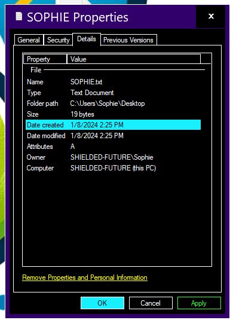
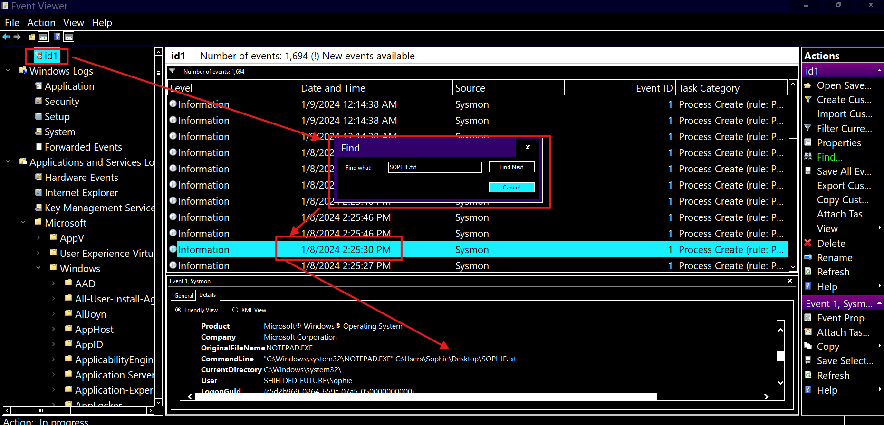
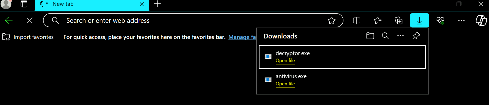
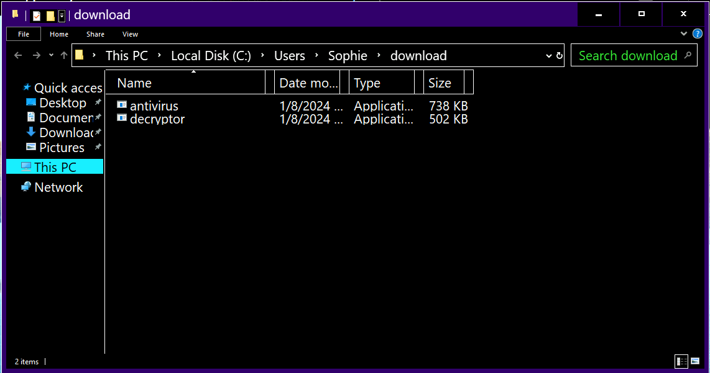
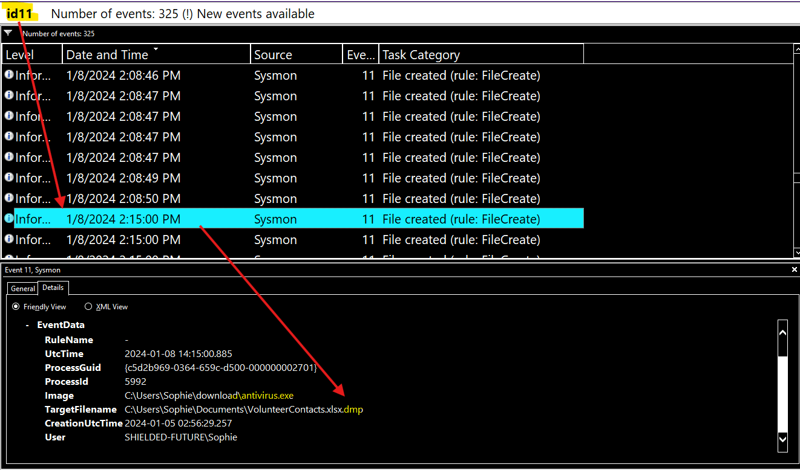
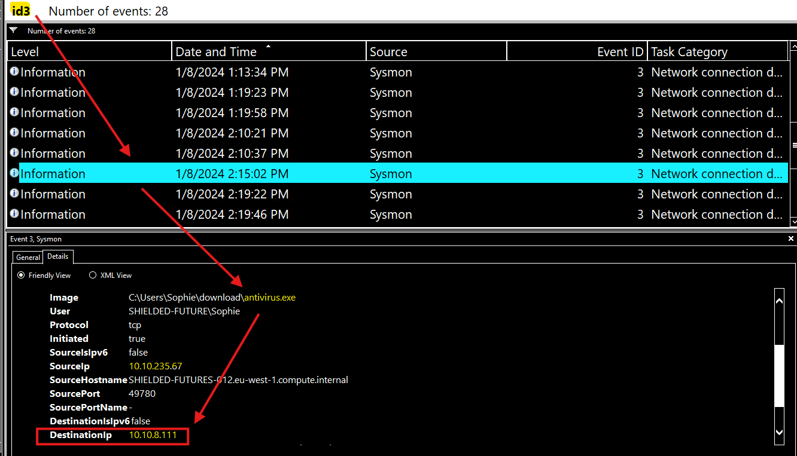
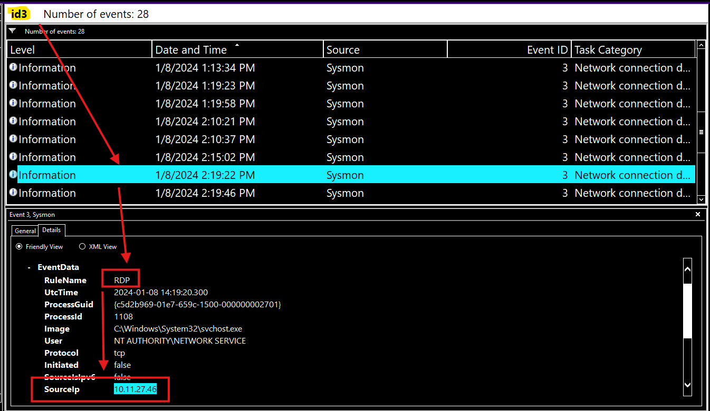
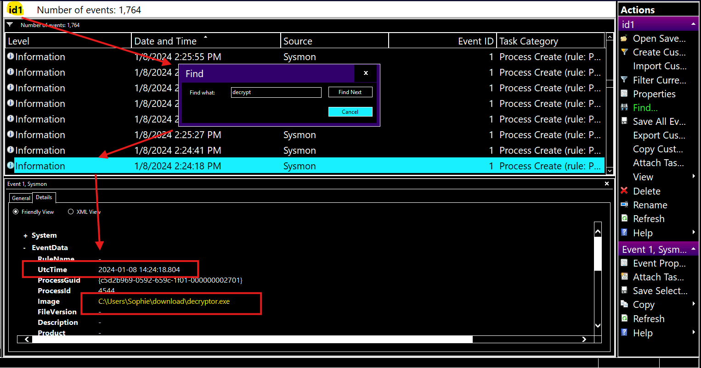

# Introduction

## A Mother's Plea

"Thanks for coming. I know you are busy with your new job, but I did not know who else to turn to."

"So I downloaded and ran an installer for an antivirus program I needed. After a while, I noticed I could no longer open any of my files. And then I saw that my wallpaper was different and contained a terrifying message telling me to pay if I wanted to get my files back. I panicked and got out of the room to call you. But when I came back, everything was back to normal."

"Except for one message telling me to check my Bitcoin wallet. But I don't even know what a Bitcoin is!"

"Can you help me check if my computer is now fine?"

## Connecting to the Machine

Start the virtual machine in split-screen view by clicking on the green "Start Machine" button on the upper right section of this task. If the VM is not visible, use the blue "Show Split View" button at the top-right of the page. Alternatively, you can connect to the VM using the credentials below via "Remote Desktop".

Username	sophie
Password	fluffy1960
IP	        MACHINE_IP

"Oh, the password doesn't work? Wait, I have it written somewhere. Uhmm... Try this:"

Username	sophie
Password	fluffy19601234!
IP	        MACHINE_IP

# The Message

"So, as soon as you finish logging in to the computer, you'll see a file on the desktop addressed to me."

"I have no idea why that message is there and what it means. Maybe you do?"

## Q & A

Q! What is the full path of the text file containing the "message"?

A1 C:\Users\Sophie\Desktop\SOPHIE.txt

Q2 What program was used to create the text file?

A2 notepad.exe

Q3 What is the time of execution of the process that created the text file? Timezone UTC (Format YYYY-MM-DD hh:mm:ss)

A3 2024-01-08 14:25:30

The image above does not provide detailed info so:

Open Event Viewer, Go to Sysmon>Operational, Filter by ID 1 which is Process Created, and then "Find" SOPHIE.txt

# Something Wrong

"I swear something went wrong with my computer when I ran the installer. Suddenly, my files could not be opened, and the wallpaper changed, telling me to pay."

"Wait, are you telling me that the file I downloaded is a virus? But I downloaded it from Google!"

## Q & A

Q1 What is the filename of this "installer"? (Including the file extension)

A1 antivirus.exe

Q2 What is the download location of this installer?

A2 C:\Users\Sophie\download

Q3 The installer encrypts files and then adds a file extension to the end of the file name. What is this file extension?

A3 .dmp

Q4 The installer reached out to an IP. What is this IP?

A4 10.10.8.111

Create a new view for ID 3 Network Connection

# Back to Normal

"So what happened to the virus? It does seem to be gone since all my files are back."

## Q & A

Q1 The threat actor logged in via RDP right after the “installer” was downloaded. What is the source IP?

A1 10.11.27.46

Q2 This other person downloaded a file and ran it. When was this file run? Timezone UTC (Format YYYY-MM-DD hh:mm:ss)

A2 2024-01-08 14:24:18

We already saw the name of the file "decryptor.exe" on the "download" folder so let's Find it

# Doesn't Make Sense

"So you're telling me that someone accessed my computer and changed my files but later undid the changes?"

"That doesn't make any sense. Why infect my machine and clean it afterwards?"

"Can you help me make sense of this?"

Arrange the following events in sequential order from 1 to 7, based on the timeline in which they occurred.

## Q & A

Q1 After seeing the ransomware note, Sophie ran out and reached out to you for help.

A1 3

Q2 Sophie downloaded the malware and ran it.

A2 1

Q3 After all the files are restored, the intruder left the desktop telling Sophie to check her Bitcoin.

A3 6

Q4 The intruder realized he infected a charity organization. He then downloaded a decryptor and decrypted all the files.

A4 5

Q5 The downloaded malware encrypted the files on the computer and showed a ransomware note.

A5 2

Q6 While Sophie was away, an intruder logged into Sophie's machine via RDP and started looking around.

A6 4

Q7 Sophie and I arrive on the scene to investigate. At this point, the intruder was gone.

A7 7

# Conclusion

"Adelle from Finance just called me. She says that someone just donated a huge amount of bitcoin to our charity's account!"

"Could this be our intruder? His malware accidentally infected our systems, found the mistake, and retracted all the changes?"

"Maybe he had a change of heart?"

Yeah, possibly.

