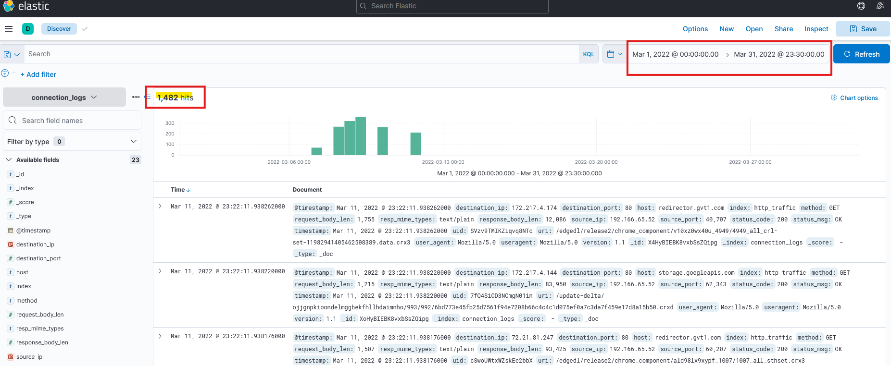
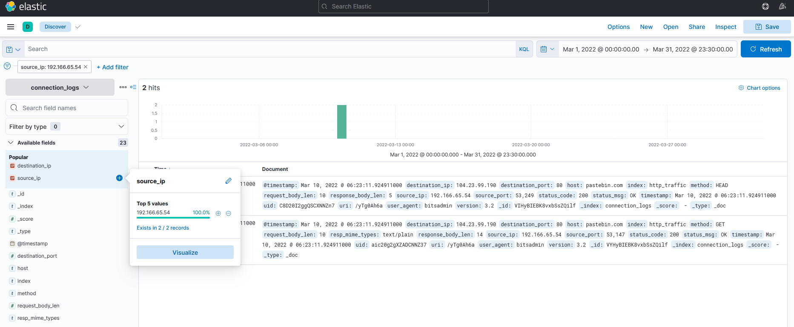
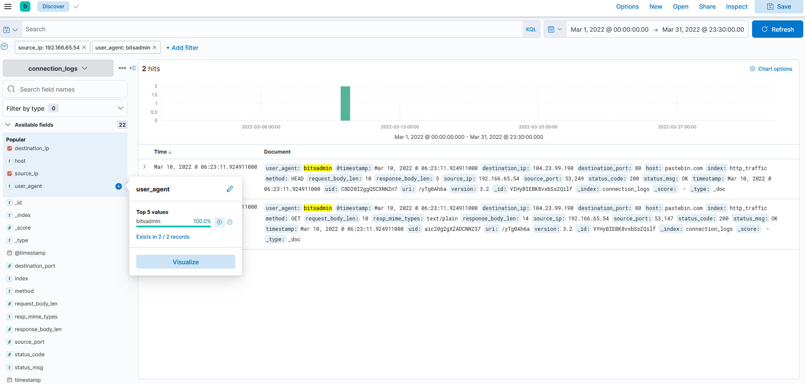
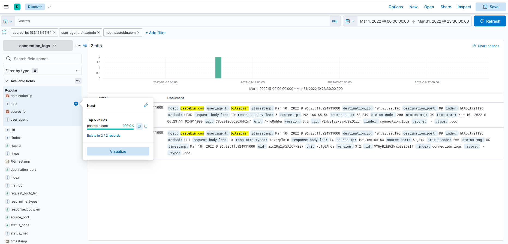
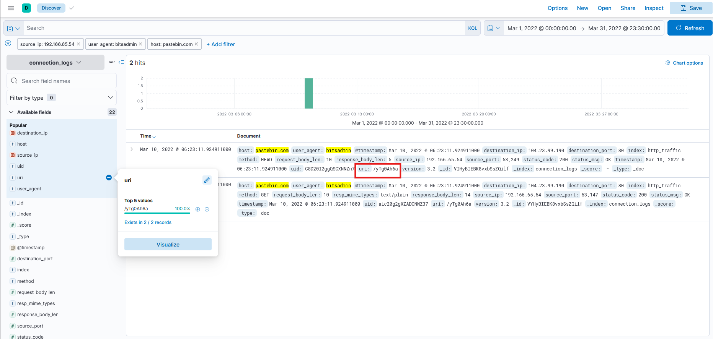
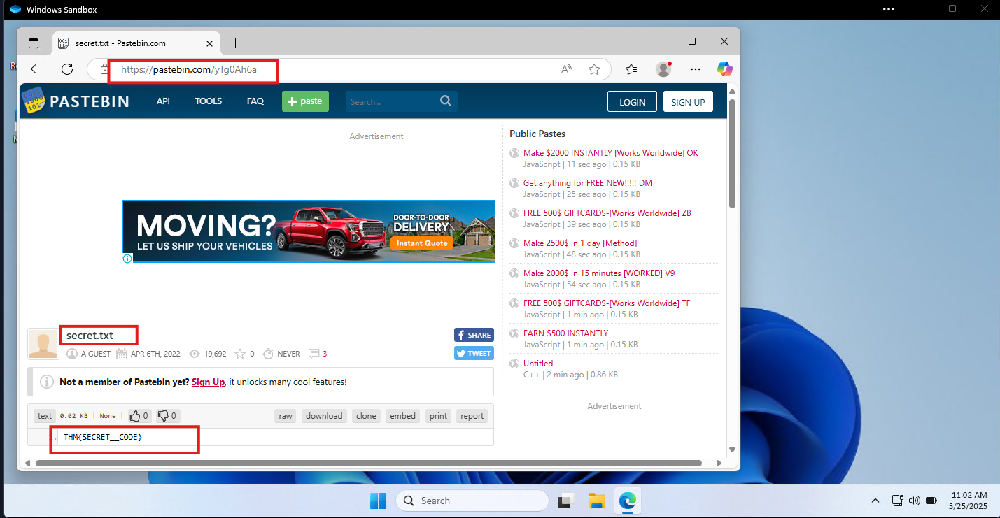

# In this challenge room, we will take a simple challenge to investigate an alert by IDS regarding a potential C2 communication.
Room Machine

Before moving forward, deploy the machine. When you deploy the machine, it will be assigned an IP Machine IP: MACHINE_IP. The machine will take up to 3-5 minutes to start. Use the following credentials to log in and access the logs in the Discover tab.

Username: Admin

Password: elastic123

# Scenario

During normal SOC monitoring, Analyst John observed an alert on an IDS solution indicating a potential C2 communication from a user Browne from the HR department. A suspicious file was accessed containing a malicious pattern THM:{ ________ }. A week-long HTTP connection logs have been pulled to investigate. Due to limited resources, only the connection logs could be pulled out and are ingested into the connection_logs index in Kibana.

Our task in this room will be to examine the network connection logs of this user, find the link and the content of the file, and answer the questions.

## Q & A

Q1 How many events were returned for the month of March 2022?

A1 1482

Q2 What is the IP associated with the suspected user in the logs?

A2 192.166.65.54

Q3 The user’s machine used a legit windows binary to download a file from the C2 server. What is the name of the binary?

A3 bitsadmin

Q4 The infected machine connected with a famous filesharing site in this period, which also acts as a C2 server used by the malware authors to communicate. What is the name of the filesharing site?

A4 pastebin.com

Q5 What is the full URL of the C2 to which the infected host is connected?

A5 pastebin.com/yTg0Ah6a

Q6 A file was accessed on the filesharing site. What is the name of the file accessed?

A6 secret.txt 

Q7 The file contains a secret code with the format THM{_____}.

A7 THM{SECRET__CODE}

