# Introduction

Splunk is one of the leading SIEM solutions in the market that provides the ability to collect, analyze and correlate the network and machine logs in real-time. In this room, we will explore the basics of Splunk and its functionalities and how it provides better visibility of network activities and help in speeding up the detection.

Learning Objective and Pre-requisites

If you are new to SIEM, please complete the Introduction to SIEM. This room covers the following learning objectives:

-    Splunk overview
-    Splunk components and how they work
-    Different ways to ingest logs
-    Normalization of logs

# Connect with the Lab

 Room Machine

 

Before moving forward , simply press the green Start Machine button on the top-right of this task indicated by the arrow on the right: 

Once deployed, a card will appear at the top of the room, showing the IP address assigned to the Machine.

Splunk Instance can be accessed by copy and pasting the MACHINE_IP into the web browser on the AttackBox, or via the VPN at http://MACHINE_IP . The machine will take up to 3-5 minutes to start.

# Splunk Components

Splunk has three main components, namely Forwarder, Indexer, and Search Head. These components are explained below:

## Splunk Forwarder

Splunk Forwarder is a lightweight agent installed on the endpoint intended to be monitored, and its main task is to collect the data and send it to the Splunk instance. It does not affect the endpoint's performance as it takes very few resources to process. Some of the key data sources are:

-    Web server generating web traffic.
-    Windows machine generating Windows Event Logs, PowerShell, and Sysmon data.
-    Linux host generating host-centric logs.
-    Database generating DB connection requests, responses, and errors.

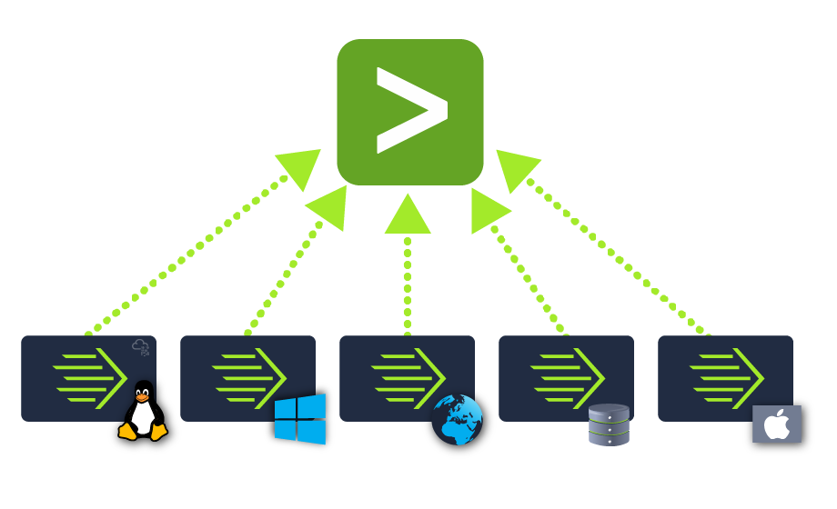

## Splunk Indexer

Splunk Indexer plays the main role in processing the data it receives from forwarders. It takes the data, normalizes it into field-value pairs, determines the datatype of the data, and stores them as events. Processed data is easy to search and analyze.

## Search Head

Splunk Search Head is the place within the Search & Reporting App where users can search the indexed logs as shown below. When the user searches for a term or uses a Search language known as Splunk Search Processing Language, the request is sent to the indexer and the relevant events are returned in the form of field-value pairs.

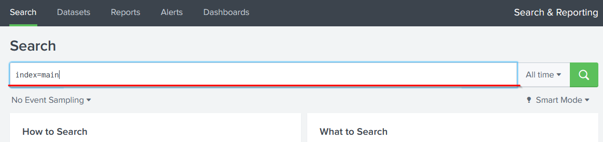

Search Head also provides the ability to transform the results into presentable tables, visualizations like pie-chart, bar-chart and column-chart, as shown below:

## Q & A

Which component is used to collect and send data over the Splunk instance?

Forwarder

# Navigating Splunk

##  Splunk Bar

When you access Splunk, you will see the default home screen identical to the screenshot below.

Let's look at each section, or panel, that makes up the home screen. The top panel is the Splunk Bar (below image). 

In the Splunk Bar, you can see system-level messages ( Messages ), configure the Splunk instance ( Settings ), review the progress of jobs ( Activity ), miscellaneous information such as tutorials ( Help ), and a search feature ( Find ). 

The ability to switch between installed Splunk apps instead of using the Apps panel  can be achieved from the Splunk Bar, like in the image below. 

##  Apps Panel

 

Next is the Apps Panel .  In this panel, you can see the apps installed for the Splunk instance. 

The default app for every Splunk installation is Search & Reporting .  

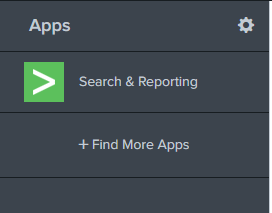

##  Explore Splunk

The next section is  Explore Splunk . This panel contains quick links to add data to the Splunk instance, add new Splunk apps, and access the Splunk documentation

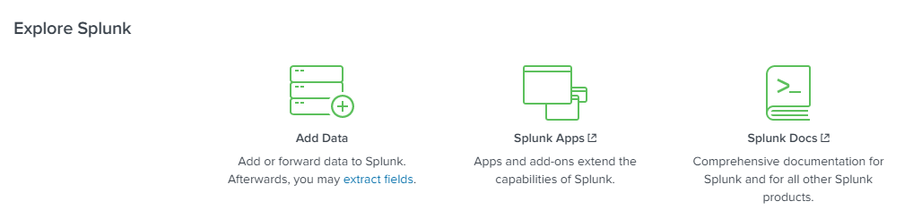

##  Splunk Dashboard

The last section is the Home Dashboard . By default, no dashboards are displayed. You can choose from a range of dashboards readily available within your Splunk instance. You can select a dashboard from the dropdown menu or by visiting the dashboards listing page .

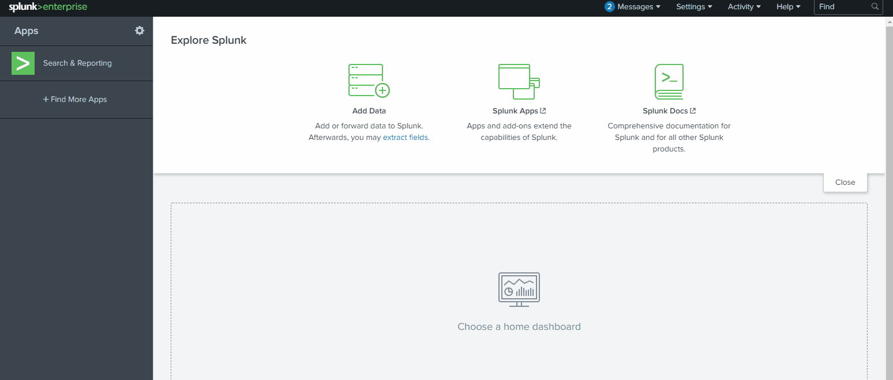

You can also create dashboards and add them to the Home Dashboard. The dashboards you create can be viewed isolated from the other dashboards by clicking on the Yours tab.

Please review the Splunk documentation on Navigating Splunk https://docs.splunk.com/Documentation/Splunk/8.1.2/SearchTutorial/NavigatingSplunk

## Q & A

In the Add Data tab, which option is used to collect data from files and ports?

Monitor

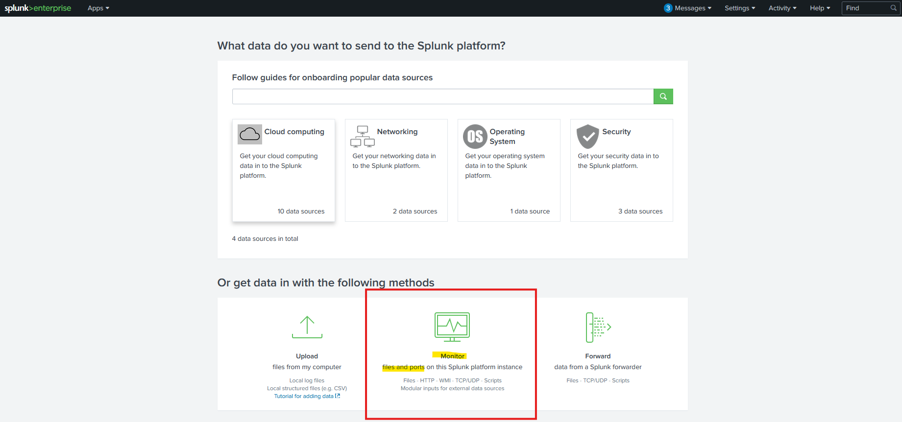

# Adding Data 

Splunk can ingest any data. As per the Splunk documentation, when data is added to Splunk, the data is processed and transformed into a series of individual events. 

The data sources can be event logs, website logs, firewall logs, etc.

Data sources are grouped into categories. Below is a chart listing from the Splunk documentation detailing each data source category.

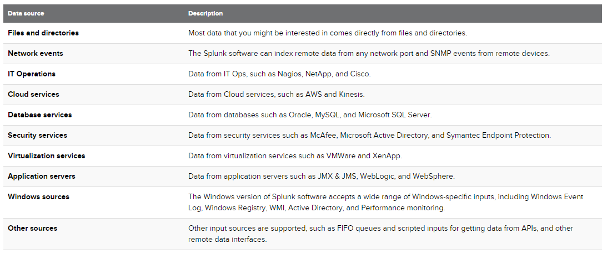

In this room, we're going to focus on VPN logs. When we click on the Add Data link (from the Splunk home screen), we're presented with the following screen. 

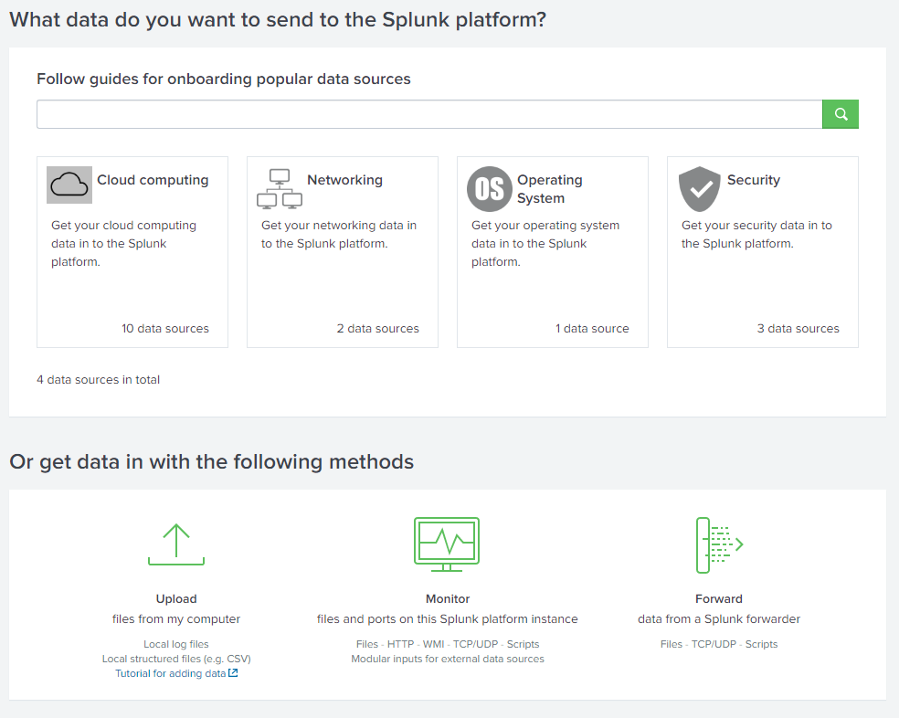

We will use the Upload Option to upload the data from our local machine. Download the attached log file and upload it on Splunk.

As shown above, it has a total of 5 steps to successfully upload the data.

1.    Select Source -> Where we select the Log source.
2.    Select Source Type -> Select what type of logs are being ingested.
3.    Input Settings ->Select the index where these logs will be dumped and hostName to be associated with the logs.
4.    Review -> Review all the gif
5.    Done -> Final step, where the data is uploaded successfully and ready to be analyzed.

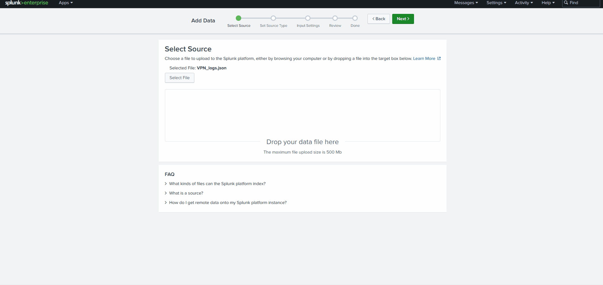

As you can see, there are A LOT more logs we can add to the Splunk instance, and Splunk supports various source types.

Download the attached log file "VPN_logs" and upload this file into the Splunk instance with the right source type.

Note: In case you are using the AttackBox, the file is available in the /root/Rooms/SplunkBasic/ directory.

## Q & A 

Q1 Upload the data attached to this task and create an index "VPN_Logs". How many events are present in the log file?

A1 2862

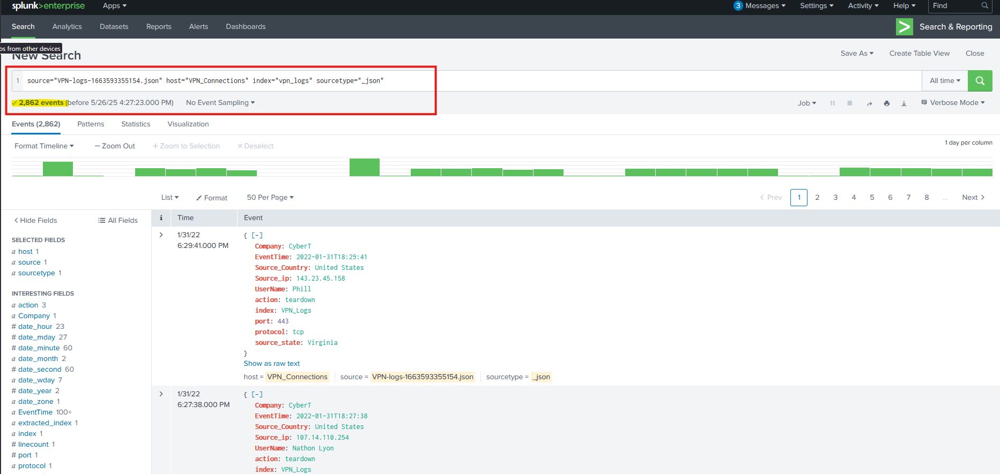

Q2 How many log events by the user Maleena are captured?

A2 60

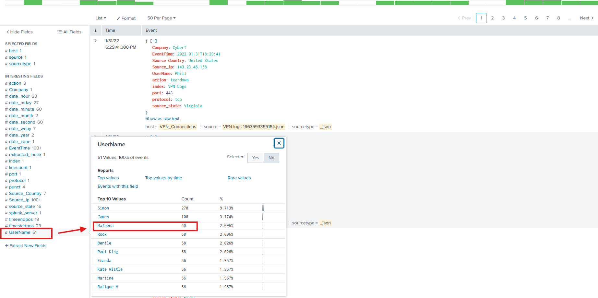

Q3 What is the name associated with IP 107.14.182.38?

A3 Smith

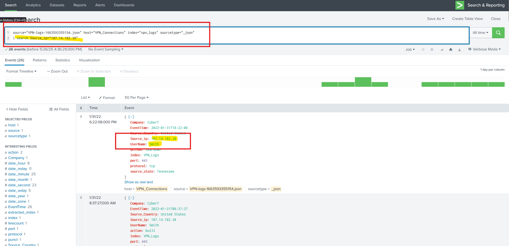

Q4 What is the number of events that originated from all countries except France?

A4 2814

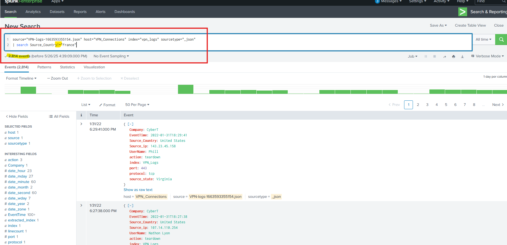

Q5 How many VPN Events were observed by the IP 107.3.206.58?

A5 14

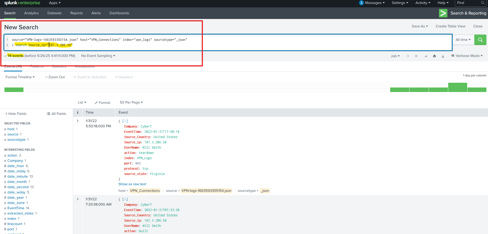

# Conclusion

In this room, we explored Splunk, its components, and how it works. Please check the following Splunk walkthrough and challenge rooms to understand how Splunk is effectively used in investigating the incidents.

-    Incident Handling with Splunk
-    Investigating With Splunk
-    Benign - Challenge
-    PoshEclipse - Challenge

