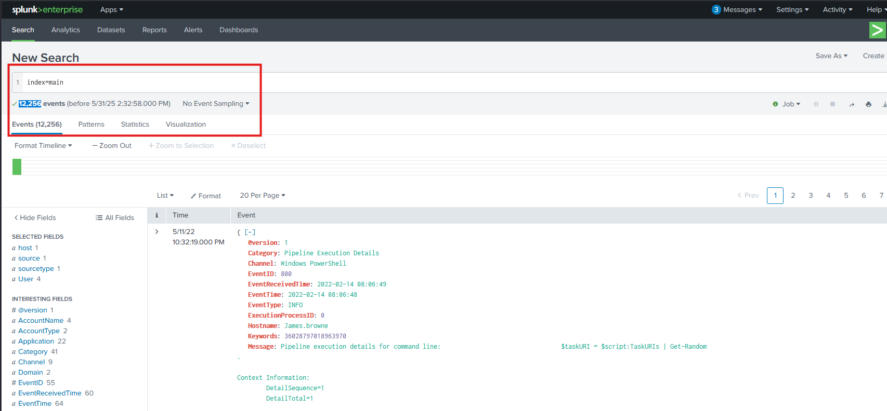

# Investigating with Splunk

SOC Analyst Johny has observed some anomalous behaviours in the logs of a few windows machines. It looks like the adversary has access to some of these machines and successfully created some backdoor. His manager has asked him to pull those logs from suspected hosts and ingest them into Splunk for quick investigation. Our task as SOC Analyst is to examine the logs and identify the anomalies.

To learn more about Splunk and how to investigate the logs, look at the rooms splunk101 and splunk201.

## Room Machine
Before moving forward, deploy the machine. When you deploy the machine, it will be assigned an IP Machine IP: MACHINE_IP. You can visit this IP from the VPN or the Attackbox. The machine will take up to 3-5 minutes to start. All the required logs are ingested in the index main.

## Q & A

Q1 How many events were collected and Ingested in the index main?

A1 12256

Q2 On one of the infected hosts, the adversary was successful in creating a backdoor user. What is the new username?

A2 A1berto

Q3 On the same host, a registry key was also updated regarding the new backdoor user. What is the full path of that registry key?

A3 HKLM\SAM\SAM\Domains\Account\Users\Names\A1berto

Q4 Examine the logs and identify the user that the adversary was trying to impersonate.

A4 Alberto

Q5 What is the command used to add a backdoor user from a remote computer?

A5 "C:\windows\System32\Wbem\WMIC.exe" /node:WORKSTATION6 process call create "net user /add A1berto paw0rd1"

Q6 How many times was the login attempt from the backdoor user observed during the investigation?

A6 0

Q7 What is the name of the infected host on which suspicious Powershell commands were executed?

A7 James.browne

Q8 PowerShell logging is enabled on this device. How many events were logged for the malicious PowerShell execution?

A8 79

Q9 An encoded Powershell script from the infected host initiated a web request. What is the full URL?

A9 hxxp[://]10[.]10[.]10[.]5/news[.]php

