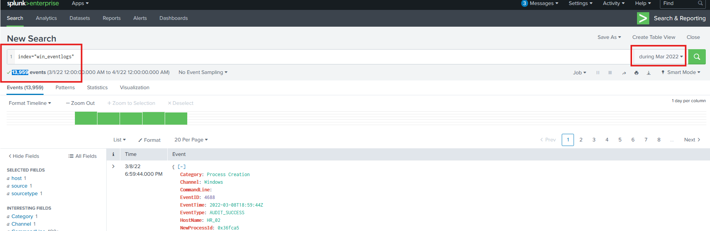
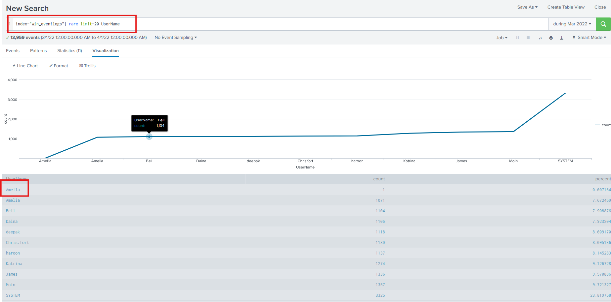
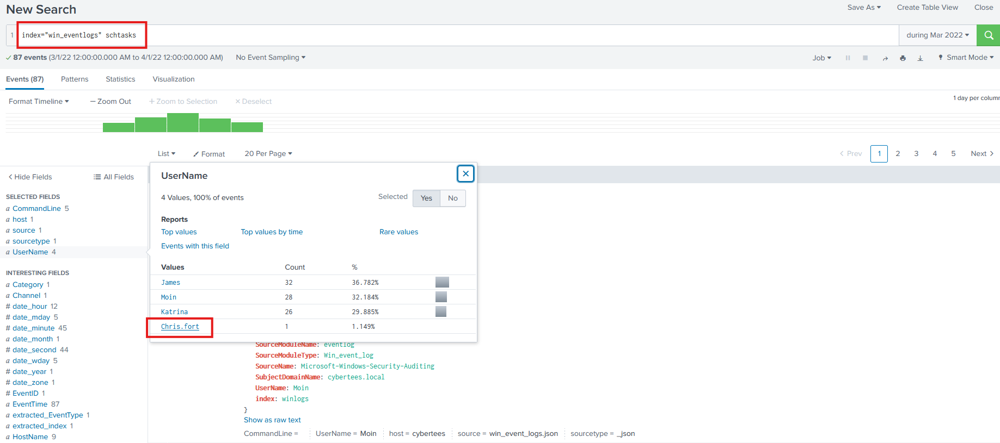
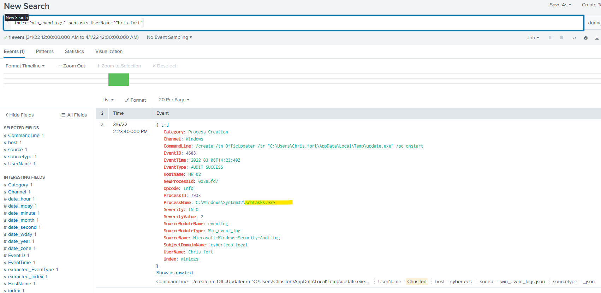
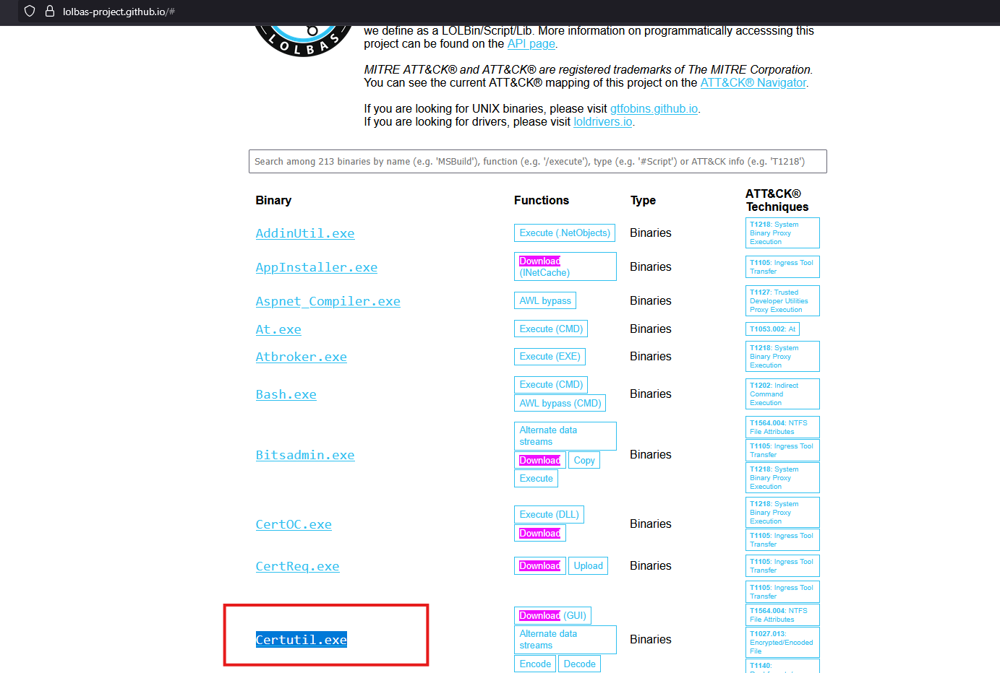
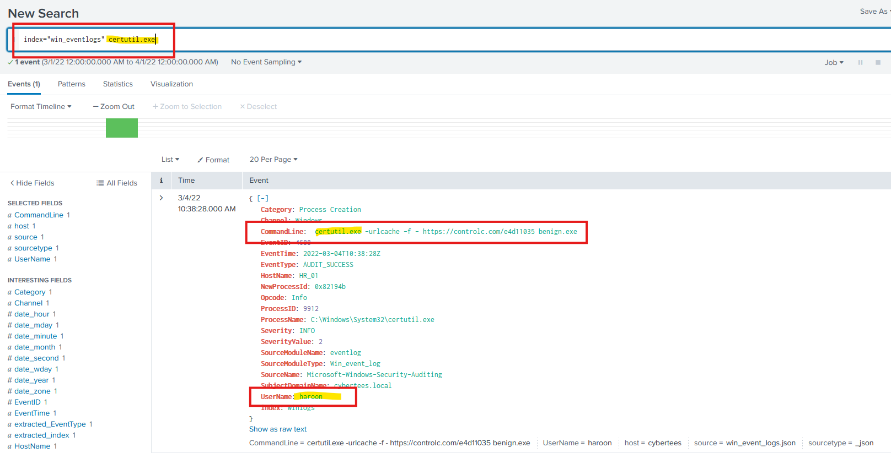
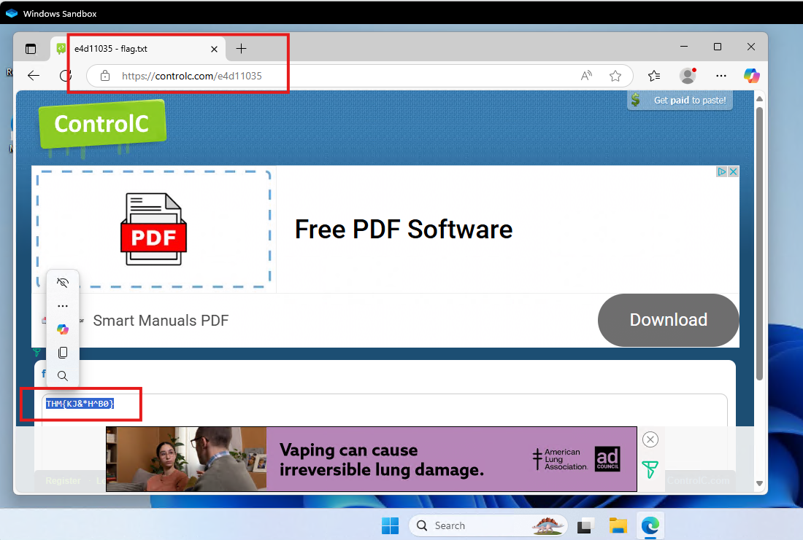

# Introduction

We will investigate host-centric logs in this challenge room to find suspicious process execution. To learn more about Splunk and how to investigate the logs, look at the rooms splunk101 and splunk201.

Room Machine

Before moving forward, deploy the machine. When you deploy the machine, it will be assigned an IP. Access this room via the AttackBox, or via the VPN at `MACHINE_IP`. The machine will take up to 3-5 minutes to start. ll the required logs are ingested in the index `win_eventlogs`.

# Scenario: Identify and Investigate an Infected Host

One of the client’s IDS indicated a potentially suspicious process execution indicating one of the hosts from the HR department was compromised. Some tools related to network information gathering / scheduled tasks were executed which confirmed the suspicion. Due to limited resources, we could only pull the process execution logs with Event ID: 4688 and ingested them into Splunk with the index win_eventlogs for further investigation. 

## About the Network Information

The network is divided into three logical segments. It will help in the investigation.

IT Department

-    James
-    Moin
-    Katrina

HR department

-    Haroon
-    Chris
-    Diana

Marketing department

-    Bell
-    Amelia
-    Deepak

## Q & A

Q1 How many logs are ingested from the month of March, 2022?

A1 13959

Q2 Imposter Alert: There seems to be an imposter account observed in the logs, what is the name of that user?

A2 Amel1a

Q3 Which user from the HR department was observed to be running scheduled tasks?

A3 Chris.fort

Q4 Which user from the HR department executed a system process (LOLBIN) to download a payload from a file-sharing host.

A4 haroon

Q5 To bypass the security controls, which system process (lolbin) was used to download a payload from the internet?

A5 certutil.exe

Q6 What was the date that this binary was executed by the infected host? format (YYYY-MM-DD)

A6 2022-03-04

Q7 Which third-party site was accessed to download the malicious payload?

A7 controlc.com

Q8 What is the name of the file that was saved on the host machine from the C2 server during the post-exploitation phase?

A8 benign.exe

Q9 The suspicious file downloaded from the C2 server contained malicious content with the pattern THM{..........}; what is that pattern?

A9 THM{KJ&*H^B0}

Q10 What is the URL that the infected host connected to?

A10 https://controlc.com/e4d11035

