# Introduction

## What is Autopsy?

Autopsy is an open-source and powerful digital forensics platform. Several features within Autopsy have been developed with funding from the Department of Homeland Security Technology. You can read more about this here https://www.dhs.gov/science-and-technology/news/2017/12/12/snapshot-st-enhancing-autopsy-digital-forensics-tool.

The official description: "Autopsy is the premier open source forensics platform which is fast, easy-to-use, and capable of analysing all types of mobile devices and digital media. Its plug-in architecture enables extensibility from community-developed or custom-built modules. Autopsy evolves to meet the needs of hundreds of thousands of professionals in law enforcement, national security, litigation support, and corporate investigation." https://www.autopsy.com/

## Learning Objectives

-    Workflow of Autopsy Tool
-    Data Sources in Autopsy
-    Ingest Modules in Autopsy
-    User Interface and Visualization Tools in Autopsy

## Starting the Machine

Let’s start the virtual machine by pressing the Start Machine button below. The machine will start in split view.
In case the VM is not visible, use the blue Show Split View button at the top of the page. You can also connect with the machine via your own VPN-connected machine using the RDP credentials below:

Username 	administrator
Password 	letmein123!
IP 	MACHINE_IP

# Workflow Overview and Case Analysis

Before diving into Autopsy and analyzing data, there are a few steps to perform, such as identifying the data source and what Autopsy actions to perform with the data source. 

## Basic workflow

1.    Create/open the case for the data source you will investigate
2.    Select the data source you wish to analyze
3.    Configure the ingest modules to extract specific artifacts from the data source
4.    Review the artifacts extracted by the ingest modules
5.    Create the report

## Case Analysis | Create a New Case

To prepare a new case investigation, you need to create a case file from the data source. When you start the Autopsy, you will have three options. You can create a new case file using the New Case option. Once you click on the "New Case" option, the Case Information menu opens, where information about the case is populated.

-    Case Name: The name you wish to give to the case
-    Base Directory: The root directory that will store all the files specific to the case (the full path will be displayed)
-    Case Type: Specify whether this case will be local (Single-User) or hosted on a server where multiple analysts can review (Multi-User)

Note: In this room, the focus is on Single-User. Also, the room doesn't simulate a new case creation, and the given VM already has a sample case file on the Desktop (as demonstrated below) to practice covered Autopsy features.

The following screen is titled Optional Information and can be left blank for our purposes. In an actual forensic environment, you should fill out this information. Once you click "Finish", Autopsy will create a new case file from the given data source.

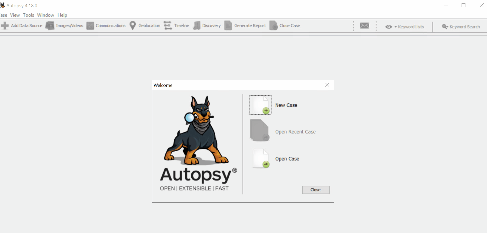

## Case Analysis | Open an Existing Case

The Autopsy can also open prebuilt case files. Note that supported data sources are discussed in the next task. This part will show how to create/open case files with Autopsy.

Note: Autopsy case files have a `.aut` file extension.

In this room, you will import a case. To open a case, select the "Open Case" option. Navigate to the case folder (located on the Desktop) and select the .aut file you wish to open. Next, Autopsy will process the case files and open the case.

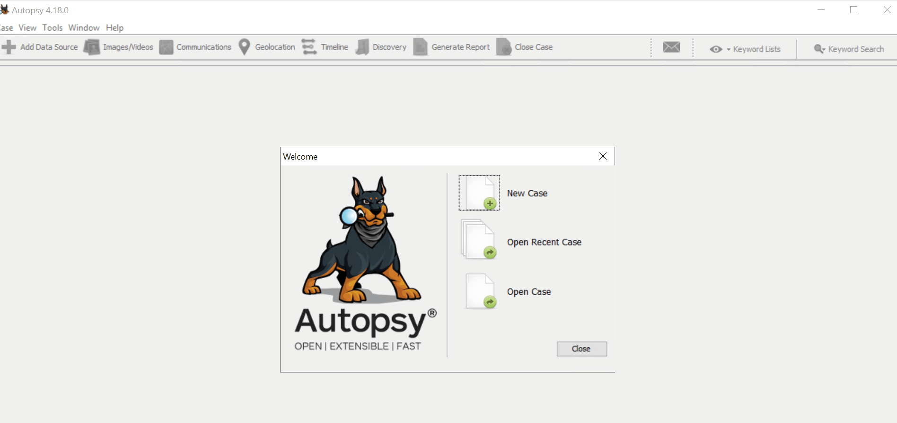

Note: If Autopsy cannot locate the disk image, a warning box will appear. At this point, you can point to the location of the disk image it's attempting to find, or you can click No; you can still analyze the data from the Autopsy case.

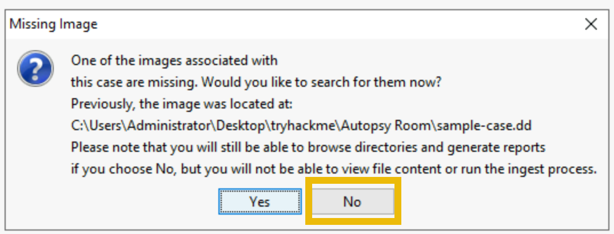

Once the case you wish to analyze is open, you are ready to start exploring the data. You can also identify the name of the case at the top left corner of the Autopsy window when the case is open. 

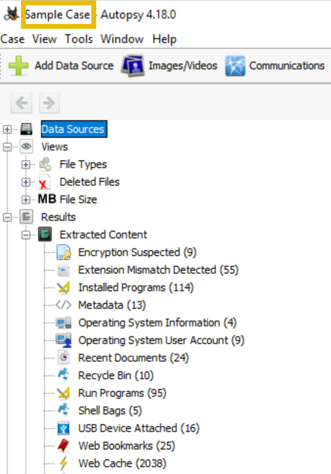

## Q & A

Q1 What is the file extension of the Autopsy files?

A1 .aut

Import the "Sample Case.aut" file (located on the Desktop) as shown in the task and continue to the next task.

# Data Sources

Autopsy can analyze multiple disk image formats. Before diving into the data analysis step, let's briefly cover the different data sources Autopsy can analyze. You can add data sources using the Add Data Source button. Available options are shown below.

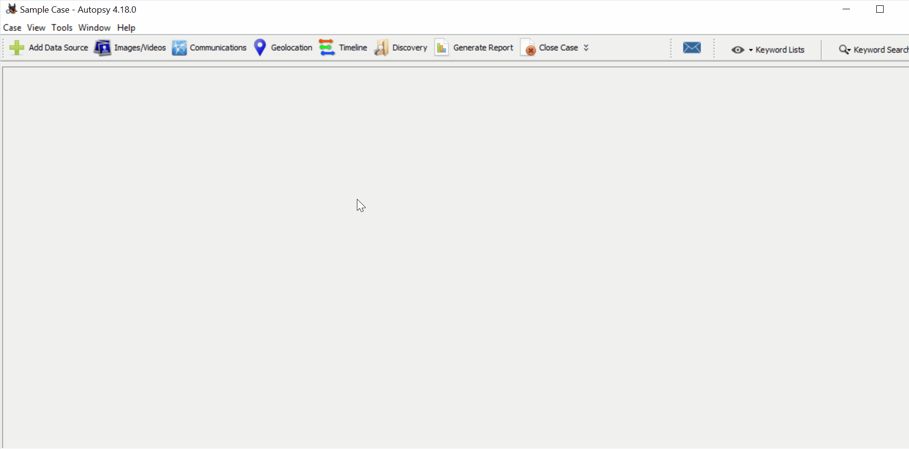

We will focus primarily on the Disk Image or VM File option in this room.

Supported Disk Image Formats:

-    Raw Single (For example: *.img, *.dd, *.raw, *.bin)
-    Raw Split (For example: *.001, *.002, *.aa, *.ab, etc)
-    EnCase (For example: *.e01, *.e02, etc)
-    Virtual Machines (For example: *.vmdk, *.vhd)

If there are multiple image files (e.g., E01, E02, E03, etc.), Autopsy only needs you to point to the first image file; it will handle the rest.  

Note: Refer to the Autopsy documentation to understand the other data sources that can be added to a case.  http://sleuthkit.org/autopsy/docs/user-docs/4.12.0/ds_page.html

## Q & A

Q1 What is the disk image name of the "e01" format?

A1 EnCase

# Ingest Modules

Essentially, Ingest Modules are Autopsy plug-ins. Each Ingest Module is designed to analyze and retrieve specific data from the drive. You can configure Autopsy to run specific modules during the source-adding stage or later by choosing the target data source available on the dashboard. By default, the Ingest Modules are configured to run on All Files, Directories, and Unallocated Space. You can change this setting during the module selecting step. You can track the process by clicking the bar in the lower right corner.

We have demonstrated two different approaches to using the ingest modules in this task.

### While Adding Data Sources

One of the ways to configure the ingest modules is to enable/disable them while adding a data source in Autopsy. This is a straightforward process, as you get this option while adding a data source. 

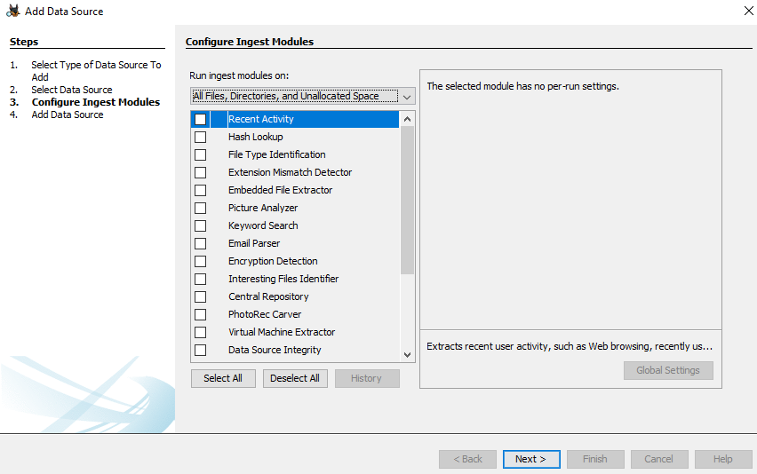

### After Adding Data Sources

Another method of configuring the ingest modules is configuring them on a pre-loaded disk. This can be done by following the steps given below:

1.    Open the "Run Ingest Modules" menu by right-clicking on the data source.
2.    Choose the modules to implement and click on the finish button.
3.    Track the progress of implementation.

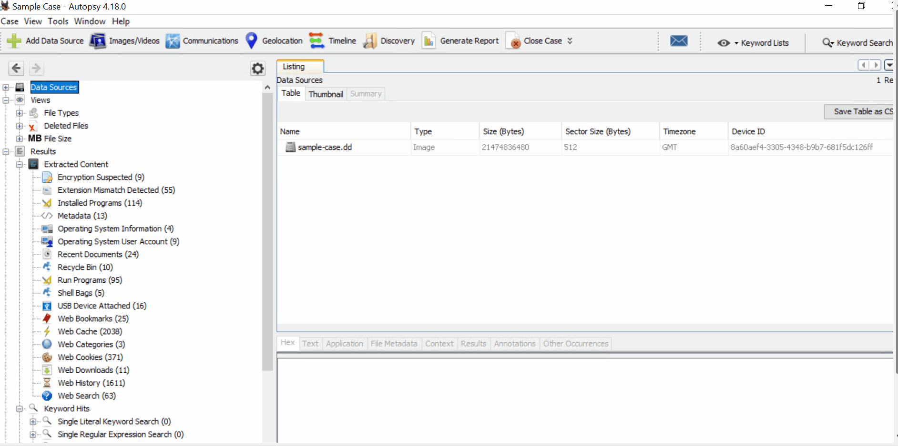

Note: Using ingest modules requires time to implement. Therefore, we will not cover ingest modules in this room. 

The results of any Ingest Module you select to run against a data source will populate the Results node in the Tree view, which is the left pane of the Autopsy user interface. Below is an example of using the Interesting Files Identifier ingest module. Note that the results depend on the dataset. If you choose a module to retrieve specific data that is unavailable in the drive, there will be no results.

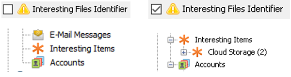

Drawing the attention back to the Configure Ingest Modules window, notice that some Ingest Modules have per-run settings and some do not. For example, the Keyword Search Ingest Module does not have per-run settings. In contrast, the Interesting Files Finder Ingest Module does. The yellow triangle represents the per-run settings option.

As Ingest Modules run, alerts may appear in the Ingest Inbox. Below is an example of the Ingest Inbox after a few Ingest Modules have completed running. 

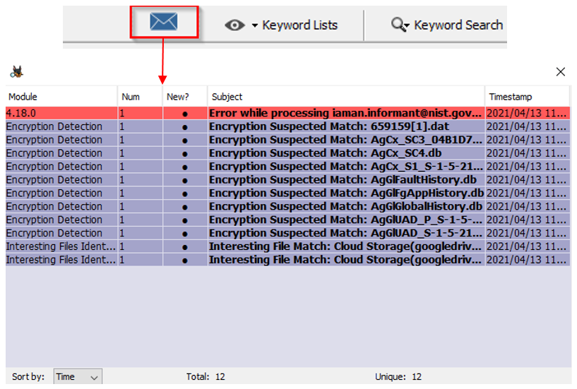

To learn more about Ingest Modules, you can read Autopsy documentation here http://sleuthkit.org/autopsy/docs/user-docs/4.12.0/ingest_page.html

# The User Interface I

Let's look at the Autopsy user interface, which is comprised of 5 primary areas:

## Tree Viewer

The Tree Viewer has five top-level nodes: 

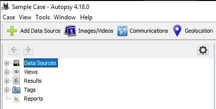

-    Data Sources- All the data will be organized as typically seen in a normal Windows File Explorer. 
-    Views- Files will be organized based on the file types, MIME types, file size, etc. 
-    Results- As mentioned earlier in the previous task, this is where the results from Ingest Modules will appear. 
-    Tags- It will display files and/or results that have been tagged (read more about tagging [here](http://sleuthkit.org/autopsy/docs/user-docs/4.12.0/tagging_page.html)).
-    Reports- It will display reports either generated by modules or the analyst (read more about reporting [here](http://sleuthkit.org/autopsy/docs/user-docs/4.12.0/reporting_page.html)).

Refer to the Autopsy documentation on the Tree Viewer for more information here http://sleuthkit.org/autopsy/docs/user-docs/4.12.0/tree_viewer_page.html. 

## Result Viewer

Note: Don't confuse the Results node (from the Tree Viewer) with the Result Viewer.

When a volume, file, folder, etc., is selected from the Tree Viewer, additional information about the selected item is displayed in the Result Viewer. For example, the sample case's data source is selected, and additional information is now visible in the Results Viewer.

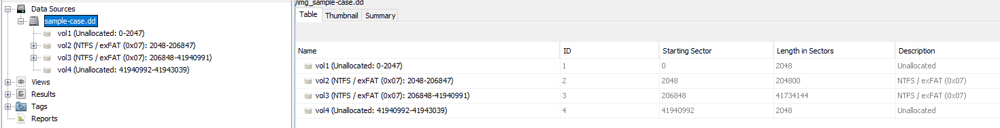

If a volume is selected, the Result Viewer's information will change to reflect the information in the local database for the selected volume. From within the Result Viewer, you can also extract any file if you right-click it and select the Extract File(s) option.

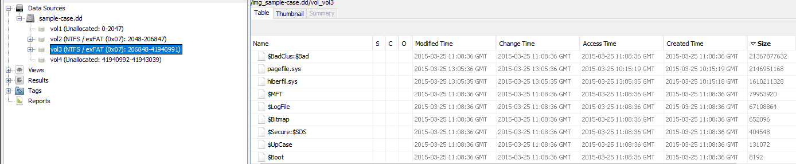

Notice that the Result Viewer pane has three tabs: Table, Thumbnail, and Summary. The above screenshots reflect the information displayed in the Table tab. The Thumbnail tab works best with image or video files. If the view of the above data is changed from Table to Thumbnail, not much information will be displayed. See below.

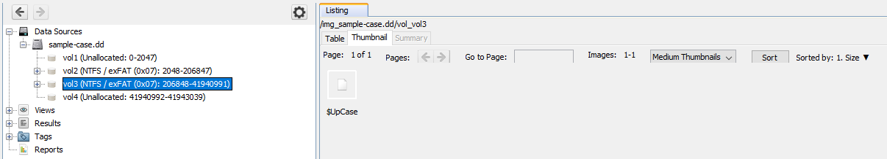

Volume nodes can be expanded, and an analyst can navigate the volume's contents like a typical Windows system.

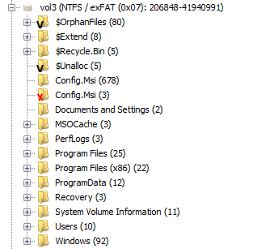

In the Views tree node, files are categorized by File Types: By Extension, By MIME Type, By Deleted Files, and By File Size.

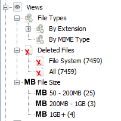

Tip: When it comes to File Types, pay attention to this section. An adversary can rename a file with a misleading file extension, so the file will be 'miscategorized' By Extension but will be categorized appropriately By MIME Type. Expand By Extension, and more children nodes appear, categorizing files further (see below).

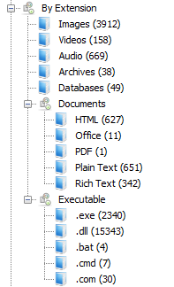

Refer to the Autopsy documentation on the Result Viewer for more information here http://sleuthkit.org/autopsy/docs/user-docs/4.12.0/result_viewer_page.html.

## Contents Viewer

If you click any folder or file from the Table tab in the Result Viewer, additional information is displayed in the Contents Viewer pane.

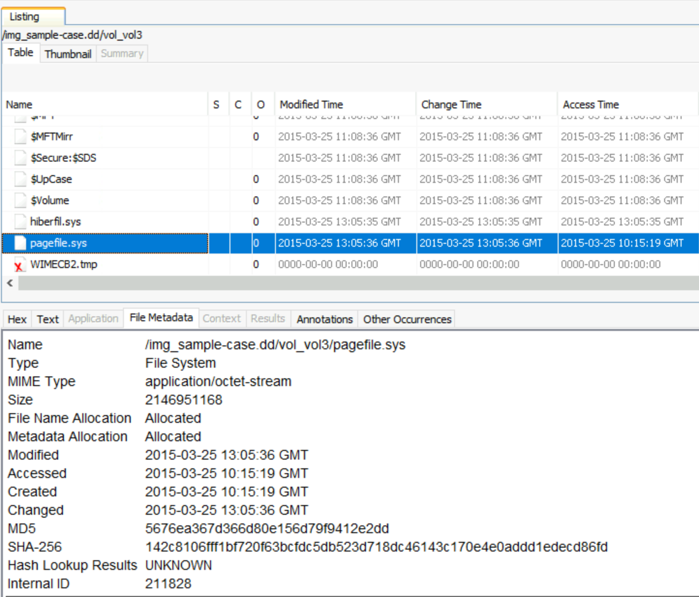

In the image given above, three columns might not be quickly understood for what they represent.

-    S = Score

The Score will show a red exclamation point for a folder/file marked/tagged as notable and a yellow triangle pointing downward for a folder/file marked/tagged as suspicious. An Ingest Module or the analyst can mark/tag these items.

-    C = Comment

If a yellow page is visible in the Comment column, it will indicate that there is a comment for the folder/file.

-    O = Occurrence

In a nutshell, this column will indicate how many times this file/folder has been seen in past cases (this will require the [Central Repository](http://sleuthkit.org/autopsy/docs/user-docs/4.12.0/central_repo_page.html))

Refer to the Autopsy documentation on the Contents Viewer for more information here http://sleuthkit.org/autopsy/docs/user-docs/4.12.0/content_viewer_page.html.

## Keyword Search

At the top right, you will find Keyword Lists and Keyword Search. With Keyword Search, an analyst can perform an AD-HOC keyword search. 

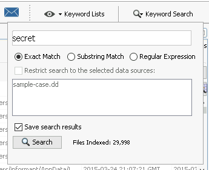

In the image above, the analyst searches for the word 'secret.' Below are the search results for this keyword.

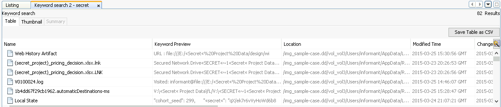

Refer to the Autopsy documentation for more information on performing keyword searches with either option. http://sleuthkit.org/autopsy/docs/user-docs/4.12.0/ad_hoc_keyword_search_page.html

## Status Area

Lastly, the Status Area is at the bottom right. When Ingest Modules run, a progress bar (along with the percentage completed) will be displayed in this area. If you click on the bar, more detailed information regarding the Ingest Modules is provided.

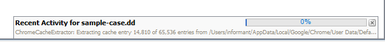

If the X (directly next to the progress bar) is clicked, a prompt will appear confirming if you wish to end/cancel the Ingest Modules.

Refer to the Autopsy documentation on the UI overview here http://sleuthkit.org/autopsy/docs/user-docs/4.12.0/uilayout_page.html. 

## Q & A

Q1 Expand the "Data Sources" option; what is the number of available sources?

A1 4

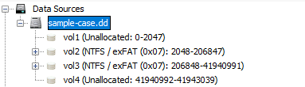

Q2 What is the number of the detected "Removed" files?
Removed files can be found under the "Recycle Bin" category.

A2 10

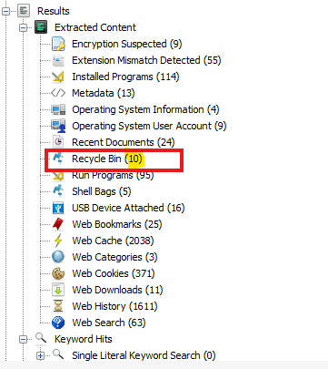

Q3 What is the filename found under the "Interesting Files" section?

A3 googledrivesync.exe

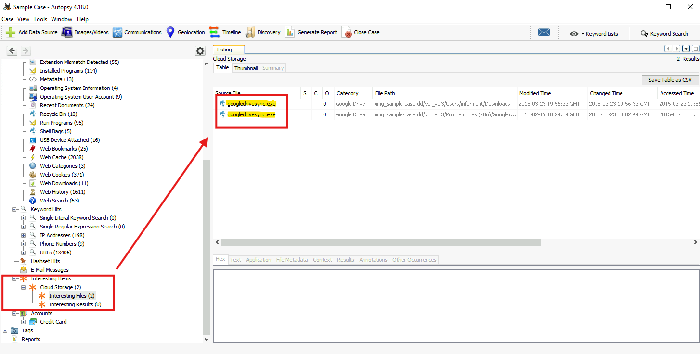

# The User Interface II

Let's look at where we can easily find summarised information. Summarised information can help analysts decide where to focus by evaluating available artifacts. It is suggested that you view the summary of the data sources before starting an investigation. This will give you a general idea about the system and artifacts.

## Data Sources Summary

The Data Sources Summary provides summarised info in nine different categories. Note that this is an overview of the total findings. If you want to dive deep into the findings and look for a specific artifact, you need to analyze each module separately using the Result Viewer shown in the previous task.

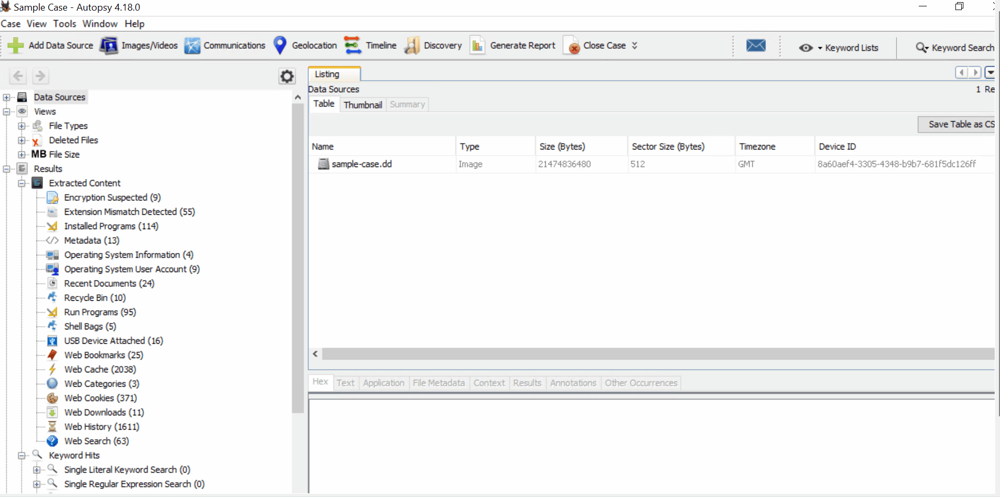

## Generate Report

You can create a report of your findings in multiple formats, enabling you to create data sheets for your investigation case. The report provides all the information listed under the Result Viewer pane. Reports can help you re-investigate the findings after finishing the live investigation. However, reports don't have additional search options, so you must manually find artifacts for the event of interest.

Tip: The Autopsy tool can be heavy for systems with low resources. Therefore, completing an investigation with Autopsy on low resources can be slow and painful. Browsing long results might end up with a system freeze. You can avoid that situation by using reports. You can use the tool to parse the data and generate the report, then continue to analyze through the generated report without a need for Autopsy. Note that it is always easier to conduct and manage an investigation with the GUI.

You can use the Generate Report option to create reports. The steps are shown below.

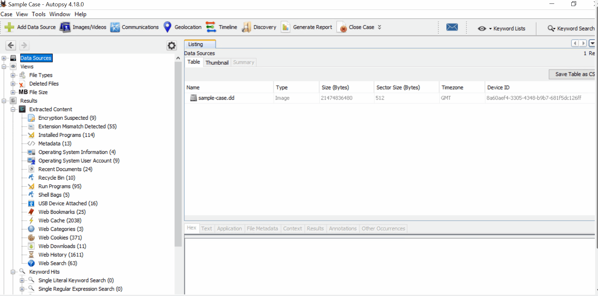

Autopsy will generate the report once you choose your report format and scope. You can click the HTML Report section (shown above) to view the report on your browser. Reports contain all of the Result Viewer pane results on the left side.

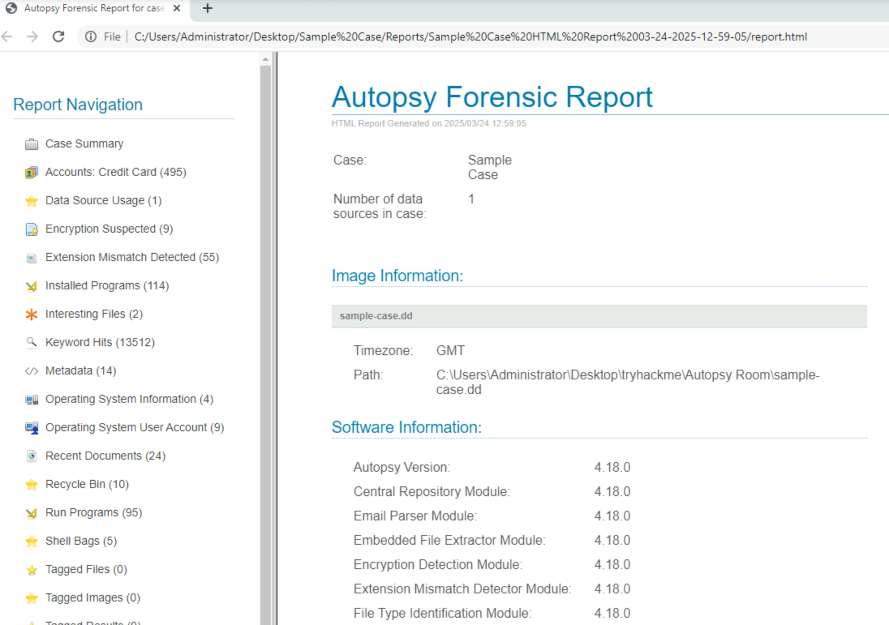

## Q & A

Q1 What is the full name of the operating system version?

A1 Windows 7 Ultimate Service Pack 1

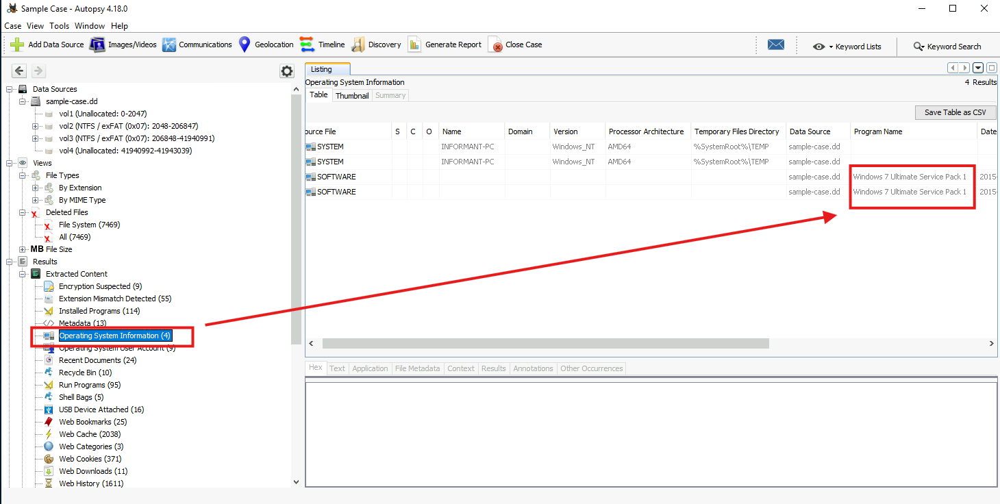

Q2 What percentage of the drive are documents? Include the % in your answer.

A2 40.8%

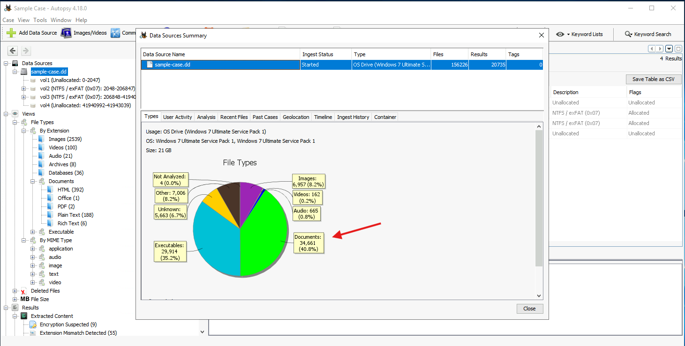

Q3 Generate an HTML report as shown in the task and view the "Case Summary" section.
What is the job number of the "Interesting Files Identifier" module?

A3 10

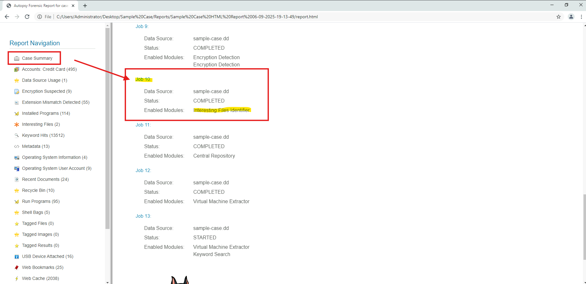

# Data Analysis

## Mini Scenario

An employee was suspected of leaking company data. A disk image was retrieved from the machine. You are assigned to perform the initial analysis. Further action will be determined based on the initial findings.

Reminder: Since the actual disk image is not in the attached VM, certain Autopsy sections will not display any actual data, only the metadata for that row within the local database. You can click No when notified about the Missing Image, as shown below. Additionally, you do not need to run any ingest modules in this exercise. 

## Q & A 

Q1 What is the name of an Installed Program with the version number of 6.2.0.2962?

A1 Eraser

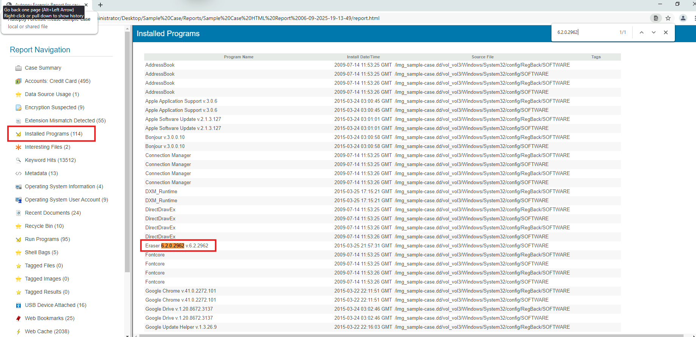

Q2 A user has a Password Hint. What is the value?

A2 IAMAN

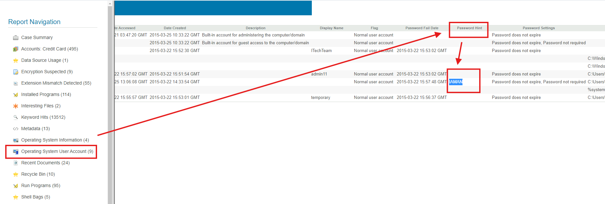

Q3 Numerous SECRET files were accessed from a network drive. What was the IP address?

A3 10.11.11.128

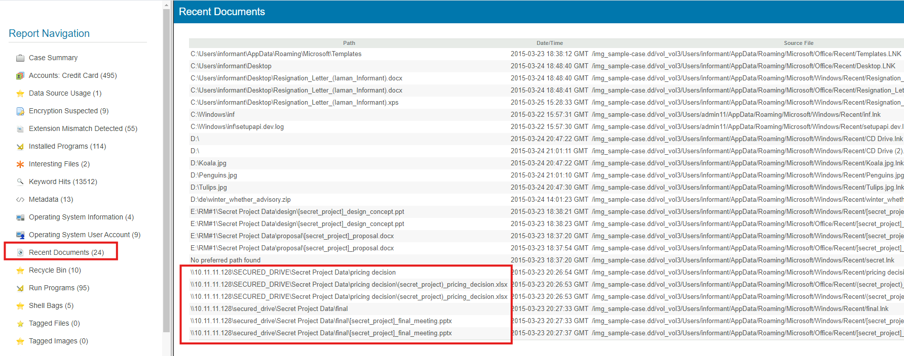

Q4 What web search term has the most entries?

A4 information leakage cases

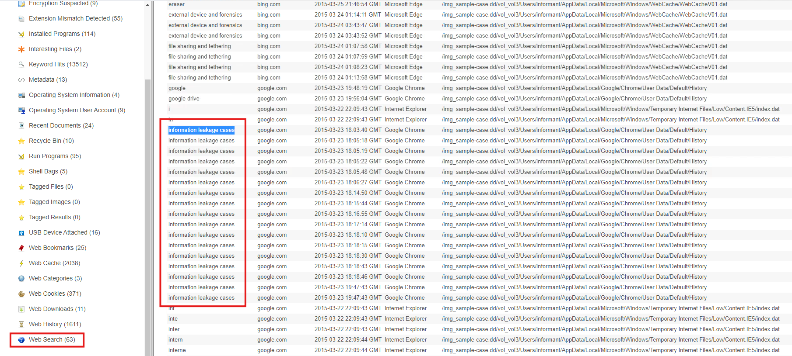

Q5 What was the web search conducted on 3/25/2015 21:46:44?

A5 anti-forensic tools

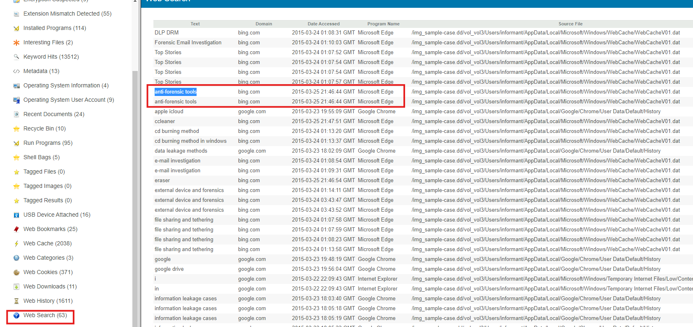

Q6 What MD5 hash value of the binary is listed as an Interesting File?

A6 fe18b02e890f7a789c576be8abccdc99

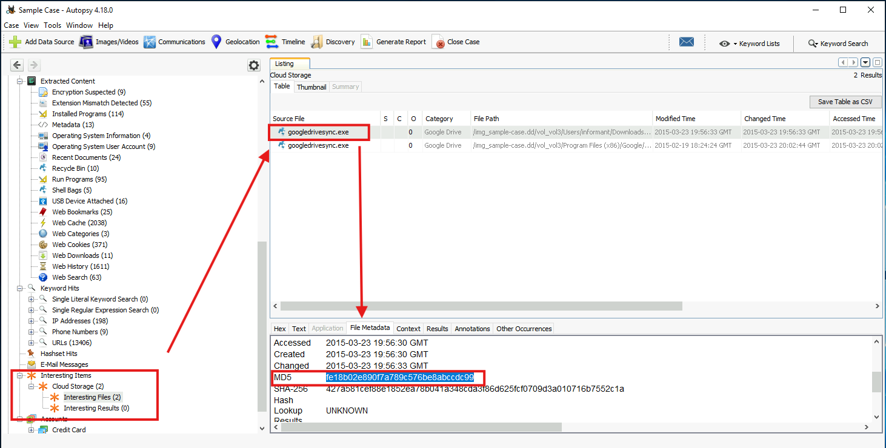

Q7 What self-assuring message did the 'Informant' write for himself on a Sticky Note? (no spaces)

A7 Tomorrow...Everything will be OK...

Conduct Keyword searches for Stickynotes
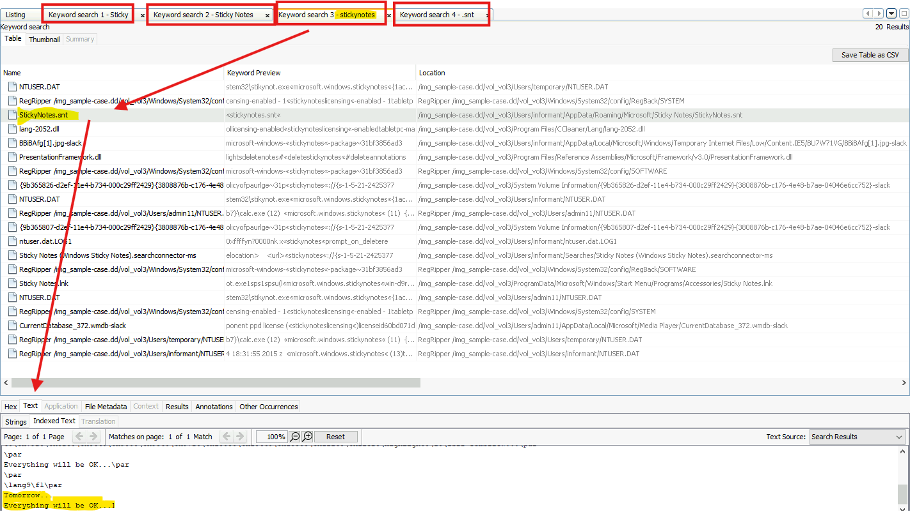

# Visualisation Tools

You may have noticed that other parts of the user interface haven't been discussed yet.

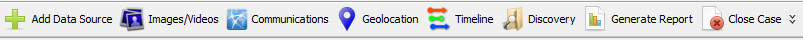

Please refer to the Autopsy documentation for the following visualization tool:

-    Images/Videos:http://sleuthkit.org/autopsy/docs/user-docs/4.12.0/image_gallery_page.html
-    Communications:http://sleuthkit.org/autopsy/docs/user-docs/4.12.0/communications_page.html
-    Timeline:http://sleuthkit.org/autopsy/docs/user-docs/4.12.0/timeline_page.html

Note: You can not practice with some visualization tools within the attached VM, except for Timeline. Below is a screenshot of the Timeline.

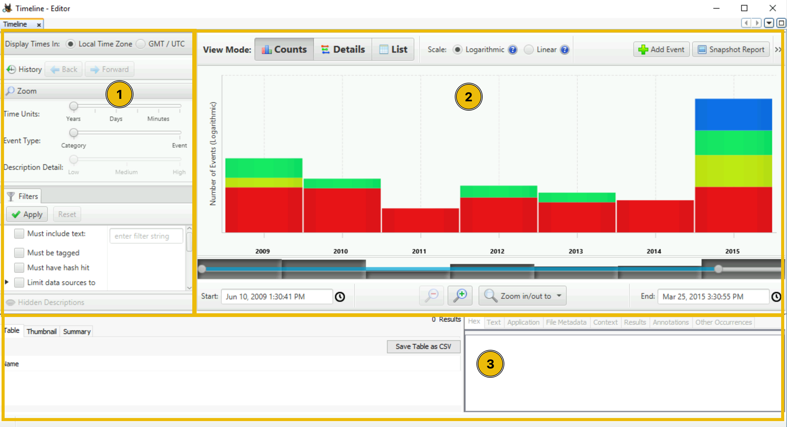

The Timeline tool is composed of three areas:

1.    Filters: Narrow the events displayed based on the filter criteria
2.    Events: The events are displayed here based on the View Mode
3.    Files/Contents: Additional information on the event(s) is displayed in this area

There are three view modes:

1.    Counts: The number of events is displayed in a bar chart view
2.    Details: Information on events is displayed, but they are clustered and collapsed, so the UI is not overloaded
3.    List: The events are displayed in a table view

The View Mode in the above screenshot is Counts. Below is a screenshot of the Details View Mode.

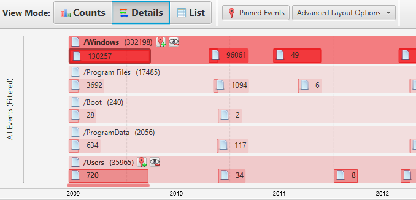

The numbers (seen above) indicate the number of clustered/collapsed events for a specific time frame. For example, for /Windows, there are 130,257 events between 2009-06-10 and 2010-03-18. Please take a look at the image below.

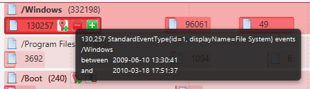

To expand a cluster, click the green icon with the plus sign. Please take a look at the example below.

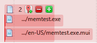

To collapse the events, click the red icon with a minus sign. Click the map marker icon with a plus sign if you wish to pin a group of events. This will move (pin) the events to an isolated section of the Events view.

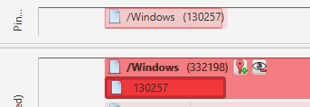

To unpin the events, click on the map marker with the minus sign. The last group of icons to cover are the eye icons. If you wish to hide a group of events from the Events view, click on the eye with a minus sign. In the below screenshot, the clustered events for /Boot were hidden and placed in Hidden Descriptions (in the Filters area).

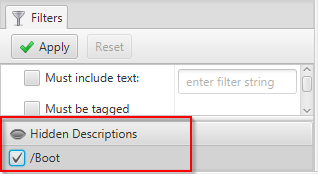

If you wish to reverse that action and unhide the events, right-click select Unhide and remove them from the list. See the example below.

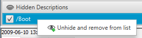

Last but not least, a screenshot of the List View Mode is below.

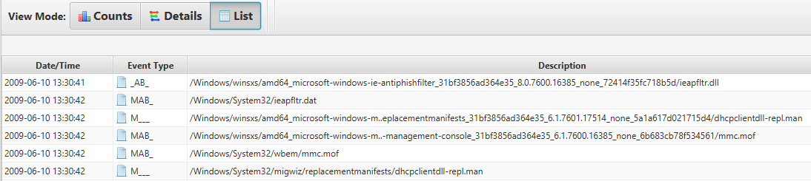

This should be enough information to get you started interacting with the Timeline with some level of confidence.

## Q & A

Q1 Using the Timeline, how many results were there on 2015-01-12?

A1 46

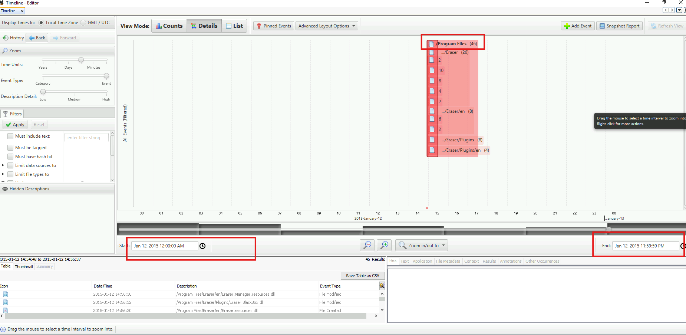

Q2 The majority of file events occurred on what date? (MONTH DD, YYYY)

A2 March 25, 2015

# Conclusion

To conclude, we learned about the capabilities of a powerful disk image analysis tool, Autopsy. There is more to the Autopsy tool that wasn't covered in detail in this room. Below are some topics that you should explore on your own to configure Autopsy to do more out of the box:

-    Global Hash Lookup Settings
-    Global File Extension Mismatch Identification Settings
-    Global Keyword Search Settings
-    Global Interesting Items Settings
-    Yara Analyser

3rd Party [modules](http://sleuthkit.org/autopsy/docs/user-docs/4.12.0/module_install_page.html) are available for Autopsy. Visit the official SleuthKit GitHub repo for a list of 3rd party modules [here](https://github.com/sleuthkit/autopsy_addon_modules). The disk image used with this room's development was created and released by the NIST under the Computer Forensic Reference Data Sets CFReDS Project. You are encouraged to download the disk image, go through the full exercise ([here](https://www.cfreds.nist.gov/data_leakage_case/data-leakage-case.html) to practice using Autopsy), and level up your investigation techniques.

