# Introduction

Many tools can aid a security analyst or incident responder in performing memory analysis on a potentially compromised endpoint. One of the most popular tools is Volatility, which will allow an analyst to dig deep into the weeds when examining memory artifacts from an endpoint. But this process can take time. Often, when an analyst is triaging, time is of the essence, and the analyst needs to perform a quick assessment to determine the nature of a security event.

That is where the FireEye tool Redline comes in. Redline will essentially give an analyst a 30,000-foot view (10 kilometers high view) of a Windows, Linux, or macOS endpoint. Using Redline, you can analyze a potentially compromised endpoint through the memory dump, including various file structures. With a nice-looking GUI (Graphical User Interface) - you can easily find the signs of malicious activities. 

Here is what you can do using Redline:

-    Collect registry data (Windows hosts only)
-    Collect running processes
-    Collect memory images (before Windows 10)
-    Collect Browser History
-    Look for suspicious strings
-    And much more!

Installing Redline on your local machine is straightforward. Run the MSI file and follow the installation process.

Redline is installed in the virtual machine attached to this room. 

Launch the attached virtual machine. If you wish to access the virtual machine via Remote Desktop, use the credentials below. 

Machine IP: MACHINE_IP

User: administrator

Password: letmein123!

Accept the Certificate when prompted, and you should be logged into the remote system now.

Note: The virtual machine may take up to 3 minutes to load.

## Q & A

Q1 Which company created Redline?

A1 FireEye

# Data Collection

Now that you have the overview for Redline, let's move to the Data Collection stage. There are three ways or options to collect data using Redline:

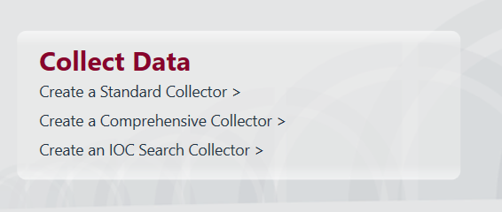

-    Standard Collector  - this method configures the script to gather a minimum amount of data for the analysis. This is going to be our preferred method to collect data in this room. It is also usually the fastest method to collect the data you need. It takes only a few minutes to complete.

-    Comprehensive Collector  - this method configures the script to gather the most data from your host for further analysis. This method takes up to an hour or more. You will choose this method if you prefer the full analysis of the system.

-    IOC Search Collector  (Windows only) - this method collects data that matches with the  Indicators of Compromise (IOCs)  that you created with the help of  IOC Editor . You will choose this method if you want to run the data collection against known IOCs that you have gathered either through threat intelligence (data feed or narrative report), incident response, or malware analysis. You imported them into  IOC Editor . We'll look at the IOC Editor a bit further in the next task.

Before proceeding, launch Redline. The icon is conveniently on the taskbar. 

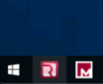

In this task, we will be using the Standard Collector method.

-    From Redline, click on "Create a Standard Collector".
-    You will have an option to choose the target platform. In our case, we will select Windows .

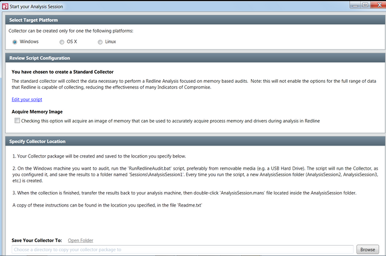

-    Under the Review Script Configuration, click on “Edit your script”,  this is one of the crucial steps since you will be presented with the set of data to choose to collect from the host. There will be five tabs, which include  Memory, Disk, System, Network, and Other.

Let's dive into some details:

## Memory: 

You can configure the script to collect memory data such as process listings, drivers enumeration (Windows hosts only), and hook detection  (versions before Windows 10).

Note: For this exercise, uncheck Hook Detection and make sure Aquire Memory Image is also unchecked. 

Be sure to make changes to the settings in each tab as necessary to mirror the settings illustrated in the task content. 

## Disk: 

This is where you can collect the data on Disks partitions and Volumes along with File Enumeration.

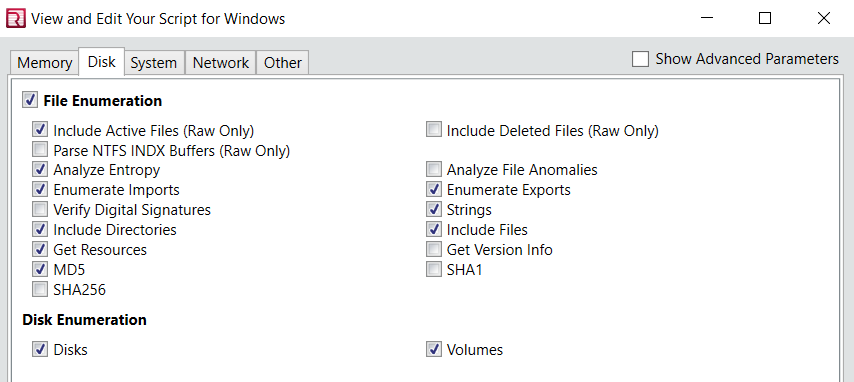

## System:

The system will provide you with machine information:

-    Machine and operating system (OS) information
-    Analyze system restore points (Windows versions before 10 only)
-    Enumerate the registry hives (Windows only)
-    Obtain user accounts (Windows and OS X only)
-    Obtain groups (OS X only)
-    Obtain the prefetch cache (Windows only) 

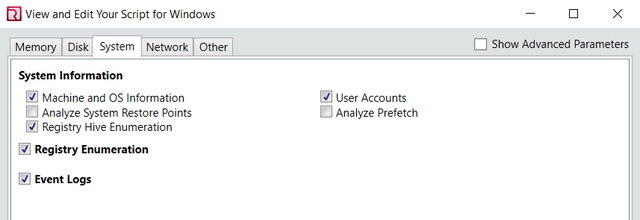

## Network:

Network Options supports Windows, OS X, and Linux platforms. You can configure the script to collect network information and browser history, which is essential when investigating the browser activities, including malicious file downloads and inbound/outbound connections.  

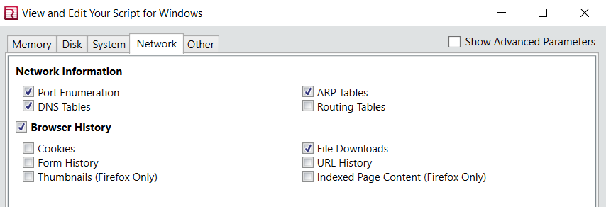

## Other: 

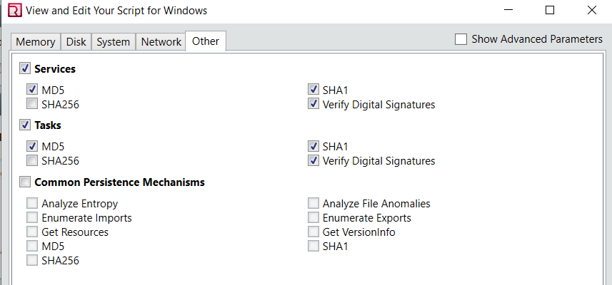

With this option, you can collect the data on different services and tasks running on the system, including the hashes.

-    Now we are ready to proceed to the next important step. After choosing your data options - click OK. And then click on "Browse"  under  "Save Your Collector To" . Why is this an important step? Because you will need to create a folder where your analysis file will be saved and the script for collecting the data you need. In our case, we are saving it to the  Analysis  folder.

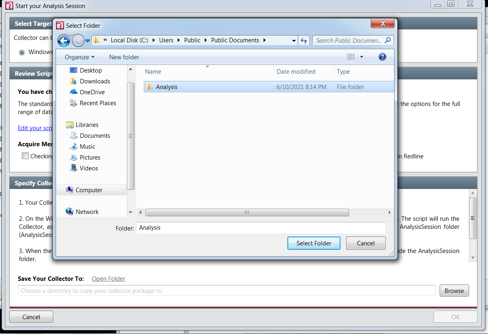

Note : You can choose any folder you wish but make sure that the folder is EMPTY. Complete this dialog by clicking the OK button.  

-    After you choose to save the collector to the folder, you will see the Collector Instructions.

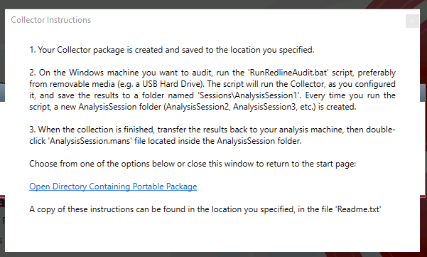

-    If you go into the folder, you will notice the bat file under the name  "RunRedlineAudit" . This is the executable script to collect data from the host. The script needs to be run as Administrator  to be able to collect the data we need.

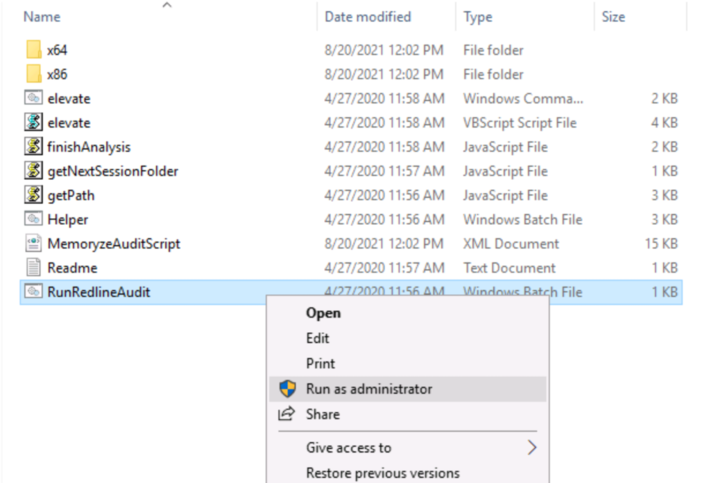

-    Running the script will open a command prompt window; this indicates that the script is running successfully. It will close automatically when the data collection process finishes. 

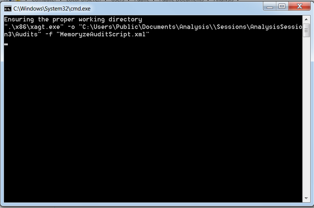

Note : This process may take between 15-20 minutes to complete.

-    After the script is finished, you will notice a new file created - AnalysisSession1  (in the Sessions folder) with the  `.mans`  extension. This file is what we need to be able to import into Redline for investigation. Just double-click on the file to import the audit data.

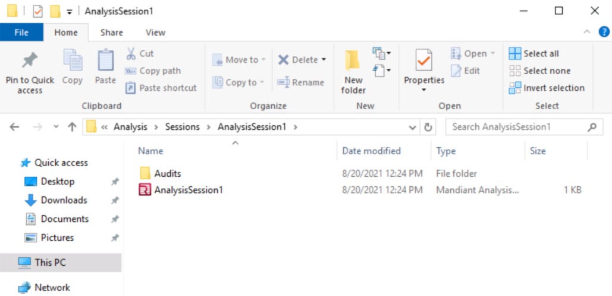

Tip: If you run the script multiple times, the naming convention of the analysis file will increment by 1. For example, if you run the script two times, you will see AnalysisSession1 and AnalysisSession2 . 

Congratulations! Now you have the data you need and are ready to dive into the investigation process in the upcoming tasks. 

## Q & A

Q1 What data collection method takes the least amount of time?

A1 Standard Collector

Q2 You are reading a research paper on a new strain of ransomware. You want to run the data collection on your computer based on the patterns provided, such as domains, hashes, IP addresses, filenames, etc. What method would you choose to run a granular data collection against the known indicators?

A2 IOC Search Collector

Q3 What script would you run to initiate the data collection process? Please include the file extension. 

A3 RunRedlineAudit.bat

Q4 If you want to collect the data on Disks and Volumes, under which option can you find it? 

A4 Disk Enumeration

Q5 What is the default filename you receive as a result of your Redline scan?

A5  AnalysisSession1.mans

# The Redline Interface

Let's look at the Redline Interface.

You should have your first analysis file. Double-click on the  AnalysisSession1.mans  file and the data will be imported automatically into Redline. Please give it up to 10 minutes to get the data imported. 

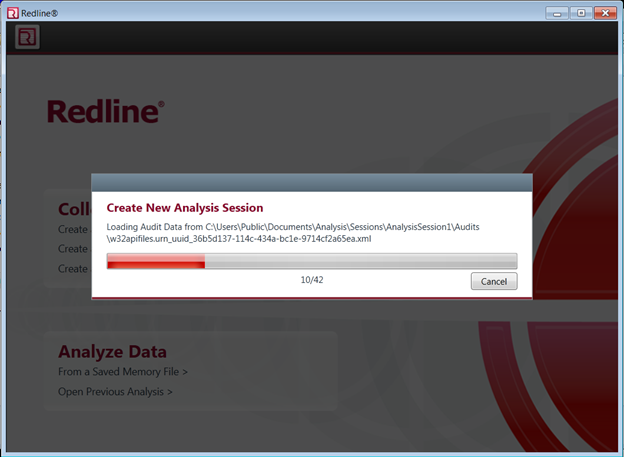

When the data is imported, you will be presented with this view:

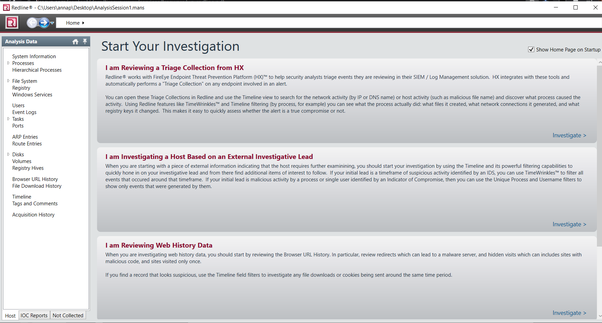

On the left panel, you will see different types of  Analysis Data;  this is where you will perform information gathering and investigation process.

-    System Information:  this is where you will see the information about the machine, BIOS (Windows only), operating system, and user information.
-    Processes:  processes will contain different attributes such as Process Name, PID, Path, Arguments, Parent process, Username, etc. When you expand the Processes tab, there will be four sections: Handles, Memory Sections, Strings, and Ports

A  <b>handle</b>  is a connection from a process to an object or resource in a Windows operating system. Operating systems use handles for referencing internal objects like files, registry keys, resources, etc.

<b>Memory Sections</b>  will let you investigate unsigned memory sections used by some processes. Many processes usually use legitimate dynamic link libraries (DLLs), which will be signed. This is particularly interesting because if you see any unsigned DLLs then it will be worth taking a closer look. 

<b>Strings</b>  - you will see the information on the captured strings.

<b>Ports</b>  - this is one of the critical sections to pay attention to. Most malware often initiates the outbound or inbound connections to communicate to their command and control server (C2) to do some malicious activities like exfiltrating the data or grabbing a payload to the machine. This situation is where you can review the suspicious connections from ports and IP addresses. Pay attention to the system processes as well. The threat actors like to avoid detection by hiding under the system processes. For example, explorer.exe or notepad.exe shouldn't be on the list of processes with outbound connections. 

Some of the other important sections you need to pay attention to are:

-    File System ( not included in this analysis session )
-    Registry
-    Windows Services
-    Tasks (Threat actors like to create scheduled tasks for persistence)
-    Event Logs (this another great place to look for the suspicious Windows PowerShell events as well as the Logon/Logoff, user creation events, and others)
-    ARP and Route Entries ( not included in this analysis session )
-    Browser URL History ( not included in this analysis session )
-    File Download History

The <b>Timeline</b> will help you to better understand when the compromise happened and what steps the malicious actor took to escalate the attack. The Timeline will also record every action on the file if it got create, changed, modified, accessed. 

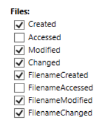

If you know when the host compromise or suspicious activity occurred, you can use  <b>TimeWrinkles™</b>  to filter out the timeline to only the events that took place around that time. 

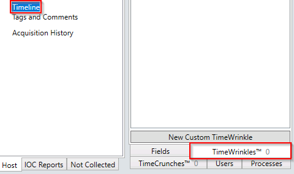

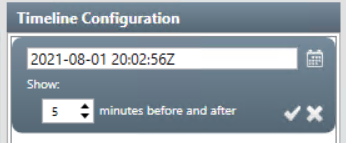

<b>TimeCrunches™</b>  helps to reduce the excessive amount of data that is not relevant in the table view. A TimeCrunch will hide the same types of events that occurred within the same minute you specified.

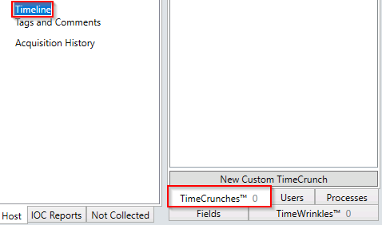

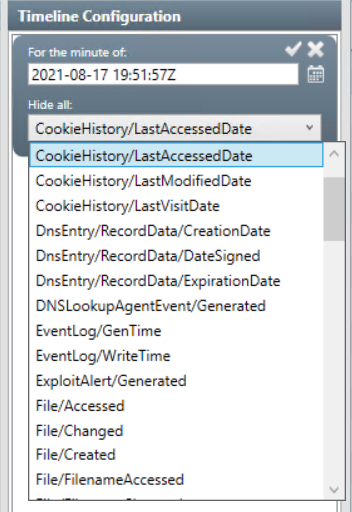

You can find out more about each type of data analysis using the Redline User Guide:  https://fireeye.market/assets/apps/211364/documents/877936_en.pdf .

Now you have learned some basics of different data types to help you during the investigation process. Let's go hunting and see if you can answer some of the questions in the next task.

## Q & A

Q1 Where in the Redline UI can you view information about the Logged in User?

A1 System Information

# Standard Collector Analysis

Now you should be familiar with some of the data collection terms and techniques as shown in the previous task. Armed with this knowledge, can you find what the intruder planted for you on the computer? 

Note: For this task you have to manually run Redline collector on the workstation and use the collected data to answer the questions.

## Q & A

Q1 Provide the Operating System detected for the workstation.

A1 Windows Server 2019 Standard 17763

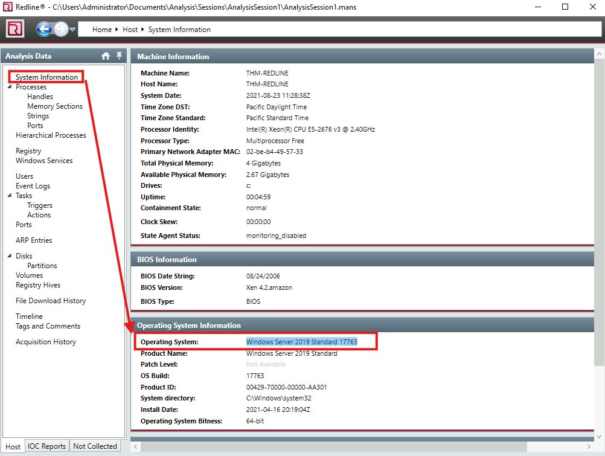

Q2 Be sure to check the rest of the System Information section for other useful data.

A2 N/A

Q3 What is the suspicious scheduled task that got created on the computer? 

A3 MSOfficeUpdateFa.ke

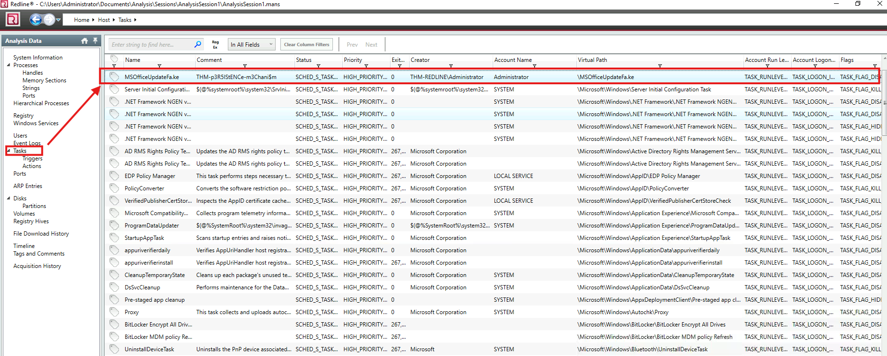

Q4 Find the message that the intruder left for you in the task.

A4 THM-p3R5IStENCe-m3Chani$m

Q5 There is a new System Event ID created by an intruder with the source name "THM-Redline-User" and the Type "ERROR". Find the Event ID #.

A5 546

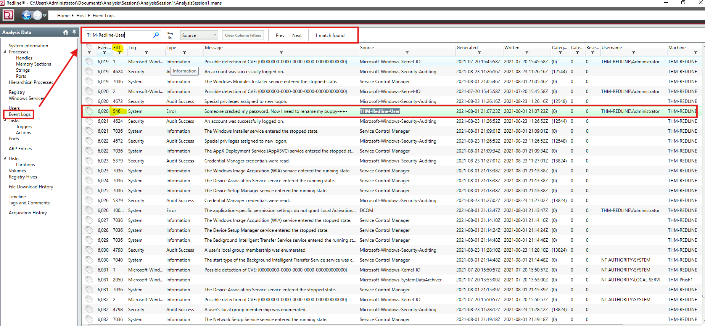

Q6 Provide the message for the Event ID.

A6 Someone cracked my password. Now I need to rename my puppy-++-

Q7 It looks like the intruder downloaded a file containing the flag for Question 8. Provide the full URL of the website.

A7 https://wormhole.app/download-stream/gI9vQtChjyYAmZ8Ody0AuA 

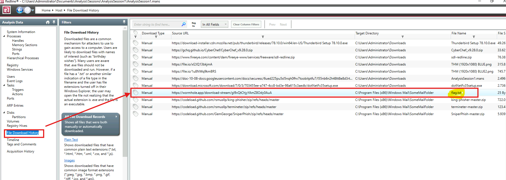

Q8 Provide the full path to where the file was downloaded to including the filename.

A8 C:\Program Files (x86)\Windows Mail\SomeMailFolder\flag.txt

Q9 Provide the message the intruder left for you in the file.

A9 THM{600D-C@7cH-My-FR1EnD}

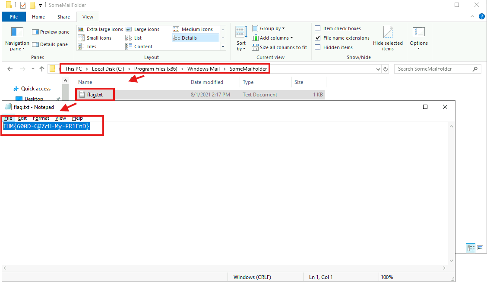

# IOC Search Collector

We briefly discussed the usage of the IOC Search Collector in the Data Collection task.

Let's take a closer look at the capabilities of this collector type. But first, let's recap what an IOC is. 

IOC stands for Indicators of Compromise ; they are artifacts of the potential compromise and host intrusion on the system or network that you need to look for when conducting threat hunting or performing incident response. IOCs can be MD5, SHA1, SHA256 hashes, IP address, C2 domain, file size, filename, file path, a registry key, etc.

One of the great tools you can use is  [IOC Editor](https://fireeye.market/apps/S7cWpi9W),  created by FireEye, to create IOC files. You can refer to this link to learn how to use the IOC Editor:  https://fireeye.market/assets/apps/S7cWpi9W//9cb9857f/ug-ioc-editor.pdf . 

Note : According to the IOC Editor download page Windows 7 is the latest operating system officially supported. It is the same version installed in the attached VM. There is another tool called [OpenIOC Editor](https://fireeye.market/apps/211404) by FireEye, which supports Windows 10 that is worth taking a look at. 

Tip : Before proceeding you can close Redline to free up some system resources while using IOC Editor. 

You can create a text file containing IOCs, modify them, and share it with other people in the InfoSec industry.

In this example, we will look at an IOC of a keylogger created with IOC Editor. 

Note : Below, you may follow along with the screenshots and don't have to create the IOC file in this task. You will create an IOC file using IOC Editor and perform an IOC Search in the next task. 

Open IOC Editor which was conveniently placed for you in the taskbar next to Redline. 

Note: It may take ~60 seconds for the application to launch. 

Before proceeding,  create the directory which will store the IOC file (IOC Directory). 

Next, create the IOC file.

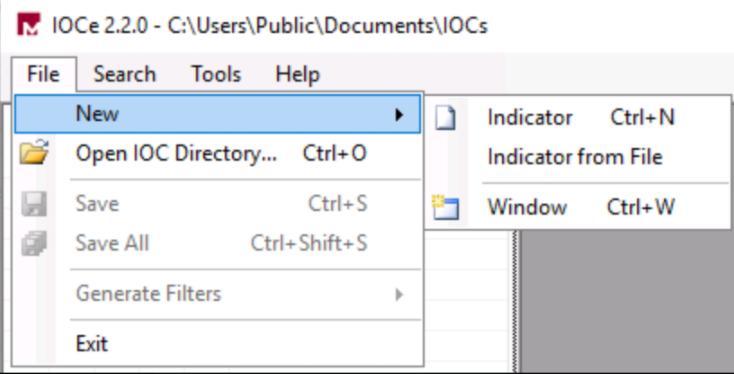

Keylogger indicators in IOC Editor :

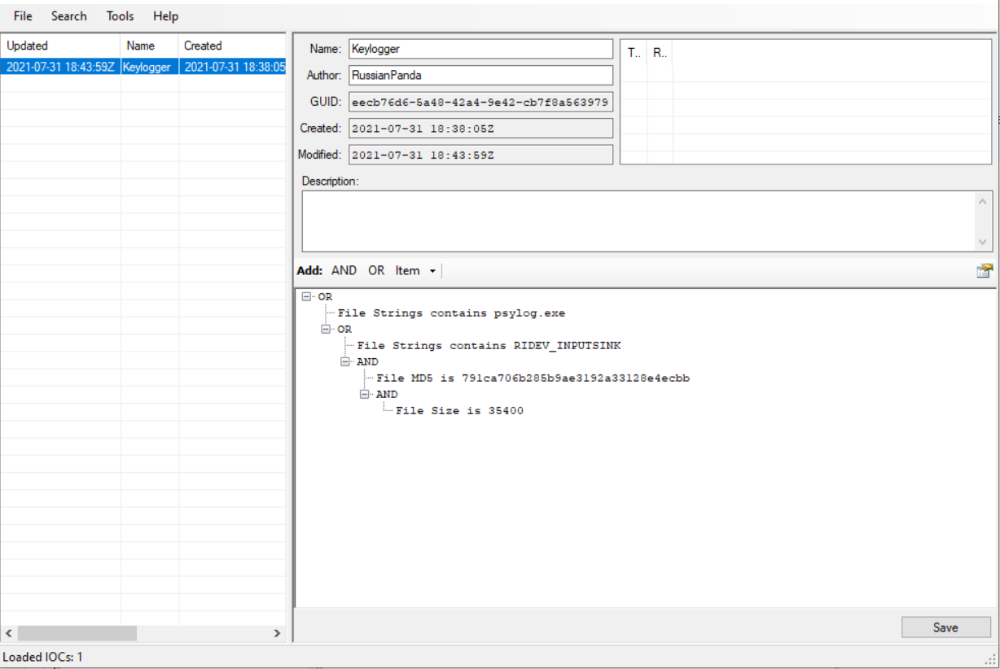

A brief explanation of the above image:

-    The Name of the IOC file is Keylogger, Keylogger.ioc. (this field you can edit)
-    The Author is RussianPanda. (this field you can edit)
-    GUID ,  Created , and  Modified  are fields you can  NOT  edit, and IOC Editor populates the information.
-    Under  Description , you can add a summary explaining the purpose of the IOC file.

The actual IOCs will be added under, you guessed it, Add . 

Here are the values from the image above:

-    File Strings - psylog.exe
-    File Strings - RIDEV_INPUTSINK
-    File MD5 - 791ca706b285b9ae3192a33128e4ecbb
-    File Size - 35400

Refer to the gif below to get an idea of adding specific IOCs to the IOC file.

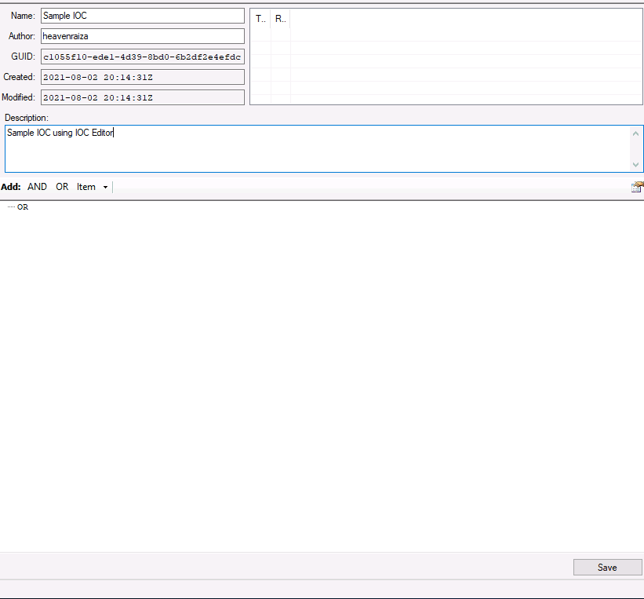

Once you select an item you can enter the value for the item directly.  

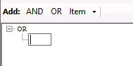

You can also add it within the Properties .  

All the fields are read-only except for Content and Comment . To add a value to the item enter it under Content .

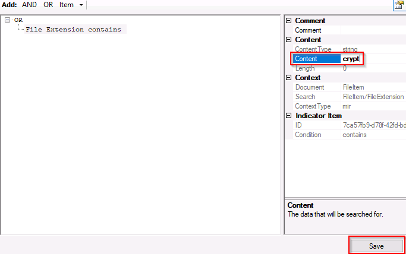

Once you enter the value click Save to save it. 

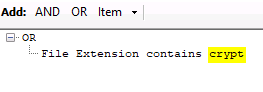

Note : You can right-click on an item for additional options. See below

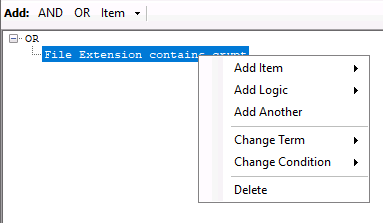

We'll leave that for you to explore on your own. 

Now that we've created and saved the IOC file, let's move on and go back to the IOC Search Collector in the Redline tool.

Note : If you closed Redline now is the time to relaunch the application. You can close IOC Editor, again, to free up system resources. 

IOC Search Collector will ignore the data that doesn't match an IOC you have gathered. Although, you can always choose to collect additional data. As the Redline User Guide states, the quality of the IOC analysis will depend on the data you have available in the analysis session. 

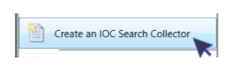

To create an IOC Search Collector, click "Browse..." and choose the location of the .ioc file. Redline will automatically detect the .ioc file and place it in the Indicators section, as shown below.

IOC Search Collector :

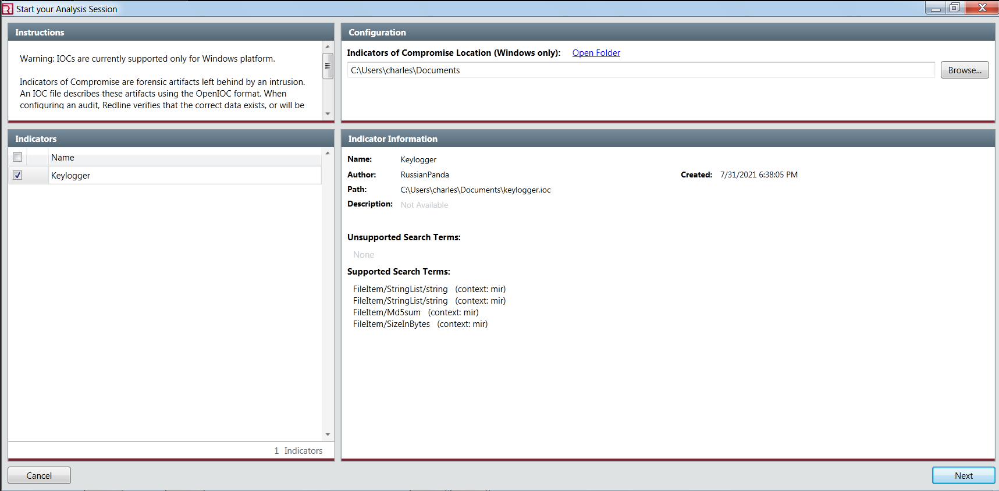

Unsupported Search Terms: These terms will not show any successful hits in Redline, which means Redline doesn't recognize specific search terms. 

Supported Search Terms: The terms that Redline will recognize and search for.
After you are finished reviewing the configured IOCs, click "Next". Now click on "Edit your script" to configure what data will be collected for the analysis. For this example, Keylogger file IOC Search, the following parameters were selected. 

Note : When you configure your own IOC Search, you will choose different settings for your script compared to the settings above. 
 
When done editing the script, click "OK". 
 
In the "Save Your Collector To" section, click "Browse" and choose an empty folder where your analysis file will be saved along with the  RunRedlineAudit.bat file. 
 
After executing the .bat file in the same manner as before, let's now wait for the analysis to finish.

After the analysis is finished, you will see the .mans file (AnalysisSession1 in our example). Double-click the file to open it in Redline. 

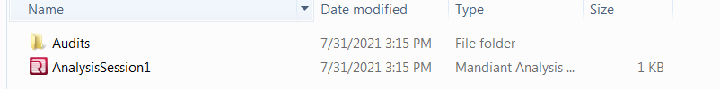

If Redline fails to generate the IOC Report automatically, you can manually generate it by clicking "Create a New IOC Report" and importing your .ioc file.
 
When the report generation completes, you should see the "Hits". You can expand the list by clicking on the entries in each row. 

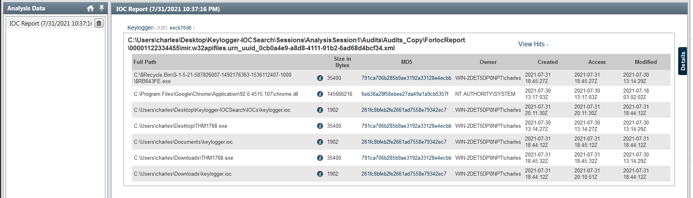

From the screenshot, you can see that there was one hit on "chrome.dll", this is a false positive. Let's review  the details below. 

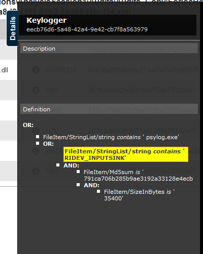

As you can see, the DLL file matched with the string "RIDEV_INPUTSINK" that we had in our .ioc file. It's important to gather granulated and accurate artifacts to add to your IOC file to avoid false positives. 
 
The screenshot below is of a file with the most amount of "Hits", which means it is most likely the file we are looking for. 
 
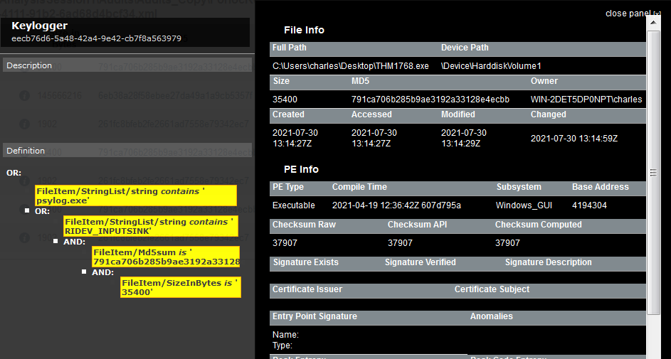 

You should be ready to answer the questions below using the screenshots provided in the task and perform these similar actions in the upcoming task!

## Q & A

Q1 What is the actual filename of the Keylogger? 

A1 psylog.exe

Q2 What filename is the file masquerading as? 

A2 THM1768.exe

Q3 Who is the owner of the file? 

A3 WIN-2DET5DP0NPT\charles

Q4 What is the file size in bytes? 

A4 35400

Q5 Provide the full path of where the .ioc file was placed after the Redline analysis, include the .ioc filename as well

A5 C:\Users\charles\Desktop\Keylogger-IOCSearch\IOCs\keylogger.ioc

# IOC Search Collector Analysis

Scenario: You are assigned to do a threat hunting task at Osinski Inc. They believe there has been an intrusion, and the malicious actor was using the tool to perform the lateral movement attack, possibly a "pass-the-hash" attack.

Task: Can you find the file planted on the victim's computer using IOC Editor and Redline IOC Search Collector? 

So far, you only know the following artifacts for the file: 

File Strings: 

    20210513173819Z0w0=

    <?<L<T<g=

File Size (Bytes): 

    834936

Note: Use the existing Redline Session found in: C:\Users\Administrator\Documents\Analysis\Sessions\AnalysisSession1.

## Q & A

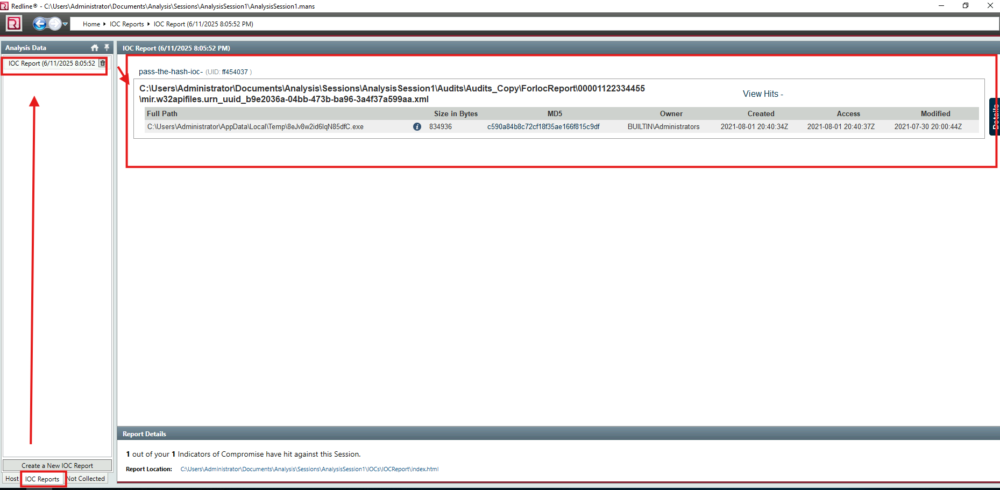

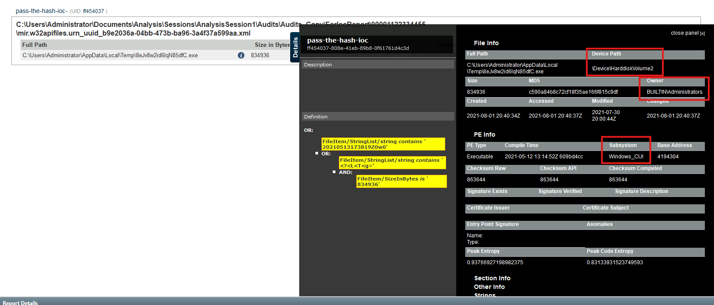

Q1 Provide the path of the file that matched all the artifacts along with the filename.

A1 C:\Users\Administrator\AppData\Local\Temp\8eJv8w2id6IqN85dfC.exe

Q2 Provide the path where the file is located without including the filename.

A2 C:\Users\Administrator\AppData\Local\Temp

Q3 Who is the owner of the file?

A3 BUILTIN\Administrators

Q4 Provide the subsystem for the file.

A4 Windows_CUI

Q5 Provide the Device Path where the file is located.

A5 \Device\HarddiskVolume2

Q6 Provide the hash (SHA-256) for the file.

A6 57492d33b7c0755bb411b22d2dfdfdf088cbbfcd010e30dd8d425d5fe66adff4

we have the MD5 hash so I searched for it in virus total

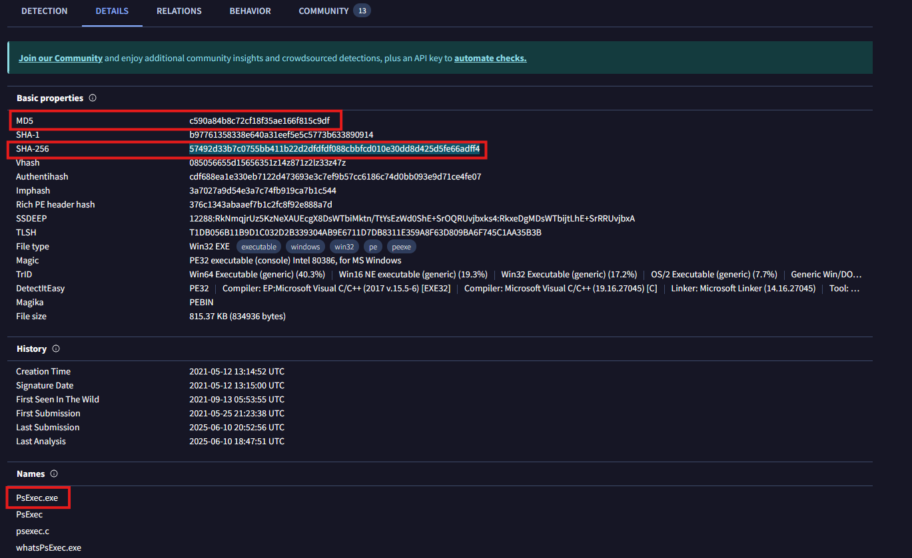

Q7 The attacker managed to masquerade the real filename. Can you find it having the hash in your arsenal? 

A7 PsExec.exe

# Endpoint Investigation

Scenario : A Senior Accountant, Charles, is complaining that he cannot access the spreadsheets and other files he has been working on. He also mentioned that his wallpaper got changed with the saying that his files got encrypted. This is not good news!

Are you ready to perform the memory analysis of the compromised host? You have all the data you need to do some investigation on the victim's machine. Let's go hunting!

Task :

    Navigate to the folder on your Desktop titled Endpoint Investigation.
    Double-click on the AnalysisSession1.mans  file. The data will be imported automatically into Redline.
    Analyze the file to answer  the questions below.

Note: Give it up to 10 minutes for all the data import.  

## Q & A

Q1 Can you identify the product name of the machine?

A1 Windows 7 Home Basic

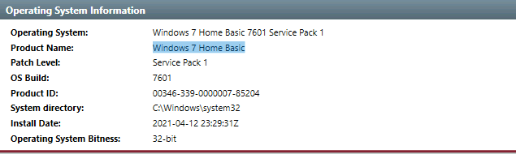

Q2 Can you find the name of the note left on the Desktop for the "Charles"?

A2 _R_E_A_D___T_H_I_S___AJYG1O_.txt

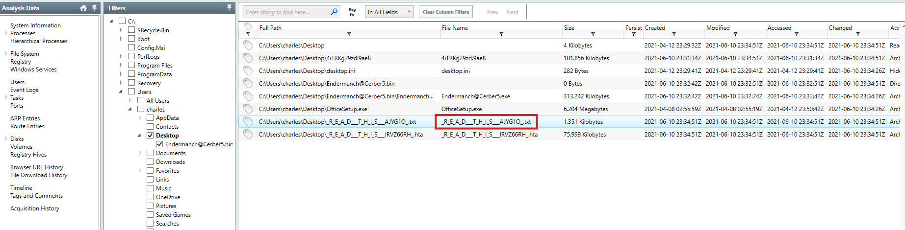

Q3 Find the Windows Defender service; what is the name of its service DLL? 

A3 MpSvc.dll

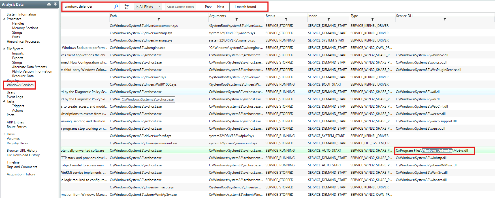

Q4 The user manually downloaded a zip file from the web. Can you find the filename? 

A4 eb5489216d4361f9e3650e6a6332f7ee21b0bc9f3f3a4018c69733949be1d481.zip

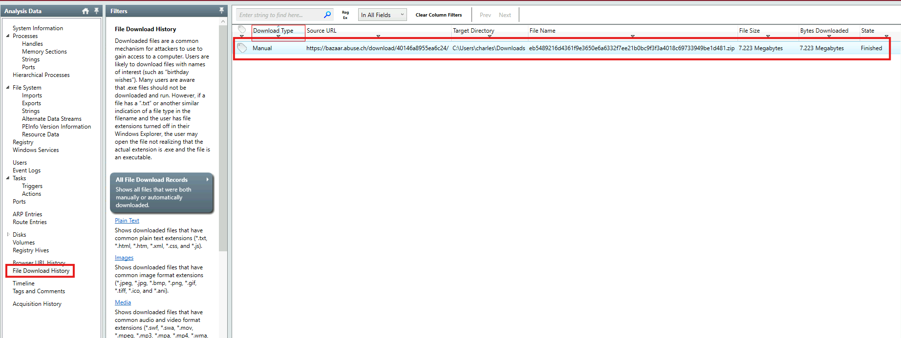

Q5 Provide the filename of the malicious executable that got dropped on the user's Desktop.

A5 Endermanch@Cerber5.exe

Q6 Provide the MD5 hash for the dropped malicious executable.

A6 fe1bc60a95b2c2d77cd5d232296a7fa4

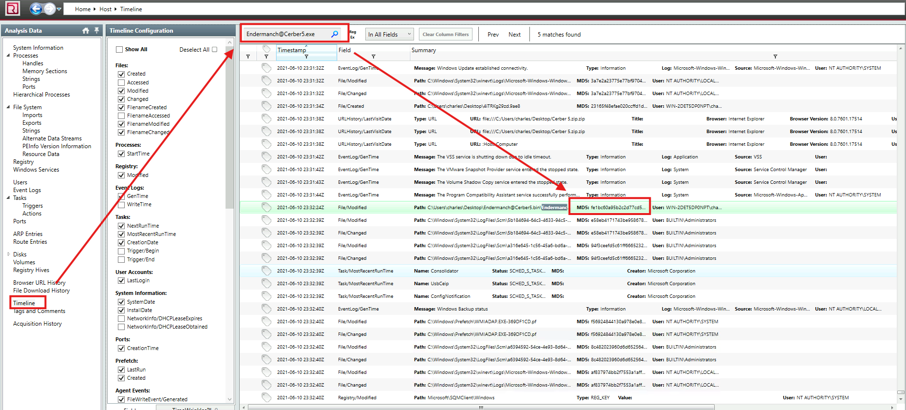

Q7 What is the name of the ransomware? 

A7 Cerber

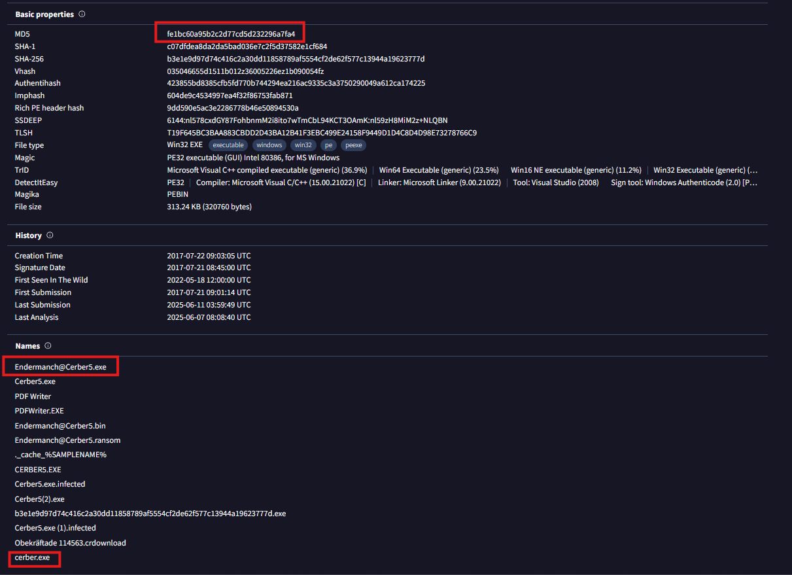

# Conclusion

As you have seen, Redline is a powerful tool that can guide you through analyzing the compromised host. You also need to consider that the accuracy of the analysis will depend on what kind of data you want to collect. 

Remember, Redline collects various data for analysis, including running processes, services, files, registry structures, event logs, etc. 

While solving the room tasks, you might have noticed that Timeline can be useful when searching for specific keywords. The Timeline can give you an idea of when the attack started and what following actions the attacker took. 

Here is the reference list for you if you missed it in the previous tasks:

-    Redline User Guide: https://fireeye.market/assets/apps/211364/documents/877936_en.pdf
-    IOC Editor User Guide: https://fireeye.market/assets/apps/S7cWpi9W//9cb9857f/ug-ioc-editor.pdf

Congratulations! Now you have learned a new tool. If you would like to challenge yourself, we recommend the REvil Corp room next. 

Happy Hunting!

