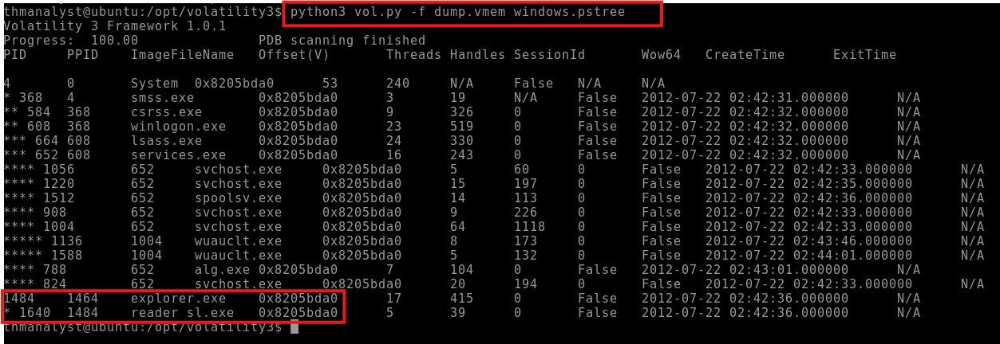
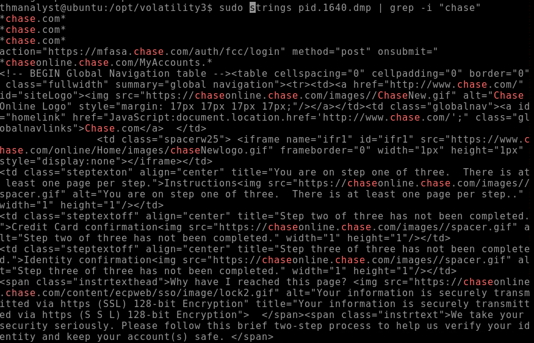
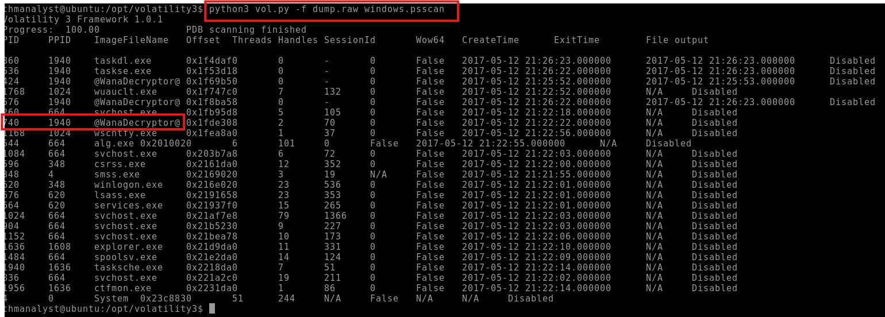
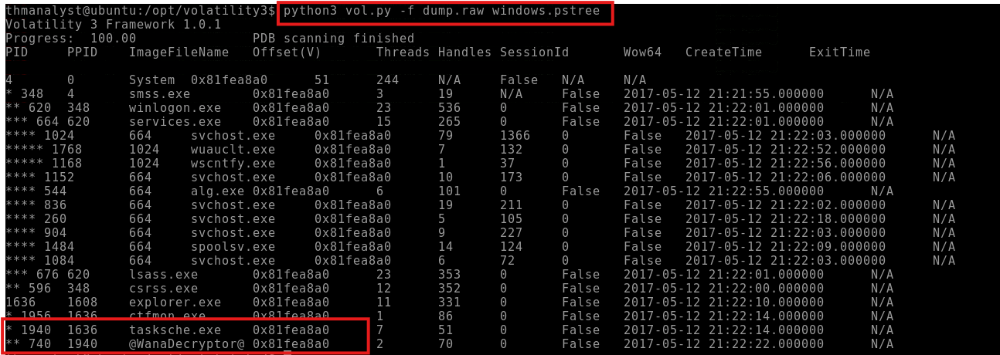
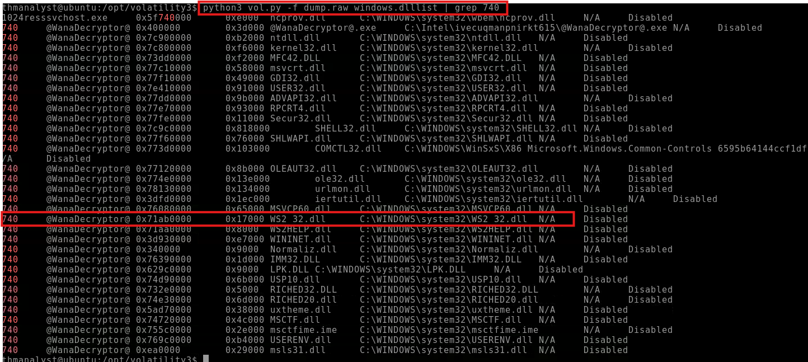
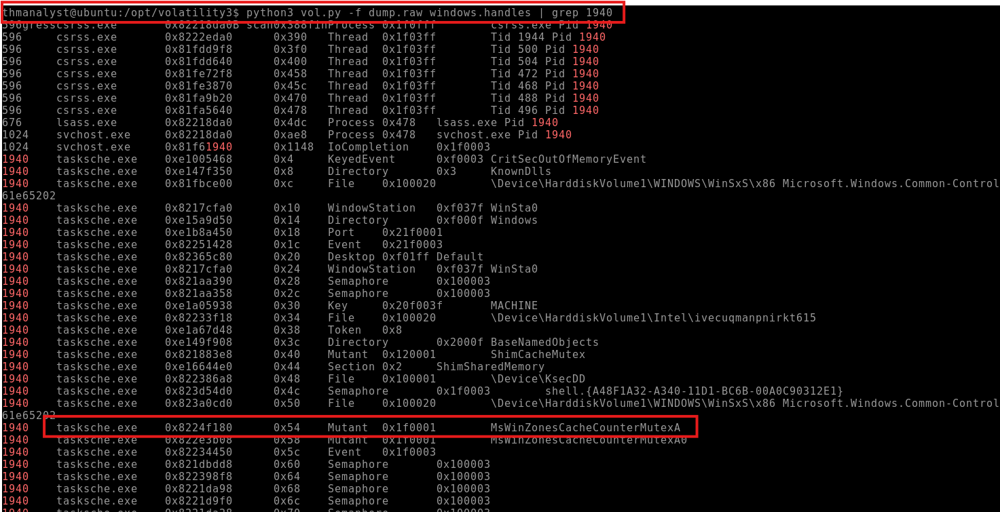

# Introduction

Volatility is a free memory forensics tool developed and maintained by Volatility Foundation, commonly used by malware and SOC analysts within a blue team or as part of their detection and monitoring solutions. Volatility is written in Python and is made up of python plugins and modules designed as a plug-and-play way of analyzing memory dumps.

Volatility is available for Windows, Linux, and Mac OS and is written purely in Python.

This room uses memory dumps from THM rooms and memory samples from Volatility Foundation.

Before completing this room, we recommend completing the Core Windows Processes room.

If you plan on using your own machine or the AttackBox to run Volatility, download the files attached to this task [.zip](Practical%20Investigation%20Memory%20Files_1615939758250.zip). If you plan to use the provided machine, you can deploy it in Task 3.

# Volatility Overview

From the Volatility Foundation Wiki, "Volatility is the world's most widely used framework for extracting digital artifacts from volatile memory (RAM) samples. The extraction techniques are performed completely independent of the system being investigated but offer visibility into the runtime state of the system. The framework is intended to introduce people to the techniques and complexities associated with extracting digital artifacts from volatile memory samples and provide a platform for further work into this exciting area of research."

Volatility is built off of multiple plugins working together to obtain information from the memory dump. To begin analyzing a dump, you will first need to identify the image type; there are multiple ways of identifying this information that we will cover further in later tasks. Once you have your image type and other plugins sorted, you can then begin analyzing the dump by using various volatility plugins against it that will be covered in depth later in this room.

Since Volatility is entirely independent of the system under investigation, this allows complete segmentation but full insight into the runtime state of the system.

At the time of writing, there are two main repositories for Volatility; one built off of python 2 and another built off python 3. For this room, we recommend using the Volatility3 version build off of python 3. https://github.com/volatilityfoundation/volatility3

Note: When reading blog posts and articles about Volatility, you may see volatility2 syntax mentioned or used, all syntax changed in volatility3, and within this room, we will be using the most recent version of the plugin syntax for Volatility.

# Installing Volatility

Since Volatility is written purely in Python, it makes the installation steps and requirements very easy and universal for Windows, Linux, and Mac. If you already attempted to use Python on Windows and Mac, it is suggested to begin on Linux; however, all operating systems will work the same.

If you're using TryHackMe's AttackBox, Volatility is already present on the box, and you can skip these steps and move on.

When downloading, you can make a choice to use the pre-packaged executable (.whl file) that will work the same and requires no dependencies (Windows Only), or you can decide to run it directly from Python.

To obtain a pre-packaged executable, simply download a zip file containing the application from their releases page. https://github.com/volatilityfoundation/volatility3/releases/tag/v1.0.1

To begin running the project from source, you will need to first download the following dependencies: Python 3.5.3 or later and Pefile 2017.8.1 or later. https://pypi.org/project/pefile/

You can also download these optional dependencies (recommended for this room): yara-python 3.8.0 or later https://github.com/VirusTotal/yara-python and capstone 3.0.0 or later https://www.capstone-engine.org/download.html.

Once you have your dependencies sorted, you can clone the repository from GitHub.

Command used: `git clone https://github.com/volatilityfoundation/volatility3.git`

You now have Volatility installed!

To test your installation run the vol.py file with the help parameter.

Command used: `python3 vol.py -h`

It is important to note that for any Linux or Mac memory files, you will need to download the symbol files from the Volatility GitHub. https://github.com/volatilityfoundation/volatility3#symbol-tables

We have an Ubuntu machine with Volatility and Volatility 3 already present in the /opt directory, along with all the memory files you need throughout this room. The machine will start in a split-screen view. In case the VM is not visible, use the blue Show Split View button at the top-right of the page.

IP Address: MACHINE_IP

Username: thmanalyst

Password: infected

# Memory Extraction

Extracting a memory dump can be performed in numerous ways, varying based on the requirements of your investigation. Listed below are a few of the techniques and tools that can be used to extract a memory from a bare-metal machine.

-    FTK Imager
-    Redline
-    DumpIt.exe
-    win32dd.exe / win64dd.exe
-    Memoryze
-    FastDump

When using an extraction tool on a bare-metal host, it can usually take a considerable amount of time; take this into consideration during your investigation if time is a constraint.

Most of the tools mentioned above for memory extraction will output a .raw file with some exceptions like Redline that can use its own agent and session structure.

For virtual machines, gathering a memory file can easily be done by collecting the virtual memory file from the host machine’s drive. This file can change depending on the hypervisor used; listed below are a few of the hypervisor virtual memory files you may encounter.

-    VMWare - .vmem
-    Hyper-V - .bin
-    Parallels - .mem
-    VirtualBox - .sav file *this is only a partial memory file

Exercise caution whenever attempting to extract or move memory from both bare-metal and virtual machines.

# Plugins Overview

Since converting to Python 3, the plugin structure for Volatility has changed quite drastically. In previous Volatility versions, you would need to identify a specific OS profile exact to the operating system and build version of the host, which could be hard to find or used with a plugin that could provide false positives. With Volatility3, profiles have been scrapped, and Volatility will automatically identify the host and build of the memory file.

The naming structure of plugins has also changed. In previous versions of Volatility, the naming convention has been simply the name of the plugin and was universal for all operating systems and profiles. Now with Volatility3, you need to specify the operating system prior to specifying the plugin to be used, for example, `windows.info` vs `linux.info`. This is because there are no longer profiles to distinguish between various operating systems for plugins as each operating system has drastically different memory structures and operations. Look below for options of operating system plugin syntax.

-    windows.
-    linux.
-    mac.

There are several plugins available with Volatility as well as third-party plugins; we will only be covering a small portion of the plugins that Volatility has to offer.

To get familiar with the plugins available, utilize the help menu. As Volatility3 is currently in active development, there is still a short list of plugins compared to its python 2 counterpart; however, the current list still allows you to do all of your analysis as needed.

# Identifying Image Info and Profiles

By default, Volatility comes with all existing Windows profiles from Windows XP to Windows 10.

Image profiles can be hard to determine if you don't know exactly what version and build the machine you extracted a memory dump from was. In some cases, you may be given a memory file with no other context, and it is up to you to figure out where to go from there. In that case, Volatility has your back and comes with the `imageinfo` plugin. This plugin will take the provided memory dump and assign it a list of the best possible OS profiles. OS profiles have since been deprecated with Volatility3, so we will only need to worry about identifying the profile if using Volatility2; this makes life much easier for analyzing memory dumps.

Note: `imageinfo` is not always correct and can have varied results depending on the provided dump; use with caution and test multiple profiles from the provided list.

If we are still looking to get information about what the host is running from the memory dump, we can use the following three plugins windows.info linux.info mac.info. This plugin will provide information about the host from the memory dump.

Syntax: `python3 vol.py -f <file> windows.info`

#  Listing Processes and Connections

Five different plugins within Volatility allow you to dump processes and network connections, each with varying techniques used. In this task, we will be discussing each and its pros and cons when it comes to evasion techniques used by adversaries.

### pslist 

The most basic way of listing processes is using `pslist`; this plugin will get the list of processes from the doubly-linked list that keeps track of processes in memory, equivalent to the process list in task manager. The output from this plugin will include all current processes and terminated processes with their exit times.

Syntax: `python3 vol.py -f <file> windows.pslist`

### psscan

Some malware, typically rootkits, will, in an attempt to hide their processes, unlink itself from the list. By unlinking themselves from the list you will no longer see their processes when using `pslist`. To combat this evasion technique, we can use `psscan` this technique of listing processes will locate processes by finding data structures that match `_EPROCESS`. While this technique can help with evasion countermeasures, it can also cause false positives.

Syntax: `python3 vol.py -f <file> windows.psscan`

### pstree

The third process plugin, `pstree`, does not offer any other kind of special techniques to help identify evasion like the last two plugins; however, this plugin will list all processes based on their parent process ID, using the same methods as pslist. This can be useful for an analyst to get a full story of the processes and what may have been occurring at the time of extraction.

Syntax: `python3 vol.py -f <file> windows.pstree`

### netstat

Now that we know how to identify processes, we also need to have a way to identify the network connections present at the time of extraction on the host machine. `netstat` will attempt to identify all memory structures with a network connection.

Syntax: `python3 vol.py -f <file> windows.netstat`

This command in the current state of volatility3 can be very unstable, particularly around old Windows builds. To combat this, you can utilize other tools like `bulk_extractor` to extract a PCAP file from the memory file. In some cases, this is preferred in network connections that you cannot identify from Volatility alone. https://tools.kali.org/forensics/bulk-extractor

### dlllist

The last plugin we will cover is `dlllist`. This plugin will list all DLLs associated with processes at the time of extraction. This can be especially useful once you have done further analysis and can filter output to a specific DLL that might be an indicator for a specific type of malware you believe to be present on the system.

Syntax: `python3 vol.py -f <file> windows.dlllist`

# Volatility Hunting and Detection Capabilities 

Volatility offers a plethora of plugins that can be used to aid in your hunting and detection capabilities when hunting for malware or other anomalies within a system's memory.

It is recommended that you have a basic understanding of how evasion techniques and various malware techniques are employed by adversaries, as well as how to hunt and detect them before going through this section.

### malfind

The first plugin we will be talking about that is one of the most useful when hunting for code injection is `malfind`. This plugin will attempt to identify injected processes and their PIDs along with the offset address and a Hex, Ascii, and Disassembly view of the infected area. The plugin works by scanning the heap and identifying processes that have the executable bit set RWE or RX and/or no memory-mapped file on disk (file-less malware).

Based on what malfind identifies, the injected area will change. An MZ header is an indicator of a Windows executable file. The injected area could also be directed towards shellcode which requires further analysis.

Syntax: `python3 vol.py -f <file> windows.malfind`

### yarascan

Volatility also offers the capability to compare the memory file against YARA rules. `yarascan` will search for strings, patterns, and compound rules against a rule set. You can either use a YARA file as an argument or list rules within the command line.

Syntax: `python3 vol.py -f <file> windows.yarascan`

There are other plugins that can be considered part of Volatility's hunting and detection capabilities; however, we will be covering them in the next task.

# Advanced Memory Forensics

Advanced Memory Forensics can become confusing when you begin talking about system objects and how malware interacts directly with the system, especially if you do not have prior experience hunting some of the techniques used such as hooking and driver manipulation. When dealing with an advanced adversary, you may encounter malware, most of the time rootkits that will employ very nasty evasion measures that will require you as an analyst to dive into the drivers, mutexes, and hooked functions. A number of modules can help us in this journey to further uncover malware hiding within memory.

The first evasion technique we will be hunting is hooking; there are five methods of hooking employed by adversaries, outlined below:

-    SSDT Hooks
-    IRP Hooks
-    IAT Hooks
-    EAT Hooks
-    Inline Hooks

We will only be focusing on hunting SSDT hooking as this one of the most common techniques when dealing with malware evasion and the easiest plugin to use with the base volatility plugins.

### ssdt

The `ssdt` plugin will search for hooking and output its results. Hooking can be used by legitimate applications, so it is up to you as the analyst to identify what is evil. As a brief overview of what SSDT hooking is: <b>SSDT</b> stands for <b>System Service Descriptor Table</b>; the Windows kernel uses this table to look up system functions. An adversary can hook into this table and modify pointers to point to a location the rootkit controls.

There can be hundreds of table entries that ssdt will dump; you will then have to analyze the output further or compare against a baseline. A suggestion is to use this plugin after investigating the initial compromise and working off it as part of your lead investigation.

Syntax: `python3 vol.py -f <file> windows.ssdt`

Adversaries will also use malicious driver files as part of their evasion. Volatility offers two plugins to list drivers.

### modules

The `modules` plugin will dump a list of loaded kernel modules; this can be useful in identifying active malware. However, if a malicious file is idly waiting or hidden, this plugin may miss it.

This plugin is best used once you have further investigated and found potential indicators to use as input for searching and filtering.

Syntax: `python3 vol.py -f <file> windows.modules`

### driverscan

The `driverscan` plugin will scan for drivers present on the system at the time of extraction. This plugin can help to identify driver files in the kernel that the modules plugin might have missed or were hidden.

As with the last plugin, it is again recommended to have a prior investigation before moving on to this plugin. It is also recommended to look through the `modules` plugin before `driverscan`.

Syntax: `python3 vol.py -f <file> windows.driverscan`

In most cases, driverscan will come up with no output; however, if you do not find anything with the modules plugin, it can be useful to attempt using this plugin.

There are also other plugins listed below that can be helpful when attempting to hunt for advanced malware in memory.

-    `modscan`
-    `driverirp`
-    `callbacks`
-    `idt`
-    `apihooks`
-    `moddump`
-    `handles`

Note: Some of these are only present on Volatility2 or are part of third-party plugins. To get the most out of Volatility, you may need to move to some third-party or custom plugins.

# Practical Investigations

## Case 001 - BOB! THIS ISN'T A HORSE!

Your SOC has informed you that they have gathered a memory dump from a quarantined endpoint thought to have been compromised by a banking trojan masquerading as an Adobe document. Your job is to use your knowledge of threat intelligence and reverse engineering to perform memory forensics on the infected host. 

You have been informed of a suspicious IP in connection to the file that could be helpful. 41.168.5.140

The memory file is located in `/Scenarios/Investigations/Investigation-1.vmem`

## Case 002 - That Kind of Hurt my Feelings

You have been informed that your corporation has been hit with a chain of ransomware that has been hitting corporations internationally. Your team has already retrieved the decryption key and recovered from the attack. Still, your job is to perform post-incident analysis and identify what actors were at play and what occurred on your systems. You have been provided with a raw memory dump from your team to begin your analysis.

The memory file is located in `/Scenarios/Investigations/Investigation-2.raw`

## Q & A

Q1 What is the build version of the host machine in Case 001?

A1 2600.xpsp.080413-2111

Q2 At what time was the memory file acquired in Case 001?

A2 2012-07-22 02:45:08

Q3 What process can be considered suspicious in Case 001?
Note: Certain special characters may not be visible on the provided VM. When doing a copy-and-paste, it will still copy all characters.

A3 reader_sl.exe 

Q3.a What is the parent process of the suspicious process in Case 001?

A3.a explorer.exe

Q4 What is the PID of the suspicious process in Case 001?

A4 1640

Q5 What is the parent process PID in Case 001?

A5 1484

Q6 What user-agent was employed by the adversary in Case 001?

Hint: `vol.py -f <dump> -o /dir/to/store_dump/ windows.memmap.Memmap --pid <suspicious PID> --dump Once the dump is stored use, strings *.dmp | grep -i "user-agent"`

A6  Mozilla/5.0 (Windows; U; MSIE 7.0; Windows NT 6.0; en-US)

Q7 Was Chase Bank one of the suspicious bank domains found in Case 001? (Y/N)

A7 Y

Q8 What suspicious process is running at PID 740 in Case 002?

A8 @WanaDecryptor@

Q9 What is the full path of the suspicious binary in PID 740 in Case 002?

A9 C:\Intel\ivecuqmanpnirkt615\@WanaDecryptor@.exe

Q10 What is the parent process of PID 740 in Case 002?

A10 tasksche.exe

Q11 What is the suspicious parent process PID connected to the decryptor in Case 002?

A11 1940

Q12 From our current information, what malware is present on the system in Case 002?

A12 Wannacry

Q13 What DLL is loaded by the decryptor used for socket creation in Case 002?

A13 ws2_32.dll

https://cloud.google.com/blog/topics/threat-intelligence/wannacry-malware-profile/

https://learn.microsoft.com/en-us/windows/win32/winsock/initialization-2

Q14 What mutex can be found that is a known indicator of the malware in question in Case 002?

A14 MsWinZonesCacheCounterMutexA

https://cloud.google.com/blog/topics/threat-intelligence/wannacry-malware-profile/

Q15 What plugin could be used to identify all files loaded from the malware working directory in Case 002?

A15 windows.filescan

# Conclusions

We have only covered a very thin layer of memory forensics that can go much deeper when analyzing the Windows, Mac, and Linux architecture. If you're looking for a deep dive into memory forensics, I would suggest reading: The Art of Memory Forensics.

There are also a number of wikis and various community resources that can be used for more information about Volatility techniques found below.

-    https://github.com/volatilityfoundation/volatility/wiki
-    https://github.com/volatilityfoundation/volatility/wiki/Volatility-Documentation-Projec
-    https://digital-forensics.sans.org/media/Poster-2015-Memory-Forensics.pdf

From this room, as you continue on the SOC Level 1 path, more rooms will contain memory forensics challenges.

