Welcome to TheHive Project Outline!
This room will cover the foundations of using the TheHive Project, a Security Incident Response Platform.

Specifically, we will be looking at:

-    What TheHive is?
-    An overview of the platform's functionalities and integrations.
-    Installing TheHive for yourself.
-    Navigating the UI.
-    Creation of a case assessment.

Before we begin, ensure you download the attached file, as it will be needed for Task 5.

# Introduction

TheHive Project is a scalable, open-source and freely available Security Incident Response Platform, designed to assist security analysts and practitioners working in SOCs, CSIRTs and CERTs to track, investigate and act upon identified security incidents in a swift and collaborative manner.

Security Analysts can collaborate on investigations simultaneously, ensuring real-time information pertaining to new or existing cases, tasks, observables and IOCs are available to all team members.

More information about the project can be found on https://thehive-project.org/ & their [GitHub Repo](https://github.com/TheHive-Project/TheHive).


Image: Cases dashboard on TheHive by order of reported severity


# TheHive Features & Integrations

TheHive allows analysts from one organisation to work together on the same case simultaneously. This is due to the platform's rich feature set and integrations that support analyst workflows. The features include:

-    Case/Task Management: Every investigation is meant to correspond to a case that has been created. Each case can be broken down into one or more tasks for added granularity and even be turned into templates for easier management. Additionally, analysts can record their progress, attach pieces of evidence or noteworthy files, add tags and other archives to cases.

-    Alert Triage: Cases can be imported from SIEM alerts, email reports and other security event sources. This feature allows an analyst to go through the imported alerts and decide whether or not they are to be escalated into investigations or incident response.

-    Observable Enrichment with Cortex: One of the main feature integrations TheHive supports is Cortex, an observable analysis and active response engine. Cortex allows analysts to collect more information from threat indicators by performing correlation analysis and developing patterns from the cases. More information on [Cortex](https://github.com/TheHive-Project/Cortex/).

-    Active Response: TheHive allows analysts to use Responders and run active actions to communicate, share information about incidents and prevent or contain a threat.

-    Custom Dashboards: Statistics on cases, tasks, observables, metrics and more can be compiled and distributed on dashboards that can be used to generate useful KPIs within an organisation.

-    Built-in MISP Integration: Another useful integration is with [MISP](https://www.misp-project.org/index.html), a threat intelligence platform for sharing, storing and correlating Indicators of Compromise of targeted attacks and other threats. This integration allows analysts to create cases from MISP events, import IOCs or export their own identified indicators to their MISP communities.

Other notable integrations that TheHive supports are [DigitalShadows2TH](https://github.com/TheHive-Project/DigitalShadows2TH) & [ZeroFox2TH](https://github.com/TheHive-Project/Zerofox2TH), free and open-source extensions of alert feeders from [DigitalShadows](https://www.digitalshadows.com/) and [ZeroFox](https://www.zerofox.com/) respectively. These integrations ensure that alerts can be added into TheHive and transformed into new cases using pre-defined incident response templates or by adding to existing cases.


## Q & A

Q1 Which open-source platform supports the analysis of observables within TheHive?

A1 Cortex


# User Profiles & Permissions

TheHive offers an administrator the ability to create an organisation group to identify the analysts and assign different roles based on a list of pre-configured user profiles.

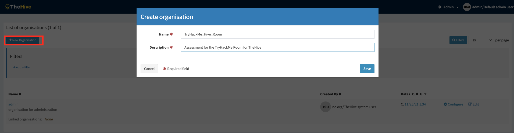

## Admin Console - Create Organisation

The pre-configured user profiles are:

-    admin: full administrative permissions on the platform; can't manage any Cases or other data related to investigations;
-    org-admin: manage users and all organisation-level configuration, can create and edit Cases, Tasks, Observables and run Analysers and Responders;
-    analyst: can create and edit Cases, Tasks, Observables and run Analysers & Responders;
-    read-only: Can only read, Cases, Tasks and Observables details;

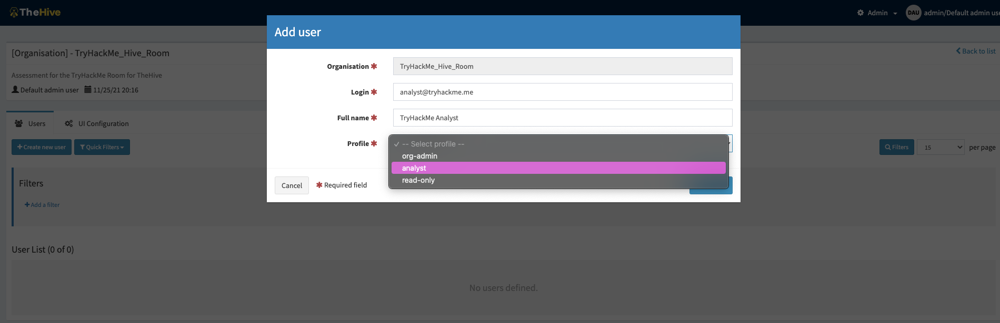

## Admin Console -  Add User

Each user profile has a pre-defined list of permissions that would allow the user to perform different tasks based on their role. When a profile has been selected, its permissions will be listed.

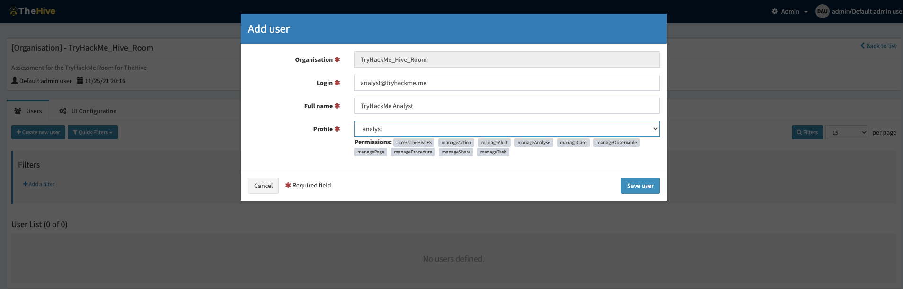

The full list of permissions includes:

<table class="table table-bordered">
<tbody>
<tr>
<td><span style="font-weight:bold;font-size:16px">Permission</span></td>
<td><span style="font-weight:bold">Functions</span></td>
</tr>
<tr>
<td style="text-align:center"><strong><span style="font-size:16px">manageOrganisation (1)</span><br></strong></td>
<td style="text-align:center"><span style="font-size:16px">Create &amp; Update an organisation</span></td>
</tr>
<tr>
<td style="text-align:center"><strong><span style="font-size:16px">manageConfig (1)</span><br></strong></td>
<td style="text-align:center"><span style="font-size:16px">Update Configuration</span></td>
</tr>
<tr>
<td style="text-align:center"><strong><span style="font-size:16px">manageProfile (1)</span><br></strong></td>
<td style="text-align:center">Create, update &amp; delete Profiles</td>
</tr>
<tr>
<td style="text-align:center"><strong><span style="font-size:16px">manageTag (1)</span><br></strong></td>
<td style="text-align:center">Create, update &amp; Delete Tags</td>
</tr>
<tr>
<td style="text-align:center"><strong><span style="font-size:16px">manageCustomField (1)</span><br></strong></td>
<td style="text-align:center">Create, update &amp; delete Custom Fields</td>
</tr>
<tr>
<td style="text-align:center"><strong><span style="font-size:16px">manageCase</span><br></strong></td>
<td style="text-align:center">Create, update &amp; delete Cases</td>
</tr>
<tr>
<td style="text-align:center"><strong>manageObservable<br></strong></td>
<td style="text-align:center">Create, update &amp; delete Observables</td>
</tr>
<tr>
<td style="text-align:center"><strong>manageALert<br></strong></td>
<td style="text-align:center">Create, update &amp; import Alerts</td>
</tr>
<tr>
<td style="text-align:center"><strong>manageUser<br></strong></td>
<td style="text-align:center">Create, update &amp; delete Users</td>
</tr>
<tr>
<td style="text-align:center"><strong>manageCaseTemplate<br></strong></td>
<td style="text-align:center">Create, update &amp; delete Case templates</td>
</tr>
<tr>
<td style="text-align:center"><strong>manageTask<br></strong></td>
<td style="text-align:center">Create, update &amp; delete Tasks</td>
</tr>
<tr>
<td style="text-align:center"><strong>manageShare</strong></td>
<td style="text-align:center">Share case, task &amp; observable with other organisations</td>
</tr>
<tr>
<td style="text-align:center"><strong>manageAnalyse (2)<br></strong></td>
<td style="text-align:center">Execute Analyse</td>
</tr>
<tr>
<td style="text-align:center"><strong>manageAction (2)<br></strong></td>
<td style="text-align:center">Execute Actions</td>
</tr>
<tr>
<td style="text-align:center"><strong>manageAnalyserTemplate (2)<br></strong></td>
<td style="text-align:center">Create, update &amp; delete Analyser Templates</td>
</tr>
</tbody>
</table>

Note that (1) Organisations, configuration, profiles and tags are global objects. The related permissions are effective only on the “admin” organisation. (2) Actions, analysis and template are available only if the Cortex connector is enabled.

In addition to adding new user profiles, the admin can also perform other operations such as creating case custom fields, custom observable types, custom analyser templates and importing TTPs from the MITRE ATT&CK framework, as displayed in the image below.

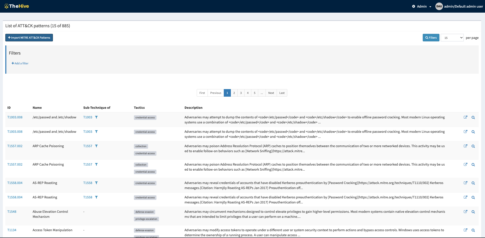

Imported list of ATT&CK Patterns

Deploy the machine attached to follow along on the next task. Please give it a minimum of 5 minutes to boot up. It would be best if you connected to the portal via http://MACHINE_IP/index.html on the AttackBox or using your VPN connection.

Log on to the analyst profile using the credentials: 
```
Username: analyst@tryhackme.me
Password: analyst1234
```


## Q & A

Q1 Which pre-configured account cannot manage any cases?

A1 Admin

Q2 Which permission allows a user to create, update or delete observables?

A2 manageObservable

Q3 Which permission allows a user to execute actions?

A3 manageAction


# Analyst Interface Navigation

## SCENARIO

You have captured network traffic on your network after suspicion of data exfiltration being done on the network. This traffic corresponds to FTP connections that were established. Your task is to analyse the traffic and create a case on TheHive to facilitate the progress of an investigation. If you are unfamiliar with using Wireshark, please check it out first and come back to complete this task. 

Source of PCAP file: IntroSecCon CTF 2020

Task file: [ftp-pcap](ftp-1637928304727.pcap)

Once an analyst has logged in to the dashboard, they will be greeted with the screen below. At the top, various menu options are listed that allow the user to create new cases and see their tasks and alerts. A list of active cases will be populated on the centre console when analysts create them.

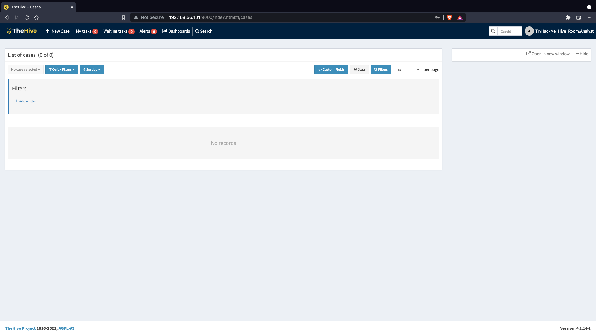
Image: TheHive Main Landing Page

On clicking the `New Case` tab, a pop-up window opens, providing the analyst with fields to input their case details and tasks. The following options must be indicated on the case to set different categories and filter options:

-    Severity: This showcases the level of impact the incident being investigated has on the environment from low to critical levels.
-    TLP: The Traffic Light Protocol is a set of designations to ensure that sensitive information is shared with the appropriate audience. The range of colours represents a scale between full disclosure of information (White) and No disclosure/ Restricted (Red). You can find more information about the definitions on the [CISA](https://www.cisa.gov/tlp) website.
-    PAP:  The Permissible Actions Protocol is used to indicate what an analyst can do with the information, whether an attacker can detect the current analysis state or defensive actions in place. It uses a colour scheme similar to TLP and is part of the [MISP taxonomies](https://www.misp-project.org/taxonomies.html#_pap).

With this in mind, we open a new case and fill in the details of our investigation, as seen below. Additionally, we add a few tasks to the case that would guide the investigation of the event. 

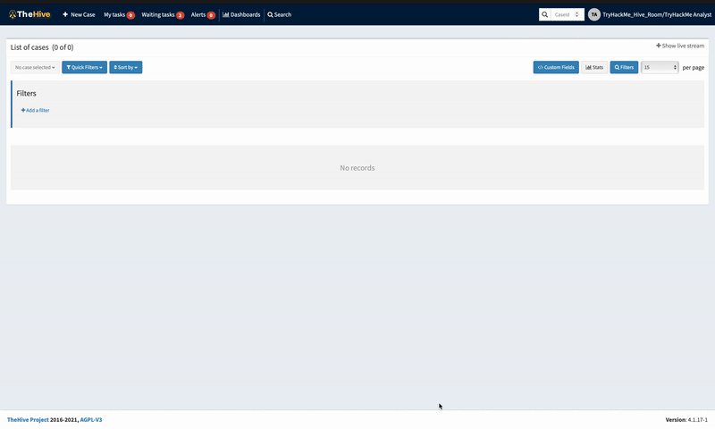
New Case Window

In the visual below, we add the corresponding tactic and technique associated with the case. The TTPs are imported from [MITRE ATT&CK](https://attack.mitre.org/tactics/enterprise/). This provides additional information that can be helpful to map out the threat. As this is an exfiltration investigation, that is the specific tactic chosen and followed by the specific T1048.003 technique for Exfiltration Over Unencrypted/Obfuscated Non-C2 Protocol.

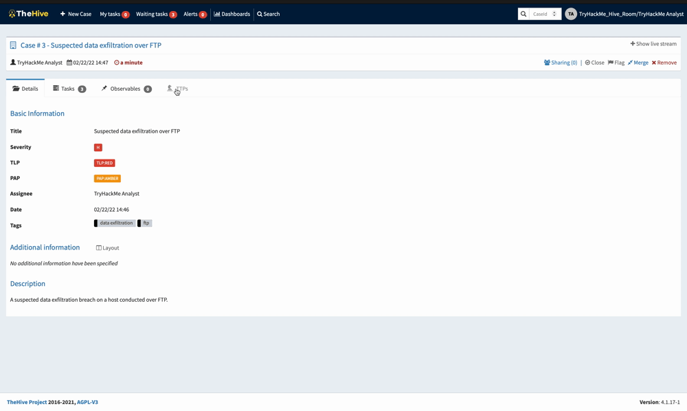
TTPs Selection Window

Case observables will be added from the Observables tab and you would have to indicate the following details:

<table class="table table-bordered" style="font-size:1rem"><tbody><tr><td><b><span style="font-size:18px">Field</span></b></td><td><b><span style="font-size:18px">Description</span></b></td><td><span style="font-size:18px"><b>Examples</b></span></td></tr><tr><td><span style="font-family:Ubuntu;text-align:left"><i>Type *:</i></span><br></td><td><span style="text-align:left">The observable dataType</span><br></td><td>IP address, Hash, Domain</td></tr><tr><td><span style="font-family:Ubuntu;text-align:left"><i>Value *:</i></span><br></td><td><span style="text-align:left">Your observable value</span><br></td><td>8.8.8.8, 127.0.0.1</td></tr><tr><td><span style="font-family:Ubuntu;text-align:left"><i>One observable per line:</i></span><br></td><td><span style="text-align:left">Create one observable per line inserted in the value field.</span><br></td><td><br></td></tr><tr><td><span style="font-family:Ubuntu;text-align:left"><i>One single multiline observable:</i></span><br></td><td><span style="text-align:left">Create one observable, no matter the number of lines</span><br></td><td>Long URLs</td></tr><tr><td><span style="caret-color:rgb(196, 20, 20);font-family:Ubuntu;text-align:left"><i>TLP *:</i></span><br></td><td><span style="text-align:left">Define here the way the information should be shared.</span><br></td><td><br></td></tr><tr><td><span style="caret-color:rgb(196, 20, 20);font-family:Ubuntu;text-align:left"><i>Is <span data-testid="glossary-term" class="glossary-term">IOC</span>:</i></span><br></td><td><span style="text-align:left">Check if this observable is considered an Indicator of Compromise</span><br></td><td>Emotet IP</td></tr><tr><td><span style="caret-color:rgb(196, 20, 20);font-family:Ubuntu;text-align:left"><i>Has been sighted:</i></span><br></td><td><span style="text-align:left">Has this observable been sighted on your information system?</span><br></td><td><br></td></tr><tr><td><span style="caret-color:rgb(196, 20, 20);font-family:Ubuntu;text-align:left"><i>Ignore for similarity:</i></span><br></td><td><span style="text-align:left">Do not correlate this observable with other similar observables.</span><br></td><td><br></td></tr><tr><td><span style="caret-color:rgb(196, 20, 20);font-family:Ubuntu;text-align:left"><i>Tags **:</i></span><br></td><td><span style="text-align:left">Insightful information Tags.</span><br></td><td>Malware IP; <span data-testid="glossary-term" class="glossary-term">MITRE</span> Tactics</td></tr><tr><td><span style="caret-color:rgb(196, 20, 20);font-family:Ubuntu;text-align:left"><i>Description **:&nbsp;</i></span><br></td><td><span style="text-align:left">Description of the observable</span><br></td><td><br></td></tr></tbody></table>

In our scenario, we are adding the IP address 192... as our observable as this IP is the source of the FTP requests. Depending on the situation of your analysis, this observable can be marked as an IOC or if it has been sighted before in a different investigation.

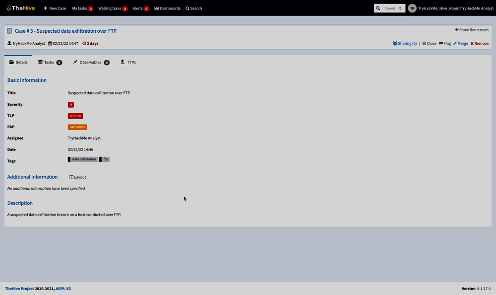
New Observables Window

## Q & A

Q1 Where are the TTPs imported from?

A1 MITRE ATT&CK

Q2 According to the Framework, what type of Detection "Data source" would our investigation be classified under?

A2 Network Traffic

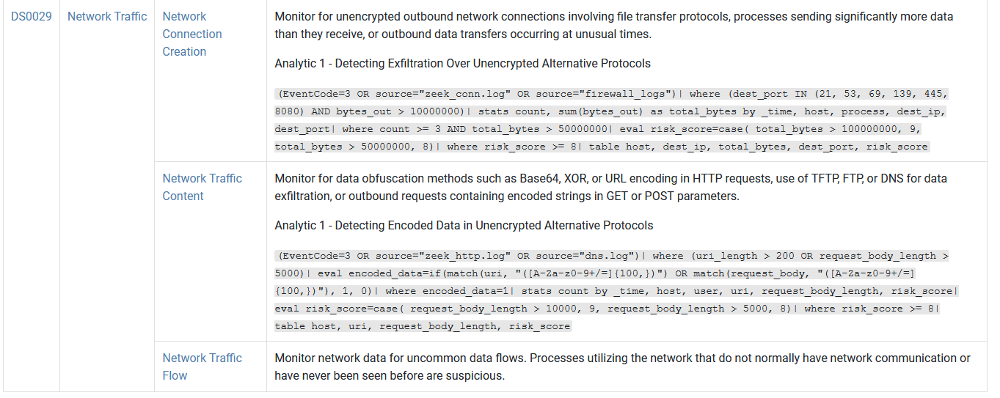

Q3 Upload the pcap file as an observable. What is the flag obtained from https://MACHINE_IP//files/flag.html

A3 THM{FILES_ARE_OBSERVABLES}

Note the flag has a typo:
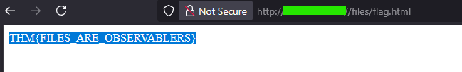

Also check the pcap file in wireshark if you wanna add the source and destination ip addresses as observables, I filtered by `ftp`:
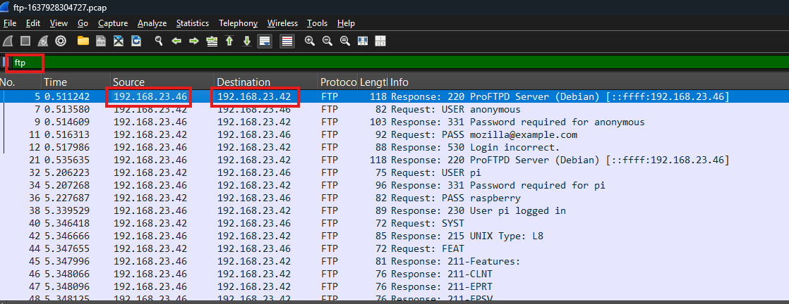


# Room Conclusion

We have now reached the end of TheHive Project room.

This room has hopefully given you a good grasp of how incident response and management is performed using TheHive and give you a working knowledge of the tool.

You are advised to experiment with these foundations until you are completely comfortable with them and to open up to more experiments with the mentioned integrations and others.


