# Introduction

Welcome to the team, kid. I have something for you to get your feet wet.
Our client has a newly hired employee who saw a suspicious-looking janitor exiting his office as he was about to return from lunch.

I want you to investigate if there was user activity while the user was away between 12:05 PM to 12:45 PM on the 19th of November 2022. If there are, figure out what files were accessed and exfiltrated externally.

You'll be accessing a live system, but use the disk image already exported to the `C:\Users\THM-RFedora\Desktop\kape-results\C` directory for your investigation. The link to the tools that you'll need is in `C:\Users\THM-RFedora\Desktop\tools` 

Finally, I want to remind you that you signed an NDA, so avoid viewing any files classified as top secret. I don't want us to get into trouble.

## Connecting to the machine

Start the virtual machine in split-screen view by clicking on the green "Start Machine" button on the upper right section of this task. If the VM is not visible, use the blue "Show Split View" button at the top-right of the page. Alternatively, you can connect to the VM using the credentials below via "Remote Desktop".

THM key
Username 	THM-RFedora
Password 	Passw0rd!
IP 	MACHINE_IP

Note: Once the VM is fully running, please run Registry Explorer immediately, as this tool may take a few minutes to fully start up when executing the program for the first time.

# Windows Forensics review

## Pre-requisites

This room is based on the Windows Forensics 1 and Windows Forensics 2 rooms. A cheat sheet is attached below, which you can also download by clicking on the blue Download Task Files button on the right.

[Windows registry forensics cheatsheet](Windows%20Forensics%20Cheatsheet.pdf)

To better understand how to perform forensics quickly and efficiently, consider checking out the KAPE room.

Good luck!

# Snooping around

Initial investigations reveal that someone accessed the user's computer during the previously specified timeframe.

Whoever this someone is, it is evident they already know what to search for. Hmm. Curious.

## Q & A

Q1 What file type was searched for using the search bar in Windows Explorer?

Hint Use the RegistryExplorer tool to check the "Windows Explorer Address/Search Bars"

A1 .pdf

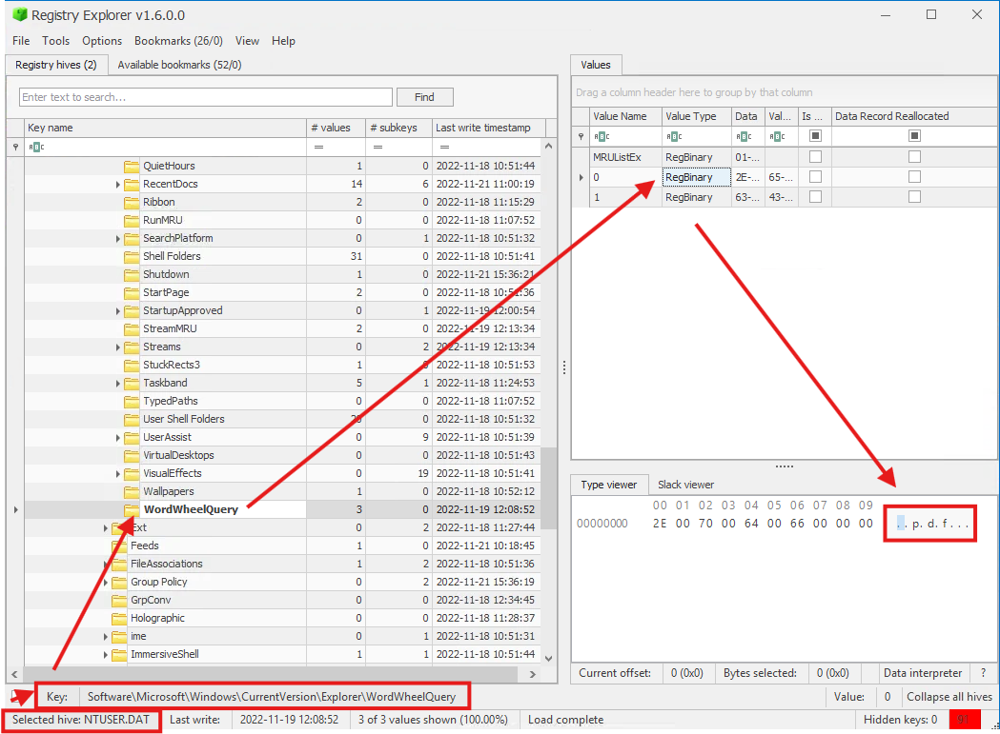

Q2 What top-secret keyword was searched for using the search bar in Windows Explorer?

A2 continental 

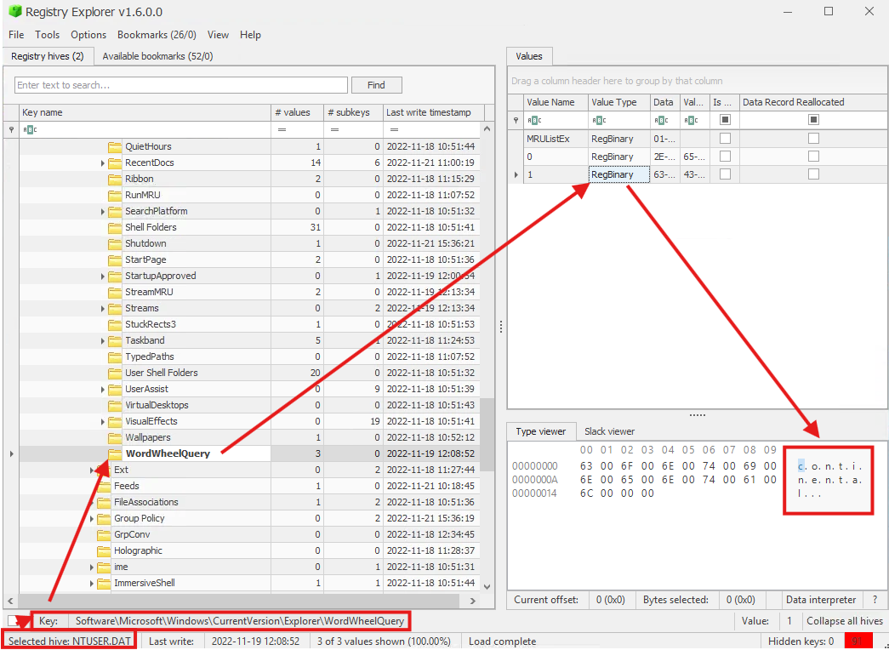

# Can't simply open it

Not surprisingly, they quickly found what they are looking for in a matter of minutes.

Ha! They seem to have hit a snag! They needed something first before they could continue.

Note:  When using the Autopsy Tool, you can speed up the load times by only selecting "Recent Activity" when configuring the Ingest settings.

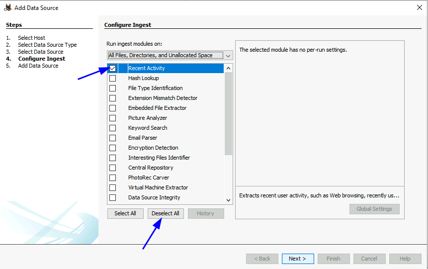

## Q & A

Q1 What is the name of the downloaded file to the Downloads folder?

A1 7z2201-x64.exe

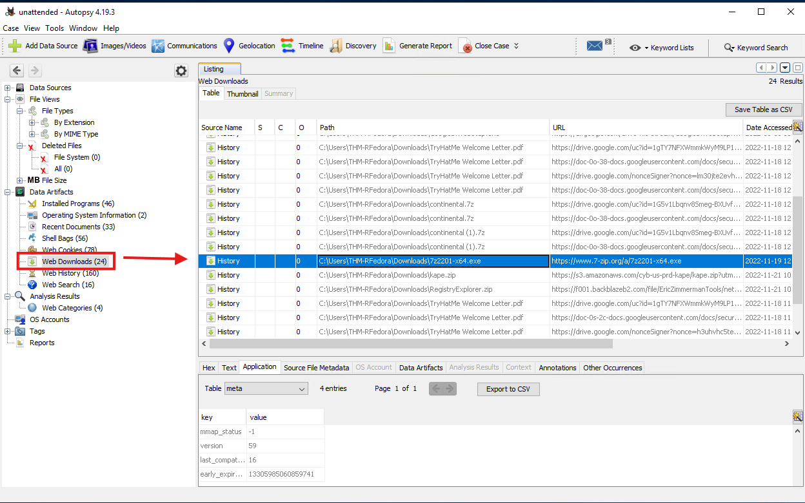

Q2 When was the file from the previous question downloaded? (YYYY-MM-DD HH:MM:SS UTC)

A2 2022-11-19 12:09:19 UTC

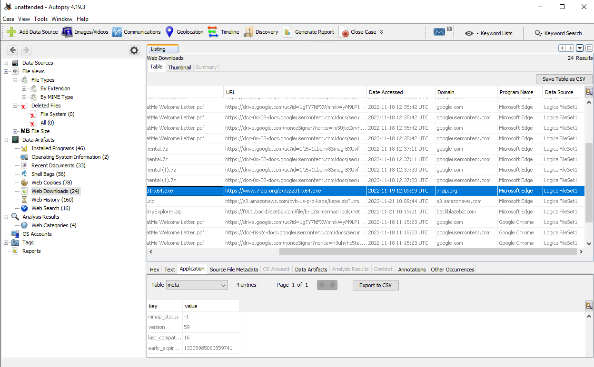

Q3 Thanks to the previously downloaded file, a PNG file was opened. When was this file opened? (YYYY-MM-DD HH:MM:SS)

A3 2022-11-19 12:10:21

If we check recent files there is a png file but no info on Date Accessed

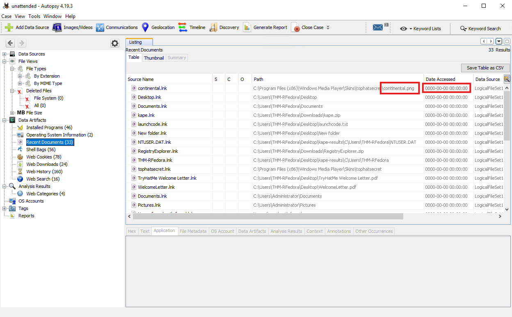

Checking back on registry Explorer

Search for png

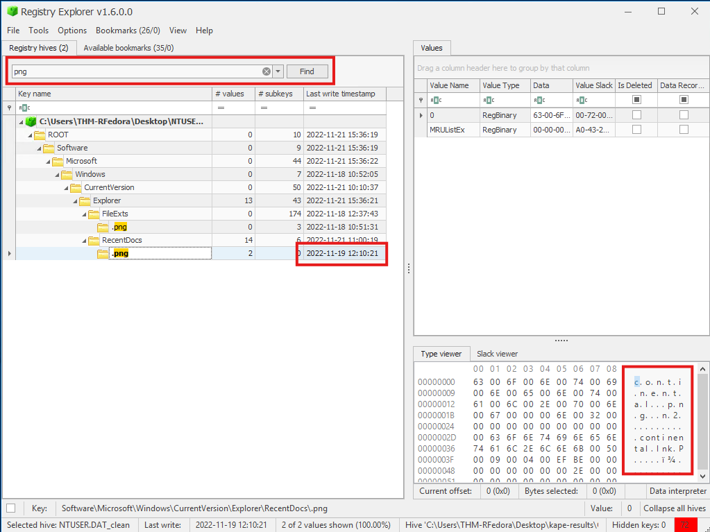

# Sending it outside

Uh oh. They've hit the jackpot and are now preparing to exfiltrate data outside the network.

There is no way to do it via USB. So what's their other option?

## Q & A

Q1 A text file was created in the Desktop folder. How many times was this file opened?

A1 2

We see in Autopsy->Recent Documents that a suspiciously named txt file was opened twice

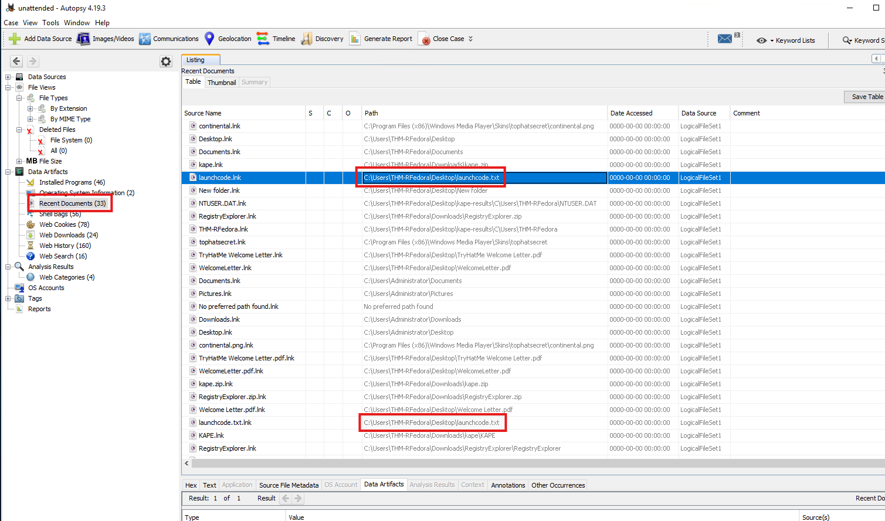

Q2 When was the text file from the previous question last modified? (MM/DD/YYYY HH:MM)

A2 11/19/2022 12:12

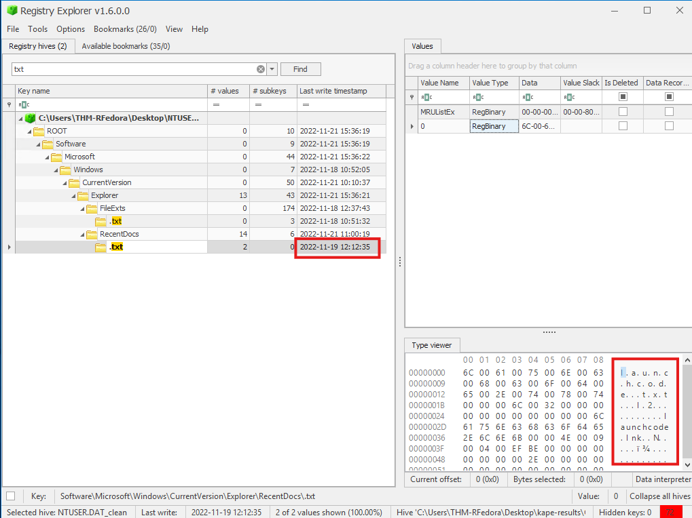

we can also use Eric Zimmerman tools

**JLECmd** is a free, open-source command-line tool for parsing Windows Jump List files. These files record user activity like recently accessed files, applications, and tasks to help streamline workflows in Windows. JLECmd extracts detailed metadata—including timestamps, file paths, application IDs, and shell items—from these artifacts, making it valuable for digital forensics, incident response, and investigations into user behavior or unauthorized access.

The `-d` option specifically specifies a directory to recursively process for Jump List files. It scans the provided path (and all subdirectories) for supported files 

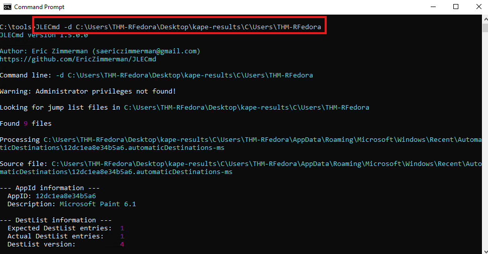

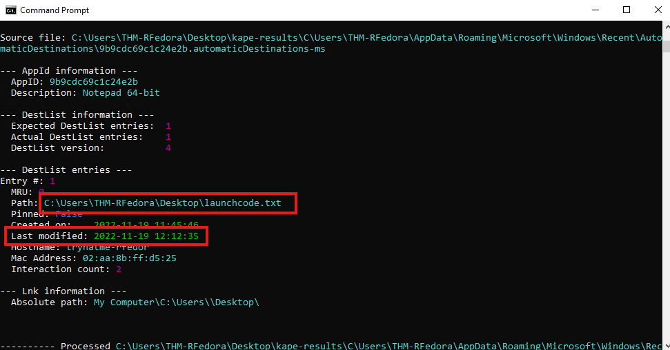

Q3 The contents of the file were exfiltrated to pastebin.com. What is the generated URL of the exfiltrated data?

A3 https://pastebin.com/1FQASAav

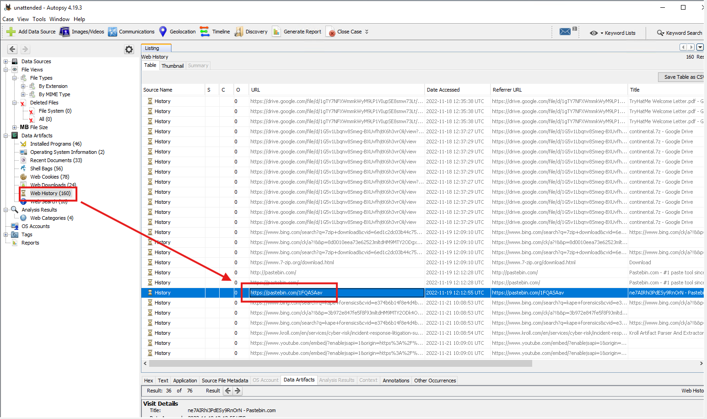

Q4 What is the string that was copied to the pastebin URL?

A4 ne7AIRhi3PdESy9RnOrN

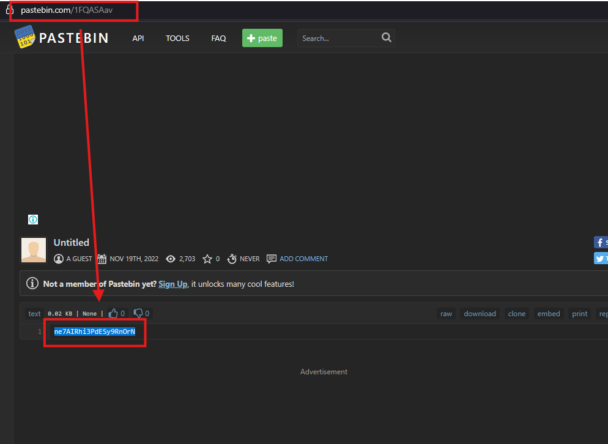

# Conclusion

At this point, we already have a good idea of what happened. The malicious threat actor was able to successfully find and exfiltrate data. While we could not determine who this person is, it is clear that they knew what they wanted and how to get it.

I wonder what's so important that they risked accessing the machine in-person... I guess we'll never know.

Anyways, you did good, kid. I guess it was too easy for you, huh?