# Introduction

In the Windows OS, volatile memory stores data currently accessed or manipulated by the operating system or the user. It is termed volatile due to its transient nature. This memory type is characterized by the temporary retention of data, which is removed upon system shutdown or restart.

In this Room, we will discuss various ways Microsoft OS manages its volatile memory apart from the RAM.

## Learning Objectives

In this Room, we will cover the following learning objectives:

    How Windows Manages Volatile Memory
    Overview of PageFile and how to examine the pagefile
    How a volatile memory is stored once the system is hybernated.
    How to explore the Crash dump.

Pre-requisites

This Room expects users to have a basic understanding of forensics. The following rooms provide the basic knowledge needed to move forward in this Room:

-    Window Forensics 1
-    Volatility
-    Forensics Challenge


# Lab Connection

Before moving forward, start the lab by clicking the Start Machine button. It will take 3-5 minutes to load properly. The VM will be accessible on the right side of the split screen. If the VM is not visible, use the blue Show Split View button at the top of the page.

THM Key Credentials
Username 	administrator
Password 	thm_4n6
IP 	MACHINE_IP

The tools needed to analyse the volatile memory are placed in the "Tools" folder on the Desktop

## Q & A

Q1 Connect to the Lab. How many tools are present in the EZ tools folder on the Desktop?

A1 12


# Managing Volatile Data - An Overview

Windows OS manages volatile memory mainly in various ways apart from RAM to provide a better user experience. Volatile memory can be data currently being used by the system or the user, such as the processes/services running, etc.

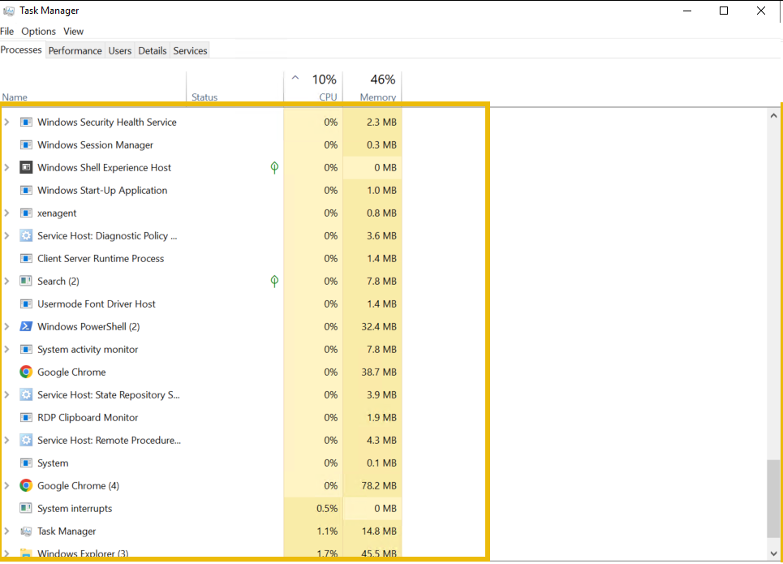

Some of the key data that can be found while investigating the volatile memory can be:

-    Running Processes on the system.
-    Active network connections, including opened ports.
-    Threat information, execution states, and stack traces.
-    System Configurations include settings, environment variables, etc.

Let's explore some key files and concepts revolving around volatile data.

## Concept of a Page

In Windows memory management, a page is a piece of memory. The memory management system splits the physical memory into fixed-size blocks, known as pages. When a program needs to store data in memory, the system assigns it a certain number of pages. This system allows for efficient use of memory, as each program only uses the amount of memory it needs. The size of a page can vary, but it is 4 KB on many operating systems. Pages are crucial for virtual memory, as they allow the operating system to 'page out' less frequently used memory sections to the Disk, freeing up physical memory for other tasks.

### Random Access Memory

Random Access Memory (RAM) is the volatile memory that stores the data and information about the current programs, opening files, etc, being used or loaded into the CPU. It is volatile, meaning all the contents in the RAM will be lost when the Machine is powered off.

### How Memory is Allocated

When we launch a program, the OS allocates a portion of RAM to store the data and code so that the program can function properly. This means any file or DLL this program needs to function properly will also be loaded or at least have a pointer to it.

### Page File

Windows also uses the `pagefile.sys` as an extension to the RAM. Think of a situation when a program needs more RAM, but the RAM capacity is full. Microsoft effectively sorts this issue out by transferring less frequently used programs or data into the page file on the hard Disk. This provides the RAM capacity needed for the data being used actively. More details on the page files will be provided in the next task.

### What happens to the Memory when the System is Hibernated?

Imagine you are investigating a laptop from a crime scene, which the new intern has brought to the office for further Investigation. He closed the laptop lid, turning it into hibernation mode; what will you do? Did you jeopardize the whole Investigation?

Well, there is a way out. Microsoft can turn the RAM content into a hibernation file `hiberfil.sys` placed on the Disk, usually on the C drive. The purpose of the hibernation file is to resume the computer while preserving the state of the running programs.

From a forensics point of view, accessing the hibernation file provides valuable information about the Machine's state when it entered the hibernation mode. More details on the hibernation files will be provided in task 7.

### Crash Dumps

Crash dumps are essentially for debugging purposes. Microsoft OS provides various options for dumping the crash files when a crash happens. Some configurations store the volatile data about the running processes, system configuration, etc, when the crash happens, which can be a very useful resource from a forensics point of view.


## Q & A

Q1 What is the default page size (in KB) in most Operating systems?

A1 4

Q2 What is the name of the hibernation file?

A2 hiberfil.sys

Q3 Which file is considered as the extension of the RAM?

A3 pagefile.sys


# PageFile: Overview

The pagefile extends the System's Physical Memory (RAM). When the RAM gets full and cannot hold more data, such as running processes, network connections, etc., Windows turns to the pagefile.

## How Does It Work?

It transfers the less frequently used memory pages from the RAM to a designated storage place on the Hard Drive.

### Where Is It Located?

By default, it is located at `C:\pagefile.sys`. It's hidden by default and can be viewed by opening the terminal in C drive and running the command, as shown below:

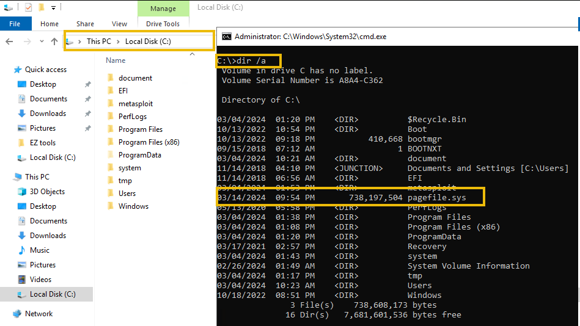

The configuration related to the page file can be found in the location `Computer\HKEY_LOCAL_MACHINE\SYSTEM\CurrentControlSet\Control\Session Manager\Memory Management` within the `SYSTEM` Hive, as shown below:

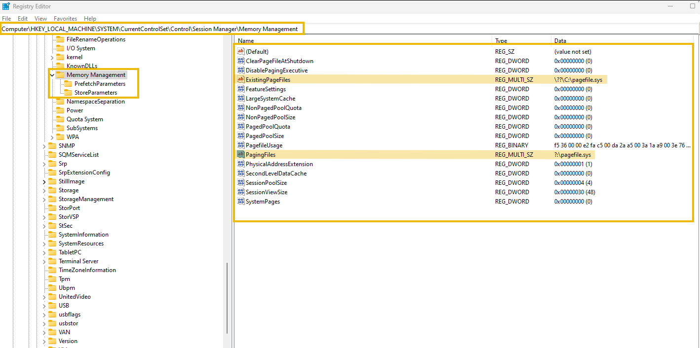


## Extracting using FTK Imager

FTK Imager can be used to extract the pagefile.sys, present in the C: Drive, as shown below:

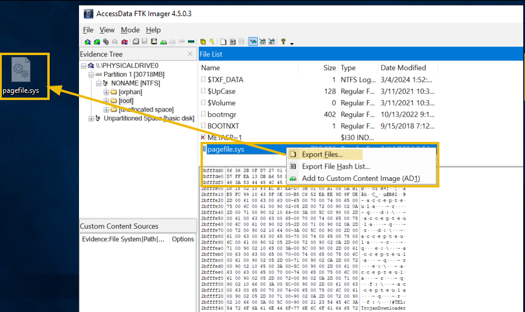

## Analysing the Page File

Now that we have extracted the page file let's utilize the following tools to extract useful information from the page files.

### Extracting Strings

We can use the strings utility to extract the strings and see if we can find anything important, such as the URLs, domain, process name, etc.

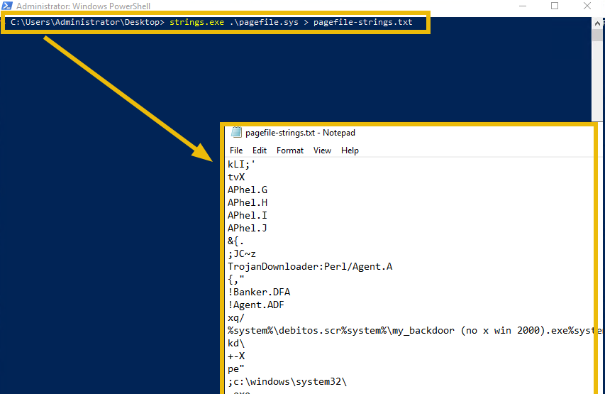

All extracted strings will be stored in the pagefile-strings.txt on the Desktop for review. As the pagefile.sys is around 4GB, so it will take some time to extract all the strings from the pagefile.sys. 

### Bulk Extractor

Bulk Extractor is a handy forensics tool for scanning and extracting files and critical data from the provided disk images, storage devices, etc. This tool can extract the data from the page file, as shown below.
Use the command to instruct the tool to extract information from the pagefile and save it to the Output folder on the Desktop.

Command: `bulk_extractor.exe -o output .\pagefile.sys`

```powershell
PS C:\Users\Administrator\Desktop> bulk_extractor.exe -o output .\pagefile.sys
bulk_extractor version: 1.5.0
Hostname: ü
Input file: .\pagefile.sys
Output directory: output
Disk Size: 738197504
Threads: 2
Attempt to open .\pagefile.sys
17:14:25 Offset 67MB (9.09%) Done in  0:02:04 at 17:16:30
17:14:50 Offset 150MB (20.45%) Done in  0:02:21 at 17:17:11
17:15:08 Offset 234MB (31.82%) Done in  0:02:01 at 17:17:11
17:15:24 Offset 318MB (43.18%) Done in  0:01:33 at 17:16:58
17:15:49 Offset 402MB (54.55%) Done in  0:01:19 at 17:17:08
17:16:09 Offset 486MB (65.91%) Done in  0:01:00 at 17:17:11
17:16:39 Offset 570MB (77.27%) Done in  0:00:42 at 17:17:21
17:16:52 Offset 654MB (88.64%) Done in  0:00:20 at 17:17:16
All data are read; waiting for threads to finish...
Time elapsed waiting for 2 threads to finish:
     (timeout in 60 min.)
All Threads Finished!
Producer time spent waiting: 148.94 sec.
Average consumer time spent waiting: 0.359527 sec.
*******************************************
** bulk_extractor is probably CPU bound. **
**    Run on a computer with more cores  **
**      to get better performance.       **
*******************************************
MD5 of Disk Image: d1cbeac3841a7d77547e9cc5dcf5b688
Phase 2. Shutting down scanners
Phase 3. Creating Histograms
Elapsed time: 178.313 sec.
Total MB processed: 738
Overall performance: 4.1399 MBytes/sec (2.06995 MBytes/sec/thread)
Total email features found: 2853
```

The output folder shows the files extracted from the pagefile below.
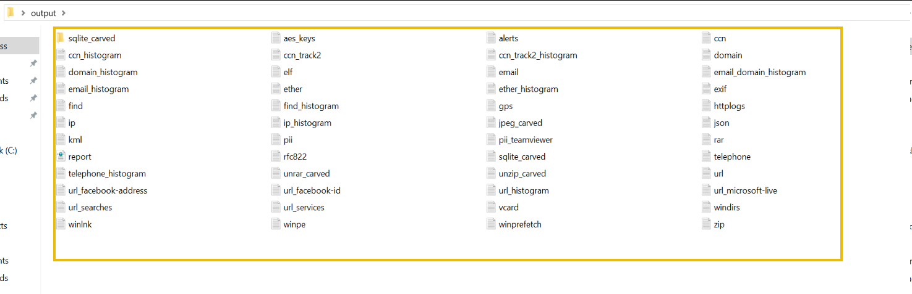

To save the time, the output folder has been placed on the Desktop. We can see some files that may contain sensitive domains, URLs, emails, etc.

### Examining the URLs

Let's look at the URL file and see if we can find some interesting domains.

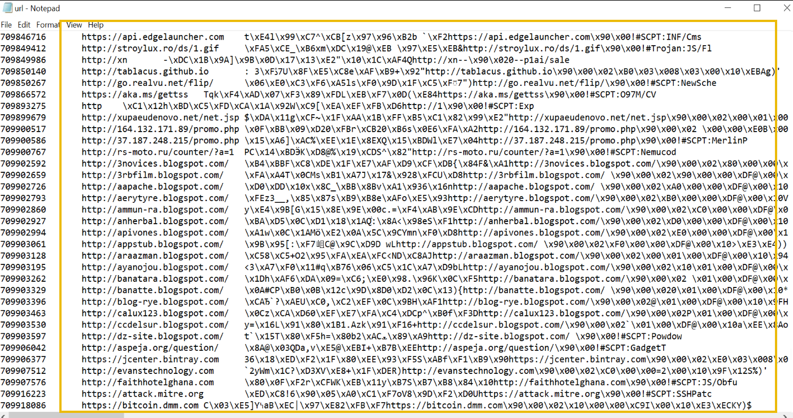

### Examining the Domains

Let's examine the document containing the domains to see if we can find any suspicious domains.

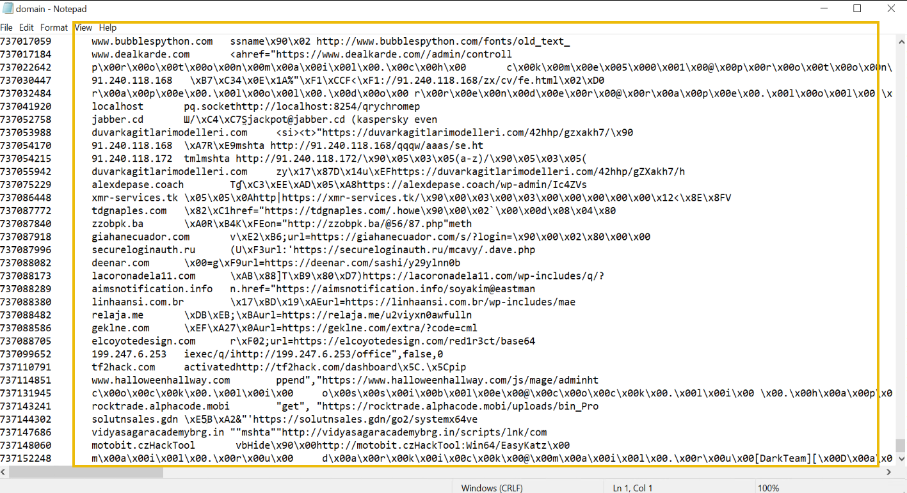

We can also use sites like Virustotal to check the domain and the IPs found, as shown below:

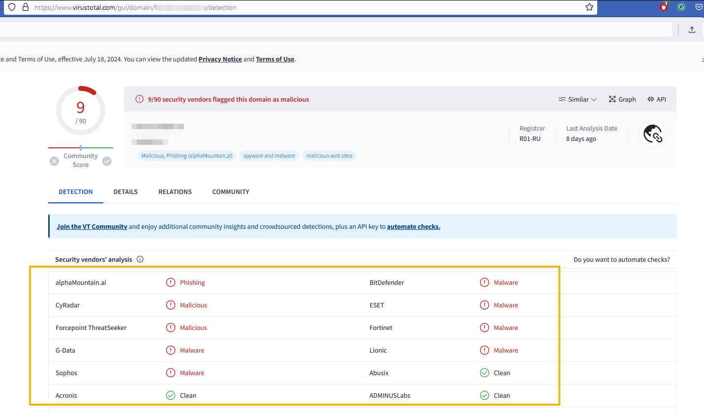

As we have seen in the task, the pagefile can be a good source of information that could help the ongoing forensics investigation.
Now, follow the steps, extract and examine the pagefile on the attached system, and answer the following questions.

## Q & A

Q1 Which Registry Hive contains the information about the pagefile?

A1 SYSTEM

Q2 Examine the domain-histrogram. Which domain associated with distributing Malware has occurred 192 times? Defang the domain.

A2 3z[.]nu

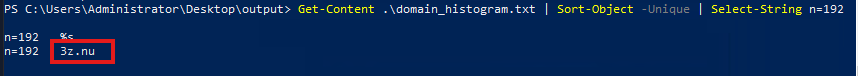

Q3 Check the domain on VirusTotal; What is the verdict about this suspicious-looking domain?

A3 malware

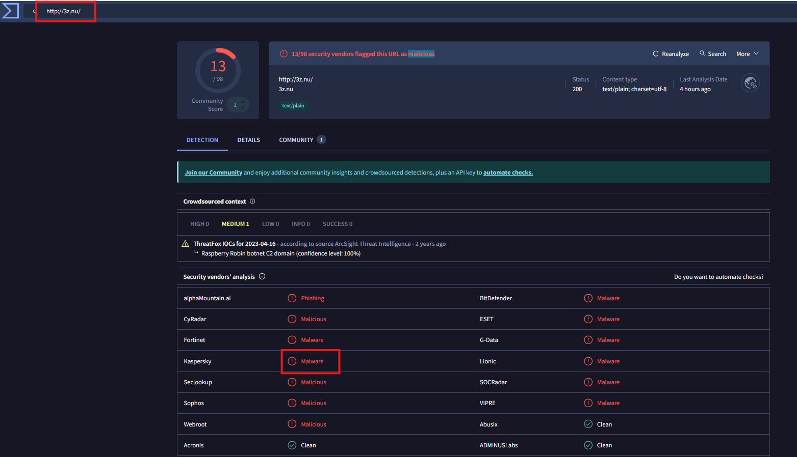


# Hybernation File

Have you wondered what happened to the volatile memory when the system we are about to investigate was accidentally sent to hibernation mode by closing the lid?

Microsoft can preserve the memory elements in the RAM in a hibernation file called `hiberfil.sys` a hidden file, usually placed in the C drive. It is important to note that this hibernation file is a compressed version of the Random Access memory (RAM).

It is created when a system enters hibernation mode and contains a snapshot of its memory (hiberfil. sys). It is not a volatile memory, but it contains volatile content during hibernation, and it can be a great source of information from the forensics perspective.

Let's use the command `dir /a` from the terminal to see all the contents, including the hidden ones as well, as shown below:

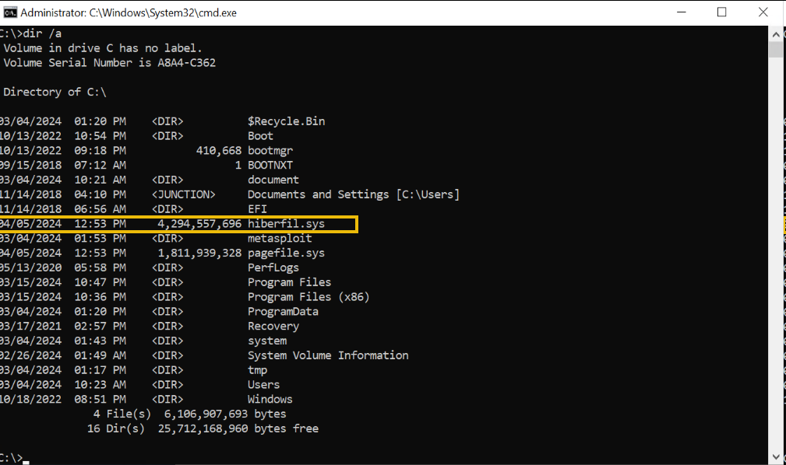

We can see hiberfil.sys in the C drive.

This hibernation file can give us a lot of useful information about the state of the memory. Some of the key information we can extract from the hibernation file are:

-    Contains the memory snapshot of the RAM at the time of hibernation.
-    Provide information about the user activities.
-    Running processes.
-    Network connections.
-    Recently opened files.

## Extracting the hibernation File

To perform the analysis, the hibernation file has to be pulled out of the root directory. It is system-protected and requires Administration rights to access or copy. We will use FTK Imager to extract the file for the Desktop.

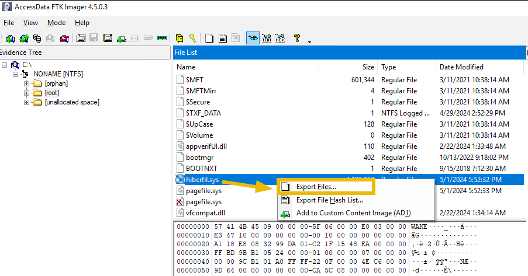

Note: This process can take 4-5 minutes, so feel free to stretch your arms and legs while we wait.

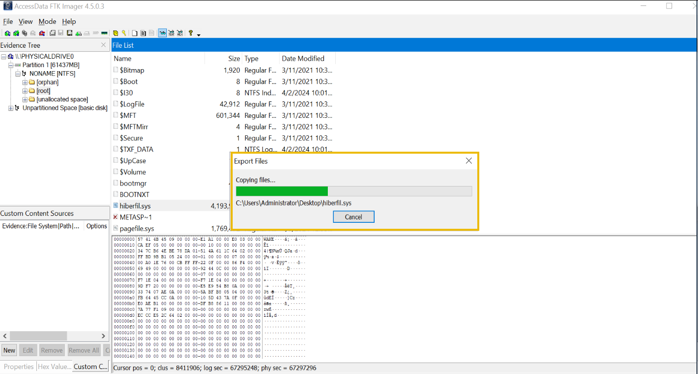

## Examining hibernation File

As we know, this hibernation file is the compressed version of the Windows Memory; we must first uncompress the compressed file we just extracted to analyze the hibernation file.

To uncompress this file, we will use a very handy forensic tool called Hibernation Recon. Click on the Process hiberfil.sys button and provide the hibernation file. It will parse the file and place the raw image in a folder on the Desktop, as shown in the image below: 

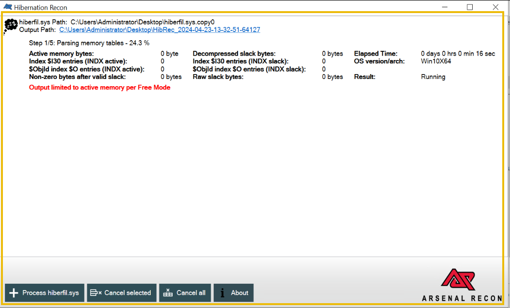

It will create a folder on the Desktop with the uncompressed Memory image. This process takes about 5 minutes. We can use volatility to extract information from the uncompressed hibernation file, as shown below:

## Volatility

Now that we have an uncompressed memory image, we can use the volatility tool to extract the volatile content from the hibernation file.

### Extracting Information

Let's start by extracting the information about the image using the command:

Command: `vol.exe -f <path-to-ActiveMemory.bin> windows.info.Info`

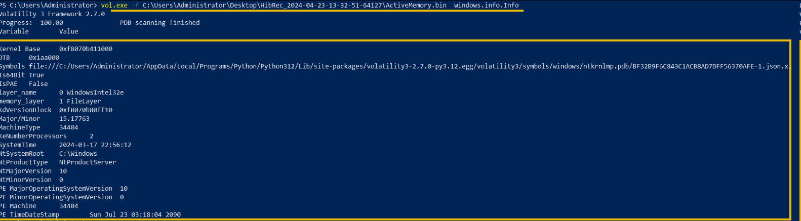

The output shows the metadata about the image.

### Process List

We will use the following command to extract the information about the running processes during hibernation.

Command: `vol.exe -f <path-to-ActiveMemory.bin> windows.pslist.PsList`

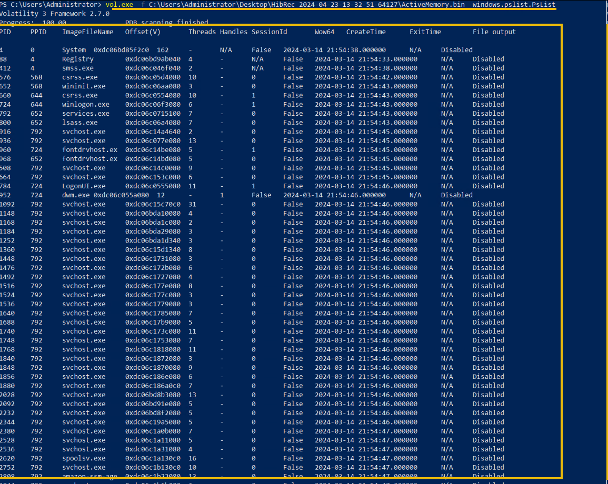

### Process Tree

A process tree can give us more details about the process like the path from which it was executed, the parent process, etc. Let's use the following command to extract the process tree information:

Command: `vol.exe -f <path-to-ActiveMemory.bin> windows.pstree.PsTree`

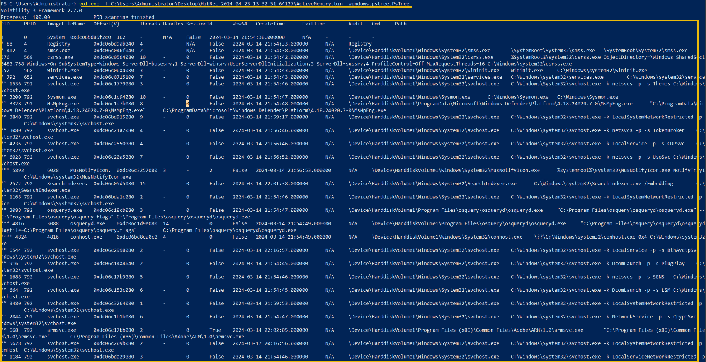

### CommandLine

Commandline is another useful plugin for seeing what commands were executed on this host during hibernation. Use the following command to see a list of commands.

Command: `vol.exe -f <path-to-ActiveMemory.bin> windows.cmdline.CmdLine`

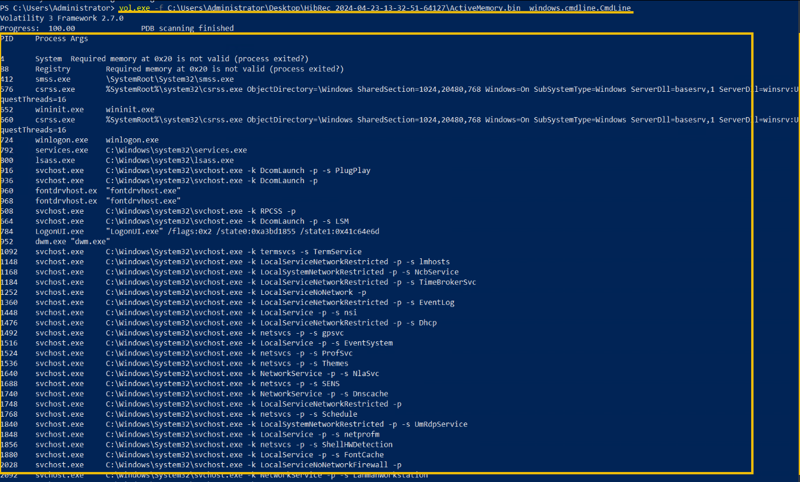

We can use more plugins to get detailed information about the volatile memory in the hibernation file.


## Q & A

Q1 At the time of hibernation, which network scanning tool was running?

A1 wireshark

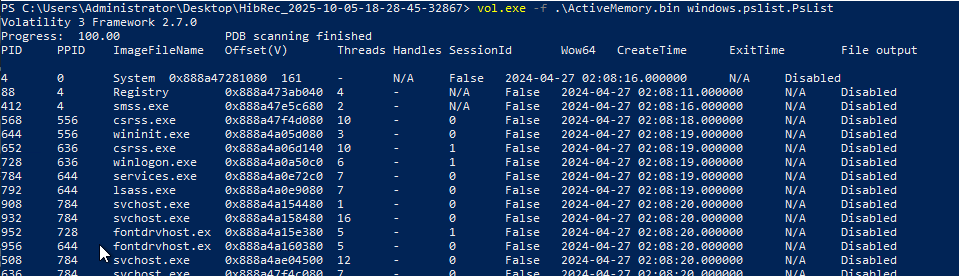

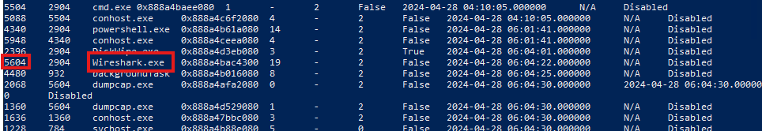

Q2 What is the process ID associated with the network scanning tool?

A2 5604

Q3 Examine the command lines executed on this host; which data wiping tool was executed on the host?

A3 diskwipe.exe

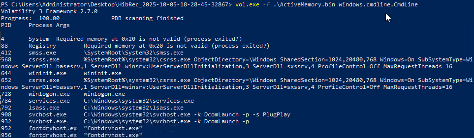
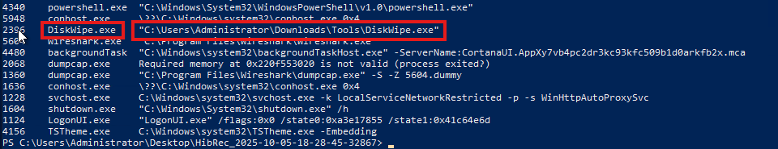

You can see the name of the tool in the image from the previous answer too.

Q4 What is the full path, from which the data wiping tool was executed?

A4 C:\Users\Administrator\Downloads\Tools\DiskWipe.exe


# Crash Dump: Overview

What happens when a system crashes? Microsoft OS generates a crash report containing information related to the crash for debugging purposes on the disk. Once the system goes into the crash, the OS copies the data into the paging file and moves to the crash dump after the system is turned on. The OS provides different configuration options to handle system failure.

**Direction**: Go to Control Panel -> System and Security -> System -> Advanced System Properties -> Settings.

Looking at the Startup and Recovery settings, we can see different configuration options to set, as shown below:

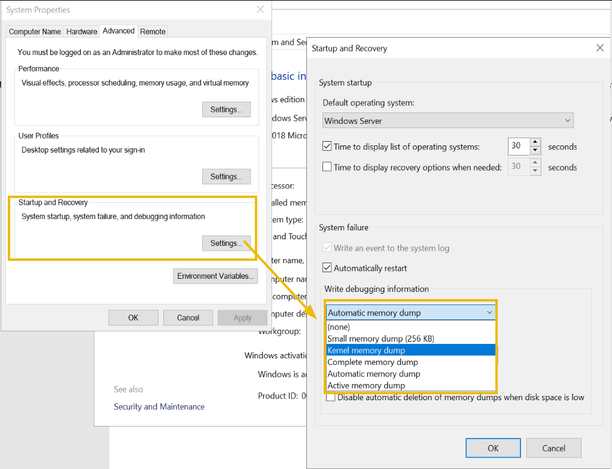

Each Crash Dump option is explained below:

<table class="table table-bordered"><tbody><tr><td><b>Dump type<br></b></td><td><b>Information<br></b></td></tr><tr><td><b>Small memory dump<br></b></td><td>This option creates a small memory dump file (minidump) containing minimal information about the system state during 
the crash.</td></tr><tr><td><b>Kernel Memory Dump<br></b></td><td>This option creates a dump file that contains all the kernel memory contents at the time of the crash. Kernel memory dumps can be 
significantly larger than small memory dumps.</td></tr><tr><td><b>Complete Memory Dump<br></b></td><td>This option creates a dump file that contains all the contents of the physical memory (<span data-testid="glossary-term" class="glossary-term">RAM</span>) at the time of the crash. Complete memory dumps 
are the largest type of dump files.</td></tr><tr><td><b>Automatic memory dump<br></b></td><td>This option is similar to the kernel memory dump but is automatically 
triggered when Windows detects a system crash. The size of the dump file
 is dynamically adjusted based on the amount of <span data-testid="glossary-term" class="glossary-term">RAM</span> installed in the 
system, ensuring enough space is available to capture the necessary
 information.</td></tr><tr><td><b>Active Memory Dump<br></b></td><td>This option contains the memory dump of the active users and kernel modes.<br></td></tr></tbody></table>

The settings about the crash dump can be viewed in the Registry Hives, as shown below:

**Registry Key**:`HKEY_LOCAL_MACHINE\SYSTEM\CurrentControlSet\Control\CrashControl`

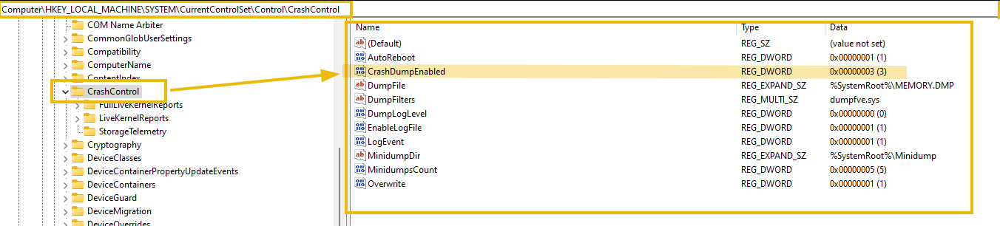

As in the above image, the value of the field CrashDumpEnabled is set to 3, representing the small memory dump setting selected in the settings. More details about the Registry values can be viewed in the official document, as shown below:

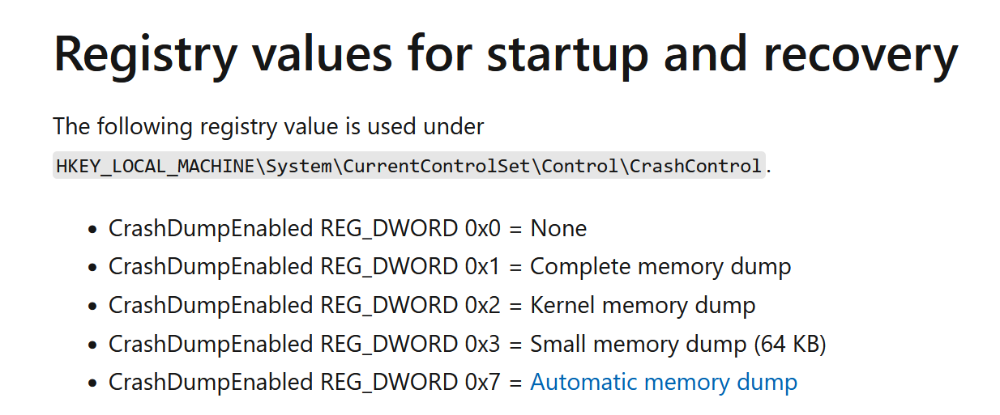

## Reliability Monitor

While investigating the infected machine, it can be useful to check how many times the system has crashed previously and then look for the crash dump files to extract information that could aid the investigation. Search for the Reliability Monitor option in the Control panel, and it will show exactly when and how many times the system went into trouble.

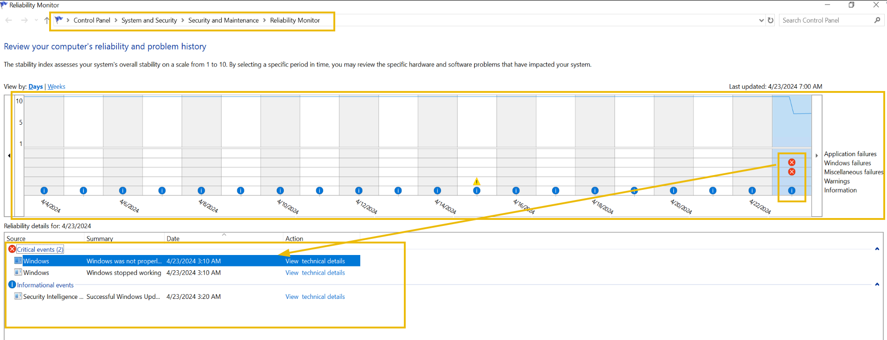

## Creating Crash Dump

During the investigation, if we find a suspicious process ruining on the host, we can also create the crash dump of the active process by opening the Task Manager, right-clicking on the process, and making the manual dump, as shown below:

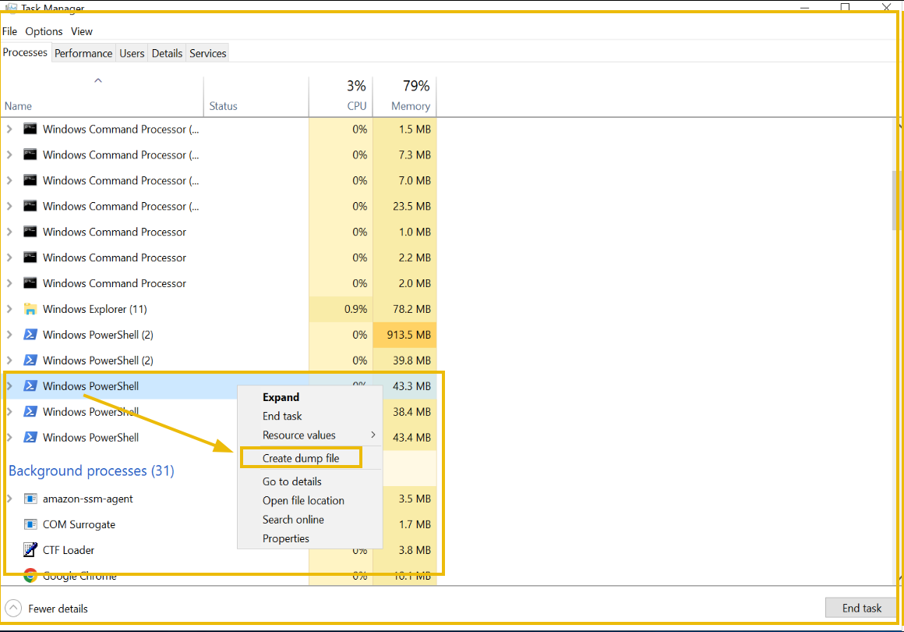

Go to the path where crash dumps are stored, and save it into the Desktop for further investigation.

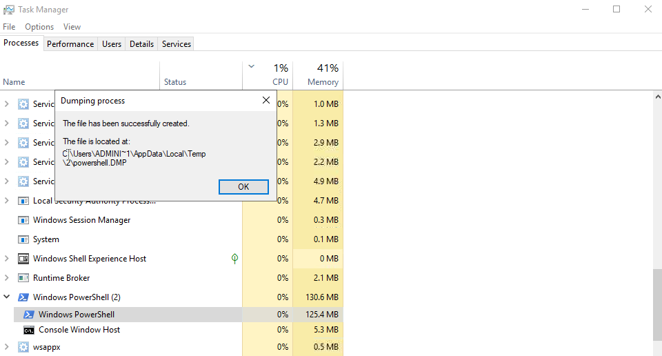


## Q & A

Q1 What is the value of CrashDumpEnabled field in the Registry?

A1 1

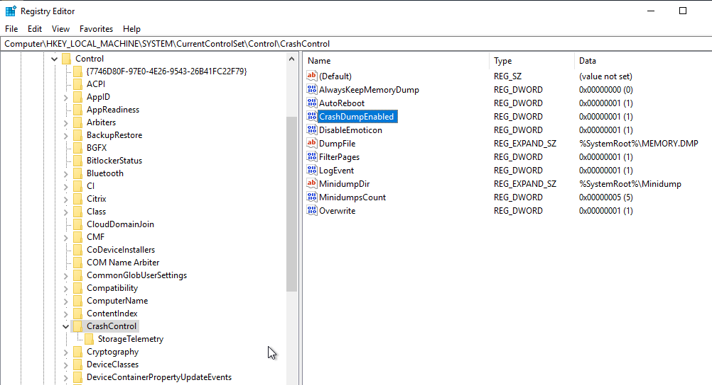

Q2 Examine the Reliability Monitor chart. What is the report ID of the last crash dump?

A2 cf3767cb-2cdf-4b9a-b6e1-c222d4fd192d

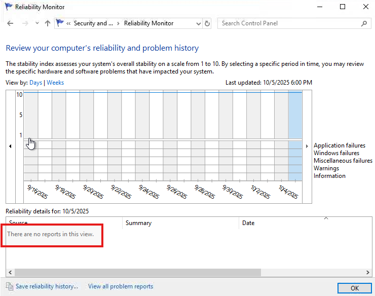


Q3 How many times the system has reported critical events in the past?

A3 7

i just guessed that one cause you're suppossed to check the reliability monitor for that, and it doesnt show any crashes

Q4 What is the default path set for placing the crash dump in the settings?

A4 %SystemRoot%\MEMORY.DMP

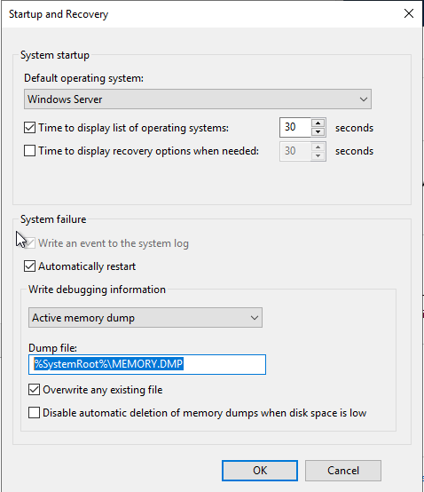


# Analysing Crash Dump

Now that we have understood the concept behind crash dumps and why they are important, let's follow the following steps to analyse the crash file we located in the last task. It is important to note that we are trying to extract the volatile data from the crash dump. The amount of volatile data in the crash dump depends on the type of crash configured in the settings.

## WinDbg

WinDbg is a common debugger provided by Microsoft. It is commonly used for analysing and debugging Windows applications, crash dumps, and drivers. We will use WinDbg to analyse and extract volatile data from the crash dump in this task.

To analyse the crash dump, open WinDbg pinned on the Taskbar. Load the dump file into WinDbg, as shown below:

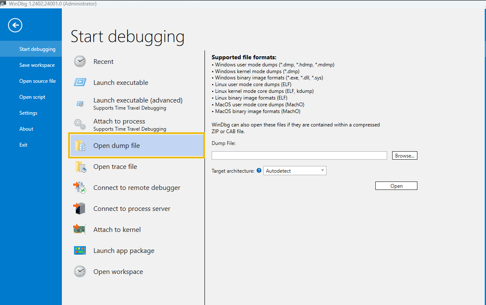

It will take some time to load and process the dump file, as shown below:

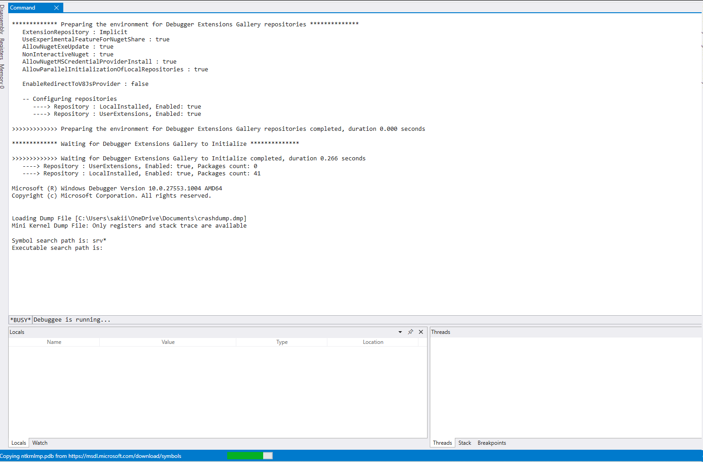

## Analysing Dump

Use the command `!analyze -v` to get the dump file analysed by the debugger. This command performs an automated analysis of the crash dump and provides a summary of the problem. The `-v` option provides verbose output, as shown below:

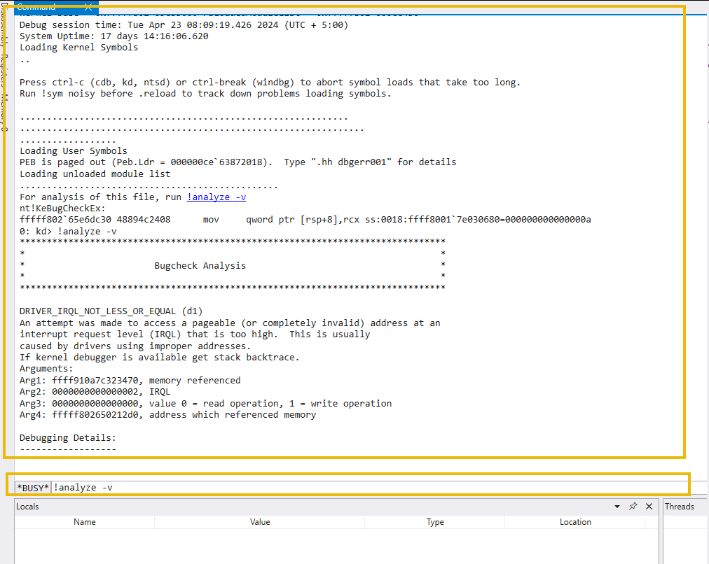

Depending on the size of the dump, we can get the information about the application that caused the crash.

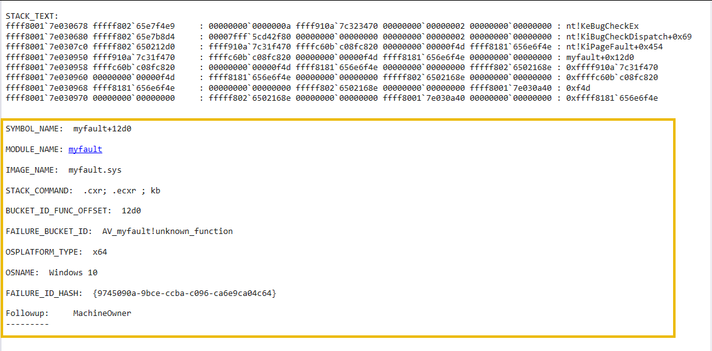

## Time of the Crash

We can get information about the time at which the crash occurred using the command `!time`, as shown below:

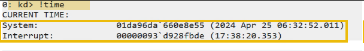

## System Information

We can use the command `!sysinfo` to get information about the system on which it crashed. We will use options like `cpuinfo`, `machineid` to display information related to the machine and CPU, as shown below:

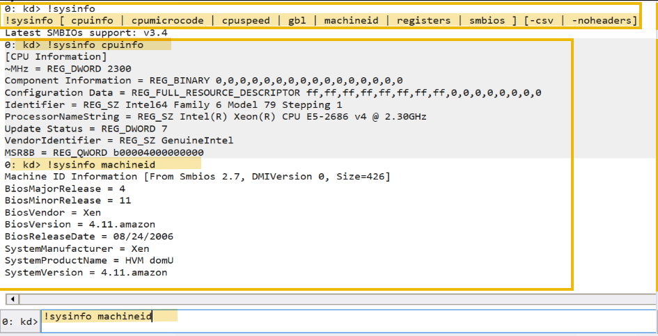

## VM Information

We can use the command `!vm` to get information about the physical and virtual memory usage of the system. It can also be used to get the list of the processes running on the system at the time of the crash.

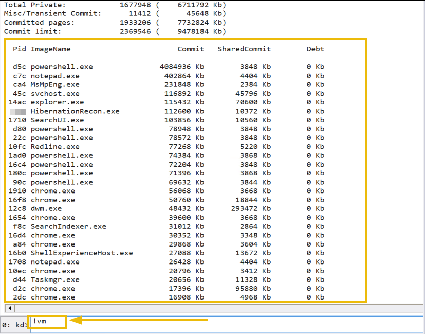

## Running Processes

The `.tlist` command displays all the running processes on the system at the time of hibernation. This can be useful in determining what processes were running on the system and if any suspicious processes were running. The output is shown below:

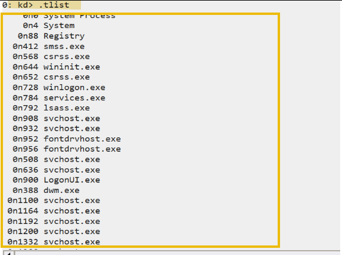

## Extracting Process Details

We can use the command `!process 0 0` to extract information about the running processes, parent process, session, IDs, etc, at the time of the crash, as shown below:

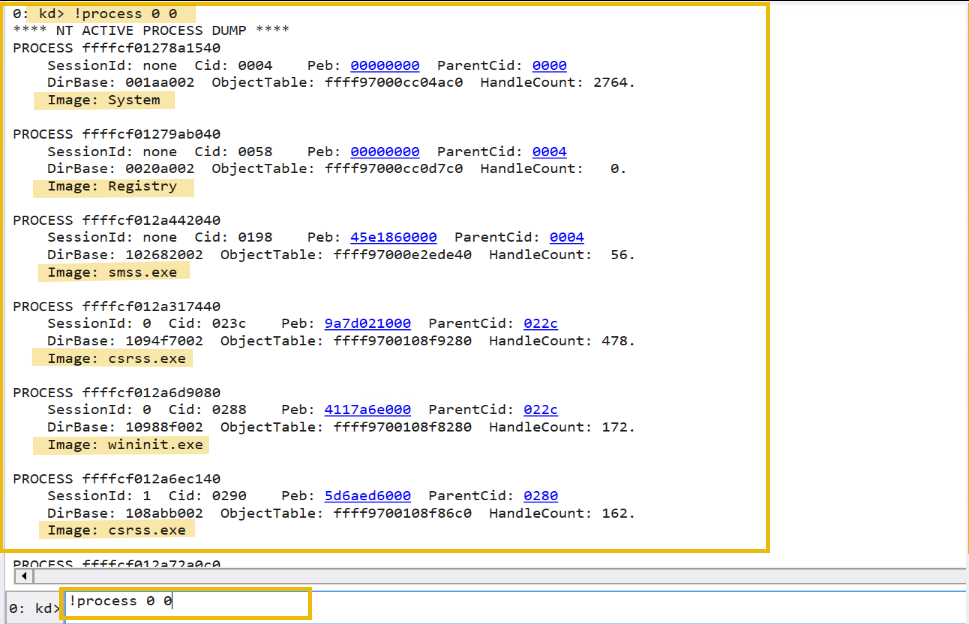

## Process Environment Block (PEB)

PEB is a data structure maintained by the OS that contains information about the Windows environment and the state of the process, including the configuration settings, environment variables, etc.

We will use `!peb` to get the information about the system configuration, as shown below:

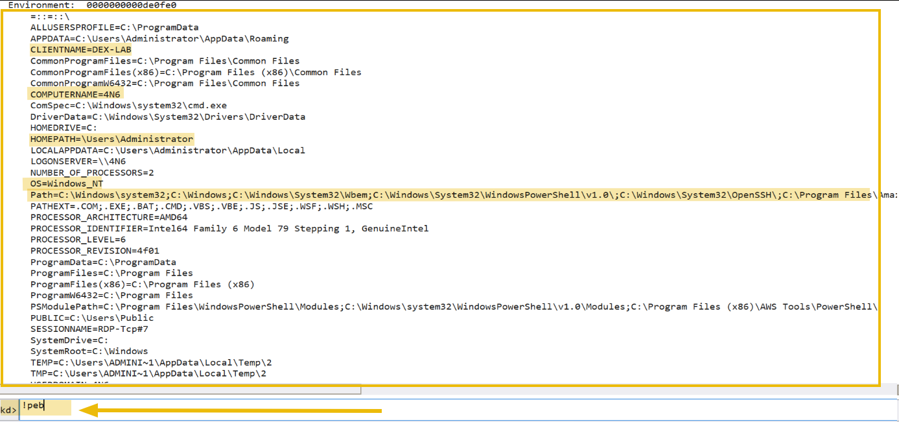

As we only had a small crash file, this only showed information about the process that caused the crash. Review the second crash report and extract the information from it using WinDbg.

In this task, we analysed and examined the memory crash dump on our investigating machine. The memory dump we analysed was a complete memory dump generated by the system when it crashed. It contained information about the system configuration, running processes, etc.

## Q & A


Q1 Which application was responsible for the first crash?

A1 myfault

according to the file `C\Windows\MEMORY.DMP`, not our powershell.DMP

Q2 What is the process ID associated with a suspicious-looking process called evil.exe?

A2 1970

`!vm`
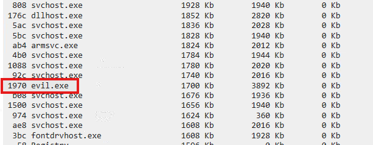

Q3 Which command can be used to find the exact time of the crash?

A3 `!time`

Q4 One of the variables in PEB contains a secret flag; what is the value of the flag?

A4 THM{__ITS_FUN_T0_Learn_at_THM__}

this one works also with our powershell.DMP

`!peb`
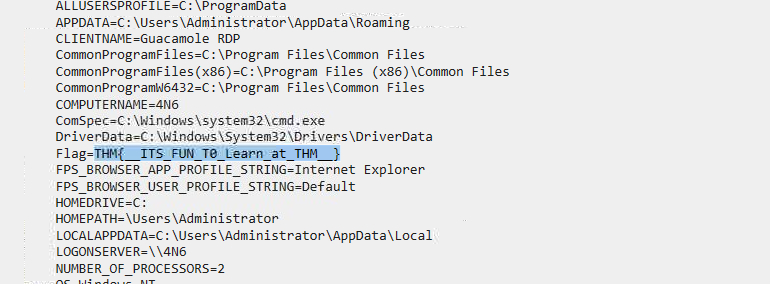


# Conclusion

This concludes analyzing the Volatile Memory room. In this room, we explored alternative files that are not volatile but can contain important volatile data because of how Microsoft manages memory effectively. Some of the key findings are:

-    `hiberfil.sys` is created when the system is turned into Hibernation mode.
-    Windows creates a compressed copy of the RAM into a `hiberfil.sys`.
-    When the RAM capacity is full, Windows copies less frequent volatile data into the `pagefile.sys`.
-    This is done to provide the memory space in RAM for current and important processes.
-    Crash files are created for troubleshooting.
-    Crash files can provide information about the running processes, system configurations, etc.

You can learn more about forensics in the following rooms:

-    User Account Forensics
-    User Activity Analysis
-    Windows Applications Forensics
-    Secret Recipe