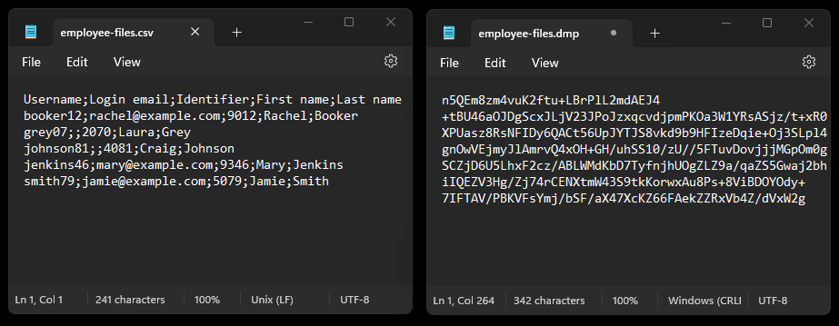
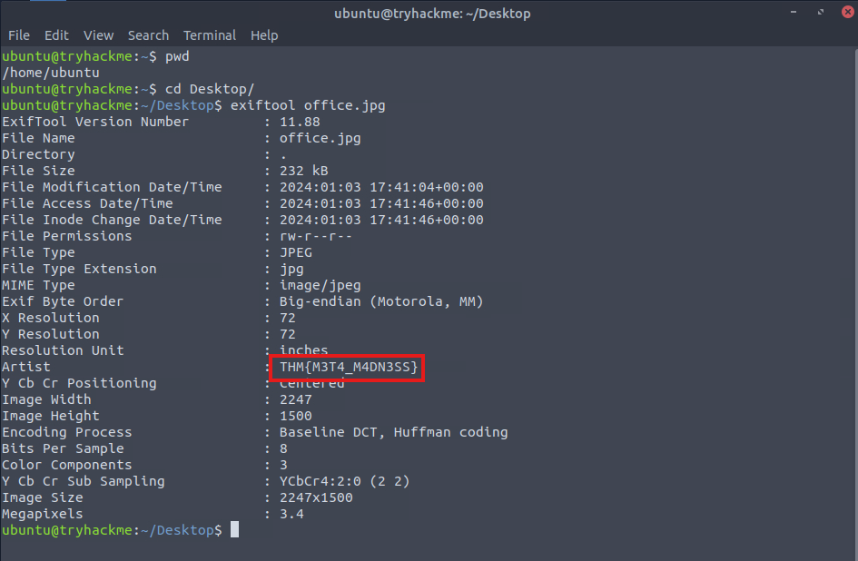
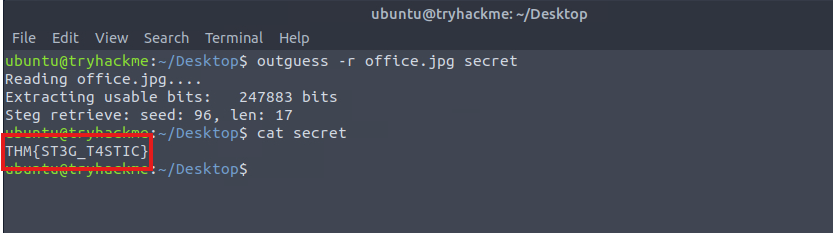

# Introduction

Incident Response (IR) teams and practitioners frequently face several common challenges within the Digital Forensics and Incident Response (DFIR) domain. These challenges often necessitate a nuanced and adaptive methodology to overcome and lead effective IR operations.

In this room, we will explore some of the prevalent difficulties IR teams often face and provide strategic guidance to overcome these challenges. Throughout this exploration, we will address critical components such as organisational culture, resource limitations, data visibility and storage retention, anti-forensics, and human error.

Learning Objectives

-    Understand the common difficulties and challenges encountered in the field of DFIR.
-    Develop skills in overcoming these challenges for a more effective response.
-    Reinforce the importance of maintaining professionalism and ethical conduct in the face of challenges.

Room Prerequisites

-    Incident Response Module
-    Becoming a First Responder


# Organisational Culture

The overarching culture of an organisation is an essential factor in determining the efficacy of an IR team's potential. Ultimately, a culture that values and prioritises a coordinated response is crucial for prioritising, responding to, and learning from incidents.

This section will discuss the complexities of developing a coordinated response culture through:

-    The recruitment of personnel during an incident
-    Communication and coordination challenges
-    The role bureaucracy plays in decision-making
-    Mechanisms for incident reporting

A typical incident response process goes beyond simply acknowledging and resolving an incident; it should involve a proactive and orchestrated effort to notify the right individuals, mobilise teams, and provide stakeholders with the information needed to facilitate collaboration. A coordinated approach such as this allows organisations to respond to incidents quickly and do so with clear direction, mitigating further potential issues.

## Personnel

When a significant incident is detected, the primary focus is recruiting additional personnel to resolve it. Often, the urgency of these incidents demands a rapid response, requiring a specialised team and subject matter experts (SMEs) to assemble and take action. Without a streamlined process for requesting the necessary personnel, the organisation becomes more at risk for prolonged response times and the escalation of incidents. This deficiency becomes even more apparent outside regular business hours when personnel availability is limited.

It's important to understand that an IT or security team does not operate independently; many other groups and departments own applications, data, and other technical resources that IT manages and secures - these are the stakeholders in the organisation. It's essential to involve these relevant stakeholders in the planning process for security events and have them actively involved and informed in the resolution process.

If stakeholders are unaware of the incident, they may also be unaware of the reasons for service interruption or the need for system containment. This could result in other business areas taking action and reintroducing risk. As such, personnel and communication (discussed below) are intrinsically linked.

For example, consider a scenario where a critical authentication bug is discovered in a production software application over the weekend. The development and operation teams are off duty, but immediate action is needed to prevent widespread confidentiality and account compromise issues. It's crucial for the IR lead to quickly assemble a team that includes software development and system operations expertise. The IR management team will need to have the means to reach developers and operations stakeholders, ensuring that individuals with the right technical expertise are promptly informed about the issue, even outside their regular working hours. Integrating a cross-functional IR team ensures that technical personnel from all relevant sides of the organisation can consult and assess the team's options and impact.

## IR Retainers

It's a valuable proactive strategy for teams to consider the option of retainers in their incident response planning. These retainers are pre-negotiated agreements with external cyber security SMEs and specialised teams who are on standby to assist in the event of a security incident. Having an IR retainer ready to be activated can significantly expedite assembling a response team when a critical incident occurs and allow organisations to tap into a broader pool of experts.

## Communication

Similarly, addressing communication challenges before and during incidents is crucial for an effective and coordinated response. The many communication channels teams have available can sometimes result in indecision and disconnection among team members. An essential early step in the IR lifecycle is establishing the team's open communication channels. This step focuses the team's reporting within an agreed-upon place, such as a Slack or Teams channel or a conference call bridge.

To further improve communication effectiveness, the organisation must maintain an up-to-date contact list for all stakeholders. This list should encompass the key individuals involved in the IR process, for example, the Chief Information Officer (CIO), Chief Information Security Officer (CISO), Head of Information Security, and internal response teams. Depending on the severity of the incident, this list should also include contacts from departments like Human Resources (HR), Public Affairs, and Legal teams. In certain situations, external resources such as data or system owners, law enforcement, and government entities like the US-CERT (United States Computer Emergency Readiness Team) might need to be included based on the incident's location and scope.

Additionally, preparing alternative out-of-band communication methods is essential during incident planning. This is particularly important if the scope of the incident or compromise encompasses the agreed-upon communication method itself, as attackers might be able to eavesdrop and gain awareness of the incident response strategy. It is best to be cautious and assume that threat actors can intercept communications until you have confidence that your regular communication channels are not compromised.

Communication tools such as Telegram, Signal, or other messaging channel platforms serve as effective out-of-band communication as they operate independently of the corporate network, offering a layer of separation that can be crucial during an incident.

## Situation Reports (SITREPs)

Creating Situation Reports (SITREPs) is pivotal in proactively engaging with key stakeholders and establishing a unified source of truth regarding risks. Organisations often overlook the significance of timely progress updates and prioritise technical aspects over communication.

An effective SITREP includes a clear summary of the incident for quick understanding. It should highlight key risks and developments that need immediate attention. Additionally, it should summarise and track critical tasks and their status between each team. Finally, the report should end by planning when stakeholders expect the next update for transparency and accountability.

## Bureaucracy

Organisational bureaucracy can also pose challenges for IR teams in various ways. For example, a non-agile decision-making structure, characterised by multiple layers of hierarchy, can often delay when quick and decisive actions are required. Additionally, obtaining necessary approvals and authorisations for performing various remediation or mitigation actions can be time-consuming, further allowing the impact of the incident to escalate.

Emphasising IR's strategic importance in protecting organisational assets and company reputation becomes crucial in driving this cultural shift and must be done before an incident occurs during the preparation phase of the IR cycle.

Recognising that delays in decision-making will have severe consequences for the organisation as a whole can help remove bureaucratic obstacles and create an environment conducive to swift decision-making when required. On a hands-on level, this will require reevaluating existing protocols, discussing with stakeholders to eliminate redundant approval processes, and empowering IR teams to act decisively in the face of evolving threats.

By demonstrating impact and framing incident response as not just a reactive measure but also a proactive measure, executives and decision-makers can be more inclined to provide the necessary resources and attention to strengthen the organisation's overall security posture.

## Incident Reporting Mechanisms

Identifying and responding to incidents heavily relies on the ability of the organisation to quickly and accurately report issues as they arise. However, the lack of a streamlined and efficient reporting mechanism can lead to significant delays or a complete lack of incident detection.

A security team can employ several techniques to mitigate these challenges, such as implementing automated reporting tools (phishing or other security reporting tools), establishing clear reporting channels, and conducting regular security awareness training to ensure timely and accurate incident reporting.

Building a cyber-aware culture is often an organisation's greatest defence by instilling a sense of empowerment and understanding in employees. By demonstrating the direct link between individual actions and the overall cyber security posture of the organisation, a culture that inherently values security and incident handling can thrive.

## Q & A

Q1 Who are the primary individuals or groups that must be kept informed and involved to ensure an understanding of current risks?

A1 Stakeholders

Q2 What kind of report updates key individuals and establishes a unified source of truth regarding risks?

A2 situation report


# Resource Constraints

In resource-constrained environments, a significant challenge IR teams face is the need for more:

-    Funding
-    Budget
-    Personnel

Budget constraints often affect the acquisition of security tools and infrastructure necessary for adequate incident response. As discussed previously, a shortage of personnel can aggravate these issues, as a smaller team is more likely to struggle with handling multiple incidents at a time. Making calculated trade-offs and compromises where possible is crucial for the success of IR teams.


## Shortage of Personnel


The shortage of team members in IR due to resource limitations can create significant challenges that affect IR capabilities. For example, understaffed teams often face increased workloads, leading to burnout and a greater potential for human investigation errors. When the volume (quantity) of incident handling takes precedence out of necessity, the quality often suffers, as crucial considerations may be overlooked. This oversight can result in missed opportunities to address underlying issues, leading to the escalation of incidents and more significant consequences later on.

IR teams often require diverse skill sets, and the lack of specialised expertise in areas such as log analysis, malware analysis, and network forensics, for example, can hinder the quality and depth of investigations. Moreover, budget constraints limit training opportunities for staff, leaving team members without the specialist skills to address evolving threats.

To overcome these challenges, organisations can implement cross-training programs, foster a culture of continuous learning, and establish knowledge-sharing opportunities. Outsourcing certain IR aspects to specialised providers can help supplement in-house capabilities. Further advocations for increased budget allocations by demonstrating the value of a robust incident response team are also crucial for addressing these staffing needs at the top level.

As mentioned in the previous task, organisations can proactively establish IR retainer contracts to assist in the event of a security incident. It's important to acknowledge that security incidents are typically not constant occurrences, and when they do happen, there is a sudden surge in workload. This increased workload can significantly impact incident responders. As such, it is an effective strategy for organisations to activate retainers to consult with third-party expertise and relieve their team's workload for an effective response.

## Inadequate Tooling

Like a shortage of personnel, budget constraints can significantly affect the available tooling that contributes to the overall efficacy of an IR team's capabilities. Dependency on outdated software can compromise the IR process, as legacy tools can lack capabilities to combat evolved threat actors. Additionally, there's an indirect cost implication, as the team might expend valuable time creating makeshift solutions instead of investing in a robust tool set.

Organisations can consider exploring open-source tooling as a cost-effective alternative to address budget constraints. Prioritising tool investment based on specific needs or areas according to the organisation's threat model optimises resource utilisation. Additionally, organisations can consider investing in training to maximise the potential applicability of their existing tools. Alternatively, cloud-based solutions are an option that can offer scalability without a high upfront cost.

## Maximising Resources

Maximising the available IR resources within an organisation begins with risk-based prioritisation. Conducting a comprehensive risk assessment will identify and help prioritise critical assets, allowing teams to allocate resources based on the severity of identified risks. Strategic outsourcing of specific functions can also optimise resource allocation. Identifying non-core functions or specialised tasks suitable for outsourcing ensures that internal teams can focus on core security responsibilities. It's essential, however, to ensure that outsourced operations align with security and compliance requirements.

As mentioned, a key element in resource optimisation is fostering a versatile team through cross-training and supporting skill development. By providing team members with opportunities to enhance their skills, organisations can maximise the effectiveness of their cyber security personnel.

## Q & A

Q1 When prioritising tool investments, what strategic focus should teams consider to ensure alignment with the organisation's security concerns?

A1 Threat Model

Q2 What prioritisation method involves conducting a comprehensive risk assessment to identify critical assets?

A2 Risk-Based Prioritisation


# Data Visibility

IR teams can also face data visibility and storage retention challenges. Within the growing nature of digital environments, many variables can contribute to decreased visibility, such as:

-    Asset proliferation and distributed evidence
-    Complexities of data retention
-    Compliance regulations
-    Physical and logical constraints

## Asset Proliferation and Distributed Evidence

The growing state of digital assets across many different organisational environments poses an inherent challenge for IR teams. As organisations become increasingly complex with IT infrastructure, cloud services, IoT devices, and hybrid working environments, evidence relevant to an incident is often distributed across many of these systems and environments. This dispersal of evidence and assets makes it challenging for IR teams to quickly and comprehensively identify, analyse, and contain security incidents.

Utilising a robust asset management system helps maintain an up-to-date inventory of assets across diverse environments. Additionally, using automated discovery tools and centralised asset repositories enables IR teams to quickly identify and track these ever-changing assets. Along with asset discovery, deploying host-based endpoint detection and response (EDR) solutions will enhance the real-time and centralised monitoring, providing visibility into the activities and collecting evidence relevant to security incidents.

Additionally, classifying the necessary evidence is crucial to effectively managing incidents. It is essential to approach evidence collection strategically and in a scalable manner. For instance, obtaining complete disk images from every affected host may not always be practical. Instead, the focus should be on gathering only the necessary evidence that helps responders swiftly understand the actions of the threat actor. In many cases, recovery efforts take precedence, where responders prioritise restoring the affected hosts before forensic evidence essential to the attacker's intrusion timeline can be collected.

## Data Retention and Legal Compliance

Data retention is a delicate balancing act for IR teams, as retaining extensive logs is crucial for post-incident analysis and compliance purposes. However, this process can also introduce storage capacity and cost challenges. Striking the correct balance between retaining enough data to conduct thorough investigations, identifying baselines, and ensuring compliance with legal frameworks like GDPR and HIPAA requires a nuanced approach.

For example, PCI DSS is a security standard for cardholder data collection. Specifically, entities that collect cardholder data must keep an audit trail for at least one year, and at least three months of data must be available for analysis. On the other hand, HIPAA is a privacy act that protects an individual's collected medical records and identifiable health information. HIPAA compliance generally requires the retention of data for up to six years. As such, organisations must be proactive in planning engagement with regulators during incident management.

A common pitfall in IR is the lack of early engagement with legal counsel, which can introduce unnecessary risk to the overall response effort. Engaging with counsel, whether internal or external, early in the response is crucial. Organisations may fall short of meeting regulatory and compliance obligations without sound legal guidance or inadvertently share excessive information with external parties.

Additionally, deploying intelligent data retention policies involves classifying data based on function, criticality, and regulatory compliance. Automated tools for data lifecycle management within SIEM solutions or long-term storage solutions can allow teams to retain critical information while effectively purging non-essential data. Additionally, many cloud providers offer the ability for data classification and nuanced retention and immutability policies. This kind of approach not only ensures compliance but also optimises storage resources.  

## Physical and Logical Constraints

The challenges IR teams face are not solely confined to the digital landscape. Physically dispersed infrastructures, remote work scenarios, and the increasing implementation of third-party services all contribute to the difficulty of quickly accessing and analysing critical data during an incident. Additionally, the limitations of existing storage solutions, bandwidth constraints, and the sheer volume of data generated in modern environments further strain the capabilities of IR teams, impeding the ability to respond swiftly and effectively.

Organisations can leverage cloud-based storage infrastructure solutions and collaboration tools to overcome physical and logical constraints. Cloud storage enhances scalability and accessibility, allowing IR teams to store and process large volumes of data more efficiently. Adopting collaborative incident tracking software (like JIRA, ServiceNow, Trello, Asana, etc.) allows seamless communication and coordination among dispersed team members during incident response, overcoming geographical and logistical barriers.

## Q & A

Q1 What centralised system can IT and security teams use to track an up-to-date inventory across an organisation's environments?

A1 Asset Management

Q2 What type of policy dictates how long and in what manner an organisation must retain and manage its data?

A2 Data Retention Policy


# Anti-Forensics

Let's now shift focus and discuss an obstacle typically caused by malicious purposes. Anti-forensics refers to a malicious actor's techniques and strategies to undermine forensic investigations. While digital forensics and IR involve collecting, analysing, and preserving electronic evidence during investigations, anti-forensics techniques erase, hide, or manipulate this evidence, making it difficult for investigators to work with.

In this task, we will cover the following anti-forensic methods:

-    Data Deletion
-    Encryption
-    Steganography
-    Log Manipulation
-    Memory Forensics Evasion
-    Physical Hardware Manipulation

Anti-forensics methods can be found at various stages of the investigation process, including interfering with data acquisition, hot and cold analysis, and reporting.

## Data Deletion

Attackers may commonly attempt to erase electronic evidence to impede an investigator's efforts in reconstructing their activities. Various secure file deletion operations can be employed to overwrite existing data with random patterns multiple times, making it difficult or nearly impossible for standard data recovery methods to reconstruct the original information. The manipulation and reformatting of storage devices are basic yet effective measures to interfere with evidence collection.

Beyond data deletion, metadata stripping techniques can be used as an additional layer of obfuscation. Metadata is often embedded within files, serving as information about the file itself, such as its creation and modification date, author details, and other contextual attributes. Stripping or removing this metadata from files can further hinder the investigation process by removing valuable contextual information that establishes the origin and history of a file.

Regularly backing up critical data to independent storage ensures a restorable copy exists even if data is deleted. Employing endpoint security and file integrity monitoring adds another layer of defence by detecting unauthorised file access and modifications to sensitive data.

Additionally, file carving is a data recovery process that attempts to extract deleted information by searching for specific file signatures or patterns within the raw data of a storage device and extracting files based on these patterns. It is a powerful, effective technique even when file system metadata is unavailable or altered. Still, it is not a silver bullet and depends entirely on the accuracy of the file signature detection.


## ExifTool Example

Let's look at a rudimentary example of how we can view and manipulate a file's metadata. First, start the machine attached to the top of this task by clicking the green "Start Machine" button. The machine should then automatically deploy in a split-screen view. If it does not, scroll to the top of this page and click the "Show Split View" button. After a moment, you should be able to see the Desktop.

On the Desktop, notice the office.jpg image. You can double-click on the image file to open it; it appears to be a typical image of an office room at first glance. 


To view the file's metadata from the command line, we can use ExifTool. First, open up the terminal and navigate to the Desktop.

```bash
ubuntu@tryhackme:~$ cd Desktop
ubuntu@tryhackme:~/Desktop$ 
```

Now, we need to run ExifTool and provide the file name as the argument:

```bash
ubuntu@tryhackme:~/Desktop$ exiftool office.jpg 
ExifTool Version Number         : 11.88
File Name                       : office.jpg
Directory                       : .
File Size                       : 232 kB
File Modification Date/Time     : 2024:01:03 17:41:04+00:00
...
```

You should have several lines of information returned relating to the file's different metadata attributes.

While we used the tool to retrieve a file's metadata information, attackers can use this same tool (or similar tools) to strip and remove a file's metadata or insert erroneous data to confuse investigators. Imagine a different example, where an attacker is attempting to remove the metadata from a PDF file using:

```bash
attacker@victim:~/Desktop$ exiftool -all= filename.pdf
```

## Encryption



In information security, encryption often serves as a protective measure to secure sensitive data and communications by converting plaintext information into ciphertext using keys and algorithms. While encryption primarily enhances security, threat actors can exploit it as an anti-forensic technique to impede incident response investigations. For example, threat actors may employ disk or file encryption to block access to stored data. This makes it harder for forensic investigators to access and analyse the contents of these encrypted files or disks without the appropriate decryption keys.

To counteract threat actors using encryption, organisations should first ensure that they maintain regular and secure backups of critical data. Regular, up-to-date backups ensure that systems can be restored in the event of data and file encryption. To mitigate the potential for unauthorised data encryption, it is essential to implement the principle of least privilege. Restricting user access to the minimum required for their roles will reduce the likelihood of unauthorised access and potential encryption of sensitive files. Finally, deploying robust monitoring and detection tools aids in identifying unusual activities on networks and endpoints, even if they involve encrypted data.

## Steganography

Steganography is a technique used to hide or embed information within other non-secret data, such as images, audio files, or text, in a way that is not readily apparent. The primary goal of steganography is to conceal secret information rather than secure it through encryption. Unlike encryption, which focuses on keeping information confidential by transforming it into a secure format, steganography aims to make the presence of the information undetectable to unintended recipients. In digital steganography, common methods include:

-    Hiding data within the least significant bits of image pixels
-    Altering the spacing between words or characters in a text
-    Embedding information in the frequency components of audio signals

Like encryption, combating steganography and obfuscation requires proactive measures and implementing detection techniques. Regular traffic monitoring, content inspection, and behavioural analysis help identify anomalies and hidden payloads within files. File Integrity Monitoring (FIM) tools can detect unauthorised file changes as an additional defence layer.

Steganalysis is the process of detecting and uncovering the hidden information within files. It involves analysing statistical properties, frequency distributions, and other patterns within files to identify anomalies indicative of hidden content. Tools like [OutGuess](https://www.rbcafe.com/software/outguess/) aid in the identification and analysis of hidden content within images and different file types.

## Steganalysis Example

Next, let's look at performing some steganalysis on the same office.jpg file. This machine has been pre-installed with OutGuess, a universal tool that can embed secret information within files. Although the image appears perfectly intact visually, we suspect an attacker may have embedded a hidden file inside it.

First, open up the terminal and navigate to the Desktop.

```bash           
ubuntu@tryhackme:~$ cd Desktop
ubuntu@tryhackme:~/Desktop$ 
```

Now, we can run OutGuess in read/extract mode (`-r`) on the image file and output any extracted results into a file called secret

```bash          
ubuntu@tryhackme:~/Desktop$ outguess -r office.jpg secret
Reading office.jpg....
Extracting usable bits:   247883 bits
Steg retrieve: seed: 96, len: 17
```

We can see a successful response, meaning that OutGuess was able to extract some hidden information. By running the file command on our secret file, we notice it is ASCII text:

```bash
ubuntu@tryhackme:~/Desktop$ file secret 
secret: ASCII text
```

Now, all we need to do to view the contents is to simply cat the secret file to view its contents.


## Log Manipulation

Logs are recorded events or transactions within a system, device, or application. Specifically, these events can be related to application errors, system faults, audited user actions, resource uses, network connections, and more. Log manipulation refers to the unauthorised or malicious alteration of log files within a computer system or network. It can take various forms, such as deleting or modifying log entries, altering timestamps, or simply injecting false information into logs. Attackers manipulate records to conceal their activities, evade detection, or mislead investigators during incident response.

Implementing centralised log management is key to mitigating log manipulation concerns. This also involves:

-    Securing the storage of log files through access controls and encryption
-    Establishing clear log retention policies and implementing integrity checks
-    Performing regular review and analysis of logs, either manually or with automated tools, to identify missing data or timeline anomalies


## Memory Forensics Evasion

Security teams often employ live memory acquisition to detect and analyse malicious files when conducting digital forensics operations. In response to this effort, threat actors have incorporated anti-forensic techniques within malware payloads to obstruct analysis by concealing malicious memory areas within a system's volatile storage. These techniques can consist of manipulating kernel structures or, for example, through process injection, where malware is inserted into the allocated memory space of a legitimate, trusted process. By injecting into the memory of a trusted process, the malicious code can execute without triggering traditional signature-based detection solutions and evade static analysis. These techniques often make identifying the malware much more challenging for security teams and detection tools.

Unfortunately, mitigating various forms of process injection poses a challenge due to its legitimate integration into the Windows operating system. However, security teams can proactively impede specific types of arbitrary code execution using application control solutions such as AppLocker and Application Control for Windows.

On a broader scale, identification efforts involve looking for anomalies such as the lack of command-line logs or artefacts of network traffic where there shouldn't be. Additionally, focusing on specific high-value processes can identify suspicious behaviour. `lsass.exe`, for example, is a commonly targeted and sensitive process that warrants meticulous attention during investigations.

## Physical Hardware Manipulation

Attackers seeking to impede incident response investigations can manipulate physical hardware by tampering with a system's hardware components. Attackers can disrupt the normal functioning of the system and obfuscate evidence, making it challenging for investigators to reconstruct events accurately.

One common method involves the insertion of malicious hardware devices, such as rogue USB devices or hardware implants, into the targeted system. These devices can then exfiltrate data, inject malicious code, or create covert command-and-control communication channels. Hardware component substitution is another technique where attackers replace legitimate hardware components with compromised ones. For instance, they might swap a network interface card with a manipulated counterpart designed to redirect or intercept network traffic. This manipulation can enable attackers to control communication flows and evade detection by traditional network monitoring tools.

In some instances, attackers may physically destroy hardware to eradicate evidence or divert forensic investigations. This extreme measure can prevent investigators from accessing critical data stored on compromised devices.

The risks associated with physical hardware manipulation should be mitigated by enforcing strict physical security protocols and limiting access to areas housing critical hardware components. Maintaining a comprehensive hardware inventory also enhances the detection of any unauthorised device or system alterations. 


## Q & A

Q1 What technique involves removing embedded information from files, such as creation date, author details, and modification date, to hinder the investigation process?

A1 Metadata Stripping

Q2 What technique involves altering log files within a computer system or network to conceal activities and mislead investigators?

A2 Log Manipulation

Q3 Use ExifTool to look at the metadata attached to office.jpg. What is the flag you discover?

A3 THM{M3T4_M4DN3SS}



Q4 Use OutGuess to check for hidden data embedded inside office.jpg. What is the flag you discover?

A4 THM{ST3G_T4STIC}




# Human Error

Human error can pose a challenge by impacting the effectiveness and efficiency of an incident response team's efforts. Procedural errors, such as missteps in following established protocols, and judgment errors, like mischaracterising the severity of an incident and bias, can result in inaccurate and delayed resolution. These delays may allow adversaries to persist within the network, increasing the attack surface and potentially leading to a more severe incident or loss of valuable evidence.

## Sources of Human Error

Several factors can contribute to organisations becoming more prone to human errors. For example, **lacking proper training** on tools and processes can leave team members ill-equipped to handle evolving threats and sophisticated attack scenarios. **Communication breakdowns**, whether due to unclear processes or ineffective collaboration, can further exacerbate the frequency of errors. Additionally, **cognitive biases**, such as over-reliance on past experiences or a tendency to underestimate specific threats, can introduce weaknesses in response strategies and uncomprehensive analysis.

An illustration representing a decision-making framework. A user is standing in front of a whiteboard with several flowcharts written on it.

To mitigate the impact of human errors, incident response teams can implement the following strategies:

-    **Continuous and cross-disciplinary training programs**: These are ongoing and diverse training initiatives designed to keep incident response team members abreast of the latest threat landscapes and response techniques. The goal is to ensure a well-rounded skill set among team members.
-    **Clear communication protocols**: These are established guidelines and procedures that facilitate unambiguous communication within the incident response team. These guidelines help reduce misunderstandings and promote a coordinated and efficient response during security incidents.
-    **Decision-making frameworks**: These refer to structured approaches or methodologies designed to guide incident response teams in making effective decisions during high-pressure and complex situations. The aim is to minimise the risk of judgment errors and emphasise reliance on facts and evidence.
-    **Post-incident reviews or postmortems**: These are evaluative processes conducted after an incident to analyse the response, identify shortcomings, and foster a culture of learning from mistakes. The objective is to turn each incident into an opportunity for improvement, thereby enhancing the overall resilience of the incident response team.


## Q & A

Q1 As a combative measure of cognitive bias, what can teams use to facilitate objective and rational decisions?

A1 Decision-making frameworks


# Practical

The security team at Tech Innovators Corp, a leading technology company, seeks to broaden their incident response capabilities. You've been tasked to use what you've learned to assist them in overcoming various obstacles. Deploy the static site by clicking the green "View Site" button attached to this task. You will be given a flag to submit below after completing each challenge.


## Q & A

Q1 What flag do you receive after completing the Culture challenge?

A1 THM{19fc1cb5da49c8d9e1fa59ddc65ca48d}

Q2 What flag do you receive after completing the Resource Constraints challenge?

A2 THM{242f97166d3d03a3d3bab6bb11011623}

Q3 What flag do you receive after completing the Data Visibility challenge?

A3 THM{4c7ed9e2bba7d998954cdf0980923788}

Q4 What flag do you receive after completing the Anti-Forensics challenge?

A4 THM{7644848b64724d84a0bc4165c4fab2ce}

Q5 What flag do you receive after completing the Human Error challenge?

A5 THM{c042f61657bc18591514d602a641f106}


# Conclusion

Congratulations! You've completed the IR Difficulties and Challenges room.

In summary, we were able to dive into several aspects that foster decisive and effective response teams and explore strategies for overcoming common challenges that DFIR professionals face in the field.