# Introduction

Spam and Phishing are common social engineering attacks. In social engineering, phishing attack vectors can be a phone call, a text message, or an email. As you should have already guessed, our focus is on email as the attack vector. 

We all should be somewhat familiar with what spam is. No matter what, these emails somehow find their way into our inboxes. 

The first email classified as spam dates back to 1978, and it's still thriving today. 

Phishing is a serious attack vector that you, as a defender, will have to defend against.

An organization can follow all the recommended guidelines when it comes to building a layered defense strategy. Still, all it takes is an inexperienced and unsuspecting user within your corporate environment to click on a link or download and run a malicious attachment which may provide an attacker a foothold into the network. 

Many products help combat spam and phishing, but realistically these emails still can get through. When they do, as a Security Analyst, you need to know how to analyze these emails to determine if they're malicious or benign.

Furthermore, you will need to gather information about the email to update your security products to prevent malicious emails from making their way back into a user's inbox. 

In this room, we'll look at all the components involved with sending emails across the Internet and how to analyze email headers. 

Deploy the machine attached to this task; it will be visible in the split-screen view once it is ready.

# The Email Address

It's only appropriate to start this room by mentioning the man who invented the concept of emails and made the @ symbol famous. The person responsible for the contribution to the way we communicate was Ray Tomlinson. 

The invention of the email dates back to the 1970s for ARPANET. Yep, probably before you were born. Definitely, before I was born. :)

So, what makes up an email address?

-    User Mailbox (or Username)
-    @
-    Domain

Let's look at the following email address, billy@johndoe.com.

-    The user mailbox is billy
-    @ (thanks Ray)
-    The domain is johndoe.com

To simplify this even further, think about the street on which you live on.

-    You can think of your street as the domain. 
-    The recipient's first/last name, along with the house number in this scenario, represents the user mailbox. 

With this information, the postal worker delivering the mail knows into which mailbox to put the letter(s). 

Next, let's look at the network protocols used to send an email from the sender to the recipient.

## Q & A

Q1 Email dates back to what time frame?

A1 1970s

# Email Delivery

A handful of protocols are involved with the "magic" that takes place when you hit SEND in an email client. 

By now, you should already know that certain protocols were created to handle specific network-related tasks, such as email. 

There are 3 specific protocols involved to facilitate the outgoing and incoming email messages, and they are briefly listed below.

-    SMTP (Simple Mail Transfer Protocol) - It is utilized to handle the sending of emails. 

-    POP3 (Post Office Protocol) - Is responsible transferring email between a client and a mail server. 

-    IMAP (Internet Message Access Protocol) - Is responsible transferring email between a client and a mail server. 

You should have noticed that both POP3 and IMAP have the same definition. But there are differences between the two.

The difference between the two is listed below: (credit AOL -- You got mail!)

## POP3

-    Emails are downloaded and stored on a single device.
-    Sent messages are stored on the single device from which the email was sent.
-    Emails can only be accessed from the single device the emails were downloaded to.
-    If you want to keep messages on the server, make sure the setting "Keep email on server" is enabled, or all messages are deleted from the server once downloaded to the single device's app or software.

## IMAP

-    Emails are stored on the server and can be downloaded to multiple devices.
-    Sent messages are stored on the server.
-    Messages can be synced and accessed across multiple devices.

Now let's talk about how email travels from the sender to the recipient.

To best illustrate this, see the oversimplified image below:

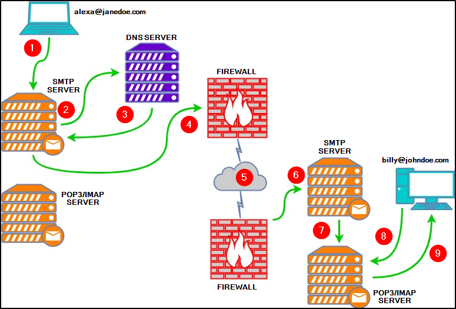

Below is an explanation of each numbered point from the above diagram:

1.    Alexa composes an email to Billy (billy@johndoe.com) in her favorite email client. After she's done, she hits the send button.
2.    The SMTP server needs to determine where to send Alexa's email. It queries DNS for information associated with johndoe.com. 
3.    The DNS server obtains the information johndoe.com and sends that information to the SMTP server. 
4.    The SMTP server sends Alexa's email across the Internet to Billy's mailbox at johndoe.com.
5.    In this stage, Alexa's email passes through various SMTP servers and is finally relayed to the destination SMTP server. 
6.    Alexa's email finally reached the destination SMTP server.
7.    Alexa's email is forwarded and is now sitting in the local POP3/IMAP server waiting for Billy. 
8.    Billy logs into his email client, which queries the local POP3/IMAP server for new emails in his mailbox.
9.    Alexa's email is copied (IMAP) or downloaded (POP3) to Billy's email client. 

Lastly, each protocol has its associated default ports and recommended ports. For example, SMTP is port 25.

Read the following article to understand the difference between each [here](https://help.dreamhost.com/hc/en-us/articles/215612887-Email-client-protocols-and-port-numbers).

## Q & A

Q1 What port is classified as Secure Transport (STARTTLS) for SMTP?

A1 587

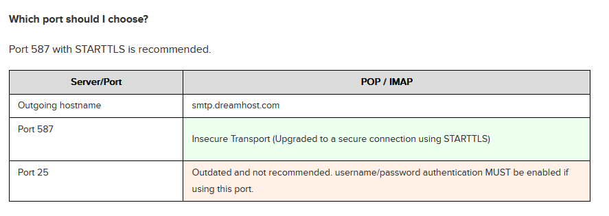

Q2 What port is classified as Secure Transport for IMAP?

A2 993

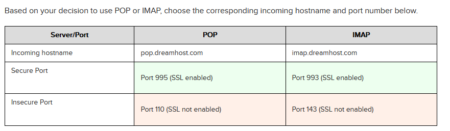

Q3 What port is classified as Secure Transport for POP3?

A3 995

# Email Headers

Great! We know how an email travels from point A to point B and all the protocols involved in the process. 

This task is to understand the components of what makes up an email message when it arrives in an inbox.

This understanding is necessary if you wish to analyze potentially malicious emails manually. 

Before we begin, we need to understand that there are two parts to an email:

-    the email header (information about the email, such as the email servers that relayed the email)
-    the email body (text and/or HTML formatted text)

The syntax for email messages is known as the Internet Message Format (IMF).

Let's look at email headers first. 

What do you look for when analyzing a potentially malicious email?

Let's start with the following email header fields:

- 1   From - the sender's email address
- 2   Subject - the email's subject line
- 3   Date - the date when the email was sent
- 4   To - the recipient's email address

This is usually clearly visible in any email client. Let's look at an example of these fields in the below image.

Warning: This is a snippet from an actual email. The email in the below image is from a honeypot Yahoo email address. Don't engage/interact with the email addresses or IP addresses revealed in this room.

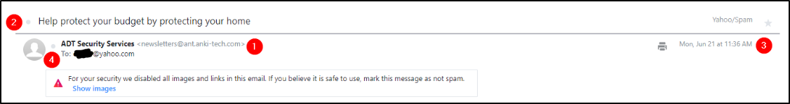

Note: The numbers in the above image correspond to the email header fields bullet list above.

Another method to obtain the same email header information, and more, is by viewing the 'raw' email details.

When looking at an email header in detail, it can be intimidating at first, but it's not so bad if you know what to look for. 

Note: Depending on your email client, whether a web client or a desktop app, the steps to view these email header fields will vary, but the concept is the same. 

In the below image, you can see how to view this information within Yahoo.

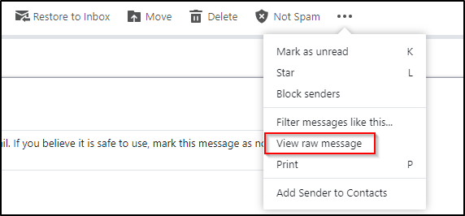

Below is a snippet of the raw message for the email sample.

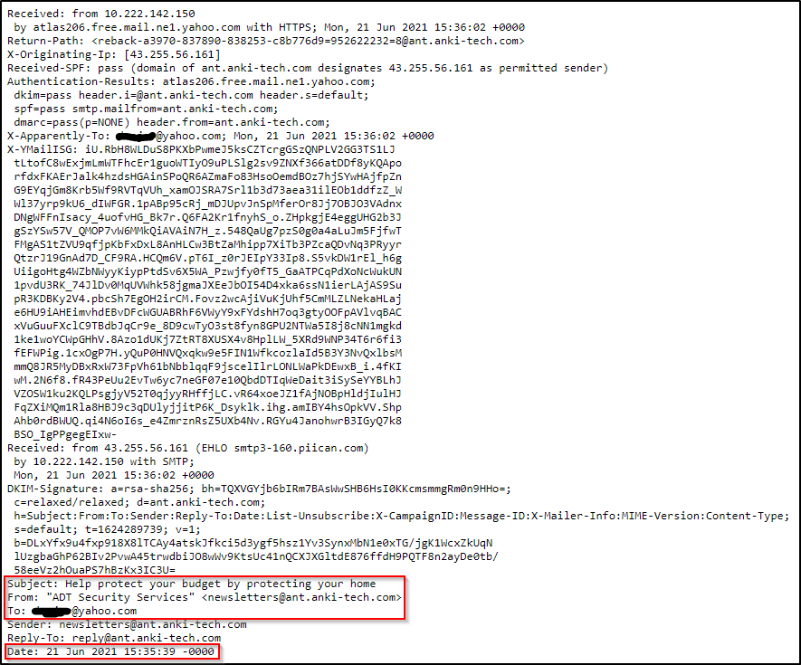

Note: The above image shows some, not all, of the information within an email's header. 

You can review this email in the Email Samples directory on the Desktop within the attached virtual machine. The email is titled email1.eml. 

From the above image, there are other email header fields of interest. 

-    X-Originating-IP - The IP address of the email was sent from (this is known as an [X-header](https://help.returnpath.com/hc/en-us/articles/220567127-What-are-X-headers-))
-    Smtp.mailfrom/header.from - The domain the email was sent from (these headers are within Authentication-Results)
-    Reply-To - This is the email address a reply email will be sent to instead of the From email address

To clarify, in the email in the sample above, the Sender is newsletters@ant.anki-tech.com, but if a recipient replies to the email, the response will go to reply@ant.anki-tech.com, which is the Reply-To, and NOT to newsletters@ant.anki-tech.com. 

Below is an additional resource from Media Template on how to analyze email headers:

https://web.archive.org/web/20221219232959/https://mediatemple.net/community/products/all/204643950/understanding-an-email-header

Note: The questions below are based on the Media Template article.

## Q & A

Q1 What email header is the same as "Reply-to"?

A1 Return-Path

Q2 Once you find the email sender's IP address, where can you retrieve more information about the IP?

A2  http://www.arin.net/

# Email Body

The email body is the part of the email which contains the text (plain or HTML formatted) the sender wants you to view. 

Below is an example of a text-only email.

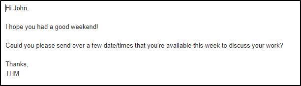

Below is an example of the HTML formatted email.

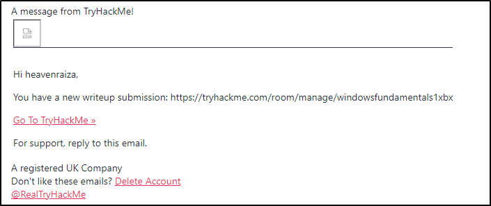

The above email contains an image (which was blocked by the email client) and embedded hyperlinks.

HTML is what makes it possible to add these elements to an email.

To view an email's HTML code is the same approach shown below, but it may vary depending on the webmail client. 

In the example below, the screenshot is from Protonmail. 

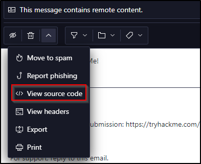

A snippet of the HTML code is shown below.

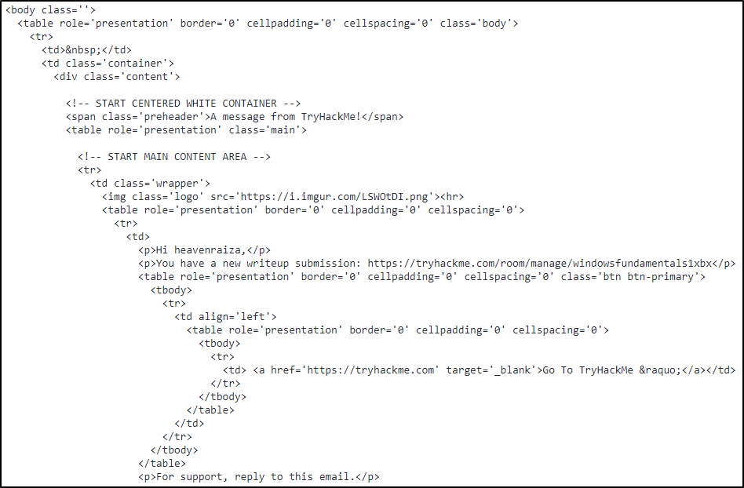

In this specific email web client, Protonmail, the option to switch back to HTML is called "View rendered HTML". 

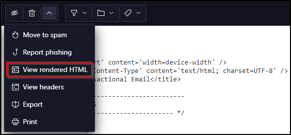

Again, it will be different for other webmail clients.

Lastly, emails may contain attachments. The same premise applies; you can view an email's attachment from an email's HTML format or by viewing the source code. 

Let's look at a few examples below.

The following example is an HTML formatted email from "Netflix" with an attachment. The web client is Yahoo!

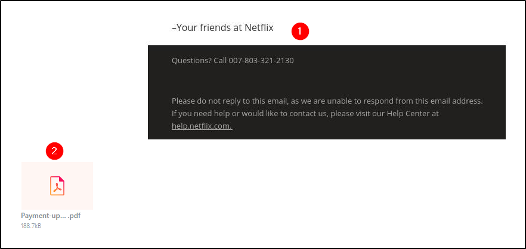

1.    The email body has an image.
2.    The email attachment is a PDF document.

Now let's view this attachment within the source code.

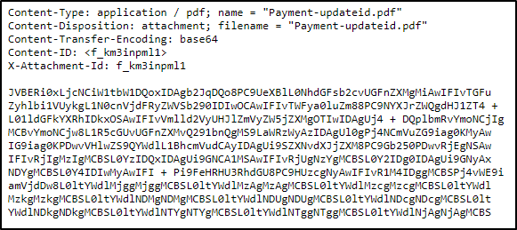

From the above example, we can see the headers associated with this attachment:

-    Content-Type is application/pdf. 
-    Content-Disposition specifies it's an attachment. 
-    Content-Transfer-Encoding tells us it's base64 encoded. 

With the base64 encoded data, you can decode it and save it to your machine.

Warning: When interacting with attachments, proceed with caution and make sure you don't double-click an email's attachment by accident. 

Note: Headers specific to 'content' can be found in various locations within an email message source code, and they're not only associated with attachments. For example, Content-Type can be text/html, and Content-Transfer-Encoding can have other values, such as 8bit. 

## Q & A

Q1 In the above screenshots, what is the URI of the blocked image?

A1 hxxps[://]i[.]imgur[.]com/LSWOtDI[.]png

Note: you need to put the regular URI not the defanged version

Q2 In the screenshots above, what is the name of the PDF attachment?

A2 Payment-updateid.pdf

Q3 In the attached virtual machine, view the information in email2.txt and reconstruct the PDF using the base64 data. What is the text within the PDF?

A3 THM{BENIGN_PDF_ATTACHMENT}

copy the base64 encrypted text from email2.txt into a new file emailBase64.txt
and decrypt it into the answer.pdf file using the terminal

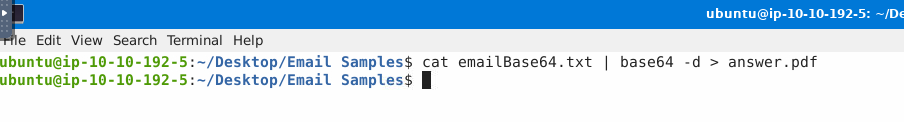

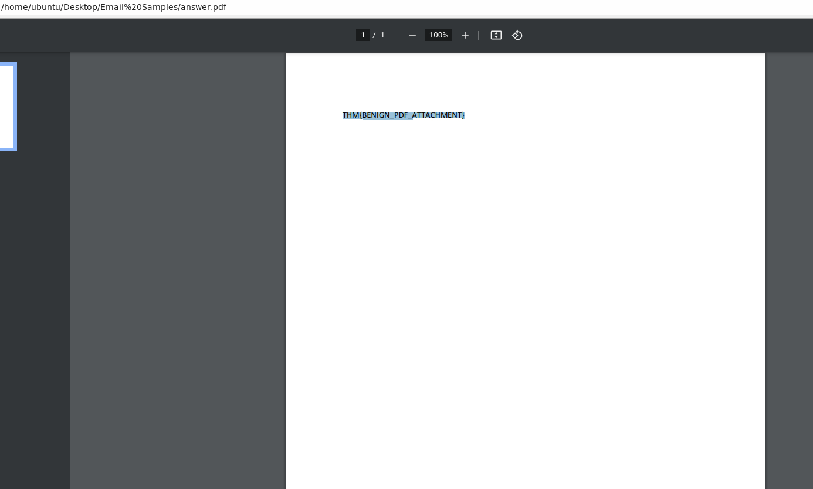

# Types of Phishing

Now that we covered the general concepts regarding emails and how they travel from sender to recipient, we can now talk about how this method of communication is used for nefarious purposes. 

Different types of malicious emails can be classified as one of the following:

-    Spam - unsolicited junk emails sent out in bulk to a large number of recipients. The more malicious variant of Spam is known as MalSpam.
-    Phishing -  emails sent to a target(s) purporting to be from a trusted entity to lure individuals into providing sensitive information. 
-    Spear phishing - takes phishing a step further by targeting a specific individual(s) or organization seeking sensitive information.  
-    Whaling - is similar to spear phishing, but it's targeted specifically to C-Level high-position individuals (CEO, CFO, etc.), and the objective is the same. 
-    Smishing - takes phishing to mobile devices by targeting mobile users with specially crafted text messages. 
-    Vishing - is similar to smishing, but instead of using text messages for the social engineering attack, the attacks are based on voice calls. 

When it comes to phishing, the modus operandi is usually the same depending on the objective of the email.

For example, the objective can be to harvest credentials, and another is to gain access to the computer. 

Below are typical characteristics phishing emails have in common:

-    The sender email name/address will masquerade as a trusted entity (email spoofing)
-    The email subject line and/or body (text) is written with a sense of urgency or uses certain keywords such as Invoice, Suspended, etc. 
-    The email body (HTML) is designed to match a trusting entity (such as Amazon)
-    The email body (HTML) is poorly formatted or written (contrary from the previous point)
-    The email body uses generic content, such as Dear Sir/Madam. 
-    Hyperlinks (oftentimes uses URL shortening services to hide its true origin)
-    A malicious attachment posing as a legitimate document

We'll look at each of these techniques (characteristics) in greater detail in the next room within the Phishing module.

Reminder: When dealing with hyperlinks and attachments, you need to be careful not to accidentally click on the hyperlink or the attachment. 

Hyperlinks and IP addresses should be 'defanged'. Defanging is a way of making the URL/domain or email address unclickable to avoid accidental clicks, which may result in a serious security breach. It replaces special characters, like "@" in the email or "." in the URL, with different characters. For example, a highly suspicious domain, http://www.suspiciousdomain.com, will be changed to hxxp[://]www[.]suspiciousdomain[.]com before forwarding it to the SOC team for detection. CyberChef is a great tool that can help you with defanging, try it out for the following questions!

Analyze the email titled email3.eml within the virtual machine and answer the questions below.

Note: Alexa is the victim, and Billy is the analyst assigned to the case. Alexa forwarded the email to Billy for analysis. 

## Q & A 

Q1 What trusted entity is this email masquerading as?

A1 Home Depot

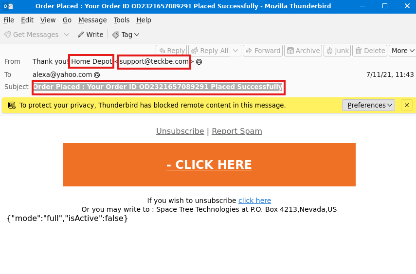

Q2 What is the sender's email?

A2 support@teckbe.com

Q3 What is the subject line? 

A3 Order Placed : Your Order ID OD2321657089291 Placed Successfully

Q4 What is the website for the - CLICK HERE URL in a defanged format? (e.g. https://website.thm)

A4 hxxp[://]t[.]teckbe[.]com

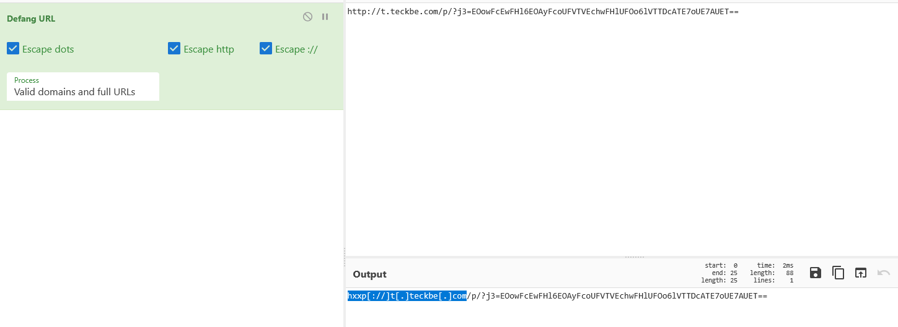

# Conclusion

Before ending this room, you should know what BEC (Business Email Compromise) means.

A BEC is when an adversary gains control of an internal employee's account and then uses the compromised email account to convince other internal employees to perform unauthorized or fraudulent actions. 

Tip: You should be familiar with this term. I have heard this question asked before in a job interview. 
Within this room, we covered the following:

-    What makes up an email address?
-    How an email travels from sender to recipient.
-    How to view the source code of an email header.
-    How to view the source code of an email body. 
-    Understand the pertinent information we should obtain from an email we're analyzing.
-    Some common techniques attackers use in spam and phishing email campaigns.

In the upcoming Phishing Analysis series, we'll look at samples of various common techniques used in phishing email campaigns, along with tools to assist us with analyzing an email header and email body. 

## Q & A

Q1 What is BEC?

A1 Business Email Compromise