# Introduction

Remember from Phishing Room 1; we covered how to manually sift through the email raw source code to extract information. 

In this room, we will look at various tools that will aid us in analyzing phishing emails. We will: 

-    Look at tools that will aid us in examining email header information.
-    Cover techniques to obtain hyperlinks in emails, expand the URLs if they're URL shortened.
-    Look into tools to give us information about potentially malicious links without directly interacting with a malicious link.
-    Cover techniques to obtain malicious attachments from phishing emails and use malware sandboxes to detonate the attachments to understand further what the attachment was designed to do.

Warning: The samples throughout this room contain information from actual spam and/or phishing emails. Proceed with caution if you attempt to interact with any IP, domain, attachment, etc.


# What information should we collect?

In this task, we will outline the steps performed when analyzing a suspicious or malicious email. 

Below is a checklist of the pertinent information an analyst (you) is to collect from the email header:

-    Sender email address
-    Sender IP address
-    Reverse lookup of the sender IP address
-    Email subject line
-    Recipient email address (this information might be in the CC/BCC field)
-    Reply-to email address (if any)
-    Date/time

Afterward, we draw our attention to the email body and attachment(s) (if any).

Below is a checklist of the artifacts an analyst (you) needs to collect from the email body:

-    Any URL links (if an URL shortener service was used, then we'll need to obtain the real URL link)
-    The name of the attachment
-    The hash value of the attachment (hash type MD5 or SHA256, preferably the latter)

Warning: Be careful not to click on any links or attachments in the email accidentally.


# Email header analysis

Some of the pertinent information that we need to collect can be obtained visually from an email client or web client (such as Gmail, Yahoo!, etc.). But some information, such as the sender's IP address and reply-to information, can only be obtained via the email header.

In "Phishing Analysis Fundametals", we saw how to obtain this information manually by sifting through an email's source code.

## Below we'll look at some tools that will help us retrieve this information.

First up to bat is a tool from Google that can assist us with analyzing email headers called `Messageheader` from the `Google Admin Toolbox`. 

Per the [site](https://toolbox.googleapps.com/apps/main/), "Messageheader analyzes SMTP message headers, which help identify the root cause of delivery delays. You can detect misconfigured servers and mail-routing problems".

Usage: Copy and paste the entire email header and run the analysis tool. 

-    `Messageheader`: https://toolbox.googleapps.com/apps/messageheader/analyzeheader

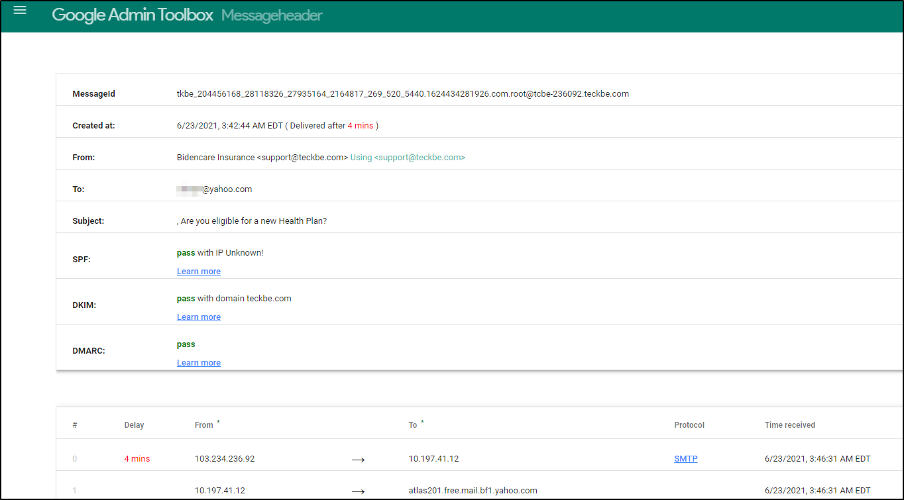

Another tool is called `Message Header Analyzer`. 

-    `Message Header Analyzer`: https://mha.azurewebsites.net/

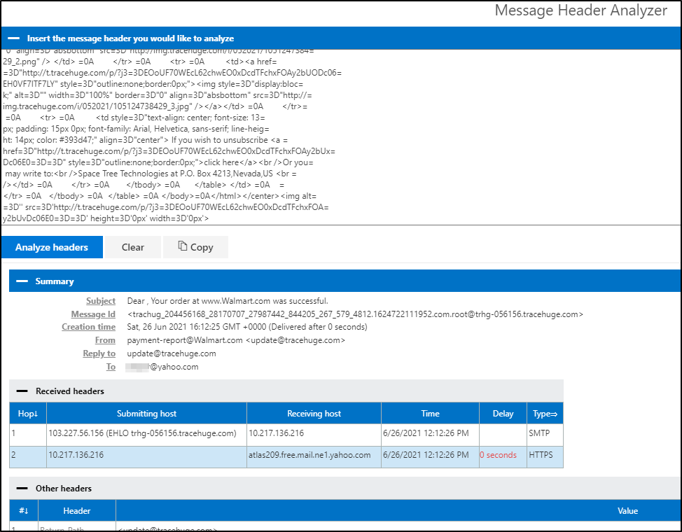

- Lastly, you can also use `mailheader.org`.

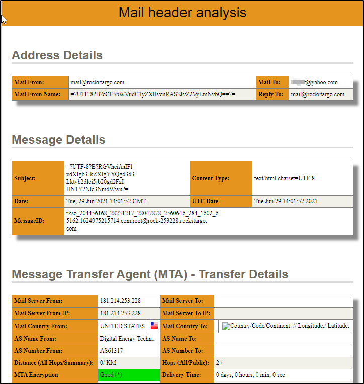

Even though not covered in the previous Phishing rooms, a Message Transfer Agent (MTA) is software that transfers emails between sender and recipient. Read more about MTAs [here](https://csrc.nist.gov/glossary/term/mail_user_agent). 
Since we're on the subject, read about MUAs (Mail User Agent) [here](https://csrc.nist.gov/glossary/term/mail_user_agent). 

Note: The option on which tool to use rests ultimately on you. It is good to have multiple resources to refer to as each tool might reveal information that another tool may not reveal. 

## The tools below can help you analyze information about the sender's IP address:

-    `IPinfo.io`: https://ipinfo.io/

Per the site, "With IPinfo, you can pinpoint your users’ locations, customize their experiences, prevent fraud, ensure compliance, and so much more".

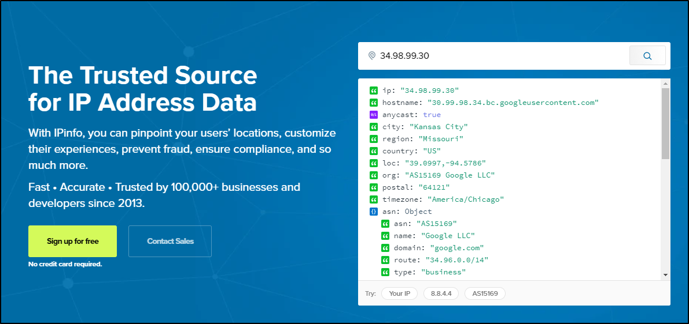

-    `URLScan.io`: https://urlscan.io/

Per the [site](https://urlscan.io/about/), "urlscan.io is a free service to scan and analyse websites. When a URL is submitted to urlscan.io, an automated process will browse to the URL like a regular user and record the activity that this page navigation creates. This includes the domains and IPs contacted, the resources (JavaScript, CSS, etc) requested from those domains, as well as additional information about the page itself. urlscan.io will take a screenshot of the page, record the DOM content, JavaScript global variables, cookies created by the page, and a myriad of other observations. If the site is targeting the users one of the more than 400 brands tracked by urlscan.io, it will be highlighted as potentially malicious in the scan results".

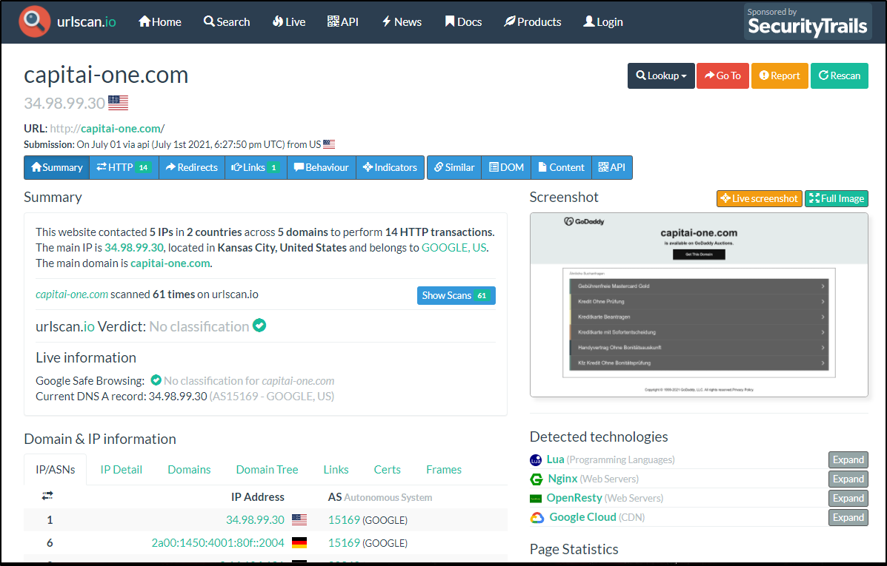

Notice that urlscan.io provides a screenshot of the URL. This screenshot is provided, so you don't have to navigate to the URL in question explicitly.

You can use other tools that provide the same functionality and more, such as [URL2PNG](https://www.url2png.com/) and [Wannabrowser](https://www.wannabrowser.net/).

-    `Talos Reputation Center`: https://talosintelligence.com/reputation

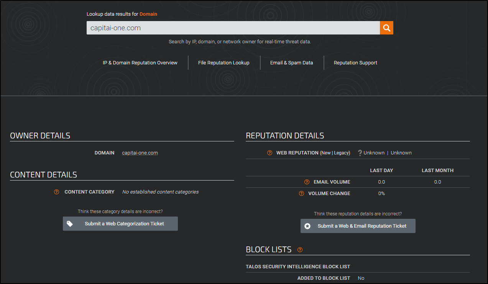


## Q & A

Q1 What is the official site name of the bank that capitai-one.com tried to resemble?

A1 capitalone.com


# Email body analysis

Now it's time to direct your focus to the email body. This is where the malicious payload may be delivered to the recipient either as a link or an attachment. 

Links can be extracted manually, either directly from an HTML formatted email or by sifting through the raw email header.

Below is an example of obtaining a link manually from an email by right-clicking the link and choosing Copy Link Location. 

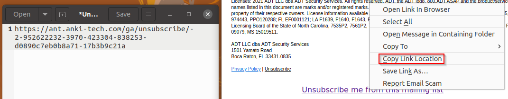

The same can be accomplished with the assistance of a tool. One tool that can aid us with this task is URL Extractor. 

-    `URL Extractor`: https://www.convertcsv.com/url-extractor.htm

You can copy and paste the raw header into the text box for Step 1: Select your input. 

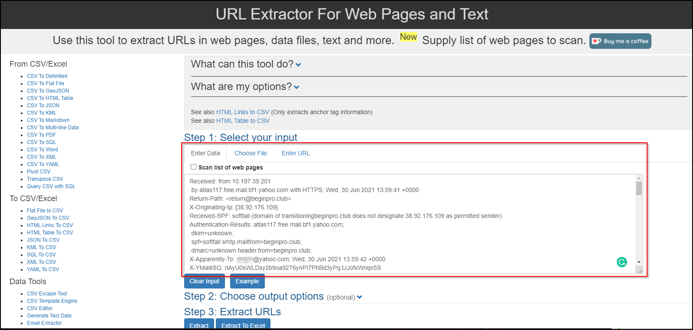

The extracted URLs are visible in Step 3. 

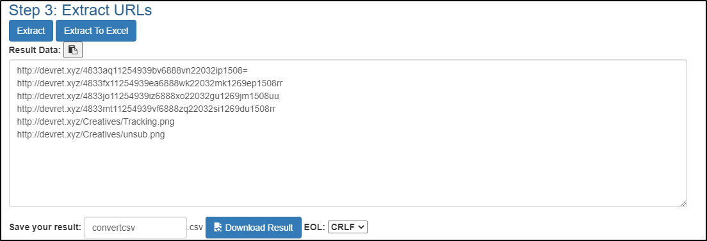

-   You may also use `CyberChef` to extract URLs with the Extract URLs recipe.

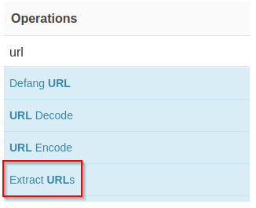

Tip: It's important to note the root domain for the extracted URLs. You will need to perform an analysis on the root domain as well. 

After extracting the URLs, the next step is to check the reputation of the URLs and root domain. You can use any of the tools mentioned in the previous task to aid you with this. 

If the email has an attachment, you'll need to obtain the attachment safely. Accomplishing this is easy in Thunderbird by using the Save button.

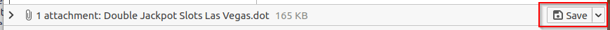

After you have obtained the attachment, you can then get its hash. You can check the file's reputation with the hash to see if it's a known malicious document.

```        
user@machine$ sha256sum Double\ Jackpot\ Slots\ Las\ Vegas.dot
c650f397a9193db6a2e1a273577d8d84c5668d03c06ba99b17e4f6617af4ee83  Double Jackpot Slots Las Vegas.dot
```

There are many tools available to help us with this, but we'll focus on two primarily; they are listed below:

-    `Talos File Reputation`: https://talosintelligence.com/talos_file_reputation

Per the [site](https://talosintelligence.com/talos_file_reputation), "The Cisco Talos Intelligence Group maintains a reputation disposition on billions of files. This reputation system is fed into the AMP, FirePower, ClamAV, and Open-Source Snort product lines. The tool below allows you to do casual lookups against the Talos File Reputation system. This system limits you to one lookup at a time, and is limited to only hash matching. This lookup does not reflect the full capabilities of the Advanced Malware Protection (AMP) system".     

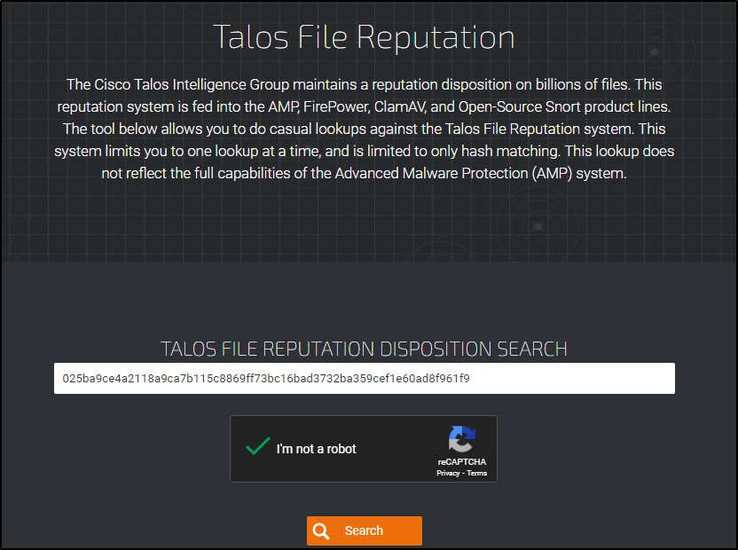

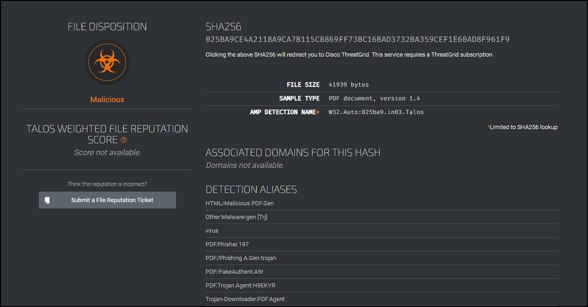

-    `VirusTotal`: https://www.virustotal.com/gui/

Per the [site](https://www.virustotal.com/gui/), "Analyze suspicious files and URLs to detect types of malware, automatically share them with the security community."

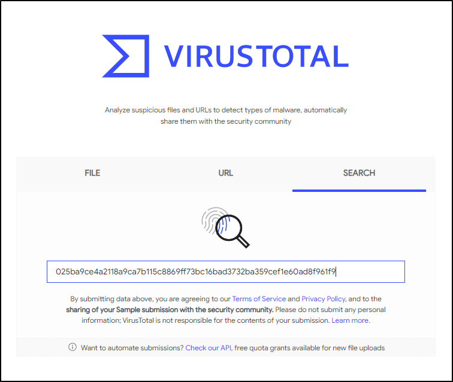

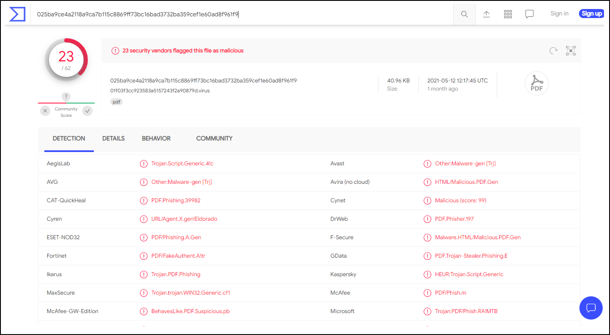

-    Another tool/company worth mentioning is [Reversing Labs](https://www.reversinglabs.com/), which also has a file reputation [service](https://register.reversinglabs.com/file_reputation). 


## Q & A

Q1 How can you manually get the location of a hyperlink?

A1 Copy Link Location


# Malware Sandbox

Luckily as Defenders, we don't need to have malware analysis skills to dissect and reverse engineer a malicious attachment to understand the malware better. 

There are online tools and services where malicious files can be uploaded and analyzed to better understand what the malware was programmed to do. These services are known as malware sandboxes. 

For instance, we can upload an attachment we obtained from a potentially malicious email and see what URLs it attempts to communicate with, what additional payloads are downloaded to the endpoint, persistence mechanisms, Indicators of Compromise (IOCs), etc. 

Some of these online malware sandboxes are listed below.

-    `Any.Run`: https://app.any.run/

Per the [site](https://app.any.run/), "Analyze a network, file, module, and the registry activity. Interact with the OS directly from a browser. See the feedback from your actions immediately".

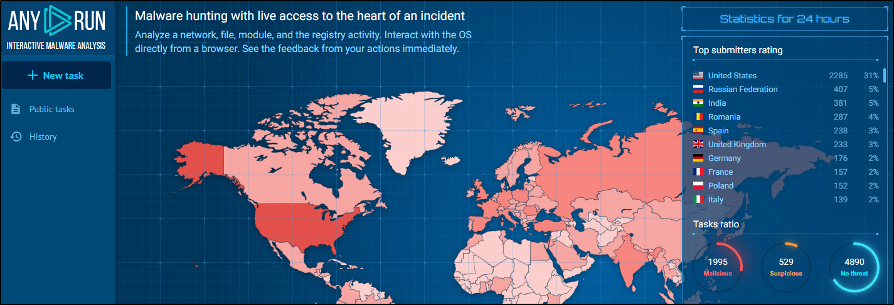

-    `Hybrid Analysis`: https://www.hybrid-analysis.com/

Per the site, "This is a free malware analysis service for the community that detects and analyzes unknown threats using a unique Hybrid Analysis technology."

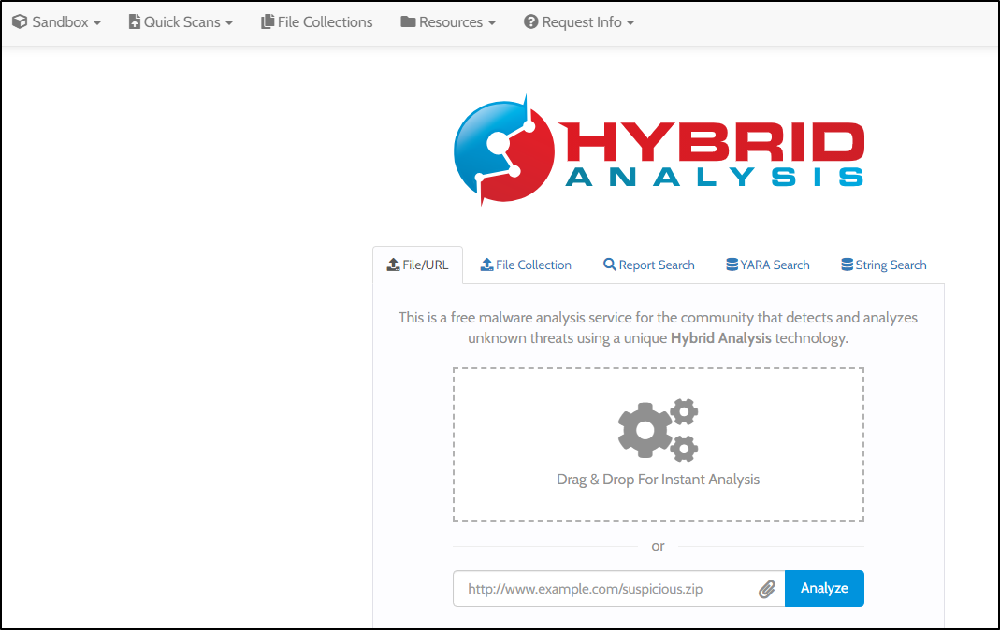

-    `Joesecurity`: https://www.joesecurity.org/

Per the site, "Joe Sandbox empowers analysts with a large spectrum of product features. Among them: Live Interaction, URL Analysis & AI based Phishing Detection, Yara and Sigma rules support, MITRE ATT&CK matrix, AI based malware detection, Mail Monitor, Threat Hunting & Intelligence, Automated User Behavior, Dynamic VBA/JS/JAR instrumentation, Execution Graphs, Localized Internet Anonymization and many more".

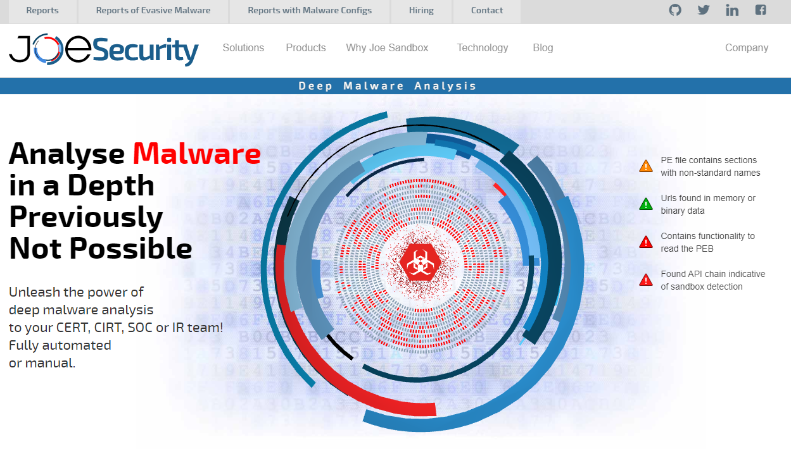


# PhishTool

A tool that will help with automated phishing analysis is [PhishTool](https://www.phishtool.com/).

Yes, I saved this for last! What is PhishTool?

Per the site, "Be you a security researcher investigating a new phish-kit, a SOC analyst responding to user reported phishing, a threat intelligence analyst collecting phishing IoCs or an investigator dealing with email-born fraud.

PhishTool combines threat intelligence, OSINT, email metadata and battle tested auto-analysis pathways into one powerful phishing response platform. Making you and your organisation a formidable adversary - immune to phishing campaigns that those with lesser email security capabilities fall victim to."

Note: There is a free community edition you can download and use. :)

I uploaded a malicious email to PhishTool and connected VirusTotal to my account using my community edition API key. 

Below are a few screenshots of the malicious email and the PhishTool interface. 

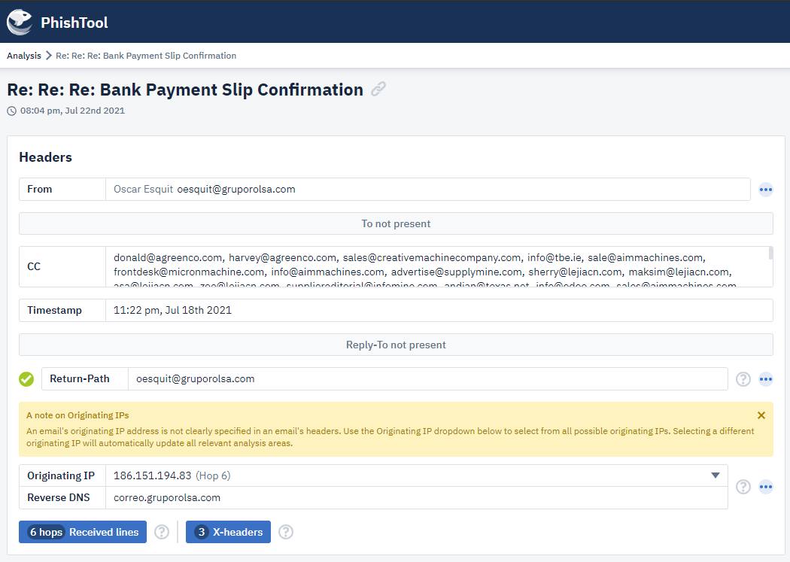

From the image above, you can see the PhishTool conveniently grabs all the pertinent information we'll need regarding the email.

-    Email sender
-    Email recipient (in this case, a long list of CCed email addresses)
-    Timestamp
-    Originating IP and Reverse DNS lookup

We can obtain information about the SMTP relays, specific X-header information, and IP info information.

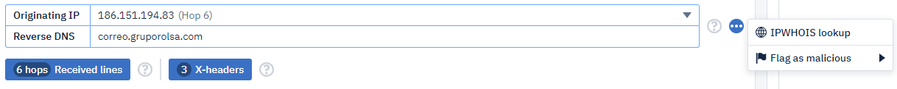

Below is a snippet of Hop 1 of 6 (SMTP relays).

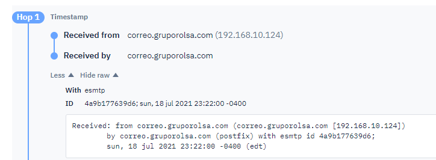

Notice that the tool notifies us that `Reply-To no present` although it provides the alternative header information, `Return-Path`.

To the right of the PhishTool dashboard, we can see the email body. There are two tabs across the top that we can toggle to view the email in text format or its HTML source code. 

Text view:

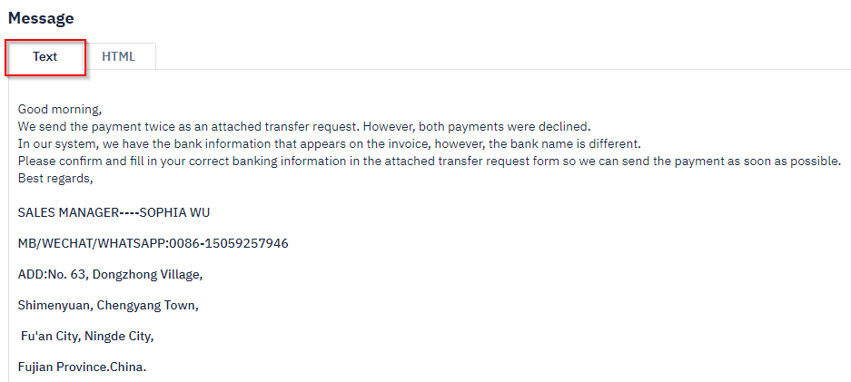

HTML view:

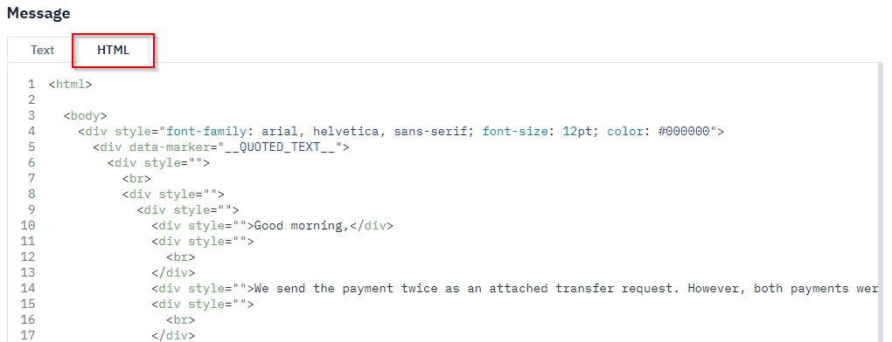

The bottom two panes will display information about attachments and URLs.

The right pane will show if any URLs were found in the email. In this case, no emails were found.

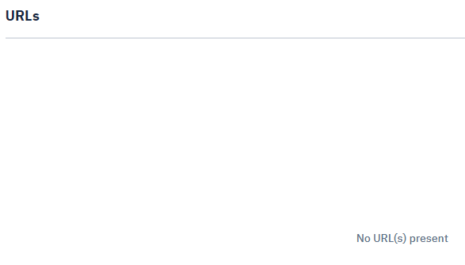

The left pane will show information about the attachment. This particular malicious email has a zip file.

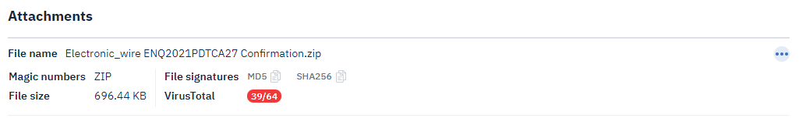

We can automatically get feedback from VirusTotal since our community edition API key is connected.

Here we can grab the zip file name and its hashes without manually interacting with the malicious email.

There is an ellipsis at the far right of the above image. If that is clicked, we are provided additional actions that we can perform with the attachment.

Below is a screenshot of the additional options sub-menu.

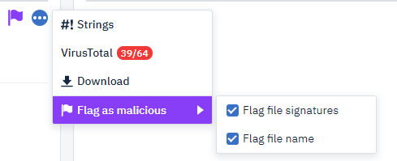

Let's look at the Strings output.

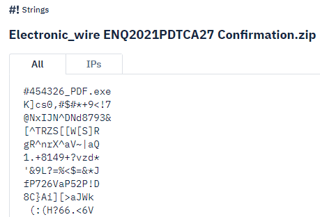

Next, let's look at the information from VirusTotal.

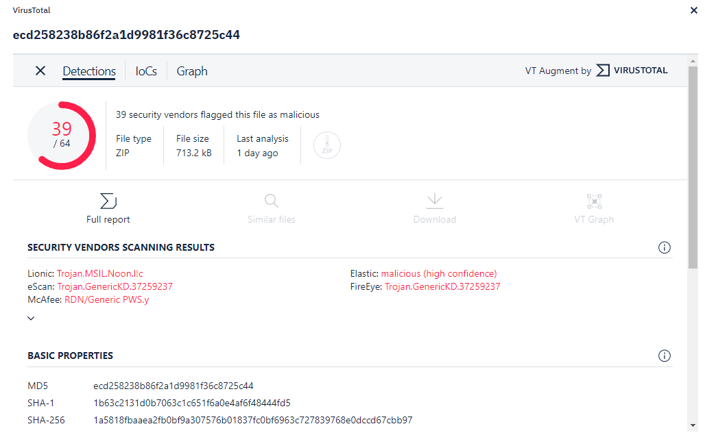

Since the VirusTotal API key is the free community edition, an analyst can manually navigate to VirusTotal and do a file hash search to view more information about this attachment. 

Lastly, any submissions you upload to PhishTool, you can flag as malicious and resolve with notes. Similar to how you would if you were a SOC Analyst.

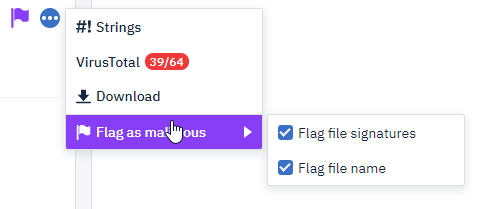

The attachment file name and file hashes will be marked as malicious. Next, click on Resolve.

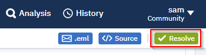

In the next screen, an analyst can mark the email based on dropdown selections. Refer to the GIF below.

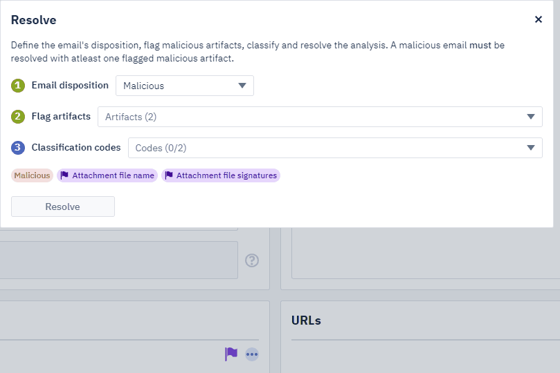

Note: I didn't perform further analysis on the domain name or the IP address. Neither did I perform any research regarding the root domain the email originated from. The attachment can further be analyzed by uploading it to a malware sandbox to see what exactly it's doing, which I did not do. Hence the reason why additional Flag artifacts and Classifications codes weren't selected for this malicious email. :) 

To expand on classification codes briefly, not all phishing emails can be categorized as the same. A classification code allows us to tag a case with a specific code, such as Whaling (high-value target). Not all phishing emails will target a high-value target, such as a Chief Financial Officer (CFO). 


## Q & A

Q1 Look at the Strings output. What is the name of the EXE file?

A1 #454326_PDF.exe


# Phishing Case 1

Scenario: You are a Level 1 SOC Analyst. Several suspicious emails have been forwarded to you from other coworkers. You must obtain details from each email for your team to implement the appropriate rules to prevent colleagues from receiving additional spam/phishing emails. 

Task: Use the tools discussed throughout this room (or use your own resources) to help you analyze each email header and email body. 

Deploy the machine attached to this task; it will be visible in the split-screen view once it is ready.

If you don't see a virtual machine load then click the Show Split View button.

## Q & A

Q1 What brand was this email tailored to impersonate?

A1 Netflix

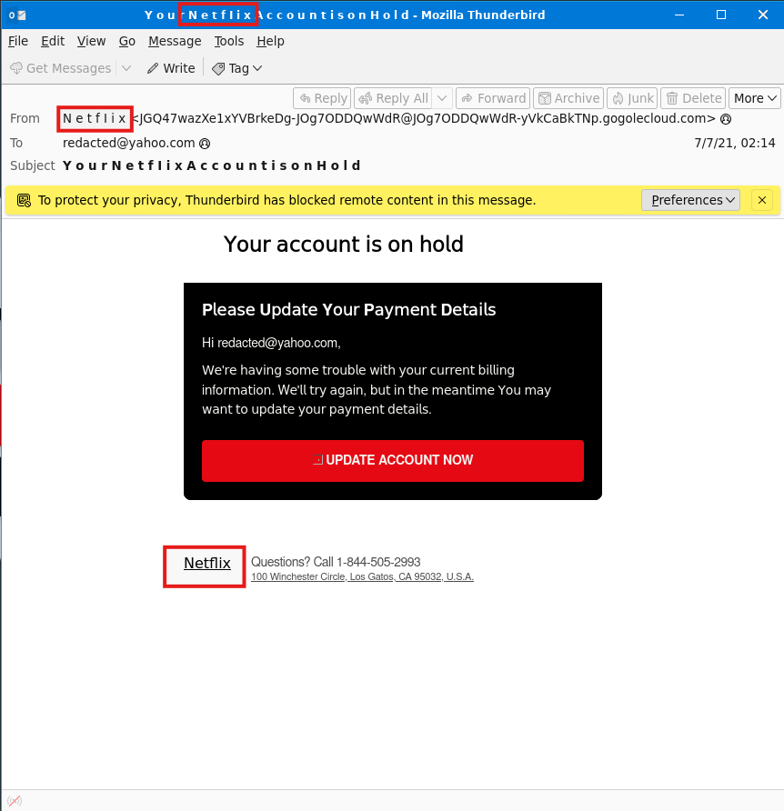

Q2 What is the From email address?

A2 NetfIix<JGQ47wazXe1xYVBrkeDg-JOg7ODDQwWdR@JOg7ODDQwWdR-yVkCaBkTNp.gogolecloud.com>

Q3 What is the originating IP? Defang the IP address. 

A3 209[.]85[.]167[.]226

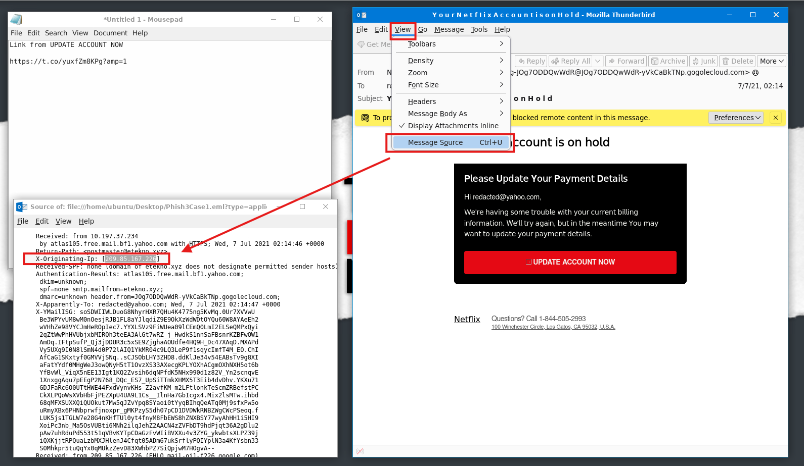

Q4 From what you can gather, what do you think will be a domain of interest? Defang the domain.

A4 etekno[.]xyz

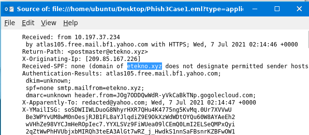

Q5 What is the shortened URL? Defang the URL.

A5 hxxps[://]t[.]co/yuxfZm8KPg?amp==1

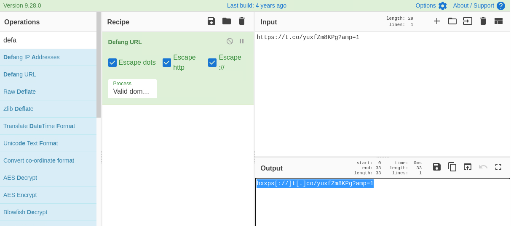


# Phishing Case 2

Scenario: You are a Level 1 SOC Analyst. Several suspicious emails have been forwarded to you from other coworkers. You must obtain details from each email for your team to implement the appropriate rules to prevent colleagues from receiving additional spam/phishing emails. 

A malicious attachment from a phishing email inspected in the previous Phishing Room was uploaded to Any Run for analysis. 

Task: Investigate the analysis and answer the questions below. 

Link: https://app.any.run/tasks/8bfd4c58-ec0d-4371-bfeb-52a334b69f59

## Q & A

Q1 What does AnyRun classify this email as?

A1 Suspicious activity

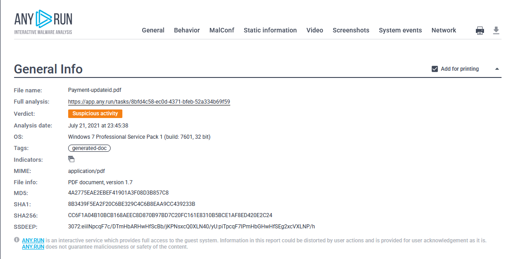

Q2 What is the name of the PDF file?

A2 Payment-updateid.pdf

Q3 What is the SHA 256 hash for the PDF file?

A3 	CC6F1A04B10BCB168AEEC8D870B97BD7C20FC161E8310B5BCE1AF8ED420E2C24

Q4 What two IP addresses are classified as malicious? Defang the IP addresses. (answer: IP_ADDR,IP_ADDR)

A4 2[.]16[.]107[.]24,2[.]16[.]107[.]83

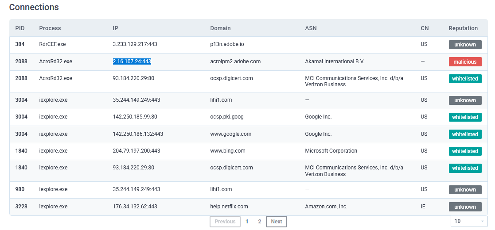
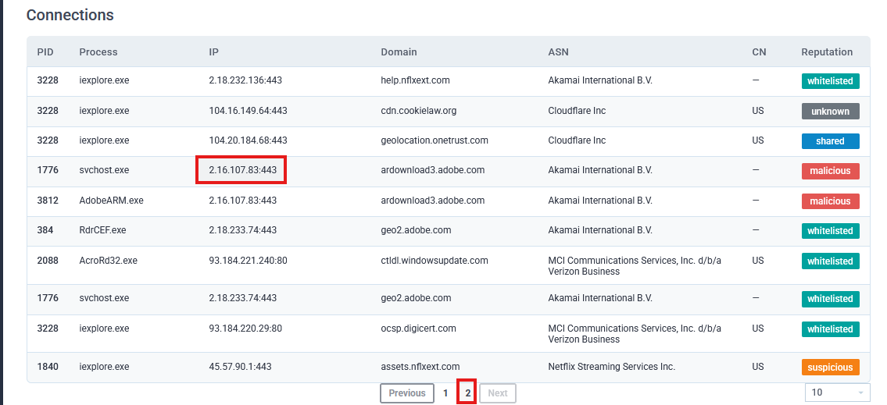

Q5 What Windows process was flagged as Potentially Bad Traffic?

A5 svchost.exe

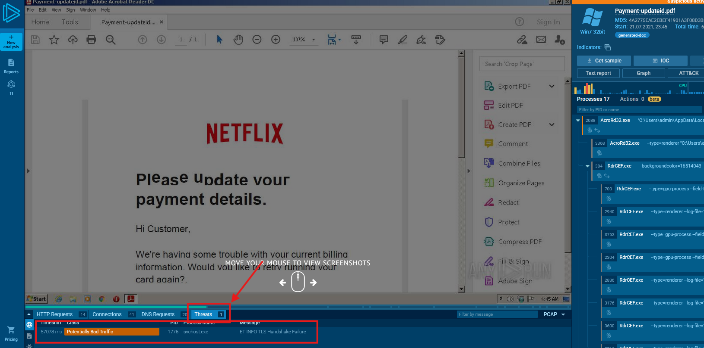

[any run report](phishing-case-2.pdf)

# Phishing Case 3

Scenario: You are a Level 1 SOC Analyst. Several suspicious emails have been forwarded to you from other coworkers. You must obtain details from each email for your team to implement the appropriate rules to prevent colleagues from receiving additional spam/phishing emails. 

A malicious attachment from a phishing email inspected in the previous Phishing Room was uploaded to Any Run for analysis. 

Task: Investigate the analysis and answer the questions below. 

Link: https://app.any.run/tasks/82d8adc9-38a0-4f0e-a160-48a5e09a6e83

## Q & A

Q1 What is this analysis classified as?

A1 Malicious activity

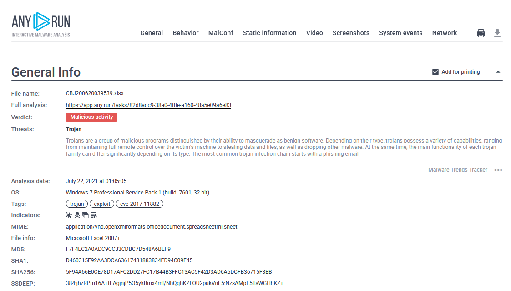

Q2 What is the name of the Excel file?

A2 CBJ200620039539.xlsx

Q3 What is the SHA 256 hash for the file?

A3 	5F94A66E0CE78D17AFC2DD27FC17B44B3FFC13AC5F42D3AD6A5DCFB36715F3EB

Q4 What domains are listed as malicious? Defang the URLs & submit answers in alphabetical order. (answer: URL1,URL2,URL3)

A4 biz9holdings[.]com,findresults[.]site,ww38[.]findresults[.]site

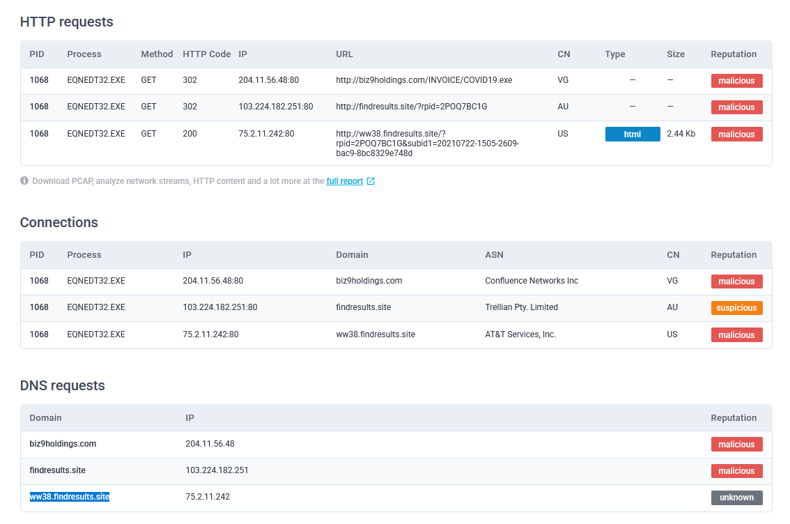

Q5 What IP addresses are listed as malicious? Defang the IP addresses & submit answers from lowest to highest. (answer: IP1,IP2,IP3)

A5 75[.]2[.]11[.]242,103[.]224[.]182[.]251,204[.]11[.]56[.]48

Q6 What vulnerability does this malicious attachment attempt to exploit?

A6 CVE-2017-11882

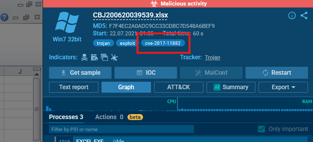

[any run report](phishing-case-3.pdf)

# Conclusion

The tools covered in this room are just some that can help you with analyzing phishing emails. 

As a defender, you'll come up with your own preferred tools and techniques to perform manual and automated analysis. 

Here are a few other tools that we have not covered in detail within this room that deserve a shout:

    https://mxtoolbox.com/
    https://phishtank.com/?
    https://www.spamhaus.org/

That's all, folks! Happy Hunting!
