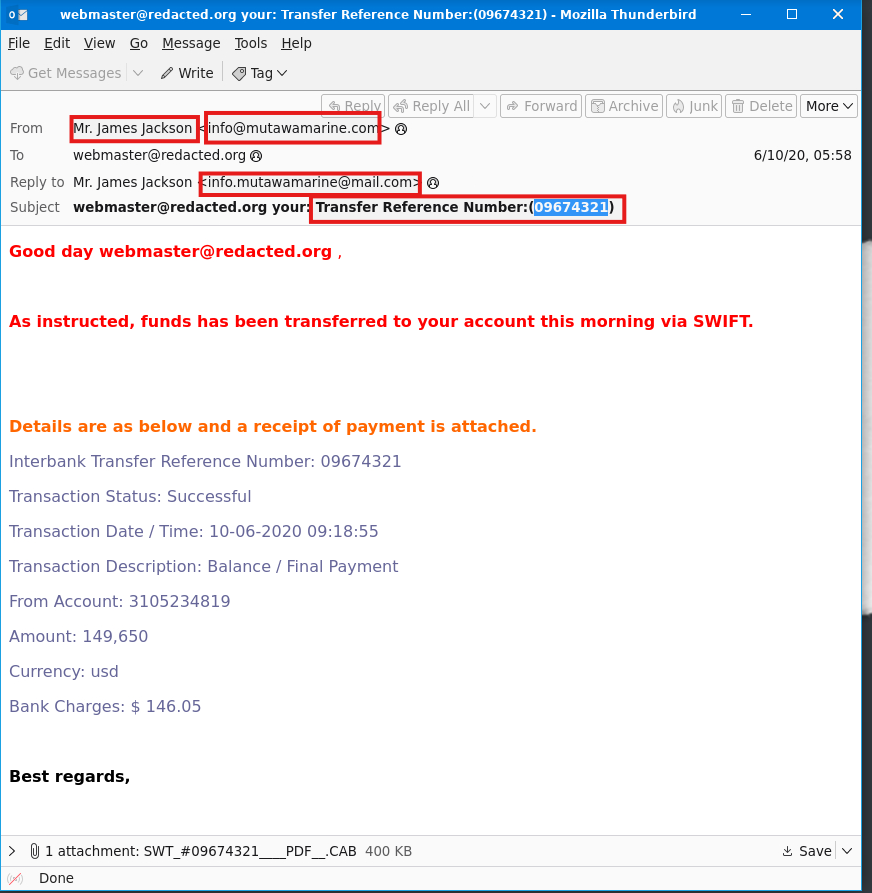
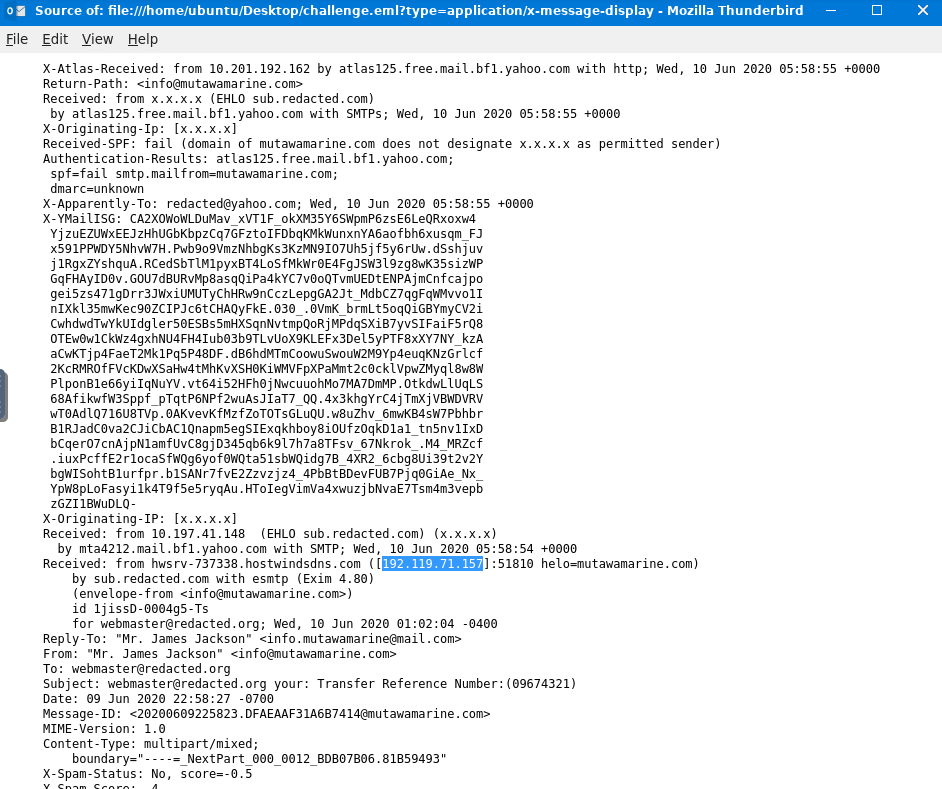
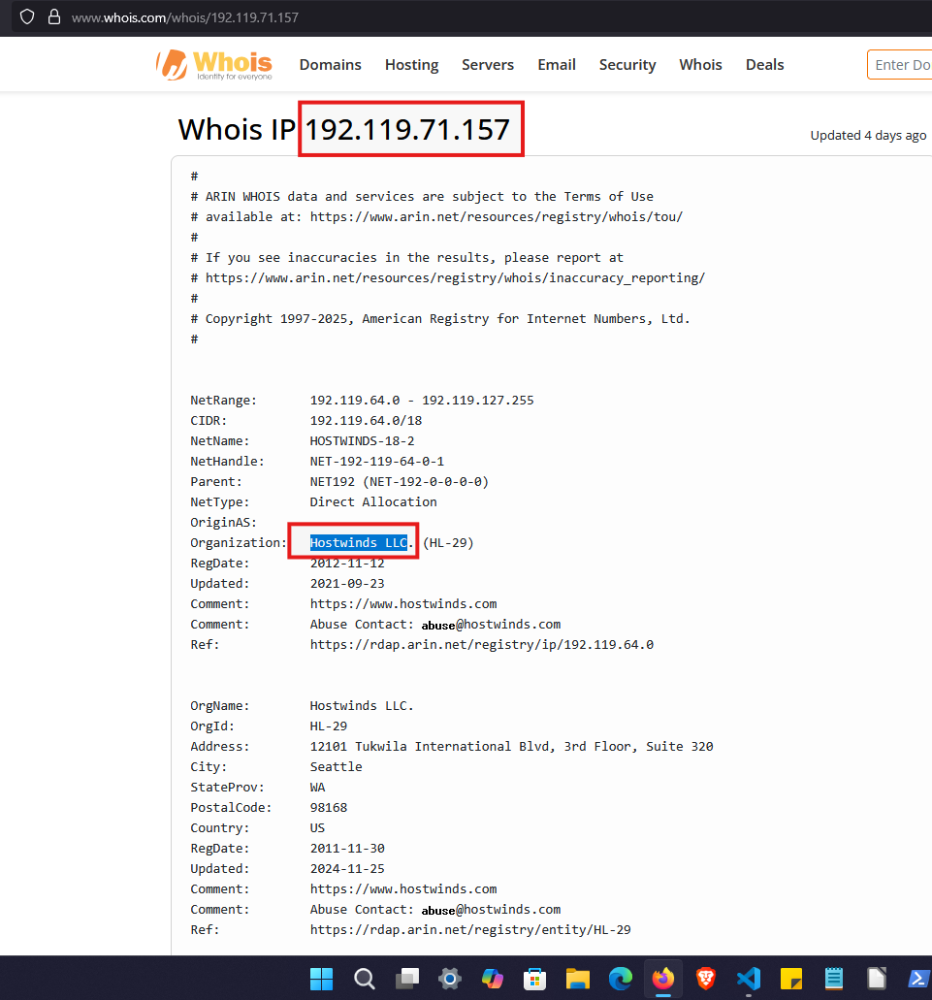
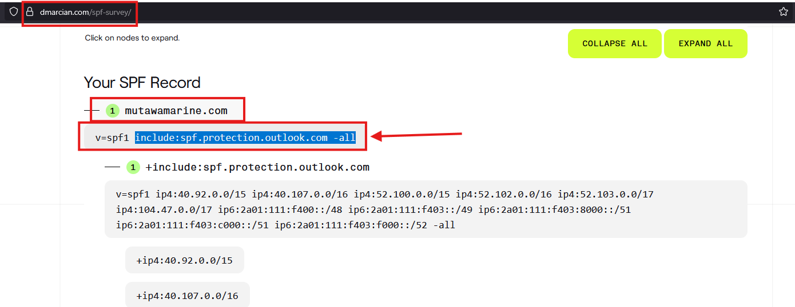
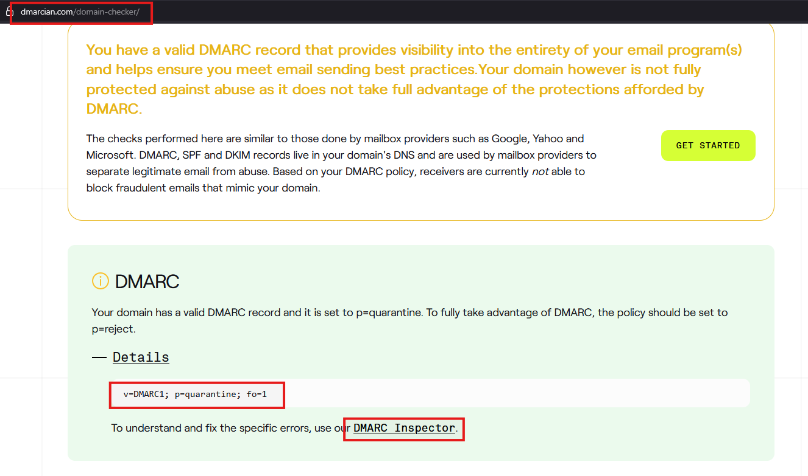
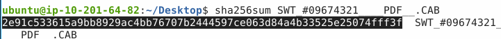
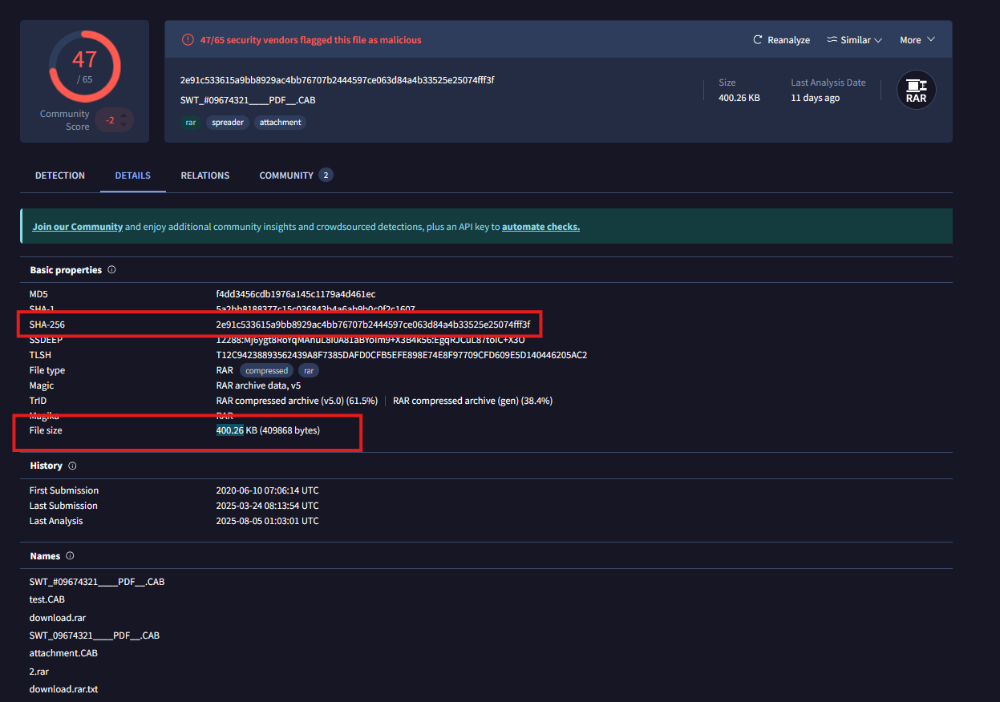

# Just another day as a SOC Analyst

A Sales Executive at Greenholt PLC received an email that he didn't expect to receive from a customer. He claims that the customer never uses generic greetings such as "Good day" and didn't expect any amount of money to be transferred to his account. The email also contains an attachment that he never requested. He forwarded the email to the SOC (Security Operations Center) department for further investigation. 

Investigate the email sample to determine if it is legitimate. 

Tip: Open the EML file with Thunderbird. To do so, right-click on the challenge.eml file and select Open With Other Application. From there, scroll down to select Thunderbird Mail and click Open. It may take a few moments to open the application. You will then see the email and its contents appear in the app.

## Q & A

Q1 What is the Transfer Reference Number listed in the email's Subject?

A1 09674321

Q2 Who is the email from?

A2 Mr. James Jackson

Q3 What is his email address?

A3 info@mutawamarine.com

Q4 What email address will receive a reply to this email? 

A4 info.mutawamarine@mail.com

Q5 What is the Originating IP?

A5 192.119.71.157

Q6 Who is the owner of the Originating IP? (Do not include the "." in your answer.)

A6 Hostwinds LLC

Q7 What is the SPF record for the Return-Path domain?

A7 `v=spf1 include:spf.protection.outlook.com -all`

use dmarcian's spf surveyor tool

Q8 What is the DMARC record for the Return-Path domain?

A8 `v=DMARC1; p=quarantine; fo=1`

use dmarcian's domain checker or DMARC inspector

Q9 What is the name of the attachment?

A9 SWT_#09674321____PDF__.CAB

Q10 What is the SHA256 hash of the file attachment?

A10 2e91c533615a9bb8929ac4bb76707b2444597ce063d84a4b33525e25074fff3f

download the file and find the hash value

Q11 What is the attachments file size? (Don't forget to add "KB" to your answer, NUM KB)

A11 400.26 KB

Q12 What is the actual file extension of the attachment?

A12 RAR

