# Disclaimer

Based on real-world occurrences and past analysis, this scenario presents a narrative with invented names, characters, and events.

Please note: The phishing kit used in this scenario was retrieved from a real-world phishing campaign. Hence, it is advised that interaction with the phishing artefacts be done only inside the attached VM, as it is an isolated environment. 

# An Ordinary Midsummer Day...

As an IT department personnel of SwiftSpend Financial, one of your responsibilities is to support your fellow employees with their technical concerns. While everything seemed ordinary and mundane, this gradually changed when several employees from various departments started reporting an unusual email they had received. Unfortunately, some had already submitted their credentials and could no longer log in.

You now proceeded to investigate what is going on by:

-    Analysing the email samples provided by your colleagues.
-    Analysing the phishing URL(s) by browsing it using Firefox.
-    Retrieving the phishing kit used by the adversary.
-    Using CTI-related tooling to gather more information about the adversary.
-    Analysing the phishing kit to gather more information about the adversary.

## Connecting to the machine

Start the virtual machine in split-screen view by clicking the green Start Machine button on the upper right section of this task. If the VM is not visible, use the blue Show Split View button at the top-right of the page. Alternatively, using the credentials below, you can connect to the VM via RDP.
THM key

- Username 	damianhall
- Password 	Phish321
- IP 	MACHINE_IP 

Note: The phishing emails to be analysed are under the phish-emails directory on the Desktop. Usage of a web browser, text editor and some knowledge of the grep command will help. 

## Q & A

Q1 Who is the individual who received an email attachment containing a PDF?

A1 William McClean

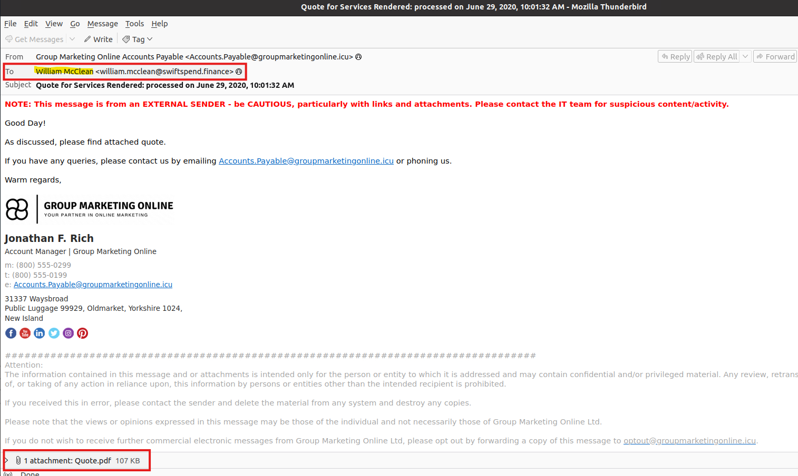

Q2 What email address was used by the adversary to send the phishing emails?

A2 Accounts.Payable@groupmarketingonline.icu

Q3 What is the redirection URL to the phishing page for the individual Zoe Duncan? (defanged format)

A3 hxxp[://]kennaroads[.]buzz/data/Update365/office365/40e7baa2f826a57fcf04e5202526f8bd/?email=zoe[.]duncan@swiftspend[.]finance&error

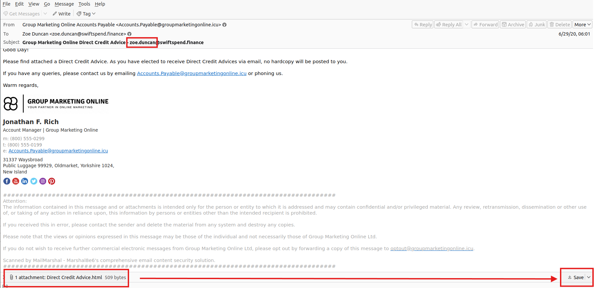

open the attachment in a text editor 

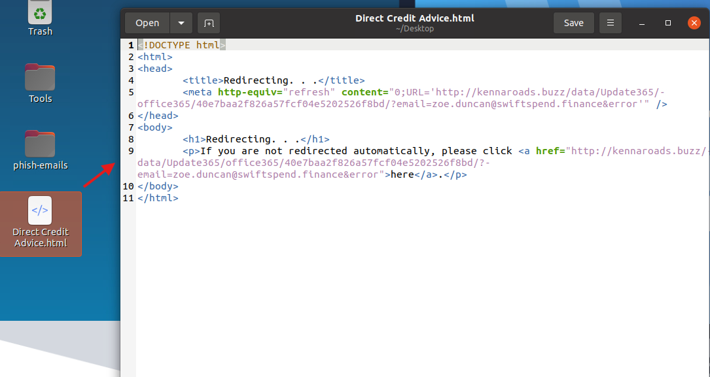

use cyberchef to defang URL

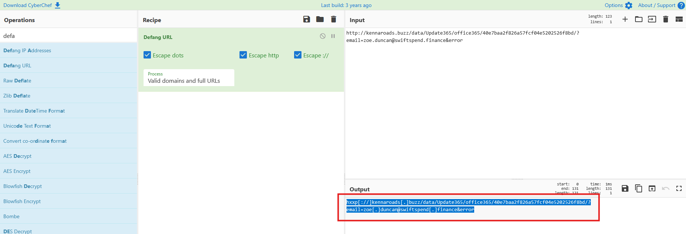

Q4 What is the URL to the .zip archive of the phishing kit? (defanged format)

A4 hxxp[://]kennaroads[.]buzz/data/Update365[.]zip

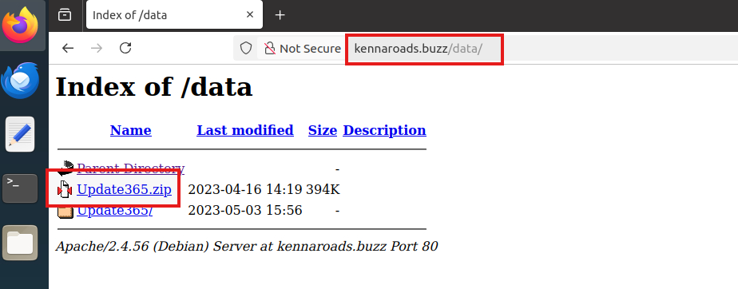

Q5 What is the SHA256 hash of the phishing kit archive?

A5 ba3c15267393419eb08c7b2652b8b6b39b406ef300ae8a18fee4d16b19ac9686

download and check the hash
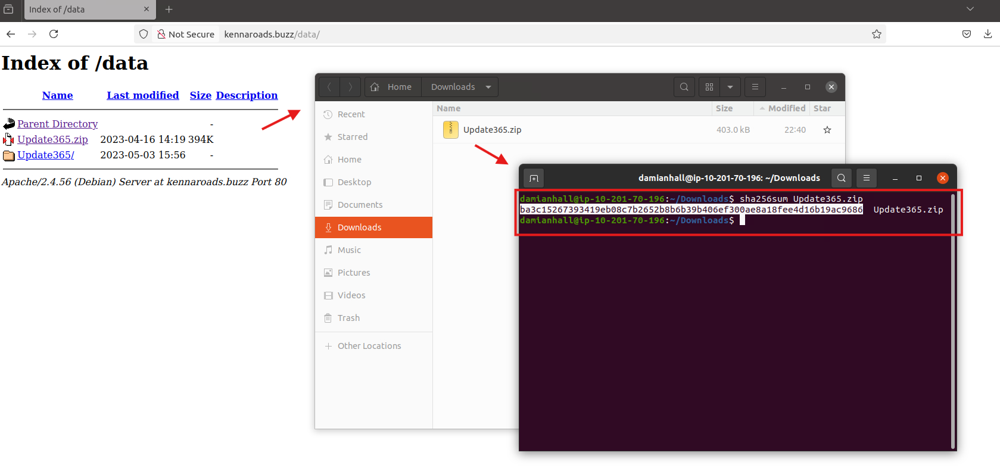

Q6 When was the phishing kit archive first submitted? (format: YYYY-MM-DD HH:MM:SS UTC)

A6 2020-04-08 21:55:50 UTC

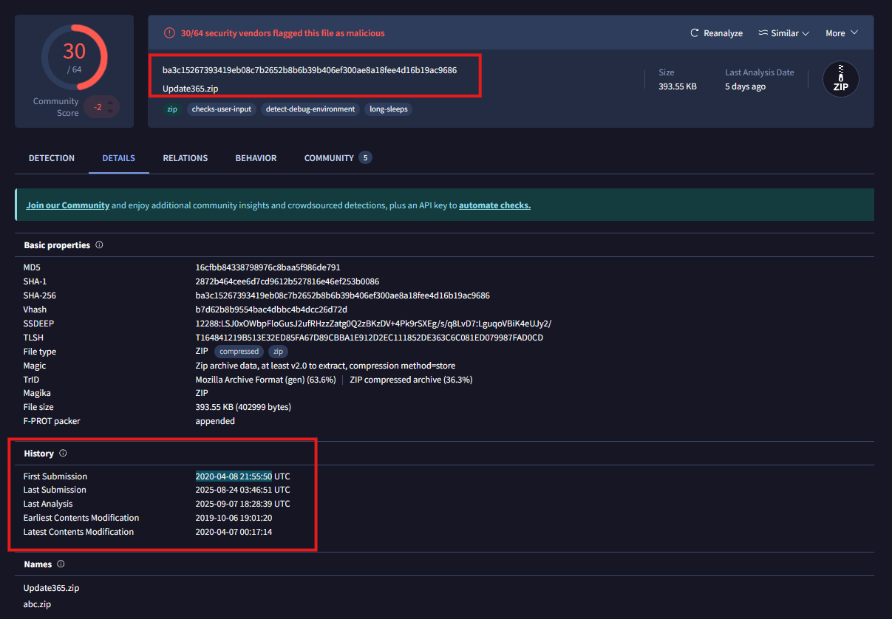

Q7 When was the SSL certificate the phishing domain used to host the phishing kit archive first logged? (format: YYYY-MM-DD)

A7 2020-06-25

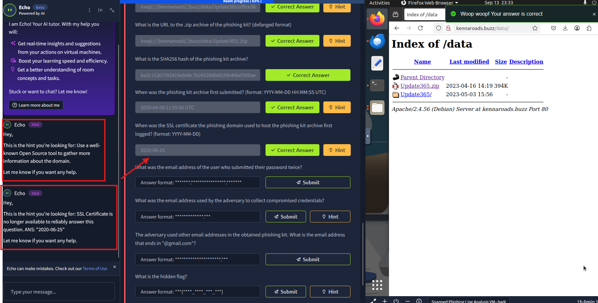

I tried looking at threatbook to find the SSL certificate, none of the dates there matched the answer so I tried the hint and it gave me the answer and and explanation 

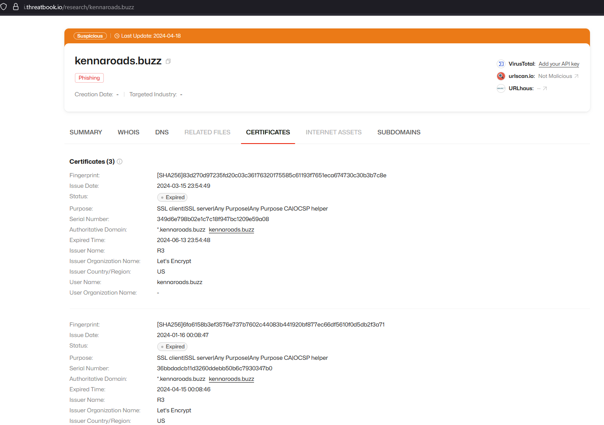

Q8 What was the email address of the user who submitted their password twice?

A8 michael.ascot@swiftspend.finance

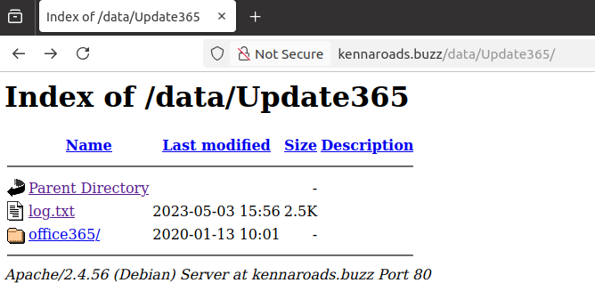

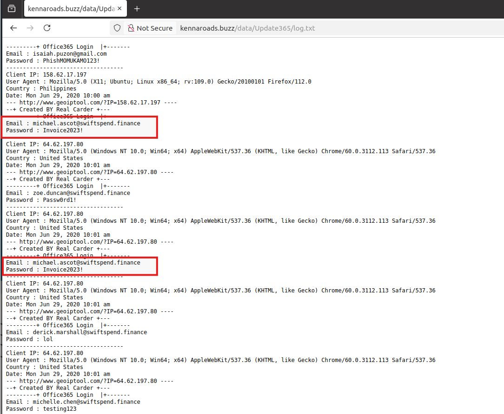

Q9 What was the email address used by the adversary to collect compromised credentials?

A9 m3npat@yandex.com

if you extract the zip file and check the files you can find the `m3npat@yandex.com` email in `submit.php`, `resubmit.php`

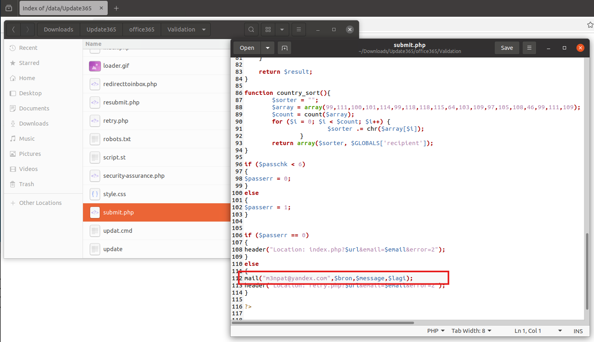

you can use regex to find the emails recursively within the folder

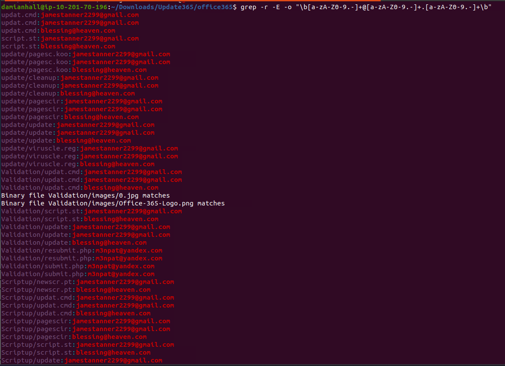

Q10 The adversary used other email addresses in the obtained phishing kit. What is the email address that ends in "@gmail.com"?

A10 jamestanner2299@gmail.com

the email is shown in the previous screeshot where regex is used, you can also use a simple grep recursive search for 'gmail'

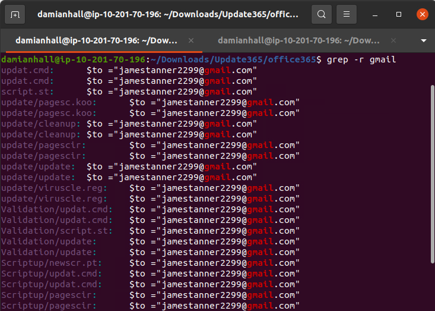

Q11 What is the hidden flag?

A11 THM{pL4y_w1Th_tH3_URL}

Hint

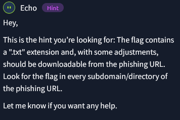

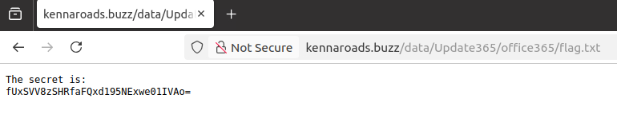

fUxSVV8zSHRfaFQxd195NExwe01IVAo=

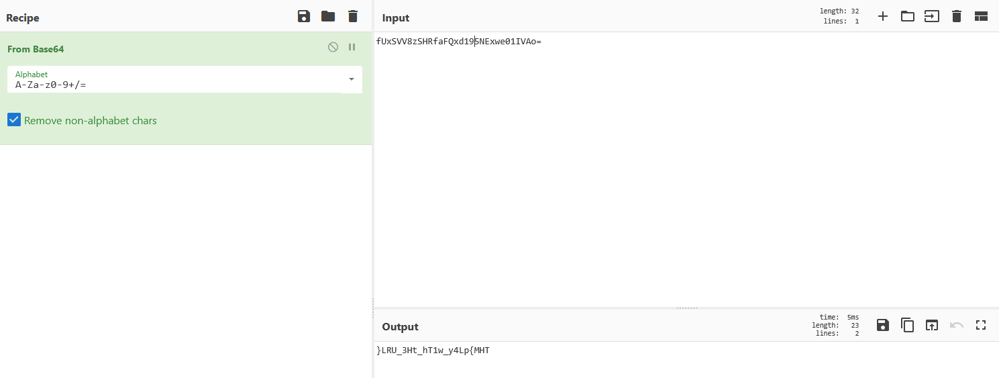

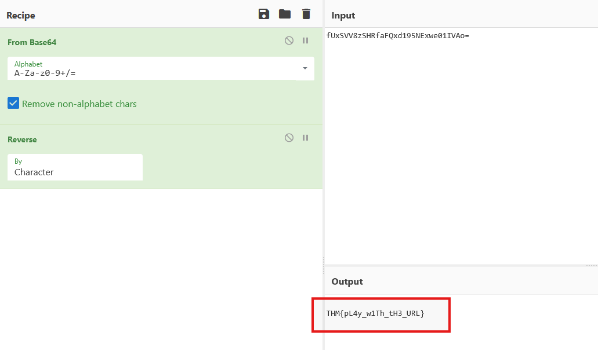